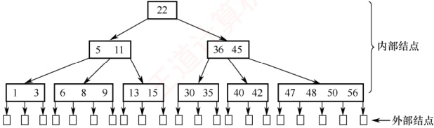
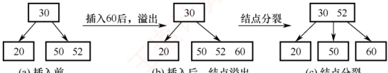
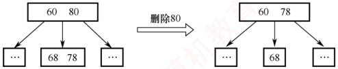
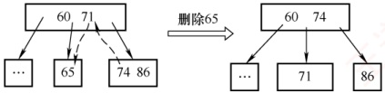
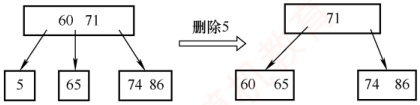
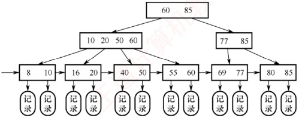

## 7.4 B 树 $^{①}$和 B+树

考研大纲对 B 树和 B+树的要求各不相同：重点考查 B 树，不仅要求理解其基本特点，还要
求掌握其建立、插入和删除操作；而对 B+树，仅考查基本概念。

### 7.4.1 B 树及其基本操作

m 阶 B 树是一种自平衡的 m 路查找树，其所有叶结点都位于同一层次。

### 考点追踪 B 树的定义和特点（2009、2025）

具体而言，一棵 m 阶 B 树或为空树，或为满足以下特性的 m 叉树。

1）每个结点至多有 m 棵子树，即至多包含 m-1 个关键字。

2）若根结点不是叶结点，则至少有2棵子树，即至少包含1个关键字。

3）除根结点外，所有非叶结点至少有 $\left\lceil m/2\right\rceil$棵子树，即至少包含 $\left\lceil m/2\right\rceil-1$个关键字。

4）每个非叶结点的结构如下

| n | $P_{0}$ | $K_{1}$ | $P_{1}$ | $K_{2}$ | $P_{2}$ | ... | $K_{n}$ | $P_{n}$ |
|---|---|---|---|---|---|---|---|---|

其中， $K_{i}$ ( $i=1,2,\cdots,n$) 为关键字，且满足  $K_{1}<K_{2}<\cdots<K_{n}$； $P_{i}$ ( $i=0,1,\cdots,n$) 为指向子树根结点的指针；指针  $P_{i-1}$ 所指子树中所有关键字均小于  $K_{i}$，指针  $P_{i}$ 所指子树中所有关键字均大于  $K_{i}$（更准确地说，介于  $K_{i}$ 和  $K_{i+1}$ 之间）；n 为该结点中关键字的个数。

5）所有叶结点 $^{①}$都出现在同一层次上，且不实际存储数据（对应指针为空，可视为查找失败的外部结点，作用类似于折半查找判定树中的失败结点）。

### 考点追踪 B 树中关键字数和结点数的分析（2013、2014、2018、2021）

图 7.28 所示为一棵 5 阶 B 树，可借助该实例分析 B 树的性质。

图 7.28 一棵 5 阶 B 树的实例

1）任意结点的子树个数等于其关键字个数加1。

2）若 B 树为空，则无结点；若非空，则根结点至少包含 1 个关键字，因此至少有 2 棵子树。

3）除根结点外，所有非叶结点至少有 $\lceil m/2 \rceil = \lceil 5/2 \rceil = 3$ 棵子树（至少包含 $\lceil m/2 \rceil - 1 = 2$ 个关键字）；至多有5棵子树（至多包含 $m - 1 = 4$ 个关键字）。

4）结点中的关键字从左到右严格递增。每个关键字两侧的指针指向其对应的子树：左侧指针所指子树中的所有关键字均小于该关键字，右侧指针所指子树中的所有关键字均大于该关键字。也可理解为，下层子树中的所有关键字均落在由上层结点关键字划分出的对应区间内。例如，第二层最左结点的关键字为5和11，可将关键字空间划分为三个区间 $(-\infty,5),(5,11),(11,+\infty)$，其三个子树中的关键字分别落在这三个区间内。

5）所有叶结点（外部结点）均位于第4层，代表查找失败的位置。

#### 1. B 树的查找

在 B 树上进行查找与二叉排序树相似，只是每个结点都是多关键字的有序表。在每个结点上
所做的不是二路分支决定，而是基于该结点的多个子树进行多路分支决策。

B 树的查找包含两个基本操作：① 在 B 树中定位目标结点；② 在结点内查找关键字。B 树常存储在磁盘上，因此前一操作是在磁盘上进行的，而后一操作是在内存中进行的，即在磁盘上找到目标结点后，先将结点读入内存，再采用顺序查找法或折半查找法。因此，在磁盘上的查找次数（目标结点在 B 树中的层次数）是决定查找效率的关键因素。

在 B 树上查找到某结点后，先在该结点的有序表中查找。若找到，则查找成功；否则，根据对应的指针信息继续在所指子树中查找。例如，在图 7.28 中查找关键字 42，先从根结点开始，根结点只有一个关键字 22，且 42 > 22，因此 42 必定位于 22 的右边子树。右孩子结点包含两个关键字 36 和 45，由于 36 < 42 < 45，因此 42 必定位于 36 与 45 之间的子树。最终在该子结点中找到 42，查找成功。若查找到叶结点，则说明树中不存在该关键字，查找失败。

#### 2. B 树的高度（磁盘存取次数）

由上一节可知，B 树中大多数操作所需的磁盘存取次数与树的高度成正比。

下面分析 B 树在不同情况下的高度范围。需要特别说明的是：B 树的高度不包括最底层外部叶结点所处的那一层（部分教材将该层计入高度，定义略有不同）。

设  $n \geqslant 1$，对于任意一棵包含 n 个关键字、高度为 h、阶数为 m 的 B 树：

1）最小高度情形：当每个结点的关键字数达到最大值时，B 树的高度最小。因每个结点最多有 m 棵子树（最多含 m-1 个关键字），故高度为 h 的 B 树最多可容纳的关键字数为  $n \leq (m-1)(1+m+m^2+\cdots+m^{h-1})=m^h-1$，因此有  $h \geq \log_m(n+1)$。

2）最大高度情形：当每个结点的关键字数达到最小值时，B 树的高度最大。第 1 层（根）至少有 1 个结点；第 2 层至少有 2 个结点；除根结点外，每个非叶结点至少有  $\lceil m/2 \rceil$ 棵子树，因此第 3 层至少有  $2\lceil m/2 \rceil$ 个结点……，第  $h+1$ 层至少有  $2(\lceil m/2 \rceil)^{h-1}$ 个结点。注意到第  $h+1$ 层为不存储数据的外部叶结点。对于包含  $n$ 个关键字的 B 树，其外部叶结点数量恒为  $n+1$，由此有  $n+1 \geq 2(\lceil m/2 \rceil)^{h-1}$，即  $h \leq \log_{\lceil m/2 \rceil}((n+1)/2)+1$。

例如，假设一棵 3 阶 B 树共有 8 个关键字，则其高度范围为  $2 \leq h \leq 3.17$。由于高度 h 必为整数，故实际高度范围为  $2 \leq h \leq 3$。

#### 3. B 树的插入

### 考点追踪 通过插入操作构造一棵初始为空的 B 树（2020）

与二叉排序树的插入操作相比，B 树的插入要复杂得多。在 B 树中找到插入位置后，不能简单地将关键字添加到终端结点中，因为这可能导致结点违反 B 树的定义约束。

将关键字 key 插入 B 树的过程如下：

1）定位。利用 B 树查找算法，沿着路径向下查找，最终指向一个外部叶结点（表示查找失败），但实际的插入位置一定是该叶结点的父结点，即最底层终端结点。

2）插入与分裂。每个非根结点的关键字个数必须维持在区间 $[m/2]-1, m-1]$内。若该结点在插入 key 后关键字总数不超过  $m-1$，则可直接插入；若插入后关键字总数超过  $m-1$（达到 m 个），则必须对该结点进行分裂。

分裂方法：创建一个新结点，并将插入 key 后的原结点中的关键字从中间位置（第「m/2」个关键字）处分成左右两部分：左半部分的关键字保留在原结点中；右半部分的关键字移至新结点中；中间的关键字（注意，是关键字而非结点）被提升并插入原结点的父结点。若父结点因接收该关键字而超出上限（关键字数大于 m-1），则对父结点递归执行分裂操作。这一过程可能向上传播，直至根结点。若根结点也被分裂，则 B 树高度增 1。

对于 m=3 的 B 树，每个结点最多包含 m-1=2 个关键字。当某个结点已有两个关键字时[见
图7.29(a)]，则已满。此时，插入60后，结点包含3个关键字[见图7.29(b)]，超过上限。分裂后，中间关键字52被提升至父结点，原结点与新结点各保留1个关键字[见图7.29(c)]。

(a) 插入前

(b) 插入后，结点溢出

(c) 结点分裂

图 7.29 结点的“分裂”示意

#### 4. B 树的删除

B 树的删除比插入操作更复杂，因为删除后需保证每个结点的关键字数不少于下限（ $\lceil m/2 \rceil - 1$），否则需通过“借位”或“合并”来恢复平衡。

### 考点追踪 B 树的删除操作的实例（2012、2022）

当被删关键字 k 不在终端结点中时，可以用 k 的前驱（或后继） $k'$ 替代，即 k 左侧子树中“最右下”的元素（或右侧子树中“最左下”的元素），然后在相应的结点中删除  $k'$。关键字  $k'$ 必定落在某个终端结点中，从而转化为删除终端结点中关键字的情形。例如，在图 7.30 的 4 阶 B 树中，删除关键字 80，用其前驱 78 替代，然后在终端结点中删除 78。

图 7.30 B 树中删除非终端结点关键字的取代

因此只需讨论被删关键字在终端结点中的情形，有下列三种情况：

1）直接删除关键字。若被删关键字所在结点删除前的关键字个数 $\geq\lceil m/2\rceil$，则删除该关键字后仍满足 B 树定义，可以直接删除该关键字。

2）兄弟够借。若被删关键字所在结点删除前的关键字个数= $\lceil m/2\rceil - 1$，且与该结点相邻的右（或左）兄弟结点的关键字个数 $\geq \lceil m/2 \rceil$，则需要调整该结点、右（或左）兄弟结点及其父结点（父子换位法），以达到新的平衡。例如，在图7.31(a)中删除4阶B树的关键字65，右兄弟关键字个数 $\geq \lceil m/2 \rceil = 2$，将父结点中的关键字71下移到当前结点替代65，再将右兄弟中的最小关键字74上移到父结点原71的位置。

(a) 兄弟够借

(b) 兄弟不够借

图 7.31 4 阶 B 树中删除终端结点关键字的示意图

3）兄弟不够借。若被删关键字所在结点删除前的关键字个数为 $\lceil m/2\rceil - 1$，且其左右兄弟结点的关键字个数也均为 $\lceil m/2\rceil - 1$，则删除该关键字后，需将该结点、其中一个兄弟结点以及父结点中分隔它们的关键字合并为一个新结点。例如，在图7.31(b)中删除4阶B树的关键字5，该结点与其右兄弟的关键字个数均为 $\lceil m/2\rceil - 1 = 1$，因此在删除5后，将父结点中的关键字60与左右两个子结点（分别为空和含65）合并为一个新结点。

### 考点追踪 ▶ 非空 B 树的查找、插入、删除操作的特点（2023）

在合并过程中，父结点中的关键字个数会减 1。若其父结点是根结点且关键字个数减少至 0（根结点关键字个数为 1 时，有 2 棵子树），则直接将根结点删除，合并后的新结点成为根；若父结点不是根结点，且关键字个数减少到  $\lceil m/2 \rceil - 2$，则需对其执行借位或合并操作，并可能向上递归，直至整棵树重新满足 B 树性质。

### 7.4.2 B+树的基本概念

### 考点追踪 B+树的应用场合（2017）

B+树是为满足数据库系统高效检索需求而设计的一种 B 树变体。

一棵 m 阶 B+树应满足下列条件。

1）每个分支结点最多有 m 棵子树。

2）非叶根结点至少有2棵子树；其余每个分支结点至少有 $\left\lceil m/2\right\rceil$棵子树。

3）每个分支结点的关键字个数等于其子树个数。

4）所有关键字及其对应的记录指针均存储在叶结点中；叶结点内的关键字按升序排列，且相邻叶结点通过指针按关键字顺序链接，从而支持高效的顺序查找。

5）所有分支结点（可视为索引的索引）仅包含用于引导查找的关键字（通常为其对应子结点中关键字的最大值）以及指向各子结点的指针。

### 考点追踪 B 树和 B+树的差异的分析（2016）

m 阶 B+树与 m 阶 B 树的主要差异如下。

1）子树数量关系不同：在 B+树中，具有 n 个关键字的结点恰好含有 n 棵子树，即每个关键字对应一棵子树；而在 B 树中，具有 n 个关键字的结点含有  $n+1$ 棵子树。

2）关键字数量范围不同：在 B+树中，每个非根内部结点的关键字个数  $n$ 满足  $\lceil m/2 \rceil \leq n \leq m$（非叶根结点满足  $2 \leq n \leq m$）；而在 B 树中，每个非根内部结点的关键字个数  $n$ 满足  $\lceil m/2 \rceil - 1 \leq n \leq m - 1$（根结点满足  $1 \leq n \leq m - 1$）。

3）关键字存储位置不同：在 B+树中，所有关键字均存储在叶结点中，非叶结点中的关键字是其对应子树中关键字的副本（通常为最大值），因此会重复出现在叶结点中；而在 B 树中，关键字仅出现一次，终端结点与其他结点的关键字互不重复。

4）结点功能不同：在 B+树中，叶结点包含完整的数据信息，所有非叶结点仅起索引作用，其索引项只包含对应子树的最大关键字和指向该子树的指针。由于非叶结点结构更紧凑，一个磁盘块可容纳更多关键字，从而可减少磁盘 I/O 次数，提升查询效率。

5）支持顺序查找：B+树通常设置一个头指针，指向关键字最小的叶结点，并将所有叶结点通过指针按关键字顺序链接成一个线性链表，便于范围查询和顺序遍历。

图 7.32 所示为一棵 4 阶 B+树。可以看出，分支结点中的关键字是其子树中最大关键字的副本。通常在 B+树中有两个头指针：一个指向根结点，另一个指向关键字最小的叶结点。因此，B+树支持两种查找方式：一种是从最小关键字开始的顺序查找，另一种是从根结点开始的多路查找。

图 7.32 B+树结构示意图

B+树的查找、插入和删除操作与 B 树基本类似。区别在于：在查找过程中，即使在非叶结点中遇到与给定关键字相等的值，也不会终止查找，而是继续向下，直到到达对应的叶结点为止。因此，无论查找成功与否，每次查找都对应一条从根结点到某个叶结点的路径。
