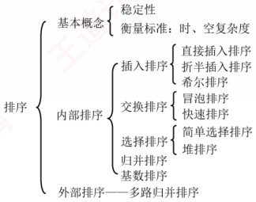

# 第8章 排序

## 【考纲内容】

### （一）排序的基本概念

### （二）插入排序

直接插入排序；折半插入排序；希尔排序（shell sort）

扫一扫

### （三）交换排序

冒泡排序（bubble sort）：快速排序

### （四）选择排序

简单选择排序：堆排序

### （五）2路归并排序（merge sort）

### （六）基数排序

### （七）外部排序

视频讲解

### （八）排序算法的分析和应用

**【知识框架】**

## 【复习提示】

堆排序、快速排序和归并排序是本章的重点与难点。读者应深入掌握各类算法的思想、排序过程（能动手模拟）及其特性，包括初始状态的影响、时空复杂度、稳定性和适用场景等。考试通常以选择题形式考查不同算法的对比。此外，应对常用排序算法的关键代码做到熟练编写，并能根据给定序列的特点，结合算法特性选择最合适的排序方法。
