### 8.4.3 本节试题精选

#### 一、 单项选择题

##### 01

在以下排序算法中，每趟从待排序记录中选出关键字最小的记录，并将其与当前待排序部分的首记录交换，从而使有序区从前向后逐步扩大的是（）。

A. 简单选择排序 B. 冒泡排序 C. 堆排序 D. 直接插入排序

##### 02

简单选择排序算法的比较次数和移动次数分别为（）。

A.  $O(n)$,  $O(\log_2 n)$ B.  $O(\log_2 n)$,  $O(n^2)$

C.  $O(n^2)$,  $O(n)$ D.  $O(n\log_2 n)$,  $O(n)$

##### 03

若只想得到 100000 个元素组成的序列中第 10 个最小元素之前的部分排序的序列，用( )方法最快。

A. 冒泡排序 B. 快速排序 C. 归并排序 D. 堆排序

##### 04

下列（）是一个堆。

A. 19,75,34,26,97,56

B. 97,26,34,75,19,56

C. 19,56,26,97,34,75

D. 19,34,26,97,56,75

##### 05

在含有 n 个元素的小根堆中（下标从 1 开始），关键字最大的元素可能存储在（）位置。

A. n/2 B.  $n/2+2$ C. 1 D. n/2-1

##### 06

向具有 n 个结点的堆中插入一个新元素的时间复杂度为（），删除一个元素的时间复杂度为（）。

A.  $O(1)$ B.  $O(n)$ C.  $O(\log_{2}n)$ D.  $O(n\log_{2}n)$
##### 07

构建 n 个记录的初始堆，其时间复杂度为（ ）；对 n 个记录进行堆排序，最坏情况下其时间复杂度为（ ）。

A.  $O(n)$ B.  $O(n^2)$ C.  $O(\log_2 n)$ D.  $O(n\log_2 n)$

##### 08

下列4种排序算法中，排序过程中的比较次数与序列初始状态无关的是（）。

A. 简单选择排序 B. 直接插入排序 C. 快速排序 D. 冒泡排序

##### 09

对由相同的 n 个整数构成的二叉排序树和小根堆，下列说法中不正确的是（）。

A. 二叉排序树的高度大于或等于小根堆的高度

B. 对二叉排序树进行中序遍历可以得到从小到大的序列

C. 从小根堆的根结点到任意叶结点的路径构成从小到大的序列

D. 对小根堆进行层序遍历可以得到从小到大的序列

##### 10

有一组数据(15, 9, 7, 8, 20, -1, 7, 4)，用堆排序的筛选方法建立的初始小根堆为（）。

A. -1, 4, 8, 9, 20, 7, 15, 7

B. -1, 7, 15, 7, 4, 8, 20, 9

C. -1, 4, 7, 8, 20, 15, 7, 9

D. A、B、C 均不对

##### 11

对关键字序列{23, 17, 72, 60, 25, 8, 68, 71, 52}进行堆排序，输出两个最小关键字后的剩余堆为（）。

A. {23, 72, 60, 25, 68, 71, 52} B. {23, 25, 52, 60, 71, 72, 68}

C. {71, 25, 23, 52, 60, 72, 68} D. {23, 25, 68, 52, 60, 72, 71}

##### 12

堆排序分为两个阶段：第一阶段将给定的序列构造成一个初始堆，第二阶段逐次输出堆顶元素，并调整使其保持堆的性质。设有给定序列{48, 62, 35, 77, 55, 14, 35, 98}，若在堆排序的第一阶段将该序列构造成一个大根堆，则交换元素的次数为（）。

A. 5 B. 6 C. 7 D. 8

##### 13

已知大根堆 $\{62, 34, 53, 12, 8, 46, 22\}$，删除堆顶元素后需要重新调整堆，则在此过程中关键字的比较次数为（）。

A. 2 B. 3 C. 4 D. 5

##### 14

从根结点到任意叶结点的路径都是有序的数据结构是（）。

A. 红黑树 B. 二叉查找树 C. 哈夫曼树 D. 堆

##### 15

【2009 统考真题】已知关键字序列  $\{5, 8, 12, 19, 28, 20, 15, 22\}$ 是小根堆，插入关键字 3，调整好后得到的小根堆为（）。

A. 3,5,12,8,28,20,15,22,19

B. 3,5,12,19,20,15,22,8,28

C. 3,8,12,5,20,15,22,28,19

D. 3,12,5,8,28,20,15,22,19

##### 16

【2011 统考真题】已知序列  $\{25, 13, 10, 12, 9\}$ 是大根堆，在序列尾部插入新元素 18，再将其调整为大根堆，调整过程中元素之间进行的比较次数是（）。

A. 1 B. 2 C. 4 D. 5

##### 17

【2015 统考真题】已知小根堆为 8, 15, 10, 21, 34, 16, 12，删除关键字 8 之后需重建堆，在此过程中，关键字之间的比较次数是（）。

A. 1 B. 2 C. 3 D. 4

##### 18

【2018 统考真题】在将序列(6,1,5,9,8,4,7)建成大根堆时，正确的序列变化过程是（）。

A. 6,1,7,9,8,4,5 → 6,9,7,1,8,4,5 → 9,6,7,1,8,4,5 → 9,8,7,1,6,4,5

B. 6,9,5,1,8,4,7 → 6,9,7,1,8,4,5 → 9,6,7,1,8,4,5 → 9,8,7,1,6,4,5

C. 6,9,5,1,8,4,7 → 9,6,5,1,8,4,7 → 9,6,7,1,8,4,5 → 9,8,7,1,6,4,5

D. 6,1,7,9,8,4,5 → 7,1,6,9,8,4,5 → 7,9,6,1,8,4,5 → 9,7,6,1,8,4,5 → 9,8,6,1,7,4,5
##### 19

【2020 统考真题】下列关于大根堆（至少含 2 个元素）的叙述中，正确的是（）。

I. 可以将堆视为一棵完全二叉树

II. 可以采用顺序存储方式保存堆

III. 可以将堆视为一棵二叉排序树

IV. 堆中的次大值一定在根的下一层

A. 仅 I、II

B. 仅 II、III

C. 仅 I、II 和 IV

D. I、III 和 IV

##### 20

【2021 统考真题】将关键字 6,9,1,5,8,4,7 依次插入初始为空的大根堆 H，得到的 H 是（）。

A. 9,8,7,6,5,4,1 B. 9,8,7,5,6,1,4 C. 9,8,7,5,6,4,1 D. 9,6,7,5,8,4,1

##### 21

【2024统考具题】已知天键子序列28，22，20，19，8，12，15，5是大根堆（最大堆），对该堆进行两次删除操作后，得到的新堆为（）。

A. 20, 19, 15, 12, 8, 5

B. 20, 19, 15, 5, 8, 12

C. 20, 19, 12, 15, 8, 5

D. 20, 19, 8, 12, 15, 5

#### 二、 综合应用题

##### 01

指出堆和二叉排序树的区别？

##### 02

画出一棵二叉树，使得它既满足大根堆的要求又满足二叉排序树的要求。

##### 03

若只想得到一个序列中第  $k (k \geq 5)$ 个最小元素之前的部分的排序序列，则最好采用什么排序算法？

##### 04

通常使用的堆也称二叉堆，因为它是用完全二叉树来实现的，树中结点最多只有两个孩子。同理可以有 m 叉堆，即用完全 m 叉树来实现的堆。

1）下图是一个 m 叉小根堆，问 m 值是多少？向这个堆插入一个元素 65 后，堆中的元素如何变化？再删除堆顶元素呢？请画出变化后的树形。

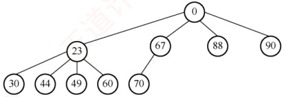

2）从0开始对完全4叉树中的结点从左到右、从上到下进行编号。若给定一个结点k，其父结点的编号是多少？（若存在），其第i（i=1,2,3,4）个孩子的编号是多少？

3）在m叉堆中进行插入和删除操作的时间复杂度是多少？

##### 05

编写一个算法，在基于单链表表示的待排序关键字序列上进行简单选择排序。

##### 06

试设计一个算法，判断一个数据序列是否构成一个小根堆。

##### 07

优先队列（Priority Queue）是一种数据结构，它类似于普通队列，但每个元素都有一个优先级。元素在入队时会根据其优先级来排序，而不按照先入先出的顺序来排序。每次从优先队列中出队时，出队的是优先级最高的元素，而不是最早进入队列的元素。

队列中的元素的数据结构的定义如下：

```c
typedef struct{

    int value;    //元素的值

    int priority;   //元素的优先级，priority越大，优先级越高

}PriorityQueueElement;
```

请设计一个优先队列，要求满足：① 初始时队列为空；② 入队时，不允许增加队列的占用空间；③ 出队后，出队元素所占用的空间可重复使用，即整个队列所占用的空间不变；④ 入队操作和出队操作的时间复杂度始终保持为  $O(\log_2 n)$。请回答：
1）该队列是应选择链式存储结构，还是选择顺序存储结构？

2）给出优先队列的数据结构的定义。

3）用伪代码给出入队操作和出队操作的基本过程（关键之处可用文字描述）。

##### 08

【2022 统考真题】现有  $n (n > 100000)$ 个数保存在一维数组 M 中，需要查找 M 中最小的 10 个数。请回答下列问题。

1）设计一个完成上述查找任务的算法，要求平均情况下的比较次数尽可能少，简述其算法思想（不需要编程实现）。

2）说明你所设计的算法平均情况下的时间复杂度和空间复杂度。

### 8.4.4 答案与解析

#### 一、 单项选择题

##### 01

A

该算法描述的是简单选择排序：每趟从待排序部分顺序扫描，选出最小关键字记录，与首元素交换，使有序区从前向后扩展。这一过程强调“选择最小”和“一次定位”。

##### 02

C

注意，读者应熟练掌握各种排序算法的思想、过程和特点。

##### 03

D

采用堆排序时，读入前10个元素，建立含10个元素的大根堆，而后依次扫描剩余元素，若大于堆顶，则舍弃，否则用该元素取代堆顶并重新调整堆，当元素全部扫描完毕，堆中保存的即是最小的10个元素。冒泡排序需要从后往前执行10趟冒泡才能得到10个最小的元素。两者的时间复杂度都和数据规模n线性相关，但显然堆排序的常系数更小。而快速排序、归并排序的每一趟都不能保证得到当前序列的最小值，也无法达到线性时间复杂度。

##### 04

D

可将每个选项中的序列表示成完全二叉树，再看父结点与子结点的关系是否全部满足堆的定义。例如，选项 A 中序列对应的完全二叉树如右图所示。显然，最小元素 19 在根结点，因此可能是小根堆，但 75 与 26 的关系却不满足小根堆的定义，所以选项 A 中的序列不是一个堆。其他选项采用类似的过程分析。

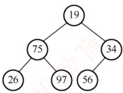

##### 05

B

在小根堆中，关键字最大的元素一定存储在该堆所对应的完全二叉树的叶结点中（位于最底层或次底层）。又因为二叉树中的最后一个非叶结点存储在 $\lfloor n/2 \rfloor$中，所以关键字最大的元素的存储范围为 $\lfloor n/2 \rfloor + 1 \sim n$。注意，读者可类比在大根堆中求关键字最小的元素的存储范围。

##### 06

C、C

在向有 $n$ 个元素的堆中插入一个新元素时，需要调用一个向上调整的算法，比较次数最多等于树的高度减 1，因为树的高度为 $\lfloor \log_2 n \rfloor + 1$，所以堆的向上调整算法的比较次数最多等于 $\lfloor \log_2 n \rfloor$。此处需要注意，调整堆和建初始堆的时间复杂度是不一样的，读者可以仔细分析两个算法的具体执行过程。

##### 07

A、D

建堆过程中，向下调整的时间与树高 h 有关，为  $O(h)$。每次向下调整时，大部分结点的高度都较小。因此，可以证明在元素个数为 n 的序列上建堆，其时间复杂度为  $O(n)$。无论是在最好情况下还是在最坏情况下，堆排序的时间复杂度均为  $O(n \log_2 n)$。
##### 08

A

简单选择排序的比较次数始终为  $n(n-1)/2$，与序列状态无关。

##### 09

D

堆是顺序存储的完全二叉树，因此其高度小于或等于结点数相同的二叉排序树，选项 A 正确。选项 B 显然正确。根据小根堆的定义，其根结点到任意叶结点的路径构成从小到大的序列，选项 C 正确。堆的各层结点之间没有大小要求，因此层序遍历不能保证得到有序序列，选项 D 错误。

##### 10

C

从  $\lfloor n/2\rfloor \sim 1$ 依次筛选堆的过程如下图所示，显然选择选项 C。

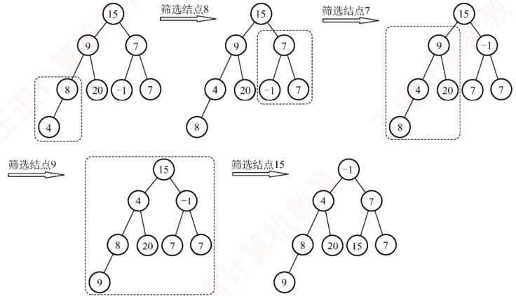

##### 11

D

筛选法初始建堆为{8, 17, 23, 52, 25, 72, 68, 71, 60}，输出8后重建的堆为{17, 25, 23, 52, 60, 72, 68, 71}，输出17后重建的堆为{23, 25, 68, 52, 60, 72, 71}。

##### 12

B

初始序列是一棵顺序存储的完全二叉树，然后根据大根堆的要求，按照从下到上、从右到左的顺序进行调整。98和77比较，98和77交换（交换1次）；14和35比较，35和35比较，不交换；98和55比较，98和62比较，98和62交换（交换1次）；62和77比较，77和62交换（交换1次）；98和35比较，98和48比较，98和48交换（交换1次）；77和55比较，77和48比较，77和48交换（交换1次）；48和62比较，62和48交换（交换1次），共交换6次。

##### 13

B

删除堆顶 62 后，将堆尾 22 放入堆顶，然后自上而下调整。首先 34 与 53 比较（第一次比较），较大者 53 与根 22 比较（第二次比较），53 被换至堆顶；22 只有一个孩子，直接与其左孩子 46 比较（第 3 次比较），22 与 46 交换，至此大根堆调整结束，具体过程如下图所示。

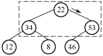

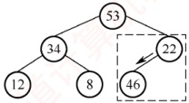

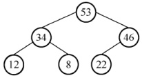

##### 14

D

红黑树和二叉查找树的中序序列是有序序列，从根结点到任意叶结点的路径不能保证是有序的。哈夫曼树是根据权值按一定规则构造的树，和关键字次序无关。若是小根堆，则从根结点到任意叶结点的路径是升序序列；若是大根堆，则从根结点到叶结点的路径是降序序列。

##### 15

A

插入关键字3后，堆的变化过程如下图所示。

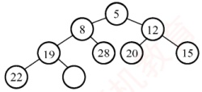

(a) 原始堆

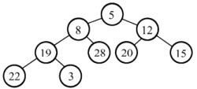

(b) 插入3

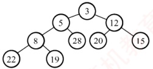

(c) 调整结束

##### 16

B

首先 18 与 10 比较，交换；18 与 25 比较，不交换。共比较 2 次，调整过程如下图所示。

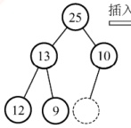

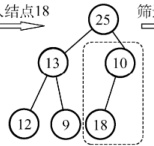

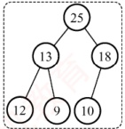

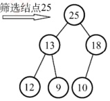

##### 17

C

删除8后，将12移动到堆顶，第一次是15和10比较，第二次是10和12比较并交换，第三次还需比较12和16，所以比较次数为3。

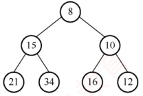

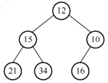

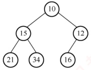

##### 18

A

要熟练掌握建堆和调整堆的方法，从序列末尾开始向前遍历，变换过程如下图所示。

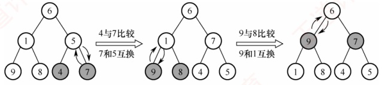

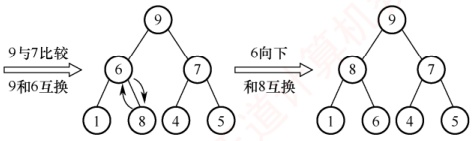

##### 19

C

简单概念题。堆是一棵完全树，采用一维数组存储，说法Ⅰ正确，说法Ⅱ正确。大根堆只要求根结点值大于左右孩子值，并不要求左右孩子值有序，说法Ⅲ错误。堆的定义是递归的，所以其左右子树也是大根堆，所以堆的次大值一定是其左孩子或右孩子，说法Ⅳ正确。

##### 20

B

要熟练掌握调整堆的方法，建堆的过程如下图所示，所以选择选项 B。

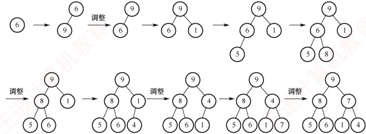

注意，给定序列依次插入空堆的结果与给定序列直接调整成堆的结果是不同的，最终得到的堆的形式也不同。若对序列6,9,1,5,8,4,7直接调整成堆，则会误选选项C。

##### 21

B

该序列已调整成大根堆，接下来进行第一次删除操作：删除28后，将5放入堆顶；然后自上而下调整。22和20比较，较大者22与5比较，交换；19和8比较，较大者19与5比较，交换。

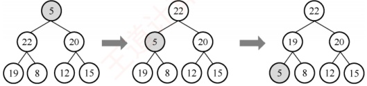

接下来进行第二次删除操作：删除22后，将15放入堆顶；然后自上而下调整。19和20比较，较大者20与15比较，交换；15直接与其仅有的左孩子12比较，不交换。

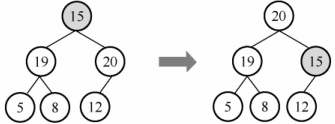

因此，进行两次删除操作后，得到的新堆是20, 19, 15, 5, 8, 12。

#### 二、 综合应用题

##### 01

【解答】

以小根堆为例，堆的特点是双亲结点的关键字必然小于或等于该孩子结点的关键字，而两个孩子结点的关键字没有次序规定。在二叉排序树中，每个双亲结点的关键字均大于左子树结点的关键字，均小于右子树结点的关键字，也就是说，每个双亲结点的左右孩子的关键字有次序关系。这样，当对两种树执行中序遍历后，二叉排序树会得到一个有序的序列，而堆则不一定能得到一个有序的序列。

##### 02

【解答】

大根堆要求根结点的关键字值既大于或等于左孩子的关键字值，又大于或等于右孩子的关键字值
字值。二叉排序树要求根结点的关键字值大于左孩子的关键字值，同时小于右孩子的关键字值。两者的交集是：根结点的关键字值大于左孩子的关键字值。这意味着它是一棵左斜单支树，但大根堆要求是完全二叉树，因此最后得到的只能是如右图所示的两个结点的二叉树。

读者也可能会注意到，当只有一个结点时，显然是满足题意的，但我们不举一个结点的例子是为了体现出排序树与大根堆的区别。

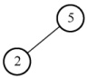

##### 03

【解答】

在基于比较的排序算法中，插入排序、快速排序和归并排序只有在将元素全部排完后，才能得到前k个最小的元素序列，算法的效率不高。

冒泡排序、堆排序和简单选择排序可以，因为它们在每一趟中都可以确定一个最小的元素。采用堆排序最合适，对于 $n$ 个元素的序列，建立初始堆的时间不超过 $4n$，取得第 $k$ 个最小元素之前的排序序列所花的时间为 $k\log_2n$，总时间为 $4n + k\log_2n$；冒泡和简单选择排序完成此功能所花的时间为 $kn$，当 $k \geq 5$ 时，通过比较可以得出堆排序最优。

**注意**

求前 k 个最小元素的顺序排列可采用的排序算法有冒泡排序、堆排序和简单选择排序。

##### 04

【解析】

1）除最后一个分支结点外，其余每个分支结点都有4个孩子，所以该树是完全4叉树。插入元素65后，再删除堆顶元素的树形分别如下图1和图2所示。

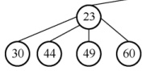

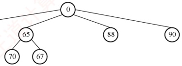

图 1 插入 65 后的树形

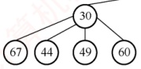

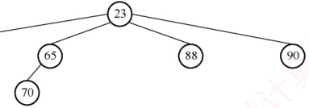

图2 删除堆顶元素后的树形

2）父结点的编号为 $(k-1)/4$，第i个孩子的编号为 $4k+i$，i=1,2,3,4。

3）与二叉堆类似，插入和删除操作都有向上、向下调整的过程，操作时间都与树的高度有关。因此，插入和删除操作的时间复杂度都为  $O(\log_m n)$，其中 n 为元素个数。

##### 05

【解答】

算法的思想是：每趟在原始链表中摘下关键字最大的结点，把它插入结果链表的最前端。在原始链表中摘下的关键字越来越小，在结果链表前端插入的关键字也越来越小，因此最后形成的结果链表中的结点将按关键字非递减的顺序有序链接。

单链表的定义如第2章所述，假设它不带表头结点。
```c
void selectSort(报告中List& L){
```
```c
//对不带表头结点的单链表L执行简单选择排序
LinkNode *h=L,*p,*q,*r,*s;
L=NULL;
while (h!=NULL) {
    p=s=h; q=r=NULL;
    //指针s和r记忆最大结点和其前驱；p为工作指针，q为其前驱
    while (p!=NULL) {
        if (p->data>s->data) { s=p; r=q;}
        q=p; p=p->link;
    }
    if (s==h) {
        h=h->link;
    } else {
        r->link=s->link;
        s->link=L; L=s;
    }
}
```

##### 06

【解答】

将顺序表 L[1..n] 视为一个完全二叉树，扫描所有分支结点，遇到孩子结点的关键字小于根结点的关键字时返回 false，扫描完后返回 true。算法的实现如下：

```c
bool IsMinHeap(ElemType A[], int len) {
    if (len % 2 == 0) {
        //len 为偶数，有一个单分支结点
        if (A[len/2] > A[len]) {
            //判断单分支结点
            return false;
        }
        for (i = len / 2 - 1; i >= 1; i--) {
            //判断所有双分支结点
            if (A[i] > A[2 * i] || A[i] > A[2 * i + 1])
                return false;
        }
        else {
            for (i = len / 2; i >= 1; i--) {
                //判断所有双分支结点
                if (A[i] > A[2 * i] || A[i] > A[2 * i + 1])
                return false;
            }
        return true;
    }
```

##### 07

【解答】

1）题目要求整个队列所占用的空间不变，入队操作和出队操作的时间复杂度始终保持为 $O(\log_2 n)$，则应采用顺序存储结构，即用数组实现大根堆。

2）优先队列的数据结构定义如下：

```c
typedef struct{
    PriorityQueueElement heap[MAX_SIZE];    //用数组实现堆
    int size;                    //当前堆中元素的数量
}PriorityQueue
```

3）入队操作：

```c
void enqueue(PriorityQueue *pq,int value,int priority) {
    if (pq->size>=MAX SIZE) {
        队列已满，无法入队；
        return;
    }
    将新元素添加到堆的末尾；
    向上调整堆；
}

出队操作：

PriorityQueueElement dequeue(PriorityQueue *pq) {
    if (pq->size==0) {
队列为空时直接退出；
}
```
获取堆顶元素（优先级最高的元素）；
将堆的最后一个元素放到堆顶；
向下调整堆；
返回出队元素；

##### 08

【解答】

1 ）算法思想。

【方法1】定义含10个元素的数组A，初始时元素值均为该数组类型能表示的最大数MAX。

```c
for M 中的每个元素 s

if (s < A[9]) 丢弃 A[9]并将 s 按升序插入 A;
```

当数据全部扫描完毕，数组 A[0]～A[9] 保存的就是最小的 10 个数。

【方法2】定义含10个元素的大根堆H，元素值均为该堆元素类型能表示的最大数MAX。

```c
for M 中的每个元素 s

if (s < H 的堆顶元素) 删除堆顶元素并将 s 插入 H;
```

当数据全部扫描完毕，堆 H 中保存的就是最小的 10 个数。

2）算法平均情况下的时间复杂度是  $O(n)$，空间复杂度是  $O(1)$。
