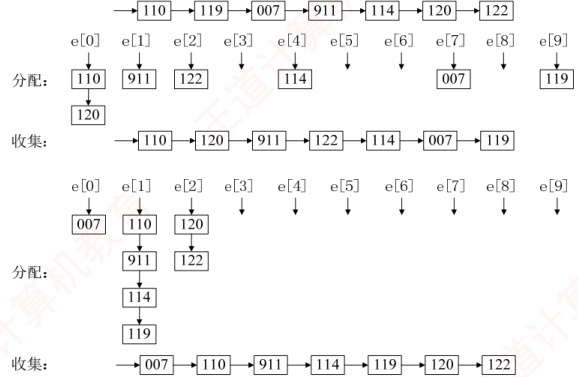
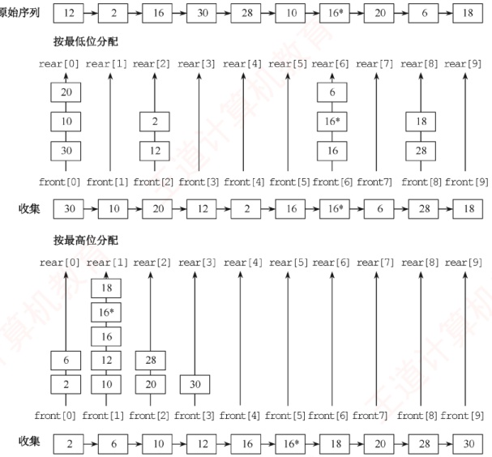

### 8.5.4 本节试题精选

#### 一、 单项选择题

##### 01

以下排序算法中，（）在一趟结束后不一定能选出一个元素放在其最终位置上。
A. 简单选择排序 B. 冒泡排序 C. 归并排序 D. 堆排序

##### 02

以下排序算法中，（）不需要进行关键字的比较。

A. 快速排序 B. 归并排序 C. 基数排序 D. 堆排序

##### 03

在下列排序算法中，平均情况下空间复杂度为  $O(n)$ 的是（），最坏情况下空间复杂度为  $O(n)$ 的是（）。

I. 希尔排序 II. 堆排序 III. 冒泡排序

IV. 归并排序 V. 快速排序 VI. 基数排序

A. I、IV、VI B. II、V C. IV、V D. IV

##### 04

下列排序算法中，排序过程中比较次数的数量级与序列初始状态无关的是（）。

A. 归并排序 B. 插入排序 C. 快速排序 D. 冒泡排序

##### 05

2路归并排序中，归并趟数的数量级是（）。

A.  $O(n)$ B.  $O(\log_2 n)$ C.  $O(n \log_2 n)$ D.  $O(n^2)$

##### 06

若对 27 个元素只进行三趟多路归并排序，则选取的归并路数最少为（）。

A. 2 B. 3 C. 4 D. 5

##### 07

将两个各有 N 个元素的有序表合并成一个有序表，最少的比较次数是（），最多的比较次数是（）。

A. N B. 2N-1 C. 2N D. N-1

##### 08

用归并排序算法对序列 $\{1,2,6,4,5,3,8,7\}$进行排序，共需要进行（）次比较。

A. 12 B. 13 C. 14 D. 15

##### 09

一组经过第一趟2路归并排序后的记录的关键字为{25, 50, 15, 35, 80, 85, 20, 40, 36, 70}，其中包含5个长度为2的有序表，用2路归并排序算法对该序列进行第二趟归并后的结果为（）。

A. 15,25,35,50,80,20,85,40,70,36

B. 15,25,35,50,20,40,80,85,36,70

C. 15,25,50,35,80,85,20,36,40,70

D. 15,25,35,50,80,20,36,40,70,85

##### 10

若将中国人按照生日（不考虑年份，只考虑月、日）来排序，则使用下列排序算法时，最快的是（）。

A. 归并排序 B. 希尔排序 C. 快速排序 D. 基数排序

##### 11

设线性表中每个元素有两个数据项  $k_1$ 和  $k_2$，现对线性表按以下规则进行排序：先看数据项  $k_1$， $k_1$ 值小的元素在前，大的元素在后；在  $k_1$ 值相同的情况下，再看  $k_2$， $k_2$ 值小的元素在前，大的元素在后。满足这种要求的排序算法是（）。

A. 先按  $k_1$ 进行直接插入排序，再按  $k_2$ 进行简单选择排序

B. 先按  $k_2$ 进行直接插入排序，再按  $k_1$ 进行简单选择排序

C. 先按  $k_1$ 进行简单选择排序，再按  $k_2$ 进行直接插入排序

D. 先按  $k_2$ 进行简单选择排序，再按  $k_1$ 进行直接插入排序

##### 12

对{05,46,13,55,94,17,42}进行基数排序，一趟排序的结果是（）。

A. 05,46,13,55,94,17,42

B. 05,13,17,42,46,55,94

C. 42,13,94,05,55,46,17

D. 05,13,46,55,17,42,94

##### 13

有 n 个十进制整数进行基数排序，其中最大的整数为 5 位，则基数排序过程中临时建立的队列个数是（）。

A. n B. 2 C. 5 D. 10

##### 14

下列各种排序算法中，（）需要的附加存储空间最大。
A. 快速排序 B. 堆排序 C. 归并排序 D. 插入排序

##### 15

【2013 统考真题】已知两个长度分别为 m 和 n 的升序链表，若将它们合并为长度为  $m + n$ 的一个降序链表，则最坏情况下的时间复杂度为（）。

A.  $O(n)$ B.  $O(mn)$ C.  $O(\min(m,n))$ D.  $O(\max(m,n))$

##### 16

【2013 统考真题】对给定的关键字序列 110, 119, 007, 911, 114, 120, 122 进行基数排序，第二趟分配、收集后得到的关键字序列为（）。

A. 007, 110, 119, 114, 911, 120, 122

B. 007, 110, 119, 114, 911, 122, 120

C. 007, 110, 911, 114, 119, 120, 122

D. 110, 120, 911, 122, 114, 007, 119

##### 17

【2015 统考真题】下列排序算法中，元素的移动次数与关键字的初始状态无关的是（）。

A. 直接插入排序 B. 冒泡排序 C. 基数排序 D. 快速排序

##### 18

【2021 统考真题】设数组 S[]={93, 946, 372, 9, 146, 151, 301, 485, 236, 327, 43, 892}，采用最低位优先（LSD）基数排序将 S 排列成升序序列。第一趟分配、收集后，元素 372 之前、之后紧邻的元素分别为（）。

A. 43,892 B. 236,301 C. 301,892 D. 485,301

##### 19

【2022 统考真题】使用 2 路归并排序对含 n 个元素的数组 M 进行排序时，2 路归并排序的功能是（）。

A. 将两个有序表合并为一个新的有序表

B. 将M划分为两部分，两部分的元素个数大致相等

C. 将M划分为n个部分，每个部分中仅含有一个元素

D. 将M划分为两部分，一部分元素的值均小于另一部分元素的值

##### 20

【2024 统考真题】现有由关键字组成的 3 个有序序列  $(3, 5)$、 $(7, 9)$ 和  $(6)$，若按从左至右的次序选择有序序列进行 2 路归并排序，则关键字之间的总比较次数是（）。

A. 3 B. 4 C. 5 D. 6

#### 二、 综合应用题

##### 01

已知序列{503, 87, 512, 61, 908, 170, 897, 275, 653, 462}，采用非递归的2路归并排序算法对该序列做升序排序时需要几趟排序？给出每一趟的结果。

##### 02

设待排序的关键字序列为{12, 2, 16, 30, 28, 10,  $16^{*}$, 20, 6, 18}，试写出使用最低位优先（LSD）基数排序算法每趟排序后的结果。

##### 03

【2021 统考真题】已知某排序算法如下：
```c

void cmpCountSort(int a[], int b[], int n) {

    int i, j, *count;

    count = (int *)malloc(sizeof(int)*n);

    // C++语言: count=new int[n];

    for (i=0; i<n; i++)     count[i]=0;

    for (i=0; i<n-1; i++)

        for (j=i+1; j<n; j++)

            if (a[i]<a[j])     count[j]++;

            else     count[i]++;

    for (i=0; i<n; i++)     b[count[i]] = a[i];
```

```c
    free(count);     // C++语言: delete count;

}
```

请回答下列问题。

1) 若有 int a[] = {25, -10, 25, 10, 11, 19}, b[6];，则调用 cmpCountSort(a, b, 6) 后数组 b 中的内容是什么？

2）若 a 中含有 n 个元素，则算法执行过程中，元素之间的比较次数是多少？
3）该算法是稳定的吗？若是，阐述理由；否则，修改为稳定排序算法。

### 8.5.5 答案与解析

#### 一、 单项选择题

##### 01

C

我们知道插入排序不能保证在一趟排序结束后一定有元素放在最终位置上。事实上，归并排序也不能保证。例如，序列{6,5,7,8,2,1,4,3}进行一趟2路归并排序（从小到大）后为{5,6,7,8,1,2,3,4}，显然它们都未被放在最终位置上。

##### 02

C

基数排序是基于关键字各位的大小进行排序的，而不是基于关键字的比较进行的。

##### 03

D, C

归并排序在平均情况和最坏情况下的空间复杂度都是  $O(n)$，快速排序只在最坏情况下才是  $O(n)$，平均情况是  $O(\log_{2}n)$。因此，归并排序是本章所有排序算法中占用辅助空间最多的。

##### 04

A

前面已讲过选择排序的比较次数与序列初始状态无关，归并排序的比较次数的数量级也与序列的初始状态无关。读者应能从算法的原理方面来考虑为什么和初始状态无关。

##### 05

B

N个元素进行k路归并排序的趟数m满足 $k^m = N$，即 $m = \lceil \log_k N \rceil$，本题中为 $\lceil \log_2 n \rceil$。

##### 06

B

N个元素进行k路归并排序的趟数m满足 $k^{m}=N$，这里要求的是k，代入可得k=3。

##### 07

A、B

注意，当一个表中的最小元素比另一个表中的最大元素还大时，比较的次数是最少的，仅比较 N 次；而当两个表中的元素依次间隔地比较时，即  $a_1 < b_1 < a_2 < b_2 < \cdots < a_n < b_n$ 时，比较的次数是最多的，为  $2N-1$ 次。

建议读者对此举一反三：若将本题中的两个有序表的长度分别设为 M 和 N，则最多（或最少）的比较次数是多少？时间复杂度又是多少？

##### 08

C

第一趟归并后 $\{1,2\},\{4,6\},\{3,5\},\{7,8\}$，共比较4次；第二趟归并后 $\{1,2,4,6\},\{3,5,7,8\}$，共比较4次；第三趟归并后 $\{1,2,3,4,5,6,7,8\}$，共比较6次。三趟归并共需进行14次比较。

##### 09

B

这里采用2路归并排序算法，且是第二趟排序，因此每4个元素放在一起归并，可将序列划分为{25, 50, 15, 35}，{80, 85, 20, 40}和{36, 70}，分别对它们进行排序后有{15, 25, 35, 50}，{20, 40, 80, 85}和{36, 70}。

##### 10

D

按照所有中国人的生日排序，一方面 N 是非常大的，另一方面关键字所含的排序码数为 2，且一个排序码的基数为 12，另一个排序码的基数为 31，都是较小的常数值，因此采用基数排序可以在  $O(N)$ 内完成排序过程。

##### 11

D

本题思路来自基数排序的 LSD，首先应确定  $k_{1}$、 $k_{2}$ 的排序顺序，若先排  $k_{1}$ 再排  $k_{2}$，则排序结果不符合题意，排除选项 A 和 C。再考虑排序的稳定性，当  $k_{2}$ 排好序后，再对  $k_{1}$ 排序，若对  $k_{1}$ 排序采
用的方法是不稳定的，则对于  $k_{1}$ 相同而  $k_{2}$ 不同的元素可能会改变相对次序，从而不一定能满足题设要求。直接插入排序是稳定的，而简单选择排序是不稳定的，只能选择选项 D。

##### 12

C

基数排序有 MSD 和 LSD 两种，基数排序是稳定的。对于选项 A，不符合 LSD 和 MSD；对于选项 B，符合 MSD，但关键字 42、46 的相对位置发生了变化；对于选项 D，不符合 LSD 和 MSD。

##### 13

D

基数排序中建立的队列个数等于进制数。

##### 14

C

快速排序的平均空间复杂度是  $O(\log_{2}n)$，归并排序的空间复杂度是  $O(n)$，其他都是  $O(1)$。

##### 15

D

考虑两个升序链表合并，两两比较表中元素，每比较一次，确定一个元素的链接位置（取较小元素，头插法）。当一个链表比较结束后，将另一个链表的剩余元素插入即可。最坏的情况是两个链表中的元素依次进行比较，因为  $2\max(m, n) \geq m + n$，所以时间复杂度为  $O(\max(m, n))$。此外，每次比较把两个链表中的较小结点插入新链表的表头，直到一个链表为空，因为原链表是升序排列的，要求合并后为降序排列的，因此还要把另一个链表剩下的结点一一插入新链表的表头，不论是最好情况还是最坏情况，都需要遍历两个链表中的所有结点。

##### 16

C

基数排序的第一趟排序是按照个位数字的大小来进行的，第二趟排序是按照十位数字的大小来进行的，排序的过程如下图所示。



##### 17

C

基数排序的元素移动次数与序列初态无关，而其他三种排序算法都与序列初态有关。

##### 18

C

基数排序是一种稳定的排序算法。因为采用最低位优先（LSD）的基数排序，即第一趟对个位进行分配和收集操作，所以第一趟分配和收集后的结果是{151, 301, 372, 892, 93, 43, 485, 946, 146, 236, 327, 9}，元素 372 之前、之后紧邻的元素分别为 301 和 892。

##### 19

A

送分题。本书对归并的定义原话是“归并的含义是将两个或两个以上的有序表合并成一个新的有序表”，而2路归并是将两个有序表合并为一个新的有序表。
##### 20

C

从左至右对这三个有序序列进行2路归并排序的过程如下。

① 合并(3,5)和(7,9)：比较3和7（1次），选择3；比较5和7（1次），选择5；剩余元素7和9直接加入。② 合并(3,5,7,9)和(6)：比较3和6（1次），选择3；比较5和6（1次），选择5；比较7和6（1次），选择6；剩余元素7和9直接加入。总共比较5次。

#### 二、 综合应用题

##### 01

【解答】

$n=10$，需要排序的趟数 $=\lceil \log_2 10 \rceil=4$，各趟的排序结果如下：

初始序列：503, 87, 512, 61, 908, 170, 897, 275, 653, 462

第一趟：87,503,61,512,170,908,275,897,462,653（长度为2）

第二趟：61,87,503,512,170,275,897,908,462,653（长度为4）

第三趟：61, 87, 170, 275, 503, 512, 897, 908, 462, 653（长度为8）

第四趟：61, 87, 170, 275, 462, 503, 512, 653, 897, 908（长度为10）

##### 02

【解答】

使用链式队列的基数排序的排序过程如下图所示。



需要通过2次分配和收集完成排序。

##### 03

【解答】

cmpCountSort算法基于计数排序的思想，对序列进行排序。cmpCountSort算法遍历数组中的元素，count数组记录比对应待排序数组元素下标大的元素个数，例如，count[1]=3的意思是数组a中有三个元素比a[1]小，即a[1]是第四大元素，a[1]的正确位置应是b[3]。

1）排序结果为 b[6] = {-10, 10, 11, 19, 25, 25}。
2）由代码 for (i=0; i<n-1; i++) 和 for (j=i+1; j<n; j++) 可知，在循环过程中，每个元素都与它后面的所有元素比较一次（所有元素都两两比较一次），比较次数之和为  $(n-1)+(n-2)+\cdots+1$，所以总比较次数为  $n(n-1)/2$。

3）不是。需要将程序中的 if 语句修改如下：

 $$if(a[i]<=a[j])\quad count[j]++;$$

 $$\texttt{e l s e c o u n t[i]++};$$

若不加等号，两个相等的元素比较时，前面元素的 count 值会加 1，则导致原序列中靠前的元素在排序后的序列中处于靠后的位置。
