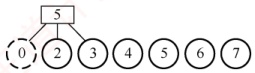
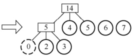
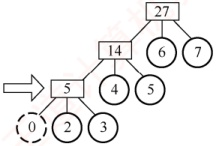
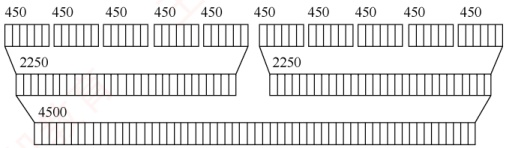
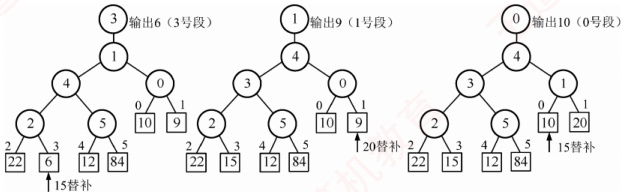
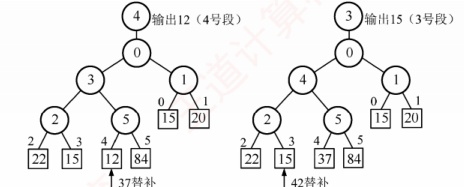
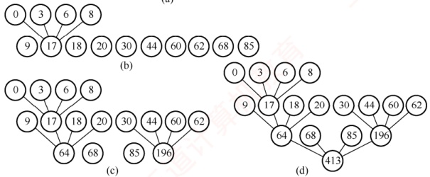

### 8.7.6 本节试题精选

#### 一、 单项选择题

##### 01

外部排序和内部排序的主要区别是（）。

A. 内部排序的数据量小，而外部排序的数据量大

B．内部排序不涉及内、外存数据交换，而外部排序涉及内、外存数据交换

C. 内部排序的速度快，而外部排序的速度慢

D. 内部排序所需的内存小，而外部排序所需的内存大

##### 02

下列关于外部排序的说法中，正确的是（）。

A. 置换选择排序得到的初始归并段的长度一定相等

B. 内外存交换数据的时间只占总排序时间的一小部分

C. 败者树是一棵完全二叉树

D. 外部排序不涉及对文件的读/写操作

##### 03

多路平衡归并的作用是（）。

A. 减少归并趟数

B. 减少初始归并段的个数

C. 便于实现败者树

D. 以上都对

##### 04

设在磁盘上存放有 375000 个记录，进行 5 路平衡归并排序，内存工作区能容纳 600 个记录，为把所有记录排好序，需要进行（ ）趟归并排序。

A. 3 B. 4 C. 5 D. 6

##### 05

在下列关于外部排序过程输入/输出缓冲区作用的叙述中，不正确的是（）。

A. 暂存输入/输出记录

B. 内部归并的工作区

C. 产生初始归并段的工作区

D. 传送用户界面的消息

##### 06

若只需3趟排序就可完成64个元素的多路归并排序，则选取的归并路数最少是（）。

A. 2 B. 3 C. 4 D. 5

##### 07

置换-选择排序的作用是（）。

A. 用于生成外部排序的初始归并段

B. 完成将一个磁盘文件排序成有序文件的有效外部排序算法

C. 生成的初始归并段的长度是内存工作区的2倍

D. 对外部排序中输入/归并/输出的并行处理

##### 08

一个无序文件的 n 个记录采用置换选择排序产生 m 个有序段，则 m 和 n 的关系是（）。

A. m 与 n 成正比 B.  $m = \log_{2} n$ C. m 与 n 成反比 D. 以上都不对

##### 09

在由 k 路归并构建的败者树中选取一个关键字最小的记录，则所需时间为（）。

A. O(1) B. O(k) C. O( $\log_{2}k$) D. 以上都不对

##### 10

下列关于小顶堆和败者树的说法中，正确的是（）。

Ⅰ. 败者树从下往上维护，每上一层，只需和失败结点比较1次

Ⅱ. 败者树的每次维护，必定要从叶结点一直走到根结点，不可能从中间停止

Ⅲ. 堆从上往下维护，每下一层，若其左右孩子均不为空，则需比较2次
IV. 堆的每次维护，必定要从根结点一直走到叶结点，不可能从中间停止

A. I、III B. II、III C. I、II、III D. I、III、IV

##### 11

最佳归并树在外部排序中的作用是（）。

A. 完成 m 路归并排序

B. 设计 m 路归并排序的优化方案

C. 产生初始归并段

D. 与锦标赛树的作用类似

##### 12

在由 m 个初始归并段构建的 k 阶最佳归并树中，不需要补充虚段，则度为 k 的结点个数是（）。

A.  $(m-1)/k$ B.  $m/k$ C.  $(m-1)/(k-1)$ D. 无法确定

##### 13

【2013 统考真题】已知三叉树 T 中 6 个叶结点的权分别是 2, 3, 4, 5, 6, 7, T 的带权（外部）路径长度最小是（）。

A. 27 B. 46 C. 54 D. 56

##### 14

【2016 统考真题】对 10TB 的数据文件进行排序，应使用的方法是（）。

A. 希尔排序 B. 堆排序 C. 快速排序 D. 归并排序

##### 15

【2019 统考真题】设外存上有 120 个初始归并段，进行 12 路归并时，为实现最佳归并，需要补充的虚段个数是（）。

A. 1 B. 2 C. 3 D. 4

##### 16

【2024 统考真题】在外排序中，利用败者树对初始为升序的归并段进行多路归并，败者树中记录 “冠军” 的结点保存的是（）。

A. 最大关键字

B. 最小关键字

C. 最大关键字所在的归并段号

D. 最小关键字所在的归并段号

#### 二、 综合应用题

##### 01

若某个文件经内部排序得到80个初始归并段，试问：

1）若使用多路平衡归并执行3趟完成排序，则应取得的归并路数至少应为多少？

2）若操作系统要求一个程序同时可用的输入/输出文件的总数不超过15个，则按多路归并至少需要几趟可以完成排序？若限定这个趟数，可取的最低路数是多少？

##### 02

假设文件有4500个记录，在磁盘上每个块可放75个记录。计算机中用于排序的内存区可容纳450个记录。试问：

1）可以建立多少个初始归并段？每个初始归并段有多少记录？存放于多少个块中？

2）应采用几路归并？请写出归并过程及每趟需要读/写磁盘的块数。

##### 03

设初始归并段为(10, 15, 31), (9, 20), (22, 34, 37), (6, 15, 42), (12, 37), (84, 95)。试利用败者树进行 m 路归并，手工执行选择最小的 5 个关键字的过程。

##### 04

给出12个初始归并段，其长度分别为30, 44, 8, 6, 3, 20, 60, 18, 9, 62, 68, 85。现要做4路外归并排序，试画出表示归并过程的最佳归并树，并计算该归并树的带权路径长度WPL。

##### 05

【2023 统考真题】对含有  $n (n > 0)$ 个记录的文件进行外部排序，采用置换-选择排序生成初始归并段时需要使用一个工作区，工作区中能保存 m 个记录。请回答：

1) 若文件中含有 19 个记录，其关键字依次是 51, 94, 37, 92, 14, 63, 15, 99, 48, 56, 23, 60, 31, 17, 43, 8, 90, 166, 100，则当 m = 4 时，可生成几个初始归并段？各是什么？

2) 对任意的  $m(n \gg m > 0)$，生成的第一个初始归并段的长度最大值和最小值分别是多少？

### 8.7.7 答案与解析

#### 一、 单项选择题

##### 01

B

外部排序和内部排序最主要的区别是是否涉及内存、外存的数据交换。
##### 02

C

置换选择排序得到的是长度不一定相等的归并段，选项 A 错误。外部排序的主要时间消耗在内外存之间的数据交换上，选项 B 错误。败者树是一棵完全二叉树，选项 C 正确。外部排序包括两个阶段：生成初始归并段和对初始归并段进行归并，这两个阶段都涉及对文件的读/写操作，选项 D 错误。

##### 03

A

多路平衡归并的目的是减少归并趟数，因为当 $m$ 个初始归并段采用 $k$ 路平衡归并时，所需趟数 $s = \lceil \log_k m \rceil$，若不采用多路平衡归并，则其归并趟数大于 $s$。

##### 04

B

初始归并段的个数  $r = 375000/600 = 625$，因此，归并趟数  $S = \lceil \log_m r \rceil = \lceil \log_5 625 \rceil = 4$。第一趟把 625 个归并段归并成 625/5 = 125 个；第二趟把 125 个归并段归并成 125/5 = 25 个；第三趟把 25 个归并段归并成 25/5 = 5 个；第四趟把 5 个归并段归并成 5/5 = 1 个。

##### 05

D

在外部排序过程中输入/输出缓冲区就是排序的内存工作区，例如进行 m 路平衡归并需要 m 个输入缓冲区和 1 个输出缓冲区，用以存放参加归并的和归并完成的记录。在产生初始归并段时也可用作内部排序的工作区。它没有传送用户界面的消息的任务。

##### 06

6. D

设初始归并段个数 n=64，外归并路数 k=4，计算 (n-1)%(k-1)=63%3=0，说明可以做完全的 4 路归并，因为初始归并段数正好是 4 的倍数。此时，归并树的内结点应有 (n-1+1)/(k-1)=64/3=21.33，向上取整为 22 个。

##### 07

7. A

置换-选择排序是外部排序中生成初始归并段的方法，用此方法得到的初始归并段的长度是不等长的，其长度平均是传统等长初始归并段的2倍，从而使得初始归并段数减少到原来的近二分之一。但是，置换-选择排序不是一种完整的生成有序文件的外部排序算法。

##### 08

8. D

设内存工作区 w=1，则文件{1,2,3,4,5}产生1个有序段，而文件{5,4,3,2,1}产生5个有序段，因此m与待排文件、内存工作区大小w和n都有关，但不是选项A、B、C描述的直接关系。

##### 09

9. C

在败者树中选取最小关键字的时间复杂度取决于败者树的高度，所需时间为 O(log₂k)。

##### 10

10. C

说法Ⅰ正确，是败者树的性质。在败者树的维护过程中，会让胜利者一直调整到根结点，说法Ⅱ正确。以小根堆为例，每次调整时，先比较下一层的两个元素（1次），找出较小值，然后比较当前元素和下一层的较小元素（1次），以决定是否向下交换位置，说法Ⅲ正确。堆在维护时，可能会在中间某层停止（若此处无须调整），而不一定要走到叶结点，说法Ⅳ错误。

##### 11

11. B

最佳归并树在外部排序中的作用是设计 m 路归并排序的优化方案，仿照构造哈夫曼树的方法，以初始归并段的长度为权值，构造具有最小带权路径长度的 m 叉哈夫曼树，可以有效地减少归并过程中的读/写记录数，加快外部排序的速度。

##### 12

12. C

k 阶最佳归并树中只有度为 0 和 k 的结点。设结点总数为 n，度为 0 的结点数为 n₀，度为 k 的结点数为 nₖ，则 n₀=m、n-1=knₖ，n=n₀+nₖ，因此 knₖ=m+nₖ-1，求得 nₖ=(m-1)/(k-1)。

##### 13

B

题中的三叉树为使 WPL 最小，必须构造三叉哈夫曼树，应满足 $(n_{0}-1)\%(3-1)=0$ 的条件，因
此需添加1个权值为0的虚叶结点，说明7个叶结点刚好可构成一棵严格的三叉树。按照哈夫曼树的原则，权为0的叶结点应离树根最远，构造三叉哈夫曼树的过程如下：

① 合并权值最小的三个结点 0,2,3，得到新结点的权值 =5，剩下 5,4,5,6,7。

② 合并权值最小的三个结点 4, 5, 5，得到新结点的权值 = 14，剩下 14, 6, 7。

③ 合并权值最小的三个结点 6, 7, 14，得到新结点的权值 = 27，仅有 27，建树完成。

 $$WPL=\sum_{1}^{n} 权值 W_{ 叶结点 i}\times 深度 D_{ 叶结点 i}=(2+3)\times3+(4+5)\times2+(6+7)\times1=46$$

或

 $$WPL=\sum_{1}^{m} 权值 W_{ 分支结点 j}=27+14+5=46$$

每个分支结点的权值都累加了其下面所有分支结点的权值，因此采用第二种方法更方便。

##### 14

D

外部排序指的是大文件的排序，即待排序的记录存储在外存中，待排序的文件无法一次性装入内存，需要在内存和外存之间进行多次数据交换，以达到排序整个文件的目的。外部排序通常采用归并排序算法。选项 A、B、C 都是内部排序的方法。

##### 15

B

在 12 路归并树中只存在度为 0 和度为 12 的结点，设度为 0 的结点数、度为 12 的结点数和要补充的结点数分别为  $n_{0}$、 $n_{12}$ 和  n_{补}，则有  n_{0} = 120 + n_{补}， $n_{0} = (12 - 1)n_{12} + 1$，可得  n_{12} = (120 - 1 + n_{补}) / (12 - 1)。因为结点数  $n_{12}$ 为整数，所以  n_{补} 是使上式整除的最小整数，求得  n_{补} = 2。

此外，题中为实现最佳归并，应满足 12 叉哈夫曼树，n=120，m=12，不满足  $(n-1)\%(m-1)=0$ 的条件，因此需要添加两个权值为 0 的叶结点，使得 n=122，才能满足条件。

##### 16

D

利用败者树归并升序归并段，每次需要得到当前的最小关键字，因此记录“冠军”的结点保存的只能是最小关键字或最小关键字所在的归并段号。通过败者树找出最小关键字后，还需要找到该关键字所在的归并段，并移动段内元素，以继续比较下一个元素，下面分别进行讨论：①假设记录“冠军”的结点保存的是最小关键字所在的归并段号，则能直接得到最小关键字及其所在的段，时间复杂度低。②假设记录“冠军”的结点保存的是最小关键字，则查找其所在的段需要检索所有段的首元素是否与该最小关键字相等，时间复杂度高。为了提高效率，记录“冠军”的结点保存的是最小关键字所在的归并段号，而不是最小关键字。

#### 二、 综合应用题

##### 01

【解答】

1）设归并路数为 $m$，初始归并段个数 $r=80$，根据归并趟数计算公式 $S=\left|\log_m r\right|=\left|\log_m 80\right|=3$，得 $\log_m 80 \leqslant 3$，$m^3 \geqslant 80$。由此解得 $m \geqslant 5$，即应取的归并路数至少为 5。

2）设多路归并的归并路数为 $m$，需要 $m$ 个输入缓冲区和 1 个输出缓冲区。一个缓冲区对应一个文件，有 $m+1=15$，因此 $m=14$，可做 14 路归并。由 $S=\lceil\log_m r\rceil=\lceil\log_{14}80\rceil=2$，即至少需要 2 趟归并可完成排序。若限定趟数为 2，由 $S=\lceil\log_m 80\rceil=2$，有 $80\leq m^2$，可取的最低路数为 9。即要在 2 趟内完成排序，进行 9 路归并排序即可。
##### 02

【解答】

1）文件有4500个记录，用于排序的内存区可容纳450个记录，可建立的初始归并段有4500/450=10个。每个初始归并段中有450个记录，存于450/75=6个块中。

2）内存区可容纳6个块，可建立6个缓冲区，其中5个缓冲区用于输入，1个缓冲区用于输出，因此可采用5路归并，归并过程如下图所示。

共进行了2趟归并，每趟需要读60块、写60块。

##### 03

【解答】

进行6路归并排序，选择最小的5个关键字的败者树如下图所示。

T42替补

##### 04

【解答】

设初始归并段个数 n=12，外归并路数 k=4，计算  $(n-1)\%(k-1)=11\%3=2\neq0$，说明不能做完全的4路归并，因为多出了两个初始归并段，必须添加 k-2-1=1 个长度为0的空归并段，才能构成严格的4路归并树，即每次归并都有 k 个归并段参加归并。

此时，归并树的内结点应有 $(n-1+1)/(k-1)=12/3=4$ 个，如下图所示。

(a)

 $$WPL=(3+6+8)\times3+(9+18+20+30+44+60+62)\times2+(68+85)\times1=51+486+153=690。$$

##### 05

【解答】

1）当文件中的 n 个记录升序排列时，只生成一个归并段，长度达到最大，为 n。若初始工作区内的 m 个元素都大于输入文件中剩下的所有记录，则第一个归并段的长度就为 m，此时为第一个归并段长度最小的情况。排序过程如下表所示。

| 输出文件 FO | 工作区 WA | 输入文件 FI |
| --- | --- | --- |
| — | — | 51, 94, 37, 92, 14, 63, 15, 99, 48, 56, 23, 60, 31, 17, 43, 8, 90, 166, 100 |
| — | 51, 94, 37, 92 | 14, 63, 15, 99, 48, 56, 23, 60, 31, 17, 43, 8, 90, 166, 100 |
| 37 | 51, 94, 14, 92 | 63, 15, 99, 48, 56, 23, 60, 31, 17, 43, 8, 90, 166, 100 |
| 37, 51 | 94, 14, 92, 63 | 15, 99, 48, 56, 23, 60, 31, 17, 43, 8, 90, 166, 100 |
| 37, 51, 63 | 15, 94, 14, 92 | 99, 48, 56, 23, 60, 31, 17, 43, 8, 90, 166, 100 |
| 37, 51, 63, 92 | 15, 94, 14, 99 | 48, 56, 23, 60, 31, 17, 43, 8, 90, 166, 100 |
| 37, 51, 63, 92, 94 | 15, 14, 99, 48 | 56, 23, 60, 31, 17, 43, 8, 90, 166, 100 |
| 37, 51, 63, 92, 94, 99 | 15, 14, 56, 48 | 23, 60, 31, 17, 43, 8, 90, 166, 100 |
| 37, 51, 63, 92, 94, 99# | 15, 14, 56, 48 | 23, 60, 31, 17, 43, 8, 90, 166, 100 |
| 14 | 15, 23, 56, 48 | 60, 31, 17, 43, 8, 90, 166, 100 |
| 14, 15 | 60, 23, 56, 48 | 31, 17, 43, 8, 90, 166, 100 |
| 14, 15, 23 | 60, 31, 56, 48 | 17, 43, 8, 90, 166, 100 |
| 14, 15, 23, 31 | 60, 17, 56, 48 | 43, 8, 90, 166, 100 |
| 14, 15, 23, 31, 48 | 60, 17, 56, 43 | 8, 90, 166, 100 |
| 14, 15, 23, 31, 48, 56 | 60, 17, 8, 43 | 90, 166, 100 |
| 14, 15, 23, 31, 48, 56, 60 | 90, 17, 8, 43 | 166, 100 |
| 14, 15, 23, 31, 48, 56, 60, 90 | 166, 17, 8, 43 | 100 |
| 14, 15, 23, 31, 48, 56, 60, 90, 166 | 100, 17, 8, 43 | — |
| 14, 15, 23, 31, 48, 56, 60, 90, 166# | 100, 17, 8, 43 | — |
| 8 | 100, 17, 43 | — |
| 8, 17 | 100, 43 | — |
| 8, 17, 43 | 100 | — |
| 8, 17, 43, 100 | — | — |
| 8, 17, 43, 100# | — | — |

生成三个初始归并段，分别是37,51,63,92,94,99;14,15,23,31,48,56,60,90,166;8,17,43,100。2）最大值为n，最小值为m。

**归纳总结**

下面对本章所介绍的排序算法进行一次系统的比较与复习。

1. 基本排序算法：适用于元素个数 n 不是很大（n < 10000）的情形。

直接插入排序、冒泡排序和简单选择排序均属于此类，平均时间复杂度均为  $O(n^{2})$，实现简单。直接插入排序在小规模数据（ $n \leq 25$）时效率较高；在最好情况下，仅需 n-1 次比较。冒泡排序在最好情况下只需 1 趟扫描和 n-1 次比较。简单选择排序的比较次数恒为  $O(n^{2})$，与初始排列无关，但移动次数受初始状态影响，最多不超过  $3(n-1)$ 次。这三类算法的空间复杂度均为  $O(1)$，仅需一个辅助变量。其中，直接插入排序和冒泡排序是稳定的，而简单选择排序不稳定。

2. 对于中等规模数据（ $n \leq 1000$），希尔排序是一种很好的选择。

它通过逐步缩小增量对子序列进行插入排序，初期移动距离大，后期接近有序，从而显著减
少总的比较与移动次数。希尔排序代码简洁，空间开销小（开销为 $O(1)$），但属于不稳定排序。

3. 大规模高效排序算法：当 n 很大时，应选用时间复杂度为  $O(n \log_{2} n)$ 的算法。

快速排序是最通用的高效内部排序方法，平均时间复杂度为  $O(n\log_2n)$，平均空间复杂度为  $O(\log_2n)$，虽然在最坏情况下（如输入已有序）退化为  $O(n^2)$，但可通过“三者取中”等策略有效规避。堆排序的时间复杂度稳定为  $O(n\log_2n)$，无性能退化问题，且仅需  $O(1)$ 的额外空间，但平均性能通常略逊于快速排序。归并排序的时间复杂度始终为  $O(n\log_2n)$，与输入无关，稳定性好，但需要  $O(n)$ 的额外存储空间。基数排序具有线性时间复杂度  $O(d(n+r))$，但其实际效率受限于关键字结构和平台支持，通用性较弱，应用不如比较类排序广泛。

4. 混合策略：

实际系统常结合多种算法以扬长避短。例如，在归并排序或快速排序的递归底层切换为直接插入排序，可减少函数调用开销并提升局部效率。

综上，排序算法的选择应综合考虑数据规模、内存限制、稳定性要求及输入特性。深入理解各类算法的优劣，有助于在实际应用中做出更合理、高效的决策。

**思维拓展**

一道看似吓人的题目：对 n 个整数进行排序，要求时间复杂度为  $O(n)$，空间复杂度为  $O(1)$。

**提 示**

设待排序整数的范围为0~65535，设定一个数组int count[65535]并初始化为0，则所需空间与n无关，为O(1)。扫描一遍待排序列X[1]，count[X[i]]++，时间复杂度为O(n)；再扫描一次count[1]，当count[i]>0时，输出count[i]个i，排序完毕所需的时间复杂度也为O(n)；所以总时间复杂度为O(n)，空间复杂度为O(1)。另外，读者可能会问假如有负整数怎么办，这种情况下可以给所有整数都加上一个偏移量，使之都变成正整数，再使用上述方法。

**参考文献**

[1] 严蔚敏，吴伟民．数据结构（C语言版）[M]．北京：清华大学出版社，2018.

[2] 科尔曼，雷瑟尔森，李维斯特，等．算法导论[M]. 3 版．殷建平，徐云，刘晓光，等译．北京：机械工业出版社，2013.

[3] 李春葆，陈良臣，尹为民，等．数据结构教程（C++语言描述）[M]．北京：清华大学出版社，2009.

[4] 陈守孔，胡潇琨，李玲．算法与数据结构考研试题精析[M]．北京：机械工业出版社，2007.

[5] 夏清国．数据结构考研教案[M]．西安：西北工业大学出版社，2006.

[6] 全国考研计算机大纲配套教材专家委员会．全国硕士研究生入学统一考试计算机专业基础综合考试大纲解析[M]．北京：高等教育出版社，2023.

[7] 李春葆，尹为民，陈良臣．数据结构联考辅导教程[M]．北京：清华大学出版社，2010.
