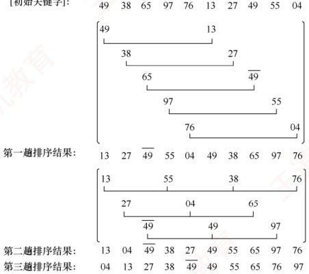

## 8.2 插入排序

插入排序是一种简单直观的排序算法，其基本思想是：每次将一个待排序的记录，按其关键字大小插入到前面已经排好序的子序列中，直到所有记录都插入完毕。基于这一思想，可以引出三种重要的排序算法：直接插入排序、折半插入排序和希尔排序。

### 8.2.1 直接插入排序 $^{①}$

根据上述插入排序的思想，不难得出一种最简单也最直观的直接插入排序算法。假设在排序过程中，待排序表 L[1...n] 在某一时刻的状态如下：

有序序列  $L[1...i-1]$  $L(i)$ 无序序列  $L[i+1...n]$

要将元素  $L(i)$ 插入到已有序的子序列  $L[1...i-1]$ 中，需执行以下操作（为避免混淆，下文中用  $L[\ ]$ 表示一个表，而用  $L(\ )$ 表示一个元素）：

1）查找$L(i)$在$L[1...i-1]$中的插入位置 k。

2）将$L[k...i-1]$中的所有元素依次后移一个位置。

3）将$L(i)$放入位置k。

为实现对整个表$L[1...n]$的排序，可从$L(2)$开始，依次将$L(2)$到$L(n)$插入其前面已排好序的子序列中。初始时，$L[1]$可视为一个长度为 1 的有序子序列。上述过程共执行$n-1$次，最终得到一个有序表。直接插入排序通常采用原地排序（空间复杂度为$O(1)$）。在从后往前的比较过程中，需要将已排序的元素逐个后移，为新元素腾出插入位置。

以下是直接插入排序的实现，其中再次使用了前面提到的“哨兵”（作用相同）。

```c
void InsertSort(ElemType A[], int n) {
    int i, j;
    for (i = 2; i <= n; i++)
        //依次将A[2]～A[n]插入前面已排序序列
        if (A[i] < A[i-1]) {
            //若A[i]关键码小于其前驱，将A[i]插入有序表
            A[0] = A[i];
            //复制为哨兵，A[0]不存放元素
            for (j = i - 1; A[0] < A[j]; --j) //从后往前查找待插入位置
            A[j + 1] = A[j];
            //向后挪位
            A[j + 1] = A[0];
            //复制到插入位置
        }
}
```

假定初始序列为49,38,65,97,76,13,27,$\underline{49}$，初始时49可视为一个已排好序的子序列。按
照上述算法进行直接插入排序的过程如图8.1所示，括号内为当前已排好序的子序列。

| 初始关键字: | (49) 38 | (38) 49 | (38) 49 | (65) 49 | (65) 65 | (97) 97 | (97) 76 | (97) 13 | 27 | 49 |
| --- | --- | --- | --- | --- | --- | --- | --- | --- | --- | --- |
| i=2: | 38 | 49 | 65 | 76 | 97 | 76 | 13 | 27 | 49 | 76 |
| i=3: | 38 | 49 | 65 | 76 | 97 | 76 | 13 | 27 | 49 | 76 |
| i=4: | 38 | 49 | 65 | 76 | 97 | 76 | 13 | 27 | 49 | 76 |
| i=5: | 38 | 49 | 65 | 76 | 97 | 76 | 13 | 27 | 49 | 76 |
| i=6: | 38 | 49 | 65 | 76 | 97 | 76 | 13 | 27 | 49 | 76 |
| i=7: | 38 | 49 | 65 | 76 | 97 | 76 | 13 | 27 | 49 | 76 |
| i=8: | 38 | 49 | 65 | 76 | 97 | 76 | 13 | 27 | 49 | 76 |

▲ 监视哨L.R[0]

图 8.1 直接插入排序示例

直接插入排序的性能分析如下。

空间效率：仅使用常数个辅助单元，空间复杂度为$O(1)$。

时间效率：整个排序过程共进行$n-1$趟插入操作，每趟包括关键字比较和元素移动，具体次数取决于初始序列的状态。最好情况下，表中元素已有序。每插入一个元素只需一次比较，无须移动，时间复杂度为$O(n)$。最坏情况下，表中元素完全逆序。此时每趟插入需比较$i-1$次并移动$i-1$个元素，总时间复杂度为$O(n^2)$。平均情况下，假设元素随机排列，平均比较次数和移动次数均约为$n^2/4$，故时间复杂度仍为$O(n^2)$。因此直接插入排序算法的时间复杂度为$O(n^2)$。

稳定性：由于插入时总是从后往前比较，并在找到插入位置后才移动元素，因此相同关键字的元素相对顺序不会改变。直接插入排序是稳定的排序算法。

适用性：该算法适用于顺序存储和链式存储的线性表，采用链式存储时无须移动元素。

### 8.2.2 折半插入排序

从直接插入排序算法可以看出，每趟插入过程包含两项操作：①在前面的有序子表中查找待插入元素的正确位置；②为该位置腾出空间，并将待插入元素放入其中。在直接插入排序中，总是边比较边移动元素。而折半插入排序则将二者分离：先通过折半查找确定插入位置，再统一移动元素。当排序表采用顺序存储时，可以在查找有序子表时使用折半查找来提高效率。一旦确定了插入位置，便可将该位置及其后的所有元素统一后移一位，从而空出插入位置。

折半插入排序的排序过程示例见本书配套视频，其代码实现如下：

```c
void BInsertSort(ElemType A[], int n) {
    int i, j, low, high, mid;
    for (i = 2; i <= n; i++) {
        //依次将A[2]～A[n]插入前面的已排序序列
        A[0] = A[i]; //将A[i]暂存到A[0]
        low = 1; high = i - 1; //设置折半查找的范围
        while (low <= high) {
            mid = (low + high) / 2; //取中间点
            if (A[mid] > A[0]) high = mid - 1; //查找左半子表
            else low = mid + 1; //查找右半子表
        }
        for (j = i - 1; j >= high + 1; --j)
            A[j + 1] = A[j]; //统一后移元素，空出插入位置
        A[high + 1] = A[0]; //插入操作
    }
}
```
### 考点追踪 直接插入排序和折半插入排序的比较（2012）

空间效率：与直接插入排序相同，仅使用常数个辅助单元，空间复杂度为 O(1)。

时间效率：折半插入排序的主要改进在于减少了关键字的比较次数。由于采用折半查找，比较次数约为$O(n\log_2n)$，仅取决于元素个数 n。然而，元素的移动次数并未减少，仍然依赖于初始序列的有序程度。因此，折半插入排序的时间复杂度仍为$O(n^2)$。

稳定性：在插入过程中保持了相同关键字元素的相对顺序，因此是稳定的排序算法。

适用性：该算法仅适用于顺序存储的线性表。

### 8.2.3 希尔排序

由前文分析可知，直接插入排序的时间复杂度为$O(n^{2})$，但在待排序列接近正序时，其时间效率可提升至$O(n)$。因此，该算法更适用于基本有序或数据量较小的排序场景。希尔排序正是基于这一特性对直接插入排序进行改进，也称为缩小增量排序。

### 考点追踪 希尔排序的特性与分析（2014、2015、2018、2025）

希尔排序的基本思想是：通过逐步缩小增量的方式，对表中相隔一定距离的元素构成的子序列进行多次直接插入排序，使整个表逐渐趋于基本有序，最终通过一趟完整的直接插入排序完成全局排序。具体而言，算法首先选取一个小于$n$的初始增量$d_1$，将待排序表划分为$d_1$个子序列（每个子序列包含下标间隔为$d_1$的记录），并对各子序列分别进行直接插入排序；随后依次取更小的增量$d_2, d_3, \cdots$（满足$d_1 > d_2 > \cdots > d_t = 1$），重复分组与排序操作。当增量减至 1 时，所有记录属于同一子序列，且序列已高度有序，此时执行最后一趟直接插入排序，即可快速获得最终结果。

注意，目前尚未找到理论上最优的增量序列。仍以 8.2.1 节的关键字为例，假定第一趟取$d_1 = 5$，形成 5 个子序列（对应图中第 2 至第 6 行），排序后结果如第 7 行所示；第二趟取$d_2 = 3$，对 3 个子序列排序，结果见第 11 行；最后对整个序列进行一趟排序，完整过程如图 8.2 所示。



图 8.2 希尔排序示例

希尔排序的算法实现如下：

```c
void ShellSort(ElemType A[], int n) {

    //A[0]只是暂存单元，不是哨兵，当j<=0时，插入位置已到int dk, i, j;
for (dk = n / 2; dk >= 1; dk = dk / 2)  //增量变化（无统一规定）
for (i = dk + 1; i <= n; ++i)
    if (A[i] < A[i - dk]) {
        //需将 A[i] 插入有序增量子表
        A[0] = A[i];
        //暂存在 A[0]
        for (j = dk; j > 0 && A[0] < A[j]; j -= dk)
            A[j + dk] = A[j];
        //记录后移，查找插入的位置
        A[j + dk] = A[0];
        //插入
    }
```

希尔排序算法的性能分析如下：

空间效率：仅使用常数个辅助单元，空间复杂度为$O(1)$。

时间效率：时间复杂度依赖于所选增量序列，而最优增量序列仍是数学上的未解难题，因此精确分析较为困难。当 n 在常见范围内时，时间复杂度约为$O(n^{13})$；最坏情况下退化为$O(n^{2})$。

稳定性：当相同关键字的记录被划分到不同子表时，可能会改变它们的相对次序，因此希尔排序是不稳定的排序算法。例如，图8.2中49与$\overline{49}$在排序过程中相对顺序发生了变化。

适用性：希尔排序仅适用于顺序存储的线性表。
