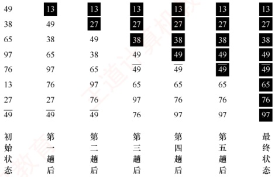
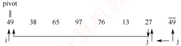
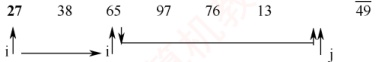
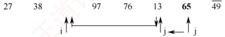
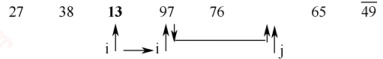
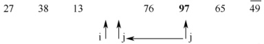
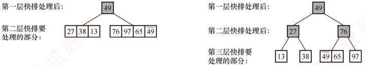
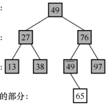
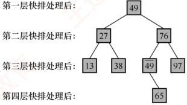

## 8.3 交换排序

所谓交换，是指根据序列中两个元素关键字的比较结果，互换它们在序列中的位置。基于交换思想的排序算法有很多，本书主要介绍冒泡排序与快速排序。其中，冒泡排序实现简单，一般较少直接考查；而快速排序则因效率高、应用广，通常是考查的重点。

### 8.3.1 冒泡排序

冒泡排序的基本思想是：从后往前（或从前往后）依次比较相邻元素的关键字，若为逆序（A[i-1]>A[i]），则交换它们的位置。每一趟排序都会将当前未排序部分中的最小（或最大）元素放到其最终位置——最小元素如气泡上浮至水面（或最大元素如石头下沉至水底）。具体而言，第一趟冒泡将最小元素移至序列首部（或最大元素移至尾部）；第二趟对剩余子序列重复此过程，已确定位置的元素不再参与比较。如此最多进行 n-1 趟冒泡，即可完成整个排序。

图 8.3 所示为冒泡排序的过程，第一趟冒泡时：27<49，不交换；13<27，不交换；76>13，交换；97>13，交换；65>13，交换；38>13，交换；49>13，交换。通过第一趟冒泡后，元素13被移至第一个位置，及其最终位置；第二趟对后续子序列采用同样方法进行排序，如此重复，到第五趟结束后，未发生任何交换，说明序列已有序，算法提前终止。

冒泡排序算法的代码如下：

```c
void BubbleSort(ElemType A[], int n) {
    for (int i=0; i<n-1; i++) {
        bool flag=false; //表示本趟冒泡是否发生交换的标志
        for (int j=n-1; j>i; j--) //一趟冒泡过程
            if (A[j-1] >A[j]) { //若为逆序
```
                swap(A[j-1], A[j]); //使用封装的 swap 函数$^{①}$交换
```c
                flag=true;
            }
        if (flag==false)
            return; //本趟遍历后没有发生交换，说明表已经有序
    }
}
```



图 8.3 冒泡排序示例

冒泡排序的性能分析如下。

空间效率：仅使用常数个辅助单元，空间复杂度为$O(1)$。

时间效率：最好情况下（初始序列有序），仅需第一趟冒泡，共 n-1 次比较，0 次移动，时间复杂度为$O(n)$；最坏情况下（序列初始逆序），需 n-1 趟排序，第 i 趟进行 n-i 次比较，且每次比较后都需 3 次移动来完成交换元素位置。这种情况下，

 $$总比较次数 =\sum_{i=1}^{n-1}(n-i)=\frac{n(n-1)}{2}，移动次数 =\sum_{i=1}^{n-1}3(n-i)=\frac{3n(n-1)}{2}$$

因此，最坏情况下的时间复杂度为  $O(n^{2})$。平均时间复杂度也为  $O(n^{2})$。

稳定性：比较相邻元素时，相等元素不会被交换，因此冒泡排序是稳定的排序算法。

适用性：冒泡排序适用于顺序存储和链式存储的线性表。

**注意**

 **冒泡排序每趟产生的有序子序列具有全局有序性**——已排序部分的所有元素均小于（或大于）未排序部分的所有元素。与直接插入排序的局部有序不同， **冒泡排序每趟能将一个元素精确放置到其最终位置**。

### 8.3.2 快速排序

### 考点追踪 快速排序的思想（2024）

快速排序的基本思想是：在待排序表  $L[1\ldots n]$ 中任取一个元素作为枢轴（pivot，也称基准，通常取首元素），通过一趟排序将原表划分为两个独立的子表  $L[1\ldots k-1]$ 和  $L[k+1\ldots n]$，使得左子表中所有元素的关键字均小于枢轴，右子表中所有元素的关键字均大于或等于枢轴。此时，枢轴元素被放在了其最终位置  $L(k)$ 上，这个过程称为一次划分。随后，分别对两个子表递归地执行相同的划分操作，直至每个子表仅包含一个元素或为空，此时整个序列已完全有序。

一趟快速排序的划分过程本质上是一个双向交替扫描与元素移动的过程，下面通过实例来介绍，附设两个指针 i 和 j，初值分别为 low 和 high，取第一个元素 49 为枢轴 pivot。

j 从右向左扫描，找到第一个小于枢轴的元素 27，将其复制到 i 所指位置。



i 从左向右扫描，找到第一个大于枢轴的元素 65，将其复制到 j 所指位置。



继续向左扫描，找到小于枢轴的元素13，将其复制到i所指位置。



i 继续向右扫描，找到大于枢轴的元素 97，将其复制到 j 所指位置。



如此交替进行，直到 i 与 j 相遇（i==j）。



### 考点追踪 快速排序的中间过程的分析（2014、2019、2023）

此时，i 左侧的所有元素均小于 49，右侧的所有元素均大于或等于 49。将枢轴 49 放入 i 所指位置，即完成第一趟划分。原序列被分割为两个子序列，分别位于枢轴的左右两侧。

```c
第一趟后：{27 38 13} 49 {76 97 65 49}
```

接下来，对这两个子序列分别递归地应用同样的快速排序过程。若某子序列仅包含一个元素，则该子序列自然有序，无须进一步处理。

| 第二趟后： | {13} | 27 | {38} | 49 | {49} | 65 | 76 | {97} |
| --- | --- | --- | --- | --- | --- | --- | --- | --- |
| 第三趟后： | 13 | 27 | 38 | 49 | 49 | {65} | 76 | 97 |
| 第四趟后： | 13 | 27 | 38 | 49 | 49 | 65 | 76 | 97 |

整个递归调用的层次结构可以用一棵二叉树来表示，如图8.4所示。

第二层快排要处理的部分：



(a) 第一层快排处理后

(b)第二层快排处理后

第一层快排处理后：49

第二层快排处理后：27 76

第三层快排处理后：13 38 49 97

第四层快排要处理的部分：65



(c) 第三层快排处理后



第四层快排处理后：

(d)第四层快排处理后：最终结果

图 8.4 快速排序的递归执行过程

假设划分操作已封装为函数 Partition()，其功能是对子表 A[low...high] 进行一趟划分，并返回枢轴元素的最终位置 k。在此基础上，快速排序的递归实现如下：

```c
void QuickSort(ElemType A[], int low, int high) {
    if (low < high) {
        //递归跳出的条件
    }
    Partition() 就是划分操作，将表 A[low…high] 划分为满足上述条件的两个子表
    int pivotpos = Partition(A, low, high); //划分
    QuickSort(A, low, pivotpos-1); //依次对两个子表进行递归排序
    QuickSort(A, pivotpos+1, high);
}
```

### 考点追踪 （算法题）快速排序中划分操作的应用（2016）

考研所考查的划分操作，通常以子表的第一个元素作为枢轴来对表进行划分，将比枢轴小的元素逐步移至左侧，比枢轴大的元素移至右侧，最终使枢轴归位。典型实现如下：

```c
int Partition(ElemType A[], int low, int high) { //一趟划分
    ElemType pivot = A[low]; //将当前表中第一个元素设为枢轴，对表进行划分
    while (low < high) { //循环跳出条件
        while (low < high && A[high] >= pivot) --high;
        A[low] = A[high]; //将比枢轴小的元素移动到左端
        while (low < high && A[low] <= pivot) ++low;
        A[high] = A[low]; //将比枢轴大的元素移动到右端
    }
    A[low] = pivot; //枢轴元素存放到最终位置
    return low; //返回存放枢轴的最终位置
}
```

快速排序的性能高度依赖于划分的平衡性，其性能分析如下。

### 考点追踪 快速排序中递归次数的影响因素分析（2010）

空间效率：由于采用递归实现，算法需借助系统栈保存每层递归的上下文信息，栈的容量等于递归调用的最大层数。最好情况下（每次划分均分）为  $O(\log_2 n)$；最坏情况下（划分极不平衡），需进行 n-1 次递归调用，栈的容量为  $O(n)$；平均情况下为  $O(\log_2 n)$。

时间效率：最坏情况发生在初始序列基本有序或基本逆序时，每趟划分仅减少一个元素，总比较次数约为  $n(n-1)/2$，时间复杂度为  $O(n^2)$。最好情况是每次划分都将序列等分为两部分，此时时间复杂度为  $O(n\log_2 n)$。值得注意的是，快速排序的平均运行时间非常接近其最优情况，远优于最坏情况，因此它是所有内部排序算法中平均性能最优的排序方法。

有很多方法可以提高划分的平衡性：一种是三数取中法，从子序列的首、尾及中间三个位置各取一个元素，以其中位数作为枢轴；或者随机选取子序列中的某个元素作为枢轴。

稳定性：在划分过程中，若右侧区域有两个关键字相等，且均小于枢轴，则交换到左侧区域后，它们的相对位置会发生改变，因此快速排序是不稳定的排序算法。例如，表  $L=\{3,2,2\}$，经过一趟排序后  $L=\{2,2,3\}$，也是最终排序结果，显然，2与2的相对次序已发生了变化。

### 考点追踪 快速排序适合采用的存储方式（2011）

适用性：快速排序要求能够随机访问元素，因此仅适用于顺序存储的线性表。

**注意**

快速排序在每趟划分后并不产生全局有序的子序列。然而，每趟划分都能确保当前所选的枢轴元素被精确放置到其在整个序列中的最终位置上。这一特性是快速排序高效性的关键所在。
