## 8.4 选择排序

选择排序的基本思想是：每一趟（如第 $i$趟）在后面 $n-i+1$（ $i=1,2,\cdots,n-1$）个待排序元素中选取关键字最小的元素，作为有序子序列的第 $i$个元素。直到第 $n-1$趟排序完成，待排序元素只剩下1个，无须再选。选择排序中的堆排序是历年统考查的重点。

### 8.4.1 简单选择排序

根据上述选择排序的思想，可直观得出简单选择排序的算法思想：假设排序表为  $L[1...n]$，第  $i$ 趟排序从  $L[i...n]$ 中选出关键字最小的元素，并将其与  $L(i)$ 交换。每一趟排序均可确定一个元素的最终位置，经过  $n-1$ 趟排序后，整个表即有序。

简单选择排序的过程较为直观，具体示例可参考配套视频。其代码实现如下：

```c
void SelectSort(ElemType A[], int n) {
    for(int i=0; i<n-1; i++) {
        //共进行 n-1 趟
        int min=i;
        for(int j=i+1; j<n; j++) {
            if(A[j]<A[min]) min=j;
            //更新最小元素位置
            if(min!=i) swap(A[i], A[min]); //swap()函数共移动元素3次
        }
    }
}
```

简单选择排序算法的性能分析如下。

空间效率：仅使用常数个辅助单元，空间复杂度为 O(1)。

### 考点追踪 简单选择排序的性能分析（2025）

时间效率：排序过程中，总移动次数很少，最多不超过3(n-1)次，最好情况下为0次，即序列初始有序；但总比较次数与序列初态无关，始终为 $n(n-1)/2$次，因此时间复杂度恒为 $O(n^2)$。

稳定性：在交换过程中，若被选中的最小元素与当前位置元素之间存在相同关键字的记录，则会改变其相对顺序。例如，表  $L=\{2,2,1\}$，经过一趟排序后  $L=\{1,2,2\}$，也是最终排序结果，显然，2与2的相对次序已发生改变。因此，简单选择排序是不稳定的排序算法。

适用性：简单选择排序适用于顺序存储和链式存储的线性表，尤其适合关键字较少的情况。

### 8.4.2 堆排序

堆的定义如下，n 个关键字序列  $L[1...n]$ 称为堆，当且仅当该序列满足以下条件之一：

①  $\mathrm{L}\left(\mathrm{i}\right)\geqslant\mathrm{L}\left(2\mathrm{i}\right)$ 且  $\mathrm{L}\left(\mathrm{i}\right)\geqslant\mathrm{L}\left(2\mathrm{i}+1\right)$ 或

 $$\textcircled{2}\mathrm{~L\left(i\right)\leqslant L\left(2i\right)} 且 \mathrm{L\left(i\right)\leqslant L\left(2i+1\right)}\quad\left(1\leqslant i\leqslant\left\lfloor n/2\right\rfloor\right)$$

### 考点追踪 堆的性质与特点（2020）

可将堆视为一棵完全二叉树。满足条件 $^{①}$的堆称为大根堆（大顶堆），其最大元素位于根结点，且任意非根结点的值均不大于其双亲结点。满足条件 $^{②}$的堆称为小根堆（小顶堆），其最小元素位于根结点，性质与大根堆恰好相反。图8.5所示为一个大根堆。

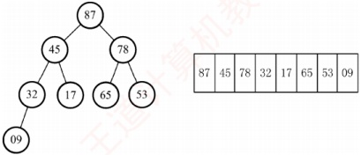

图 8.5 一个大根堆示意图

最新统考大纲新增了“堆的应用”考点，堆的主要应用包括堆排序、Top-K问题和优先队列（见本节综合题7），Top-K问题和优先队列均利用了堆的结构特性，本节主要介绍堆排序。

堆排序的基本思路是：首先将待排序序列  $L[1\ldots n]$ 构建成初始堆（以大顶堆为例），此时堆顶即为最大值。随后，交换堆顶元素与堆底元素，使最大值归位；接着将剩余 n-1 个元素重新调整为堆，再取出新的堆顶。重复此过程，直至堆中仅剩一个元素。因此，堆排序需解决两个问题：① 如何将无序序列构造成初始堆？② 输出堆顶后，如何高效调整剩余元素为新堆？

### 考点追踪 ▶ 初始建堆的操作（2018、2021）

堆排序的关键在于初始堆的构建。建堆的基本策略是：按自底向上的顺序（从最后一个分支结点到根结点），依次对每个分支结点执行自上而下的筛选操作：若其不满足堆的性质，则调整其对应的子树。对于含  $n$ 个结点的完全二叉树，最后一个分支结点的编号为  $\lfloor n/2 \rfloor$。因此，建堆过程从  $i = \lfloor n/2 \rfloor$ 开始，依次向前处理至  $i = 1$。具体而言：对每个结点  $i$，若其关键字小于左右子结点中的较大者（大根堆情形），则将其与该较大的子结点交换；交换后可能破坏下层子树的堆性质，因此需要继续沿该路径向下调整，直至当前子树重新满足堆的定义。通过依次对各分支结点执行上述的向下调整操作，最终可将整个无序序列构建成一个完整的堆。

如图 8.6 所示，初始时调整  $L(4)$ 子树，09<32，交换后满足堆定义；接着调整  $L(3)$ 子树，78<左右孩子中的较大者87，交换后满足堆定义；再调整  $L(2)$ 子树，17<左右孩子中的较大者45，交换后满足堆定义；继续调整根结点  $L(1)$，53<左右孩子中的较大者87，交换后破坏了  $L(3)$ 子树的堆，于是对  $L(3)$ 重新调整，53<左右孩子中的较大者78，交换后，该完全二叉树满足堆定义。

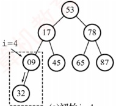

(a) 初始 i=4

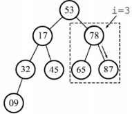

(b)i=3

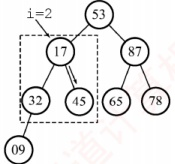

(c)i=2

i=1

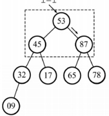

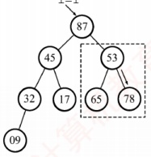

(d)i=1

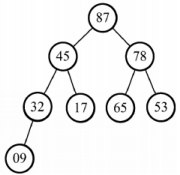

(e)结果

图 8.6 自下往上逐步调整为大根堆

### 考点追踪 堆的删除操作及调整分析（2015、2024）

每次输出堆顶后，将堆底元素移至堆顶，此时堆的性质可能被破坏，需要自上而下地进行筛选：将新堆顶与其左右孩子中的较大者比较，若小于该子结点，则交换；重复此过程，直至恢复堆性质。例如，当09移至堆顶后，先与左右孩子中的较大者78交换，交换后破坏了 $L(3)$子树的堆；继续对 $L(3)$子树向下筛选，将09与65交换，最终得到新堆，调整过程如图8.7所示。

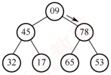

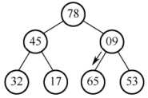

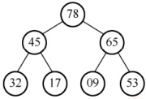

图 8.7 输出堆顶后再将剩余元素调整成新堆

建立大根堆的算法如下：

```c
void BuildMaxHeap(ElemType A[], int len) {
    for (int i=len/2; i>0; i--) //从最后一个分支结点到根结点
        HeapAdjust(A, i, len); //反复调整子树
}

void HeapAdjust(ElemType A[], int k, int len) {
    //对以k为根的子树进行调整
    A[0]=A[k]; //A[0]暂存子树的根结点
```
```c
    for (int i=2*k; i<=len; i*=2) { //沿关键字较大的子结点向下筛选
        if (i<len&&A[i]<A[i+1])
```
```c
            i++; //取关键字较大的子结点的下标
        if (A[0]>=A[i]) break; //筛选结束
        else {
            A[k]=A[i]; //将较大结点上移
            k=i; //修改k值，以便继续向下筛选
        }
    }
    A[k]=A[0]; //被筛选结点的值放入最终位置
}
```

堆调整的时间复杂度与树高成正比，为  $O(h)$。构建含 n 个元素的堆时，关键字的总比较次数不超过 4n，故建堆时间复杂度为  $O(n)$，即可以在线性时间内将无序数组建成堆。

堆排序的完整算法如下：

```c
void HeapSort(ElemType A[], int len) {
    BuildMaxHeap(A, len); //初始建堆
    for (int i=len; i>1; i--) {
        //执行 n-1 趟排序
        Swap(A[i], A[1]); //输出堆顶元素（与堆底元素交换）
        HeapAdjust(A, 1, i-1); //把剩余 i-1 个元素重新整理为堆
    }
}
```

### 考点追踪 堆的插入操作及调整操作分析（2009、2011）

同时，堆也支持插入操作。插入时，先将新元素置于堆末端，然后自下而上地与其父结点比较：若违反堆性质，则交换，直至满足堆定义。图8.8展示了大根堆的插入操作示例。

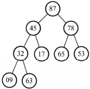

(a) 初始，尾部插入 63

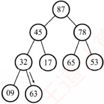

(b)63>32，交换，32下沉

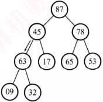

(c)63>45，交换，45下沉

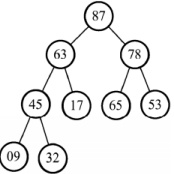

图 8.8 大根堆的插入操作示例

(d) 调整完成

### 考点追踪 堆在海量数据中选出最小 k 个数的应用及效率分析（2022）

堆排序适用于大规模数据的排序场景，还常用于解决 Top-K 问题。例如，在 1 亿个数中选出最大的 100 个数。首先使用一个大小为 100 的数组，读入前 100 个数，构建小顶堆，而后依次读入后续数字，若小于堆顶则舍弃，否则用该数替换堆顶并向下调整，待数据读取完毕，堆中 100 个数为所求。此方法的时间复杂度为  $O(\log_{2}k)$，空间复杂度为  $O(k)$，效率远高于全排序。

堆排序算法的性能分析如下。

空间效率：仅使用了常数个辅助单元，空间复杂度为 O(1)。

时间效率：建堆的时间复杂度为  $O(n)$，随后需进行 n-1 次堆顶输出与调整操作，每次调整的时间复杂度为  $O(\log_2 n)$。因此，堆排序在最好、最坏和平均情况下的时间复杂度均为  $O(n \log_2 n)$。

稳定性：在堆调整过程中，相等关键字的元素可能因交换而改变其原始相对位置，因此堆排序是不稳定的排序算法。例如，表  $L=\{1,2,2\}$，建堆时可能将2交换到堆顶，此时  $L=\{2,1,2\}$，最终排序序列为  $L=\{1,2,2\}$，显然，2与2的相对次序已发生变化。

适用性：堆排序依赖完全二叉树的随机访问特性，因此仅适用于顺序存储的线性表。
