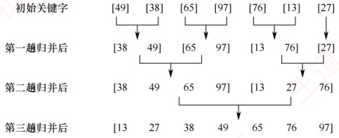
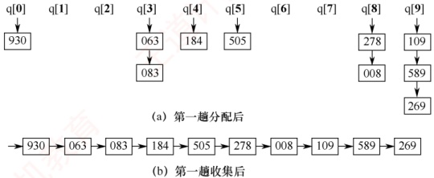
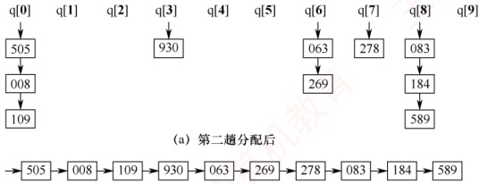
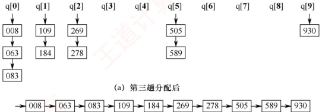
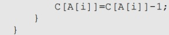
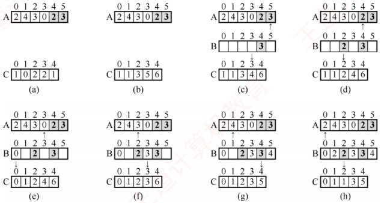

## 8.5 归并排序、基数排序和计数排序

### 8.5.1 归并排序

### 考点追踪 2 路归并操作的功能（2022）

归并排序不同于基于交换或选择的排序方法，其核心思想是“归并”——即将两个或多个有序序列合并为一个更长的有序序列。具体地，对于含有 $n$ 个记录的待排序表，可将其视为 $n$ 个长度为 1 的有序子表；然后两两归并，得到 $\lceil n/2 \rceil$ 个长度为 2（或 1）的有序子表；继续两两归并……如此重复，直至合并成一个长度为 $n$ 的有序表为止，这种排序算法称为 2 路归并排序。

图 8.9 展示了一个 2 路归并排序的示例，经过三趟归并后合并为一个完整的有序序列。



图 8.9 2 路归并排序示例

### 考点追踪 （算法题）归并排序思想的应用（2011）

归并操作由函数 Merge() 实现，其功能是将同一顺序表中前后相邻的两个有序子表合并为一个有序表。首先将这两个子表的所有元素复制到辅助数组 B 中。随后，设置两个指针分别指向 B 中两段的起始位置，依次比较当前元素的关键字，将较小者放入原数组 A 的对应位置。其中一段的所有元素均已复制完毕后，将另一段的剩余部分直接复制到 A 中。具体实现如下：
```c
ElemType *B=(ElemType *)malloc((n+1)*sizeof(ElemType)); //辅助数组 B
void Merge(ElemType A[], int low, int mid, int high) {
//表 A 的两段 A[low..mid] 和 A[mid+1..high] 各自有序，将它们合并成一个有序表
int i, j, k;
for (k=low; k<=high; k++)
```
```c
    B[k]=A[k]; //将 A 中所有元素复制到 B 中
for (i=low, j=mid+1, k=i; i<=mid && j<=high; k++) {
    if (B[i]<=B[j]) //比较 B 的两个段中的元素
        A[k]=B[i++]; //将较小值复制到 A 中
    else
        A[k]=B[j++];
    }
    while (i<=mid)    A[k++]=B[i++]; //若第一个表未检测完，复制
    while (j<=high)    A[k++]=B[j++]; //若第二个表未检测完，复制
}
```

**注意**

在上述代码中，最后两个 while 循环仅有一个会执行。

在非递归的归并排序中，一趟归并操作是指：将当前序列划分为若干长度为 $h$ 的有序段，然后两两归并，形成长度为 $2h$ 的有序段。若序列总长度为 $n$，则每趟需调用 $\lceil n/(2h) \rceil$ 次 Merge() 函数。整个排序过程共需进行 $\lceil \log_2 n \rceil$ 趟归并。

递归形式的2路归并排序基于分治策略，其过程如下。

分解：将含 n 个元素的待排序表从中间分为两个子表，每个子表含约 n/2 个元素。

递归求解：对两个子表分别递归地进行归并排序。

合并：合并两个已排序的子表得到排序结果。

2 路归并排序的递归实现如下：

```c
void MergeSort(ElemType A[], int low, int high) {
    if (low < high) {
        int mid = (low + high) / 2; // 从中间划分两个子序列
        MergeSort(A, low, mid); // 对左侧子序列进行递归排序
        MergeSort(A, mid + 1, high); // 对右侧子序列进行递归排序
        Merge(A, low, mid, high); // 归并
    }
}
```

### 考点追踪 2 路归并比较次数的分析（2024）

2 路归并排序算法的性能分析如下：

空间效率：归并操作需要一个与待排序表等长的辅助数组，因此空间复杂度为  $O(n)$。

时间效率：每趟归并需要遍历所有 $n$ 个元素，时间复杂度为 $O(n)$；共需进行 $\lceil \log_2 n \rceil$ 趟，总时间复杂度为 $O(n \log_2 n)$。

稳定性：在归并过程中，当两个元素关键字相等时，优先取自前一段，从而保持了相同关键字元素的相对次序。因此2路归并排序是稳定的排序算法。

适用性：归并排序仅需顺序访问元素，因此适用于顺序存储和链式存储的线性表。

**注意**

一般而言，对 $N$ 个元素进行 $k$ 路归并排序时，排序的趟数 $m$ 满足 $k^m = N$，从而 $m = \log_k N$，又考虑到 $m$ 为整数，因此 $m = \lceil \log_k N \rceil$。这与前述的 2 路归并排序算法是一致的。
### 8.5.2 基数排序

基数排序是一种很特别的排序算法，它不依赖于元素间的比较，而基于关键字各位的大小进行排序。基数排序是一种借助多关键字排序的思想对单逻辑关键字进行排序的方法。

假设长度为 n 的线性表中，每个结点  $a_j$ 的关键字由  $d$ 个分量  $(k_j^{d-1}, k_j^{d-2}, \cdots, k_j^1, k_j^0)$ 组成，满足  $0 \leq k_j^i \leq r-1$（ $0 \leq j < n, 0 \leq i \leq d-1$）。其中  $k_j^{d-1}$ 为最高位关键字， $k_j^0$ 为最低位关键字。

为实现多关键字排序，通常有两种方法：第一种是最高位优先（MSD）法，按关键字位权重递减依次逐层划分成若干更小的子序列，最后将所有子序列依次连接成一个有序序列；第二种是最低位优先（LSD）法，按关键字位权重递增依次进行排序，最后形成一个有序序列。

以下描述以基数  $r$ 进行的最低位优先基数排序过程。算法使用  $r$ 个队列  $Q_0, Q_1, \cdots, Q_{r-1}$。对每一位  $i = 0, 1, \cdots, d-1$，依次执行一次分配和收集操作（每轮本质上是一次稳定的排序）：

① 分配：初始化所有队列为空，然后依次扫描线性表中的每个结点  $a_{j}$ ( $j=0,1,\cdots,n-1$)，若  $a_{j}$ 在当前位上的关键字值为 k，则将其加入队列  $Q_{k}$。

② 收集：按  $Q_{0}$，到  $Q_{r-1}$ 的顺序，依次将各队列中的结点连接起来，形成新的线性表。

### 考点追踪 基数排序的中间过程的分析（2013、2021）

通常采用链式基数排序。例如，对以下10个记录进行排序：

\[\begin{array}{r l r l r l r l r l r l r l r l r l r l r l r l r l r l r l r l r l r l r l r l r l r l r l r l r l r l r l r l r l r l r l r l r l r l r l r l r l r l r l r l r l r l r l r l r l r l r l r l r l r l r l r l r l r l r l r l r l r l r l r l r l r l r l r l r l r l r l r l r l r l r l r l r l r l r l r l r l r l r l r l r l r l r l r l r l r l r l r l r l r l r l r l r l r l r l r l r l r l r l r l r l r l r l r l r l r l r l r l r l r l r l r l r l r l r l r l r l r l r l r l r l r l r l r l r l r l r l r l r l r l r l r l r l r l r l r l r l r l r l r l r l r l r l r l r l r l r l r l r l r l r l r l r l r l r l r l r l r l r l r l r l r l r l r l r l r l r l r l r l r l r l r l r l r l r l r l r l r l r l r l r l r l r l r l r l r l r l r l r l r l r l r l r l r l r l r l r l r l r l r l r l r l r l r l r l r l r l r l r l r l r l r l r l r l r l r l r l r l r l r l r l r l r l r l r l r l r l r l r l r l r l r l r l r l r l r l r l r l r l r l r l r l r l r l r l r l r l r l r l r l r l r l r l r l r l r l r l r l r l r l r l r l r l r l r l r l r l r l r l r l r l r l r l r l r l r l r l r l r l r l r l r l r l r l r l r l r l r l r l r l r l r l r l r l r l r l r l r l r l r l r l r l r l r l r l r l r l r l r l r l r l r l r l r l r l r l r l r l r l r l r l r l r l r l r l r l r l r l r l r l r l r l r l r l r l r l r l r l r l r l r l r l r l r l r l r l r l r l r l r l r l r l r l r l r l r l r l r l r l r l r l r l r l r l r l r l r l r l r l r l r l r l r l r l r l r l r l r l r l r l r l r l r l r l r l r l r l r l r l r l r l r l r l r l r l r l r l r l r l r l r l r l r l r l r l r l r l r l r l r l r l r l r l r l r l r l r l r l r l r l r l r l r l r l r l r l r l r l r l r l r l r l r l r l r l r l r l r l r l r l r l r l r l r l r l r l r l r l r l r l r l r l r l r l r l r l r l r l r l r l r l r l r l r l r l r l r l r l r l r l r l r l r l r l r l r l r l r l r l r l r l r l r l r l r l r l r l r l r l r l r l r l r l r l r l r l r l r l r l r l r l r l r l r l r l r l r l r l r l r l r l r l r l r l r l r l r l r l r l r l r l r l r l r l r l r l r l r l r l r l r l r l r l r l r l r l r l r l r l r l r l r l r l r l r l r l r l r l r l r l r l r l r l r l r l r l r l r l r l r l r l r l r l r l r l r l r l r l r l r l r l r l r l r l r l r l r l r l r l r l r l r l r l r l r l r l r l r l r l r l r l r l r l r l r l r l r l r l r l r l r l r l r l r l r l r l r l r l r l r l r l r l r l r l r l r l r l r l r l r l r l r l r l r l r l r l r l r l r l r l r l r l r l r l r l r l r l r l r l r l r l r l r l r l r l r l r l r l r l r l r l r l r l r l r l r l r l r l r l r l r l r l r l r l r l r l r l r l r l r l r l r l r l r l r l r l r l r l r l r l r l r l r l r l r l r l r l r l r l r l r l r l r l r l r l r l r l r l r l r l r l r l r l r l r l r l r l r l r l r l r l r l r l r l r l r l r l r l r l r l r l r l r l r l r l r l r l r l r l r l r l r l r l r l r l r l r l r l r l r l r l r l r l r l r l r l r l r l r l r l r l r l r l r l r l r l r l r l r l r l r l r l r l r l r l r l r l r l r l r l r l r l r l r l r l r l r l r l r l r l r l r l r l r l r l r l r l r l r l r l r l r l r l r l r l r l r l r l r l r l r l r l r l r l r l r l r l r l r l r l r l r l r l r l r l r l r l r l r l r l r l r l r l r l r l r l r l r l r l r l r l r l r l r l r l r l r l r l r l r l r l r l r l r l r l r l r l r l r l r l r l r l r l r l r l r l r l r l r l r l r l r l r l r l r l r l r l r l r l r l r l r l r l r l r l r l r l r l r l r l r l r l r l r l r l r l r l r l r l r l r l r l r l r l r l r l r l r l r l r l r l r l r l r l r l r l r l r l r l r l r l r l r l r l r l r l r l r l r l r l r l r l r l r l r l r l r l r l r l r l r l r l r l r l r l r l r l r l r l r l r l r l r l r l r l r l r l r l r l r l r l r l r l r l r l r l r l r l r l r l r l r l r l r l r l r l r l r l r l r l r l r l r l r l r l r l r l r l r l r l r l r l r l r l r l r l r l r l r l r l r l r l r l r l r l r l r l r l r l r l r l r l r l r l r l r l r l r l r l r l r l r l r l r l r l r l r l r l r l r l r l r l r l r l r l r l r l r l r l r l r l r l r l r l r l r l r l r l r l r l r l r l r l r l r l r l r l r l r l r l r l r l r l r l r l r l r l r l r l r l r l r l r l r l r l r l r l r l r l r l r l r l r l r l r l r l r l r l r l r l r l r l r l r l r l r l r l r l r l r l r l r l r l r l r l r l r l r l r l r l r l r l r l r l r l r l r l r l r l r l r l r l r l r l r l r l r l r l r l r l r l r l r l r l r l r l r l r l r l r l r l r l r l r l r l r l r l r l r l r l r l r l r l r l r l r l r l r l r l r l r l r l r l r l r l r l r l r l r l r l r l r l r l r l r l r l r l r l r l r l r l r l r l r l r l r l r l r l r l r l r l r l r l r l r l r l r l r l r l r l r l r l r l r l r l r l r l r l r l r l r l r l r l r l r l r l r l r l r l r l r l r l r l r l r l r l r l r l r l r l r l r l r l r l r l r l r l r l r l r l r l r l r l r l r l r l r l r l r l r l r l r l r l r l r l r l r l r l r l r l r l r l r l r l r l r l r l r l r l r l r l r l r l r l r l r l r l r l r l r l r l r l r l r l r l r l r l r l r l r l r l r l r l r l r l r l r l r l r l r l r l r l r l r l r l r l r l r l r l r l r l r l r l r l r l r l r l r l r l r l r l r l r l r l r l r l r l r l r l r l r l r l r l r l r l r l r l r l r l r l r l r l r l r l r l r l r l r l r l r l r l r l r l r l r l r l r l r l r l r l r l r l r l r l r l r l r l r l r l r l r l r l r l r l r l r l r l r l r l r l r l r l r l r l r l r l r l r l r l r l r l r l r l r l r l r l r l r l r l r l r l r l r l r l r l r l r l r l r l r l r l r l r l r l r l r l r l r l r l r l r l r l r l r l r l r l r l r l r l r l r l r l r l r l r l r l r l r l r l r l r l r l r l r l r l r l r l r l r l r l r l r l r l r l r l r l r l r l r l r l r l r l r l r l r l r l r l r l r l r l r l r l r l r l r l r l r l r l r l r l r l r l r l r l r l r l r l r l r l r l r l r l r l r l r l r l r l r l r l r l r l r l r l r l r l r l r l r l r l r l r l r l r l r l r l r l r l r l r l r l r l r l r l r l r l r l r l r l r l r l r l r l r l r l r l r l r l r l r l r l r l r l r l r l r l r l r l r l r l r l r l r l r l r l r l r l r l r l r l r l r l r l r l r l r l r l r l r l r l r l r l r l r l r l r l r l r l r l r l r l r l r l r l r l r l r l r l r l r l r l r l r l r l r l r l r l r l r l r l r l r l r l r l r l r l r l r l r l r l r l r l r l r l r l r l r l r l r l r l r l r l r l r l r l r l r l r l r l r l r l r l r l r l r l r l r l r l r l r l r l r l r l r l r l r l r l r l r l r l r l r l r l r l r l r l r l r l r l r l r l r l r l r l r l r l r l r l r l r l r l r l r l r l r l r l r l r l r l r l r l r l r l r l r l r l r l r l r l r l r l r l r l r l r l r l r l r l r l r l r l r l r l r l r l r l r l r l r l r l r l r l r l r l r l r l r l r l r l r l r l r l r l r l r l r l r l r l r l r l r l r l r l r l r l r l r l r l r l r l r l r l r l r l r l r l r l r l r l r l r l r l r l r l r l r l r l r l r l r l r l r l r l r l r l r l r l r l r l r l r l r l r l r l r l r l r l r l r l r l r l r l r l r l r l r l r l r l r l r l r l r l r l r l r l r l r l r l r l r l r l r l r l r l r l r l r l r l r l r l r l r l r l r l r l r l r l r l r l r l r l r l r l r l r l r l r l r l r l r l r l r l r l r l r l r l r l r l r l r l r l r l r l r l r l r l r l r l r l r l r l r l r l r l r l r l r l r l r l r l r l r l r l r l r l r l r l r l r l r l r l r l r l r l r l r l r l r l r l r l r l r l r l r l r l r l r l r l r l r l r l r l r l r l r l r l r l r l r l r l r l r l r l r l r l r l r l r l r l r l r l r l r l r l r l r l r l r l r l r l r l r l r l r l r l r l r l r l r l r l r l r l r l r l r l r l r l r l r l r l r l r l r l r l r l r l r l r l r l r l r l r l r l r l r l r l r l r l r l r l r l r l r l r l r l r l r l r l r l r l r l r l r l r l r l r l r l r l r l r l r l r l r l r l r l r l r l r l r l r l r l r l r l r l r l r l r l r l r l r l r l r l r l r l r l r l r l r l r l r l r l r l r l r l r l r l r l r l r l r l r l r l r l r l r l r l r l r l r l r l r l r l r l r l r l r l r l r l r l r l r l r l r l r l r l r l r l r l r l r l r l r l r l r l r l r l r l r l r l r l r l r l r l r l r l r l r l r l r l r l r l r l r l r l r l r l r l r l r l r l r l r l r l r l r l r l r l r l r l r l r l r l r l r l r l r l r l r l r l r l r l r l r l r l r l r l r l r l r l r l r l r l r l r l r l r l r l r l r l r l r l r l r l r l r l r l r l r l r l r l r l r l r l r l r l r l r l r l r l r l r l r l r l r l r l r l r l r l r l r l r l r l r l r l r l r l r l r l r l r l r l r l r l r l r l r l r l r l r l r l r l r l r l r l r l r l r l r l r l r l r l r l r l r l r l r l r l r l r l r l r l r l r l r l r l r l r l r l r l r l r l r l r l r l r l r l r l r l r l r l r l r l r l r l r l r l r l r l r l r l r l r l r l r l r l r l r l r l r l r l r l r l r l r l r l r l r l r l r l r l r l r l r l r l r l r l r l r l r l r l r l r l r l r l r l r l r l r l r l r l r l r l r l r l r l r l r l r l r l r l r l r l r l r l r l r l r l r l r l r l r l r l r l r l r l r l r l r l r l r l r l r l r l r l r l r l r l r l r l r l r l r l r l r l r l r l r l r l r l r l r l r l r l r l r l r l r l r l r l r l r l r l r l r l r l r l r l r l r l r l r l r l r l r l r l r l r l r l r l r l r l r l r l r l r l r l r l r l r l r l r l r l r l r l r l r l r l r l r l r l r l r l r l r l r l r l r l r l r l r l r l r l r l r l r l r l r l r l r l r l r l r l r l r l r l r l r l r l r l r l r l r l r l r l r l r l r l r l r l r l r l r l r l r l r l r l r l r l r l r l r l r l r l r l r l r l r l r l r l r l r l r l r l r l r l r l r l r l r l r l r l r l r l r l r l r l r l r l r l r l r l r l r l r l r l r l r l r l r l r l r l r l r l r l r l r l r l r l r l r l r l r l r l r l r l r l r l r l r l r l r l r l r l r l r l r l r l r l r l r l r l r l r l r l r l r l r l r l r l r l r l r l r l r l r l r l r l r l r l r l r l r l r l r l r l r l r l r l r l r l r l r l r l r l r l r l r l r l r l r l r l r l r l r l r l r l r l r l r l r l r l r l r l r l r l r l r l r l r l r l r l r l r l r l r l r l r l r l r l r l r l r l r l r l r l r l r l r l r l r l r l r l r l r l r l r l r l r l r l r l r l r l r l r l r l r l r l r l r l r l r l r l r l r l r l r l r l r l r l r l r l r l r l r l r l r l r l r l r l r l r l r l r l r l r l r l r l r l r l r l r l r l r l r l r l r l r l r l r l r l r l r l r l r l r l r l r l r l r l r l r l r l r l r l r l r l r l r l r l r l r l r l r l r l r l r l r l r l r l r l r l r l r l r l r l r l r l r l r l r l r l r l r l r l r l r l r l r l r l r l r l r l r l r l r l r l r l r l r l r l r l r l r l r l r l r l r l r l r l r l r l r l r l r l r l r l r l r l r l r l r l r l r l r l r l r l r l r l r l r l r l r l r l r l r l r l r l r l r l r l r l r l r l r l r l r l r l r l r l r l r l r l r l r l r l r l r l r l r l r l r l r l r l r l r l r l r l r l r l r l r l r l r l r l r l r l r l r l r l r l r l r l r l r l r l r l r l r l r l r l r l r l r l r l r l r l r l r l r l r l r l r l r l r l r l r l r l r l r l r l r l r l r l r l r l r l r l r l r l r l r l r l r l r l r l r l r l r l r l r l r l r l r l r l r l r l r l r l r l r l r l r l r l r l r l r l r l r l r l r l r l r l r l r l r l r l r l r l r l r l r l r l r l r l r l r l r l r l r l r l r l r l r l r l r l r l r l r l r l r l r l r l r l r l r l r l r l r l r l r l r l r l r l r l r l r l r l r l r l r l r l r l r l r l r l r l r l r l r l r l r l r l r l r l r l r l r l r l r l r l r l r l r l r l r l r l r l r l r l r l r l r l r l r l r l r l r l r l r l r l r l r l r l r l r l r l r l r l r l r l r l r l r l r l r l r l r l r l r l r l r l r l r l r l r l r l r l r l r l r l r l r l r l r l r l r l r l r l r l r l r l r l r l r l r l r l r l r l r l r l r l r l r l r l r l r l r l r l r l r l r l r l r l r l r l r l r l r l r l r l r l r l r l r l r l r l r l r l r l r l r l r l r l r l r l r l r l r l r l r l r l r l r l r l r l r l r l r l r l r l r l r l r l r l r l r l r l r l r l r l r l r l r l r l r l r l r l r l r l r l r l r l r l r l r l r l r l r l r l r l r l r l r l r l r l r l r l r l r l r l r l r l r l r l r l r l r l r l r l r l r l r l r l r l r l r l r l r l r l r l r l r l r l r l r l r l r l r l r l r l r l r l r l r l r l r l r l r l r l r l r l r l r l r l r l r l r l r l r l r l r l r l r l r l r l r l r l r l r l r l r l r l r l r l r l r l r l r l r l r l r l r l r l r l r l r l r l r l r l r l r l r l r l r l r l r l r l r l r l r l r l r l r l r l r l r l r l r l r l r l r l r l r l r l r l r l r l r l r l r l r l r l r l r l r l r l r l r l r l r l r l r l r l r l r l r l r l r l r l r l r l r l r l r l r l r l r l r l r l r l r l r l r l r l r l r l r l r l r l r l r l r l r l r l r l r l r l r l r l r l r l r l r l r l r l r l r l r l r l r l r l r l r l r l r l r l r l r l r l r l r l r l r l r l r l r l r l r l r l r l r l r l r l r l r l r l r l r l r l r l r l r l r l r l r l r l r l r l r l r l r l r l r l r l r l r l r l r l r l r l r l r l r l r l r l r l r l r l r l r l r l r l r l r l r l r l r l r l r l r l r l r l r l r l r l r l r l r l r l r l r l r l r l r l r l r l r l r l r l r l r l r l r l r l r l r l r l r l r l r l r l r l r l r l r l r l r l r l r l r l r l r l r l r l r l r l r l r l r l r l r l r l r l r l r l r l r l r l r l r l r l r l r l r l r l r l r l r l r l r l r l r l r l r l r l r l r l r l r l r l r l r l r l r l r l r l r l r l r l r l r l r l r l r l r l r l r l r l r l r l r l r l r l r l r l r l r l r l r l r l r l r l r l r l r l r l r l r l r l r l r l r l r l r l r l r l r l r l r l r l r l r l r l r l r l r l r l r l r l r l r l r l r l r l r l r l r l r l r l r l r l r l r l r l r l r l r l r l r l r l r l r l r l r l r l r l r l r l r l r l r l r l r l r l r l r l r l r l r l r l r l r l r l r l r l r l r l r l r l r l r l r l r l r l r l r l r l r l r l r l r l r l r l r l r l r l r l r l r l r l r l r l r l r l r l r l r l r l r l r l r l r l r l r l r l r l r l r l r l r l r l r l r l r l r l r l r l r l r l r l r l r l r l r l r l r l r l r l r l r l r l r l r l r l r l r l r l r l r l r l r l r l r l r l r l r l r l r l r l r l r l r l r l r l r l r l r l r l r l r l r l r l r l r l r l r l r l r l r l r l r l r l r l r l r l r l r l r l r l r l r l r l r l r l r l r l r l r l r l r l r l r l r l r l r l r l r l r l r l r l r l r l r l r l r l r l r l r l r l r l r l r l r l r l r l r l r l r l r l r l r l r l r l r l r l r l r l r l r l r l r l r l r l r l r l r l r l r l r l r l r l r l r l r l r l r l r l r l r l r l r l r l r l r l r l r l r l r l r l r l r l r l r l r l r l r l r l r l r l r l r l r l r l r l r l r l r l r l r l r l r l r l r l r l r l r l r l r l r l r l r l r l r l r l r l r l r l r l r l r l r l r l r l r l r l r l r l r l r l r l r l r l r l r l r l r l r l r l r l r l r l r l r l r l r l r l r l r l r l r l r l r l r l r l r l r l r l r l r l r l r l r l r l r l r l r l r l r l r l r l r l r l r l r l r l r l r l r l r l r l r l r l r l r l r l r l r l r l r l r l r l r l r l r l r l r l r l r l r l r l r l r l r l r l r l r l r l r l r l r l r l r l r l r l r l r l r l r l r l r l r l r l r l r l r l r l r l r l r l r l r l r l r l r l r l r l r l r l r l rl r l rl rl l rl l rl rl l rl l rl rl l rl l rl l rl l rl l rl l rl l rl l rl l rl l rl l rl l rl l rl l rl l rl l rl l rl l rl l rl l rl l rl l rl l rl l rl l rl l rl l rl l rl l rl l rl l rl l rl l rl l rl l rl l rl l rl l rl l rl l rl l rl l rl l rl l rl l rl l rl l rl l rl l rl l rl l rl l rl l rl l rl l rl l rl l rl l rl l rl l rl l rl l rl l rl l rl l rl l rl l rl l rl l rl l rl l rl l rl l rl l rl l rl l rl l rl l rl l rl l rl l rl l rl l rl l rl l rl l rl l rl l rl l rl l rl l rl l rl l rl l rl l rl l rl l rl l rl l rl l rl l rl l rl l rl l rl l rl l rl l rl l rl l rl l rl l rl l rl l rl l rl l rl l rl l rl l rl l rl l rl l rl l rl l rl l rl l rl l rl l rl l rl l rl l rl l rl l rl l rl l rl l rl l rl l rl l rl l rl l rl l rl l rl l rl l rl l rl l rl l rl l rl l rl l rl l rl l rl l rl l rl l rl l rl l rl l rl l rl l rl l rl l rl l rl l rl l rl l rl l rl l rl l r

假设所有关键字均为小于 1000 的正整数，基数  $r = 10$，在排序过程中需借助 10 个链队列，关键字由 3 位子关键字构成： $\mathrm{K}^{1}\mathrm{K}^{2}\mathrm{K}^{3}$，分别代表百位、十位和个位，共需进行三趟分配与收集操作。第一趟分配用最低位子关键字  $\mathrm{K}^{3}$（个位）进行，将所有记录按个位数字分配到  $Q_{0}$ 到  $Q_{9}$ 中，如图 8.10(a) 所示，随后按队列顺序收集，结果如图 8.10(b) 所示。



图 8.10 第一趟链式基数排序操作

第二趟分配用次低位子关键字  $K^{2}$（十位）进行，将所有十位相等的记录分配到同一个队列，如图 8.11(a) 所示。第二趟收集后的结果如图 8.11(b) 所示。



(b) 第二趟收集后

图 8.11 第二趟链式基数排序操作

第三趟分配用最高位子关键字  $K^{1}$（百位）进行，将所有百位相等的记录分配到同一个队列，如图 8.12(a) 所示，第三趟收集后的结果如图 8.12(b) 所示，至此整个排序结束。



(b) 第三趟收集后

图 8.12 第三趟链式基数排序操作

基数排序算法的性能分析如下。

空间效率：一趟排序需要的辅助空间为 r（r 个队列：r 个队头指针和 r 个队尾指针），但这些结构在后续各趟排序中可重复使用，因此空间复杂度为  $O(r)$。

### 考点追踪 元素的移动次数与序列初态无关的排序算法（2015）

时间效率：共需进行 d 趟分配与收集。每趟分配需遍历 n 个元素，所需时间为  $O(n)$；每趟收集需处理 r 个队列，所需时间为  $O(r)$。总时间复杂度为  $O(d(n+r))$，它与序列的初始状态无关。

稳定性：由于每趟分配按原序列顺序入队，收集按队列编号顺序出队，相同关键字的元素相对次序不会改变，因此基数排序是稳定的排序算法。

适用性：基数排序适用于顺序存储和链式存储的线性表，链式结构尤其适合。

### 8.5.3 计数排序

### 考点追踪（算法题）计数排序思想的应用（2013、2015、2018）

计数排序也是一种不依赖于比较的排序算法。其核心思想是：对每个待排序元素 x，统计小于 x 的元素个数，从而确定 x 在有序序列中的位置。例如，若有 8 个元素小于 x，则 x 应排在第 9 位。当存在重复元素时，需对算法稍做调整，以保证排序的稳定性。

**注意**

计数排序并不在统考大纲的范围内，但其排序思想在历年真题中多次涉及。

在计数排序的实现中，假设输入是一个数组 A[n]，序列长度为 n。算法还需两个辅助数组：B[n]用于存放排序结果，C[k]用于存储计数值。具体做法是：以 A 中的元素值作为 C 的下标（索引），而 C[x] 保存的是值为 x 的元素出现的次数。算法实现如下：

### 考点追踪 计数排序相关的思想和代码的分析（2021）

```c
void CountSort(ElemType A[], ElemType B[], int n, int k) {
    int i, C[k];
    for (i=0; i<k; i++)
        C[i]=0; //初始化计数数组
    for (i=0; i<n; i++) //遍历输入数组，统计每个元素出现的次数
        C[A[i]]=C[A[i]]+1; //C[A[i]]保存的是等于A[i]的元素个数
    for (i=1; i<k; i++)
        C[i]=C[i]+C[i-1]; //C[x]保存的是小于或等于x的元素总数
    for (i=n-1; i>=0; i--) {
        //从后往前遍历输入数组
        B[C[A[i]]-1]=A[i]; //将元素A[i]放置到输出数组B[i]的正确位置
    }
}
```



```c
//更新计数数组，确保相同元素的相对顺序
```

第一个 for 循环将计数数组 C 初始化为 0。第二个 for 循环遍历输入数组 A，对每个元素 x=A[i]，将 C[x] 加 1；循环结束后，C[x] 保存的是值等于 x 的元素个数。第三个 for 循环通过累加计算后，使 C[x] 变为小于或等于 x 的元素总数，即 x 在最终有序序列中的最后可能出现的位置（从 1 开始计数）。第四个 for 循环从后往前遍历 A：对于每个 A[i]，将其放入输出数组 B 的 C[A[i]]-1 位置（下标从 0 开始），然后将 C[A[i]] 减 1。若 A 中无重复元素，则 C[A[i]]-1 即为 A[i] 在 B 中的唯一正确位置；若存在重复元素，“从后往前遍历+计数递减”的策略确保在 A 中先出现的相同元素，在 B 中仍排在前面，从而保证排序的稳定性。

假设输入数组 A[]={2,4,3,0,2,3}，第二个 for 循环结束后，辅助数组 C 的状态如图 8.13(a)所示；第三个 for 循环结束后，C 的状态如图 8.13(b)所示。图 8.13(c)至图 8.13(h)分别展示了第四个 for 循环每次迭代后，输出数组 B 和辅助数组 C 的变化情况。



图 8.13 计数排序的过程

由上述过程可知，计数排序利用了数组下标天然有序的特性：将元素值映射为辅助数组的下标，通过统计频次并累加，再反向填充输出数组，从而完成排序。

计数排序算法的性能分析如下。

空间效率：计数排序是一种以空间换时间的算法。输出数组 B 的长度为 n；计数数组 C 的长度为 k，空间复杂度为  $O(n+k)$。若不将输出数组视为辅助空间，则空间复杂度为  $O(k)$。算法要求待排序元素为非负整数，取值范围（如 0~k-1）不宜过大，否则会导致辅助空间浪费。

时间效率：上述代码的第1和第3个 for 循环耗时  $O(k)$，第2和第4个 for 循环耗时  $O(n)$，总时间复杂度为  $O(n+k)$。因此，当  $k = O(n)$ 时，计数排序可达线性时间  $O(n)$；但当  $k \gg O(n \log_2 n)$ 时，其效率反而不如基于比较的排序算法（如快速排序、堆排序等）。

稳定性：上述代码的第4个for循环从后往前遍历输入数组，相同元素在输出数组中的相对次序得以保持，因此计数排序是稳定的排序算法。

适用性：计数排序适用于顺序存储的线性表。
