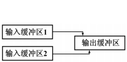
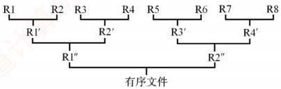
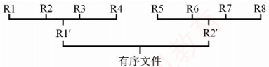
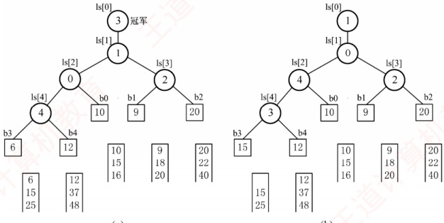
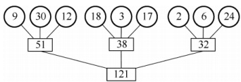
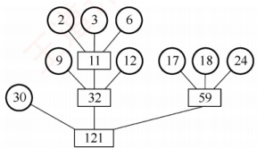
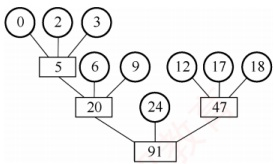

## 8.7 外部排序

外部排序可能会考查相关概念、方法及排序过程。本节的主要内容包括：

① 外部排序是指对大文件进行排序，即待排序记录存储在外存中，且无法一次性全部装入内存，需在内存与外存之间多次交换数据，以完成整个文件的排序。

②为减少多路平衡归并中外存读/写次数可采取的方法：增大归并路数和减少归并段数。

③ 利用败者树可高效实现多路归并，从而增大归并路数。

④ 利用置换-选择排序可生成更长的初始归并段，从而减少归并段个数。

⑤ 由长度不等的归并段进行多路平衡归并时，需要构造最佳归并树。

### 8.7.1 外部排序的基本概念

此前介绍的排序算法均假设所有数据可一次性载入内存（称为内部排序）。而在许多应用中，常需对大规模文件进行排序；由于记录数量庞大，无法将整个文件一次性装入内存。此时，待排序记录必须存储在外存中，排序时仅能将部分数据调入内存处理，并通过多次内外存之间的数据交换，逐步完成整体排序。这类依赖内外存协同操作的排序算法，称为外部排序。
### 8.7.2 外部排序的方法

文件通常以块为单位存储在磁盘上，操作系统也按块对磁盘信息进行读/写操作。由于磁盘读/写的机械动作耗时远高于内存运算时间（相比而言后者可忽略不计），因此外部排序的时间代价主要取决于访问磁盘的次数，即I/O次数。

### 考点追踪 对大文件排序时使用的排序算法（2016）

外部排序通常采用归并排序策略，包含两个阶段：① 生成初始归并段。根据内存缓冲区大小，将外存上的文件划分为若干子文件，依次读入内存，利用内部排序算法对每个子文件排序后写回外存，形成多个有序的初始归并段（也称顺串）；② 多路归并。对这些初始归并段进行逐趟多路归并，每趟将多个有序段合并为更长的有序段，逐步减少段数，最终得到整个有序文件。

例如，一个包含 2000 个记录的文件，每个磁盘块可容纳 125 个记录。首先通过 8 次内部排序，得到 8 个初始归并段 R1～R8，每段包含 250 条记录。随后，对该文件执行如图 8.15 所示的 2 路归并，直至获得一个有序文件。具体实现时，可将内存工作区划分为三个缓冲区（见图 8.14）：两个输入缓冲区和一个输出缓冲区。首先，从归并段 R1 和 R2 中各读入一个磁盘块，分别存入两个输入缓冲区；然后在内存中进行 2 路归并，将归并结果依次写入输出缓冲区；若输出缓冲区已满，则将其内容写入新的归并段 R1'，清空后继续接收后续归并结果；若某个输入缓冲区取空，则从对应的归并段中读入下一块数据，继续参与归并。如此反复，直至 R1 与 R2 的所有记录均被归并完毕。接着归并 R3 与 R4、R5 与 R6、R7 与 R8，完成第一趟归并。第二趟归并 R1' 与 R2'、R3' 与 R4'。第三趟归并 R1" 与 R2"，最终得到完整的有序文件，整个过程共进行 3 趟归并。

图 8.14 2 路归并

图 8.15 2 路归并的排序过程

在外部排序中实现两两归并时，通常无法将两个输入有序段及归并结果同时驻留于内存中，因此必须频繁地将数据从外存读入、再将结果写回磁盘，这会消耗大量时间。一般而言，有

 $$外部排序总时间 = 内部排序时间 + 外存读 / 写时间 + 内部归并时间$$

显然，外存读/写时间远大于内部排序与内部归并所需的时间，因此应着力减少 I/O 次数。由于外存的读/写操作以磁盘块为单位进行，结合前例可知，每趟归并需进行 16 次读和 16 次写，共 32 次 I/O；3 趟归并加上初始内部排序阶段的 32 次 I/O，总计  $32 \times 3 + 32 = 128$ 次 I/O 操作。

若改用4路归并，则仅需2趟归并，总I/O次数降至 $32\times2+32=96$次。由此可见，增大归并路数可有效减少归并趟数，从而显著降低总的磁盘I/O次数，如图8.16所示。

图 8.16 4 路归并的排序过程

一般地，对  $r$ 个初始归并段进行  $k$ 路归并（每趟将  $k$ 个或更少的有序子文件合并为一个）。第一趟可将  $r$ 个归并段合并为  $\lceil r/k \rceil$ 个，后续每趟归并将  $m$ 个归并段合并为  $\lceil m/k \rceil$ 个，直至只剩一个
归并段。树的高度 $-1 = \lceil \log_k r \rceil =$ 归并趟数  $S$。因此，增大归并路数  $k$，或减少初始归并段个数  $r$，均可减少归并趟数  $S$，进而减少磁盘 I/O 次数，有效提升外部排序效率。

### 8.7.3 多路平衡归并与败者树

增大归并路数 k 可减少归并趟数 S，从而降低 I/O 次数。然而，随着 k 的增大，内部归并的时间开销也会显著增加。这是因为在 k 个元素中选出关键字最小者，每次选择需要进行 k-1 次比较；每趟归并 n 个元素，共需  $(n-1)(k-1)$ 次比较。S 趟归并的总比较次数为 $^{①}$

 $$\mathrm{S}(n-1)(k-1)=\left\lceil\log_{k} r\right\rceil(n-1)(k-1)=\left\lceil\log_{2}r\right\rceil(n-1)(k-1)/\left\lceil\log_{2}k\right\rceil$$

式中， $(k-1)/\log_2 k$随  $k$ 增大而增大，因此内部归并时间也随之增长，这将部分抵消因减少 I/O 次数带来的性能收益。因此，不能直接使用普通的多路归并方法。

为使内部归并的时间复杂度不受 k 增大的影响，引入了败者树。败者树是树形选择排序的一种变体，可视为一棵完全二叉树。其 k 个叶结点分别存放 k 个归并段当前参与比较的元素，内部结点用于记录左右子树比较中的“败者”（关键字较大者），而“胜者”（较小者）继续向上参与比较，最终胜者的段号存于 ls[0]，其对应的关键字即为当前最小值。

### 考点追踪 ▶ 败者树的实现原理（2024）

如图8.17(a)所示，考虑5路归并，叶结点为b0, b1, b2, b3, b4: b3与b4比较，b4为败者，将其段号4写入父结点ls[4]；b1与b2比较，b2为败者，将段号2写入ls[3]；胜者b3与b0比较，b0为败者，将段号0写入ls[2]；最后，两个子树的胜者b3与b1比较，b1为败者，将段号1写入ls[1]；而将胜者b3的段号3写入ls[0]，表明当前最小关键字来自第3段。输出b3中的关键字后，从第3段读入下一个关键字，更新b3，并沿路径向上重新调整败者树。

(a)

(b)

图 8.17 实现 5 路归并的败者树

由于 $k$ 路归并的败者树深度为 $\lceil \log_2 k \rceil + 1$，因此从 $k$ 个记录中选出最小关键字，仅需 $\lceil \log_2 k \rceil$ 次比较。此时，总的比较次数约为

 $$\mathrm{S}(n-1)\left\lceil\log_{2}k\right\rceil=\left\lceil\log_{k} r\right\rceil(n-1)\left\lceil\log_{2}k\right\rceil=(n-1)\left\lceil\log_{2}r\right\rceil$$

可见，使用败者树后，内部归并的比较次数与归并路数 k 无关。因此，在内存空间允许的前提下，增大 k 可有效降低归并树高度，减少 I/O 次数，从而提高外部排序的效率。
值得注意的是，归并路数 k 并非越大越好。增大 k 需要增加输入缓冲区的数量。若总内存容量固定，则每个缓冲区的容量将相应减小，导致每趟归并中外存读/写的次数增加。当 k 过大时，尽管归并趟数减少，但总体 I/O 次数反而可能增加，从而抵消性能增益。

### 8.7.4 置换-选择排序（生成初始归并段）

由8.7.2节可知，减少初始归并段个数 $r$同样可减少归并趟数 $S$。若待排序记录总数为 $n$，每个归并段的平均长度为 $\ell$，则归并段个数 $r = \lceil n / \ell \rceil$。采用普通内部排序方法生成的初始归并段长度通常固定（除最后一段外），其长度受限于内存工作区的大小。因此，有必要探索新方法以生成更长的初始归并段，从而减少 $r$，这就是本节要介绍的置换-选择算法。

### 考点追踪 置换-选择排序生成初始归并段的实例（2023）

设初始待排文件为 FI，归并段输出文件为 FO，内存工作区为 WA，其中 WA 可容纳 w 个记录，初始时 FO 与 WA 均为空。置换-选择算法的执行步骤如下：

1）从 FI 读入 w 个记录至工作区 WA。

2）从 WA 中选出当前关键字最小的记录，记为 MINIMAX 记录。

3）将该 MINIMAX 记录写入 FO。

4）若 FI 非空，则从 FI 读入下一个记录至 WA。

5）从 WA 中所有关键字不小于当前 MINIMAX 关键字的记录中，选出关键字最小者，作为新的 MINIMAX 记录。

6）重复步骤3）～5），直至WA中不存在关键字不小于当前MINIMAX的记录为止，此时完成一个初始归并段的输出。

7）重复步骤2）～6），直至FI与WA均为空，从而生成全部初始归并段。

通过该方法，初始归并段长度不再受限于内存大小w，而取决于输入数据的分布。理想情况下（如输入基本有序），可生成长度远超w的归并段，显著减少归并段总数。

设待排文件 FI = {17, 21, 05, 44, 10, 12, 56, 32, 29}，WA 容量为 3，排序过程如表 8.2 所示。

表8.2 置换-选择排序过程示例

| 输出文件 FO | 工作区 WA | 输入文件 FI |
| --- | --- | --- |
| — | — | 17, 21, 05, 44, 10, 12, 56, 32, 29 |
| — | 17 21 05 | 44, 10, 12, 56, 32, 29 |
| 05 | 17 21 44 | 10, 12, 56, 32, 29 |
| 05 17 | 10 21 44 | 12, 56, 32, 29 |
| 05 17 21 | 10 12 44 | 56, 32, 29 |
| 05 17 21 44 | 10 12 56 | 32, 29 |
| 05 17 21 44 56 | 10 12 32 | 29 |
| 05 17 21 44 56 # | 10 12 32 | 29 |
| 10 | 29 12 32 | — |
| 10 12 | 29 32 | — |
| 10 12 29 | 52 | — |
| 10 12 29 32 | — | — |
| 10 12 29 32 # | — | — |

上述算法，在 WA 中选择 MINIMAX 记录的过程需利用败者树来实现。
### 8.7.5 最佳归并树

文件经过置换-选择排序后，得到长度不等的初始归并段。下面讨论如何安排这些长度不等

的归并段的归并顺序，使得I/O次数最少。假设通过置换-选择排序得到9个初始归并段，其长度依次为9,30,12,18,3,17,2,6,24。若采用3路平衡归并，一种可能的归并树如图8.18所示。

在图8.18中，各叶结点表示一个初始归并段，其上的权值表示该段的长度；叶结点到根的路径长度表示该

图 8.18 3 路平衡归并的归并树

段参与归并的趟数；非叶结点表示归并生成的新段；根结点对应最终有序文件。树的带权路径长度 WPL 等于归并过程中读取的总记录数，因此总的 I/O 次数 =  $2 \times WPL = 484$。

### 考点追踪 构造三叉哈夫曼树及相关的分析和计算（2013）

显然，不同的归并方案对应不同的归并树，其 WPL（I/O 次数）也不同。为最小化 I/O 开销，可将哈夫曼编码的思想推广至 k 叉树情形：优先归并长度较小的段，延后归并长度较大的段，从而构造出 I/O 次数最少的最佳归并树。对上述 9 个归并段，按此原则构造的最佳 3 路归并树如图 8.19 所示，按此方案归并，总 I/O 次数仅为 446，显著优于普通方案。

图 8.19 所示的归并树是一棵严格三叉树，即树中只有度为 3 或 0 的结点。然而，当初始归并段的数量不足以构成严格

图 8.19 3 路平衡归并的最佳归并树

k叉树（也称正则 k叉树）时，直接进行 k 路归并会导致某些归并轮次不足 k 路，从而降低效率。例如，若只有 8 个初始归并段（如删除上例中长度为 30 的段），如果强行在最后一次归并时降为 2 路，其余仍为 3 路，则 I/O 次数将高达 386，这并非最优方案。更优的做法是：引入若干长度为 0 的“虚段”（不包含实际数据的空归并段），使每趟归并都能满路（每次归并都处理 3 个段）。这些虚段不会产生实际的 I/O 开销，但能让归并树的结构更接近哈夫曼最优形态——权值较小的段（包括虚段）被安排在更深的位置，避免过早参与归并。按照这一思路构造的最佳归并树如图 8.20 所示，其 I/O 次数显著降低至 326。

图 8.20 8 个归并段的最佳归并树

如何判定添加虚段的数目？

设度为0的结点有 $n_{0}$个，度为k的结点有 $n_{k}$个，归并树的结点总数为n，则有：

 $$\bullet \quad \begin{aligned}n=n_{k}+n_{0}\quad&（总结点数）= 度为 k 的结点数 + 度为 0 的结点数 )\end{aligned}$$

 $$\bullet \quad \begin{aligned}n=kn_{k}+1\quad\quad\quad( 总结点数 = 所有结点的度数之和 +1)\end{aligned}$$

因此，对严格 k 叉树有  $n_{0}=(k-1)n_{k}+1$，由此可得  $n_{k}=(n_{0}-1)/(k-1)$。

接下来，根据  $n_{0}$ 和 k 的关系，判断是否需要添加虚段：

若 $(n_0-1)\%(k-1)=0$（%为取模运算），则说明这 $n_0$个叶结点（初始归并段）正好可以构成一棵严格的 $k$叉归并树。此时，内结点有 $n_k$个。

若 $(n_0-1)\%(k-1)=u\neq0$，则说明对于这 $n_0$个叶结点，其中有u个多余，不能直接纳入k叉归并树。为构造包含所有 $n_0$个初始归并段的k叉归并树，应在原有 $n_k$个内结点的基础上再增加1个内结点。该内结点将代替一个叶结点的位置，被代替的叶结点连同多出的u个叶结点，再加上 $k-u-1$个空归并段，即可构建完整的归并树。
### 考点追踪 ▶ 实现最佳归并时需补充的虚段数量的分析（2019）

以图8.20为例，用8个归并段构造三叉树时， $(n_0-1)\%(k-1)=(8-1)\%(3-1)=1\neq0$，表明当前叶结点数无法构成严格的三叉树。因此，需要添加3-1-1=1个虚段，使叶结点总数增至9，满足 $(9-1)\%(3-1)=0$，这样就可以构建一棵完整的严格三叉树。
