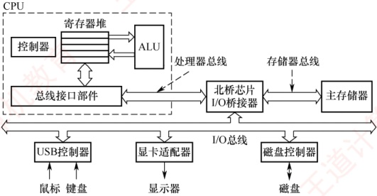
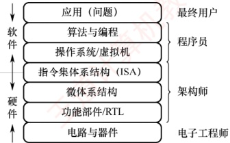
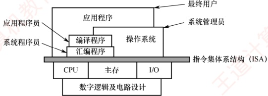
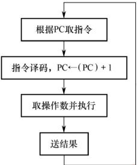
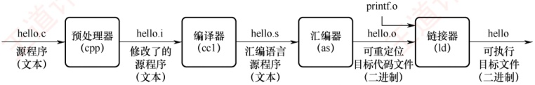

## 1.2 计算机系统层次结构

### 1.2.1 计算机系统的组成

一个完整的计算机系统由硬件与软件组成。硬件指有形的物理装置，即计算机系统中的各类物理部件；软件则是在硬件上运行的程序及其相关的数据与文档。

计算机系统的实际性能，在很大程度上取决于软件对硬件资源的利用效率，而该效率的实现依赖于硬件所提供的能力。因此，计算机系统设计必须合理划分软硬件的功能边界。一般而言，对于使用频繁且硬件实现成本较低的功能，宜由硬件实现，以显著提升整体效率。
### 1.2.2 计算机硬件

#### 1. 冯·诺依曼机的基本思想

### 考点追踪 冯·诺依曼机的特点（2019）

冯·诺依曼在研究EDVAC机时首次提出了“存储程序”的思想，奠定了现代计算机的基本结构。基于这一思想的计算机统称为冯·诺依曼机，其主要特点如下：

1）采用“存储程序”的工作方式：将编制好的程序和初始数据预先存入主存储器，计算机启动后能自动、连续地取指并执行，直至程序结束，无须人工干预。

2）硬件系统由运算器、控制器、存储器、输入设备和输出设备五大部件组成。

3）指令和数据在存储器中以相同形式存放，仅凭内容无法区分，但计算机应能识别它们。

4）指令和数据均采用二进制编码表示。

5）指令由操作码和地址码组成，其中操作码指明操作类型，地址码指出操作数的地址。

#### 2. 计算机的功能部件

现代计算机将运算器、控制器和各类寄存器高度集成，形成一块称为中央处理器（Central Processing Unit，CPU）的芯片。完整的计算机硬件系统主要包含以下部件：中央处理器、存储器、输入/输出控制器、外部设备，以及用于协调这些部件协同工作的总线。

##### （1） 中央处理器

中央处理器（CPU）是计算机系统中负责指令执行的核心部件。其传统基本组成部分为运算器和控制器；在现代处理器架构中，这两部分被系统地组织为数据通路与控制单元。

数据通路是执行实际运算的硬件通路，其核心包括算术逻辑单元（ALU）和通用寄存器组。ALU负责完成所有算术与逻辑运算；通用寄存器组则为ALU提供操作数并暂存运算结果，是实现高速数据访问的关键。此外，数据通路还包含多路选择器、内部互连通路等组件，用于在各个部件间高效传送数据。控制单元负责协调整个CPU的工作。它从存储器中取出指令并译码，随后根据指令语义生成一系列精确的控制信号，指挥数据通路中的各部件（例如，选择源寄存器、配置ALU功能、启动运算并在正确时序下完成结果写回），从而确保指令有序、高效地执行。

##### （2） 存储器

按访问特性，存储器通常分为内存与外存。现代内存由主存和高速缓存（Cache）组成；但由于 Cache 是后期引入的，传统上“内存”仅指主存。在冯·诺依曼结构中，主存作为核心的工作存储器，用于存放待执行的程序和数据。外存则包括两类：一是可与主存交换数据的磁盘、固态硬盘等，二是用于长期备份的海量存储设备（如磁带、光盘等）。

##### （3） 外部设备和设备控制器

外部设备简称外设，也称 I/O 设备（I/O 是 Input/Output 的缩写）。外设通常由物理功能部件（如打印头、鼠标滚轮或按键等）和设备控制器组成，二者在功能或物理实现上往往相互分离：前者负责实际的输入/输出操作，后者则负责与主机通信并控制前者的工作。

外设通过设备控制器连接到主机上，各种设备控制器统称 I/O 控制器或 I/O 接口。例如，键盘接口、显示控制器（简称显卡）、网络控制器（简称网卡）等都是设备控制器。

##### （4） 总线

总线是计算机中用于在各个部件之间传输信息的公共通路。CPU、主存和 I/O 接口通过总线互连；其中，CPU 和 I/O 接口内部均包含寄存器，部分还集成了高速缓存。

图 1.1 展示了一个典型的多总线计算机硬件系统。CPU 作为核心，内含控制器、ALU、寄存
器堆和总线接口部件。CPU 通过处理器总线，并经由 I/O 桥接器与主存和 I/O 设备通信；主存通过存储器总线，并经由 I/O 桥接器与 CPU 和 I/O 设备相连；各类 I/O 设备则通过其控制器（如 USB 控制器、显示适配器）接入 I/O 总线。按功能划分，ALU 属于数据处理部件，负责对寄存器中的数据进行运算；主存和磁盘属于存储部件，分别承担临时存储与长期存储任务；而所有总线、桥接器、接口及控制器共同构成系统的互连结构，负责全系统的数据传输与协调。

图 1.1 一个典型的多总线计算机硬件系统

### 1.2.3 计算机软件

#### 1. 系统软件和应用软件

软件按其功能可分为系统软件和应用软件。

系统软件是一组保障计算机系统高效、正确运行的基础软件，用于管理和调度系统资源，为用户及应用程序提供基础服务。典型的系统软件包括：操作系统（OS）、数据库管理系统（DBMS）、语言处理程序、网络与分布式软件系统、标准库程序、服务性程序等。

应用软件是指用户为解决特定应用领域问题而开发的程序，例如科学计算、工程设计、数据统计与信息处理等领域的专用软件。

#### 2. 软件和硬件的逻辑功能等价性

在计算机中，最基本的操作（如算术与逻辑运算）通常由硬件直接实现，而更复杂的功能则可由软件完成。对于某一特定功能，既可采用硬件实现，又可通过软件实现；从用户视角看，在相同规范下，二者在逻辑功能上是等价的。这一性质称为软/硬件逻辑功能的等价性。例如，浮点运算既可由专用浮点运算器硬件实现，又可通过软件子程序模拟；在相同输入和数值规范（如IEEE 754）下，二者产生一致的数值结果，但硬件实现的效率通常远高于软件。

软/硬件逻辑功能的等价性是计算机系统设计的重要依据。如何合理划分软/硬件的功能边界，是计算机体系结构研究的核心问题之一。在系统设计过程中，必须综合考虑设计目标、成本效益与技术可行性等因素，明确哪些功能由硬件承担，哪些功能由软件实现。

### 1.2.4 计算机系统的层次结构

如图 1.2 所示，计算机系统采用多级层次结构，通过逐层抽象隔离复杂的硬件实现与高层应用需求。从用户的应用问题到物理器件，每层都向上提供简洁的接口，向下依赖更底层的功能实现。这种分层设计不仅明确了软/硬件的职责边界，还使系统开发和维护得以并行高效进行。

图 1.2 计算机系统的层次结构示意图

#### 1. 算法和编程

解决应用问题需要先将其抽象为一个正确的算法描述。随后，程序员将该算法用编程语言编写成程序。与自然语言不同，编程语言语法严谨、无二义性，能够精确描述计算机的执行顺序。

##### （1） 编程语言

编程语言可分为高级语言与低级语言。高级语言独立于计算机底层硬件结构，是主流软件开发语言；低级语言则紧密依赖机器结构，特指机器语言及其符号化形式——汇编语言。

### 考点追踪三种编程语言的特点（2015、2024）

1）机器语言。又称二进制代码语言，由0和1组成的指令序列构成。程序员需要熟记每条指令的二进制编码。它是计算机唯一能直接识别和执行的语言。

2）汇编语言。采用英文助记符（如 mov、add）或其缩写代替二进制指令，显著提升了可读性与记忆性。但汇编程序不能被硬件直接执行，必须通过一个称为汇编程序的系统软件的翻译，将其转换为机器语言程序后，才能在计算机上运行。

3）高级语言。如 C、C++、Java 等，允许程序员以接近自然语言的方式描述问题求解过程，极大提高了开发效率。高级语言程序通常需经编译程序处理：或先编译为汇编语言，再经汇编生成机器语言：或直接编译为目标机器的机器语言程序。

#### （2） 翻译程序

### 考点追踪 各种翻译程序的概念（2016）

高级语言源程序必须转换为机器语言程序才能被计算机直接执行，用于完成该转换的系统软件称为翻译程序，转换后生成的程序称为目标程序。翻译程序主要分为以下三类：

1）汇编程序（汇编器）：将汇编语言源程序翻译为机器语言目标程序。

2）解释程序（解释器）：逐条翻译并立即执行高级语言源程序语句，不生成独立的目标程序。

#### 2. 操作系统

3）编译程序（编译器）：将高级语言源程序一次性翻译为汇编语言或机器语言目标程序。

所有的语言处理系统都必须在操作系统提供的运行环境中执行；操作系统通过对计算机硬件及其底层结构的抽象，构建出一台可供程序员使用的虚拟机。

#### 3. 指令集体系结构

指令集体系结构（Instruction Set Architecture，ISA）是计算机软/硬件之间的关键接口，它从程序员和编译器的视角，完整地定义了软件可直接使用的硬件功能。主要包括：指令格式、操作类型、寻址方式，以及可访问的寄存器等硬件资源。

因此，ISA 构成了软件所能“感知”到的计算机功能视图，也被称为软件可见部分。我们编写的机器语言程序，本质上就是一串严格遵循该 ISA 规范的指令序列；而硬件执行程序的过程，就是逐条解释并完成这些指令所规定操作的过程。
#### 4. 微体系结构

微体系结构（又称微架构）是处理器内部的硬件组织方式，用于实现 ISA 定义的功能。如果说 ISA 定义了“做什么”，那么微架构则决定了“怎么做”。其核心设计包括数据通路组织、控制单元实现、流水线级数、缓存层次结构以及分支预测机制等。

例如，加法操作可能通过串行进位加法器、超前进位加法器，甚至专用的 SIMD 单元来实现，这些都属于微体系结构的范畴。相同的 ISA 可对应多种不同的微构架。以 Intel x86 为例，不同代际的处理器（如 Core、Skylake、Alder Lake）均遵循同一套 ISA 规范，但内部组织方式差异显著，体现了微架构的多样性与演进性。

### 1.2.5 计算机系统的不同用户

根据用户使用计算机完成任务的性质，可将用户划分为以下四类角色。

最终用户：直接操作应用程序完成特定任务的人员，如使用办公软件、浏览网页等的人员。他们通过操作系统提供的界面与计算机交互，无须了解底层技术细节。

系统管理员：负责配置、管理和维护计算机系统，确保其稳定高效运行的人员。主要职责包括安装软/硬件、管理用户账户、数据备份与系统升级等。

应用程序员：使用高级语言开发应用软件，以满足最终用户在办公、娱乐等领域的特定需求的人员。

系统程序员：设计并开发操作系统、编译器、数据库管理系统等核心系统软件的人员。

在实际使用中，同一用户可能在不同场景下承担多种角色。例如，一名计算机专业的学生：网上购物时是最终用户，管理磁盘、备份数据时是系统管理员，编写应用程序作业时是应用程序员，而参与操作系统开发时则是系统程序员。计算机系统采用层次化结构构建，不同用户正是依据其角色，工作在系统相应的抽象层级上的。

如图 1.3 所示，指令集体系结构（ISA）位于计算机软/硬件的交界处，是硬件功能的集中体现，也是软件执行的基础。ISA 以下为硬件层，包括 CPU、主存和 I/O 设备等物理组件；ISA 以上为软件层，涵盖系统软件与应用软件。不同用户工作在以 ISA 为基础逐层构建的抽象层次上。

图 1.3 计算机系统的层次与各层用户

系统程序员工作在机器语言层面，直接面向 ISA；系统管理员工作在操作系统层面；应用程序员（高级语言程序员）工作在高级语言层面；最终用户则通过应用程序完成任务，处于最上层。在计算机系统中，下层机器的结构特性对上层用户通常是“透明”的。例如，ISA 之下的硬件实现细节对高级语言程序员是透明的，他们无须了解底层机制即可进行开发。
### 1.2.6 计算机系统的工作原理

#### 1. “存储程序”工作方式

“存储程序”工作方式规定：在程序执行前，需将其包含的指令和数据预先加载到主存储器中；一旦启动，计算机便无须人工干预，自动逐条取出并执行指令。如图1.4所示，程序的执行是一个周而复始的指令执行过程。每条指令的执行通常包括以下步骤：从主存储器中取指令（地址由程序计数器PC提供）、对指令译码、取操作数、执行操作，并将结果写回存储器。

图 1.4 程序执行过程

程序开始执行前，先将第一条指令的地址存入程序计数器（PC）。取指令时，CPU 使用 PC 的内容作为地址访问主存储器。在每条指令执行的最后阶段，系统根据指令类型更新 PC：

若为顺序指令，则下一条指令地址为当前 PC 值加上指令长度；

若为跳转指令，则下一条指令地址为指令中指定的目标地址。

随后，CPU 根据更新后的 PC 从主存储器中取出下一条待执行的指令，从而实现指令流的自动连续执行。

#### 2. 从源程序到可执行文件

### 考点追踪 翻译过程的四个阶段（2022）

在计算机中编写的 C 语言程序，必须经过编译与链接过程，转换为一系列低级机器指令，并按特定格式封装为可执行目标文件，最终以二进制形式存储于磁盘。以 UNIX 系统中的 GCC 编译器为例，给定源程序文件 hello.c，系统通过四个阶段生成可执行文件 hello，如图 1.5 所示。

图 1.5 源程序转换为可执行文件的过程

1）预处理阶段：预处理器（cpp）处理源文件中以#开头的预处理指令，如将#include<stdio.h>替换为对应头文件的完整内容，生成预处理后的C文件hello.i。

2）编译阶段：编译器（cc1）将 hello.i 翻译为汇编程序 hello.s，其中每条语句以文本形式描述一条低级机器指令。

3）汇编阶段：汇编器（as）将 hello.s 转换为机器语言指令，生成可重定位目标文件 hello.o。
该文件为二进制格式，包含代码、数据及符号信息。

4）链接阶段：链接器（ld）将 hello.o 与标准 C 库中所需的函数（例如 printf）进行链接，解析外部符号引用，最终生成完整的可执行文件 hello，并保存至磁盘。

#### 3. 指令执行过程的简要描述

可执行文件中的代码段由一条条机器指令构成。每条指令是一串二进制编码，用于指示CPU完成一个特定的基本操作。指令的执行可被建模为经典的“取指—译码—执行”三阶段循环。掌握这一抽象模型，对于理解软件如何驱动硬件至关重要。读者可能会自然地追问：“这个循环在硬件上究竟是如何一步步实现的？”这正是“计算机组成原理”课程要回答的核心问题之一。为保障初学阶段概念的清晰性，避免过早陷入复杂的硬件细节，控制器的工作原理、数据通路的结构、时序信号的控制等具体实现技术，已系统性地安排在第5章“中央处理器”中。届时，我们将基于前述抽象模型，深入硬件内部，揭示其底层工作原理。
