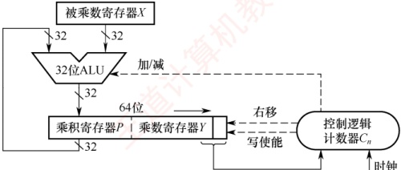
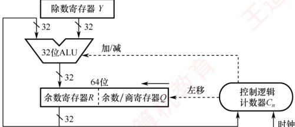

### 2.2.5 本节习题精选

#### 一、 单项选择题

##### 01

算术逻辑单元（ALU）的核心部件是（）。

A. 多路选择器 B. 移位器 C. 加法器 D. 寄存器

##### 02

算术逻辑单元（ALU）的功能通常包括（）。

A. 算术运算

B. 逻辑运算

C. 算术运算和逻辑运算

D. 加法运算

##### 03

补码定点整数 0101 0101 算术左移两位后的值为（）。

A. 0100 0111 B. 0101 0100 C. 0100 0110 D. 0101 0101

##### 04

下列四个补码整数存放于8位寄存器中，算术左移不会发生溢出的是（）。

A. 80H B. 90H C. B0H D. C0H

##### 05

补码定点整数 1001 0101 右移一位后的值为（）。

A. 0100 1010 B. 01001010 1 C. 1000 1010 D. 1100 1010

##### 06

两个机器数 7E5H 和 4D3H 相加，得（）。

A. BD8H B. CD8H C. CB8H D. CC8H

##### 07

设机器数字长为8位（含1位符号位），若机器数 BAH 为补码，算术左移1位和算术右移1位分别得（）。

A. F4H, EDH B. B4H, 6DH C. 74H, DDH D. B5H, EDH

##### 08

在定点运算器中，无论是采用双符号位还是采用单符号位，必须有（）。

A. 译码电路，它一般用“与非”门来实现

B. 编码电路，它一般用“或非”门来实现

C. 溢出判断电路，它一般用“异或”门来实现

D. 移位电路，它一般用“与或非”门来实现

##### 09

机器运算发生溢出的根本原因是（）。

A. 寄存器的位数有限

B. 运算中将符号位的进位丢弃

C. 运算中将符号位的借位丢弃

D. 数据运算中发生错误

##### 10

假定有两个整数用 8 位补码分别表示为  $r_1 = \text{F5H}$,  $r_2 = \text{EEH}$。若将运算结果存放在一个 8 位寄存器中，则下列运算会发生溢出的是（）。

A.  $r_1 + r_2$          B.  $r_1 - r_2$          C.  $r_1 \times r_2$          D.  $r_1 / r_2$

##### 11

关于模4补码，下列说法正确的是（）。

A. 模4补码和模2补码不同，它不容易检查乘除运算中的溢出问题

B. 每个模4补码存储时只需要一个符号位

C. 存储每个模4补码需要两个符号位

D. 模4补码，在算术与逻辑单元中为一个符号位

##### 12

若采用双符号位，则两个正数相加产生溢出的特征时，双符号位为（）。

A. 00          B. 01          C. 10          D. 11

##### 13

判断加减法溢出时，可采用判断进位的方式，若符号位的进位为  $C_{0}$，最高位的进位为  $C_{1}$，则产生溢出的条件是（）。

I.  $C_{0}$ 产生进位

II.  $C_{1}$ 产生进位

III.  $C_{0}$、 $C_{1}$ 都产生进位

IV.  $C_{0}$、 $C_{1}$ 都不产生进位
V.  $C_{0}$ 产生进位， $C_{1}$ 不产生进位 VI.  $C_{0}$ 不产生进位， $C_{1}$ 产生进位

A. I 和 II B. III C. IV D. V 和 VI

##### 14

在补码的加减法中，用两位符号位判断溢出，两位符号位  $S_{s1}S_{s2}=10$ 时，表示（）。

A. 结果为正数，无溢出

B. 结果正溢出

C. 结果负溢出

D. 结果为负数，无溢出

##### 15

若 [X]_{\text{补}} = X_0, X_1 X_2 \cdots X_n，其中 $X_0$为符号位， $X_1$为最高数位。若（），则当补码算术左移时，将会发生溢出。

A.  $X_0 = X_1$  B.  $X_0 \neq X_1$  C.  $X_1 = 0$  D.  $X_1 = 1$

##### 16

假设一次 ALU 运算和一次移位操作各需 1 个时钟周期，则 32 位无符号整数乘法电路完成一次乘法运算所需的时钟周期数约为（）。

A. 16 B. 64 C. 96 D. 100

##### 17

下列关于移位运算的说法中，正确的是（）。

Ⅰ. 补码算术左移时，高位移出，低位补0，若左移前后的符号位不同，则发生溢出

Ⅱ. 无符号数逻辑左移时，若最高位移出的是1，则发生溢出

Ⅲ. 逻辑左移和补码算术左移的结果都一样，都是移出最高位，并在低位补0

A. I、III

B. 仅II

C. 只有III

D. I、II、III

##### 18

某计算机字长为8位，CPU中有一个8位加法器。已知无符号数x=69，y=38，若在该加法器中计算x-y，则加法器的两个输入端信息和输入的低位进位信息分别为（）。

A. 0100 0101、0010 0110、0

B. 0100 0101、1101 1001、1

C. 0100 0101、1101 1010、0

D. 0100 0101、1101 1010、1

##### 19

某计算机中有一个8位加法器，有符号整数x和y的机器数用补码表示，[x]补=F5H，[y]补=7EH，若在该加法器中计算x-y，则加法器的低位进位输入信息和运算后的溢出标志OF分别是（）。

A. 1、1          B. 1、0          C. 0、1          D. 0、0

##### 20

某8位计算机中，x和y是两个有符号整数，用补码表示，[x]补=44H，[y]补=DCH，则  $x/2+2y$ 的机器数及相应的溢出标志 OF 分别是（）。

A. CAH、0 B. CAH、1 C. DAH、0 D. DAH、1

##### 21

某8位计算机中，x和y是两个有符号整数，用补码表示，[x]补=44H，[y]补=DCH，则x-2y的机器数及相应的溢出标志OF分别是（）。

A. 8CH、1 B. 8CH、0 C. 68H、1 D. 68H、0

##### 22

某 C 语言代码段如下：

```c
int si=65536;

short i=si;

unsigned j=0;

if(i<=j-1) printf("王道");

else printf("计算机教育");
```

当上述代码段执行到 if 分支条件的判断时，会根据标志寄存器中的（）决定执行顺序。最终的输出结果是（）。

A. CF, 王道 B. CF, 计算机教育 C. OF, 王道 D. OF, 计算机教育

##### 23

下图是实现32位补码一位乘法的逻辑结构图，下列说法中正确的是（）。



A. 32位无符号整数的乘法电路和该图没有区别

B. 在执行过程中，ALU 要么做加法，要么做减法，不可能执行空操作

C. 图中的乘积寄存器 P 和乘数寄存器 Y 所执行的右移是算术右移

D. 计算完成后，若乘积寄存器 P 中的值不全为 0，则发生溢出

##### 24

某计算机采用下图所示的补码除法器执行32位补码整数除法运算，当除数寄存器Y与余数/商寄存器Q的初始值为（ ）时，除法执行时间最短（Y、Q均为补码表示）。



A.  $Y = \text{FFFF FFFF}, Q = 8000\,0000$ B.  $Y = 8000\,0000, Q = \text{FFFF FFFF}$ C.  $Y = \text{FFFF FFFF}, Q = \text{FFFF FFFF}$ D.  $Y = 8000\,0000, Q = 8000\,0000$

##### 25

【2009 统考真题】一个 C 语言程序在一台 32 位机器上运行。程序中定义了三个变量 x, y, z，其中 x 和 z 为 int 型，y 为 short 型。当 x = 127, y = -9 时，执行赋值语句 z = x + y 后，x, y, z 的值分别是（）。

A. x = 0000007FH, y = FFF9H, z = 00000076H

B. x = 0000007FH, y = FFF9H, z = FFFF0076H

C. x = 0000007FH, y = FFF7H, z = FFFF0076H

D. x = 0000007FH, y = FFF7H, z = 00000076H

##### 26

【2010 统考真题】假定有四个整数用 8 位补码分别表示： $r_1 = \text{FEH}$,  $r_2 = \text{F2H}$,  $r_3 = 90\text{H}$,  $r_4 = \text{F8H}$，若将运算结果存放在一个 8 位寄存器中，则下列运算会发生溢出的是（）。

A.  $r_1 \times r_2$ B.  $r_2 \times r_3$ C.  $r_1 \times r_4$ D.  $r_2 \times r_4$

##### 27

【2013 统考真题】某字长为 8 位的计算机中，已知整型变量 x、y 的机器数分别为  [x]_{补} = 1\ 1110100， [y]_{补} = 1\ 0110000。若整型变量  $z = 2x + y/2$，则 z 的机器数为（）。

A. 1 1000000 B. 0 0100100 C. 1 0101010 D. 溢出

##### 28

【2014 统考真题】若 x=103, y=-25, 则下列表达式采用 8 位定点补码运算实现时, 会发生溢出的是 ( )。

A.  $x + y$ B.  $-x + y$ C. x - y D.  $-x - y$

##### 29

【2018 统考真题】假定有符号整数采用补码表示，若 int 型变量 x 和 y 的机器数分别是 FFFF FFDFH 和 0000 0041H，则 x、y 的值及 x-y 的机器数分别是（）。

A. x = -65, y = 41, x-y 的机器数溢出
B. x = -33, y = 65, x - y 的机器数为 FFFF FF9DH

C. x = -33, y = 65, x - y 的机器数为 FFFF FF9EH

D. x = -65, y = 41, x - y 的机器数为 FFFF FF96H

##### 30

【2018 统考真题】整数 x 的机器数为 1101 1000，分别对 x 进行逻辑右移 1 位和算术右移 1 位操作，得到的机器数各是（）。

A. 1110 1100、1110 1100

B. 0110 1100、1110 1100

C. 1110 1100、0110 1100

D. 0110 1100、0110 1100

##### 31

【2018 统考真题】减法指令 “sub R1, R2, R3” 的功能为 “(R1)-(R2)→R3”，该指令执行后将生成进位/借位标志 CF 和溢出标志 OF。若(R1) = FFFF FFFFH, (R2) = FFFF FFF0H，则该减法指令执行后，CF 与 OF 分别为（）。

A. CF = 0, OF = 0    B. CF = 1, OF = 0    C. CF = 0, OF = 1    D. CF = 1, OF = 1

##### 32

【2023 统考真题】已知 x, y 为 int 型，当 x = 100, y = 200 时，执行 “x 减 y” 指令得到的溢出标志 OF 和借位标志 CF 分别为 0, 1，那么当 x = 10, y = -20 时，执行该指令得到的 OF 和 CF 分别为（）。

A. OF = 0, CF = 0    B. OF = 0, CF = 1    C. OF = 1, CF = 0    D. OF = 1, CF = 1

##### 33

【2024 统考真题】C 语言代码段如下，执行该代码段后，j 的值是（）。

```c
int i=32777;

short si=i;

int j=si;
```

A. -32777 B. -32759 C. 32759 D. 32777

##### 34

【2024 统考真题】下列关于整数乘法运算的叙述中，错误的是（）。

A. 用阵列乘法器实现的乘运算可以在一个时钟周期内完成

B. 用 ALU 和移位器实现的乘运算无法在一个时钟周期内完成

C. 变量与常数的乘运算可编译优化为若干移位及加减运算指令

D. 两个变量的乘运算无法编译转换为移位及加法等指令的循环实现

##### 35

【2025 统考真题】假设在 8 位字长的计算机中，两个带符号整数 x 和 y 的补码表示分别为  [x]_{补} = A3H、 [y]_{补} = 75H，则通过补码加减运算器得到的 x - y 的值及 OF 标志分别为（）。

A. 24, 0

B. 24, 1

C. 46, 0

D. 46, 1

#### 二、 综合应用题

##### 01

已知 32 位寄存器 R1 中存放的变量 x 的机器码为 8000 0004H，unsigned int 型的乘除法采用逻辑移位操作，int 型的乘除法采用算术移位操作，请问：

1）当 x 是 unsigned int 型时，x 的真值是多少？x/2 存放在 R1 中的机器码是什么？x/2 的真值是多少？2x 存放在 R1 中的机器码是什么？2x 的真值是多少？

2）当 x 是 int 型时，x 的真值是多少？x/2 存放在 R1 中的机器码是什么？x/2 的真值是多少？2x 存放在 R1 中的机器码是什么？2x 的真值是多少？

##### 02

假设有两个整数 x = -68, y = -80，采用补码形式（含 1 位符号位）表示，x 和 y 分别存放在寄存器 A 和 B 中。另外，还有两个寄存器 C 和 D。A、B、C、D 都是 8 位的寄存器。请回答下列问题（要求最终用十六进制数表示二进制数序列）：

1）寄存器A和B中的内容分别是什么？

2）x 和 y 相加后的结果存放在寄存器 C 中，则寄存器 C 中的内容是什么？此时，溢出标志 OF、符号标志 SF 各是什么？
3）x 和 y 相减后的结果存放在寄存器 D 中，寄存器 D 中的内容是什么？此时，溢出标志 OF、符号标志 SF 各是什么？

##### 03

【2011 统考真题】假定在一个8位字长的计算机中运行如下 C 程序段：

```c
unsigned int x=134;
unsigned int y=246;
int m=x;
int n=y;
unsigned int z1=x-y;
unsigned int z2=x+y;
int k1=m-n;
int k2=m+n;
```

若编译器编译时将8个8位寄存器R1～R8分别分配给变量x, y, m, n, z1, z2, k1和k2。请回答下列问题（提示：有符号整数用补码表示）。

1）执行上述程序段后，寄存器R1、R5和R6的内容分别是什么（用十六进制数表示）？

2）执行上述程序段后，变量m和kl的值分别是多少（用十进制数表示）？

3）上述程序段涉及有符号整数加减、无符号整数加减运算，这四种运算能否利用同一个加法器辅助电路实现？简述理由。

4）计算机内部如何判断有符号整数加减运算的结果是否发生溢出？上述程序段中，哪些有符号整数运算语句的执行结果会发生溢出？

##### 04

【2020 统考真题】有实现  $x \times y$ 的两个 C 语言函数如下:

```c
unsigned umul (unsigned x, unsigned y) { return x*y;}
int imul (int x, int y) {
    return x*y;}
```

假定某计算机M中的ALU只能进行加减运算和逻辑运算。请回答下列问题。

1）若 M 的指令系统中没有乘法指令，但有加法、减法和位移等指令，则在 M 上也能实现上述两个函数中的乘法运算，为什么？

2）若 M 的指令系统中有乘法指令，则基于 ALU、位移器、寄存器及相应控制逻辑实现乘法指令时，控制逻辑的作用是什么？

3）针对以下三种情况：a）没有乘法指令；b）有使用 ALU 和位移器实现的乘法指令；c）有使用阵列乘法器实现的乘法指令，函数 umul()在哪种情况下执行的时间最长？在哪种情况下执行的时间最短？说明理由。

4）n位整数乘法指令可保存2n位乘积，当只取低n位作为乘积时，其结果可能发生溢出。当n=32, x=2^{31}-1, y=2 时，有符号整数乘法指令和无符号整数乘法指令得到的x×y 的2n位乘积分别是什么（用十六进制数表示）？此时函数umul()和imul() 的返回结果是否溢出？对于无符号整数乘法运算，当仅取乘积的低n位作为乘法结果时，如何用2n位乘积进行溢出判断？

### 2.2.6 答案与解析

#### 一、 单项选择题

##### 01

C

ALU 的核心功能是算术与逻辑运算，其中加法是最基础的操作：减法可用补码加法实现，乘除可由加法和移位组合而成。因此，加法器是 ALU 最核心的部件。

##### 02

C

ALU 既能进行算术运算又能进行逻辑运算。

##### 03

B
该数是一个正数（最高位为0），按照补码算术移位规则，算术左移两位后，移出了最高位01，低位补0，因此算术左移两位后的结果是01010100。虽然移位后该数的符号位仍为0，但是移出了有效位1，所以本次算术移位发生了溢出。

##### 04

D

80H=(1000 0000) << 1 = 00000000, 左移前的符号位为 1, 左移后的符号位为 0, 溢出。90H=(1001 0000) << 1 = 0010 0000, 左移前的符号位为 1, 左移后的符号位为 0, 溢出。B0H=(1011 0000) << 1 = 0110 0000, 左移前的符号位为 1, 左移后的符号位为 0, 溢出。C0H=(1100 0000) << 1 = 10000000, 左移前的符号位为 1, 左移后的符号位为 1, 未溢出, 选项 D 正确。

##### 05

D

该数是一个负数（最高位为1），按照算术补码移位规则，负数右移添1，负数左移添0，所以1001 0101 右移一位后的值为1100 1010。

##### 06

C

在十六进制数的加减法中，逢十六进一，因此有  $7E5\ H + 4D3\ H = CB8\ H$。

##### 07

C

算术左移时，低位补 0；算术右移时，高位补符号位。BAH = (1011 1010) $_{2}$，算术左移 1 位得  $(0111\ 0100)$ $_{2}$ = 74H，左移前后的符号位不同，溢出；算术右移 1 位得  $(1101\ 1101)$ $_{2}$ = DDH。

##### 08

C

三种溢出判别方法，均须有溢出判别电路，可用“异或”门来实现。

##### 09

A

机器运算发生溢出的根本原因是计算机的字长有限，所以不能表示超过一定范围的数据。

##### 10

C

首先将  $r_1$ 和  $r_2$ 转换为真值，F5H = 1111 0101，转换为原码是 1000 1011，真值为-11；EEH = 1110 1110，转换为原码是 1001 0010，真值为-18，8 位补码的表示范围为  $[-128, 127]$， $r_1 \times r_2$ 的结果为 198，超出了 8 位补码的表示范围，发生溢出。

##### 11

B

模4补码具有模2补码的全部优点且更易检查加减运算中的溢出问题，选项A错误。需要注意的是，存储模4补码仅需一个符号位，因为任何一个正确的数值，模4补码的两个符号位总是相同的，选项B正确。只在把两个模4补码的数送往ALU完成加减运算时，才把每个数的符号位的值同时送到ALU的双符号位中，即只在ALU中采用双符号位，选项C、D错误。

##### 12

B

采用双符号位时，第一符号位表示最终结果的符号，第二符号位表示运算结果是否溢出。若第二位和第一位符号相同，则未溢出；若不同，则溢出。若发生正溢出，则双符号位为01，若发生负溢出，则双符号位为10。

##### 13

D

采用进位位来判断溢出时，当最高有效位进位和符号位进位的值不相同时才产生溢出。两正数相加，当最高有效位产生进位（ $C_1=1$）而符号位不产生进位（ $C_0=0$）时，发生正溢出；两负数相加，当最高有效位不产生进位（ $C_1=0$）而符号位产生进位（ $C_0=1$）时产生负溢出。因此溢出条件为 $\overline{C_0}C_1+C_0\overline{C_1}=C_0\oplus C_1$。

##### 14

C

用两位符号位判断溢出时，两个符号位不同时表示溢出，即01时表示正溢出；10时表示负溢出；两个符号位相同时（11或00）表示未溢出。
##### 15

B

补码左移时，若移出的高位不同于移位后的符号位，即左移前后的符号位不同，则发生溢出。补码左移时， $X_{0}$ 移出， $X_{1}$ 取代  $X_{0}$ 成为新的符号位，因此若  $X_{0} \neq X_{1}$，则表示发生了溢出。

##### 16

B

32 位无符号乘法通常采用“移位-相加”算法，共进行 32 轮迭代，每轮至少包含 1 次加法（或空操作）和 1 次移位。每轮消耗 2 个时钟周期（加法 + 移位），共需约  $32 \times 2 = 64$ 个时钟周期。

##### 17

D

对于左移操作，逻辑左移和算术左移的结果都一样，高位移出，低位补 0。逻辑移位不考虑符号位的问题，逻辑左移时，若最高位移出的是 1，表示发生溢出。算术左移时，若移出的高位不同于移位后的符号位，即左移前后的符号位不同，表示发生溢出。因此说法 I、II、III 均正确。

##### 18

B

不管是补码减法，还是无符号数减法，都是用被减数加上减数的负数的补码来实现的。根据求补公式，减数  $y$ 的负数的补码  [-y]_{\text{补}} = \overline{Y} + 1，因此，在加法器的  $Y'$ 输入端用一个反向器实现，并用控制端 Sub 控制多路选择器是否将  $y$ 的各位取反后，输入  $Y'$ 端，同时将 Sub 作为低位进位送到加法器。当 Sub 为 1 时，做减法，Sub = 1 控制将  $\overline{Y}$ 输入加法器  $Y'$ 端，即实现“各位取反”功能；同时将 Sub = 1 作为低位进位送到加法器，实现“末位加 1”功能。69 的二进制数为 0100 0101；38 的二进制数为 0010 0110，各位取反得 1101 1001。做减法时，低位进位为 Sub，即为 1。

**注意**

若仅记忆补码加减运算的过程，而未掌握加法电路的原理，则本题易误选D。

##### 19

A
```c

对补码减法运算，控制端 Sub 为 1，所以低位进位输入位 = Sub = 1。 [x]_{\text{补}} = 11110101， [y]_{\text{补}} = 01111110， [-y]_{\text{补}} = 10000001 + 1， [x]_{\text{补}} - [y]_{\text{补}} = [x]_{\text{补}} + [-y]_{\text{补}} = 11110101 + 10000010 = 01110111，进位丢掉，参与运算的两个数的符号位均为 1，结果的符号位为 0，所以溢出标志 OF 为 1。
```

##### 20

C

 [x/2 + 2y]_{\text{补}} = [x]_{\text{补}} \gg 1 + [y]_{\text{补}} \ll 1 = 0100\,0100 \gg 1 + 1101\,1100 \ll 1 = 0010\,0010 + 1011\,1000 = 1101\,1010 = \text{DAH}。 $x$右移移出了0，没有溢出或损失精度； $y$为负数，左移后，符号位仍为1，没有溢出；且从最后一步加法操作来看，一个正数和一个负数相加，必然不会溢出。

##### 21

A

[x]补=44H=0100 0100，[y]补=DCH=1101 1100。执行x-2y时，先将y算术左移一位，得到1011 1000，未溢出，然后各位取反，再与x相加，做减法时Sub=1，即0100 0100+0100 0111+1=1000 1100(8CH)，两个加数的符号都为0，而结果的符号为1，因此发生了溢出，即OF=1。

##### 22

A

无符号数和有符号数一起参与运算时，计算机按无符号数来解释最终的执行结果，因此 j-1 的结果是 32 个全 1，会被解释成最大的无符号数。65536 = 2^{16}，当把 si 强制转换为 short 型时，直接保留机器数的末 16 位，即 16 个全 0，因此，当 i 和 j-1 进行比较时，根据无符号数的解释，OF 标志是没有意义的，即根据 CF 位可知 i 小于 j-1，因此最终输出“王道”。

##### 23

C

无符号乘法无须辅助位，电路结构更简单。当控制逻辑的输入是“00”或“11”时，ALU 执行空操作，仅移位。因结果为有符号数，P 和 Y 的右移必须为算术右移，以保持符号位不变，选项 C 正确。溢出判断依据是 P 的所有位是否都等于 Y 的符号位，而非 P 是否全为 0。
##### 24

B

该补码除法器在正式迭代之前会先判断：若被除数的绝对值小于除数的绝对值，则直接置商为0、余数为被除数，跳过全部移位和加减操作，从而最快完成。在选项B中， $Y = -2^{31}$，绝对值为 $2^{31}$； $Q = -1$，绝对值为1。由于 $|Q| < |Y|$，满足快速退出条件，故执行时间最短。

##### 25

D

C 语言中的整型数据为补码形式，int 型为 32 位，short 型为 16 位，因此 x、y 的机器数写为 0000 007FH、FFF7H。执行  $z = x + y$ 时，x 为 int 型，y 为 short 型，因此需将 y 的类型强制转换为 int 型，在机器中通过符号位扩展实现，y 的符号位为 1，因此在 y 的前面添加 16 个 1，即可将 y 强制转换为 int 型，其十六进制形式为 FFFF FFF7H。然后执行加法，即 0000 007FH + FFFF FFF7H = 0000 0076H，其中最高位的进位 1 自然丢弃。

##### 26

B

本题的真正意图是考查补码的表示范围，采用补码乘法规则计算出四个选项是费力不讨好的做法，且极易出错。8位补码所能表示的整数范围为 $-128\sim+127$。将四个数全部转换为十进制数： $r_{1}=-2$， $r_{2}=-14$， $r_{3}=-112$， $r_{4}=-8$，得 $r_{2}\times r_{3}=1568$，远超出了表示范围，发生溢出。

##### 27

A

x*2，将x算术左移一位为1 1101000；y/2，将y算术右移一位为1 1011000，均无溢出或丢失精度。补码相加为1 1101000+1 1011000=1 1000000，亦无溢出。

##### 28

C

8 位定点补码表示的数据范围为 -128～127，若运算结果超出这个范围，则会溢出。对选项 A， $x + y = 103 - 25 = 78$，符合范围。对选项 B， $-x + y = -103 - 25 = -128$，符合范围。对选项 D， $-x - y = -103 + 25 = -78$，符合范围。对选项 C， $x - y = 103 + 25 = 128$，超过 127。

##### 29

C

利用补码转换为原码的规则：负数的符号位不变数值位取反加 1；正数补码等于原码。两个机器数对应的原码是 [x]_{\text{原}} = 80000021\text{H}，对应的数值是 $-33$， [y]_{\text{原}} = [y]_{\text{补}} = 00000041\text{H} = 65。排除选项 A、D。 $x-y$ 直接利用补码减法准则， [x]_{\text{补}} - [y]_{\text{补}} = [x]_{\text{补}} + [-y]_{\text{补}}， $-y$ 的补码是连同符号位取反加 1，最终减法变成加法，得出结果为 FFFFFFF9EH。

##### 30

B

逻辑移位：左移和右移空位都补 0，且所有数字参与移动；补码算术移位：仍然是所有数字参与移动，右移空位补符号位，左移空位补 0。根据该规则，轻松选取选项 B。

##### 31

A

[x]补 - [y]补 = [x]补 + [-y]补，[-R2]补 = 00000010H，很明显[R1]补 + [-R2]补的最高位进位和符号位进位都是1（当最高位进位和符号位进位的值不相同时才产生溢出），可以判断溢出标志 OF 为 0。同时，减法操作只需判断借位标志，R1 大于 R2，所以借位标志为 0。

##### 32

B

ALU 生成标志位时只负责计算，而不管运算对象是有符号数还是无符号数，CF = 1 表示当作无符号数运算时溢出，OF = 1 表示当作有符号数运算时溢出。当作有符号数时，x = 10，y = -20，x - y = 30，未超过 32 位有符号数范围，不溢出，OF = 0。当作无符号数时，x′ = 10，y′ = 2³² - 20（符号位读作数值位），x′ - y′ = 30 - 2³², 为负，超过 32 位无符号数范围，溢出，CF = 1。

##### 33

B

 $2^{15}=32768$，i=32768+9=8000H+9H=8009H，32位有符号数i的机器数为0000 8009H。将32位有符号数i强制转换为16位有符号数si，直接保留机器数的末16位即可，因此si的机器数为8009H，真值为 $-2^{15}+9=-32759$。将16位有符号数si强制转换为32位有符号数j，采用符号扩展（si
的符号为1，因此高位补1），j的机器数变为FFFF 8009H，对应的真值为-32759。

|   | int i | short si | int j |
| --- | --- | --- | --- |
| 机器数 | 0000 8009H | 8009H | FFFF 8009H |
| 真值 | 32777 | -32759 | -32759 |

##### 34

D

阵列乘法器中的所有部分积同时产生并组成一个阵列，运用多操作数相加就能得到最终的积，因此可在一个时钟周期内完成。用 ALU 和移位器实现的乘运算通常采用串行的乘法算法，需要多个时钟周期才能完成。当一个乘数是常数时，编译器可将乘运算优化为若干移位和加减运算指令。两个变量的乘运算可通过移位和加法等指令循环实现，选项 D 错误。

##### 35

D

要求计算  $x - y$，即  [x]_{\text{补}} + [-y]_{\text{补}}。首先求  [-y]_{\text{补}}：对  [y]_{\text{补}} 按位取反得 1000 1010，再加 1，得 1000 1011 = 8BH。然后计算  [x]_{\text{补}} + [-y]_{\text{补}} = A3H + 8BH = 1010\ 0011 + 1000\ 1011 = (1)0010\ 1110，忽略进位后，结果为 0010\ 1110 = 2EH，对应十进制数 46。判断溢出：参与运算的两个操作数符号位均为 1（负数），而结果符号位为 0（正数），表明发生了溢出，因此 OF = 1。

#### 二、 综合应用题

##### 01

【解答】

1）对于无符号数，所有二进制位均为数值位。乘以2和除以2运算，相当于无符号数的逻辑左移和逻辑右移。x的真值为 $2^{31}+2^{2}$。R1中的机器码逻辑右移一位（高位补0）为40000002H，相当于除以2，所以x/2的真值为 $2^{30}+2$。R1中的机器码逻辑左移一位（低位补0）为00000008H，相当于乘以2，高位丢1，结果溢出，2x的真值为 $2^{3}$（溢出）。

2）对于有符号数（补码），最高位为符号位。乘以2和除以2运算，相当于补码的算术左移和算术右移。8000 0004H 对应二进制数的最高位为1，即为负数，其真值为 $-(2^{31}-2^0)$。R1中的机器码算术右移一位（高位补1）为C000 0002H，相当于除以2，x/2的真值为 $-(2^{30}-2)$。R1中的机器码算术左移一位（低位补0）为0000 0008H，相当于乘以2，移位前后的符号位不同，表示溢出，2x的真值为8（溢出）。

##### 02

【解答】

1）因为 $x = -68 = -(100\ 0100)_2$，则 [-68]_{\text{补}} = 1011\ 1100 = \text{BCH}；因 $y = -80 = -(101\ 0000)_2$，则 [-80]_{\text{补}} = 1011\ 0000 = \text{BOH}，所以寄存器A和B中的内容分别是 $\text{BCH}$、 $\text{BOH}$。

2） [x+y]_{补} = [x]_{补} + [y]_{补} = 1011\ 1100 + 1011\ 0000 = (1)\ 0110\ 1100 = 6CH，所以寄存器C中的内容是6CH，其真值为108。此时，溢出标志OF为1，表示溢出，说明寄存器C中的内容不是正确结果；符号标志SF为0，表示结果为正数（OF为1，说明SF也是错的）。

3） [x-y]_{\text{补}} = [x]_{\text{补}} + [-y]_{\text{补}} = 1011\ 1100 + 0101\ 0000 = (1)\ 0000\ 1100 = 0\text{CH}，最高位前面的一位被丢弃（取模运算），结果为12，所以寄存器D中的内容是0CH，其真值为12。此时，溢出标志OF为0，表示不溢出，也就是说，寄存器D中的内容是正确的结果；符号标志SF为0，表示结果为正数。

##### 03

【解答】

1）因为  $134=128+6=1000\ 0110B$，所以 x 的机器数为 1000 0110B，因此 R1 的内容为  $86H$。

246=255-9=1111 0110B，所以 y 的机器数为 1111 0110B，x-y=1000 0110+0000 1010=(0)1001 0000，括号中为加法器的进位，因此 R5 的内容为  $90H$。 $x+y=1000\ 0110+1111\ 0110=(1)0111\ 1100$，括号中为加法器的进位，因此 R6 的内容为  $7CH$。

2）m 的机器数与 x 的机器数相同，皆为 86H = 1000 0110B，解释为有符号整数 m（用补码表示）时，其值为 -111 1010B = -122。m - n 的机器数与 x - y 的机器数相同，皆为 90H = 1001
0000B，解释为有符号整数 k1（用补码表示）时，其值为 -111 0000B = -112。

3）能。n 位加法器实现的是模  $2^n$ 无符号整数加法运算。对于无符号整数  $a$ 和  $b$， $a + b$ 可以直接用加法器实现，而  $a - b$ 可用  $a$ 加  $-b$ 的补数实现，即  $a - b = a + [-b]_\star$ ( $\bmod 2^n$)，所以 n 位无符号整数加减运算都可在 n 位加法器中实现。

因为有符号整数用补码表示，补码加减运算公式为 [a + b]_{\text{补}} = [a]_{\text{补}} + [b]_{\text{补}} \pmod{2^n}， [a - b]_{\text{补}} = [a]_{\text{补}} + [-b]_{\text{补}} \pmod{2^n}，所以  $n$位有符号整数加减运算都可在  $n$位加法器中实现。

4）有符号整数加减运算的溢出判断规则为：若加法器的两个输入端（加法）的符号相同，且不同于输出端（和）的符号，则结果溢出，或加法器完成加法操作时，若次高位（最高数位）的进位和最高位（符号位）的进位不同，则结果溢出。最后一条语句执行时会发生溢出。因为  $1000\ 0110 + 1111\ 0110 = (1)0111\ 1100$，括号中为加法器的进位，根据上述溢出判断规则可知结果溢出。或者，因为两个有符号整数均为负数，它们相加之后，结果小于8位二进制所能表示的最小负数。

##### 04

【解答】

1）乘法运算可以通过加法和移位来实现。编译器可以将乘法运算转换为一个循环代码段，在循环代码段中通过比较、加法和移位等指令实现乘法运算。

2）控制逻辑的作用是控制循环次数，控制加法和移位操作。

3）a 最长，c 最短。对于 a，需要用循环代码段实现乘法操作，因此需要反复执行很多条指令，而每条指令都需要取指令、译码、取数、执行并保存结果，所以执行时间很长；对于 b 和 c，都只需用一条乘法指令实现乘法操作，不过 b 中的乘法指令需要多个时钟周期才能完成，而 c 中的乘法指令可在一个时钟周期内完成，所以 c 的执行时间最短。

4）当  $n = 32, x = 2^{31} - 1, y = 2$ 时，有符号整数和无符号整数乘法指令得到的 64 位乘积都是 0000 0000 FFFF FFFEH。int 型的表示范围为  $[-2^{31}, 2^{31} - 1]$，所以函数  $\text{imul}()$ 的结果溢出；unsigned int 型的表示范围为  $[0, 2^{32} - 1]$，所以函数  $\text{umul}()$ 的结果不溢出。对于无符号整数乘法，若乘积高  $n$ 位全为 0，即使低  $n$ 位全为 1 也正好是  $2^{32} - 1$，不溢出，否则溢出。

注意，无论是无符号数还是有符号数，用  $2n$ 位来表示两个  $n$ 位整数的相乘结果都不会溢出，因为  $2n$ 位可以完整地存储两个  $n$ 位整数的乘积。但是，若只用低  $n$ 位来表示结果，则可能溢出。因此，要保证低  $n$ 位转换为的真值与  $2n$ 位转换为的真值相等才算是不溢出。对于无符号数，只要高  $n$ 位全为 0，就不会溢出，因为高  $n$ 位在转换为真值后不会影响低  $n$ 位的值。对于有符号数，要考虑符号位的影响。当结果是正数时，符号位为 0，要求高  $n$ 位也全为 0，且低  $n$ 位的最高位也为 0（否则正数变负数）。当结果是负数时，符号位为 1，要求高  $n$ 位也全为 1，且低  $n$ 位的最高位也为 1（否则负数变正数）。因此，在有符号数的情况下，高  $n+1$ 位相同表示不溢出。
