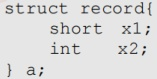

### 2.3.5 本节习题精选

#### 一、 单项选择题

##### 01

在 C 语言的不同类型的数据混合运算中，要先转换为同一类型后进行运算。设一表达式中包含有 int 型、long 型、char 型和 double 型的变量与数据，则表达式最后的运算结果是（），这 4 种类型数据的转换规律是（）。

A. long, int→char→double→long

B. long, char→int→long→double

C. double, char→int→long→double

D. double, char→int→double→long

##### 02

长度相同但格式不同的两种浮点数，假设前者阶码长、尾数短，后者阶码短、尾数长，其他规定均相同，则它们可表示的数的范围和精度为（）。

A. 两者可表示的数的范围和精度相同 B. 前者可表示的数的范围大但精度低

C. 后者可表示的数的范围大且精度高 D. 前者可表示的数的范围大且精度高

##### 03

浮点数的 IEEE 754 标准对尾数编码采用的是（）。

A. 原码 B. 反码 C. 补码 D. 移码

##### 04

在 IEEE 754 标准规定的 64 位浮点数格式中，符号位为 1 位，阶码为 11 位，尾数为 52 位，则它所能表示的最小规格化负数为（ ）。

A.  $-(2-2^{52})\times2^{-1023}$ B.  $-(2-2^{-52})\times2^{+1023}$

C.  $-1\times2^{-1024}$ D.  $-(1-2^{-52})\times2^{+2047}$

##### 05

按照 IEEE 754 标准规定的 32 位单精度浮点数 41A4C000H 对应的十进制数是（）。

A. 4.59375

B. -20.59375

C. -4.59375

D. 20.59375

##### 06

在浮点数编码表示中，___（）在机器数中不出现，是隐含的。

A. 阶码 B. 符号 C. 尾数 D. 基数

##### 07

若某单精度浮点数、某原码、某补码、某移码的 32 位机器数均为 0xF0000000，则这些数从大到小的顺序是（）。

A. 浮原补移 B. 浮移补原 C. 移原补浮 D. 移补原浮

##### 08

采用规格化的浮点数最主要是为了（）。

A. 增加数据的表示范围

B. 方便浮点运算

C. 防止运算时数据溢出

D. 增加数据的表示精度

##### 09

设  $x$ 是采用 IEEE 754 标准表示的 32 位单精度浮点数，下列说法中正确的是（ ）。

I. 当  $|x| < 1.0 \times 2^{-126}$ 时， $x$ 将被置为机器零

II. 当  $|x| > 1.0 \times 2^{127}$ 时，将发生溢出

III.  $x$ 所能表示的最小非规格化正数与最大非规格化负数的绝对值相等

IV.  $x$ 可表示的最大正数与最小负数的绝对值相等

A. I, II, III, IV      B. I, II       C. II, III, IV      D. III, IV

##### 10

在浮点运算中，下溢指的是（）。

A. 运算结果的绝对值小于机器所能表示的最小绝对值

B. 运算的结果小于机器所能表示的最小负数

C. 运算的结果小于机器所能表示的最小正数

D. 运算结果的最低有效位产生的错误

##### 11

判断浮点数运算是否溢出，取决于（）。

A. 尾数是否上溢 B. 尾数是否下溢 C. 阶码是否上溢 D. 阶码是否下溢

##### 12

假定采用 IEEE 754 标准中的单精度浮点数格式表示一个数为 45100000H，则该数的值是（）。
A.  $(+1.125)_{10} \times 2^{10}$ B.  $(+1.125)_{10} \times 2^{11}$ C.  $(+0.125)_{10} \times 2^{11}$ D.  $(+0.125)_{10} \times 2^{10}$

##### 13

已知 float 型采用 IEEE 754 单精度浮点数格式，若 x、y 为 float 型变量，且 x = -126, y = 15.75，则执行语句 z = x + y 时，在浮点运算单元中进行对阶操作后的结果是（）。

A. x 不变，y 为 010000101,0.001111110...0

B. x 不变，y 为 010000110,0.001111110...0

C. y 不变，x 为 110000101,0.001111110...0

D. y 不变，x 为 110000110,0.001111110...0

##### 14

假设 x 和 y 均是 float 型变量，x 的真值为 1，y 的真值为 0.1。已知 0.1 的二进制表示为无限循环小数 0.00011[0011]...（重复因子为 0011），某计算机采用 IEEE 754 单精度格式及就近舍入方式，则计算 x + y 的结果用十六进制机器数表示为（）。

A. 3F80 0000

B. 3F8C CCCD

C. 3F8C CCCC

D. 3F80 000C

##### 15

在 IEEE 754 标准浮点格式中，非规格化浮点数表示为（）。

A. 阶码为 0，尾数为任意非 0 的二进制数

B. 阶码为 255，尾数全为 0

C. 阶码为 255，尾数为任意非 0 的二进制数

D. 阶码为 0，尾数全为 0

##### 16

在 IEEE 754 单精度浮点数加减运算的对阶阶段，若需将某操作数的尾数右移以对齐阶码，则关于其隐含的前导“1”，以下说法正确的是（）。

A. 隐含的“1”始终保留在最高位，在右移过程中不会被移出

B. 隐含的“1”参与右移，但为保持规格化形式，移位后仍重置为1

C. 对阶移位前，需先将隐含的“1”恢复到尾数高位，再整体右移

D. 非规格化数也包含隐含的“1”，因此同样需要恢复后再移位

##### 17

在 IEEE 754 单精度浮点数加减运算中，若两个操作数阶码之差的绝对值为  $\Delta E$，当其大于或等于（ ）时，阶码较小的操作数对结果无影响，结果直接取阶码较大的操作数（假设采用就近舍入的方式）。

A. 24 B. 25 C. 126 D. 128

##### 18

下列关于机器字长的叙述中，错误的是（）。

A. 机器字长是指 CPU 中定点运算数据通路的宽度

B. 机器字长通常与 CPU 通用寄存器的位数一致

C. 机器字长决定了定点数的表示范围和精度

D. 机器字长对计算机硬件造价没有影响

##### 19

计算机中的信息按边界对齐方式存储的含义是（）。

A. 信息的字节长度必须是整数

B. 信息单元的字节长度必须是整数

C. 信息单元的存储地址必须是整数

D. 信息单元的存储地址是其字节长度的整数位

##### 20

假设已定义三个 int 型变量 x、y 和 z，sizeof(int) = 4，double 型采用 IEEE 754 双精度浮点数格式，变量 dx、dy 和 dz 的声明和初始化如下：

```c
double dx = (double)x;

double dy = (double)y;

double dz = (double)z;
```

则下列关系表达式中永远为真的是（）。

I. dx + dy == (double) (x + y)

II. (dx + dy) + dz == dx + (dy + dz)
A. I 和 II B. 仅 I C. 仅 II D. 无正确项

##### 21

在按字节编址的计算机中，采用小端方式存储数据，某静态二维数组 b 的声明如下:

```c
static short b[2][4] = {2,9,-1,5},{3,1,-6,2};
```

若 b 的首地址为 0x8049820，采用按行优先存储，地址 0x804982c 中的内容是（）。

A. FAH B. FFH C. 00H D. 05H

##### 22

在按字节编址的计算机中，数据在存储器中以小端方式存放。假定 int 型变量 i 的地址为 08000000H，i 的机器数为 01234567H，地址 08000000H 单元的内容是（）。

A. 01H B. 23H C. 45H D. 67H

##### 23

在按字节编址的 32 位计算机中，按边界对齐方式为以下结构型变量 x 分配存储空间：

```c
struct cont_info{

    char id;

    unsigned post;

    char phone;

} x;
```

若 x 的首地址为 0x8049820，则成员变量 phone 的起始地址为（）。

A. 0x8049828 B. 0x8049826 C. 0x8049825 D. 0x8049822

##### 24

假定变量 i、f 的数据类型分别是 int、float。已知 i = 12345，f = 1.2345×2³，则在一个 32 位机器中执行下列表表达式时，结果为“假”的是（）。

A. i = (int)(double)i

B. f = (float)(double)f

C. i = (int)(float)i

D. f = (float)(int)f

##### 25

有以下 C 语言代码段：

```c
int m=13;

float a=12.6,x;

x=m/2+a/2;

printf("%f\n",x);
```

执行上述代码后，输出的x值为（）。

A. 12.000000 B. 12.300000 C. 12.800000 D. 12

##### 26

【2009 统考真题】浮点数加、减运算过程一般包括对阶、尾数运算、规格化、舍入和判断溢出等步骤。设浮点数的阶码和尾数均采用补码表示，且位数分别为 5 和 7（均含 2 位符号位）。若有两个数  $X = 2^7 \times 29 / 32$ 和  $Y = 2^5 \times 5 / 8$，则用浮点加法计算  $X + Y$ 的最终结果是（）。

A. 00111 1100010

B. 00111 0100010

C. 01000 0010001

D. 发生溢出

##### 27

【2010 统考真题】假定变量 i、f 和 d 的数据类型分别为 int、float 和 double（int 型用补码表示，float 型和 double 型分别用 IEEE 754 单精度和双精度浮点数格式表示），已知 i = 785、f = 1.5678E3、d = 1.5E100，若在 32 位机器中执行下列关系表达式，则结果为“真”的是（ ）。

I. i = (int)(float)i  II. f = (float)(int)f  III. f = (float)(double)f  IV. (d+f)-d == f

A. 仅 I 和 II      B. 仅 I 和 III     C. 仅 II 和 III     D. 仅 III 和 IV

##### 28

【2011 统考真题】float 型数据通常用 IEEE 754 单精度格式表示。若编译器将 float 型变量 x 分配在一个 32 位浮点寄存器 FR1 中，且 x = -8.25，则 FR1 的内容是（）。

A. C104 0000H B. C242 0000H C. C184 0000H D. C1C2 0000H

##### 29

【2012 统考真题】float 型（IEEE 754 单精度浮点数格式）能表示的最大正整数是（）。

A.  $2^{126}-2^{103}$ B.  $2^{127}-2^{104}$ C.  $2^{127}-2^{103}$ D.  $2^{128}-2^{104}$

##### 30

【2012 统考真题】某计算机存储器按字节编址，采用小端方式存放数据。假定编译器规定 int 型和 short 型长度分别为 32 位和 16 位，并且数据按边界对齐存储。某 C 语言程序
段如下：

```c
struct{

    int a;

    char b;

    short c;

    }record;

    record.a = 273;

}
```

若 record 变量的首地址为 0xC008，地址 0xC008 中的内容及 record.c 的地址分别为（）。

A. 0x00, 0xC00D B. 0x00, 0xC00E C. 0x11, 0xC00D D. 0x11, 0xC00E

##### 31

【2013 统考真题】某数采用 IEEE 754 单精度浮点数格式表示为 C640 0000H，则该数的值是（ ）。

A.  $-1.5 \times 2^{13}$ B.  $-1.5 \times 2^{12}$ C.  $-0.5 \times 2^{13}$ D.  $-0.5 \times 2^{12}$

##### 32

【2014 统考真题】float 型数据常用 IEEE 754 单精度浮点格式表示。假设两个 float 型变量 x 和 y 分别存放在 32 位寄存器 f1 和 f2 中，若 (f1) = CC90 0000H, (f2) = B0C0 0000H，则 x 和 y 之间的关系为（ ）。

A. x < y 且符号相同

B. x < y 且符号不同

C. x > y 且符号相同

D. x > y 且符号不同

##### 33

【2015 统考真题】下列有关浮点数加减运算的叙述中，正确的是（）。

Ⅰ. 对阶操作不会引起阶码上溢或下溢

Ⅱ. 右规和尾数舍入都可能引起阶码上溢

Ⅲ. 左规时可能引起阶码下溢

Ⅳ. 尾数溢出时结果不一定溢出

A. 仅Ⅱ、Ⅲ B. 仅Ⅰ、Ⅱ、Ⅳ C. 仅Ⅰ、Ⅲ、Ⅳ D. Ⅰ、Ⅱ、Ⅲ、Ⅳ

##### 34

【2016 统考真题】某计算机字长为 32 位，按字节编址，采用小端方式存放数据。假定有一个 double 型变量，其机器数表示为 1122 3344 5566 7788H，存放在以 0000 8040H 开始的连续存储单元中，则存储单元 0000 8046H 中存放的是（）。

A. 22H B. 33H C. 77H D. 66H

##### 35

【2018 统考真题】IEEE 754 单精度浮点格式表示的数中，最小的规格化正数是（）。

A.  $1.0 \times 2^{-126}$ B.  $1.0 \times 2^{-127}$ C.  $1.0 \times 2^{-128}$ D.  $1.0 \times 2^{-149}$

##### 36

【2018 统考真题】某 32 位计算机按字节编址，采用小端方式。若语句 “int i = 0,” 对应指令的机器代码为 “C7 45 FC 00 00 00 00”，则语句 “int i = -64,” 对应指令的机器代码是（）。

A. C7 45 FC C0 FF FF FF

B. C7 45 FC 0C FF FF FF

C. C7 45 FC FF FF FF C0

D. C7 45 FC FF FF FF 0C

##### 37

【2020 统考真题】在按字节编址、采用小端方式的 32 位计算机中，按边界对齐方式为以下 C 语言结构型变量 a 分配存储空间：



若 a 的首地址为 2020 FE00H，a 的成员变量 x2 的机器数为 1234 0000H，则其中 34H 所在存储单元的地址是（）。

A. 2020 FE03H B. 2020 FE04H C. 2020 FE05H D. 2020 FE06H

##### 38

【2020 统考真题】已知有符号整数用补码表示，float 型数据用 IEEE 754 标准表示，假定变量 x 的类型只可能是 int 或 float，当 x 的机器数为 C800 0000H 时，x 的值可能是()。

A.  $-7 \times 2^{27}$ B.  $-2^{16}$ C.  $2^{17}$ D.  $25 \times 2^{27}$
##### 39

【2021 统考真题】下列数值中，不能用 IEEE 754 浮点格式精确表示的是（）。

A. 1.2 B. 1.25 C. 2.0 D. 2.5

##### 40

【2022 统考真题】-0.4375 的 IEEE 754 单精度浮点数表示为（）。

A. BEE0 0000H B. BF60 0000H C. BF70 0000H D. COE0 0000H

##### 41

【2023 统考真题】若 short 型变量 x = -8190，则 x 的机器数是（）。

A. E002H B. E001H C. 9FFFH D. 9FFEH

##### 42

【2023 统考真题】已知 float 型变量用 IEEE 754 单精度浮点数格式表示。若 float 型变量 x 的机器数为 8020 0000H，则 x 的值是（）。

A.  $-2^{-128}$ B.  $-1.01 \times 2^{-127}$ C.  $-1.01 \times 2^{-126}$ D. 非数（NaN）

##### 43

【2024 统考真题】某科学实验中，需要使用大量的整型参数，为了在保证表数精度的基础上提高运算速度，需要选择合理的数据表示方法。若整型参数  $\alpha$、 $\beta$ 的取值范围分别为  $-2^{20} \sim 2^{20}$、 $-2^{40} \sim 2^{40}$，则在下列选项中， $\alpha$、 $\beta$ 最适合采用的数据表示方法分别是（）。

A. 32 位整数、32 位整数

B. 单精度浮点数、单精度浮点数

C. 32 位整数、双精度浮点数

D. 单精度浮点数、双精度浮点数

##### 44

【2025 统考真题】已知 float 型变量用 IEEE 754 单精度浮点数格式表示。若 float 型变量的机器数为 4730 0000H，则 x 的值是（）。

A.  $0.375 \times 2^{14}$ B.  $1.375 \times 2^{14}$ C.  $0.375 \times 2^{15}$ D.  $1.375 \times 2^{15}$

##### 45

【2025 统考真题】某 32 位计算机按字节编址，采用小端方式存放数据，编译器按边界对齐方式为下列 C 语言结构型数组变量 employee 分配存储空间。

```c
struct record {
    int id;
    char name[10];
    int salary;
} employee[200];
```

若 employee 的首地址为 0000 A0B0H, employee[1].id 的机器数为 1234 5678H, 则该机器数中的 56H 所在存储单元的地址是（）。

A. 0000 A0C3H B. 0000 A0C4H C. 0000 A0C5H D. 0000 A0C6H

#### 二、 综合应用题

##### 01

现有一计算机字长32位（ $D_{31} \sim D_{0}$），符号位是最高位。对于二进制1000 1111 1110 1111 1100 0000 0000 0000，1）表示一个补码整数，其十进制值是多少？

2）表示一个无符号整数，其十进制值是多少？

3）表示一个 IEEE 754 标准的单精度浮点数，其值是多少？

##### 02

假定变量 i 是一个 32 位的 int 型整数，f 和 d 分别为 float 型（32 位）和 double 型（64 位）实数。分析下列各布尔表达式，说明结果是否在任何情况下都是 “true”。

1) i = (int) ((double) i)

2) f = (float) ((int) f)

3) f = (float) ((double) f)

4) d = (double) ((float) d)

##### 03

已知两个实数 x = -68, y = -8.25，它们在 C 语言中定义为 float 型变量，分别存放在寄存器 A 和 B 中。另外，还有两个寄存器 C 和 D。A、B、C、D 都是 32 位的寄存器。请问（要求用十六进制表示二进制序列）：

1）寄存器 A 和 B 中的内容分别是什么？
2）x 和 y 相加后的结果存放在寄存器 C 中，寄存器 C 中的内容是什么？

3）x 和 y 相减后的结果存放在寄存器 D 中，寄存器 D 中的内容是什么？

##### 04

对下列每个 IEEE 754 单精度数值，解释它们所表示的是哪种数字类型（规格化数、非规格化数、无穷大、0）。当它们表示某个具体数值时，请给出该数值。

| 1) | 0000 | 0000 | 0000 | 0000 | 0000 | 0000 | 0000 | 0000 |
| --- | --- | --- | --- | --- | --- | --- | --- | --- |
| 2) | 0100 | 0010 | 0100 | 0000 | 0000 | 0000 | 0000 | 0000 |
| 3) | 1000 | 0000 | 0100 | 0000 | 0000 | 0000 | 0000 | 0000 |
| 4) | 1111 | 1111 | 1000 | 0000 | 0000 | 0000 | 0000 | 0000 |

##### 05

【2017 统考真题】已知  $f(n) = \sum_{i=0}^{n} 2^i = 2^{n+1} - 1 = 1\widetilde{1}\cdots1B$，计算  $f(n)$ 的 C 语言函数  $f(1)$ 如下：

```c
int f1(unsigned n) {
    int sum=1, power=1;
    for (unsigned i=0; i<=n-1; i++) {
        power *= 2;
        sum += power;
    }
    return sum;
}
```

将 f1 中的 int 都改为 float，可得到计算 f(n) 的另一个函数 f2。假设 unsigned 型和 int 型数据都占 32 位，float 型数据采用 IEEE 754 单精度标准。请回答下列问题：

1）当 n=0 时，fl 会出现死循环，为什么？若将 fl 中的变量 i 和 n 都定义为 int 型，则 fl 是否还会出现死循环？为什么？

2）f1(23)和f2(23)的返回值是否相等？机器数各是什么（用十六进制表示）？

3）f1(24)和f2(24)的返回值分别为33 554 431和33 554 432.0，为什么不相等？

4）f(31)=2^{32}-1，而 f(131)的返回值却为-1，为什么？若使 f(n)的返回值与 f(n)相等，则最大的 n 是多少？

5）f2(127)的机器数为7F80 0000H，对应的值是什么？若使f2(n)的结果不溢出，则最大的n是多少？若使f2(n)的结果精确（无舍入），则最大的n是多少？

### 2.3.6 答案与解析

#### 一、 单项选择题

##### 01

C

不同类型的数据混合运算时，遵循的原则是“类型提升”，即较低类型转换为较高类型，最终结果为 double 型。4 种类型数据的转换规律为 char→int→long→double。

例如，long 型数据与 int 型数据一起运算时，需先将 int 型转换为 long 型，然后两者再进行运算，结果为 long 型。float 型数据和 double 型数据一起运算时，虽然它们同为实型，但两者精度不同，仍要先将 float 型转换为 double 型再进行运算，结果亦为 double 型。所有这些转换都是由系统自动进行的，这种转换通常称为隐式转换。

注意在强制类型转换中，从 int 型转换为 float 型时，虽然不会发生溢出，但因尾数位数的关系，可能有数据舍入，而转换为 double 型则能保留精度。double 型转换为 float 型时亦是如此。从 float 型或 double 型转换为 int 型时，小数部分被截断，且由于 int 型的表示范围更小，还可能发生溢出。

##### 02

B

在浮点数总位数不变的情况下，阶码位数越多，尾数位数越少；即表示的数的范围越大，精
度越差（数变稀疏）。

##### 03

A

IEEE 754 标准中尾数采用原码表示，阶码部分用移码表示。

##### 04

B

长浮点数，其阶码为11位，尾数为52位，采取隐藏位策略，因此其最小规格化负数为阶码取最大值 $2^{+1023}$（1023 $=2^{11-1}-1$），尾数取最大值 $2-2^{-52}$（注意其有隐藏位要加1），符号位为负。

##### 05

D

在 IEEE 754 单精度浮点数中，最高位为符号位；其后是 8 位阶码，以 2 为底，用移码表示，阶码的偏置值为 127；其后 23 位是尾数数值位。对于规格化的二进制浮点数，数值的最高位总是 “1”，为了能使尾数多表示一位有效值，将这个 “1” 隐藏，因此尾数数值实际上是 24 位。隐藏的 “1” 是一位整数。在浮点格式中表示出来的 23 位尾数是纯小数，用原码表示。41A4C000H 写成二进制为 0100 0001 1010 0100 1100 0000 0000 0000，第一位为符号位 0，表示是正数。之后的 8 位 1000 0011 表示阶码，真值为  $(100)_{B}$，即 4。剩下的是隐藏了最高位 1 的尾数，所以为 1.010 0100 1100 0000 0000 0000，数值左移四位后整数部分 10100 表示为 20。

##### 06

D

在浮点数编码表示中，基数的值是约定好的，因此将其隐含。

##### 07

D

这个机器数的最高位为1，对于原码、补码、单精度浮点数而言为负数，对于移码而言为正数，所以移码最大，而补码为 $-2^{28}$，原码为 $-(2^{30}+2^{29}+2^{28})$，单精度浮点数为 $-1.0\times2^{97}$，大小依次递减。

##### 08

D

与非规格化浮点数相比，采用规格化浮点数的目的主要是为了增加数据的表示精度。

##### 09

D

IEEE 754 单精度浮点数的阶码偏置为 127，规格化数的阶码范围为 1～254（对应真值指数-126～+127），非规格化数用于表示接近零的数值。 $1.0 \times 2^{-126}$ 是最小规格化正数，最小非规格化正数为  $1.0 \times 2^{-149}$，仅当  $|x|$ 小于此值时才舍入为机器零。最大可表示正数为  $(2 - 2^{-23}) \times 2^{127}$，仅当  $|x|$ 超过该值时才溢出。IEEE 754 浮点数的表示范围在正负区间完全对称，故说法 III 和 IV 正确。

##### 10

A

运算结果在0至规格化最小正数之间时称为正下溢，运算结果在0至规格化最大负数之间时称为负下溢，正下溢和负下溢统称下溢。

##### 11

C

判断浮点数运算是否溢出，取决于阶码是否上溢。阶码下溢可以通过非规格化数来表示。尾数上溢或下溢，可以通过左移或右移进行调整。

##### 12

B

写成二进制表示为 0100 0101 0001 0000 0000 0000 0000 0000，第一位为符号位，0 表示正数，随后 8 位（float 型）1000 1010 是用移码表示的阶码，因此减去 0111 1111 后得十进制数 11，而 IEEE 754 标准中单精度浮点数在阶码不为 0 时隐藏 1，因此尾数为  $(1.0010)_B = (1.125)_D$，因此该数值为  $(+1.125)_{10} \times 2^{11}$。

##### 13

A

规格化 IEEE 754 浮点数尾数部分的数值范围为 [1, 2)，x = -1111110B = -1.111110B×2⁶，y = 1111.11B = 1.11111B×2³，所以浮点数 x、y 的阶数分别为 6 和 3。对阶操作是小阶码向大阶码看齐，即 y 的阶数变为 6，移码表示为 6 + 127 = 133，即 10000101B，y 的尾数右移 3 位，变为 0.001111111B。
##### 14

B

 $x = 1.0 = (1.0)_2 \times 2^0$，尾数为  $\underline{1.00...0}$（隐含的1加上23个0）。 $y = 0.1 = (1.10011...)_2 \times 2^{-4}$，尾数为  $\underline{1.100}$ 1100 1100 1100 1100 1100 1101（最低有效位之后的3位为110，故末位加1）。执行 $x + y$时对阶：将 $y$的尾数右移4位使其与 $x$同阶（ $2^0$），得0.000 1100 1100 1100 1100 1100 1101。将其与 $x$的尾数1.00...0相加，得1.000 1100 1100 1100 1100 1100 1101。根据1101进行就近含入，末位加1，得1.000 1100 1100 1100 1100 1101。最终编码为：符号位为0，阶码为127=0111 1111，尾数为（隐含 $\underline{1}$）000 1100 1100 1100 1100 1101，组合并转换成十六进制数为3F8C CCCD。

##### 15

A

在 IEEE 754 标准浮点格式中，阶码全为 0，尾数不全为 0 表示非规格化数，非规格化数可用于处理阶码下溢，使得出现比最小规格化数还小的数时程序也能继续进行下去。

##### 16

C

IEEE 754 单精度规格化数的有效数字为 24 位（1. $f_{22}f_{21}\cdots f_{0}$），其中前导“1”是隐含的，未实际存储。对阶时，必须先恢复该隐含位，与 23 位尾数拼接成 24 位，再整体右移（高位补 0）以对齐阶码。因此，前导“1”会随尾数一同参与移位，可能被移出，选项 A 错误，选项 C 正确。右移是逻辑右移，高位补 0；若补 1，将导致数值错误，选项 B 错误。非规格化数无隐藏位，选项 D 错误。

##### 17

B

IEEE 754 单精度浮点数的有效数字为 24 位（含隐含前导 1）。对阶时，若阶差  $\Delta E \geqslant 25$，则小阶操作数的隐含 1 将右移至舍入位或更低位，导致保护位为 0。根据就近舍入规则，此时无论舍入位和粘滞位为何值，均直接截断，不会进位。因此，结果直接取大阶操作数。

##### 18

D

机器字长是 CPU 一次能处理的定点整数位数，通常等于通用寄存器位数和定点运算数据通路宽度。机器字长越长，定点数的表示范围越大，可精确表示的整数位数越多。机器字长直接影响寄存器、ALU、总线等硬件的位宽，字长越长，电路规模越大，硬件成本显著增加。

##### 19

D

信息在存储器中按边界对齐方式存储的含义是信息单元的存储地址是其字节长度的整数倍。这样可以保证对一个字长数据的读/写只需要一次存储器访问，提高了访存效率，但有时会导致存储空间的浪费。因此，这是一种以空间换时间的办法。

##### 20

D

说法Ⅰ非永真，因为 $x+y$可能溢出，而 $dx+dy$不会溢出，两者结果可能不同。说法Ⅱ永真，由于dx、dy和dz均由32位int转换而到，double可精确地表示int，且对阶时尾数移动位数不会超过52位，因此尾数不会舍入，不会发生大数吃小数［当两浮点数阶码相差超过尾数位宽（24/53位）时，小阶操作数在右移后有效位全部丢失，导致加法结果等于大阶操作数］的情况。

##### 21

A

二维数组 b 的元素是 short 型，占 2 字节，采用按行优先存储，b[0][0]的地址为 0x8049820，b[0][1]的地址为 0x8049822，以此类推，b[1][2]的地址为 0x804982c。b[1][2]的值为 -6，补码表示为 11111111 11111010，采用小端方式存储，因此地址 0x804982c 存放的是低位字节 FAH。

##### 22

D

小端方式是将最低有效字节存储在最小位置。在数01234567H中，最低有效字节为67H。

##### 23

A

结构体按边界对齐存放的要求：数据成员的起始地址是其数据类型大小的整数倍，char型占1字节，char型的起始地址必须是1字节的整数倍；unsigned型占4字节，所以unsigned型的起始地址必须是4字节的整数倍。据此分析，id的起始地址为0x8049820，post的起始地址为
0x8049824，所以 phone 的起始地址为 0x8049828。结构体 x 的存放方式如下所示。

| 地址 | 8049820H | 8049821H | 8049822H | 8049823H |
| --- | --- | --- | --- | --- |
| 地址 | char |   |   |   |
| 8049824H | 8049825H | 8049826H | 8049827H |   |
| post |   |   |   |   |
| 地址 | 8049828H | 8049829H | 804982AH | 804982BH |
| phone |   |   |   |   |

##### 24

D

对于选项 A 和 B，int 型的有效位数不会超过 31 位，float 型的有效位数比 double 型的小得多，因此都能精确转换为具有 53 位有效位的 double 型。对于选项 C，12345 < 1024×16 = 2¹⁴，因此 12345 对应的二进制的位数一定小于 14，因此可精确转换为具有 24 位有效位的 float 型。对于选项 D，f = 1234.5，转换为 int 型后，小数点后面的数字丢失，因此与原来的 f 不相等。

##### 25

B

整数与整数运算，结果为整数，所以  $m/2$ 的结果为6。实数与整数运算，结果为实数，所以  $a/2$ 的结果为6.3，相加为12.3。C 语言的输出格式可使输出值保留小数点后6位，输出为12.300000。

##### 26

D

X 的浮点数格式为 00, 111; 00, 11101 （分号前为 阶 码，分 号 后 为 尾 数），Y 的浮点数格式为 00, 101; 00, 10100 。然后根据浮点数的 加法 步骤 进行 运算 。

① 对阶。X、Y 阶码相减，即 00, 111-00, 101=00, 111+11, 011=00, 010，可知 X 的阶码比 Y 的阶码大 2（这一步可直接目测）。根据小阶码向大阶码看齐的原则，将 Y 的阶码加 2，尾数右移 2 位，将 Y 变为 00, 111; 00, 00101。

②尾数相加。即00,11101+00,00101=01,00010，尾数相加结果符号位为01，因此需要右规。

③ 规格化。将尾数右移1位，阶码加1，得 $X+Y$为01,000;00,10001。

④ 判断溢出。阶码符号位为 01，说明发生溢出。

本题容易误选选项 B、C，因为选项 B、C 本身并无计算错误，只是它们不是最终结果，选项 B 少了第 3 步和第 4 步，选项 C 少了第 4 步。

##### 27

B

题中三种数据类型强制类型转换的顺序为 int→float→double。若将 float 型转换为 int 型，小数位部分会被舍去，int 型是精确到 32 位的整数，而 float 型只保存到 1+23 位，因此一个 32 位的 int 型整数在转换为 float 型时可能有损失，具体判断方法如下：先将 int 型整数转换为二进制真值，然后将真值写为 ±1x...x^2^ 的形式，若小数点后的位数超过 23 位，则转换为 float 型会发生精度损失。本题中 i=785，转换为二进制真值为 1.100010001×2^9，小数点后只有 9 位，不会发生精度损失，说法 I 正确。对于说法 II，将 float 型的 f 转换为 int 型，小数点后的数位丢失，结果非真。double 型的精度和范围都比 float 型的大，float 型转换为 double 型不会有损失，说法 III 正确。对于说法 IV，初看似乎没有问题，但浮点运算 d+f 时需要对阶，对阶后 f 的尾数有效位被舍去而变为 0，因此 d+f 仍然为 d，再减去 d 后结果为 0，结果非真。注意，从 int 型转换为 float 型时，虽然不会发生溢出，但由于尾数位数的关系，可能有数据舍入，影响精度，而转换为 double 型则能保留精度。

##### 28

A

本题的目的在于考查 IEEE 754 单精度浮点数的表示。首先先将 x 转换为二进制数，即 -1000.01 = -1.000 01×2³，然后计算阶码 E，根据 IEEE 754 单精度浮点数格式，有 E - 127 = 3，因此 E = 130，转换为二进制数，即 1000 0010。最后，根据 IEEE 754 标准，最高位的 1 是被隐藏的。

IEEE 754 单精度浮点数格式：符号（1位）+ 阶码（8位）+ 尾数（23位）。
因此 FR1 的内容为 1; 1000 0010; 0000 1000 0000 0000 0000 0000。

即 1100 0001 0000 0100 0000 0000 0000 0000 = C104 0000H。

本题易误选选项D，未考虑 IEEE 754 标准隐藏最高位 1 的情况，把偏置值认为是 128。

##### 29

D

IEEE 754 单精度浮点数是尾数用采取隐藏位策略的原码表示，且阶码用移码（偏置值为 127）表示的浮点数。规格化短浮点数的真值为  $(-1)^{S \times 1} \cdot m \times 2^{E-127}$，其中  $S$ 为符号位，阶码  $E$ 的取值为  $1 \sim 254$（8 位表示），尾数  $m$ 为 23 位，共 32 位；因此，float 型能表示的最大整数是  $1.111 \ldots 1 \times 2^{254-127} = 2^{127} \times (2 - 2^{-23}) = 2^{128} - 2^{104}$。

【另解】IEEE 754 单精度浮点数格式如下图所示。

| 符号（1） | 阶码（8） | 尾数（23） |
| --- | --- | --- |

表示最大正整数时：符号取 0；阶码取最大值 127；尾数部分隐藏了整数部分的“1”，23位尾数全取1时尾数最大，为  $2-2^{-23}$，此时浮点数的大小为  $(2-2^{-23}) \times 2^{127} = 2^{128} - 2^{104}$。

##### 30

D

尽管 record 大小为 7B（成员 a 有 4B，成员 b 有 1B，成员 c 有 2B），因为数据按边界对齐方式存储，所以 record 共占用 8B。record.a 的十六进制表示为 0x00000111，因为采用小端方式存放数据，所以地址 0xC008 中的内容应为低字节 0x11；record.b 只占 1B，后面的 1B 留空；record.c 占 2B，因此其地址为 0xC00E。各字节的存储分配如下表所示。

| 地址 | 0xC008 | 0xC009 | 0xC00A | 0xC00B |
| --- | --- | --- | --- | --- |
| 内容 | record.a (0x11) | record.a (0x01) | record.a (0x00) | record.a (0x00) |
| 地址 | 0xC00C | 0xC00D | 0xC00E | 0xC00F |
| 内容 | record.b | - | record.c | record.c |

##### 31

A

IEEE 754 单精度浮点数格式为 C640 0000H，二进制格式为 1100 0110 0100 0000 0000 0000 0000 0000，转换为标准的格式为

| 符号 | 阶码 | 尾数 |
| --- | --- | --- |
| 1 | 1000 1100 | 100 0000 0000 0000 0000 0000 |

符号为1表示负数；阶码为1000 1100-0111 1111=0000 1101=13；尾数为1.5（注意其有隐藏位，要加1）。因此，浮点数的值为 $-1.5 \times 2^{13}$。

##### 32

A
```c

(fl)和(f2)对应的二进制分别是(110011001001…)_2和(101100001100…)_2，根据 IEEE 754 浮点数标准，可知(fl)的符号为1，阶码为10011001，尾数为1.001，而(f2)的符号为1，阶码为01100001，尾数为1.1，可知两数均为负数，符号相同，B、D排除；(fl)的绝对值为1.001×2^26，(f2)的绝对值为1.1×2^-30，(fl)的绝对值比(f2)的绝对值大，而符号为负，真值大小相反，即(fl)的真值比(f2)的真值小，即x<y。
```

##### 33

D

对阶是较小的阶码向较大的阶码对齐，所以对阶后的阶码是当前那个较大的阶码而不会导致阶码溢出，说法Ⅰ正确。右规和尾数舍入过程，阶码加1而可能上溢，说法Ⅱ正确，同理说法Ⅲ也正确。尾数溢出时可能仅产生误差，结果不一定溢出，说法Ⅳ正确。

##### 34

A

大端方式：一个字中的高位字节存放在内存中这个字区域的低地址处。小端方式：一个字中
的低位字节存放在内存中这个字区域的低地址处。各字节的存储分配如下表所示。

| 地址 | 0000 8040H | 0000 8041H | 0000 8042H | 0000 8043H |
| --- | --- | --- | --- | --- |
| 内容 | 88H | 77H | 66H | 55H |
| 地址 | 0000 8044H | 0000 8045H | 0000 8046H | 0000 8047H |
| 内容 | 44H | 33H | 22H | 11H |

从而存储单元0000 8046H中存放的是22H。

##### 35

A

IEEE 754 单精度浮点数的符号位、阶码位、尾数位（省去正数位 1）所占的位数分别是 1、8、23。最小正数，符号位取 0，移码的取值范围是 1～254，取 1，得阶码 1-127=-126（127 为我们规定的偏置值），尾数取全 0，最终推出最小规格化正数为 A。

##### 36

A

按字节编址，采用小端方式，低位的数据存储在低地址位、高位的数据存储在高地址位，并且按照一字节相对不变的顺序存储。由题意，存储0的位数是后32位，则我们只需要把-64的补码按字节存储在其中即可，而-64表示成32位的十六进制是FFFFF C0，根据小端方式的特点，低位字节存储在低地址位，就是C0 FF FF FF。

##### 37

D

在 32 位计算机中，按字节编址，根据小端方式和按边界对齐的定义，变量 a 的存放方式：

| 地址 | 2020 FE00H | 2020 FE01H | 2020 FE02H | 2020 FE03H |
| --- | --- | --- | --- | --- |
|   | 未知 | 未知 |   |   |
| 说明 | x1 (LSB) | x1 (MSB) |   |   |
| 地址 | 2020 FE04H | 2020 FE05H | 2020 FE06H | 2020 FE07H |
|   | 00H | 00H | 34H | 12H |
| 说明 | x2 (LSB) |   |   | x2 (MSB) |

于是，34H 所在存储单元的地址为 2020 FE06H。

##### 38

A

 $$C800\ 0000H=1100\ 1000\ 0000\ 0000\ 0000\ 0000\ 0000\ 0000。$$

将其转换为对应的 float 型或 int 型。

1）若为 float 型，则尾数隐藏最高位 1，符号为 1 表示负数，阶码  $1001\ 0000 = 2^7 + 2^4 = 128 + 16$，再减去偏置值 127 得到 17，算出 x 值为  $-2^{17}$。

2）若为 int 型，则有符号补码，为负数，数值部分取反加 1，得 011 1000 0000 0000 0000 0000 0000 0000，算出 x 值为  $-7 \times 2^{27}$。

##### 39

A

使用排除法。选项 B：1.25 = 1.01B×2⁰；选项 C：2.0 = 1.0B×2¹；选项 D：2.5 = 1.01B×2¹。因此，选项 B、C 和 D 均可以用 IEEE 754 浮点格式精确表示。选项 A 的十进制小数 1.2 转换为二进制的结果是无限循环小数 1.001100110011...，无法用精度有限的 IEEE 754 浮点格式精确表示。

##### 40

A

IEEE 754 单精度浮点数格式中依次为符号 1 位、阶码 8 位（偏置值 127）、尾数 23 位（隐藏 1 位）。-0.4375 = -1.75 × 2⁻²，保证小数点前是 1。根据单精度浮点数格式，符号为 1；阶码为移码表示，-2 + 127 = 125，写成 8 位二进制数为 01111101；尾数隐藏小数点前的 1，剩下的 0.75 写成二进制数为 0.11，所以尾数部分是 1100…0。该浮点数的二进制格式为 1011 1110 1110 0000 0000 0000 0000 0000，对应的十六进制格式为 BEE0 0000H。
##### 41

A

short 型变量是补码表示的 16 位有符号整数。x 是负数，可先求出 8190 的机器数，8190 = 8192 - 2 = 2¹³ - 2¹，8190 的机器数为 0010 0000 0000 0000B - 0000 0000 0000 0010B = 0001 1111 1111 1110B，因此 -8190 的机器数为 1110 0000 0000 0010B = E002H（按位取反，末位加 1）。

##### 42

A

把 x 的机器数按二进制展开，8020 0000H = 1000 0000 0010 0000 0000 0000 0000B，符号为负，阶码全为 0，尾数不全为 0，由下表可知，这是非规格化数，对于 32 位非规格化负数，若尾数的二进制为 f，则真值为  $-2^{-126} \times 0.f = -2^{-126} \times 0.01 = -2^{-128}$。

| 值的类型 | 单精度（32 位） |   |   |   |
| --- | --- | --- | --- | --- |
| 符号 | 阶码 | 尾数 | 值 |   |
| 非规格化正数 | 0 | 0 | $f eq 0$ | $2^{-126}(0.f)$ |
| 非规格化负数 | 1 | 0 | $f eq 0$ | $-2^{-126}(0.f)$ |

##### 43

C

表示整数时，相同位数的浮点型的精度不如整型，因此在能满足  $\alpha$、 $\beta$ 的取值范围的前提下，应优先选择整型；否则，才选择浮点型。32 位补码整数的表示范围为  $-2^{31} \sim 2^{31} - 1$，满足  $\alpha$ 的取值范围，因此  $\alpha$ 应采用 32 位整数。双精度浮点数的精度比单精度浮点数的更高， $-2^{40} \sim 2^{40}$ 超出了单精度浮点数可以表示的精度（由尾数位数+隐含位决定），因此  $\beta$ 应采用双精度浮点数。

##### 44

D

根据 IEEE 754 单精度浮点数格式，机器数 4730 0000H 对应的二进制数为 0，100 0111 0,011 0000 0000 0000 0000 0000。符号位为 0，表示正数；8 位阶码 10001110 的十进制值为 142，减去偏置 127，得到实际指数为 15；23 位尾数为 011 0000 0000 0000 0000 0000，规格化形式隐含了前导 1，故有效数字为 1.011（二进制），即十进制数 1.375，因此 x 的值为  $1.375 \times 2^{15}$。

##### 45

C

首先分析结构体 record 的内存布局：int id 占 4 字节；char name[10] 占 10 字节，为使后续 int salary 对齐到 4 字节边界，需要在 name 后填充 2 字节，使 salary 从 4 的整数倍偏移处开始。因此结构体总大小为  $4 + 10 + 2 + 4 = 20$ 字节。employee[1] 的首地址为 0000A0B0H + 20 = 0000A0C4H，id 为其第一个成员，起始地址即为 0000A0C4H。已知 id 的值为 12345678H，在小端方式下，字节按 78H、56H、34H、12H 的顺序存放，故 56H 位于 0000A0C5H。

#### 二、 综合应用题

##### 01

【解答】

1）最高位为符号位，符号位为1，表示是一个负数，对应真值的二进制为-1110000000100000100000000000000（数值位取反，末位加1）对应的十进制值为 $-(2^{30}+2^{29}+2^{28}+2^{20}+2^{14})$。

2）全部32位均为数值位，按权相加可知其十进制值为

 $$2^{31}+2^{27}+2^{26}+2^{25}+2^{24}+2^{23}+2^{22}+2^{21}+2^{19}+2^{18}+2^{17}+2^{16}+2^{15}+2^{14}$$

3）表示一个 IEEE 754 标准的单精度浮点数：

 $$\begin{aligned}& 符号 \quad& 阶码 \quad& 尾数 \\&1\quad;&00011111\quad;&11011111100000000000000\end{aligned}$$

因为阶码为 00011111，所以对应的十进制数为 31。IEEE 754 标准中的阶码用移码表示，其
偏置值为127，所以阶码的十进制真值为31-127=-96。

因为尾数为 1.1101111110000000000000。IEEE 754 标准中的尾数用原码表示，且采用隐藏尾数最高数位 1 的方法，隐藏的 1 是一位整数。所以尾数真值为

 $$1+2^{-1}+2^{-2}+2^{-4}+2^{-5}+2^{-6}+2^{-7}+2^{-8}+2^{-9}$$

因为符号为1，表示这个浮点数是个负数。所以单精度浮点数的真值为

 $$-(1+2^{-1}+2^{-2}+2^{-4}+2^{-5}+2^{-6}+2^{-7}+2^{-8}+2^{-9})\times2^{-96}$$

##### 02

【解答】

强制类型转换，转换过程有两个，一是 unsigned int→int→long→double，二是 float→double，从后向前转换会使得数据丢失，进而使等号不成立。

1）是。因为 double 型比 int 型精度高，所以 int 型变量转换为 double 型变量时不会有精度损失。

2）不是。因为 float 型有小数部分，而 int 型没有小数部分，所以把 float 型变量转换为 int 型变量时，可能丢失小数部分。

3）是。因为 double 型比 float 型精度高，所以 float 型变量转换为 double 型变量时不会有精度损失。

4）不是。因为 float 型比 double 型的有效位数少，所以 double 型变量转换为 float 型变量时会有精度损失。

##### 03

【解答】

1）float 型变量在计算机中都被表示成 IEEE 754 单精度格式。 $X = -68 = -(1000100)_2 = -1.0001 \times 2^6$，符号位为1，阶码为  $127 + 6 = 128 + 5 = (1000\ 0101)_2$，尾数为1.0001，所以小数部分为000 1000 0000 0000 0000 0000，合起来整个浮点数表示为1 1000 0101 000 1000 0000 0000 0000 0000，写成十六进制为C2880000H。

 $Y = -8.25 = -(1000.01)_2 = -1.00001 \times 2^3$，符号位为1，阶码为  $127 + 3 = 128 + 2 = (1000\ 0010)_2$，尾数为1.00001，所以小数部分为000 0100 0000 0000 0000 0000，合起来整个浮点数表示为1 1000 0010 000 0100 0000 0000 0000 0000，写成十六进制为C1040000H。

因此，寄存器A和B的内容分别为C2880000H、C1040000H。

2）两个浮点数相加的步骤如下。

① 对阶： $E_{x}=10000101$， $E_{y}=10000010$，则

 $$[E_{x}-E_{y}]_{ 补 }=[E_{x}]_{ 补 }+[-E_{y}]_{ 补 }=10000101+01111110=00000011$$

 $E_{x}$ 大于  $E_{y}$，所以对 y 进行对阶。对阶后， $y = -0.00100001 \times 2^{6}$。

②尾数相加：x的尾数为-1.000 1000 0000 0000 0000 0000，y的尾数为-0.001 0000 1000 0000 0000 0000，用原码加法运算实现，两数的符号相同，做加法，结果为-1.001 1000 1000 0000 0000 0000。

即 x 加 y 的结果为 -1.001 1000 1×2⁶，所以符号位为 1，尾数为 001 1000 1000 0000 0000 0000，阶码为 127 + 6 = 128 + 5，即 1000 0101。合起来为 1 1000 0101 001 1000 1000 0000 0000 0000，转换为十六进制形式为 C2988000H。

所以寄存器C中的内容是C2988000H。

3）两个浮点数相减的步骤同加法，对阶的结果也一样，只是尾数相减。

尾数相减：x 的尾数为 -1.000 1000 0000 0000 0000 0000，y 的尾数为 -0.001 0000 1000 0000 0000 0000。

用原码减法运算实现，两数的符号相同，做减法；符号位：取大数的符号，负数，为1；数值部分：大数加小数负数的补码：

|   | 1. | 000 | 1000 | 0000 | 0000 | 0000 | 0000 |
| --- | --- | --- | --- | --- | --- | --- | --- |
| + | 1. | 110 | 1111 | 1000 | 0000 | 0000 | 0000 |
|   | 0. | 111 | 0111 | 1000 | 0000 | 0000 | 0000 |

x 减 y 的结果为 -0.11101111  $\times 2^6 = -1.1101111 \times 2^5$，所以符号为 1，尾数为 110 1111 0000 0000 0000 0000，阶码为  $127 + 5 = 128 + 4$，即 1000 0100。

合起来为 1 1000 0100 110 1111 0000 0000 0000 0000，转换为十六进制形式为 C26F0000H。所以寄存器 D 中的内容是 C26F0000H。

**提 示**

若为选择题，则第二问可先计算十进制数  $x+y$, x-y 的结果，再将其转成 IEEE 754 格式。

##### 04

【解答】

1）因为该数的阶码字段内容为 0，符号位为 0，尾数字段内容也为 0，所以它表示 IEEE 浮点格式的+0。

2）该数的阶码字段内容为132，尾数字段内容为100 0000 0000 0000 0000 0000，因为阶码字段的内容既不全部为0，也不全部为1，所以它表示一个规格化数，其实际值为 $(1.1)_{2} \times 2^{5} = 48$。

3）因为该数的阶码字段内容全部为0，且尾数字段内容不全部为0，所以它表示一个非规格化数，其实际值为 $(-0.1)_2 \times 2^{-126} = -2^{-127} = -5.877 \times 10^{-39}$（表示成4位有效数字形式）。

4）因为该数的阶码字段内容全部为1，且尾数字段内容为0，符号位为1，所以它表示负无穷大。

##### 05

【解答】

1）i 和 n 是 unsigned 型，因此“i <= n - l”是无符号数比较，n = 0 时，n - 1 的机器数为全 1，值是  $2^{32} - 1$，为 unsigned 型可表示的最大数，条件“i <= n - 1”永真，因此出现死循环。若 i 和 n 改为 int 型，则不会出现死循环。

因为“i <= n - 1”是有符号整数比较，当 n = 0 时，n - 1 的值是 -1，当 i = 0 时，条件“i <= n - 1”不成立，此时退出 for 循环。

2）f1(23)与f2(23)的返回值相等。f1(23) =  $2^{23+1} - 1 = 2^{24} - 1$，其二进制形式是24个1。int型数占32位，没有溢出。float型数有1个符号位，8个指数位，23个底数位，23个底数位可以表示24位的底数，所以两者返回值相等。

f1(23)的机器数是 00FF FFFFH，f2(23)的机器数是 4B7FFFFFH。

显而易见，前者是 24 个 1，即 0000 0000 1111 1111 1111 1111 1111 $_{2}$，后者的符号位是 0，指数位为  $23 + 127_{(10)} = 1001\,0110_{(2)}$，底数位是 111 1111 1111 1111 1111 $_{2}$。

3）当n=24时，f(24)=1 1111 1111 1111 1111 1111 1111 1111 B，而float型数只有24位有效位，舍入后数值增大，所以f2(24)比f1(24)大1。

4）显然 f(31) 已超出了 int 型数的表示范围，用 f1(31) 实现时得到的机器数为 32 个 1，作为 int 型解释时其值为 -1，即 f1(31) 的返回值为 -1。

因为 int 型最大可表示的数是 0 后面加 31 个 1，因此使 f1(n) 的返回值与 f(n) 相等的最大 n 值是 30。

5）IEEE 754 标准使用“阶码全 1、尾数全 0”表示无穷大。f2 的返回值为 float 型，机器数 7F80 0000H 对应的值是+∞。当 n = 126 时，f(126) = 2^{127} - 1 = 1.1...1 \times 2^{126}，对应的阶码为 127 + 126 = 253，尾数部分舍入后阶码加 1，最终阶码为 254，是 IEEE 754 单
精度格式表示的最大阶码。因此使 f2 结果不溢出的最大 n 值为 126。

当 n = 23 时，f(23) 为 24 个 1，float 型数有 24 位有效位，所以不需要舍入，结果精确。因此使 f2 获得精确结果的最大 n 值为 23。
