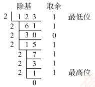
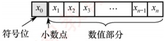
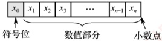

## 2.1 数制与编码

### 2.1.1 进位计数制及其相互转换

### 考点追踪采用二进制编码的原因（2018）

在计算机系统内部，所有信息均采用二进制进行编码，主要原因如下。

1）二进制只有两个状态，只需使用具有两种稳定物理状态的器件即可表示每一位，硬件实现成本较低。例如，可用高电平和低电平分别表示1和0。

2）二进制的 1 和 0 恰好对应逻辑值 “真” 与 “假”，为计算机实现逻辑运算和程序中的条件判断提供了直接支持。
3）二进制的运算规则极为简单，可通过基本的逻辑门电路高效实现各类算术与逻辑操作。

#### 1. 进位计数制

常用的进位计数制包括十进制、二进制、八进制和十六进制。十进制是日常生活中最常用的计数制，而计算机内部主要使用二进制，并常借助八进制和十六进制来简化表示。

在进位计数制中，基数是指每个数位所能使用的不同数码的个数。例如，十进制的基数为10（数码为0～9），计数时遵循“逢十进一”的规则。以十进制数101为例，百位的1表示100，个位的1表示1，二者数值不同，是因为每一位的实际值等于该数码乘以其所在位置的位权。一个进位制数的数值，等于各位数码与其位权的乘积之和。

一个 r 进制数（ $K_{n}K_{n-1}\ldots K_{0}K_{-1}\ldots K_{-m}$）的数值可表示为

 $$K_{n}r^{n}+K_{n-1}r^{n-1}+\cdots+K_{0}r^{0}+K_{-1}r^{-1}+\cdots+K_{-m}r^{-m}=\sum_{i=n}^{-m}K_{i}r^{i}$$

式中，r 是基数； $r^j$ 是第 i 位的位权； $K_i$ 是第 i 位的数码，取值范围为  $0, 1, \cdots, r-1$。

1）二进制。基数为2，数码为0和1，计数“逢二进一”。第i位的位权为 $2^{i}$。

2）八进制。基数为8，数码为0～7，计数“逢八进一”。由于 $8=2^{3}$，每3位二进制数恰好对应1位八进制数，两者转换十分便捷。

3）十六进制。基数为16，数码为0～9和A～F（A～F分别代表10～15），计数“逢十六进一”。由于 $16=2^{4}$，每4位二进制数对应1位十六进制数，转换同样便捷。

为便于区分，常在数字后添加后缀字母来标识进制：B 表示二进制数，O 表示八进制数，D 表示十进制数（通常省略），H 表示十六进制数；此外，也常用前缀 0x 表示十六进制数。

#### 2. 不同进制数之间的相互转换

##### （1）二进制数转换为八进制数和十六进制数

对于一个既有整数部分又有小数部分的二进制数，转换时以小数点为界分别处理：整数部分，从小数点向左，每3位（八进制）或每4位（十六进制）分为一组，若最左侧不足3位或4位，则在高位补0；小数部分，从小数点向右，同样每3位或4位分为一组，若最右侧不足，则在低位补0。分组完成后，将每组直接替换为对应的八进制或十六进制数码即可。

【例2.1】将二进制数1111000010.01101转换为八进制数和十六进制数。

解：

 $$\begin{aligned}& 高位补 0, 凑足 3 位 & 分界点 & 低位补 0, 凑足 3 位 \\&\quad\downarrow&&\downarrow\quad\downarrow\\&\quad\frac{001}{1}\quad\frac{111}{7}\quad\frac{000}{0}\quad\frac{010}{2}\quad\cdot&\quad\frac{011}{3}\quad\frac{010}{2}\end{aligned}$$

所以，对应的八进制数为(1702.32) $_{8}$。

 $$\begin{aligned}& 高位补 0, 凑足 4 位 & 分界点 & 低位补 0, 凑足 4 位 \\&\quad\downarrow&&\downarrow\quad\downarrow\\&\quad\frac{0011}{3}\quad\frac{1100}{C}\quad\frac{0010}{2}\quad\cdot&\quad\frac{0110}{6}\quad\frac{1000}{8}\end{aligned}$$

所以，对应的十六进制数为(3C2.68) $_{16}$。

反之，将八进制数或十六进制数转换为二进制数时，只需将每位数码分别替换为对应的3位或4位二进制数（必要时去掉整数最高位或小数最低位的0）。八进制数与十六进制数之间的转换，通常先转换为二进制数，再转为目标进制，这是最直接且不易出错的方式。

##### （2）任意进制数转换为十进制数

采用按权展开相加法：将各位数码与其对应位权（基数的幂次）相乘，再求和。

 $$例如 ,(11011.1)_{2}=1\times2^{4}+1\times2^{3}+0\times2^{2}+1\times2^{1}+1\times2^{0}+1\times2^{-1}=27.5\text{。}$$
##### （3） 十进制数转换为任意进制数

### 考点追踪 十进制小数转换为二进制小数（2021、2022）

通常采用基数乘除法，对整数部分和小数部分分别处理：

1）整数部分使用除基取余法：不断除以目标进制的基数，记录余数，直至商为0；最先得到的余数为最低位，最后得到的为最高位。

2）小数部分使用乘基取整法：不断乘以基数，记录整数部分，直至小数部分为0或达到所需精度。最先得到的整数为最高位，最后得到的为最低位。

最终将两部分的转换结果拼接，即得到目标进制数。

【例2.2】将十进制数123.6875转换为二进制数。

解：

整数部分（除2取余）：



所以，整数部分 123 = (1111011)_{2}。

小数部分（乘2取整）：

 $$\begin{array}{ccc}\frac{ 乘基 }{x}&0.6875& 取整 \\ \frac{1.3750}{0.3750}&1& 最高位 \\\frac{x}{0.7500}&\quad0&\\\frac{x}{1.5000}&\quad1&\\0.5000&\quad2&\\\frac{x}{1.0000}&\quad1& 最低位 \\\end{array}$$
```c

所以，小数部分 0.6875= (0.1011)_{2}，因此，123.6875= (1111011.1011)_{2}。
```

**注意**

关于除基取余法和乘基取整法的原理，建议结合 r 进制数的数值定义公式理解，避免死记硬背。并非所有十进制小数都能用有限位二进制小数精确表示。一个十进制小数能被有限位二进制精确表示，当且仅当它可以表示成形如 k/2" 的分数。例如，0.3 = 3/10，而 10 不是 2 的幂（其质因数包含 5），因此无法用有限位二进制精确表示。相反，任何有限位二进制小数都对应一个分母为 2 的幂的分数，因此总能精确地转换为十进制小数。这一特性在浮点数的表示与运算中尤为重要，需特别注意。

### 2.1.2 定点数的编码表示

#### 1. 真值和机器数

在日常生活中，数通常用“+”或“-”号表示正负（正号常省略），如+15、-8。这类带有符号的数称为真值，即机器数所代表的实际数值。在计算机中，数的符号与数值部分一同编码：通常用“0”表示正，“1”表示负。这种将符号数字化的表示形式称为机器数。

例如，机器数 0,101（逗号仅用于分隔符号位与数值位）表示真值+5。
#### 2. 机器数的定点表示

根据小数点位置是否固定，计算机中的数值表示分为定点表示和浮点表示。

定点表示用于表示定点小数和定点整数。

1）定点小数。表示纯小数，约定小数点位于符号位之后、数值部分最高位之前。若数据  $X = x_0 x_1 x_2 \ldots x_n$（其中  $x_0$ 为符号位， $x_1 \sim x_n$ 为数值位， $x_1$ 为最高有效位），其在计算机中的表示形式如图2.1所示。

2）定点整数。表示纯整数，约定小数点位于数值部分最低位之后。若数据  $X = x_0 x_1 x_2 \ldots x_n$（其中  $x_0$ 为符号位， $x_1 \sim x_n$ 为数值位， $x_n$ 为最低有效位），其表示形式如图2.2所示。





图2.1 定点小数表示

图2.2 定点整数表示

事实上，在机器内部并没有小数点，只是人为约定了小数点的位置。因此，在定点数的编码和运算中，无须区分该数表示的是小数还是整数，而只需关心符号位和数值位即可。

定点数的编码表示法主要有四种：原码、补码、反码和移码。

#### 3. 原码、补码、反码、移码

##### （1）原码表示法

用机器数的最高位表示数的符号，其余各位表示数的绝对值。原码的定义如下。

 $$\left[x\right]_{ 原 }=\left\{\begin{aligned}&0,x,&0\leqslant x<2^{n}\\ &2^{n}-x=2^{n}+\left|x\right|,&\quad-2^{n}<x\leqslant0\end{aligned}\right.\quad(x 是真值 , 字长为 n+1)$$

例如，若字长为 8 位， $x_1 = +1110$， $x_2 = -1110$，则其原码表示分别为  $[x_1]$ 原 = 0,0001110， $[x_2]$ 原 =  $2^7 + 1110 = 1$,0001110。

对于  $n+1$ 位原码整数，其表示范围为  $-(2^n - 1) \leq x \leq 2^n - 1$（关于原点对称）。

**注意**
```c

零的原码表示有正零和负零两种形式，即 [+0]_{原}=0,0000000 和  [-0]_{原}=1,0000000。
```

原码表示的优点：①与真值的对应关系简单、直观，转换简便；②用原码实现乘除运算比较简便。缺点：①零的表示不唯一，存在 $\pm0$两种编码；②用原码实现加减运算比较复杂。

##### （2） 补码表示法

补码表示法的加法和减法运算均可通过加法器统一实现。正数的补码与原码相同，负数的补码等于模 $(n+1$位补码的模为 $2^{n+1}$)与该负数绝对值之差。补码的定义如下。

 $$\left[x\right]_{ 补 }=\left\{\begin{aligned}&0,x,&0\leqslant x<2^{n}\\ &2^{n+1}+x=2^{n+1}-\left|x\right|,&-2^{n}\leqslant x<0\end{aligned}\right.\quad(mod2^{n+1})$$

等价地，无论是正数还是负数， [x]_{\text{补}} = 2^{n+1} + x（ $-2^n \leq x < 2^n$， $\text{mod } 2^{n+1}$）。

例如，若字长为 8 位， $x_1 = +1010$， $x_2 = -1101$，则其补码表示分别为  [x_1]_{\text{补}} = \mathbf{0}, 0001010， [x_2]_{\text{补}} = 2^8 - |x_2| = \mathbf{1}, 1110011。

### 考点追踪 补码的表示范围（2010、2013、2014、2022）

对于  $n+1$ 位补码整数，其表示范围为  $-2^n \leq x \leq 2^n - 1$（比原码多表示一个负数，即  $-2^n$）。

• 几个特殊值的补码（n+1位）：
```c
1） [+0]_{\text{补}} = [-0]_{\text{补}} = 0,00...0（全0），零的补码表示是唯一的。
```

2） [-1]_{\text{补}} = 2^{n+1} - 1 = 1, 1, 1, \ldots, 1（全1）。

3）最大正整数： [2^n - 1]_{\text{补}} = 0, 11 \ldots 1（符号位为0，数值位全1）。

4）最小负整数： $[-2^n]_{\mathbb{K}} = 1,00...0$（符号位为1，数值位全0）。

#### 模运算（了解）

在模运算中，一个数与它除以“模”后得到的余数是等价的。如 $A$、$B$、$M$ 满足 $A = B + K \times M$ ($K$ 为整数)，记为 $A \equiv B (\mathrm{mod} M)$，即 $A$、$B$ 各除以 $M$ 后的余数相同。在补码运算中， [A]_{\text{补}} - [B]_{\text{补}} = [A]_{\text{补}} + M - [B]_{\text{补}}，而 M - [B]_{\text{补}} = [-B]_{\text{补}}，因此补码能够借助加法运算实现减法运算。

• 补码与真值之间的转换

### 考点追踪 补码和真值的相互转换（2020、2023）

真值转换为补码：对于正数，与原码的方式一样。对于负数，符号位取1，其余各位由其绝对值“按位取反，末位加1”得到。补码转换为真值：若符号位为0，则直接读作正数。若符号位为1，则真值为负数，其绝对值由补码数值部分“按位取反，末位加1”得到。

#### 变形补码

为便于溢出检测，可采用双符号位的补码表示（又称变形补码），双符号位00表示正数，11表示负数。若总位数为 $n+2$（高2位为符号位，其余为数值位），则变形补码定义为

 $$\left[x\right]_{ 变补 }=\left\{\begin{aligned}&00,x,&0\leqslant x<2^{n}\\ &2^{n+2}+x=2^{n+2}-\left|x\right|,&-2^{n}\leqslant x<0\end{aligned}\right.\quad(mod2^{n+2})$$

在双符号位中，左符表示真正的符号位，右符用于判断“溢出”。

##### （3） 反码表示法（了解即可）

反码可视为从原码转换为补码的中间表示形式。

正数的反码与其原码相同。负数的反码由其原码的数值部分按位取反（末位不加1）得到。

反码表示存在明显不足：①零的表示不唯一（存在 $\pm0$两种编码）；②表示范围与相同字长的原码相同，比补码少一个最小负数 $(-2^{n})$。因此，反码在计算机中极少使用。

##### （4） 移码表示法

移码主要用于表示浮点数的阶码，且用于表示整数。其核心思想是将真值 x 加上一个固定偏置值，实现数轴整体右移。设字长为  $n+1$ 位，偏置值通常取  $2^n$，则移码定义为

 $$[x]_{ 移 }=2^{n}+x\qquad(-2^{n}\leqslant x<2^{n})$$

**注意**

在 IEEE 754 标准的浮点数中，k 位阶码的偏置值为  $2^{k-1}-1$，如 8 位阶码的偏置值为 127。

例如，若字长为8位，偏置值为 $2^7$， $x_1 = +10101$， $x_2 = -10101$，则其移码表示分别为 [x_1]_{\text{移}} = 2^7 + 10101 = 1,0010101； [x_2]_{\text{移}} = 2^7 + (-10101) = 0,1101011。

移码（设字长为  $n+1$，偏置值为  $2^{n}$）的主要特点如下：
```c

① 零的表示唯一， [+0]_{移}=2^{n}+0=[-0]_{移}=2^{n}-0=1,00...0（n个0）。
```

②在相同字长下，移码与补码仅符号位相反（将补码的最高位取反即得移码）。

③ 移码全 0 时，对应真值的最小值 -2^{n}；移码全 1 时，对应真值的最大值 2^{n}-1。

④ 移码保持真值的大小顺序：移码值越大，对应真值越大，便于阶码比较。

四种编码表示的总结如下：

### 考点追踪 补码大小的判断（2015）

① 正数的原码、反码、补码相同；移码则不同。
②原码与反码在数轴上关于原点对称，二者都存在+0与-0。

③补码与移码的表示不对称，零的表示唯一，且比原码和反码多表示一个负数 $(-2^{n})$。

④原码可直观的比较小（因数值部分即绝对值），而负数的补码和反码不能像原码那样直观判断。不过，在同为负数的前提下，补码或反码的数值部分越大，其真值也越大。

### 2.1.3 整数的表示

#### 1. 无符号整数的表示

### 考点追踪 机器码与补码、无符号数之间的转换（2021）

当所有二进制位均用于表示数值（无符号位）时，该编码称为无符号整数，简称无符号数。此时，数值隐含为非负整数。由于无须保留符号位，在相同字长下，无符号整数能表示的最大值大于有符号整数。无符号整数适用于仅涉及非负整数且结果不会产生负值的场景。例如，可用无符号整数进行地址运算，或用它来表示指针。

例如，8位无符号整数的最小值为00000000（0），最大值为111111111（ $2^8 - 1 = 255$），表示范围为0～255；而8位有符号整数（补码表示）的最小值为10000000（-2^7 = -128），最大值为011111111（ $2^7 - 1 = 127$），表示范围为-128～127。

#### 2. 有符号整数的表示

有符号整数通过在数值位前增设一位符号位（0表示正，1表示负）来表示正负。虽然原码、反码和补码均可用于表示有符号整数，但现代计算机统一采用补码，因其具有以下优势：

① 零的表示唯一（无+0与-0之分）。

② 符号位可与数值位一同参与运算，使加减法统一为加法操作。

③ 表示范围更大，比原码和反码多表示一个最小负数。

因此，n 位有符号整数（补码）的表示范围为  $-2^{n-1} \sim 2^{n-1} - 1$。

### 2.1.4 C 语言中的整数类型及类型转换

统考大纲要求考生具备分析高级程序设计语言（如C语言）中相关问题的能力，其中变量之间的类型转换是高频考点，需要深入掌握。

#### 1. C 语言中的整型数据类型

### 考点追踪 int 型数据的表示范围（2017、2019、2024）

C 语言提供了多种整型类型，其具体长度依赖于编译器和目标平台。常见情况如下：

• 短整型：short（或 short int），通常为 16 位。

- 整型：int，通常为 32 位。

长整型：long（或 long int），在 32 位系统中为 32 位，在 64 位系统中通常为 64 位。

在上述类型前添加 unsigned 关键字，可定义对应的无符号类型（如 unsigned int、unsigned short 等）。若未显式指定 signed 或 unsigned，则默认为有符号类型。

字符型（char，通常为8位）是一种特殊的整型，通常可按无符号整数解释。

在现代系统中，所有有符号整型均以补码形式存储。无符号整型则将全部位用于表示非负数值。因此，在相同位宽下，两者的取值范围不同。

#### 2. 整型数据的类型转换

定点数在类型转换过程中，若涉及字长变化，则会触发两种基本操作：位截断与位扩展。

1）位截断：当长类型转换为短类型时，系统直接丢弃高位，仅保留低位部分。由于目标类型的表示范围较小，截断可能导致数值发生变化，具有较强的隐蔽性。
### 考点追踪 零扩展和符号扩展的应用（2012、2021、2024）

2）位扩展：当短类型转换为长类型时，系统通过填充高位来保持数值语义不变。具体扩展的方式取决于源数据的符号性：

零扩展：用于无符号数，在高位补0。

· 符号扩展：用于补码表示的有符号数，高位重复填充符号位。

C 语言支持通过强制类型转换实现不同类型间的转换，其语法为 “TYPE b = (TYPE) a”，转换结果是一个 TYPE 类型的值。根据源类型与目标类型的字长和符号性，可分为三种情形。

### 考点追踪 整型类型的相互转换（2011、2016、2019、2024）

（1）长类型转换为短类型：位截断

转换规则：保留低位，丢弃高位。

考虑如下代码片段：

```c
int x=165537, u=-34991; //int 型为 32 位
short y=(short)x, v=(short)u; //short 型为 16 位
printf("x=%d, y=%d\n", x, y);
printf("u=%d, v=%d\n", u, v);
```

运行结果如下：

x=165537, y=-31071
u=-34991, v=30545

其中，x, y, u, v 的十六进制表示分别为 0x000286A1, 0x86A1, 0xFFFF7751, 0x7751。可见，当长类型转换为短类型时，系统直接截断高位，仅保留低位部分。由于目标类型的数值范围较小，这种位截断可能导致结果与原值在语义上不一致。由于 x=165537 超出了 16 位有符号整数的最大值（32767），截断后的位模式被解释为 -31071，这并非运算溢出，而是位截断引起的语义变化。需要注意的是，此类转换不会触发任何异常或错误报告，具有很强的隐蔽性。

（2）相同字长的转换：仅改变解释方式

转换规则：二进制位模式保持不变，仅重新解释其含义。

考虑如下代码片段：

```c
short x=-4321;
unsigned short y=(unsigned short)x;
printf("x=%d, y=%u\n", x, y);
```

运行结果如下：

x=-4321, y=61215

有符号数 x 为负数，而无符号数 y 只能表示非负值。从输出结果看，y 的值似乎与 x 毫无关联；但将二者转换为二进制形式后（见表 2.1），可观察到：short 型强制转换为 unsigned short 型后，所有二进制位均保持不变，x 按补码规则解释为有符号数，而 y 则按无符号规则解读。

表2.1 y与x的位级表示对比

| 变量 | 值 | 二进制位 |   |   |   |   |   |   |   |   |   |   |   |   |   |   |   |
| --- | --- | --- | --- | --- | --- | --- | --- | --- | --- | --- | --- | --- | --- | --- | --- | --- | --- |
|   |   | 15 | 14 | 13 | 12 | 11 | 10 | 9 | 8 | 7 | 6 | 5 | 4 | 3 | 2 | 1 | 0 |
| x | -4321 | 1 | 1 | 1 | 0 | 1 | 1 | 1 | 1 | 0 | 0 | 0 | 1 | 1 | 1 | 1 | 1 |
| y | 61215 | 1 | 1 | 1 | 0 | 1 | 1 | 1 | 1 | 0 | 0 | 0 | 1 | 1 | 1 | 1 | 1 |

这表明：相同字长的整型类型转换不改变位模式，仅改变对这些位的解释方式。

（3）短类型转换为长类型：位扩展

转换规则：若源数据为有符号数，则执行符号扩展；若源数据为无符号数，则执行零扩展。考虑如下代码片段：
```c
short x=-4321;
int y=x;
unsigned short u=(unsigned short)x;
unsigned int v=u;
printf("x=%d, y=%d\\n", x, y);
printf("u=%u, v=%u\\n", u, v);
```

运行结果如下：
x=-4321, y=-4321
u=61215, v=61215

其中，x, y, u, v 的十六进制表示分别为 0xEF1F, 0xFFFFEF1F, 0xEF1F, 0x0000EF1F。可见，短类型转换为长类型时，要对高位部分进行扩展，扩展方式取决于源数据的符号性。可见，x 为有符号数，符号位为 1，扩展时高 16 位补 1；u 为无符号数，扩展时高 16 位补 0。
