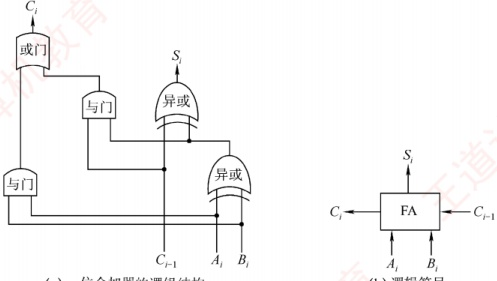
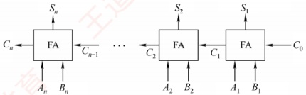
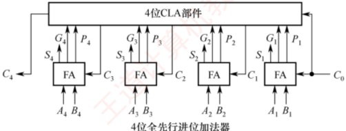
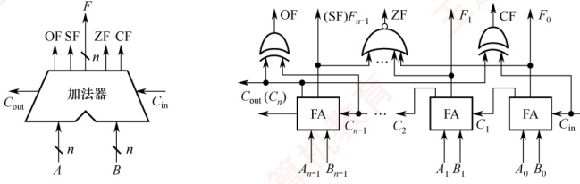
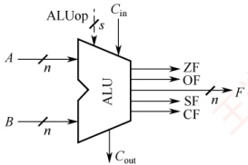
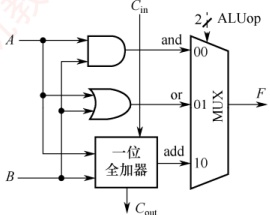
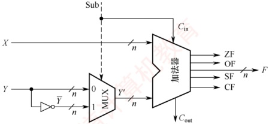
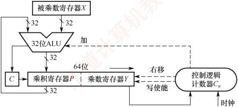
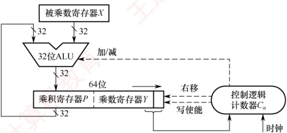
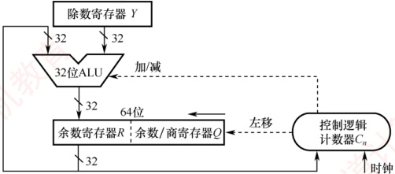

## 2.2 运算方法和运算电路

### 2.2.1 基本运算部件

在计算机中，运算器由算术逻辑单元（Arithmetic Logic Unit，ALU）、移位器、状态寄存器（PSW）和通用寄存器组等组成。运算器的基本功能包括加、减、乘、除四则运算，与、或、非、
异或等逻辑运算，以及移位、求补等操作。ALU的核心部件是加法器。

#### 1. 一位全加器

全加器（FA）是最基本的加法单元，有三个输入：加数  $A_{i}$、加数  $B_{i}$ 与来自低位的进位  $C_{i-1}$，两个输出：本位和  $S_{i}$ 及向高位的进位  $C_{i}$。其逻辑表达式如下。

和表达式： $S_{i}=A_{i}\oplus B_{i}\oplus C_{i-1}$（当 $A_{i}$、 $B_{i}$、 $C_{i-1}$中有奇数个1时， $S_{i}=1$，否则 $S_{i}=0$）

进位表达式： $C_{i}=A_{i}B_{i}+(A_{i}\oplus B_{i})C_{i-1}$

一位全加器的逻辑结构如图2.3(a)所示，其逻辑符号如图2.3(b)所示。



(a)一位全加器的逻辑结构

(b) 逻辑符号

图2.3 一位全加器

#### 2. 串行进位加法器

将 n 个全加器级联可构成 n 位串行进位加法器（又称行波进位加法器），如图 2.4 所示。其特点是进位信号逐级传递，每一级的进位输出直接作为下一级的进位输入。



图2.4 n位串行进位加法器

图2.4 中的加法器实现两个 $n$ 位二进制数 $A = A_n A_{n-1} \cdots A_1$ 和 $B = B_n B_{n-1} \cdots B_1$ 逐位相加的功能，得到和 $S = S_n S_{n-1} \cdots S_1$ 及最终进位 $C_{n}$。例如，当 $A = 1111$，$B = 0001$（4位）时，输出 $S = 0000$，$C_4 = 1$。由于位数固定，结果实际为模 $2^n$ 的加法（溢出部分被丢弃）。

在串行进位加法器中，总运算延迟主要由进位信号从最低位传播到最高位的时间决定。位数越多，进位链越长，延迟越大。因此，缩短进位传递路径是提升加法器性能的关键。

#### $^{*}3$. 并行进位加法器

并行进位（也称先行进位）加法器能够显著提升加法运算速度，因为它能以几乎同时生成所有进位信号的方式工作，而非逐级传递进位。为了实现这一目标，n个一位全加器被连接至一个n位先行进位逻辑部件（CLA部件），以便几乎同时生成所有进位信号。因此，并行进位加法器对于较大位数的数据处理效率要高于串行进位加法器。图2.5展示了一个4位全先行进位加法器的例子。随着加法器位数的增加，电路设计复杂度也会相应提高，此处不再详述。



4位全先行进位加法器

图2.5 一个4位全先行进位加法器

#### 4. 带标志加法器

对于 n 位加法器来说，除了得到运算结果外，还要关注加法运算过程中是否发生了溢出、结果的正负性、结果是否为零等，这些信息对于程序的执行控制非常关键。为此，在 n 位加法器的基础上增加了额外的逻辑电路，不仅支持计算和/差，还能生成以下标志位：OF、CF、SF 和 ZF，每个标志占 1 位。图 2.6 展示了用全加器实现 n 位带标志加法器的电路示意图。



(a) 带标志加法器符号

(b) 带标志加法器的逻辑电路

图 2.6 用全加器实现 n 位带标志加法器的电路

在图2.6中，溢出标志OF通过检测最高有效位的进位输入 $C_{n-1}$与进位输出 $C_n$是否不同决定，即 $OF = C_n \oplus C_{n-1}$，用于判断有符号数加法运算是否溢出；OF=1表示溢出，OF=0表示未溢出。符号标志SF等于结果的最高有效位，即 $SF = F_{n-1}$，用于指示有符号数加法运算结果的正负性：SF=0表示结果为正，SF=1表示结果为负。零标志ZF在结果的所有位均为0时设置为1，用于指示加减运算的结果是否为零；ZF=1表示结果为0，ZF=0表示结果非零。进位/借位标志CF用于判断无符号数的加减运算是否发生溢出；CF=1表示溢出，CF=0表示未溢出。

#### 5. 算术逻辑单元（ALU）

ALU 是一种功能较强的组合逻辑电路，能够执行多种算术与逻辑运算。其中，加法和减法由带标志加法器直接完成；乘法和除法则通常通过 ALU 配合控制逻辑，以多次加减和移位的方式迭代实现。此外，ALU 还能执行与、或、非等基本逻辑运算。其基本结构如图 2.7 所示：A 和 B 为两个 n 位操作数输入端， $C_{in}$ 为进位输入端，ALUop 为操作控制信号，用于选择 ALU 执行的具体功能。例如，当 ALUop 选择加法（Add）时，ALU 输出  $A + B + C_{in}$。ALUop 的位数决定了可支持的操作种类数量。例如，3 位 ALUop 最多可支持 8 种不同操作。

图 2.8 展示了一位 ALU 的结构，可完成 “与” “或” “加法” 三种操作。其中，加法由一个全加器实现，逻辑运算由专用门电路并行计算，最终通过多路选择器（MUX）根据 ALUop 选择输出结果。由于有 3 种操作，ALUop 至少需要 2 位。



图2.7 ALU 的基本结构



图2.8 一位 ALU 结构图

### 2.2.2 定点数的移位运算

当计算机中没有乘/除运算电路时，可以通过加法和移位相结合的方法来实现乘/除运算。对于任意二进制整数，左移一位，若未发生溢出，相当于乘以2（类似于十进制数左移一位相当于乘以10）；右移一位，若忽略因移出而舍去的末位尾数，相当于除以2。

根据操作数的类型不同，移位运算可以分为逻辑移位和算术移位。

#### 1. 逻辑移位

### 考点追踪 逻辑移位运算（2018）

逻辑移位将操作数视为无符号整数。逻辑移位的规则：左移时，高位移出，低位补0。若高位的1移出，则发生溢出。右移时，低位移出，高位补0。

例如，4位无符号数0001（+1）左移一位变为0010（+2），相当于乘以2，未溢出；0001（+1）右移一位变为0000（0），相当于除以2并舍弃小数部分。又如，1000（+8）左移一位变为0000（0），相当于乘以2，但结果超出了4位无符号数的表示范围，发生溢出。

#### 2. 算术移位

### 考点追踪 算术移位运算（2012、2017、2018）

算术移位需要考虑符号位的问题，即将操作数视为有符号整数。有符号整数采用补码表示，因此对于有符号整数的移位操作应采用补码算术移位方式。算术移位的规则：左移时，高位移出，低位补0。若移出的高位与原符号位不同（左移后符号位改变），则发生溢出。右移时，低位移出，高位补符号位。若低位的1移出，则影响精度。

例如，4位补码0010（+2）左移一位变为0100（+4），未溢出；1001（-7）左移一位变为0010，符号由负变正，表明发生溢出（因为-14超出了4位补码的表示范围）。又如，1001（-7）右移一位变为1100（-4），保留了符号位，但丢失了最低有效位，影响精度。

### 2.2.3 定点数的加减运算

#### 1. 补码加减运算

### 考点追踪 补码的加减运算（2009、2011、2017、2025）

补码加减运算规则简单，易于硬件实现。补码加减运算的公式如下（设字长为 $n+1$）。

 $$\begin{aligned}&[A+B]_{ 补 }=[A]_{ 补 }+[B]_{ 补 }(mod2^{n+1})\\&[A-B]_{ 补 }=[A]_{ 补 }+[-B]_{ 补 }(mod2^{n+1})\end{aligned}$$

补码运算具有以下特点：

1）按二进制加法规则运算，逢二进一。

2）若做加法，则两个数的补码直接相加；若做减法，则将被减数与减数的负数补码相加。
3）符号位与数值位一同参与运算，结果的符号位由运算自然得出。

4）运算结果自动截断为 $n+1$位（模 $2^{n+1}$），高位进位被丢弃，结果仍为补码形式。
```c

【例 2.3】设字长为 8 位（含 1 位符号位），A = 15，B = 24，求  [A + B]_{\text{补}} 和  [A - B]_{\text{补}}。
```

 $$A=+0001111,B=+0011000； 求得 [A]_{ 补 }=00001111,[B]_{ 补 }=00011000,[-B]_{ 补 }=11101000。则：$$

 $$\left[A+B\right]_{ 补 }=\left[A\right]_{ 补 }+\left[B\right]_{ 补 }=00001111+00011000=00100111，符号位为 0，真值为 +39。$$

 $$[A-B]_{ 补 }=[A]_{ 补 }+[-B]_{ 补 }=00001111+11101000=11110111，符号位为 1，真值为 -9。$$

#### 2. 溢出判别方法

### 考点追踪 补码运算的溢出判断（2010、2011、2014、2018、2021、2025）

补码加减运算仅在同号相加或异号相减时可能发生溢出。例如，两个正数相加结果为负，或一个负数减去一个正数结果为正。常用的溢出判别方法有以下三种。

#### （1） 采用一位符号位

减法运算在机器中是用加法器实现的，因此加法和减法均可统一视为两个补码数相加。溢出仅发生在参与运算的两个数符号相同，而结果符号与之不同的情况下。设参与运算的两个操作数的符号位分别为  $A_{s}$ 和  $B_{s}$，运算结果的符号为  $S_{s}$，则溢出逻辑表达式为

 $$V=A_{\mathrm{s}}B_{\mathrm{s}}\overline{S_{\mathrm{s}}}+\overline{A_{\mathrm{s}}}B_{\mathrm{s}}\overline{S_{\mathrm{s}}}$$

#### （2） 采用一位符号位并结合进位情况

设符号位（最高位）产生的进位为  $C_{n}$，最高数值位（次高位）产生的进位为  $C_{n-1}$。若  $C_{n}$ 与  $C_{n-1}$ 不同，则表示溢出。溢出逻辑表达式为

 $$V=C_{n}\oplus C_{n-1}$$

#### （3） 采用双符号位

使用两个符号位  $S_{s1}S_{s2}$ （ $S_{s1}$ 为高位符号位），若两个符号位不同，则表示溢出。 $S_{s1}S_{s2}$ 的各种情况如下：①  $S_{s1}S_{s2}=00$；表示结果为正数，无溢出。②  $S_{s1}S_{s2}=01$；表示结果正溢出。③  $S_{s1}S_{s2}=10$；表示结果负溢出。④  $S_{s1}S_{s2}=11$；表示结果为负数，无溢出。溢出逻辑表达式为

 $$V=S_{s1}\oplus S_{s2},$$

在上述三种方法中，若 V=0，则表示无溢出；若 V=1，则表示有溢出。

#### 3. 加减运算电路

### 考点追踪 补码加法器的实现原理（2011）

在计算机中，无论是无符号数还是有符号数的加减运算，均采用同一套硬件电路实现，即“一套电路，两种语义”。图2.9所示为一个加减运算部件，其输入端包括两个n位操作数X和Y，以及一个控制信号Sub。其中，Y分成两路：一路直接接入二选一多路选择器（MUX），另一路经n位反相器后接入同一选择器。控制信号Sub不仅决定选择哪一路数据进入加法器，还在执行减法时作为最低位的进位输入。输出端包括n位运算结果F以及各类标志位。



图 2.9 加减运算部件

#### （1） 加法运算的工作原理

无论是无符号数还是补码表示的有符号数，其加法均通过同一加法器电路完成。当执行加法操作时（Sub=0），电路实现过程如下。

输入：X 直接接入加法器的一端；Y 接入 MUX。

控制信号：Sub=0，同时作为加法器的最低位进位输入  $C_{in}=0$

运算：MUX 在 Sub=0 时选择 Y 直接通过，加法器执行  $X + Y + C_{in}(X + Y)$，输出 n 位结果 F 和进位输出  $C_{out}$，并生成状态标志位。

语义解释：

1）若 X、Y 被视为无符号数，则结果  $F=(X+Y)\bmod 2^n$。当  $X+Y \geq 2^n$ 时，产生进位  $C_{\text{out}} = 1$，表示发生无符号溢出；此时，标志  $CF = C_{\text{out}}$ 反映进位状态。
```c

2）若 X、Y 被视为有符号数  [X]_{\text{补}}、 [Y]_{\text{补}} ，则结果  F = [X + Y]_{\text{补}} 。此时，若两个操作数同号而结果异号（如正+正→负），则表示有符号溢出，由溢出标志 OF 指示。
```

#### （2）减法运算的工作原理

无论是无符号数还是补码表示的有符号数，其减法也通过同一加法器电路实现。当执行减法操作时（Sub=1），电路实现过程如下：

输入：X 直接接入加法器的一端；Y 接入 MUX。

控制信号：Sub=1，同时作为加法器的最低位进位输入  $C_{in}=1$

运算：MUX 在 Sub=1 时选择反相后的  $\overline{Y}$ 输出，加法器执行  $X + \overline{Y} + C_{in}(X + \overline{Y} + 1)$，输出 n 位结果 F 和进位输出  $C_{out}$，并生成状态标志位。

语义解释：

1）若 X、Y 被视为无符号数，则该运算等价于计算  $X - Y + 2^{n}$（模  $2^{n}$ 运算） $^{①}$：

$\boldsymbol{X}\geqslant\boldsymbol{Y}$ 时，$X-Y+2^{n}\geqslant2^{n}$，有进位 $C_{\mathrm{out}}=1$，舍去高位后 $F=X-Y$，表示无借位（结果非负）。

• X<Y 时， $0 < X - Y + 2^n < 2^n$，无进位  $C_{\text{out}} = 0$，表示有借位（结果为负，超出  $n$ 位无符号数范围），表示发生无符号溢出。此时，标志  $CF = C_{\text{out}}$ 反映借位状态。
```c

2）若 X、Y 被视为有符号数  [X]_{补}、 [Y]_{补}，则该运算等价于  [X - Y]_{补} = [X]_{补} + [-Y]_{补}：
```

结果 F 即为  [X-Y]_{\text{补}}。

若运算导致结果超出 n 位补码表示范围（例如，正减负得负，或负减正得正），则发生有符号溢出，由溢出标志 OF 指示。

**注意**

运算器本身无法识别所处理的二进制串是有符号数还是无符号数。例如， $0 - 1 = 00...0 + 11...1 = 11...1$，若解释为有符号数，对应值为-1，结果正确；若解释为无符号数，对应值为 $2^n - 1$（n位无符号数的最大值），与数学结果不符。此类易混点是统考极易考查的内容。

#### （3） 各类标志位的含义

### 考点追踪 各类标志位的分析（2011、2018、2022-2024）

可通过状态标志位来区分有符号数与无符号数的运算结果，各类标志位的含义如下。

零标志 ZF：当结果 F=0 时，ZF=1；否则 ZF=0。对无符号数和有符号数均有意义。

溢出标志 OF：用于判断有符号数运算是否发生溢出， $OF = C_{n} \oplus C_{n-1}$（符号位进位与最高数值
位进位的异或）。对无符号数运算无意义。即无法依据 OF 判断无符号数运算是否溢出。例如，无符号加法  $010 + 011 = 101$，虽然 OF = 1，但结果并未溢出。

符号标志 SF：等于结果 F 的最高位（符号位）。仅对有符号数有意义。

### 考点追踪 ▶️ CF 标志位的作用（2024）

进/借位标志 CF：用于表示无符号数运算中的进位/借位情况，判断是否溢出。仅对无符号数有意义。加法（Sub=0）时，CF=1 表示有进位，即发生上溢，CF =  $C_{out}$。减法（Sub=1）时，CF=1 表示有借位，即不够减，CF等于  $C_{out}$ 取反。综合得 CF = Sub ⊕  $C_{out}$。例如，无符号数加法 110 + 011 产生进位；无符号数减法 000 - 111 产生借位，结果均发生溢出（CF=1）。

#### （4） 无符号数大小的比较

在无符号数运算中，零标志 ZF 和进/借位标志 CF 是判断大小关系的关键。设 A 和 B 为两个无符号数，执行运算 A - B 后，根据 ZF 和 CF 的值可判断 A 和 B 的大小。

若  $A=B$。如 A-B=011-011=000，结果为零 ZF=1，无借位 CF=0。

若  $A > B$。如 A - B = 010 - 001 = 001，结果非零 ZF = 0，无借位 CF = 0。

若  $A < B$。如 A - B = 000 - 001 = (1)000 - 001 = 111，结果非零 ZF = 0，有借位 CF = 1。

综上，判断规则如下：当 ZF=1 时（无须检查 CF），说明 A=B；当 ZF=0 且 CF=0 时，说明 A>B；当 CF=1 时（此时 ZF 必为 0，无须额外检查），说明 A<B。

#### （5） 有符号数大小的比较
```c

在有符号数运算中，零标志 ZF、溢出标志 OF 和符号标志 SF 共同用于判断大小关系。设 A 和 B 为两个有符号数，执行运算  [A]_{\text{补}}-[B]_{\text{补}} 后，根据 ZF、OF、SF 的值可判断 A 和 B 的大小。
```

 $$若 A=B。如 [A]_{ 补 }-[B]_{ 补 }=011-011=011+101=(1)000，得 ZF=1，OF=C_{3}\oplus C_{2}=0，SF=0。$$

若  $A > B$。无溢出示例：如  [A]_{\text{补}} - [B]_{\text{补}} = 010 - 001 = 010 + 111 = (1)001，得 ZF = 0，OF = 0，SF = 0；有溢出示例： [A]_{\text{补}} - [B]_{\text{补}} = 011 - 101 = 011 + 011 = 110，得 ZF = 0，OF = 1，SF = 1。

 $000 - 001 = 000 + 111 = 111$，得 ZF = 0，OF = 0，SF = 1。有  [B]_{补} = 101 - 011 = 101 + 101 = (1)010，得 ZF = 0，OF = 1，SF = 0。
```c

出示例： [A]_{\text{补}}-[B]_{\text{补}} = 101 - 011 = 101 + 101 = (1)010，得 ZF = 0，OF = 1，SF = 0。
```

综上，判断规则如下：当 ZF = 1 时，说明 A = B；当 ZF = 0 且 OF = SF（或 OF ⊕ SF = 0）时，说明 A > B；当 ZF = 0 且 OF ≠ SF（或 OF ⊕ SF = 1）时，说明 A < B。

**注意**

当 ZF=0 且未发生溢出时，即 OF=0 时，若 SF=0，则表示结果非负，说明 A > B；当发生溢出时，即 OF=1 时，若 SF=1，则必然是正数减去负数发生溢出导致结果为负，说明 A > B。

当 ZF=0 且未发生溢出时，即 OF=0 时，若 SF=1，则表示结果为负，说明 A<B；当发生溢出时，即 OF=1 时，若 SF=0，则必然是负数减去正数发生溢出导致结果为正，说明 A<B。

#### 4. 原码的加减运算（了解）

在原码加减运算中，需将符号位与数值位分开处理，规则较为复杂，具体如下。

加法规则：遵循“同号求和，异号求差”的原则，先判断两个操作数的符号。具体来说，若符号相同，则数值位相加，结果符号位不变，若数值位相加时最高位产生进位，则发生溢出；若符号不同，则用绝对值较大的数减去绝对值较小的数，结果符号位与绝对值较大的数相同。

减法规则：先将减数的符号取反，再将被减数与符号取反后的减数按原码加法进行运算。
**注意**

由于原码加减法需要先比较两数的绝对值大小，再决定是执行加法还是执行减法，控制逻辑复杂，难以用单一加法器高效实现。因此，现代计算机普遍采用补码进行加减运算，以简化硬件设计。

### 2.2.4 定点数的乘除运算

#### 1. 乘法运算

#### （1） 原码乘法的运算原理

原码乘法的特点是符号位与数值位分别处理，其运算过程分为两步：①乘积的符号位由两个乘数的符号位异或得到；②乘积的数值位是两个乘数绝对值的乘积。数值位的乘法可归结为两个无符号数的相乘。以下是两个无符号数相乘的手算过程。

 $$\begin{aligned}&1\quad1\quad0\quad1\quad 被乘数 \\\times\quad1\quad0\quad1\quad1&\quad 乘数 \\\underline{\quad1\quad1\quad0\quad1\quad}\text{-----}&\quad X\times y_{1}\times2^{0}\quad X\times1\\1\quad0\quad1&\text{-----}&\quad X\times y_{2}\times2^{1}\quad X\times1 左移 1 位 \\0\quad0\quad0&\text{-----}&\quad X\times y_{3}\times2^{2}\quad X\times0 左移 2 位 \\1\quad0\quad1&\text{-----}&\quad X\times y_{4}\times2^{3}\quad X\times1 左移 3 位 \\\underline{1\quad0\quad0\quad1\quad1\quad1\quad1\quad}&\quad(143)\end{aligned}$$

上述过程可写成数学推导形式：

 $$X\times Y=X\times(y_{4}\times2^{3}+y_{3}\times2^{2}+y_{2}\times2^{1}+y_{1}\times2^{0})=\left\{\left[(X\times y_{4})\times2+X\times y_{3}\right]\times2+X\times y_{2}\right\}\times2+X\times y_{1}$$

### 考点追踪 乘法运算的原理及分析（2020、2024）

在硬件实现中，通常采用部分积右移的方式将上述求和过程转换为迭代形式。设乘数  $Y = y_n \cdots$  $y_2 y_1$（其中  $y_1$ 为最低位），定义部分积序列  $P_0, P_1, \cdots, P_n$ 如下：

 $$\begin{aligned}&P_{0}=0\\&P_{1}=(P_{0}+X\times y_{1})\gg1\\&P_{2}=(P_{1}+X\times y_{2})\gg1\\ \end{aligned}$$

 $$P_{n}=(P_{n-1}+X\times y_{n})\gg1$$

其中，“ $\gg1$”表示逻辑右移一位。需要注意的是，这里的右移是位操作的一部分，而非数学上的除法；所有中间结果均在2n位存储空间中保留完整精度。经过n次迭代后，最终得到的2n位部分积 $P_n$即为乘积 $X\times Y$的完整二进制表示。因此，乘法运算可通过加法和移位实现。

为了保证精度，部分积需要使用 2n 位寄存器存储。原码乘法的过程可归纳如下：

① 被乘数和乘数均取绝对值，作为无符号整数参与运算，结果的符号位为  $x_s \oplus y_s$。

② 初始化部分积  $P_{0}=0$，从乘数的最低位  $y_{1}$ 开始，将当前部分积  $P_{i-1}$ 加上  $X \times y_{i}$，然后逻辑右移1位。重复此步骤 n 次，最终所得的 2n 位部分积即为数值乘积。

#### （2）无符号整数的乘法运算电路

### 考点追踪 乘法运算电路中控制逻辑的作用（2020）

图 2.10 展示了一个 32 位无符号数乘法运算器的逻辑结构。该电路采用加法与移位相结合的方法来完成乘法运算，其设计思想源自手算乘法的基本原理。



图 2.10 一个 32 位无符号数乘法运算器的逻辑结构

下面介绍其主要组成部分及其工作原理。

1 ）初始化

被乘数寄存器X：存储32位被乘数X，在整个乘法过程中保持不变。

• 乘数寄存器 Y：初始时存储 32 位乘数 Y。

• 乘积寄存器 P：初始化为 0，用于存放累加的部分积（高 32 位结果）。

计数器  $C_{n}$：初始化为 n（本例为 32），表示需进行 n 次迭代。

2）执行过程（循环n次）

① 判断：将乘数寄存器 Y 的最低位，送入控制逻辑。

② 加法操作：若 Y 的最低位为 1，则将当前部分积 P 加上被乘数 X，并将进位存入进位触发器 C；若 Y 的最低位为 0，则执行空操作。

③移位操作：将C、P和Y视为一个整体，执行一次逻辑右移。具体来说，进位C移入P的最高位；P的最低位移入Y的最高位；Y的最低位被丢弃。

④ 更新计数器：计数器  $C_{n}$ 减 1。若  $C_{n} \neq 0$，则继续下一轮迭代，否则算法结束。

### 考点追踪 ▶️ 无符号数乘法指令的溢出判断（2019、2020）

3 ）结果与溢出判断

最终结果：64位乘积结果存储在寄存器对[P:Y]中，其中P为高32位，Y为低32位。

· 溢出判断：若高 32 位结果 P 不为零，则表明乘积超出了 32 位无符号数的表示范围，发生溢出。此时，处理器将溢出标志 OF 与进位标志 CF 同时置 1。

4 ）溢出处理

溢出处理属于软件层面的操作，通过检查CF或OF标志位即可判断是否发生溢出。若检测到溢出，则可在乘法指令后插入一条溢出自陷指令，自动触发异常处理程序，以处理错误（如报告错误、转为高精度计算等）。对于不要求结果精确性的应用，程序员可选择忽略溢出。

#### （3） 有符号整数的乘法运算电路

有符号整数采用补码表示，其乘法需要同时处理符号与数值。A. D. Booth 提出的 Booth 算法让符号位与数值位统一参与运算，直接生成补码形式的乘积，且对正数和负数一视同仁。

图2.11 所示为32位补码一位乘法器的逻辑结构，其整体架构与图2.10中的无符号乘法器非常相似，主要区别在于控制逻辑。需要说明的是，Booth



图 2.11 32 位补码一位乘法器的逻辑结构

算法的数学推导较为复杂，通常不在考研考查范围内，因此本书仅介绍其实现结构，不深入讨论其背后的原理。

下面介绍其主要组成部分及其工作原理。

1 ）初始化

被乘数寄存器X：存储32位被乘数，在整个乘法过程中保持不变。

• 乘积寄存器 P：初始化为 0，用于存放累加的部分积（高 32 位结果）。

• 乘数寄存器 Y：初始时存储 32 位乘数；在其右侧附加一个辅助位  $y_{-1}$，且初始化为 0。

• 计数器  $C_{n}$：初始化为 n（本例为 32），表示需要进行 n 次迭代。

2 ）执行过程（循环n次）

① 判断：将 Y 的最低位  $y_{0}$ 与辅助位  $y_{-1}$ 组合形成两位二进制码，送入控制逻辑。

② 加减法：若组合为 10，则执行 P = P - X（减去被乘数）；若为 01，则执行 P = P + X（加上被乘数）；若为 00 或 11，则执行空操作（Booth 算法的原理请参见教材）。

③移位：将P、Y和辅助位 $y_{-1}$视为一个整体，执行一次算术右移。具体来说，P的最低位移入Y的最高位；Y的最低位移入辅助位 $y_{-1}$；原辅助位 $y_{-1}$被丢弃。

④ 循环控制：计数器  $C_{n}$ 减 1。若  $C_{n} \neq 0$，则继续下一轮迭代，否则算法结束。

### 考点追踪 ▶ ▶ 有符号数乘法指令的溢出判断（2021）

3 ）结果与溢出判断

最终结果：64位乘积存储在寄存器对[P:Y]中，其中P为高32位，Y为低32位。

· 溢出判断：若高 32 位结果 P 不是低 32 位结果 Y 的符号扩展（P 的所有位不等于 Y 的符号位），则判定为溢出。此时，处理器将溢出标志 OF 与进位标志 CF 同时置 1。

4 ）溢出处理

其溢出处理同样由软件完成。执行有符号乘法指令（如 imul）后，应检查 OF 标志位：若发生溢出，则可通过条件跳转进入错误处理程序，或者利用溢出自陷机制由硬件自动触发异常处理程序，以确保程序的健壮性；若已知操作数不会导致溢出，则也可选择忽略该标志。

#### （4） 乘法运算的三种实现方式

1）迭代式乘法器：即前文所述的经典实现结构，由 ALU、移位器、寄存器和控制逻辑构成。通过多次迭代完成乘法，每次迭代处理一位乘数，若一次 ALU 运算和一次移位各需 1 个时钟周期，则完成 n 位乘法约需 2n 个时钟周期。

2）阵列乘法器：一种全并行的快速乘法器。所有部分积同时生成，并以二维阵列形式组织，再通过加法器网络逐级压缩求和，从而直接得到最终乘积。由于整个数据通路为组合逻辑，在时钟周期足够长的前提下，可在单个时钟周期内完成一次乘法运算。

3）移位-加减法：利用移位与加法（或减法）的组合来模拟乘法运算（例如，乘以13可分解为 $X \ll 3 + X \ll 2 + X$）。该方法的硬件成本最低，但运算速度最慢。

#### 2. 除法运算

在进行定点数除法运算之前，需要先对被除数和除数的取值进行预判，以识别异常或确定结果是否为零。具体规则如下：

1）若被除数为0、除数不为0，或|被除数|＜|除数|，则商为0，余数等于被除数。

2）若被除数不为0、除数为0，则发生“除数为0”异常。

3）若被除数和除数均为0，则发生除法错误异常。

仅当被除数和除数均不为0且|被除数|≥|除数|时，才进入正式的除法计算过程。
#### （1） 无符号整数的除法运算原理

### 考点追踪 除法运算的异常及处理（2025）

无符号整数除法与乘法类似，也是一种基于移位与加减的迭代过程，但流程更为复杂。下面以两个无符号数为例，说明手算除法步骤。

 $$\begin{aligned}0\ 0\ 1\ 0\sqrt{\begin{array}{c}0\ 0\ 1\ 1\ 1\\0\ 0\ 0\ 0\ 1\ 1\ 1\ 1\\0\ 0\ 1\ 0\end{array}}&\quad\begin{array}{l} 商 \ =0\ 1\ 1\ 1=7\\ 被除数 \ X=15=1\ 1111\\=0\ 0\ 0\ 0\ 1\ 111\\ 除数 \ Y=2=0\ 010\\\end{array}\\&\quad\frac{\begin{array}{c}0\ 0\ 1\ 1\\0\ 0\ 1\ 0\\\end{array}}{\begin{array}{c}0\ 0\ 1\ 1\\0\ 0\ 1\ 0\\\end{array}}\\&\quad\frac{\begin{array}{c}0\ 0\ 1\ 0\\0\ 0\ 0\ 1\\\end{array}}{\begin{array}{c}0\ 0\ 1\ 0\\0\ 0\ 0\ 1\\\end{array}}& 余数 =0\ 001=1\end{aligned}$$

在手算二进制除法中，为便于从最高位开始逐位试商，通常按固定位宽书写被除数，并在高位补0（例如将4位的1111写成00001111），这些前导零不改变数值大小。具体步骤如下：

1）取被除数的高 n 位部分（与除数同宽）作为初始部分被除数，与除数相减。若够减，则上商1，并将差值作为中间余数；若不够减，则上商0，中间余数即为该部分被除数。

2）将被除数的下一位“带下来”，拼接到当前余数末尾，形成新的 n 位部分被除数；再与除数相减，确定下一位商。如此重复，直到所有位处理完毕。

于算中在被除数前补0主要是为了便于对齐和观察；硬件设计采用类似的策略，将n位被除数高位补0扩展为2n位，以支持统一的迭代过程。

#### （2）无符号整数的除法运算电路

### 考点追踪 除法运算器的结构（2025）

图 2.12 所示为一个 32 位除法逻辑结构图。为了适应逐位试商的迭代过程，需要将被除数加载到一个 64 位寄存器中（高 32 位为 0，低 32 位为实际被除数）。一般而言，n 位无符号数除法采用一个  $2n$ 位的被除数（高位补 0）除以一个 n 位的除数，产生 n 位的商和 n 位的余数。



图 2.12 一个 32 位除法逻辑结构图

下面介绍其主要组成部分及其工作原理。

1 ）初始化

除数寄存器 Y：存储 n 位除数，在整个除法过程中保持不变。

余数/商寄存器Q：初始时存储n位被除数；在迭代过程中逐步生成n位商。

· 余数寄存器 R：初始化为 0，用于暂存中间余数。

计数器  $C_{n}$：初始化为 n，表示需要执行 n 轮迭代。

异常预检：若除数为0，则立即触发“除零错误”异常，停止除法运算；若被除数＜除数，则商=0，余数=被除数，无须进入执行过程。
2 ）执行过程（循环n次）

① 移位：将 R 与 Q 视为一个整体，执行一次逻辑左移。具体来说，R 的最高位被移出（通常丢弃），Q 的最高位移入 R 的最低位，Q 的最低位空出以接收新商位。

② 试商与减法：计算 $[R]-[Y]$；若结果大于或等于0，则当前商位为1，并将结果（差值）写回R；若结果小于0，则当前商位为0，并执行 $[R]+[Y]$以恢复余数（撤销减法）。

③ 循环控制：计数器  $C_{n}$ 减 1。若  $C_{n} \neq 0$，则继续下一轮迭代，否则算法结束。

3 ）最终结果

最终的n位商存储在寄存器Q中，n位余数存储在寄存器R中。

4 ）异常处理

当检测到 “除数为 0” 时，除法器立即停止运算，并置位 “除零” 异常标志。该异常通常由硬件自动捕获，并通过中断向量表跳转至预设的异常处理程序。

**注意**

两个 n 位无符号数相除不会发生溢出。因为被除数最大为  $2^{n}-1$，最小的非零除数为 1，此时商为最大值，即为  $2^{n}-1$，恰好可用 n 位无符号数表示。

#### （3） 补码除法运算的工作原理

补码作为有符号整数的标准表示形式，其除法运算需要同时处理符号与数值。补码除法让符号位与数值位统一参与运算，商的符号在运算过程中自然生成。对于两个n位补码数相除，被除数需要先进行符号扩展至2n位；若被除数为2n位，除数为n位，则无须扩展。

由于补码除法涉及有符号数的比较、加减和移位，其试商规则要比无符号除法复杂得多。根据考试大纲要求，仅需掌握其基本实现，底层的原理可参见教材。补码除法的硬件结构与图2.11所示的无符号除法电路基本一致，下面结合该图说明其基本工作过程。

### 考点追踪 除法运算器的初始化步骤（2025）

1）初始化：

除数寄存器 Y：存储 n 位除数，在整个除法过程中保持不变。

余数/商寄存器Q：初始时存储n位被除数；在迭代过程中逐步生成n位商。

· 余数寄存器 R：所有位都初始化为被除数的符号位，即完成符号扩展。

计数器  $C_{n}$：初始化为 n，表示需要执行 n 轮迭代。

异常预检：若除数为0，则立即触发“除零错误”异常，停止除法运算；若被除数 | < |除数|，则商=0，余数=被除数，无须进入执行过程。

2）执行过程（循环n次）

①移位：将R与Q视为一个整体，执行一次算术左移。

② 试商与加减：控制逻辑根据[R]与[Y]的关系，发出加法或减法信号以确定当前商位。由于涉及有符号数的恢复机制，具体判定规则较复杂，此处不展开。

③ 循环控制：计数器  $C_{n}$ 减 1。若  $C_{n} \neq 0$，则继续下一轮迭代，否则算法结束。

3 ）最终结果

最终的商存储在 Q 中，余数（符号与被除数相同）存储在 R 中。

4 ）异常处理

当检测到除数为0或发生商溢出时，除法器立即停止运算，并置位相应异常标志，该异常的捕获和处理方式与无符号除法类似。值得注意的是，在两个n位补码除法中，商溢出仅有一种情形：被除数为最大负数 $-2^{n-1}$，且除数为-1，此时结果 $2^{n-1}$无法用n位补码表示。
