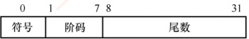
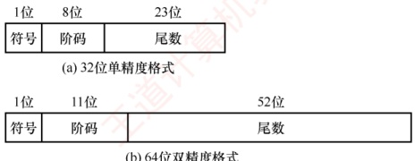
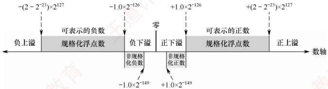
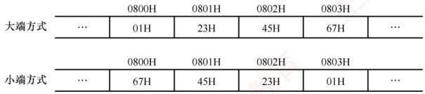
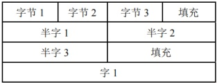
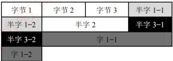
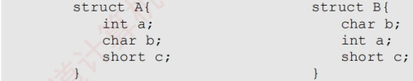

## 2.3 浮点数的表示与运算

浮点数表示法通过将比例因子嵌入数据中，使小数点位置可根据需要浮动。这样，在有限位数下，既能扩大数值的表示范围，又能保持较高的有效精度。例如，用定点数表示电子质量（ $9\times10^{-28}$g）或太阳质量（ $2\times10^{33}$g）极为不便，而浮点数则能高效处理此类极大或极小的数值。

通常，浮点数表示为

 $$N=(-1)^{S}\times M\times R^{E}$$
其中，S（取值 0 或 1）决定浮点数的符号；M 是一个非负的定点小数，称为尾数，通常用原码表示；E 是一个定点整数，称为阶码（或指数），通常采用偏置表示（一种移码形式）。R 是基数（通常隐含约定为 2、4 或 16）。可见，浮点数由符号、尾数和阶码三部分组成。

在 IEEE 754 浮点数标准广泛使用之前，不同计算机所用的浮点数表示格式各不相同。图 2.13 展示了一种典型的 32 位短浮点数格式示例。

图2.13 一种典型的32位浮点数格式示例

其中，第0位为符号S；第1～7位为阶码E，采用偏置值为64的移码表示；第8～31位为24位尾数M，以二进制原码小数表示；基数R为2。在该格式中，阶码的值决定了小数点的实际位置；阶码的位数决定了浮点数的表示范围；尾数的位数则决定了数值的精度。

### 2.3.1 IEEE 754 标准的浮点数

#### 1. IEEE 754 标准的浮点数格式

### 考点追踪 ▶ IEEE 754 单精度数大小的比较（2014）

现代系统普遍采用 IEEE 754 浮点数标准。该标准定义了两种常用格式：32 位单精度浮点数（float 型）和 64 位双精度浮点数（double 型），其基数隐含为 2，其格式如图 2.14 所示。

图 2.14 IEEE 754 标准浮点数的格式

32 位单精度格式包含 1 位符号 s、8 位阶码 e 和 23 位尾数 f；64 位双精度格式包含 1 位符号 s、11 位阶码 e 和 52 位尾数 f。基数隐含为 2；尾数用原码表示。对于规格化的二进制浮点数，尾数的最高位恒为 1。为提升精度，IEEE 754 不显式存储该位，而是将其隐含在小数点之前，称为隐藏位。因此，单精度格式的 23 位尾数实际提供了 24 位有效数字，双精度格式的 52 位尾数实际提供了 53 位有效数字。例如， $(12)_{10} = (1100)_2$，规格化后为  $1.1 \times 2^3$。其中，小数点前的“1”不实际存储，尾数 f 仅保存小数部分“100…0”，而阶码保存的是指数 3 的编码值。

IEEE 754 标准的阶码采用移码表示，但偏置值并不是通常 n 位移码所用的  $2^{n-1}$，而是  $2^{n-1}-1$。因此，单精度和双精度格式的偏置值分别为 127 和 1023。上例中，指数真值为 3，因此在单精度格式中，阶码为  $127+3=130$（82H）；在双精度格式中，阶码为  $1023+3=1026$（402H）。

IEEE 754 标准的规格化单精度浮点数的真值为

 $$(-1)^{s}\times1.f\times2^{e-127}$$

规格化双精度浮点数的真值为

 $$(-1)^{s}\times1.f\times2^{e-1023}$$

其中，规格化单精度浮点数的阶码  $e$ 的取值范围为  $1 \sim 254$（8 位，全 0 和全 1 保留用于特殊值）；规格化双精度浮点数的阶码  $e$ 的取值范围为  $1 \sim 2046$（11 位，保留用途相同）。
#### 2. IEEE 754 格式浮点数的表示范围

### 考点追踪 IEEE 754 浮点数的表示范围和有效位（2017、2018、2024）

IEEE 754 规格化浮点数的表示范围见表2.2。

表2.2 IEEE 754 规格化浮点数的表示范围

| 格式 | 最小值 | 最大值 |
|---|---|---|
| 单精度 | $e=1, f=0$ $1.0 \times 2^{1-127} = 2^{-126}$ | $e=254, f=.111..., 1.111...1 \times 2^{254-127} = 2^{127} \times (2 - 2^{-23})$ |
| 双精度 | $e=1, f=0$ $1.0 \times 2^{1-1023} = 2^{-1022}$ | $e=2046, f=.1111..., 1.111...1 \times 2^{2046-1023} = 2^{1023} \times (2 - 2^{-52})$ |

当浮点运算结果的绝对值超过最大规格化数时，发生上溢（也称溢出），可分为：

• 正上溢：若结果为正且大于最大规格化正数。

· 负上溢：若结果为负且小于最小规格化负数（绝对值过大）。

IEEE 754 对上溢的处理规则：① 将结果设为+∞或-∞；② 置位浮点溢出异常标志，IEEE 754 规定，默认情况下不触发异常中断，程序继续执行，除非显式开启此类异常响应。

当运算结果的绝对值小于最小规格化正数但不为零时，发生下溢，可分为：

正下溢：若结果为正，且处在0到最小规格化正数之间。

负下溢：若结果为负，且处在最大规格化负数到0之间。

对下溢的处理采用渐进下溢机制：① 若结果落在非规格化数可表示范围内，则以非规格化形式存储，保留部分有效精度；② 若结果过于接近零（舍入后为零），则存储为+0或-0，并置位浮点下溢异常标志。同样，默认不响应下溢异常，程序继续运行，除非显式启用异常处理。

IEEE 754 标准的单精度浮点数的表示范围如图 2.15 所示。

图 2.15 IEEE 754 标准的单精度浮点数的表示范围

#### 3. 几种特殊的 IEEE 754 浮点数

### 考点追踪 IEEE 754 标准中的特殊浮点数（2017、2023）

在 IEEE 754 标准中，当阶码全为 0 或全为 1 时，浮点数具有特殊含义，如表 2.3 所示。

表2.3 阶码全为0或全为1时IEEE 754浮点数的解释

| 值的类型 | 单精度（32位） |   |   |   | 双精度（64位） |   |   |   |
| --- | --- | --- | --- | --- | --- | --- | --- | --- |
| 符号 | 阶码 | 尾数 | 值 | 符号 | 阶码 | 尾数 | 值 |   |
| 正零 | 0 | 0 | 0 | 0 | 0 | 0 | 0 | 0 |
| 负零 | 1 | 0 | 0 | -0 | 1 | 0 | 0 | -0 |
| 正无穷大 | 0 | 255（全1） | 0 | ∞ | 0 | 2047（全1） | 0 | ∞ |
| 负无穷大 | 1 | 255（全1） | 0 | -∞ | 1 | 2047（全1） | 0 | -∞ |
| 无定义数（非数） | 0 或 1 | 255（全1） | $f eq 0$ | NaN | 0 或 1 | 2047（全1） | $f eq 0$ | NaN |
| 非规格化正数 | 0 | 0 | $f eq 0$ | $2^{-126}(0, f)$ | 0 | 0 | $f eq 0$ | $2^{-1022}(0, f)$ |
| 非规格化负数 | 1 | 0 | $f eq 0$ | $-2^{-126}(0, f)$ | 1 | 0 | $f eq 0$ | $-2^{-1022}(0, f)$ |

1）全0阶码全0尾数：+0/-0。符号s决定其正负，通常情况下+0和-0是等效的。

2）全1阶码全0尾数： $+\infty/-\infty$。 $+\infty$在数值上大于所有有限数， $-\infty$则小于所有有限数。引入无穷大数的目的是，使程序在溢出等异常情况下仍能继续执行。

3）全1阶码非0尾数：NaN（Not a Number）。表示一个没有定义的数，称为非数。

4）全0阶码非0尾数：非规格化数。非规格化数的特点是阶码为全0，不使用隐藏位，尾数字段不全为0。因此，单精度和双精度浮点数的指数分别为-126和-1022。非规格化数用于实现渐进下溢，填补0与最小规格化数之间的数值间隙。

### 考点追踪 ▶ 实数与 IEEE 754 浮点数的相互转换（2011、2013、2020、2022、2023、2025）

【例2.5】将十进制数-8.25转换为IEEE 754单精度浮点数格式表示。

解：

IEEE 754 单精度浮点数的偏置值是 127；尾数最高位的 “1” 是被隐藏的。

先将-8.25转换为二进制，即-1000.01 = -1.000 01×2³，尾数部分取小数点后的23位（00001后补0至23位）；再计算阶码E，E-127=3，因此E=130，转换为二进制为10000010。

IEEE 754 单精度浮点数格式：符号（1位）+ 阶码（8位）+ 尾数（23位），即为

 $$\begin{array}{l} 1;1000~0010;0000~1000~0000~0000~0000~000 \end{array}$$

因此，其单精度浮点数格式表示为  $1100\,000$  $1\,000$  $0\,100$  $0\,000$  $0\,000$  $0\,000$  $0\,000 = \mathrm{C}104\,000\mathrm{H}$。

【例2.6】求 IEEE 754 单精度浮点数 C640 0000H 的值是多少。

解：

先将 C640 0000H 按二进制展开为

1100 0110 0100 0000 0000 0000 0000 0000

按 IEEE 754 单精度浮点数格式划分：

| 符号 | 阶码 | 尾数 |
| --- | --- | --- |
| 1 | 1000 1100 | 100 0000 0000 0000 0000 0000 |

因此，符号 =1 表示负数；阶码真值为 1000 1100-0111 1111 = (0000 1101) $_{2}$ = 13；尾数真值为  $1 + (0.1)$ $_{2}$ = 1.5（注意，尾数含隐藏位 1）。因此，该单精度浮点数的值为  $-1.5 \times 2^{13}$。

### 2.3.2 浮点数的加减运算

浮点数运算的特点是阶码与尾数分开处理，浮点数加减运算分为以下几个步骤。

### 考点追踪 float型能否通过左移实现乘以2运算（2017）；浮点数的加减运算（2009）

#### 1. 对阶

对阶的目的是使两个操作数的小数点位置对齐，即令它们的阶码相等，以便尾数可以直接相加减。对阶的原则是：小阶向大阶看齐，即将阶码较小的数的尾数右移，右移位数等于两阶码差的绝对值。对于 IEEE 754 标准的浮点数，对阶时需要进行移码减法运算，以求得阶码差。尾数右移时，仅移动数值位，符号位不参与移位；对于规格化数，隐藏位 1 会随尾数右移而进入小数部分，空出的高位补 0。为保证运算精度，移出的低位不应丢弃，而应保留并参与后续尾数运算。

**注意**

若采用大阶向小阶看齐，则需将尾数左移，导致最高有效位被移出，造成不可逆的精度错误。
#### 2. 尾数加减

由于 IEEE 754 标准采用定点原码小数表示尾数，因此尾数加减运算实质上是定点原码小数的加减运算，应根据相应的规则执行。对于规格化数，在运算前还需要将隐藏位还原到尾数部分，形成完整的 1.f 形式。此外，对阶过程中为保持精度而保留的附加位也要参与尾数加减运算。

#### 3. 尾数规格化

为在浮点运算中最大限度保留有效数字，需要对运算结果进行规格化处理。所谓规格化，是指通过调整尾数与阶码，使浮点数的尾数满足最高有效位为1的形式。

IEEE 754 规格化尾数的形式为  $1\times\ldots\times$。尾数相加减后可能出现两类非规格化结果：

 $$1,\times,\ldots,x+1,x\ldots,x=1\times,x\ldots,x$$

 $$1,\times,\ldots\times-1,\times\ldots\times=0.0..01\times\ldots\times$$

1）右规：当结果为  $1 \times \ldots \times$ 时，需要进行右规。尾数每右移一位，阶码加 1。尾数右移时，最高位 1 被移到小数点前一位作为隐藏位，最后一位移出时，要考虑舍入。

2）左规：当结果为  $0.0...01\times... \times$ 时，需要进行左规。尾数每左移一位，阶码减 1。可能需要左规多次，直到将第一位 1 移至小数点左边。

**注意**

① 左规一次相当于乘以2，右规一次相当于除以2；② 需要右规时，只需进行一次。

#### 4. 舍入

在对阶和右规过程中，尾数右移可能导致低位丢失。为保证精度，移出的低位通常被保留用于中间计算。最终结果需通过舍入处理，还原为标准的 IEEE 754 格式。

为此，IEEE 754 引入三个辅助位以指导精确舍入。

1）保护位：紧邻尾数最低有效位之后的第一位，用于初步判断舍入方向。

2）舍入位：位于保护位之后，与保护位和粘滞位共同构成完整的舍入信息。

3）粘滞位：只要舍入位之后被移出的位中存在至少一个1，粘滞位就置为1，否则为0。IEEE 754定义了四种可选的舍入模式。

1）就近舍入（默认方式）：选择最接近真实值的可表示数。若真实值恰好位于两个可表示数的正中间，则选择尾数最低有效位为0的那个（偶数）。具体规则：① 若保护位=0，直接舍去；② 若保护位=1且（舍入位=1或粘滞位=1），则尾数加1；③ 若保护位=1、舍入位=0、粘滞位=0，则在尾数末位为奇数时向其加1，以符合向偶数舍入的要求。例如，运算后得到浮点数的临时尾数  $M_{1}$，舍入过程如下： $M_{1}$

 $$M_{1}=1.\underline{10110011110011001101010}\quad\mathbf{101}$$

注意，下划线部分为保留的23位尾数，其后依次为保护位、舍入位、粘滞位。

由于保护位 = 1、舍入位 = 0、粘滞位 = 1，结果属于非中间值，需要向尾数加 1。加 1 后的 23 位尾数为 1011 0011 1100 1100 1101 011。

若运算后得到临时尾数  $M_{2}$，则舍入过程如下：

 $$M_{2}=1.\underline{10110011110011001101010}\quad\mathbf{100}$$

由于保护位 = 1、舍入位 = 0、粘滞位 = 0，结果恰好位于两个可表示数的正中间。此时尾数最低有效位为偶数，无须加 1。最终的 23 位尾数保持为 1011 0011 1100 1100 1101 010。

2）正向舍入：朝数轴+∞方向舍入，即选择数值更大的可表示数。

3）负向舍入：朝数轴 $-\infty$方向舍入，即选择数值更小的可表示数。
4）截断法：直接截取所需位数，丢弃后面的所有位，实现最为简单。对正数或负数来说，都是选择更接近原点的那个可表示数，也称为朝原点舍入。

#### 5. 溢出判断

### 考点追踪 浮点数运算时的溢出判断（2015）

在尾数规格化或舍入过程中，可能对阶码进行加减操作，因此需要判断指数是否溢出。在IEEE 754中，浮点数的溢出由阶码是否超出可表示范围决定；尾数溢出可通过右规修正，而真正的溢出仅发生在阶码上溢或下溢时。

1）上溢判断。尾数相加后若结果 $\geq$2，或舍入时尾数末位加1引发进位（如 $1.111\cdots+1=10.000\cdots$），则均需右规：尾数右移一位，阶码加1。若原阶码已为最大正规格化值（单精度阶码字段为11111110，对应真值+127），加1后变为11111111（该编码保留用于表示无穷大或NaN），则视为指数上溢，通常会引发异常。

2）下溢判断。左规时尾数左移，阶码减1。若阶码真值减至低于最小正规格化值（单精度-126，双精度-1022），则进入非规格化数范围（阶码字段为0）。若结果进一步小于最小可表示非规格化数（如 $2^{-149}$或 $2^{-1074}$），则视为指数下溢，通常将结果置为机器零。

【例2.7】设x和y为float型变量，x=10.5，y=-120.625，请给出x+y的计算过程。

解：

 $x=10.5=(1010.1)_2=(1.0101)_2\times2^3$。其 IEEE 754 单精度：符号位为 0；阶码为  $3+127=130$，即 1000 0010；机器数（注意隐含尾数最高位）为 0；1000 0010；010 1000 0000 0000 0000 0000。

 $y=-120.625=-(1111000.101)_2=-(1.111000101)_2\times2^6$。其 IEEE 754 单精度：符号位为 1，阶码为  $6+127=133$，即 1000 0101；机器数为 1；1000 0101；111 0001 010 0000 0000 0000。

1）对阶。求阶差  $E_{x}-E_{y}=-3$。故将 x 的尾数右移 3 位，阶码调整为  $E_{y}=133$。对阶后，x 的尾数变为 0.0010 1010 0000 0000 0000 000 000（含保留的附加位），此时无隐藏位。

2）尾数相加。0.0010 1010 0000 0000 0000 0000 0000 + (-1.1110 0010 1000 0000 0000 000) = -1.1011 1000 1000 0000 0000 0000 0000（注意，附加位参与运算，但不会存储）。

3）规格化。尾数相加结果-1.1011100010…×2⁶，已是规格化形式。

4）舍入。单精度尾数保留 23 位，附加位全为 0，按就近舍入规则，直接截断。

因此， $x + y$ 的机器数为 1;1000 0101;1011 1000 1000 0000 0000 000。

其真值为 $-(1.101110001)_2 \times 2^6 = -(1101110.001)_2 = -110.125$。

### 2.3.3 C 语言中的浮点数类型

### 考点追踪 不同类型数据转换后数值的变化（2010）

C 语言中的 float 型和 double 型分别对应 IEEE 754 单精度和双精度浮点数。long double 型通常对应扩展双精度格式，其长度和格式依赖于编译器与目标平台。在 C 语言中，表达式中的赋值、运算或比较操作会触发自动类型转换，常见的转换序列为 char→int→long→double 和 float→double，这些转换通常由范围和精度较低的类型向更高者进行，一般不会丢失信息。

当不同类型的数据混合运算时，遵循类型提升原则：较低类型自动转换为较高类型。例如，long与int运算时，先将int转换为long，然后进行运算，结果为long；float与double运算时，先将float转换为double，结果为double。这类由编译器自动完成的转换称为隐式类型转换。

### 考点追踪 int 和 float 型的精度和范围分析（2017）

1）int 转 float 时，虽然不会发生溢出，但由于 float 尾数（含隐藏位）仅 24 位有效，而 int
为 32 位，当整数值的二进制有效位超过 24 位时，需做舍入处理，导致精度损失。

2）int 或 float 转 double 时，因 double 的有效位更多，通常能精确表示原值。

3）double 转 float 时，一方面 float 的表示范围较小，大数值转换时可能发生溢出；另一方面 float 的尾数有效位变少，高精度数转换时会发生舍入误差。

4）float 或 double 转 int 时，由于 int 没有小数部分，小数部分被直接丢弃（向零截断）；同时，若浮点数值超出 int 的表示范围，则会发生整数溢出。

不同数据类型之间的转换常隐藏不易察觉的精度损失或溢出风险，编程时需格外谨慎。

### 2.3.4 数据的宽度和存储

#### 1. 数据的宽度和单位

在计算机中，比特（bit，也称位，符号为b）是最小的信息单位，表示一个二进制位（0或1）；字节（byte，符号为B）是基本的存储和寻址单位，1字节=8比特。随着信息规模增大，常在B（字节）或b（位）前添加前缀以表示更大的容量，如KB、MB、GB等。在传统计算机系统中，这些前缀通常按2的幂定义，如 $1KB = 2^{10}B = 1024B$。

此外，字（word）也是常用的数据组织单位。它是由体系结构定义的逻辑单位，通常用于表示整数、地址等基本数据类型的宽度，其长度因架构而异，常见的有2、4或8字节。

与字不同，字长（也称机器字长）指 CPU 内部整数运算的数据通路的宽度，通常等于通用寄存器的宽度。字长反映计算机一次能处理的整数数据的位数，是衡量机器性能的重要指标。日常所说的“32 位机”或“64 位机”，其中的 32 或 64 即指字长。例如，在 Intel x86 架构中，自 80386 起字长为 32 位（32 位机），但其体系结构仍将 16 位定义为一个字，32 位称为双字。这表明：字是架构层面的约定，而字长体现的是硬件的实际处理能力。

#### 2. 数据的“大端方式”和“小端方式”存储

在存储数据时，数据从低位到高位可以按从左到右排列，也可以按从右到左排列。因此，不宜用最左或最右来表征数据的最高位或最低位，通常使用最低有效字节（LSB）和最高有效字节（MSB）来分别表示数据的最低位和最高位。例如，在 32 位计算机中，一个 int 型变量 i 的机器数为 01 23 45 67H，其最高有效字节 MSB = 01H，最低有效字节 LSB = 67H。

### 考点追踪 数据的大小端存储（2016、2018、2019、2024、2025）

现代计算机普遍采用字节编址，即每个地址对应1字节。不同类型的数据占用不同字节数（如int和float占4字节，double占8字节），而程序中每个变量仅分配一个起始地址。假设变量i的地址为0800H，那么其4个字节01H、23H、45H、67H将占据连续的4个内存单元。这些字节在内存中的排列方式分为两种（见图2.16）：

图 2.16 采用大端方式和小端方式存储数据

### 考点追踪 根据存放顺序判断大小端方式（2019、2023）

1）大端方式（big endian）：MSB 存储在低地址，LSB 存储在高地址，字节顺序与数值的标准十六进制书写顺序一致。
2）小端方式（little endian）：LSB 存储在低地址，MSB 存储在高地址，字节顺序与标准书写顺序相反。

在分析机器代码时，需特别注意字节顺序。例如，以下是由反汇编器生成的一行代码：

其中，4004d3 是指令地址，01 05 64 94 04 08 是指令的机器码，add eax，0x08049464 是其汇编形式。指令的第二个操作数是立即数 0x08049464，其在内存中按地址递增顺序存储为：64H、94H、04H、08H。由于低地址存放的是 LSB（64H），高地址存放的是 MSB（08H），符合小端方式的特征。将这 4 个字节按小端规则重组，即可得到正确的立即数 0x08049464。因此，在阅读小端机器代码时，需要将连续字节按逆序组合才能还原其逻辑数值。

#### 3. 数据按“边界对齐”方式存储

在字长为32位的系统中，边界对齐要求数据的存储地址是其对齐值（通常等于该类型大小，单位：字节）的整数倍；字节可位于任意地址，半字地址须为2的倍数，字地址须为4的倍数。满足此条件时，CPU可通过一次访存读取完整数据；否则，若数据跨越两个存储单元，则需两次访存并拼接字节，显著降低效率。为满足对齐要求，编译器会在必要时填充空白字节。这种“以空间换时间”的策略虽略微增加内存占用，但能大幅提升访问速度。

例如，数据序列“字节1、字节2、字节3、半字1、半字2、半字3、字1”按边界对齐与非对齐方式存储的格式分别如图2.17和图2.18所示。

图2.17 按边界对齐方式存储

图2.18 按边界不对齐方式存储

### 考点追踪 结构体的小端、边界对齐存储（2012、2020）

C 语言中，struct 型的内存布局遵循以下对齐规则：① 每个成员的起始地址必须是其对齐值的整数倍（例如：char 为 1，short 为 2，int 为 4）；② 整个结构体的大小必须是其最大成员对齐值的整数倍（不足则在尾部填充）。这确保了每个结构体成员的起始地址均满足对齐要求。

先看两个例子（基于32位x86环境，GCC编译器）：

结果却是：sizeof(A) = 8，sizeof(B) = 12。

设 B 从地址 0x0000 开始，成员 b 的对齐值是 1，其存放地址符合 0x0000%1 = 0；成员 a 的对齐值是 4，需对齐到 4 字节边界，故起始于 0x0004，占据 0x0004～0x0007；成员 c 的对齐值是 2，起始于 0x0008，占据 0x0008～0x0009。此外，结构体长度必须是最大对齐值（4）的整数倍，当前大小 10 字节，需填充至 12 字节（0x000A～0x000B）。

设 A 也从地址 0x0000 开始，成员 a 的对齐值是 4，存放在 0x0000～0x0003；成员 b 的对齐值是 1，存放在 0x0004；成员 c 的对齐值是 2，为满足“起始地址%对齐值=0”的条件，只能存放在 0x0006～0x0007，总大小为 8 字节，无须尾部填充。

精简指令集计算机（RISC）普遍采用边界对齐，以支持高效的指令流水线。
