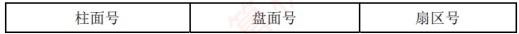

### 3.4.3 本节习题精选

#### 一、 单项选择题

##### 01

下列关于磁盘的说法中，错误的是（）。

A. 本质上，U盘（闪存）是一种只读存储器

B. RAID 技术可以提高磁盘的磁记录密度和磁盘利用率
C. 未格式化的硬盘容量要大于格式化后的实际容量

D. 计算磁盘的存取时间，“寻道时间”和“旋转等待时间”常取其平均值

##### 02

下列关于磁盘驱动器的叙述中，错误的是（）。

A. 送到磁盘驱动器的地址由磁头号、盘面号和扇区号组成

B. 能控制磁头移动到指定磁道，并发回“寻道结束”信号

C. 能控制磁盘片转过指定的扇区，并发回“扇区符合”信号

D. 能控制对指定盘面的指定扇区进行数据的读/写操作

##### 03

下列有关磁盘存储器读/写操作的叙述中，错误的是（）。

A. 最小读/写单位可以是一个扇区

B. 采用直接存储器存取 DMA 方式进行输入/输出

C. 按批处理方式进行一个数据块的读/写

D. 磁盘存储器可与 CPU 交换盘面上的存储信息

##### 04

若磁盘的转速提高一倍，则（）。

A. 平均寻道时间减少一半

B. 存取速度也提高一倍

C. 平均旋转等待时间减少一半

D. 不影响磁盘传输速率

##### 05

下列关于固态硬盘（SSD）的叙述中，不正确的是（）。

A. 固态硬盘的读/写是以页为单位的

B. 固态硬盘的擦除是以页为单位的

C. 固态硬盘的写入速度比读取速度慢很多

D. 固态硬盘的写入次数有限，引入磨损均衡可以延长使用

##### 06

下列关于固态硬盘（SSD）的说法中，错误的是（）。

A. 基于闪存的存储技术

B. 随机读/写性能明显高于磁盘

C. 随机写比较慢

D. 读/写速度快，常用作主存

##### 07

一个磁盘的转速为 7200 转/分，每个磁道有 160 个扇区，每个扇区有 512 字节，则在理想情况下，磁盘每秒传输的数据量是（）。

A.  $7200 \times 160$KB    B. 7200KB    C. 9600KB    D. 19200KB

##### 08

某磁盘盘面共有 200 个磁道，盘面总存储容量为 60MB，磁盘旋转一周的时间为 25ms，每个磁道有 8 个扇区，各扇区之间有一间隙，磁头通过每个间隙需 1.25ms。则磁盘接口所需的最大传输速率是（）。

A. 10MB/s B. 60MB/s C. 83.3MB/s D. 20MB/s

##### 09

【2013 统考真题】某磁盘的转速为 10000 转/分，平均寻道时间是 6ms，磁盘传输速率是 20MB/s，磁盘控制器延迟为 0.2ms，读取一个 4KB 的扇区所需的平均时间约为（）。

A. 9ms

B. 9.4ms

C. 12ms

D. 12.4ms

##### 10

【2013 统考真题】下列选项中，用于提高 RAID 可靠性的措施有（）。

I. 磁盘镜像 II. 条带化 III. 奇偶校验 IV. 增加 Cache 机制

A. 仅 I、II B. 仅 I、III C. 仅 I、III 和 IV D. 仅 II、III 和 IV

##### 11

【2015 统考真题】若磁盘转速为 7200 转/分，平均寻道时间为 8ms，每个磁道包含 1000 个扇区，则访问一个扇区的平均存取时间大约是（）。

A. 8.1ms

B. 12.2ms

C. 16.3ms

D. 20.5ms

##### 12

【2019 统考真题】下列关于磁盘存储器的叙述中，错误的是（）。
A. 磁盘的格式化容量比非格式化容量小

B. 扇区中包含数据、地址和校验等信息

C. 磁盘存储器的最小读/写单位为 1 字节

D. 磁盘存储器由磁盘控制器、磁盘驱动器和盘片组成

#### 二、 综合应用题

##### 01

某个硬磁盘共有4个记录面，存储区域内半径为10cm，外半径为15.5cm，道密度为60道/cm，外层位密度为600bit/cm，转速为6000转/分。

1）硬磁盘的磁道总数是多少？

2）硬磁盘的容量是多少？

3）将长度超过一个磁道容量的文件记录在同一个柱面上是否合理？

4）采用定长数据块记录格式，直接寻址的最小单位是什么？寻址命令中磁盘地址如何表示？

5）假定每个扇区的容量为 512B，每个磁道有 12 个扇区，寻道的平均等待时间为 10.5ms，试计算磁盘平均存取一个扇区的时间。

### 3.4.4 答案与解析

#### 一、 单项选择题

##### 01

B

闪存是在 E^{2}PROM 的基础上发展起来的，本质上是只读存储器。RAID 将多个物理盘组成像单个逻辑盘，不会影响磁记录密度，也不可能提高磁盘利用率。在磁盘的格式化过程中，要对磁盘划分扇区，每个扇区要写入一些控制信息，扇区尾部还要留有一定的空隙，这些均需占用一些存储空间，因此导致格式化后的实际容量比非格式化的容量要小。

##### 02

A

因为每个盘面对应一个磁头，所以盘面号和磁头号是同一个概念，显然 A 的说法是错误的，磁盘地址应该由磁道号（柱面号）、磁头号（盘面号）和扇区号组成。

##### 03

D

磁盘存储器以成批（组）方式进行数据读/写，CPU中没有那么多通用寄存器用于存放交换的数据，且磁盘与通用寄存器的传输速率相差过大，因此磁盘存储器通常直接和主存交换信息。

##### 04

C

磁盘存取的步骤为：启动磁头、寻找磁道（寻道时间）、查找扇区（旋转等待时间）、传输数据，转速提高对寻道时间无影响；存取速度取决于所有步骤的时间，虽然会提高，但不会提高一倍；平均旋转等待时间为旋转半圈的时间，因此会减少一半；转速提高则传输速率也提高。

##### 05

B

固态硬盘的擦除以块为单位，读/写以页为单位，选项 B 错误。固态硬盘的写入速度比读取速度要慢很多，因为在写入时需要擦除，且写入次数有限，否则相应块就会因为磨损而无法再次写入。

##### 06

D

固态硬盘基于闪存技术，没有机械部件，随机读/写不需要机械操作，因此速度明显高于磁盘，选项A和B正确。选项C已在考点讲解中解释过。SSD常用作外存而非主存，选项D错误。
##### 07

C

磁盘的转速为 7200 转/分 = 120 转/秒，转一圈经过 160 个扇区，每个扇区为 512B，所以磁盘每秒传输的数据量为  $120 \times 160 \times 512 / 1024 = 9600$KB。

##### 08

D

每个磁道的容量 = 60MB/200 = 0.3MB，读一个磁道数据的时间等于磁盘旋转一周的时间减去通过扇区间隙的总时间（每个磁道有8个间隙），即 25ms - 1.25ms × 8 = 15ms，数据传输速率 = 0.3MB/15ms = 20MB/s。

##### 09

B

磁盘转速是10000转/分，转一圈的时间为6ms，因此平均查询扇区的时间为3ms，平均寻道时间为6ms，读取4KB扇区信息的时间为 $4KB \div 20MB/s = 0.2ms$，磁盘控制器延迟为0.2ms，总时间为 $3 + 6 + 0.2 + 0.2 = 9.4ms$。

##### 10

B

RAID0 方案是无冗余和无校验的磁盘阵列技术，而 RAID1～RAID5 方案均是加入了冗余（镜像）或校验的磁盘阵列技术。因此，提高 RAID 可靠性的措施主要是对磁盘进行镜像和奇偶校验，其余选项不符合条件。条带化是一种将数据分片，分别存储至不同的磁盘，提高读/写速度的技术。条带化的优点是读/写速度快，缺点是没有冗余，若其中一块磁盘损坏，则数据就会丢失。因此，条带化通常和其他技术如磁盘镜像或奇偶校验结合使用，形成不同的 RAID 级别。

##### 11

B

存取时间 = 寻道时间 + 旋转等待时间 + 传输时间。存取一个扇区的平均旋转等待时间为旋转半周的时间，即 $(60/7200)/2 = 4.17\mathrm{ms}$，传输时间为 $(60/7200)/1000 = 0.01\mathrm{ms}$，因此访问一个扇区的平均存取时间为 $4.17 + 0.01 + 8 = 12.18\mathrm{ms}$，保留一位小数则为12.2ms。

##### 12

C

磁盘存储器的最小读/写单位为一个扇区，即磁盘按块存取。磁盘存储数据之前需要进行格式化，将磁盘分成扇区并写入信息，因此磁盘的格式化容量比非格式化容量小。磁盘扇区中包含数据、地址和校验等信息。磁盘存储器由磁盘控制器、磁盘驱动器和盘片组成。

#### 二、 综合应用题

##### 01

【解答】

1）有效存储区域 = 15.5 - 10 = 5.5cm，道密度 = 60 道/cm，因此每个面为  $60 \times 5.5 = 330$ 道，即有 330 个柱面，因此磁道总数 = 4 × 330 = 1320 个磁道。

2）外层磁道的长度为  $2\pi R = 2 \times 3.14 \times 15.5 = 97.34 \, \text{cm}$。

道信息量 = 600bit/cm×97.34cm = 58404bit = 7300B。

利用 1）的结果，可得磁盘总容量 =7300B×1320 =9636000B（非格式化容量）。

3）若长度超过一个磁道容量的文件，将它记录在同一个柱面上是比较合理的，因为不需要重新寻找磁道，这样数据读/写速度快。

4）采用定长数据块格式，直接寻址的最小单位是一个扇区，每个扇区记录固定字节数目的信息，在定长记录的数据块中，活动头磁盘组的编址方式可用如下格式：

5）读一个扇区中数据所用的时间=找磁道的时间+找扇区的时间+磁头扫过一个扇区的时间。找磁道的时间是指磁头从当前所处磁道运动到目标磁道的时间，一般选用磁头在磁盘径
向方向上移动 1/2 个半径长度所用的时间为平均值来估算，题中给出的是 10.5ms。

找扇区的时间是指磁头从当前所处扇区运动到目标扇区的时间，一般选用磁盘旋转半周所用的时间作为平均值来估算，题中给出磁盘转速为6000转/分，即100转/秒，所以磁盘转一周用时10ms，转半周用时5ms。

题中给出每个磁道有12个扇区，磁头扫过一个扇区用时为10/12=0.83ms，因此磁盘平均存取时间为10.5+5+0.83=16.33ms。
