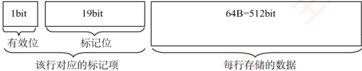
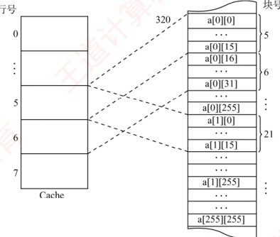
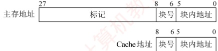

### 3.5.8 本节习题精选

#### 一、 单项选择题

##### 01

在高速缓存系统中，主存容量为 12MB，Cache 容量为 400KB，则该存储系统的容量为（）。

A. 12MB + 400KB

B. 12MB

C. 12MB - 12MB + 400KB

D. 12MB - 400KB

##### 02

访问 Cache 系统失效时，通常不仅主存向 CPU 传送信息，同时还需要将信息写入 Cache，在此过程中传送和写入信息的数据宽度各为（）。

A. 块、页 B. 字、字 C. 字、块 D. 块、块

##### 03

假定用作 Cache 的 SRAM 的存取时间为 2ns，用作主存的 SDRAM 的存取时间为 40ns。为使存储系统的平均存取时间达到 3ns，则 Cache 命中率应达到（ ）左右。

A. 92.5%

B. 85%

C. 97.5%

D. 99.9%

##### 04

关于 Cache 的更新策略，下列说法中正确的是（）。

A. 读操作时，全写法和回写法在命中时应用

B. 写操作时，回写法和写分配法在命中时应用

C. 读操作时，全写法和写分配法在失效时应用

D. 写操作时，写分配法、非写分配法在失效时应用

##### 05

在不同的情况下，需要采用适合的 Cache 写策略。对于下面两种情况：①主要运行访问密集型应用，其中包含写操作；②安全性要求很高，不允许有任何数据不一致的情况发生。适合它们的写策略分别是（）。

A. 回写法，全写法

B. 全写法，回写法

C. 回写法，回写法

D. 全写法，全写法

##### 06

局部性通常有两种不同的形式：时间局部性和空间局部性。程序员是否能编写出高速缓
存友好的代码，就取决于这两方面的问题。对于下面这个函数，说法正确的是（）。

```c
int sumvec(int v[N]) {
    int i, sum=0;
    for (i=0; i<N; i++)
        sum+=v[i];
    return sum;
}
```

A. 对于变量 i 和 sum，循环体具有良好的空间局部性

B. 对于变量 i、sum 和 v[N]，循环体具有良好的空间局部性

C. 对于变量 i 和 sum，循环体具有良好的时间局部性

D. 对于变量 i、sum 和 v[N]，循环体具有良好的时间局部性

##### 07

对于下列代码，以下哪种变化将使其具有更好的空间局部性（）。

```c
① int i, j, k, sum = 0;

② for (i = 0; i < n; i++)

③ for (j = 0; j < n; j++)

④ for (k = 0; k < n; k++)

⑤ sum += a[k] [j] [i];
```

A. 将第 2 行与第 3 行互换

B. 将第 2 行与第 4 行互换

C. 将第 5 行改为 sum += a[i][k][j];

D. 将第 5 行改为 sum += a[j][i][k]

##### 08

下列关于高速缓存 Cache 的描述中，正确的是（）。

A. Cache 的功能全部由硬件实现

B. Cache 替换时的单位为字

C. Cache 与主存统一编址，即主存地址空间的某一部分属于 Cache

D. 无论何时，Cache 中的信息一定与主存中的信息一致

##### 09

下列关于 Cache 的描述中，比较合理的是（）。

Ⅰ. 指令 Cache 通常比数据 Cache 具有更好的空间局部性

Ⅱ. 由于空间局部性，适当增加 Cache 块大小通常会提高命中率

Ⅲ. 回写法的写主存操作次数少于直写法

A. III B. I 和 II C. II 和 III D. I 和 II 和 III

##### 10

假设 Cache 采用 2 路组相联映射方式，Cache 共有 4 行（分为 2 组，每组 2 行），Cache 每行可存放一个主存块。组内采用 LRU 算法进行替换。给定主存块访问序列为

1, 8, 1, 7, 8, 2, 7, 2, 1, 8, 3, 8, 2, 1, 3, 1, 7, 1, 3, 7

若 Cache 初始为空，则该访问序列的 Cache 缺失率为（）。

A. 30% B. 50% C. 40% D. 45%

##### 11

已知某程序运行期间，L1 Cache 的命中率为 94%，而 L2 Cache 的局部命中率（在 L1 不命中情况下的命中率）为 85%。请问该存储系统的全局命中率（CPU 的访存请求最终在 L1 或 L2 中得到满足的比例）是多少？

A. 97.9% B. 98.5% C. 99.1% D. 99.4%

##### 12

假设一个 Cache 中共有 M 块，每 K 块组成一个组，则下列描述中正确的是（）。

A. 若 K=1，则该 Cache 是直接映射 Cache

B. 若 K=1，则该 Cache 是全相联映射 Cache

C. 若 K=M，则该 Cache 是直接映射 Cache

D. 若 K>1 且 K<M，则该 Cache 是 M/K 路组相联映射 Cache

##### 13

在 Cache 中，常用的替换策略有随机（RAND）算法、先进先出（FIFO）算法、近期最少使用（LRU）算法，其中与局部性原理有关的是（）。
A. 随机（RAND）算法

B. 先进先出（FIFO）算法

C. 近期最少使用（LRU）算法

D. 都不是

##### 14

某存储系统中，主存容量是 Cache 容量的 4096 倍，Cache 被分为 64 个块，采用直接映射方式、随机替换算法和全写法，则标记阵列（所有标记信息）的大小应为（）。

A.  $6 \times 4097$ bit B.  $64 \times 12$ bit C.  $6 \times 4096$ bit D.  $64 \times 13$ bit

##### 15

有效容量为 128KB 的 Cache，每块 16B，采用 8 路组相联。字节地址为 1234567H 的单元调入该 Cache，则其标记位字段应为（）。

A. 1234H

B. 2468H

C. 048DH

D. 12345H

##### 16

某个主存-Cache 层的存储器，按字节编址，主存容量为 1MB，Cache 容量为 16KB，每块有 8 个字，每字 32 位，采用直接映射方式，Cache 起始字块为第 0 块，若主存地址为 35301H，且 CPU 访问 Cache 命中，则在 Cache 的第（ ）（十进制表示）字块中。

A. 152 B. 153 C. 154 D. 151

##### 17

对于由高速缓存、主存、硬盘构成的三级存储系统，CPU 直接根据（）进行访问。

A. 高速缓存地址 B. 虚拟地址 C. 主存物理地址 D. 磁盘地址

##### 18

设有 8 页的逻辑空间，每页有 1024B，它们被映射到 32 个物理块中，则按字节编址逻辑地址的有效位是（），物理地址至少是（）位。

A. 10, 12 B. 10, 15 C. 13, 15 D. 13, 12

##### 19

对于 n 路组相联映射 Cache，在保持 n 及主存和 Cache 总容量不变的前提下，将主存块大小和 Cache 块大小都增加一倍，则下列描述中正确的是（）。

A. 字块内地址的位数增加1位，主存标记字段的位数增加1位

B. 字块内地址的位数增加1位，主存标记字段的位数不变

C. 字块内地址的位数减少1位，主存标记字段的位数增加1位

D. 字块内地址的位数增加1倍，主存标记字段的位数减少一半

##### 20

某计算机的 Cache 有 16 行，块大小为 16B，其映射方式可配置为直接映射或 2 路组相联映射，主存按字节编址，主存单元从 0 开始编号。若依次访问下列主存单元，则不论采取上述哪种映射方式都可能引起 Cache 冲突的是（）。

A. 52号和102号单元

B. 48号和308号单元

C. 60号和160号单元

D. 46号和236号单元

##### 21

假设主存地址位数为 32 位，按字节编址，主存和 Cache 之间采用全相联映射方式，主存块大小为 1 个字，每字 32 位，采用回写法（Write Back）方式和随机替换策略，则能存放 32K 字数据的 Cache 的总容量至少应有（）位。

A. 1536K B. 1568K C. 2016K D. 2048K

##### 22

假设主存按字节编址，Cache 共有 64 行，采用 4 路组相联映射方式，主存块大小为 32 字节，所有编号都从 0 开始。则第 2593 号存储单元所在主存块的 Cache 组号是（）。

A. 1 B. 15 C. 14 D. 4

##### 23

假定 CPU 通过存储器总线读取数据的过程为：发送地址和读命令需 1 个时钟周期，存储器准备一个数据需 8 个时钟周期，总线上每传送 1 个数据需 1 个时钟周期。若主存和 Cache 之间交换的主存块大小为 64B，存取宽度和总线宽度都为 8B，则 Cache 的一次缺失损失至少为（ ）个时钟周期。

A. 64 B. 72 C. 80 D. 160

##### 24

假定8个存储器模块采用交叉方式组织，存储芯片和总线支持突发传送，CPU通过存储器总线读取数据的过程为：发送首地址和读命令需1个时钟周期，存储器准备第一个数
据需8个时钟周期，随后每个时钟周期总线上传送1个数据，可连续传送8个数据（突发长度为8）。若主存和Cache之间交换的主存块大小为64B，存取宽度和总线宽度都为8B，则Cache的一次缺失损失至少为（）个时钟周期。

A. 17 B. 20 C. 33 D. 80

##### 25

下列关于 Cache 替换算法的叙述中，错误的是（）。

A. 组相联映射和全相联映射都必须考虑如何进行替换

B. 先进先出算法无须对每个 Cache 行记录替换信息

C. 直接映射是多对一的映射，无须考虑替换问题

D. LRU 算法需要对每个 Cache 行记录替换信息

##### 26

下列关于 Cache 大小、主存块大小和 Cache 缺失率之间关系的叙述中，错误的是（）。

A. 主存块大小和 Cache 容量无直接关系

B. Cache 容量越大，Cache 缺失率越低

C. 主存块大小通常为几十到上百字节

D. 主存块越大，Cache 缺失率越低

##### 27

若计算机按字编址，Cache 数据区容量为 8K 字，主存块大小为 512 字，主存地址空间为 1M 字，采用 2 路组相联映射方式。每次根据主存地址访问 Cache 时，需要同时进行（ ）次标记位的比较，每次需要比较的位数是（ ）。

A. 2,8

B. 2,16

C. 4,8

D. 4,16

##### 28

【2009 统考真题】假设某计算机的存储系统由 Cache 和主存组成，某程序执行过程中访存 1000 次，其中访问 Cache 缺失（未命中）50 次，则 Cache 的命中率是（）。

A. 5% B. 9.5% C. 50% D. 95%

##### 29

【2009 统考真题】某计算机的 Cache 共有 16 块，采用 2 路组相联映射方式（每组 2 块）。每个主存块大小为 32B，按字节编址，主存 129 号单元所在主存块应装入的 Cache 组号是（）。

A. 0 B. 2 C. 4 D. 6

##### 30

【2012 统考真题】假设某计算机按字编址，Cache 有 4 行，Cache 和主存之间交换的块大小为 1 个字。若 Cache 的内容初始为空，采用 2 路组相联映射方式和 LRU 算法，则访问的主存地址依次为 0, 4, 8, 2, 0, 6, 8, 6, 4, 8 时，命中 Cache 的次数是（）。【提示，本题的映射方式与本书所讲的映射方式不同，具体见解析部分的“注意”】

A. 1 B. 2 C. 3 D. 4

##### 31

【2015 统考真题】假定主存地址为 32 位，按字节编址，主存和 Cache 之间采用直接映射方式，主存块大小为 4 个字，每字 32 位，采用回写方式，则能存放 4K 字数据的 Cache 的总容量的位数至少是（）。

A. 146K B. 147K C. 148K D. 158K

##### 32

【2016 统考真题】有如下 C 语言程序段：

```c
for (k=0; k<1000; k++)

    a[k] = a[k]+32;
```

若数组 a 和变量 k 均为 int 型，int 型数据占 4B，数据 Cache 采用直接映射方式，数据区大小为 1KB、块大小为 16B，该程序段执行前 Cache 为空，则该程序段执行过程中访问数组 a 的 Cache 缺失率约为（）。

A. 1.25% B. 2.5% C. 12.5% D. 25%

##### 33

【2017 统考真题】某 C 语言程序段如下：
```c
for (i=0; i<=9; i++) {

    temp=1;

    for (j=0; j<=i; j++) temp*=a[j];

    sum += temp;

}
```

下列关于数组 a 的访问局部性的描述中，正确的是（）。

A. 时间局部性和空间局部性皆有

B. 无时间局部性，有空间局部性

C. 有时间局部性，无空间局部性

D. 时间局部性和空间局部性皆无

##### 34

【2021 统考真题】若计算机主存地址为 32 位，按字节编址，Cache 数据区大小为 32KB，主存块大小为 32B，采用直接映射方式和回写法（Write Back），则 Cache 行的位数至少是（）。

A. 275 B. 274 C. 258 D. 257

##### 35

【2022 统考真题】若计算机主存地址为 32 位，按字节编址，某 Cache 的数据区容量为 32KB，主存块大小为 64B，采用 8 路组相联映射方式，该 Cache 中比较器的个数和位数分别为（）。

A. 8, 20 B. 8, 23 C. 64, 20 D. 64, 23

#### 二、 综合应用题

##### 01

某计算机的主存地址位数为 32 位，按字节编址。假定数据 Cache 中最多存放 128 个主存块，采用 4 路组相联映射方式，块大小为 64B，每块设置了 1 位有效位。采用随机替换算法，写磁盘采用回写法，为此每块设置了 1 位脏位。要求：

1）分别指出主存地址中标记（Tag）、组号（Index）和块内地址（Offset）三部分的位置与位数。

2）计算该数据 Cache 的总位数。

##### 02

某个 Cache 的容量大小为 64KB，行长为 128B，且是 4 路组相联 Cache，主存使用 32 位地址，按字节编址。

1）该 Cache 共有多少行？多少组？

2）该 Cache 的标记阵列中需要有多少标记项？每个标记项中标记位长度是多少？

3）该 Cache 采用 LRU 算法，若当该 Cache 为全写法 Cache 时，标记阵列总共需要多大的存储容量？回写法又该如何？（提示：4 路组相联 Cache 使用 LRU 算法的替换控制位为 2 位。）

##### 03

某计算机有容量为 256B 的数据 Cache，主存块大小为 32B。现有如下 C 语言程序段：

```c
int i,j,c,s,a[128];

...

for (i=0;i<10000;i++)

for (j=0;j<128;j=j+s)

c=a[j];

int 型数据用 32 位补码表示，编译器将变量 i, j, c, s 都分配在通用寄存器中，因此，只需考虑数组元素的访存情况，假定数组起始地址正好在一个主存块的开始。请回答：
```

1）若 Cache 采用直接映射方式，则当 s = 64 和 s = 63 时，缺失率分别为多少？

2）若 Cache 采用 2 路组相联映射方式，则当 s = 64 和 s = 63 时，缺失率分别为多少？

##### 04

【2010 统考真题】某计算机的主存地址空间大小为 256MB，按字节编址。指令 Cache 和数据 Cache 分离，均有 8 个 Cache 行，每个 Cache 行大小为 64B，数据 Cache 采用直接映射方式。现有两个功能相同的程序 A 和 B，其伪代码如下所示：

程序 A: 程序 B:

```c
int a[256][256]; int a[256][256];

...
int sum_array1()
{
    int i, j, sum=0;
    for (i=0; i<256; i++)
        for (j=0; j<256; j++)
            sum += a[i][j];
    return sum;
}
```

假定 int 型数据用 32 位补码表示，程序编译时，i、j 和 sum 均分配在寄存器中，数组 a 按行优先方式存放，其首地址为 320（十进制数）。请回答下列问题，要求说明理由或给出计算过程。

1）不考虑用于 Cache 一致性维护和替换算法的控制位，数据 Cache 的总容量为多少？

1）不考虑用了 Cache 一致性维护和替换算法的控制位，数据 Cache 的总容量为多少？

2）数组元素 a[0][31] 和 a[1][1] 各自所在的主存块对应的 Cache 行号是多少（Cache 行号从 0 开始）？

3）程序 A 和 B 的数据访问命中率各是多少？哪个程序的执行时间更短？

##### 05

【2013 统考真题】某 32 位计算机，CPU 主频为 800MHz，Cache 命中时的 CPI 为 4，Cache 块大小为 32B；主存采用 8 体交叉存储方式，每个体的存储字长为 32 位、存取周期为 40ns；存储器总线宽度为 32 位，总线时钟频率为 200MHz，支持突发传送总线事务。每次读突发传送总线事务的过程包括：传送首地址和命令、存储器准备数据、传送数据。每次突发传送 32B，传送地址或 32 位数据均需要一个总线时钟周期。请回答下列问题，要求给出理由或计算过程。

1）CPU 和总线的时钟周期各为多少？总线的带宽（最大数据传输速率）为多少？

2）Cache 缺失时，需要用几个读突发传送总线事务来完成一个主存块的读取？

3）存储器总线完成一次读突发传送总线事务所需的时间是多少？

4）若程序 BP 执行过程中共执行了 100 条指令，平均每条指令需进行 1.2 次访存，Cache 缺失率为 5%，不考虑替换等开销，则 BP 的 CPU 执行时间是多少？

##### 06

【2020 统考真题】假定主存地址为 32 位，按字节编址，指令 Cache 和数据 Cache 与主存之间均采用 8 路组相联映射方式，直写法（Write Through）和 LRU 算法，主存块大小为 64B，数据区容量各为 32KB。开始时 Cache 均为空。请回答下列问题。

1）Cache 每一行中标记、LRU 位各占几位？是否有修改位？

2）有如下C语言程序段：

```c
for (k = 0; k < 1024; k++)
s[k] = 2 * s[k];
```

若数组 s 及其变量 k 均为 int 型，int 型数据占 4B，变量 k 分配在寄存器中，数组 s 在主存中的起始地址为 0080 00C0H，则在该程序段执行过程中，访问数组 s 的数据 Cache 缺失次数为多少？

3）若 CPU 最先开始的访问操作是读取主存单元 0001 0003H 中的指令，简要说明从 Cache 中访问该指令的过程，包括 Cache 缺失处理过程。

### 3.5.9 答案与解析

#### 一、 单项选择题

##### 01

B

选项 A 为干扰项。各层次的存储系统不是孤立工作的，三级结构的存储系统是围绕主存储器来组织、管理和调度的存储器系统，它们既是一个整体，又要遵循系统运行的原理，其中包括包
含性原则。因为 Cache 中存放的是主存中某一部分信息的副本，所以不能认为总容量为两个层次容量的简单相加。

##### 02

C

一个块通常由若干字组成，CPU 与 Cache（或主存）间信息交互的单位是字，而 Cache 与主存间信息交互的单位是块。当 CPU 访问的某个字不在 Cache 中时，将该字所在的主存块调入 Cache，这样 CPU 下次要访问的字才有可能在 Cache 中。

##### 03

C

Cache 命中时的存取时间为 2ns；Cache 不命中时先访问 Cache，再访问主存，总存取时间为 42ns。设 Cache 命中率为 x，则平均存取时间为  $2x + 42(1 - x) = 3$，解得 x = 97.5%。

##### 04

D

在写不命中时，加载相应的低一层中的块到 Cache 中，然后更新这个高速缓存块，称为写分配法；而避开 Cache，直接把这个字写到主存中，则称为非写分配法。这两种方法都是在不命中 Cache 的情况下使用的，而回写法和全写法是在命中 Cache 的情况下使用的。在写 Cache 时，写分配法和回写法搭配使用，非写分配法和全写法搭配使用。

##### 05

A

写操作比较密集，采用回写法速度快，更适合访问密集型的应用。全写法每次均写入主存和Cache，能够随时保持主存数据的一致性，适合安全性要求很高的应用。

##### 06

C

时间局部性是指一个内存位置被重复引用，循环体中的变量 i 和 sum 具有良好的时间局部性。空间局部性是指若一个内存位置被引用，则它附近的位置很快也会被引用，因为指令通常是顺序存放、顺序执行的，数据一般也是以向量、数组等形式存储的，v[N] 具有良好的空间局部性。

##### 07

B

空间局部性是指程序在一段时间内所访问的存储空间的集中度。为了提高空间局部性，应尽量按照数组在内存中的存储顺序依次访问数组元素。根据 C 语言的规定，数组 a 在内存中是按最右下标变化最快的方式存储的，即 a[0][0][0]，a[0][0][1]，⋯，a[0][0][n-1]，a[0][1][0]，⋯，a[0][n-1][n-1]，a[1][0][0]，⋯，a[n-1][n-1][n-1]。因此，若将代码的第 2 行与第 4 行互换，则可使得对数组 a 的访问变成顺序访问，从而提高其空间局部性。

##### 08

A

Cache 的功能完全由硬件实现，选项 A 正确。Cache 替换时的单位是块，而不是字或字节，因为 Cache 和主存是以块为单位进行数据交换的。Cache 地址空间和主存地址空间相互独立，通过地址映射把主存地址空间映射到 Cache 地址空间。Cache 中的信息不一定与主存中的信息一致，因为 Cache 可能采用回写策略，只有当被修改的块被换出时才写回主存。

##### 09

D

指令 Cache 通常比数据 Cache 具有更好的空间局部性，这是因为指令流通常是顺序执行的，而数据流转移或随机访问的概率较高，说法 I 正确。因为空间局部性，同一主存块中的数据的访问概率较高，所以增加 Cache 块大小会提高命中率，说法 II 正确。写回法只有在被修改的块被换出时才写回主存，而直写法每次写操作都会同时写回主存，说法 III 正确。

##### 10

C

Cache 为 2 路组相联，组号 = 块号 mod 2，组内采用 LRU 算法。对 20 次主存块访问序列模拟，缺失发生在第 1、2、4、6、11、17、19、20 次，共 8 次。缺失率 = 8/20 = 40%。

##### 11

C

L1 命中率为 94%，故 L1 未命中率为 6%。L2 在 L1 未命中时的局部命中率为 85%，因此 L2 命
中的比例为 $6\%\times85\%=5.1\%$。全局命中率=L1命中率+L2命中比例= $94\%+5.1\%=99.1\%$。

##### 12

A

当 K=1 时，每组仅含 1 块，主存块只能映射到唯一 Cache 位置，属于直接映射，选项 A 正确，选项 B 错误。当 K=M 时所有块组成一组，即全相联映射，选项 C 错误。若 Cache 共 M 块、每组 K 块，则组数为 M/K，应称为 K 路组相联，而非 “M/K 路”，故选项 D 错误。

##### 13

C

LRU算法根据程序访问局部性原理选择近期使用得最少的存储块作为替换的块。

##### 14

D

Cache 采用随机替换算法和全写法，因此无须脏位和替换算法控制位，每行仅需标记字段和 1 位有效位。Cache 共 64 块，直接映射下每块对应一组，故有 64 个标记项。主存容量是 Cache 容量的 4096 倍，即  $2^{12}$ 倍，说明主存地址比 Cache 地址多 12 位，这 12 位即为标记字段长度。因此每个标记项含 12 位标记 + 1 位有效位 = 13 位，标记阵列总大小为  $64 \times 13$ bit。

##### 15

C

块大小为 16B，所以块内地址字段为 4 位；Cache 容量为 128KB，采用 8 路组相联，共有  $128KB \div (16B \times 8) = 1024$ 组，组号字段为 10 位；剩下的为标记字段。1234567H 转换为二进制数 0001 0010 0011 0100 0101 0110 0111，标记字段对应高 14 位，即 048DH。

##### 16

A

先写出主存地址的二进制形式，然后分析 Cache 块内地址、Cache 字块地址和主存字块标记。主存地址的二进制数 0011 0101 0011 0000 0001，根据直接映射的地址结构，字块内地址为低 5 位（每个字块 32B， $2^5 = 32$，因此为 5 位），主存字块标记为高 6 位（1MB/16KB = 64， $2^6 = 64$，因此为 6 位），其余 01 0011 000 即为 Cache 字块地址，转换为十进制数 152。

##### 17

C

当 CPU 访存时，先要到 Cache 中查看该主存地址是否在 Cache 中，所以发送的是主存物理地址。只有在虚拟存储器中，CPU 发出的才是虚拟地址，这里并未指出是虚拟存储系统。磁盘地址是外存地址，外存中的程序由操作系统调入主存中，然后在主存中执行，因此 CPU 不可能直接访问磁盘。

##### 18

C

对于逻辑地址，因为  $8 = 2^{3}$ 页，所以表示页号的地址有 3 位，又因为每页有  $1024 = 2^{10}$ B，所以页内地址有 10 位，因此逻辑地址共 13 位。

对于物理地址，块内地址和页内地址一样有10位，内存至少有 $32=2^{5}$个物理块，所以表示块号的地址至少有5位，因此物理地址至少有15位。

##### 19

B

组相联映射的主存地址结构为：标记 + Cache 组号 + 块内地址。Cache 块大小增加一倍，则字块内地址的位数增加 1 位。Cache 组数 = (Cache 总容量/Cache 块大小)/n，所以 Cache 组数减少一半；Cache 组号 = 主存块号 MOD Cache 组数，所以 Cache 组号也减少 1 位。主存总容量不变，则主存地址总长度不变，字块内地址和 Cache 组号一个增 1 位，一个减 1 位，因此标记字段的位数不变。

##### 20

B

块大小为  $16B = 2^{4}B$，所以块内地址占4位。若采用直接映射方式，Cache共16行，主存地址的第5～8位为Cache行号，Cache行号 = 主存块号%Cache总行数 = （主存地址/16）%16，选项B的地址48和308的Cache行号均为3，产生冲突。若采用2路组相联映射方式，共有16/2=
8组，主存地址中块内地址的前3位为Cache组号，Cache组号 = 主存块号%Cache组数 = (主存地址/16)%，选项B的地址48和308的Cache组号均为3，可能产生冲突。

##### 21

D

主存块大小为1个字，即32位，按字节编址，所以块内地址占2位。在全相联映射方式下，主存地址只有两个字段，所以标志占32-2=30位。因为采用回写法，所以需1位修改位；因为采用随机替换算法，所以无须替换控制位。每个Cache行的总位数为32bit（数据位）+30bit（标记位）+1bit（修改位）+1bit（有效位）=64bit。综上，Cache总容量至少应有32K×64bit=2048K bit。

##### 22

A

主存块大小为 32 字节，按字节编址，所以块内地址占 5 位。采用 4 路组相联映射方式，共 64 行，分 64/4 = 16 组，所以组号占 4 位。因为  $2593 = 0\cdots0101\ 0001\ 00001$，根据主存地址划分的结果，可以看出第 2593 号存储单元所在主存块的 Cache 组号为 0001。

##### 23

C

一次缺失损失需要从主存读出一个主存块（64B），每个总线事务读取8B，因此需要8个总线事务。每个总线事务所用的时间为 $1+8+1=10$个时钟周期，共需要80个时钟周期。

##### 24

A

一次缺失损失需要从主存读出一个主存块（64B），每个突发传送总线事务可读取8B×8=64B，因此只需要一个突发传送总线事务。首先，发送首地址和读命令需要一个时钟周期，然后轮流启动每个存储器模块，每隔一个时钟周期启动一个存储器模块，采用流水线工作方式，所以每个突发传送总线事务所用的时间为 $1+8+8=17$个时钟周期，因此共需17个时钟周期。

##### 25

B

对于直接映射，主存中的每一块只能装入 Cache 中的唯一位置，若产生块冲突，原来的块将被无条件换出，因此无须考虑替换问题，而组相联映射和全相联映射都需要考虑替换问题。先进先出算法需要对每个 Cache 行打一个时间戳，记录何时装入了一个新主存块。

##### 26

D

主存块太小，不能很好地利用空间局部性，从而导致缺失率变高；但主存块太大也会使得Cache行数变少，即Cache中可以存放主存块的位置变少，从而也会降低命中率。因此，主存块大小应该适中，既不能太大，又不能太小，通常为几十字节到上百字节。

##### 27

A

Cache 中比较器的个数取决于 Cache 的关联度（这个名词不常见，了解即可），即一个主存块可能映射到 Cache 中的几个行。在 2 路组相联映射方式中，关联度是 2，因此 Cache 中有 2 个比较器，每次根据主存地址访问 Cache 时，需要同时进行 2 次比较。比较器的作用是比较主存地址中的标记字段和 Cache 中的标记位，因此比较器的位数取决于主存地址中标记位占多少位。主存地址空间是 1M 字，主存地址的位数是 20，其中块内地址占 9 位，Cache 共有 8K/1K = 8 组，组号占 3 位，因此标记位的位数是 20-9-3 = 8，即每次需要比较的位数是 8。

##### 28

D

命中率 = Cache 命中次数/总访问次数。注意看清题目，题中说明的是缺失 50 次，而不是命中 50 次，仔细审题是做对题的第一步。

##### 29

C

因为 Cache 共有 16 块，采用 2 路组相联映射方式，共分为 8 组，组号为 0, 1, 2, …, 7，组号占 3 位。主存块大小为 32B，按字节编址，块内地址占 5 位。主存单元地址 129 = 0…0 100 00001，后 5 位是块内地址，块内地址的前 3 位是组号，所以将映射到组号 4 的任意一个 Cache 块中。
##### 30

C

地址映射采用2路组相联，主存字地址为0～1、4～5、8～9可映射到第0组Cache中，主存地址为2～3、6～7可映射到第1组Cache中。Cache置换过程如下表所示。

| 走向 |   | 0 | 4 | 8 | 2 | 0 | 6 | 8 | 6 | 4 | 8 |
| --- | --- | --- | --- | --- | --- | --- | --- | --- | --- | --- | --- |
| 第0组 | 块0 |   | 0 | 4 | 4 | 8 | 8 | 0 | 0 | 8 | 4 |
| 块1 | 0 | 4 | 8 | 8 | 0 | 0 | $8^{{*}}$ | 8 | 4 | $8^{{*}}$ |   |
| 第1组 | 块2 |   |   |   |   |   | 2 | 2 | 2 | 2 | 2 |
| 块3 |   |   |   | 2 | 2 | 6 | 6 | $6^{{*}}$ | 6 | 6 |   |

注：“_”表示当前访问块，“*”表示本次访问命中。

**注意**

在不同的计算机组成原理教材中，关于组相联映射的介绍并不相同。通常是采用上题中的方式，也是本书及唐朔飞所编教材中的方式，但本题中采用的是蒋本珊所编教材中的方式。可以推断两次命题的老师应该不是同一老师，这也给考生答题带来了困扰。

##### 31

C

直接映射的地址结构为

| 主存字块标记 | Cache 字块标记 | 字块内地址 |
| --- | --- | --- |

按字节编址，块大小为  $4 \times 32$ 位 = 16B =  $2^{4}$B，则“字块内地址”占4位；“能存放4K字数据的Cache”即Cache的存储容量为4K字（注意单位），则Cache共有1K =  $2^{10}$个Cache行，Cache字块标记占10位；主存字块标记占32 - 10 - 4 = 18位。

Cache 总容量包括：存储容量和标记阵列容量（有效位、标记位、脏位和替换算法控制位）。标记阵列中的有效位和标记位一定存在，而脏位和替换算法控制位的取舍需要看题意，题目中明确说明了采用回写法，则一定包含一致性维护位，而关于替换算法的词眼题目中未提及，所以不予考虑。因此，每个 Cache 行标记项包含  $18 + 1 + 1 = 20$ 位，标记阵列容量为  $2^{10} \times 20$ 位 = 20K 位，存储容量为  $4K \times 32$ 位 = 128K 位，总容量为  $128K + 20K = 148K$ 位。

##### 32

C

分析语句 “a[k] = a[k] + 32”：首先读取 a[k]需要访问一次 a[k]，之后将结果赋值给 a[k]需要访问一次，共访问两次。第一次访问 a[k]未命中，并将该字所在的主存块调入 Cache 对应的块中，对该主存块中的 4 个整数的两次访问中，只在访问第一次的第一个元素时发生缺失，其他的 7 次访问中全部命中，因此该程序段执行过程中访问数组 a 的 Cache 缺失率约为 12.5%。

##### 33

A

时间局部性是指最近的未来要用到的信息，很可能是现在正在使用的信息，本题的外层循环每次都会访问一次数组 a，体现了时间局部性。空间局部性是指最近的未来要用到的信息，很可能与现在正在使用的信息在存储空间上是邻近的，本题在访问数组 a 的过程中是顺序访问的，体现了空间局部性。

##### 34

A

Cache 数据区大小为 32KB，主存块的大小为 32B，于是 Cache 中共有 1K 个 Cache 行，物理地址中偏移量部分的长度为 5bit。因为采用直接映射方式，所以 1K 个 Cache 行映射到 1K 个分组，物理地址中组号部分的长度为 10bit。32bit 的主存地址除去 5bit 的偏移量和 10bit 的组号后，还剩 17bit 的标记部分。又因为 Cache 采用回写法，所以 Cache 行的总位数应为 32B（数据位）+ 17bit（标记位）+ 1bit（脏位）+ 1bit（有效位）= 275bit。
##### 35

A

Cache 采用组相联映射，主存地址结构应分为标记、组号、块内地址三部分。主存块大小 = Cache 块大小 = 64B = 2^6B，因此块内地址占 6 位。Cache 数据区容量为 32KB，每个 Cache 块大小为 64B，则 Cache 总块数 = 32KB/64B = 2^9，因为采用 8 路组相联映射，即每 8 个 Cache 块为一个分组，所以共被分为 2^9/8 = 2^6 组，因此，组号占 6 位。除了块内地址和组号，剩余的位为标记位，占 32-6-6 = 20 位。地址结构如下所示。

| 标记 | 组号 | 块内地址 |
| --- | --- | --- |
| 20 位 | 6 位 | 6 位 |

Cache 采用 8 路组相联映射，因此在访问一个物理地址时，要先根据组号定位到某一分组，然后用物理地址的高 20 位（标记）与分组中 8 个 Cache 行的标记做并行比较（用 8 个 20 位 “比较器” 实现），若某个 Cache 行的标记与物理地址的高 20 位完全一致，则选中该 Cache 行。综上所述，在组相联映射的 Cache 中，“比较器”用于并行地比较分组中所有 Cache 行的标记位与要访问物理地址的标记位，因此比较器的个数就是分组中的 Cache 行数 8，比较器的位数就是标记位数 20。

#### 二、 综合应用题

##### 01

【解答】

块大小为64B，因此块内地址字段占6位；Cache中有128个主存块，采用4路组相联，所以Cache分为32组（128/4=32），因此组号字段占5位；标记字段为剩余的32-5-6=21位。

数据Cache的总位数应包括标记项的总位数和数据块的位数。每个Cache块对应一个标记项，标记项中应包括标记字段、有效位和“脏”位（仅适用于回写法）。

1）主存地址中标记为21位，位于主存地址前部；Index为5位，位于主存地址中部；Offset为6位，位于主存地址后部。

2）标记项的总位数 =  $128 \times (21 + 1 + 1) = 128 \times 23 = 2944$ 位，数据块位数 =  $128 \times 64 \times 8 = 65536$ 位，所以数据 Cache 的总位数 =  $2944 + 65536 = 68480$ 位。

##### 02

【解答】

1）64KB/128B = 512，因此有512行。而该Cache是4路组相联，所以512/4 = 128组。

2）每行有一个标记项，因此有 512 个标记项。主存字块标记长度就是标记位的长度，因为该 Cache 有 128 组（=2^7），所以 7 位为组地址。而行长 128B（=2^7），7 位为字块内地址，因此该标记项中的标记位长度为 32 - 7 - 7 = 18 位。

3）LRU算法要记录每个Cache行的生存时间，故每个标记项有两位替换控制位。而全写法没有脏位（一致性控制位），再加一个有效位即可。因此每个标记项位数是 $18+2+1=21$位，因此总大小为 $512\times21=10752$位。

回写法则是每个标记项加一个一致性控制位，因此为  $512 \times 22 = 11264$ 位。

##### 03

【解答】

块大小为 32B，数组起始地址正好是一个主存块的开始，因此每 8 个数组元素占一个主存块；Cache 共有 256B/32B = 8 行，采用 2 路组相联映射方式时，Cache 有 4 组。下面分析两种情况。

1）直接映射。当 s = 64 时：访存顺序为 a[0], a[64], a[0], a[64],...；循环 10000 次。因为 a[0] 所在主存块和 a[64] 所在主存块正好相差 8 个主存块，在直接映射方式下，除以 8 同余，这两个主存块会映射到同一个 Cache 行，每次都会发生冲突，缺失率为 100%。当 s = 63 时：访存顺序为 a[0], a[63], a[126], a[0], a[63], a[126],...；循环 10000 次。因为 a[63] 所在主存块和 a[126] 所在主存块正好相差 8 个主存块，在直接映射方式下，这两个主存块会映射到同一个 Cache 行，每次都会发生冲突，而 a[0] 不会发生冲突，缺失率约为 67%。
2）2 路组相联映射。当 s = 64 时：访存顺序为 a[0], a[64]; a[0], a[64],…; 循环 10000 次。因为 a[0]所在主存块和 a[64]所在主存块正好相差 8 个主存块，在 2 路组相联映射方式下，除以 4 同余，这两个主存块会映射到同一组，可放在同一组的不同 Cache 行中，不会发生冲突，总缺失次数仅为 2 次，缺失率近似为 0。当 s = 63 时：访存顺序为 a[0], a[63], a[126]; a[0], a[63], a[126],…; 循环 10000 次。因为 a[63]所在主存块和 a[126]所在主存块正好相差 8 个主存块，这两个主存块会映射到同一组，可放在同一组的不同 Cache 行中，而 a[0]不会发生冲突，总缺失次数仅为 3 次，缺失率近似为 0。

##### 04

【解答】

1）每个 Cache 行对应一个标记项，如下图所示。


不考虑用于 Cache 一致性维护和替换算法的控制位。地址总长度为 28 位（ $2^{28} = 256$M），块内地址为 6 位（ $2^{6} = 64$），Cache 块号为 3 位（ $2^{3} = 8$），因此标记的位数为 28 - 6 - 3 = 19 位，还需使用一个有效位，因此题中数据 Cache 行的结构如下图所示。



该行对应的标记项

每行存储的数据

数据 Cache 共有 8 行，因此数据 Cache 的总容量为  $8 \times (64 + 20/8)B = 532B$。

2）数组 a 在主存的存放位置及其与 Cache 之间的映射关系如下图所示。



主存

数组按行优先方式存放，首地址为 320，数组元素占 4B。a[0][31]所在的主存块对应的 Cache 行号为[(320 + (0×256 + 31)×4)div2^6] mod2^3 = 6；a[1][1]所在的主存块对应的 Cache 行号为[(320 + (1×256 + 1)×4)div2^6] mod2^3 = 5。

【另解】由1）可知主存和 Cache 的地址格式如下图所示。



Cache地址 块号 块内地址

数组按行优先方式存放，首地址为 320，数组元素占 4B。a[0][31]的地址为  $320 + 31 \times 4 = 11011\ 1100_B$，因此其对应的 Cache 行号为  $110_B = 6$；a[1][1]的地址为  $320 + 256 \times 4 + 1 \times 4 =$
1348 = 101 0100 0100 $_{B}$，因此其对应的 Cache 行号为  $101_{B} = 5$。

3）编译时 i, j, sum 均分配在寄存器中，所以数据访问命中率仅考虑数组 a 的情况。

数组 a 的大小为  $256 \times 256 \times 4\text{B} = 2^{18}\text{B}$，占用  $2^{18}/64 = 2^{12}$ 个主存块，按行优先存放，程序 A 逐行访问数组 a，共需访问的次数为  $2^{16}$ 次，未命中次数为  $2^{12}$ 次（每个字块的第一个数未命中），因此程序 A 的命中率为  $(2^{16} - 2^{12})/2^{16} \times 100\% = 93.75\%$。

【另解】数组 a 按行存放，程序 A 按行存取。每个字块中存放 16 个 int 型数据，除访问的第一个不命中外，随后的 15 个全都命中，访问全部字块都符合这一规律，且数组大小为字块大小的整数倍，因此程序 A 的命中率为  $15/16 = 93.75\%$。

程序 B 逐列访问数组 a，Cache 总数据容量为  $64B \times 8 = 512B$，数组 a 一行的大小为 1KB，正好是 Cache 容量的 2 倍，可知不同行的同一列数组元素使用的是同一个 Cache 单元，因此逐列访问每个数据时，都会将之前的字块置换出，即每次访问都不会命中，命中率为 0。

因为从 Cache 读数据比从主存读数据快很多，所以程序 A 的执行比程序 B 快得多。

##### 05

【解答】

1）CPU 的时钟周期是主频的倒数，即  $1/800\text{MHz} = 1.25\text{ns}$。

总线的时钟周期是总线频率的倒数，即  $1/200\text{MHz} = 5\text{ns}$。

总线宽度为 32 位，因此总线带宽为  $4\text{B} \times 200\text{MHz} = 800\text{MB/s}$ 或  $4\text{B}/5\text{ns} = 800\text{MB/s}$。

2）Cache块大小是32B，因此Cache缺失时需要一个读突发传送总线事务读取一个主存块。

3）一次读突发传送总线事务包括一次地址传送、32B 数据准备和传送：用一个总线时钟周期传输地址；之后每隔 40ns/8 = 5ns 启动一个存储体（各进行一次读操作），第一个体准备数据花费 40ns，之后这个字的传送操作与下一个字的准备操作重叠；用 8 个总线时钟周期传送数据。读突发传送总线事务时间为 5ns + 40ns + 8×5ns = 85ns。

另解：首先 5ns 的传送地址和命令，然后把存储体准备数据的时间视为流水线，因为总线周期是 5ns，存储体的存取周期是 40ns，所以相当于准备数据是一个 8 段流水线，因此准备 8 个数据的时间是 40 + 5×7，最后再花 5ns 传输最后一个数据，因为之前的 7 个存储体的数据的传输时间和其下一个存储体准备数据的时间是并行的，所以共需要 5 + 40 + 5×7 + 5 = 85ns。也可以这样理解，将从数据准备到传输结束视为一个完整的流水线，也就是共视为 9 个流水段，每个流水段的时间是 5ns，这样总共花费的时间就是 5 + 45 + 7×5 = 85ns。只要是有关于流水线思想的，最关键的就是分清楚流水段，剩下的就是简单计算，不同的算法不是关键，本质上都是一样的。

4）CPU 执行时间 = Cache 命中时的指令执行时间 + Cache 未命中时的额外访存开销×缺失率。一条指令在 Cache 命中时的执行时间 = Cache 命中时的 CPI×时钟周期 = 4×1.25ns = 5ns。一条指令因 Cache 缺失而导致的平均访存开销 = 平均访存次数×一次突发传送总线事务时间 = 1.2×85ns = 102ns。因此 BP 的 CPU 执行时间 = (5ns + 102ns×5%)×100 = 1010ns。100 条指令中，平均有 95%的指令 Cache 命中，只需要 5ns；平均有 5%的指令 Cache 缺失，需要 5ns + 102ns = 107ns。本题说明了 408 真题采用先访问 Cache 再访问主存的方式。

##### 06

【解答】

1）主存块大小为  $64\text{B} = 2^6$ 字节，故主存地址低 6 位为块内地址，Cache 组数为  $32\text{KB} \div (64\text{B} \times 8) = 64 = 2^6$，所以主存地址中间 6 位为 Cache 组号，主存地址中高  $32 - 6 - 6 = 20$ 位为标记，采用 8 路组相联映射，所以每行中的 LRU 位占 3 位，采用直写方式，所以没有修改位。

2）0080 00C0H = 0000 0000 1000 0000 0000 0000 1100 0000B，主存地址的低 6 位为块内地址，为全 0，所以 s 位于一个主存块的开始处，占  $1024 \times 4B / 64B = 64$ 个主存块；在执行程序段的过程中，每个主存块中的  $64B / 4B = 16$ 个数组元素依次读、写 1 次，因此对每个
主存块，总是第一次访问缺失，此时会将整个主存块调入 Cache，之后每次都命中。综上，数组 s 的数据 Cache 访问缺失次数为 64 次。

3）0001 0003H = 0000 0000 0000 0001 0000 000000 000011B，根据主存地址划分可知，组索引为 0，所以该地址所在主存块被映射到指令 Cache 的第 0 组；因为 Cache 初始为空，所有 Cache 行的有效位均为 0，所以 Cache 访问缺失。此时，将该主存块取出后存入指令 Cache 的第 0 组的任意一行，并将主存地址高 20 位（00010H）填入该行标记字段，设置有效位，修改 LRU 位，最后根据块内地址 000011B 从该行中取出相应的内容。
