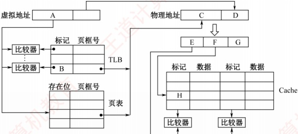
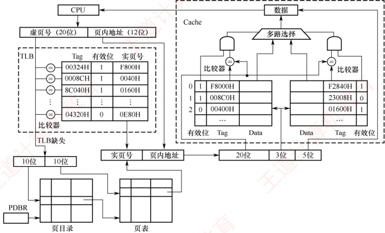

### 3.6.6 本节习题精选

#### 一、 单项选择题

##### 01

为使虚拟存储系统有效地发挥其预期的作用，所运行程序应具有的特性是（）。

A. 不应含有过多的 I/O 操作

B. 大小不应小于实际的内存容量

C. 应具有较好的局部性

D. 顺序执行的指令不应过多

##### 02

虚拟存储管理系统的基础是程序访问的局部性原理，此理论的基本含义是（）。

A. 在程序的执行过程中，程序对主存的访问是不均匀的

B. 空间局部性

C. 时间局部性

D. 代码的顺序执行

##### 03

虚拟存储器的常用管理方式有段式、页式、段页式，对于它们在与主存交换信息时的单位，以下表述正确的是（）。

A. 段式采用“页” B. 页式采用“块”

C. 段页式采用“段”和“页” D. 页式和段页式均仅采用“页”

##### 04

下列关于虚拟存储器的叙述中，正确的是（）。

A. 对应用程序员透明，对系统程序员不透明

B. 对应用程序员不透明，对系统程序员透明

C. 对应用程序员、系统程序员都不透明

D. 对应用程序员、系统程序员都透明

##### 05

在虚拟存储器中，当程序正在执行时，由（）完成地址映射。

A. 程序员 B. 编译器 C. 装入程序 D. 操作系统

##### 06

采用虚拟存储器的主要目的是（）。

A. 提高主存储器的存取速度

B. 扩大主存储器的存储空间

C. 提高外存储器的存取速度

D. 扩大外存储器的存储空间

##### 07

下列有关虚拟存储管理机制中地址转换的叙述，错误的是（）。

A. 地址转换是指把逻辑地址转换为物理地址

B. 通常逻辑地址的位数比物理地址的位数少

C. 地址转换过程中会发现是否“缺页”

D. 内存管理单元（MMU）在地址转换过程中要访问页表项

##### 08

下列有关虚拟存储管理机制的页表的叙述中，错误的是（）。
A. 系统中每个进程有一个页表

B. 页表中每个表项与一个虚页对应

C. 每个页表项中都包含装入位（有效位）

D. 所有进程都可以访问页表

##### 09

下列有关缺页处理的叙述中，错误的是（）。

A. 若对应页表项中的有效位为0，则发生缺页

B. 缺页是一种外部中断，需要调用操作系统提供的中断服务程序来处理

C. 缺页处理过程中需根据页表中给出的磁盘地址去读磁盘数据

D. 缺页处理完后要重新执行发生缺页的指令

##### 10

下列关于段式虚拟存储管理的叙述中，错误的是（）。

A. 段是逻辑结构上相对独立的程序块，因此段是可变长的

B. 按程序中实际的段来分配主存，所以分配后的存储块是可变长的

C. 每个段表项必须记录对应段在主存的起始位置和段的长度

D. 分段方式对低级语言程序员和编译器来说是透明的

##### 11

虚拟存储器中的页表有快表和慢表之分，下面关于页表的叙述中正确的是（）。

A. 快表与慢表都存储在主存中，但快表比慢表容量小

B. 快表采用了优化的搜索算法，因此查找速度快

C. 快表比慢表的命中率高，因此快表可以得到更多的搜索结果

D. 快表采用相联存储器件组成，按照查找内容访问，因此比慢表查找速度快

##### 12

【2010 统考真题】下列命令组合的一次访存过程中，不可能发生的是（）。

A. TLB 未命中，Cache 未命中，Page 未命中

B. TLB 未命中，Cache 命中，Page 命中

C. TLB 命中，Cache 未命中，Page 命中

D. TLB 命中，Cache 命中，Page 未命中

##### 13

【2013 统考真题】某计算机主存地址空间大小为 256 MB，按字节编址。虚拟地址空间大小为 4GB，采用页式存储管理，页面大小为 4KB，TLB（快表）采用全相联映射，有 4 个页表项，内容如下表所示。

| 有效位 | 标记 | 页框号 | ... |
| --- | --- | --- | --- |
| 0 | FF180H | 0002H | ... |
| 1 | 3FFF1H | 0035H | ... |
| 0 | 02FF3H | 0351H | ... |
| 1 | 03FFFH | 0153H | ... |

则对虚拟地址 03FF F180H 进行虚实地址变换的结果是（）。

A. 015 3180H B. 003 5180H C. TLB 缺失 D. 缺页

##### 14

【2015 统考真题】假定编译器将赋值语句 “x=x+3,” 转换为指令 “add xaddr, 3” ，其中 xaddr 是 x 对应的存储单元地址。若执行该指令的计算机采用页式虚拟存储管理方式，并配有相应的 TLB，且 Cache 使用直写方式，则完成该指令功能需要访问主存的次数至少是（）。

A. 0 B. 1 C. 2 D. 3

##### 15

【2019 统考真题】下列关于缺页处理的叙述中，错误的是（）。

A. 缺页是在地址转换时 CPU 检测到的一种异常
B. 缺页处理由操作系统提供的缺页处理程序来完成

C. 缺页处理程序根据页故障地址从外存读入所缺失的页

D. 缺页处理完成后回到发生缺页的指令的下一条指令执行

##### 16

【2020 统考真题】下列关于 TLB 和 Cache 的叙述中，错误的是（）。

A. 命中率都与程序局部性有关

B. 缺失后都需要去访问主存

C. 缺失处理都可以由硬件实现

D. 都由 DRAM 存储器组成

##### 17

【2022 统考真题】某计算机主存地址为 24 位，采用分页虚拟存储管理方式，虚拟地址空间大小为 4 GB，页大小为 4 KB，按字节编址。某个进程的页表部分内容如下表所示。

| 虚页号 | 实页号（页框号） | 存在位 |
| --- | --- | --- |
| 82 | 024H | 0 |
| ... | ... | ... |
| 129 | 180H | 1 |
| 130 | 018H | 1 |

当 CPU 访问虚拟地址 0008 2840H 时，虚-实地址转换的结果是（）。

A. 得到主存地址 02 4840H

B. 得到主存地址 18 0840H

C. 得到主存地址 01 8840H

D. 检测到缺页异常

##### 18

【2024 统考真题】对于页式虚拟存储管理系统，下列关于存储器层次结构的叙述中，错误的是（）。

A. Cache-主存层次的交换单位为主存块，主存-外存层次的交换单位为页

B. Cache-主存层次替换算法由硬件实现，主存-外存层次替换算法由软件实现

C. Cache-主存层次可采用回写法，主存-外存层次通常采用回写法

D. Cache-主存层次可采用直接映射方式，主存-外存层次通常采用直接映射方式

##### 19

【2024 统考真题】某计算机按字节编址，采用页式虚拟存储管理方式，虚拟地址为 32 位，主存地址为 30 位，页大小为 1KB。若 TLB 共有 32 个表项，采用 4 路组相联映射方式，则 TLB 表项中标记字段的位数至少是（）。

A. 17 B. 18 C. 19 D. 20

##### 20

【2024统考真题】下列事件中，不是在MMU地址转换过程中检测的是（）。

A. 访问越权

B. Cache 缺失

C. 页面缺失

D. TLB 缺失

#### 二、 综合应用题

##### 01

某计算机系统采用虚拟页式存储管理，某个进程的页表见下表，每项的起始编号是0，所有的地址均按字节编址，每页大小为1024B。分别将逻辑地址0793，1197，2099，3320，4188，5332，转换为物理地址，写出计算过程，对不能计算的说明为什么。

| 逻辑页号 | 存在位 | 引用位 | 修改位 | 页框号 |
| --- | --- | --- | --- | --- |
| 0 | 1 | 1 | 0 | 4 |
| 1 | 1 | 1 | 1 | 3 |
| 2 | 0 | 0 | 0 | — |
| 3 | 1 | 0 | 0 | 1 |
| 4 | 0 | 0 | 0 | — |
| 5 | 1 | 0 | 1 | 5 |

##### 02

下图表示使用快表（页表）的虚实地址转换条件，快表存放在相联存储器中，其容量为8个存储单元。

| 页号 | 该页在主存中的起始位置 |
| --- | --- |
| 32 | 42000 |
| 25 | 38000 |
| 7 | 96000 |
| 6 | 60000 |
| 4 | 40000 |
| 15 | 80000 |
| 5 | 50000 |
| 34 | 70000 |

| 虚拟地址 | 页号 | 页内地址 |
| --- | --- | --- |
| 1 | 15 | 0324 |
| 2 | 7 | 0128 |
| 3 | 48 | 0516 |

1）当 CPU 按虚拟地址 1 去访问主存时，主存的实地址码是多少？

2）当 CPU 按虚拟地址 2 去访问主存时，主存的实地址码是多少？

3）当 CPU 按虚拟地址 3 去访问主存时，主存的实地址码是多少？

##### 03

一个两级存储器系统有8个磁盘上的虚拟页面需要映像到主存中的4个页中。某程序生成以下访存页面序列：1,0,2,2,1,7,6,7,0,1,2,0,3,0,4,5,1,5,2,4,5,6,7,6,7,2,4,2,7,3。采用LRU算法，设初始时主存为空。

1）画出每个页号访问请求之后存放在主存中的位置。

2）计算主存的命中率。

##### 04

【2011 统考真题】某计算机存储器按字节编址，虚拟（逻辑）地址空间大小为 16MB，主存（物理）地址空间大小为 1MB，页面大小为 4KB；Cache 采用直接映射方式，共 8 行；主存与 Cache 之间交换的块大小为 32B。系统运行到某一时刻时，页表的部分内容和 Cache 的部分内容分别如下的左图和右图所示，图中页框号及标记字段的内容为十六进制形式。回答下列问题：

1）虚拟地址共有几位，哪几位表示虚页号？物理地址共有几位，哪几位表示页框号（物理页号）？

2）使用物理地址访问 Cache 时，物理地址应划分成哪几个字段？要求说明每个字段的位数及在物理地址中的位置。

| 虚页号 | 有效位 | 页框号 | ... |
| --- | --- | --- | --- |
| 0 | 1 | 06 | ... |
| 1 | 1 | 04 | ... |
| 2 | 1 | 15 | ... |
| 3 | 1 | 02 | ... |
| 4 | 0 | — | ... |
| 5 | 1 | 2B | ... |
| 6 | 0 | — | ... |
| 7 | 1 | 32 | ... |

| 行号 | 有效位 | 标记 | ... |
| --- | --- | --- | --- |
| 0 | 1 | 020 | ... |
| 1 | 0 | — | ... |
| 2 | 1 | 01D | ... |
| 3 | 1 | 105 | ... |
| 4 | 1 | 064 | ... |
| 5 | 1 | 14D | ... |
| 6 | 0 | — | ... |
| 7 | 1 | 27A | ... |

3）虚拟地址 001C60H 所在的页面是否在主存中？若在主存中，则该虚拟地址对应的物理地址是什么？访问该地址时是否 Cache 命中？要求说明理由。

4）假定为该机配置一个4路组相联的TLB，共可存放8个页表项，若其当前内容（十六进制）如下图所示，则此时虚拟地址024BACH所在的页面是否存在主存中？要求说明理由。

| 0 | — | — |   | 1 | 001 | 15 |   | 0 | — | — |   | 1 | 012 | 1F |
| --- | --- | --- | --- | --- | --- | --- | --- | --- | --- | --- | --- | --- | --- | --- |
| 1 | 013 | 2D | 0 | — | — | 1 | 008 | 7E | 0 | — | — |   |   |   |

##### 05

【2016 统考真题】某计算机采用页式虚拟存储管理方式，按字节编址，虚拟地址为 32
位，物理地址为 24 位，页大小为 8KB；TLB 采用全相联映射；Cache 数据区大小为 64KB，按 2 路组相联映射方式组织，主存块大小为 64B。存储访问过程的示意图如下。



回答下列问题：

1）图中字段 A~G 的位数各是多少？TLB 标记字段 B 中存放的是什么信息？

2）将块号为4099的主存块装入Cache时，所映射的Cache组号是多少？对应的H字段内容是什么？

3）是 Cache 缺失处理的时间开销大还是缺页处理的时间开销大？为什么？

4）为什么 Cache 可以采用直写法，而修改页面内容时总是采用回写法？

##### 06

【2018 统考真题】某计算机采用页式虚拟存储管理方式，按字节编址。CPU 进行存储访问的过程如下图所示。根据该图回答下列问题。



1）主存物理地址占多少位？

2）TLB采用什么映射方式？TLB是用SRAM还是用DRAM实现？

3）Cache 采用什么映射方式？若 Cache 采用 LRU 算法和回写法，则 Cache 每行中除数据（Data）、标记和有效位外，还应有哪些附加位？Cache 总容量是多少？Cache 中有效位的作用是什么？
4）若 CPU 给出的虚拟地址为 0008 C040H，则对应的物理地址是多少？是否在 Cache 中命中？说明理由。若 CPU 给出的虚拟地址为 0007 C260H，则该地址所在主存块映射到的 Cache 组号是多少？

##### 07

【2021 统考真题】假设计算机 M 的主存地址为 24 位，按字节编址；采用分页存储管理方式，虚拟地址为 30 位，页大小为 4KB；TLB 采用 2 路组相联映射方式和 LRU 算法，共 8 组。请回答下列问题。

1）虚拟地址中哪几位表示虚页号？哪几位表示页内地址？

2）已知访问 TLB 时虚页号高位部分用作 TLB 标记，低位部分用作 TLB 组号，M 的虚拟地址中哪几位是 TLB 标记？哪几位是 TLB 组号？

3）假设 TLB 初始时为空，访问的虚页号依次为 10, 12, 16, 7, 26, 4, 12 和 20，在此过程中，哪一个虚页号对应的 TLB 表项被替换？说明理由。

4）若将 M 中的虚拟地址位数增加到 32 位，则 TLB 表项的位数增加几位？

##### 08

【2023 统考真题】已知计算机 M 的字长为 32 位，按字节编址，采用请求调页策略的虚拟存储管理方式，虚拟地址为 32 位，页大小为 4KB；数据 Cache 采用 4 路组相联映射方式，数据区大小为 8KB，主存块大小为 32B。现有 C 语言程序段如下：

```c
int a[24][64];
...
for (i=0; i<24; i++)
for (j=0; j<64; j++) a[i][j]=10;
```

已知二维数组 a 按行优先存放，在虚拟地址空间中分配的起始地址为 0042 2000H，sizeof(int) = 4，假定在 M 上执行上述程序段之前数组 a 不在主存，且在该程序段执行过程中不会发生页面置换。请回答下列问题：

1）数组 a 分布在几个页面中？对于数组 a 的访问，会发生几次缺页异常？页故障地址各是什么？

2）不考虑变量 i 和 j，该程序段的数据访问是否具有时间局部性？为什么？

3）计算机 M 的虚拟地址（A31～A0）中哪几位用作块内地址？哪几位用作 Cache 组号？a[1][0] 的虚拟地址是多少？其所在主存块对应的 Cache 组号是多少？

4) 数组 a 占用多少主存块？假设上述程序段执行过程中数组 a 的访问不会和其他数据发生 Cache 访问冲突，则数组 a 的 Cache 命中率是多少？若将循环中 i 和 j 的次序按如下方式调换：

```c
for (j=0; j<64; j++)
    for (i=0; i<24; i++) a[i][j]=10;
```

则数组a的Cache命中率又是多少？

##### 09

【2025 统考真题】现有 C 语言程序 P 的部分代码如下所示。假定运行程序 P 的计算机 M 字长为 32 位，按字节编址，数据 Cache 的数据区大小为 32KB，采用 8 路组相联映射方式，主存块大小为 64B，Cache 的命中时间为 2 个时钟周期，缺失损失为 200 个时钟周期；采用页式虚拟存储管理方式，页大小为 4KB。数组 d 的起始虚拟地址  $VA_{31} \sim VA_{0}$ 为 0180 0020H。请回答下列问题。

```c
int x,d[2048],i;
...
for (i=0; i<2048; i++)
    d[i]=d[i]/x;
```

1）主存地址中 Cache 组号字段和块内地址字段分别占几位？虚拟地址中哪些位可作
为 Cache 索引？

2）d[100]的虚拟地址为多少？d[100]所在主存块对应的 Cache 组号是多少？

3）假定执行 for 语句时对应代码已在 Cache 中，变量 i 和 x 已装入寄存器，数组 d 已调入主存但不在 Cache 中，则 d[0] 在其所在主存块内的偏移量是多少（用十六进制数表示）？在 for 语句的执行过程中，访问数组 d 的 Cache 缺失率和数组元素的平均访问时间分别是多少（Cache 缺失率的计算结果要求用百分比表示，保留两位小数）？

4）数组 d 分布在几个页中？若执行 for 语句时对应代码已在主存中，但数组 d 还未调入主存，则在执行 for 语句的过程中，访问数组 d 所引起的缺页次数是多少？

### 3.6.7 答案与解析

#### 一、 单项选择题

##### 01

C

虚拟存储系统利用的是局部性原理，程序应当具有较好的局部性，选项C正确。而含有输入、输出操作产生中断，与虚拟存储器无关，选项A错误。大小较小但可以多个程序并发执行，也可以发挥虚拟存储器的作用，选项B错误。顺序执行的指令应当占较大比重为宜，这样可增强程序的局部性，选项D错误。

##### 02

A

局部性原理的含义是在一个程序的执行过程中，其大部分情况下是顺序执行的，某条指令或数据使用后，在最近一段时间内有较大的可能再次被访问（时间局部性）；某条指令或数据使用后，其邻近的指令或数据可能在近期被使用（空间局部性）。在虚拟存储管理系统中，程序只能访问主存获得指令和数据，选项A正确。选项B、C、D均是局部性原理的一个方面而已。

##### 03

D

##### 04

A

页式虚拟存储方式对程序分页，采用页进行交互；段页式则先按照逻辑分段，然后分页，以页为单位和主存交互，选项D正确。

虚拟存储器需要通过对操作系统实现地址映射，因此对操作系统的设计者即系统程序员是不透明的。而应用程序员写的程序所使用的是逻辑地址（虚地址），因此对其是透明的。

##### 05

D

虚拟存储器中，地址映射由操作系统来完成，但需要一部分硬件基础的支持，如快表、地址映射系统等。

##### 06

B

引入虚拟存储器的目的是解决内存容量不够大的问题。

##### 07

B

虚拟存储管理的目的是让程序员可以在一个比主存地址空间大得多的虚拟地址空间中编程，显然逻辑地址空间比主存空间大，因此逻辑地址的位数比物理地址的位数多，选项 B 错误。在执行程序时，由 CPU 中的 MMU 进行逻辑地址到物理地址的转换。在转换过程中，MMU 需要查找对应的页表项，根据页表项中的装入（有效）位是否为 1 来确定是否发生缺页。

##### 08

D

选项 A、B 和 C 都正确。页表中的每个表项反映的是对应虚拟页面的位置和使用等信息，通常只能由操作系统和硬件进行访问，虚拟存储管理机制对用户进程来说是透明的，选项 D 错误。
##### 09

B

缺页是 CPU 在执行指令过程中进行取指令或读/写数据时发生的一种故障，属于内部异常。

##### 10

D

选项 A、B 和 C 都正确。分段方式对低级语言程序员和编译器来说是不透明的，因为低级语言程序员需要使用段号来编程，编译器需要使用段号来链接，选项 D 错误。

##### 11

D

快表采用高速相联存储器，它的速度快来源于硬件本身，而不是依赖搜索算法来查找的；慢表存储在内存中，通常是依赖于查找算法，所以选项A和B错误。快表与慢表的命中率没有必然联系，快表仅是慢表的一个部分拷贝，不能够得到比慢表更多的结果，选项C错误。

##### 12

D

Cache 的内容是主存的一部分副本，TLB 的内容是 Page（页表）的一部分副本。在同时具有 TLB 和 Cache 的虚拟存储系统中，CPU 发出访存命令，先查找对应的 Cache 块。

1）若 Cache 命中，则说明所需内容在 Cache 内，其所在页面必然已调入主存，因此 Page 必然命中，但 TLB 不一定命中。

2）若 Cache 未命中，则并不能说明所需内容未调入主存，和 TLB、Page 命中与否没有联系。但若 TLB 命中，Page 也必然命中；而当 Page 命中，TLB 则未必命中，因此 D 不可能发生。

##### 13

A

按字节编址，页面大小为4KB，页内地址共12位。地址空间大小为4GB，虚拟地址共32位，前20位为页号。虚拟地址为03FFF180H，因此页号为03FFFH，页内地址为180H。查找页标记03FFFH所对应的页表项，页框号为0153H，页框号与页内地址拼接即为物理地址0153180H。

##### 14

B

##### 15

D

上述指令的执行过程可划分为取数、运算和写回过程，取数时读取 xaddr 可能不需要访问主存而直接访问 Cache，而直写方式需要把数据同时写入 Cache 和主存，因此至少访问 1 次。

在请求分页系统中，每当要访问的页面不在内存中时，CPU检测到异常，便会产生缺页中断，请求操作系统将所缺的页调入内存。缺页处理由缺页中断处理程序完成，根据发生缺页故障的地址从外存读入所缺失的页，缺页处理完成后回到发生缺页的指令继续执行。选项D中描述回到发生缺页的指令的下一条指令执行，明显错误。

##### 16

D

Cache 由 SRAM 组成；TLB 也由 SRAM 组成。DRAM 需要不断刷新，性能偏低，不适合组成 TLB 和 Cache。选项 A、B 和 C 都是 TLB 和 Cache 的特点。

##### 17

C

页大小为 4KB =  $2^{12}$B，按字节编址，因此页内地址为 12 位。虚拟地址空间大小为 4GB =  $2^{32}$B，因此虚拟地址共 32 位，其中低 12 位为页内地址，高 20 位为虚页号。题中给出的虚拟地址为 00082840H，虚页号为高 20 位即 00082H（页内地址为低 12 位即 840H），82H 对应的十进制数为 130（注意题中页表的虚页号部分末尾未写 H，所以是十进制数，因此查找时要先将虚页号转换为十进制数），查页表命中，并且存在位为 1，对应页框号为 018H。将查找到的页框号 018H 和页内地址 840H 拼接，得到主存地址为 018840H。

##### 18

D

Cache 与主存之间交换的是主存块，主存与外存之间交换的是页。Cache-主存层次和主存-外存层次的区别在于前者主要解决速度不匹配问题，用软件实现会影响速度，因此 Cache-主存层次替
换算法由硬件实现；而主存-外存层次替换算法由软件实现。Cache-主存层次可采用回写法或全写法；主存-外存层次通常采用回写法，即页面被修改后，仅当被换出时才写回外存，访问外存的代价很大，采用全写法的开销过高。访问外存的代价很大，提高命中率是关键，因此主存-外存层次通常采用全相联映射；而 Cache-主存层次可采用直接映射、组相联或全相联，选项 D 错误。

##### 19

C

按字节编址，页大小为  $2^{10}B$，因此页内地址占10位；TLB有32个表项，采用4路组相联映射，被分为  $2^{3}=8$ 组，因此TLB组号占3位；于是，标记字段的位数至少是32-3-10=19。

##### 20

B

在地址转换的过程中，MMU 会检查页表项的访问权限，以确保进程有权访问某个页面，否则就会访问越权。为了获得对应的页表项，先查找 TLB，若找不到，则 TLB 缺失，然后查找页表，若找不到，则页面缺失。访问 Cache 是在获得物理地址后使用物理地址存取数据的过程中才执行的操作，而 MMU 地址转换过程是在获得物理地址之前进行的，选项 B 错误。

#### 二、 综合应用题

##### 01

【解答】

所有地址均可转换为页号和页内偏移量。地址转换时，先取出逻辑页号，然后查找页表，得到页框号，再将页框号与页内偏移量拼接，即可获得物理地址。根据题意，计算逻辑地址的页号和页内偏移量，拼接的物理地址如下表所示。

| 逻辑地址 | 逻辑页号 | 页内偏移量 | 页框号 | 物理地址 |
| --- | --- | --- | --- | --- |
| 0793 | 0 | 793 | 4 | 4889 |
| 1197 | 1 | 173 | 3 | 3245 |
| 2099 | 2 | 51 | — | 缺页中断 |
| 3320 | 3 | 248 | 1 | 1272 |
| 4188 | 4 | 92 | — | 缺页中断 |
| 5332 | 5 | 212 | 5 | 5332 |

注：在本题中，物理地址 = 页框号×1024B+ 页内偏移量，页内偏移量 = 逻辑地址-逻辑页号×1024B，逻辑页号 = 逻辑地址/1024B（结果向下取整）。

##### 02

【解答】

1）虚拟地址 1 的页号为 15，页内地址为 0324，在左表中页号 15 对应的主存起始位置为 80000，则主存的实地址码为  $0324 + 80000 = 80324$。

2）按1）中的方法易知，主存的实地址码为0128+96000=96128。

3）虚拟地址3的页号为48，在左表中无对应项，因此该页面在快表（页表）中无记录。

##### 03

【解答】

1）LRU 算法是换出最近最久未使用的页面，因此每个页号访问请求之后存放在主存中的位置如下图所示。

| 页框号 | 虚拟页号 |   |   |   |   |   |   |   |   |   |   |   |   |   |   |   |   |   |   |   |   |   |   |   |   |   |   |   |   |   |
| --- | --- | --- | --- | --- | --- | --- | --- | --- | --- | --- | --- | --- | --- | --- | --- | --- | --- | --- | --- | --- | --- | --- | --- | --- | --- | --- | --- | --- | --- | --- |
| 4 |   |   |   |   |   | 7 | 7 | 7 | 7 | 7 | 7 | 3 | 3 | 3 | 3 | 1 | 1 | 1 | 1 | 1 | 6 | 6 | 6 | 6 | 6 | 6 | 6 | 6 | 6 | 3 |
| 3 |   |   | 2 | 2 | 2 | 2 | 2 | 2 | 0 | 0 | 0 | 0 | 0 | 0 | 0 | 0 | 0 | 2 | 2 | 2 | 2 | 7 | 7 | 7 | 7 | 7 | 7 | 7 | 7 | 7 |
| 2 |   | 0 | 0 | 0 | 0 | 0 | 6 | 6 | 6 | 6 | 2 | 2 | 2 | 2 | 2 | 5 | 5 | 5 | 5 | 5 | 5 | 5 | 5 | 5 | 5 | 5 | 4 | 4 | 4 | 4 |
| 1 | 1 | 1 | 1 | 1 | 1 | 1 | 1 | 1 | 1 | 1 | 1 | 1 | 1 | 1 | 4 | 4 | 4 | 4 | 4 | 4 | 4 | 4 | 4 | 4 | 4 | 4 | 2 | 2 | 2 | 2 |
| 命中 |   |   |   | * | * |   |   | * |   | * |   | * |   | * |   |   |   | * |   | * |   |   |   | * | * |   |   | * | * |   |

2）共30次访存，有13次命中，因此主存的命中率为 $13/30=43\%$。

##### 04

【解答】

1）存储器按字节编址，虚拟地址空间大小为  $16MB = 2^{24}B$，因此虚拟地址为24位；页面大小为  $4KB = 2^{12}B$，因此高12位为虚页号。主存地址空间大小为  $1MB = 2^{20}B$，因此物理地址为20位；页内地址为12位，因此高8位为物理页号。

2）因为 Cache 采用直接映射方式，所以物理地址各字段的划分如下：

| 主存字块标记 | Cache 字块标记 | 字块内地址 |
| --- | --- | --- |

块大小为 32B，因此字块内地址占 5 位；Cache 共 8 行，因此 Cache 字块标记占 3 位；主存字块标记占 20-5-3=12 位。

3）虚拟地址 001C60H 的前 12 位为虚页号，即 001H，查看 001H 处的页表项，其对应的有效位为 1，因此虚拟地址 001C60H 所在的页面在主存中。页表 001H 处的页框号为 04H，与页内偏移（虚拟地址后 12 位）拼接成物理地址 04C60H。物理地址 04C60H = 0000 0100 1100 0110 0000B，主存块只能映射到 Cache 的第 3 行（第 011B 行），该行的有效位 = 1，标记（值为 105H）≠ 04CH（物理地址高 12 位），因此未命中。

4）TLB 采用 4 路组相联，TLB 被分为 8/4=2 个组，因此虚页号中高 11 位为 TLB 标记、最低 1 位为 TLB 组号。虚拟地址  $024BACH = 0000\ 0010\ 0100\ 1011\ 1010\ 1100B$，虚页号为 0000 0010 0100B，TLB 标记为 0000 0010 010B（012H），TLB 组号为 0B，因此该虚拟地址所对应的物理页面只能映射到 TLB 的第 0 组。组 0 中存在有效位 = 1、标记 = 012H 的项，因此访问 TLB 命中，即虚拟地址 024BACH 所在的页面在主存中。

##### 05

【解答】

1）贝大小为8KB，贞内偏移地址为13位，因此A=B=32-13=19；D=13；C=24-13=11；主存块大小为64B，因此G=6。2路组相联，每组数据区容量有64B×2=128B，共有64KB/128B=512组，因此F=9；E=24-G-F=24-6-9=9。

因此A=19，B=19，C=11，D=13，E=9，F=9，G=6。

TLB 中标记字段 B 的内容是虚页号，表示该 TLB 项对应哪个虚页的页表项。

2）块号 4099=00 0001 0000 0000 0011B，因此所映射的 Cache 组号为 0 0000 0011B=3，对应的 H 字段内容为 0 0000 1000B。

3）Cache 缺失带来的开销小，而处理缺页的开销大。因为缺页处理需要访问磁盘，而 Cache 缺失只要访问主存。

4）因为采用直写法时需要同时写快速存储器和慢速存储器，而写磁盘比写主存慢很多，所以在 Cache-主存层次，Cache 可以采用直写法，而在主存-外存（磁盘）层次，修改页面内容时总是采用回写法。

##### 06

【解答】

1）物理地址由实页号和页内地址拼接，因此其位数为 $16+12=28$；或直接得 $20+3+5=28$。

2）TLB 采用全相联映射，可把页表内容调入任意一块空 TLB 项中，TLB 中的每项都有一个比较器，没有映射规则，只要空闲就行。TLB 采用静态存储器（SRAM），读/写速度快，但成本高，多用于容量较小的高速缓冲存储器。

3）图中可看到，Cache中每组有两行，因此采用2路组相联映射方式。因为是2路组相联并采用LRU算法，所以每行需要1位LRU位；因为采用回写法，所以每行有1位修改位（脏位），根据脏位判断数据是否被更新，若脏位为1，则需要写回内存。28位物理地址中标记
字段占20位，组索引字段占3位，块内偏移地址占5位，因此 Cache 共有  $2^3 = 8$ 组，每组 2 行，每行有  $2^5 = 32B$；Cache 的总容量为  $8 \times 2 \times (20 + 1 + 1 + 1 + 32 \times 8) = 4464b = 558B$。

Cache 中有效位用来指出所在 Cache 行中的信息是否有效。

4）虚拟地址分为两部分：虚页号、页内地址；物理地址分为两部分：实页号、页内地址。利用虚拟地址的虚页号部分去查找TLB表（缺失时从页表调入），将实页号取出后和虚拟地址的页内地址拼接，形成物理地址。虚页号0008CH恰好在TLB表中对应实页号0040H（有效位为1，说明存在），虚拟地址的后3位为页内地址040H，对应的物理地址是0040040H。

物理地址为 0040040H，其中高 20 位 00400H 为标志字段，低 5 位 00000B 为块内偏移量，中间 3 位 010B 为组号 2，因此将 00400H 与 Cache 中的第 2 组两行中的标志字段同时比较，可以看出，虽然有一个 Cache 行中的标志字段与 00400H 相等，但对应的有效位为 0，而另一 Cache 行的标志字段与 00400H 不相等，因此访问 Cache 不命中。

因为物理地址的低 12 位与虚拟地址的低 12 位相同，即为 0010 0110 0000B。根据物理地址的结构，物理地址的后八位 01100000B 的前三位 011B 是组号，因此该地址所在的主存映射到 Cache 组号为 3。

##### 07

【解答】

注意：对于本题的 TLB，需要采用处理 Cache 的方式求解。

1）按字节编址，页面大小为 4 KB =  $2^{12}$ B，页内地址为 12 位。虚拟地址中高 30-12=18 位表示虚页号，虚拟地址中低 12 位表示页内地址。

2）TLB采用2路组相联映射方式，共 $8=2^{3}$组，用3位来标记组号。虚拟地址（或虚页号）中高18-3=15位为TLB标记，虚拟地址中随后3位（或虚页号中低3位）为TLB组号。

3）虚页号4对应的TLB表项被替换。因为虚页号与TLB组号的映射关系为TLB组号=虚页号modTLB组数=虚页号mod8，因此，虚页号10,12,16,7,26,4,12,20映射到的TLB组号依次为2,4,0,7,2,4,4,4。TLB采用2路组相联映射方式，从上述映射到的TLB组号序列可以看出，只有映射到4号组的虚页号数量大于2，相应虚页号依次是12,4,12和20。根据LRU算法，当访问第20页时，虚页号4对应的TLB表项被替换出来。

4）虚拟地址位数增加到32位时，虚页号增加了32-30=2位，使得每个TLB表项中的标记字段增加2位，因此，每个TLB表项的位数增加2位。

##### 08

【解答】

1）数组 a 的起始地址为 0042 2000H，页大小为 4KB，所以页内偏移量占 12 位，数组 a 共有  $24 \times 64 = 1536$ 个元素，每个 int 型数据占 4 字节，因此数组 a 共占  $1536 \times 4B = 6KB$，的怪分布在 2 个相邻的页面中。页号分别为 00422H 和 00423H，当访问这两个页面的第一个数组元素的地址时，因为页面尚未调入内存，所以会发生 2 次缺页异常，两个页故障地址分别是 0042 2000H 和 0042 3000H。

2）若不考虑变量 i 和 j，该程序段的数据访问只涉及对数组元素的访问，每个数组元素只访问一次，因此该程序段的数据访问没有时间局部性。

3）在组相联映射方式下，物理地址结构为标记 + Cache 组号 + 块内地址，主存块大小为 32B，因此块内地址占 5 位；Cache 数据区共有 8KB÷32B=256 行，采用 4 路组相联，共有 64 组，所以 Cache 组号占 6 位，因此虚拟地址中低 5 位（A4～A0）用作块内地址；低 11 位虚拟地址中高 6 位（A10～A5）用作 Cache 组号。a[1][0]的虚拟地址为 0042 2000H+1×64×4+0×4=0042 2100H。虚拟地址为 32 位，页框大小为 4KB，虚拟地址的低 12 位表示页内偏移量，
因此物理地址的低 12 位和虚拟地址的低 12 位相同，因此 a[1][0] 所在主存块对应的 Cache 组号为 001000B = 8。

4）数组 a 占  $24 \times 64 \times 4\text{B} \div 32\text{B} = 192$ 个主存块。每个主存块存放  $32\text{B} \div 4\text{B} = 8$ 个数组元素，访问数组 a 的 Cache 命中率为  $(8 - 1)/8 = 87.5\%$。8 行数组元素占  $8 \times 64 \times 4\text{B} \div 32\text{B} = 64$ 个主存块，分别映射到 64 个 Cache 组的某 Cache 行，数组 a 共有 24 行，因此每个 Cache 组中只有  $24/8 = 3$ 个 Cache 行存放数组 a 中的数据，而每个 Cache 组有 4 行，因此不会发生替换，访问数组 a 的 Cache 命中率为  $7/8 = 87.5\%$。

##### 09

【解答】

1 ）Cache 地址字段划分如下。

块内地址：主存块大小为  $64B=2^{6}B$，因此块内地址字段需要6位。

组号：Cache 数据区大小为 32KB，采用 8 路组相联，每组大小为  $8 \times 64B = 512B$，总组数为  $32KB/512B = 215/29 = 2^6 = 64$。因此组号字段需要 6 位。

Cache 索引：地址的低 6 位是块内地址，紧接着的 6 位是组号（索引），即物理地址的第 6 位到第 11 位（从 0 开始计数），而又因为页大小为 4KB，说明页内地址占 12 位，因此物理地址与虚拟地址的低 12 位（ $VA_{11} \sim VA_{0}$）相同。因此索引是  $VA_{11} \sim VA_{6}$。

2）数组 d 是 int 型，每个元素占 4 字节。d[100] 相对于首地址的偏移量为  $100 \times 4 = 400 = 190$ H 字节。因此，d[100] 的虚拟地址为 0180 0020H + 190H = 0180 01B0H。
```c

0180 01B0H 的二进制表示为 0000 0001 1000 0000 0001 1011 0000，Cache 组号为该地址的 VA_{11}～VA_6 位，即 000110，转换成十进制数为 6。
```

3 ）块内偏移量：d[0]的地址为0180 0020H，块内偏移量即为地址的低6位，即20H。

Cache 缺失率：每次循环对数组元素 d[i]执行一次读和一次写操作，共 4096 次访存（2048×2）。每个 Cache 块大小为 64B，可容纳 64B/4B = 16 个 int 元素。由于数组在内存中连续存放，访问某块中的第一个元素缺失时，该块全部数据将被调入 Cache，后续 15 个元素的访问均可命中。因此，若数组起始地址按 64B（Cache 块大小）对齐，则总共刚好需要访问 2048/16 = 128 个内存块，缺失次数为 128；但 d[0] 的地址为 0180 0020H，其块内偏移为 20H（32B），未按 Cache 块边界对齐，导致实际访问跨越 128 + 1 = 129 个内存块，因此总缺失次数为 129 次。故 Cache 缺失率 = 129/4096 ≈ 3.15%。

平均访问时间 = 命中时间 + 缺失率 × 缺失代价 = 2 + 0.0315×200 = 2 + 6.3 = 8.3 个时钟周期。

3）数组总大小 = 2048 × 4B = 8KB，页大小 = 4KB。貌似刚好占2个页，但需要看起始地址是否处在页边界。数组 d 的虚拟地址范围为 0180 0020H～0180 201FH，页号范围为 01800H～01802H，共3个页。

初始时数组不在主存中，顺序访问将依次触发这3个页的缺页异常。因此缺页次数为3。
