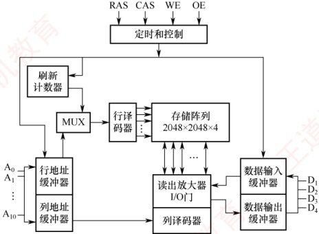
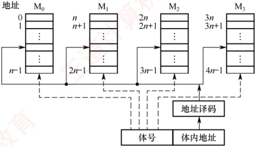

## 3.2 主存储器

### 3.2.1 半导体随机存取存储器

随机存取存储器（RAM）分为静态RAM（SRAM）和动态RAM（DRAM），二者均为易失性存储器。现代计算机中，主存主要采用DRAM，而Cache使用SRAM。

#### 1. SRAM 的工作原理

地址相同的多个存储元构成一个存储单元。若干存储单元的集合构成存储体。

SRAM 的存储元基于双稳态触发器（六晶体管 MOS）利用电路的两个稳定状态分别表示二进制 0 和 1。其静态特性体现在：读操作为非破坏性读出，因此无须再生。

SRAM 的存取速度快，但集成度低，功耗较大，成本高，通常用于高速缓冲存储器。

#### 2. DRAM 的工作原理

与 SRAM 不同，DRAM 利用栅极电容上的电荷来存储信息：有电荷表示 1，无电荷表示 0。其基本存储元仅由一个晶体管和一个电容构成，结构简单，因而集成度远高于 SRAM。

### 考点追踪 需要刷新的存储芯片：SDRAM（2015）

DRAM 具有位价低、功耗小、容量大等优势。但同时也存在明显局限：存取速度较慢；电荷会因漏电而逐渐丢失，必须定时刷新以维持数据；且读出过程为破坏性读出，需在读取后立即再生。因此，DRAM 被广泛用于大容量主存系统，在成本、容量与性能之间取得良好平衡。

#### 3. 存储芯片的组成

如图 3.5 所示，存储芯片由存储体、I/O 读/写电路、地址译码器和控制电路等部分组成。前文介绍的 DRAM 芯片的存储阵列结构，正是此图中存储矩阵的核心构成部分。

1）存储体（存储矩阵）。是存储单元的集合，通过行选择线（X）和列选择线（Y）共同选中目标单元。位于相同行列交叉点上的多个位（位平面数）被同时读/写。

2）地址译码器。用来将输入地址转换为译码输出线上的高电平信号，以驱动相应的读/写电路。地址译码方式有单译码法（一维译码）和双译码法（二维译码）两种：

单译码法。仅使用一个行译码器，同一行中所有存储单元的字线相连，构成一个字，可被同时读/写。其缺点是译码器输出线数量过多。

双译码法。如图3.5所示，地址译码器分为X（行）和Y（列）两个部分，通过行与列的交叉点唯一确定一个存储单元。这是当前DRAM芯片普遍采用的译码结构。

3）I/O电路。用于控制被选中存储单元的读/写，具有放大信号的作用。

图 3.5 存储芯片结构图

4）片选控制线。单个存储芯片容量有限，通常无法满足计算机对主存容量的需求，因此需将多个芯片组合扩展。在访问某个存储字时，必须“选中”该存储字所在的芯片，而其他芯片不被“选中”，因此需要有片选控制信号（经片选控制线传输）。

5）读/写控制线。根据 CPU 发出的读/写命令，通过读/写控制线选中单元执行相应操作。

#### 4. DRAM 芯片的关键技术

##### （1） 地址引脚复用技术

图 3.6 给出了一个 4M×4 位 DRAM 芯片的逻辑结构图。该芯片共有 11 个地址引脚（A₀～A₁₀），在行选通信信号 RAS 和列选通信信号 CAS 的控制下，分时复用传送行地址和列地址。数据端口有 4 个引脚（D₁～D₄），因此每个芯片可同时读/写 4 位数据。WE 为读/写控制信号，低电平表示操作；OE 为输出使能信号，低电平有效，高电平时断开输出驱动。芯片内部存储阵列采用三维结构，总容量为 2048×2048×4 位，即 4M×4 位。因此，行地址和列地址各需 11 位，共 4 个位平面；在任意行与列的交叉点上，4 个位平面上的数据被同时读/写。

图 3.6 一个  $4M \times 4$ 位 DRAM 芯片的逻辑结构图

### 考点追踪 DRAM 芯片地址引脚复用技术（2014）

DRAM 芯片容量较大，所需地址位数较多。为减少芯片地址引脚数量，通常采用地址引脚复用技术：行地址和列地址通过相同的引脚分两次先后输入，从而使地址引脚数量减少一半。
#### （2） 刷新机制与阵列设计优化

DRAM 芯片需要定期刷新以维持所存信息。刷新时，仅向芯片提供行地址和 RAS 信号，即可选中某一行的所有存储单元并执行读操作。由于 DRAM 采用破坏性读出，每次读取后必须立即再生：若读出为 0，则将电容充分放电；若读出为 1，则重新充电。对于图中所示的  $2048 \times 2048 \times 4$ 存储阵列，只需进行 2048 次刷新操作即可完成全芯片刷新（因刷新按整行进行，无须列地址）。芯片内部集成一个刷新计数器，可自动产生刷新所需的行地址，其位数与行地址位数相同。行地址缓冲器与刷新计数器通过一个多路选择器（MUX）共享通往行译码器的地址通路。刷新周期定义为对某一特定行完成一次刷新后，到下一次对该行再次刷新的时间间隔。

### 考点追踪 DRAM 芯片行、列设计优化原则（2018）

假定一个 DRAM 芯片的存储容量为  $2^n \times b$ 位，其存储阵列的行数为  $r$，列数为  $c$，则满足  $2^n = r \times c$。整个阵列的地址位数为  $n$，其中行地址占  $\log_2 r$ 位，列地址占  $\log_2 c$ 位，因此有  $n = \log_2 r + \log_2 c$。由于 DRAM 采用地址引脚复用技术，引脚数量由行、列地址位数中的较大者决定，为最小化地址引脚数，应使  $r$ 与  $c$ 尽可能接近。此外，DRAM 按行刷新，行数越少，刷新开销越低，故还需满足  $r \leq c$。综合考虑，通常将阵列设计为行数略小于或等于列数的近似正方形结构。

#### （3） 缓存机制与突发传输

### 考点追踪 DRAM 芯片行缓冲器容量的计算（2022）

图3.7 展示了一个 DRAM 芯片的简化示意图，其容量为  $16 \times 8$ 位，存储阵列为 4 行×4 列。

| 数据线 | 位置 (行、列) | 位置 (DRAM 列) | 位置 (存储元 (2,1)) |
| --- | --- | --- | --- |
| 16×8位 | 左端 | 底部 | 底部 |
| 0×8位 | 底部 | 顶部 | 顶部 |
| 4×8位 | 顶部 | 底部 | 底部 |

图 3.7 一个 DRAM 芯片的简化示意图

由于采用地址引脚复用技术，仅需2根地址线，分时传送2位行地址和2位列地址。每个存储单元包含8位数据，因此需要8根数据线。芯片内部设有一个行缓冲器（通常由SRAM实现），用于缓存被选中行中所有列的数据。其容量等于一行中所有存储单元的数据总量，即列数×每个存储单元的位数（如4列×8位=32位）。当某一行被选中后，该行全部数据被一次性加载到行缓冲器中，后续可在每个时钟周期连续输出一个存储单元的数据（8位），从而支持突发传输，即在寻址阶段提供首地址，随后连续读取多个相邻存储单元的数据，显著

提升有效带宽。

#### 5. 同步 DRAM

目前更广泛使用的是 SDRAM（同步 DRAM）。与传统的异步 DRAM 不同，SDRAM 的数据读/写操作与系统时钟同步，能够以 CPU-主存总线的较高速率运行。在连续访问同一行（页）内的数据时，可实现突发传输，显著减少甚至避免插入等待状态。在异步 DRAM 中，CPU 发出地址和控制信号后，必须等待一段不确定的延迟时间才能获得数据或完成写入；在此期间，CPU 不断轮询存储器的状态信号，无法执行其他任务，从而降低整体执行效率。而 SDRAM 在系统时钟驱动下工作，它将 CPU 发出的地址和控制信号锁存，并在预设的若干时钟周期后返回数据或完成写入，使得 CPU 无须等待，可在延迟期间执行其他指令，显著提升系统性能。

#### 6. SRAM 和 DRAM 的比较

表3.1 详细列出了 SRAM 和 DRAM 各自的特点。
表3.1 SRAM 和 DRAM 各自的特点

| 特点 | 类型 |   |
| --- | --- | --- |
| SRAM | DRAM |   |
| 存储信息 | 触发器 | 电容 |
| 破坏性读出 | 非 | 是 |
| 需要刷新 | 不需要 | 需要 |
| 送行列地址 | 同时送 | 分两次送（复用） |
| 运行速度 | 快 | 慢 |
| 集成度 | 低 | 高 |
| 存储成本 | 高 | 低 |
| 主要用途 | 高速缓存 | 主机内存 |

### 3.2.2 非易失性存储器

#### 1. 只读存储器（ROM）的特点

### 考点追踪 RAM 和 ROM 的区别（2010）

RAM 与 ROM 均支持随机访问，但 ROM 属于非易失性存储器，具有两个显著优点：① 结构简单，位密度高于 SRAM 等可读/写存储器；② 断电后数据不丢失，可靠性高。

根据制造工艺和可编程性，ROM可分为掩模式ROM（MROM）、一次可编程ROM（PROM）和可擦除可编程ROM（EPROM）等类型；MROM由厂商固化，用户不可更改；PROM允许用户进行一次性编程；EPROM虽支持多次编程，但每次擦除需紫外线照射整片芯片，且擦写次数有限、写入速度慢，难以满足主存对高速随机读/写的需求，因此无法替代RAM。

#### 2. Flash 存储器

### 考点追踪 Flash 存储器的特点（2012）

计算机中许多固定信息需长期保存在非易失性存储器中，如系统启动所需的 BIOS（Basic Input/Output System）。早期 BIOS 固化在 MROM 或 EPROM 中，无法更新；现代主板普遍采用 Flash 存储器存储 BIOS，用户可通过厂商提供的工具直接在系统中擦除并重写。

Flash 存储器（又称闪存）是一种在 EPROM 基础上发展而来的非易失性存储器，兼具 ROM 与 RAM 的部分优点：断电后信息可长期保存；支持电擦除与在线重写，无须紫外线照射等特殊设备；其读取速度接近 RAM，但写入速度显著较慢，读/写性能不对称。

#### 3. 固态硬盘（Solid State Drive, SSD）

固态硬盘是基于 Flash 存储器构建的存储设备，由控制单元和存储单元（Flash 存储器芯片阵列）组成。它继承了 Flash 存储器的重要特性：非易失性、无机械部件、读取速度快。相比传统硬盘，SSD 具有读/写速度快、功耗低、抗震性强等优势，缺点是价格较高，且写入寿命受限于 Flash 存储器的擦写次数。

### 3.2.3 多模块存储器

多模块存储器是一种空间并行技术，通过多个结构完全相同的存储模块并行工作来提高存储器的吞吐率。由于 CPU 的速度远高于存储器，若能在一个存取周期内连续获取多条指令或多个数据字，便可更充分利用 CPU 资源，提升系统性能。多体交叉存储器正是基于这一思想设计的。

根据模块间地址分配方式的不同，多模块存储器可分为连续编址和交叉编址两种结构。

#### 1. 连续编址方式

高位地址为模块号（或体号），低位地址为模块内地址（或体内地址）。如图3.8所示，存
储器共有4个模块  $M_0 \sim M_3$，每个模块有  $n$ 个单元，各模块的地址范围如图所示。

图 3.8 连续编址的多体并行存储器

在连续编址方式下，低位的体内地址总是被送到由高位体号确定的模块内进行译码。访问一个连续主存块时，总是先在一个模块内访问，直到该模块访问完后才转到下一个模块访问。由于CPU按顺序访问存储模块，各模块不能并行访问，因此无法提高存储器的吞吐率。

**注意**

模块内的地址是连续的，存取方式仍是串行存取，因此这种存储器本质上仍属于顺序存储器。

#### 2. 交叉编址（低位交叉）方式

### 考点追踪 交叉存储器中数据的存放方式（2017）

低位地址用作模块号（体号），高位地址作为模块内地址。假设有 $m$ 个模块，每个模块含 $k$ 个存储单元，则模块编号由地址对 $m$ 取模决定，即模块号 = 单元地址 % $m$。如图 3.9 所示，单元 $0, m, \cdots, (k-1)m$ 位于模块 $\mathrm{M}_0$；单元 $1, m+1, \cdots, (k-1)m+1$ 位于模块 $\mathrm{M}_1$；以此类推。

图 3.9 交叉编址的多体并行存储器

在交叉编址方式下，由于连续地址的数据被依次分布到不同模块中，程序或数据块在物理上是“交叉存放”的，采用此方式的多模块存储器被称为交叉存储器。通过多个结构完全相同的存储模块并行工作，这种设计能够在访问连续地址时显著提高存储器的吞吐率。

交叉存储器可以采用轮流启动或同时启动两种方式。

#### （1） 轮流启动方式

若每个模块一次读/写的位数正好等于数据总线位数，模块的存取周期为 T，总线周期为 r，则为实现轮流启动方式，存储器交叉模块数应满足：

 $$m=T/r$$
### 考点追踪 交叉存储器存取时间和带宽的计算（2012、2013）

按每隔  $1/m$ 个存取周期轮流启动各模块，则每隔  $1/m$ 个存取周期就可读/写一个数据，存取速度提高 m 倍。图 3.10 展示了 4 体低位交叉轮流启动的存取时间示意图。交叉存储器要求其模块数大于或等于 m，以保证启动某模块后经过 mr 的时间后再次启动该模块时，其上次的存取操作已经完成（以保证流水线不间断）。这样，连续存取 m 个字所需的时间为

 $$t_{1}=T+(m-1)r$$

而顺序方式连续读取 m 个字所需的时间为  $t_{2}=mT$ 。可见交叉存储器的带宽大大提高。

| 时间 | 序号 | 类型 |
| --- | --- | --- |
| 0 | 0 | 序号 |
| 1 | 1 | 序号 |
| 2 | 2 | 序号 |
| 3 | 3 | 序号 |
| 4 | 4 | 序号 |
| 5 | 5 | 序号 |
| 6 | 6 | 序号 |
| 7 | 7 | 序号 |
| 8 | 8 | 序号 |
| 9 | 9 | 序号 |
| 10 | 10 | 序号 |
| 11 | 11 | 序号 |
| 12 | 12 | 序号 |
| 13 | 13 | 序号 |
| 14 | 14 | 序号 |
| 15 | 15 | 序号 |
| 16 | 16 | 序号 |
| 17 | 17 | 序号 |
| 18 | 18 | 序号 |
| 19 | 19 | 序号 |
| 20 | 20 | 序号 |
| 21 | 21 | 序号 |
| 22 | 22 | 序号 |
| 23 | 23 | 序号 |
| 24 | 24 | 序号 |
| 25 | 25 | 序号 |
| 26 | 26 | 序号 |
| 27 | 27 | 序号 |
| 28 | 28 | 序号 |
| 29 | 29 | 序号 |
| 30 | 30 | 序号 |
| 31 | 31 | 序号 |
| 32 | 32 | 序号 |
| 33 | 33 | 序号 |
| 34 | 34 | 序号 |
| 35 | 35 | 序号 |
| 36 | 36 | 序号 |
| 37 | 37 | 序号 |
| 38 | 38 | 序号 |
| 39 | 39 | 序号 |
| 40 | 40 | 序号 |
| 41 | 41 | 序号 |
| 42 | 42 | 序号 |
| 43 | 43 | 序号 |
| 44 | 44 | 序号 |
| 45 | 45 | 序号 |
| 46 | 46 | 序号 |
| 47 | 47 | 序号 |
| 48 | 48 | 序号 |
| 49 | 49 | 序号 |
| 50 | 50 | 序号 |
| 51 | 51 | 序号 |
| 52 | 52 | 序号 |
| 53 | 53 | 序号 |
| 54 | 54 | 序号 |
| 55 | 55 | 序号 |
| 56 | 56 | 序号 |
| 57 | 57 | 序号 |
| 58 | 58 | 序号 |
| 59 | 59 | 序号 |
| 60 | 60 | 序号 |
| 61 | 61 | 序号 |
| 62 | 62 | 序号 |
| 63 | 63 | 序号 |
| 64 | 64 | 序号 |
| 65 | 65 | 序号 |
| 66 | 66 | 序号 |
| 67 | 67 | 序号 |
| 68 | 68 | 序号 |
| 69 | 69 | 序号 |
| 70 | 70 | 序号 |
| 71 | 71 | 序号 |
| 72 | 72 | 序号 |
| 73 | 73 | 序号 |
| 74 | 74 | 序号 |
| 75 | 75 | 序号 |
| 76 | 76 | 序号 |
| 77 | 77 | 序号 |
| 78 | 78 | 序号 |
| 79 | 79 | 序号 |
| 80 | 80 | 序号 |
| 81 | 81 | 序号 |
| 82 | 82 | 序号 |
| 83 | 83 | 序号 |
| 84 | 84 | 序号 |
| 85 | 85 | 序号 |
| 86 | 86 | 序号 |
| 87 | 87 | 序号 |
| 88 | 88 | 序号 |
| 89 | 89 | 序号 |
| 90 | 90 | 序号 |
| 91 | 91 | 序号 |
| 92 | 92 | 序号 |
| 93 | 93 | 序号 |
| 94 | 94 | 序号 |
| 95 | 95 | 序号 |
| 96 | 96 | 序号 |
| 97 | 97 | 序号 |
| 98 | 98 | 序号 |
| 99 | 99 | 序号 |
| 100 | 100 | 序号 |
| 101 | 101 | 序号 |
| 102 | 102 | 序号 |
| 103 | 103 | 序号 |
| 104 | 104 | 序号 |
| 105 | 105 | 序号 |
| 106 | 106 | 序号 |
| 107 | 107 | 序号 |
| 108 | 108 | 序号 |
| 109 | 109 | 序号 |
| 110 | 110 | 序号 |
| 111 | 111 | 序号 |
| 112 | 112 | 序号 |
| 113 | 113 | 序号 |
| 114 | 114 | 序号 |
| 115 | 115 | 序号 |
| 116 | 116 | 序号 |
| 117 | 117 | 序号 |
| 118 | 118 | 序号 |
| 119 | 119 | 序号 |
| 120 | 120 | 序号 |
| 121 | 121 | 序号 |
| 122 | 122 | 序号 |
| 123 | 123 | 序号 |
| 124 | 124 | 序号 |
| 125 | 125 | 序号 |
| 126 | 126 | 序号 |
| 127 | 127 | 序号 |
| 128 | 128 | 序号 |
| 129 | 129 | 序号 |
| 130 | 130 | 序号 |
| 131 | 131 | 序号 |
| 132 | 132 | 序号 |
| 133 | 133 | 序号 |
| 134 | 134 | 序号 |
| 135 | 135 | 序号 |
| 136 | 136 | 序号 |
| 137 | 137 | 序号 |
| 138 | 138 | 序号 |
| 139 | 139 | 序号 |
| 140 | 140 | 序号 |
| 141 | 141 | 序号 |
| 142 | 142 | 序号 |
| 143 | 143 | 序号 |
| 144 | 144 | 序号 |
| 145 | 145 | 序号 |
| 146 | 146 | 序号 |
| 147 | 147 | 序号 |
| 148 | 148 | 序号 |
| 149 | 149 | 序号 |
| 150 | 150 | 序号 |
| 151 | 151 | 序号 |
| 152 | 152 | 序号 |
| 153 | 153 | 序号 |
| 154 | 154 | 序号 |
| 155 | 155 | 序号 |
| 156 | 156 | 序号 |
| 157 | 157 | 序号 |
| 158 | 158 | 序号 |
| 159 | 159 | 序号 |
| 160 | 160 | 序号 |
| 161 | 161 | 序号 |
| 162 | 162 | 序号 |
| 163 | 163 | 序号 |
| 164 | 164 | 序号 |
| 165 | 165 | 序号 |
| 166 | 166 | 序号 |
| 167 | 167 | 序号 |
| 168 | 168 | 序号 |
| 169 | 169 | 序号 |
| 170 | 170 | 序号 |
| 171 | 171 | 序号 |
| 172 | 172 | 序号 |
| 173 | 173 | 序号 |
| 174 | 174 | 序号 |
| 175 | 175 | 序号 |
| 176 | 176 | 序号 |
| 177 | 177 | 序号 |
| 178 | 178 | 序号 |
| 179 | 179 | 序号 |
| 180 | 180 | 序号 |
| 181 | 181 | 序号 |
| 182 | 182 | 序号 |
| 183 | 183 | 序号 |
| 184 | 184 | 序号 |
| 185 | 185 | 序号 |
| 186 | 186 | 序号 |
| 187 | 187 | 序号 |
| 188 | 188 | 序号 |
| 189 | 189 | 序号 |
| 190 | 190 | 序号 |
| 191 | 191 | 序号 |
| 192 | 192 | 序号 |
| 193 | 193 | 序号 |
| 194 | 194 | 序号 |
| 195 | 195 | 序号 |
| 196 | 196 | 序号 |
| 197 | 197 | 序号 |
| 198 | 198 | 序号 |
| 199 | 199 | 序号 |
| 200 | 200 | 序号 |
| 201 | 201 | 序号 |
| 202 | 202 | 序号 |
| 203 | 203 | 序号 |
| 204 | 204 | 序号 |
| 205 | 205 | 序号 |
| 206 | 206 | 序号 |
| 207 | 207 | 序号 |
| 208 | 208 | 序号 |
| 209 | 209 | 序号 |
| 210 | 210 | 序号 |
| 211 | 211 | 序号 |
| 212 | 212 | 序号 |
| 213 | 213 | 序号 |
| 214 | 214 | 序号 |
| 215 | 215 | 序号 |
| 216 | 216 | 序号 |
| 217 | 217 | 序号 |
| 218 | 218 | 序号 |
| 219 | 219 | 序号 |
| 220 | 220 | 序号 |
| 221 | 221 | 序号 |
| 222 | 222 | 序号 |
| 223 | 223 | 序号 |
| 224 | 224 | 序号 |
| 225 | 225 | 序号 |
| 226 | 226 | 序号 |
| 227 | 227 | 序号 |
| 228 | 228 | 序号 |
| 229 | 229 | 序号 |
| 230 | 230 | 序号 |
| 231 | 231 | 序号 |
| 232 | 232 | 序号 |
| 233 | 233 | 序号 |
| 234 | 234 | 序号 |
| 235 | 235 | 序号 |
| 236 | 236 | 序号 |
| 237 | 237 | 序号 |
| 238 | 238 | 序号 |
| 239 | 239 | 序号 |
| 240 | 240 | 序号 |
| 241 | 241 | 序号 |
| 242 | 242 | 序号 |
| 243 | 243 | 序号 |
| 244 | 244 | 序号 |
| 245 | 245 | 序号 |
| 246 | 246 | 序号 |
| 247 | 247 | 序号 |
| 248 | 248 | 序号 |
| 249 | 249 | 序号 |
| 250 | 250 | 序号 |
| 251 | 251 | 序号 |
| 252 | 252 | 序号 |
| 253 | 253 | 序号 |
| 254 | 254 | 序号 |
| 255 | 255 | 序号 |
| 256 | 256 | 序号 |
| 257 | 257 | 序号 |
| 258 | 258 | 序号 |
| 259 | 259 | 序号 |
| 260 | 260 | 序号 |
| 261 | 261 | 序号 |
| 262 | 262 | 序号 |
| 263 | 263 | 序号 |
| 264 | 264 | 序号 |
| 265 | 265 | 序号 |
| 266 | 266 | 序号 |
| 267 | 267 | 序号 |
| 268 | 268 | 序号 |
| 269 | 269 | 序号 |
| 270 | 270 | 序号 |
| 271 | 271 | 序号 |
| 272 | 272 | 序号 |
| 273 | 273 | 序号 |
| 274 | 274 | 序号 |
| 275 | 275 | 序号 |
| 276 | 276 | 序号 |
| 277 | 277 | 序号 |
| 278 | 278 | 序号 |
| 279 | 279 | 序号 |
| 280 | 280 | 序号 |
| 281 | 281 | 序号 |
| 282 | 282 | 序号 |
| 283 | 283 | 序号 |
| 284 | 284 | 序号 |
| 285 | 285 | 序号 |
| 286 | 286 | 序号 |
| 287 | 287 | 序号 |
| 288 | 288 | 序号 |
| 289 | 289 | 序号 |
| 290 | 290 | 序号 |
| 291 | 291 | 序号 |
| 292 | 292 | 序号 |
| 293 | 293 | 序号 |
| 294 | 294 | 序号 |
| 295 | 295 | 序号 |
| 296 | 296 | 序号 |
| 297 | 297 | 序号 |
| 298 | 298 | 序号 |
| 299 | 299 | 序号 |
| 300 | 300 | 序号 |
| 301 | 301 | 序号 |
| 302 | 302 | 序号 |
| 303 | 303 | 序号 |
| 304 | 304 | 序号 |
| 305 | 305 | 序号 |
| 306 | 306 | 序号 |
| 307 | 307 | 序号 |
| 308 | 308 | 序号 |
| 309 | 309 | 序号 |
| 310 | 310 | 序号 |
| 311 | 311 | 序号 |
| 312 | 312 | 序号 |
| 313 | 313 | 序号 |
| 314 | 314 | 序号 |
| 315 | 315 | 序号 |
| 316 | 316 | 序号 |
| 317 | 317 | 序号 |
| 318 | 318 | 序号 |
| 319 | 319 | 序号 |
| 320 | 320 | 序号 |
| 321 | 321 | 序号 |
| 322 | 322 | 序号 |
| 323 | 323 | 序号 |
| 324 | 324 | 序号 |
| 325 | 325 | 序号 |
| 326 | 326 | 序号 |
| 327 | 327 | 序号 |
| 328 | 328 | 序号 |
| 329 | 329 | 序号 |
| 330 | 330 | 序号 |
| 331 | 331 | 序号 |
| 332 | 332 | 序号 |
| 333 | 333 | 序号 |
| 334 | 334 | 序号 |
| 335 | 335 | 序号 |
| 336 | 336 | 序号 |
| 337 | 337 | 序号 |
| 338 | 338 | 序号 |
| 339 | 339 | 序号 |
| 340 | 340 | 序号 |
| 341 | 341 | 序号 |
| 342 | 342 | 序号 |
| 343 | 343 | 序号 |
| 344 | 344 | 序号 |
| 345 | 345 | 序号 |
| 346 | 346 | 序号 |
| 347 | 347 | 序号 |
| 348 | 348 | 序号 |
| 349 | 349 | 序号 |
| 350 | 350 | 序号 |
| 351 | 351 | 序号 |
| 352 | 352 | 序号 |
| 353 | 353 | 序号 |
| 354 | 354 | 序号 |
| 355 | 355 | 序号 |
| 356 | 356 | 序号 |
| 357 | 357 | 序号 |
| 358 | 358 | 序号 |
| 359 | 359 | 序号 |
| 360 | 360 | 序号 |
| 361 | 361 | 序号 |
| 362 | 362 | 序号 |
| 363 | 363 | 序号 |
| 364 | 364 | 序号 |
| 365 | 365 | 序号 |
| 366 | 366 | 序号 |
| 367 | 367 | 序号 |
| 368 | 368 | 序号 |
| 369 | 369 | 序号 |
| 370 | 370 | 序号 |
| 371 | 371 | 序号 |
| 372 | 372 | 序号 |
| 373 | 373 | 序号 |
| 374 | 374 | 序号 |
| 375 | 375 | 序号 |
| 376 | 376 | 序号 |
| 377 | 377 | 序号 |
| 378 | 378 | 序号 |
| 379 | 379 | 序号 |
| 380 | 380 | 序号 |
| 381 | 381 | 序号 |
| 382 | 382 | 序号 |
| 383 | 383 | 序号 |
| 384 | 384 | 序号 |
| 385 | 385 | 序号 |
| 386 | 386 | 序号 |
| 387 | 387 | 序号 |
| 388 | 388 | 序号 |
| 389 | 389 | 序号 |
| 390 | 390 | 序号 |
| 391 | 391 | 序号 |
| 392 | 392 | 序号 |
| 393 | 393 | 序号 |
| 394 | 394 | 序号 |
| 395 | 395 | 序号 |
| 396 | 396 | 序号 |
| 397 | 397 | 序号 |
| 398 | 398 | 序号 |
| 399 | 399 | 序号 |
| 400 | 400 | 时间 |
| 401 | 401 | 时间 |
| 402 | 402 | 时间 |
| 403 | 403 | 时间 |
| 404 | 404 | 时间 |
| 405 | 405 | 时间 |
| 406 | 406 | 时间 |
| 407 | 407 | 时间 |
| 408 | 408 | 时间 |
| 409 | 409 | 时间 |
| 410 | 410 | 时间 |
| 411 | 411 | 时间 |
| 412 | 412 | 时间 |
| 413 | 413 | 时间 |
| 414 | 414 | 时间 |
| 415 | 415 | 时间 |
| 416 | 416 | 时间 |
| 417 | 417 | 时间 |
| 418 | 418 | 时间 |
| 419 | 419 | 时间 |
| 420 | 420 | 时间 |
| 421 | 421 | 时间 |
| 422 | 422 | 时间 |
| 423 | 423 | 时间 |
| 424 | 424 | 时间 |
| 425 | 425 | 时间 |
| 426 | 426 | 时间 |
| 427 | 427 | 时间 |
| 428 | 428 | 时间 |
| 429 | 429 | 时间 |
| 430 | 430 | 时间 |
| 431 | 431 | 时间 |
| 432 | 432 | 时间 |
| 433 | 433 | 时间 |
| 434 | 434 | 时间 |
| 435 | 435 | 时间 |
| 436 | 436 | 时间 |
| 437 | 437 | 时间 |
| 438 | 438 | 时间 |
| 439 | 439 | 时间 |
| 440 | 440 | 时间 |
| 441 | 441 | 时间 |
| 442 | 442 | 时间 |
| 443 | 443 | 时间 |
| 444 | 444 | 时间 |
| 445 | 445 | 时间 |
| 446 | 446 | 时间 |
| 447 | 447 | 时间 |
| 448 | 448 | 时间 |
| 449 | 449 | 时间 |
| 450 | 450 | 时间 |
| 451 | 451 | 时间 |
| 452 | 452 | 时间 |
| 453 | 453 | 时间 |
| 454 | 454 | 时间 |
| 455 | 455 | 时间 |
| 456 | 456 | 时间 |
| 457 | 457 | 时间 |
| 458 | 458 | 时间 |
| 459 | 459 | 时间 |
| 460 | 460 | 时间 |
| 461 | 461 | 时间 |
| 462 | 462 | 时间 |
| 463 | 463 | 时间 |
| 464 | 464 | 时间 |
| 465 | 465 | 时间 |
| 466 | 466 | 时间 |
| 467 | 467 | 时间 |
| 468 | 468 | 时间 |
| 469 | 469 | 时间 |
| 470 | 470 | 时间 |
| 471 | 471 | 时间 |
| 472 | 472 | 时间 |
| 473 | 473 | 时间 |
| 474 | 474 | 时间 |
| 475 | 475 | 时间 |
| 476 | 476 | 时间 |
| 477 | 477 | 时间 |
| 478 | 478 | 时间 |
| 479 | 479 | 时间 |
| 480 | 480 | 时间 |
| 481 | 481 | 时间 |
| 482 | 482 | 时间 |
| 483 | 483 | 时间 |
| 484 | 484 | 时间 |
| 485 | 485 | 时间 |
| 486 | 486 | 时间 |
| 487 | 487 | 时间 |
| 488 | 488 | 时间 |
| 489 | 489 | 时间 |
| 490 | 490 | 时间 |
| 491 | 491 | 时间 |
| 492 | 492 | 时间 |
| 493 | 493 | 时间 |
| 494 | 494 | 时间 |
| 495 | 495 | 时间 |
| 496 | 496 | 时间 |
| 497 | 497 | 时间 |
| 498 | 498 | 时间 |
| 499 | 499 | 时间 |
| 500 | 500 | 时间 |
| 501 | 501 | 时间 |
| 502 | 502 | 时间 |
| 503 | 503 | 时间 |
| 504 | 504 | 时间 |
| 505 | 505 | 时间 |
| 506 | 506 | 时间 |
| 507 | 507 | 时间 |
| 508 | 508 | 时间 |
| 509 | 509 | 时间 |
| 510 | 510 | 时间 |
| 511 | 511 | 时间 |
| 512 | 512 | 时间 |
| 513 | 513 | 时间 |
| 514 | 514 | 时间 |
| 515 | 515 | 时间 |
| 516 | 516 | 时间 |
| 517 | 517 | 时间 |
| 518 | 518 | 时间 |
| 519 | 519 | 时间 |
| 520 | 520 | 时间 |
| 521 | 521 | 时间 |
| 522 | 522 | 时间 |
| 523 | 523 | 时间 |
| 524 | 524 | 时间 |
| 525 | 525 | 时间 |
| 526 | 526 | 时间 |
| 527 | 527 | 时间 |
| 528 | 528 | 时间 |
| 529 | 529 | 时间 |
| 530 | 530 | 时间 |
| 531 | 531 | 时间 |
| 532 | 532 | 时间 |
| 533 | 533 | 时间 |
| 534 | 534 | 时间 |
| 535 | 535 | 时间 |
| 536 | 536 | 时间 |
| 537 | 537 | 时间 |
| 538 | 538 | 时间 |
| 539 | 539 | 时间 |
| 540 | 540 | 时间 |
| 541 | 541 | 时间 |
| 542 | 542 | 时间 |
| 543 | 543 | 时间 |
| 544 | 544 | 时间 |
| 545 | 545 | 时间 |
| 546 | 546 | 时间 |
| 547 | 547 | 时间 |
| 548 | 548 | 时间 |
| 549 | 549 | 时间 |
| 550 | 550 | 时间 |
| 551 | 551 | 时间 |
| 552 | 552 | 时间 |
| 553 | 553 | 时间 |
| 554 | 554 | 时间 |
| 555 | 555 | 时间 |
| 556 | 556 | 时间 |
| 557 | 557 | 时间 |
| 558 | 558 | 时间 |
| 559 | 559 | 时间 |
| 560 | 560 | 时间 |
| 561 | 561 | 时间 |
| 562 | 562 | 时间 |
| 563 | 563 | 时间 |
| 564 | 564 | 时间 |
| 565 | 565 | 时间 |
| 566 | 566 | 时间 |
| 567 | 567 | 时间 |
| 568 | 568 | 时间 |
| 569 | 569 | 时间 |
| 570 | 570 | 时间 |
| 571 | 571 | 时间 |
| 572 | 572 | 时间 |
| 573 | 573 | 时间 |
| 574 | 574 | 时间 |
| 575 | 575 | 时间 |
| 576 | 576 | 时间 |
| 577 | 577 | 时间 |
| 578 | 578 | 时间 |
| 579 | 579 | 时间 |
| 580 | 580 | 时间 |
| 581 | 581 | 时间 |
| 582 | 582 | 时间 |
| 583 | 583 | 时间 |
| 584 | 584 | 时间 |
| 585 | 585 | 时间 |
| 586 | 586 | 时间 |
| 587 | 587 | 时间 |
| 588 | 588 | 时间 |
| 589 | 589 | 时间 |
| 590 | 590 | 时间 |
| 591 | 591 | 时间 |
| 592 | 592 | 时间 |
| 593 | 593 | 时间 |
| 594 | 594 | 时间 |
| 595 | 595 | 时间 |
| 596 | 596 | 时间 |
| 597 | 597 | 时间 |
| 598 | 598 | 时间 |
| 599 | 599 | 时间 |
| 600 | 600 | 时间 |
| 601 | 601 | 时间 |
| 602 | 602 | 时间 |
| 603 | 603 | 时间 |
| 604 | 604 | 时间 |
| 605 | 605 | 时间 |
| 606 | 606 | 时间 |
| 607 | 607 | 时间 |
| 608 | 608 | 时间 |
| 609 | 609 | 时间 |
| 610 | 610 | 时间 |
| 611 | 611 | 时间 |
| 612 | 612 | 时间 |
| 613 | 613 | 时间 |
| 614 | 614 | 时间 |
| 615 | 615 | 时间 |
| 616 | 616 | 时间 |
| 617 | 617 | 时间 |
| 618 | 618 | 时间 |
| 619 | 619 | 时间 |
| 620 | 620 | 时间 |
| 621 | 621 | 时间 |
| 622 | 622 | 时间 |
| 623 | 623 | 时间 |
| 624 | 624 | 时间 |
| 625 | 625 | 时间 |
| 626 | 626 | 时间 |
| 627 | 627 | 时间 |
| 628 | 628 | 时间 |
| 629 | 629 | 时间 |
| 630 | 630 | 时间 |
| 631 | 631 | 时间 |
| 632 | 632 | 时间 |
| 633 | 633 | 时间 |
| 634 | 634 | 时间 |
| 635 | 635 | 时间 |
| 636 | 636 | 时间 |
| 637 | 637 | 时间 |
| 638 | 638 | 时间 |
| 639 | 639 | 时间 |
| 640 | 640 | 时间 |
| 641 | 641 | 时间 |
| 642 | 642 | 时间 |
| 643 | 643 | 时间 |
| 644 | 644 | 时间 |
| 645 | 645 | 时间 |
| 646 | 646 | 时间 |
| 647 | 647 | 时间 |
| 648 | 648 | 时间 |
| 649 | 649 | 时间 |
| 650 | 650 | 时间 |
| 651 | 651 | 时间 |
| 652 | 652 | 时间 |
| 653 | 653 | 时间 |
| 654 | 654 | 时间 |
| 655 | 655 | 时间 |
| 656 | 656 | 时间 |
| 657 | 657 | 时间 |
| 658 | 658 | 时间 |
| 659 | 659 | 时间 |
| 660 | 660 | 时间 |
| 661 | 661 | 时间 |
| 662 | 662 | 时间 |
| 663 | 663 | 时间 |
| 664 | 664 | 时间 |
| 665 | 665 | 时间 |
| 666 | 666 | 时间 |
| 667 | 667 | 时间 |
| 668 | 668 | 时间 |
| 669 | 669 | 时间 |
| 670 | 670 | 时间 |
| 671 | 671 | 时间 |
| 672 | 672 | 时间 |
| 673 | 673 | 时间 |
| 674 | 674 | 时间 |
| 675 | 675 | 时间 |
| 676 | 676 | 时间 |
| 677 | 677 | 时间 |
| 678 | 678 | 时间 |
| 679 | 679 | 时间 |
| 680 | 680 | 时间 |
| 681 | 681 | 时间 |
| 682 | 682 | 时间 |
| 683 | 683 | 时间 |
| 684 | 684 | 时间 |
| 685 | 685 | 时间 |
| 686 | 686 | 时间 |
| 687 | 687 | 时间 |
| 688 | 688 | 时间 |
| 689 | 689 | 时间 |
| 690 | 690 | 时间 |
| 69 |   |   |

图 3.10 低位交叉轮流启动的存取时间示意图

### 考点追踪 交叉存储器中访存冲突的分析（2015）

在理想情况下，m 体交叉存储器每隔 1/m 存取周期可读/写一个数据。若相邻的 m 次访问的访存地址出现在同一个模块内，则会发生访存冲突，此时需延迟发生冲突的访问请求。

#### （2） 同时启动方式

当所有存储模块一次并行读/写的总位数恰好等于存储器数据总线宽度时，可采用同时启动方式。例如，使用8个16M×8位的DRAM芯片构成一个128MB内存条：每个DRAM芯片内部为4096×4096×8位的存储阵列（行地址与列地址各12位），含8个位平面。

CPU 发出的主存地址被拆分为行地址和列地址，通过分时复用方式先后送入 DRAM 芯片的行、列地址译码器，选中行列交叉处的 8 位单元进行读/写操作。因此，单个芯片每次传输 8 位，8 个芯片同步工作，可一次性提供 64 位数据，匹配 64 位总线宽度。

需要注意的是，并行访问以连续8字节为单位进行，即每次读取的数据只能来自地址对齐的块（如第0～7，8～15，⋯，8k～8k+7单元）。若访问一个int型（4字节）数据时起始地址未对齐（如地址6，占用第6～9单元，横跨两个访问块），则需两次访问；若地址按4字节对齐（4的倍数），则一次即可完成。这正是内存访问要求数据对齐的根本原因。
