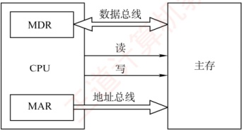
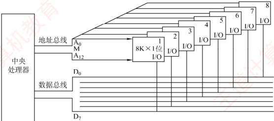
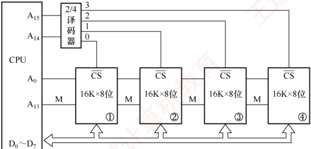
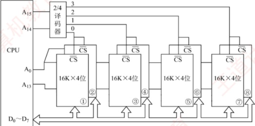

## 3.3 主存储器与 CPU 的连接

### 3.3.1 连接原理

主存储器通过数据总线、地址总线和控制总线与CPU相连，三者协同完成数据传输、地址定位与操作控制。数据总线的位数与其工作频率共同决定数据传输速率，其乘积正比于理论带宽；地址总线的位数决定了CPU可寻址的最大内存空间。控制线因存储器类型而异：SRAM芯片通常包含片选和读/写控制信号线；ROM芯片仅需片选线；DRAM芯片一般不设独立片选线，其芯片选择可通过行/列地址选通或外部译码逻辑实现。主存储器与CPU的连接如图3.11所示。



图 3.11 主存储器与 CPU 的连接

由于单个存储芯片的容量有限，实际系统中需通过存储器扩展技术将多个芯片集成在内存条上，并结合主板上的 ROM，共同构成计算机所需的主存空间，再经由系统总线与 CPU 连接。

### 3.3.2 主存容量的扩展

当单个存储芯片的字数（存储单元数量）或字长（每个存储单元的位数）无法满足实际主存需求时，需要在位和字两个方向进行扩展，以构建所需容量的存储器。
#### 1. 位扩展法

位扩展用于增加存储字的长度，适用于 CPU 数据总线宽度大于单个芯片数据位宽的情况。通过并联多个芯片，使其总数据位宽与 CPU 总线匹配。

连接方式：各芯片的地址线、片选线和读/写控制线并联，接至系统对应总线；数据线单独引出，分别连接到系统数据总线的不同位。所有芯片同时工作，共同提供一个完整字。
```c

如图3.12所示，使用8片8K×1位的RAM芯片构成8K×8位的存储器。各芯片的地址线A_{12}～A_{0}、片选线和读/写控制线均连在一起，每片的数据线依次对应CPU数据总线的一位。
```



图 3.12 位扩展连接示意图

#### 2. 字扩展法

字扩展用于增加存储单元的数量（扩大地址空间），而存储字的位数已满足系统要求。此时，系统数据总线宽度等于芯片数据位宽，而地址总线位数多于芯片地址线位数。

连接方式：各芯片的地址线连接至系统地址总线的低位；数据线和读/写控制线并联至系统总线；系统地址总线的高位经译码器生成片选信号，分时选中不同芯片。各芯片分时工作。

### 考点追踪 字扩展（或字位扩展）后存储芯片的地址范围（2010、2016）

如图 3.13 所示，用 4 片 16K×8 位的 RAM 芯片构成 64K×8 位的存储器。所有芯片的数据线  $D_0 \sim D_7$ 并联至系统数据总线。地址线  $A_{15}A_{14}$ 作为高位地址输入译码器，产生 4 个片选信号： $A_{15}A_{14} = 00$ 时，译码器输出端 0 有效，选中 1 号芯片； $A_{15}A_{14} = 01$ 时，译码器输出端 1 有效，选中 2 号芯片，以此类推（同一时刻只能有一个芯片被选中）。各芯片的地址分配如下：

第一片，最低地址：00000000000000000；最高地址：001111111111111111（16位）

第二片，最低地址：01000000000000000；最高地址：01111111111111111

第三片，最低地址：10000000000000000；最高地址：10111111111111111

第四片，最低地址：11000000000000000；最高地址：11111111111111111



图 3.13 字扩展连接示意图

#### 3. 字位同时扩展法

当芯片的字长和容量均不足时，需同时进行位扩展和字扩展。该方法将位扩展后的芯片组视为一个逻辑单元，再对这些单元进行字扩展。

连接方式：先将若干芯片按位扩展方式组成一组（满足字长要求）；再将多组按字扩展方式连接；系统地址线低位接各组内部芯片的地址引脚，高位经译码器生成各组的片选信号。
```c

如图 3.14 所示，用 8 片 16K×4 位的 RAM 芯片构成 64K×8 位的存储器。每 2 片组成一组（位扩展为 16K×8 位），共 4 组。地址线 A_{15}A_{14} 经译码器产生 4 个片选信号：当 A_{15}A_{14} = 00 时，选中第一组（芯片①和②）；当 A_{15}A_{14} = 01 时，选中第二组（芯片③和④）；以此类推。
```



图 3.14 字位同时扩展及 CPU 的连接图
