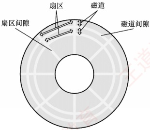
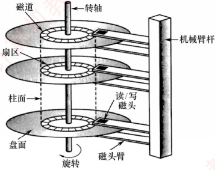
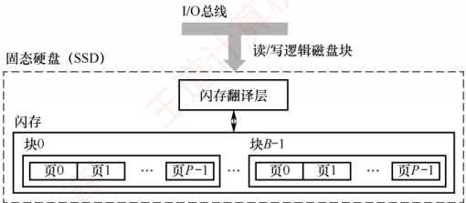

## 3.4 外部存储器

### 3.4.1 磁盘存储器

磁盘存储器采用磁盘作为存储介质，具有以下优点：①存储容量大，成本低；②支持数据的重复写入和删除；③能长期保存信息，即使脱机也能存档；④读取操作是非破坏性的，无须再生数据。然而，其缺点包括存取速度较慢、机械结构复杂以及对工作环境要求较高。

#### 1. 磁盘存储器

### 考点追踪 磁盘存储器的相关概念（2019）

#### （1） 磁盘设备的组成

① 磁盘存储器的组成。磁盘存储器由磁盘驱动器、磁盘控制器和盘片组成。

● 磁盘驱动器。驱动磁盘旋转并通过磁头在盘面上执行读/写操作，如图 3.15 所示。

● 磁盘控制器。磁盘驱动器与主机之间的接口，负责接收并解析来自 CPU 的命令，向磁盘驱动器发送控制信号，同时监控其运行状态。

(a) 磁盘盘片

(b)磁盘的组成

图 3.15 磁盘驱动器示意图

②存储区域。磁盘由多个记录面组成，每面含若干同心磁道，每条磁道划分为若干扇区。

记录面数：表示磁头数量，每个磁头负责一个记录面的数据读/写。

柱面数：表示单个记录面上的磁道数量。所有记录面上相同编号的磁道构成一个柱面。

● 扇区数：表示每条磁道所包含的扇区数量。扇区是磁盘读/写的最小单位。

相邻的磁道和扇区之间通过间隙隔开，以防止读/写错误。扇区按固定圆心角度划分，导致从外到内的位密度逐渐增加，磁盘的存储能力受限于最内圈的最大记录密度。

③ 磁盘高速缓存（Disk Cache）。在内存中开辟一部分空间，用于暂存待写入磁盘的数据。优点：磁盘以“簇”（由若干连续扇区组成）为单位进行写操作，缓存可减少频繁的小块写入；同时，中间结果若在写回前被再次使用，可直接从缓存读取，提升效率。

#### （2）磁记录原理

原理：当磁头和磁性记录介质发生相对运动时，通过电磁转换实现数据的读/写操作。

编码方法：按照特定规则，将二进制数据序列转换为磁层中对应的磁化翻转状态序列，以便读/写控制电路能够高效、可靠地完成信号转换。

#### （3）磁盘的性能指标

① 记录密度。指单位面积上可存储的二进制数据量，通常以道密度、位密度和面密度表示。道密度是沿磁盘半径方向单位长度上的磁道数；位密度是单条磁道单位长度上可记录的二进制位数；面密度是位密度与道密度的乘积，反映单位面积的存储能力。

②磁盘的容量。分为非格式化容量和格式化容量。非格式化容量是指磁记录表面可利用的磁化单元总数，非格式化容量=记录面数×柱面数×每磁道磁化单元数。格式化容量是指按特定格式组织后实际可用的存储容量，格式化容量=记录面数×柱面数×每道扇区数×每扇区字节数。非格式化容量>格式化容量，因需预留扇区间隙、同步字段等格式开销。

### 考点追踪 磁盘存取时间的计算（2013、2015、2022）

③响应时间与存取时间。磁盘处理一次读/写请求的完整过程包括请求排队、控制器解析以及三个关键物理操作：寻道、旋转等待和数据传输。因此，总响应时间为

响应时间 = 排队延迟 + 控制器时间 + 寻道时间 + 旋转等待时间 + 数据传输时间

其中，“寻道时间 + 旋转等待时间 + 数据传输时间”也称存取时间，特指从磁头定位开始到数据传输完成所需的时间，是衡量磁盘性能的核心指标。

寻道时间：磁头移动到目标磁道所需时间。平均寻道时间通常取最大寻道时间的一半（从最外道到最内道时间的1/2）。
旋转等待时间：目标扇区旋转至磁头下方所需时间。平均旋转等待时间等于磁盘旋转半周的时间。

数据传输时间：读取或写入一个扇区所需时间，取决于磁盘转速和数据密度。

④ 数据传输速率。指磁盘在单位时间内向主机传送的数据量（单位为 B/s）。若磁盘转速为 r 转/秒，单磁道容量为 N 字节，则最大数据传输速率为

 $$D_{r}=rN$$

#### （4）磁盘地址

### 考点追踪 磁盘地址结构的计算（2022）

主机向磁盘控制器发送寻址信息，磁盘地址通常由三部分组成，如下图所示。

| 柱面（磁道）号 | 盘面（磁头）号 | 扇区号 |
| --- | --- | --- |

例如，磁盘有16个盘面，每个盘面有256个磁道，每个磁道划分为16个扇区，则每个扇区的地址可用16位二进制代码表示：其中柱面号占8位，盘面号占4位，扇区号占4位。

#### (5) 磁盘的工作过程

#### 2. 磁盘阵列

磁盘的主要操作包括寻址、读盘和写盘。每种操作对应一个控制字。磁盘工作时，首先读取控制字，然后执行该控制字。由于磁盘是机械式部件，因此其读/写操作为串行执行。

RAID（独立冗余磁盘阵列）是指将多个独立的物理磁盘组合成一个逻辑磁盘，数据在多个物理盘上交叉分割存储并并行访问，从而获得更高的存储性能、可靠性与安全性。

### 考点追踪 提高 RAID 可靠性的措施（2013）

RAID 的分级如下所示。在 RAID1～RAID5 等方案中，当任意磁盘发生故障时，可随时拔出损坏磁盘并插入新盘，系统仍能恢复或维持数据完整性，显著提升了可靠性。

RAID0：无冗余、无校验的磁盘阵列。

RAID1：镜像磁盘阵列。

RAID2：采用海明码进行纠错的磁盘阵列。

RAID3：位交叉奇偶校验的磁盘阵列。

RAID4：块交叉奇偶校验的磁盘阵列。

RAID5：无独立校验盘的分布式奇偶校验磁盘阵列。

RAID0 将连续的多个数据块交替存放在不同物理磁盘的扇区中，利用多个磁盘交叉并行读/写，即条带化技术，不仅扩展了存储容量，还显著提高了存取速度，但不具备容错能力。

为提高可靠性，RAID1 通过两个磁盘同步进行读/写操作，互为镜像备份。当一个磁盘故障时，可从另一磁盘完整读取数据。其代价是有效容量减半（两盘仅当一盘使用）。

总之，RAID 通过多磁盘并行工作提升数据传输速率；通过并行存取大幅提高存储系统的吞吐量；通过镜像实现高可用性；通过校验机制提高容错能力。

### 3.4.2 固态硬盘

#### 1. 固态硬盘的特性

固态硬盘（SSD）是一种基于闪存技术的存储设备。其存储介质与U盘类似，但容量更大、存取性能更优。一个SSD由一个或多个闪存芯片以及闪存翻译层组成，如图3.16所示。其中，闪存芯片替代了传统磁盘中的机械驱动器；而闪存翻译层负责将CPU发出的逻辑块读/写请求转
换为对底层物理闪存的读/写控制信号，因此，闪存翻译层相当于代替了磁盘控制器的角色。

图 3.16 固态硬盘（SSD）结构组成

一个闪存芯片由 B 个块组成，每个块包含 P 页。通常，页的大小为 512B～4KB，每块包含 32～128 页，块的大小为 16KB～512KB。读/写操作以页为单位进行；擦除操作以块为单位进行，只有在整块被擦除后，才能向其中的页写入新数据。一旦某块被擦除，其所有页均可重新写入一次。每个块的擦写次数有限，经过若干重复写入后，该块会因磨损而失效。

随机写入速度较慢，主要有两个原因：① 擦除操作耗时较长，通常比页访问慢一个数量级。② 若需修改一个已包含有效数据的页  $P_{i}$，必须先将该块中所有有效页复制到一个新的（已擦除的）块中，再执行对  $P_{i}$ 的写入。

相比传统机械磁盘，SSD 具有显著优势：由半导体器件构成，无机械运动部件，因此随机访问延迟极低，且无噪声、无振动、功耗更低、抗震性强、安全性更高。

#### 2. 磨损均衡（Wear Leveling）

SSD 的主要缺点在于闪存的擦写寿命有限，通常仅为几百至几千次。若直接用普通闪存构建 SSD 而不加管理，则实际的寿命表现可能令人失望——因为读/写操作往往会集中在少数物理块上，导致这些区域迅速磨损。一旦这部分闪存损坏，整块 SSD 即告失效。这种磨损不均衡的情况，可能导致一块 256GB 的 SSD，仅因几兆字节的闪存损坏而报废。

为解决这一问题，SSD 引入了磨损均衡技术，主要分为两类：

1）动态磨损均衡。在写入数据时，优先选择擦写次数较少的空闲块，避免反复写入同一区域，从而将写入负载分散到更多物理块上。

2）静态磨损均衡。这是一种更高级的策略。即使没有新数据写入，控制器也会定期扫描并自动进行数据迁移，将高磨损块中的有效数据迁移到低磨损块中。使高磨损块转为以读为主，低磨损块承担更多写入任务，进一步均衡整体寿命。

得益于磨损均衡算法，SSD 的实际使用寿命显著提升。例如，一块 256GB 的 SSD，若其闪存的擦写寿命为 500 次，则理论总写入量可达 125TB。即使每天持续写入 10GB 数据，也需要三十多年才会达到寿命极限。而日常使用中，普通用户的日均写入量通常远低于此值。
