## 3.5 高速缓冲存储器

程序的转移概率通常较高，数据分布也较为离散，因此单纯依赖并行主存系统来提升主存效率是有限的。高速缓存（Cache）具有比主存更快的访问速度，因此在 CPU 与主存之间设置 Cache 可以显著提升存储系统的整体效率。Cache 由 SRAM 组成，通常集成在 CPU 内部。

### 3.5.1 程序访问的局部性原理

Cache 的设计基于程序访问的局部性原理，包括时间局部性和空间局部性。

### 考点追踪 分析给定代码的时空局部性（2017、2023）

时间局部性是指如果某条指令或数据项当前被访问，则在不久的将来很可能再次被访问。这源于程序中存在循环、重复调用的子程序，以及对同一数据的多次操作。空间局部性是指如果某存储单元被访问，则其邻近的存储单元在不久的将来很可能也被访问。这是因为指令通常顺序存放并顺序执行，而数据（如数组、向量）也往往以连续块的形式存储。

高速缓冲技术正是利用局部性原理，将程序当前活跃的部分数据暂存于容量小但速度极快的Cache中，使CPU的多数访存操作直接在Cache中完成，从而显著提升程序执行效率。

【例3.1】假设数组元素按行优先方式存储，对于以下两个程序：

程序A:

```c
int sumarrayrows(int a[M][N])
{
    int i, j, sum = 0;
    for (i = 0; i < M; i++)
        for (j = 0; j < N; j++)
            sum += a[i][j];
    return sum;
}

程序B:

int summarraycols(int a[M][N])
{
    int i, j, sum = 0;
    for (j = 0; j < N; j++)
        for (i = 0; i < M; i++)
            sum += a[i][j];
    return sum;
}
```

1）对于数组 a 的访问，哪个程序的空间局部性更好？哪个时间局部性更好？

2）对于指令访问，for 循环体的空间局部性和时间局部性如何？

解：假设 M 和 N 均为 2048，按字节编址，每个数组元素占 4 字节，则指令和数据在主存中的存放情况如图 3.17 所示。

### 考点追踪 ▶ 数组按行或列访问的命中率分析（2010），数组循环访问的命中率分析（2016、2020）

1）对于数组 a，程序 A 和程序 B 的空间局部性差异显著。

程序 A 按行访问：a[0][0], a[0][1],⋯, a[0][2047]; a[1][0], a[1][1], ⋯, a[1][2047]; ⋯。访问顺序与存放顺序是一致的，由于连续访问的元素位于相邻地址，空间局部性良好。
程序 B 按列访问：a[0][0]，a[1][0], $\cdots$，a[2047][0]；a[0][1]，a[1][1], $\cdots$，a[2047][1]； $\cdots$。访问顺序与存放顺序不一致，每次访问均需跨越 2048 个元素，即 8192 字节，若主存与 Cache 的交换单位小于 8KB，则每次访问几乎都落在不同的 Cache 行中，空间局部性极差。

两个程序中，数组 a 的时间局部性均较差，因为每个数组元素仅被访问一次。

### 考点追踪 程序中指令 Cache 的命中率分析（2014）

2）对于 for 循环体的指令访问，程序 A 与程序 B 的局部性表现相同。因为循环体内的指令在内存中连续存放，顺序执行，空间局部性良好；整个循环共执行  $2048 \times 2048$ 次，时间局部性良好。

综上，尽管程序 A 与程序 B 功能完全相同，但由于内外循环顺序不同，导致对数组 a 访问的空间局部性存在巨大差异，进而造成实际执行效率的显著不同。

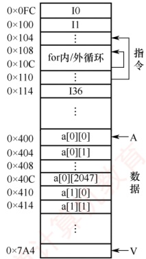

图3.17 指令和数据在主存的存放

### 3.5.2 Cache 的基本工作原理

为便于 Cache 与主存交换信息，Cache 和主存都被划分为大小相等的块，Cache 块也称 Cache 行，每块由若干字节组成，块的长度称为块长（也称行长）。因为 Cache 的容量远小于主存的容量，所以 Cache 中的块数要远少于主存中的块数，Cache 中仅保存主存中最活跃的若干块的副本。因此，可按照某种策略预测 CPU 在未来一段时间内待访存的数据，将其装入 Cache。

#### 1. Cache 的访问过程

### 考点追踪 Cache 命中对 CPU 执行时间影响的分析（2013、2015）

图 3.18 所示为典型的 Cache 访问流程。CPU 执行程序时，每当需要从主存取指令或读/写数据，

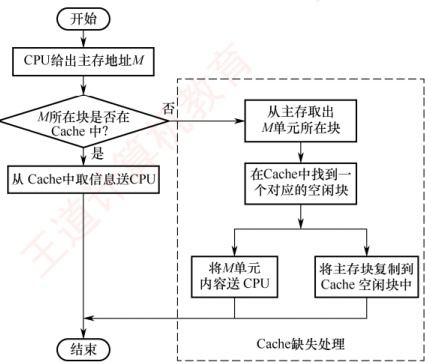

图 3.18 典型的 Cache 访问流程

首先访问 Cache。若所需信息已在 Cache 中（称为 Cache 命中），则直接从 Cache 读取，无须访问主存；若未命中（也称缺失），则需从主存中将该地址所在的一个主存块整体调入 Cache，并将该块写入一个 Cache 行（若 Cache 已满，则按替换算法选择被替换块）。此后，CPU 再从 Cache 中获取所需数据。整个访问过程（包括命中判断、块调入、替换等）必须在单条指令执行周期内完成，因此完全由硬件实现。Cache 机制对程序员是透明的。

上述访问流程是先查 Cache，未命中再访主存，这是统考真题遵循的方式。部分系统采用“并行访问”策略（同时查 Cache 和主存），若命中，则提前终止主存访问，但考试中通常不涉及。

#### 2. Cache 的命中率分析

### 考点追踪 Cache 命中率的分析与计算（2009、2025）

CPU 所需访问的信息已在 Cache 中的概率称为 Cache 命中率。设某程序执行期间，Cache 命
中次数为  $N_{c}$，访问主存的次数为  $N_{m}$（未命中次数），则命中率 H 定义为

 $$H=N_{c}/(N_{c}+N_{m})$$

命中时：CPU 直接从 Cache 读取数据，耗时为命中时间  $T_{c}$（访问 Cache 的时间）。

未命中时：需先从主存读取包含目标数据的一个主存块送入 Cache，再将所需数据送至 CPU，总耗时为  $T_{m} + T_{c}$。其中  $T_{m}$ 称为缺失损失，即从主存调入一个块所需的时间。

因此，Cache-主存系统的平均访问时间  $T_{a}$

 $$T_{a}=H T_{c}+(1-H)(T_{m}+T_{c})=T_{c}+(1-H)T_{m}$$

### 考点追踪 Cache 缺失率对主存带宽的影响（2012）

【例3.2】假设 Cache 的速度是主存的 5 倍，且 Cache 的命中率为 95%，则采用 Cache 后，存储器性能提升多少（假设系统先访问 Cache，未命中时才访问主存）？

解：设 Cache 的存取时间为 t，则主存的存取时间为 5t。系统的平均访问时间 T 为

T = 命中时的访问时间  $\times$ 命中率 + 缺失时的访问时间  $\times$ 缺失率

 $$=0.95\times t+0.05\times(t+5t)=1.25t$$

或等价地

T = 命中时的访问时间 + 缺失时的访存开销×缺失率 =  $t + 0.05 \times 5t = 1.25t$

可见，采用 Cache 后，存储器性能提升至原来的  $5t/1.25t=4$ 倍。

根据 Cache 的读、写流程可知，实现 Cache 时需解决以下关键问题：

1）数据查找。如何快速判断所需数据是否在 Cache 中。

2）地址映射。主存块如何存放在 Cache 中，以及如何将主存地址转换为 Cache 地址。

3）替换策略。当 Cache 已满时，采用何种策略选择被替换的 Cache 行。

4）写入策略。如何在保证主存与 Cache 数据一致性的前提下，尽可能提升写操作效率。

### 3.5.3 Cache 和主存的映射方式

由于 Cache 行数远少于主存块数，Cache 只能存放主存中部分块的副本。为识别每个 Cache 行对应哪个主存块，需要为每行设置一个标记位，记录其主存块编号。同时设置一位有效位，用于指示该行数据是否有效。系统启动或复位时，所有 Cache 行均无效；仅当主存块被装入某 Cache 行后，其有效位才置为 1。

地址映射是指将主存地址空间按一定规则映射到 Cache 地址空间，即决定主存块如何装入 Cache。常见的映射方式有三种，包括直接映射、组相联映射和全相联映射。

#### 1. 直接映射

主存中的每一块只能装入 Cache 中的唯一指定位置。若该位置已有内容，则发生块冲突，原块将被无条件替换（无须替换算法）。直接映射实现简单，但灵活性差，即使 Cache 中其他行空闲，也不能用于存放该主存块，因此块冲突概率最高，空间利用率最低。

 $$\text{考点追踪} \quad \gg 直接映射的地址结构及映射关系的分析（2010、2011、2015）$$

直接映射关系可表示为

 $$\mathrm{Cache~ 行号 }=\mathrm{ 主存块号 }\mathrm{mod}\mathrm{Cache}\mathrm{ 总行数 }$$

设 Cache 共有  $2^c$ 行，主存共有  $2^m$ 块。则主存的第 0 块、第  $2^c$ 块、第  $2^{c+1}$ 块……均映射到 Cache 的第 0 行；主存的第 1 块、第  $2^c + 1$ 块、第  $2^{c+1} + 1$ 块……均映射到 Cache 的第 1 行，以此类推。
由此可见，主存块号的低c位即为其对应的 Cache 行号。

为标识来源，每个 Cache 行设置一个长度为  $t = m - c$ 的标记。当某主存块调入 Cache 后，将其块号的高  $t$ 位存入对应 Cache 行的标记字段中，如图 3.19(a) 所示。

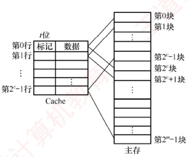

(a) Cache和主存之间的映射关系

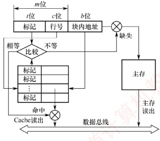

(b) CPU访存过程

图 3.19 Cache 和主存之间的直接映射方式

直接映射的地址结构如下

| 标记 | Cache 行号 | 块内地址 |
| --- | --- | --- |

CPU 访存过程：根据访存地址中间的 c 位确定 Cache 行，将该 Cache 行中的标记与主存地址的高 t 位进行比较，若标记相等且有效位为 1，则 Cache 命中，根据地址低位的块内地址从该 Cache 行中读取数据；若标记不等或有效位为 0，则 Cache 未命中，CPU 需从主存读取该地址所在块，将其装入对应 Cache 行，置有效位为 1，更新标记为地址高 t 位，并将所需数据送至 CPU。

#### 2. 全相联映射

主存中的每一块可以装入 Cache 中的任何位置，如图 3.20 所示。每行的标记用于指出该行来自主存的哪一块，因此 CPU 访存时需要与所有 Cache 行的标记进行比较。优点：① Cache 块的冲突概率低，只要有空闲 Cache 行，就不会发生冲突；② 空间利用率高；③ 命中率高。缺点：① 标记的比较速度较慢；② 实现成本较高，通常需采用按内容寻址的相联存储器。

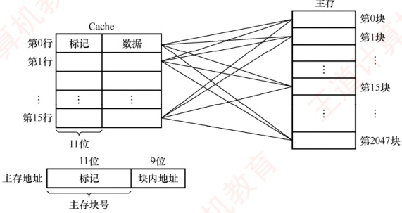

图 3.20 Cache 和主存之间的全相联映射方式

全相联映射的地址结构如下

| 标记 | 块内地址 |
| --- | --- |

CPU 访存过程：首先将主存地址的高位标记（位数 =  $\log_2$ 主存块数）与 Cache 各行的标记进行比较。若有一个相等且对应有效位为 1，则 Cache 命中，此时根据块内地址从该 Cache 行中取出信息；若都不相等或有效位为 0，则 Cache 未命中，此时 CPU 从主存中读出该地址所在的一块信息装入 Cache 的任意一个空闲行，置有效位为 1，并设置标记，同时将所需数据送至 CPU。

### 考点追踪 根据地址结构和比较器数量判断映射方式（2018）

通常为每个 Cache 行都设置一个比较器，比较器的位数等于标记字段长度。访存时根据标记字段的内容访问 Cache 行中的主存块，因此其查找过程是一种按内容访问的存取方式，属于相联存储器。这种方式的时间开销和硬件开销都较大，不适合大容量 Cache。

#### 3. 组相联映射

### 考点追踪 ▶️ 组相联映射的原理（2009、2016、2018～2020、2023）

将 Cache 划分为 Q 个大小相等的组，每个主存块只能映射到固定组中的任意一行，即组间采用直接映射，组内采用全相联映射，如图 3.21 所示。它是直接映射与全相联映射的一种折中方案：当 Q = 1（整个 Cache 为一个组）时，退化为全相联映射；当 Q = Cache 总行数（每组仅 1 行）时，退化为直接映射。设每组包含 r 个 Cache 行，则称为 r 路径相联映射。

路数 r 越大，组内可选位置越多，块冲突概率越低，但所需的比较器数量和控制逻辑也越复杂。合理选择 r，可在硬件成本接近直接映射的同时，获得接近全相联映射的性能。

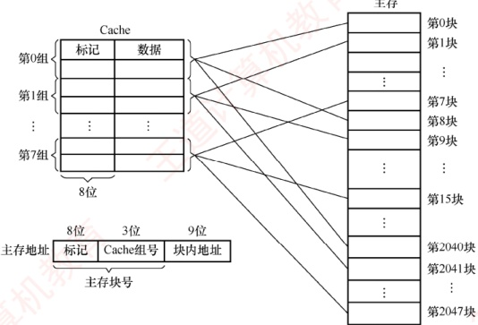

图 3.21 Cache 和主存之间的 2 路组相联映射方式

### 考点追踪 ▶️ 组相联映射的地址结构及映射关系的分析（2025）

组相联映射关系可表示为

 $$Cache 组号 = 主存块号 mod Cache 组数 (Q)$$

组相联映射的地址结构如下

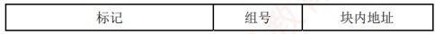

### 考点追踪 ▶️ 组相联映射的访存过程及 Cache 缺失处理过程（2020）

CPU 访存过程：首先根据访存地址中的组号字段确定目标 Cache 组；将该组内所有 Cache 行的标记与主存地址的高位标记并行比较；若某行标记匹配且其有效位为 1，则 Cache 命中，根据块内地址从该行读取数据；若所有行均不匹配或匹配行的有效位为 0，则 Cache 未命中，CPU
从主存读取该地址所在块，将其装入该组中任意一个空闲行（若无空闲行，则按替换算法选择一行），置有效位为1，写入标记，并将所需数据送至CPU。

### 考点追踪 ▶️ 组相联映射中比较器的个数和位数（2022）

直接映射中每块仅对应一个唯一的 Cache 行，因此只需设置 1 个比较器。而 r 路组相联映射需在同一组的 r 个 Cache 行中并行比较，因此需设置 r 个比较器。

在 Cache 容量和主存块大小固定的条件下，三种映射方式的特性对比如下：

1）命中率：直接映射最低，全相联映射最高。

2）判断开销与所需时间：直接映射最小、最快，全相联映射最大、最慢。

3）标记存储开销：直接映射最少，全相联映射最多。

### 3.5.4 Cache 中主存块的替换算法 $^{①}$

在采用全相联映射或组相联映射方式时，当向 Cache 传送一个新主存块而 Cache（或 Cache 组）已满，就需要使用替换算法选择被替换的 Cache 行。而在直接映射中，每个主存块只能映射到唯一的 Cache 行，因此当该行已被占用时，新块直接覆盖旧块，无须替换算法。

常用的替换算法包括随机、先进先出、最近最少使用和最不经常使用算法。

1）随机（RAND）算法：随机选择一个 Cache 行进行替换。实现简单，但未利用程序访问的局部性原理，命中率通常较低。

2）先进先出（FIFO）算法：替换最早装入的 Cache 行。实现较容易，但未考虑局部性原理，最早进入的块可能仍是当前热点数据，因此命中率不高。

### 考点追踪 ▶️ 组相联映射中 LRU 算法的命中率分析（2012、2021）

3）最近最少使用（LRU）算法：基于程序访问的局部性原理，优先替换最近最久未被访问的 Cache 行。其平均命中率通常高于 FIFO。LRU 算法是考查重点。

### 考点追踪 LRU 替换位及其位数的计算（2018、2020）

在硬件实现中，LRU 算法为每组 Cache 维护一组计数器（常称 LRU 替换位），用来记录各 Cache 行的相对访问顺序。LRU 位的位数取决于组的路数：2 路组相联需 1 位 LRU 位，4 路组相联需 2 位 LRU 位。假定采用 4 路组相联，5 个主存块 {1, 2, 3, 4, 5} 映射到同一 Cache 组，访问序列为 {1, 2, 3, 4, 1, 2, 5, 1, 2, 3, 4, 5}，LRU 替换过程如图 3.22 所示。图中左边阴影部分的数字表示对应 Cache 行的 LRU 计数值（反映最近访问顺序），右侧数字为主存块号。

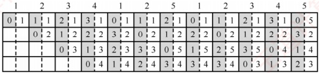

图 3.22 LRU 算法的替换过程示意图

计数器的更新规则：① 命中时，所命中行的计数器清零，比其低的计数器加1，其余不变；② 未命中且有空闲行时，新装入的行的计数器置0，其他非空闲行全加1；③ 未命中且无空闲行时，替换计数值最大（本例中为3）的行，新装入的行的计数器置0，其余全加1。

当被频繁访问的主存块数量超过 Cache 每组的行数时，可能导致持续缺失。例如，若访问序列变为 1, 2, 3, 4, 5, 1, 2, 3, 4, 5, …，而 Cache 每组仅有 4 行，则每次访问第 5 个块都会驱逐下一个
将被访问的块，导致命中率为0，这种现象称为抖动。

4）最不经常使用（LFU）算法：替换一段时间内累计访问次数最少的 Cache 行。每行设置一个计数器，新行装入时计数器初始化为 0，每次访问该行则计数器加 1；替换时选择计数值最小的行。LFU 与 LRU 的思想不同：LRU 关注最近是否用过，LFU 关注总共用了多少次。

### 3.5.5 Cache 的一致性问题

由于 Cache 中的内容是主存块的副本，当对 Cache 进行写操作时，必须采用适当的写策略以维持 Cache 与主存数据的一致性。根据写操作是否命中 Cache，可分为两类情况。所谓写命中是指 CPU 要写入的主存地址所在的块当前已在 Cache 中；反之则为写不命中。

#### 1. Cache 写命中的处理方法

### 考点追踪 直写法的原理及特点（2015、2020）

#### （1） 全写法（直写法，Write Through）

当 CPU 对 Cache 写命中时，数据同时写入 Cache 和主存。由于主存始终与 Cache 保持同步，因此在替换 Cache 块时，可直接覆盖，无须写回。该方法实现简单，能保证主存数据的实时正确性，但缺点是每次写操作都需访问主存，降低了系统性能。

为缓解直写法的性能开销，可在 Cache 与主存之间增设写缓冲（Write Buffer），如图 3.23 所示。CPU 将数据同时写入 Cache 和写缓冲，由写缓冲异步地将数据写入主存。写缓冲可缓解 CPU 与主存之间的速度差异。但在高频率写操作下，写缓冲可能饱和甚至溢出。

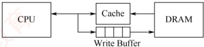

图 3.23 在 Cache 和主存之间加一个写缓冲

### 考点追踪 回写法的原理及应用（2018、2020）

#### （2） 回写法（Write Back） $^{①}$

当 CPU 对 Cache 写命中时，仅将数据写入 Cache，不立即写入主存，仅在该块被替换出 Cache 时才写回主存。这种方法减少了主存访问次数，提高了 Cache 效率，但存在数据不一致的风险。为避免不必要的写回操作，每个 Cache 行设置一个修改位（又称脏位）：若修改位为 1，表示该行数据已被修改，替换时必须写回主存；若修改位为 0，表示该行数据与主存一致，替换时可直接覆盖。需要注意的是，直写法无须脏位，因为主存始终同步；回写法则必须设置脏位。

#### 2. Cache 写不命中的处理方法

##### （1） 写分配法（Write Allocate） $^{②}$

当发生写不命中时，先将数据写入主存的对应单元，然后将该主存块调入 Cache 的一个空闲行中。该方法利用了程序的空间局部性，但每次写不命中都要将主存块加载到 Cache 中。

##### （2） 非写分配法（Not-Write-Allocate）

当发生写不命中时，直接将数据写入主存，不将主存块调入 Cache。

### 3.5.6 Cache 容量的计算举例

在计算 Cache 总容量时，需考虑 Cache 行的数据部分和每行的标记信息，即 Cache 总容量 = (每行标记位数 + 每行数据位数) × Cache 总行数
### 考点追踪 Cache 标记信息的分析（2015、2021）

每行的标记信息通常包括：有效位、标记位、脏位和 LRU 替换位。其中，有效位和标记位是所有 Cache 必须包含的；脏位仅在采用回写策略时存在；LRU 替换位仅在使用 LRU 算法时存在，其位数取决于组内行数。图 3.24 展示了不同映射方式下 Cache 各字段的组成与分布。

1位 1位  $\log_{2}$ (组内块数)

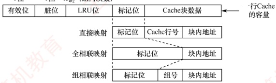

图 3.24 不同映射方式下 Cache 各字段的组成与分布

### 考点追踪 标记位分析及总容量的计算（2010、2021）

【例 3.3】假设某计算机的主存地址空间大小为 256MB，按字节编址，其数据 Cache 有 8 个 Cache 行，行长为 64B。请回答：

1）若不考虑脏位和替换算法控制位，并采用直接映射方式，求该数据 Cache 的总容量？

2）若采用直接映射方式，主存地址为3200（十进制）的主存块对应的 Cache 行号是多少？若采用 2 路组相联映射，对应的 Cache 组号及可能的行号是多少？

3）以直接映射方式为例，简述访存过程（设访存地址为0123456H）。

1）Cache 总容量 = 数据信息容量 + 标记信息容量（包括有效位和标记位）。本题不考虑脏位和替换算法控制位。主存地址位数为 28 位（主存地址空间为  $256\text{MB} = 2^{28}\text{B}$）；块内地址位数为 6 位（行长  $64\text{B} = 2^{6}\text{B}$）；Cache 行号为 3 位（Cache 行数  $8 = 2^{3}$）。标记信息位数 = 28 - 6 - 3 = 19 位。每行含 1 位有效位 + 19 位标记位 = 20 位标记信息。每行数据部分为  $64\text{R} = 512$ 位。因此，Cache 总容量为  $8 \times (512 + 1 + 19) = 4256$ 位。

2）主存地址 3200 对应的块号为 3200B/64B=50。在直接映射方式中，Cache 有 8 行，行号 =50 mod 8 =2，故对应的 Cache 行号为 2。

在组相联映射方式中，组内采用全相联映射，组外采用直接映射，组号 =50 mod 4 =2，即该块可映射到第2组中的任意一行，对应的 Cache 行号为 4 或 5。

3）在直接映射方式中，28位主存地址可分为19位的标记位，3位的块号，6位的块内地址，即0000000100100011010为标记位，001为块号，010110为块内地址。

访存过程：根据行号010访问Cache第2行，比较其标记与地址高19位，并检查有效位：若匹配且有效位为1，则命中，按块内地址010110读取数据并送至CPU；否则未命中，从主存读取该块，写入Cache第2行，更新标记为地址高19位，并置有效位为1。

思考：若1）问中采用2路组相联映射方式，则Cache总容量是多少？结合主存与Cache的划分关系，推导2路组相联映射下的主存地址结构，并简述其访存过程。

### 3.5.7 Cache 的应用

#### (1) 分离 Cache

### 考点追踪 采用分离的指令与数据 Cache 的目的（2014）

随着指令流水技术的发展，现代处理器通常将指令 Cache 和数据 Cache 分开设计，形成分离
的 Cache 结构。统一 Cache 的优点在于其设计和实现相对简单，但在流水线执行中，取指部件和执行部件同时访问同一 Cache 时容易产生冲突。通过采用分离 Cache 结构，不仅可以消除这类冲突，还能针对指令和数据的不同局部性特征进行优化，从而提升整体性能。

#### （2） 多级 Cache

现代计算机普遍采用多级 Cache 结构。以两级为例，按距离 CPU 的远近分别称为 L1 Cache 和 L2 Cache：L1 离 CPU 最近，速度最快、容量较小；L2 则较远，速度较慢、容量较大。通常情况下，L1 级会采用分离的指令 Cache 和数据 Cache 设计，其中 L1 数据 Cache 在写操作中采用写分配法（写不命中时加载块）与回写法（写命中时不立即写主存）相结合的策略。图 3.25 展示了一个典型的两级 Cache 系统。通常，L1 和 L2 Cache 均采用回写法，当 L1 发生写命中时，仅更新 L1；当 L1 块被替换时，若为脏块，则写回 L2；L2 同理，在替换时写回主存。由于 L2 Cache 的访问速度远高于主存，L1 无须在写命中时访问主存，仅更新本地 Cache 即可快速完成写操作；后续的脏块写回由 L2 高效承接，从而有效避免因频繁写操作导致的写缓冲饱和或溢出问题。

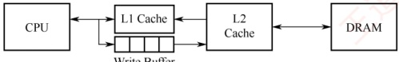

图 3.25 一个含有两级 Cache 的系统
