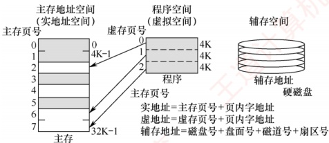
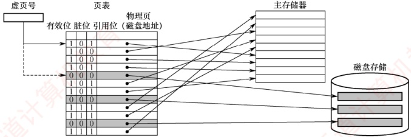
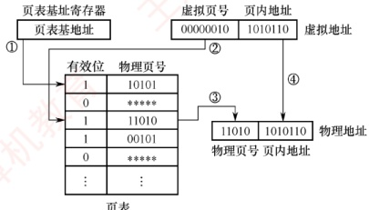
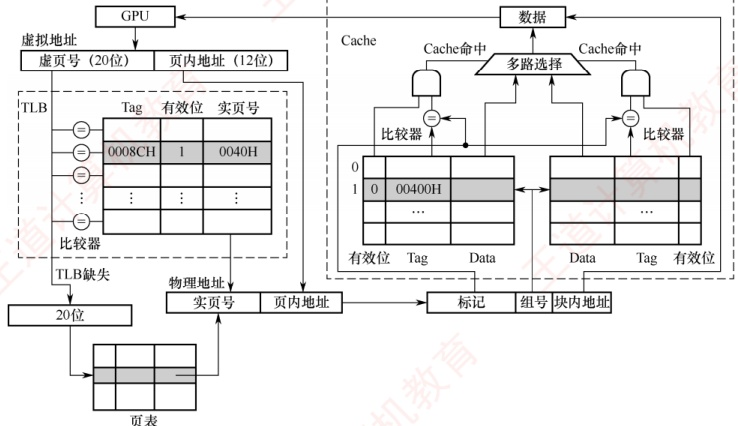
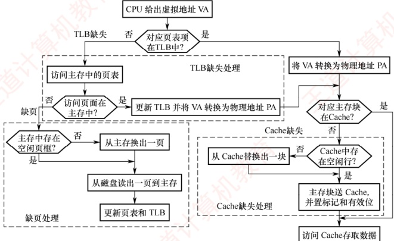
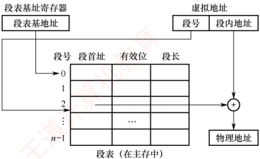

## 3.6 虚拟存储器

虚拟存储器是一种由硬件与系统软件协同实现的存储管理机制，它利用主存和辅存（如磁盘）构建一个逻辑上连续且容量巨大的地址空间。对于应用程序员而言，该机制是透明的：程序可按此虚拟地址空间编写，无须关心实际主存容量或数据在主存中的物理位置。

### 3.6.1 虚拟存储器的基本概念

虚拟存储器将程序的地址空间（称为虚拟地址空间或逻辑地址空间）与主存的物理地址空间分离。用户程序使用的地址称为虚地址（或逻辑地址），而实际主存单元的地址称为实地址（或物理地址）。通常，虚地址空间远大于实地址空间，如图3.26所示。

图 3.26 虚拟存储器的地址空间

当 CPU 使用虚地址访问内存时，系统首先判断该虚地址对应的数据是否已驻留在主存中。若已驻留，则通过地址变换机制将其转换为实地址，CPU 即可直接访问对应的主存单元；若未驻留，则触发缺页（或缺段）异常，由操作系统将包含该地址的整个页（或段）从辅存调入主存，之后 CPU 再进行访问。若主存已满，则需根据替换算法选择一个页面进行置换。

### 考点追踪 虚拟存储器只能采用回写法的原因（2016）

虚拟存储器借鉴了 Cache 的思想，将辅存中频繁访问的数据缓存在主存中。由于辅存（如磁盘）访问延迟极高，每次写操作都同步更新辅存是不可行的。因此，系统采用类似回写的策略：当页面被修改时，标记为脏页；仅在该页被置换出主存时，若为脏页，才将其写回辅存。这显著降低了 I/O 开销。此外，虚拟存储器的分页机制允许任一虚页装入主存中任意可用的物理页框（类似于全相联映射），从而提高主存利用率，并支持高效的地址重定位。

### 3.6.2 页式虚拟存储器 $^{①}$

页式虚拟存储器以页为基本单位。主存空间和虚拟地址空间均被划分为大小相同的页。主存中的页称为物理页（或实页、页框），虚拟地址空间中的页称为虚拟页（或虚页）。页表记录了每个虚页在主存中的映射位置，通常常驻内存。
#### 1. 页表

图3.27是一个页表示例。有效位（也称装入位），表示对应虚页是否已调入主存，若为1，表示该页已在主存，页表项中存放其物理页号；若为0，表示未调入，页表项通常存放该页在外存（如磁盘）中的地址。脏位（也称修改位），表示页面是否被修改过，在采用回写策略的虚拟存储系统中，置换页面时根据脏位决定是否需将其写回磁盘。引用位（也称使用位），记录页面是否被访问过，主要用于实现基于使用历史的页面替换算法（如Clock或LRU算法）。

图 3.27 主存中的页表示例

考点追踪 ▶️ 数组的分页存放、缺页分析与处理过程（2014、2019、2023、2025）

以图 3.27 的页表为例，若 CPU 访问第 1 页，有效位为 1，说明该页已驻留主存。地址转换部件将虚拟地址转换为物理地址，CPU 即可访问对应的物理页中的数据。若访问第 5 页，有效位为 0，则发生缺页异常，系统调用缺页处理程序。该程序根据页表项中的外存地址，将该页从磁盘调入一个空闲的物理页框。若主存已满，则需选择一个页面进行置换；由于系统采用回写策略，换出页面时根据脏位决定是否写回磁盘。缺页处理完成后，更新页表中的相应项。

页式虚拟存储器的优点是：页面大小固定，页表结构简单，调入操作方便。缺点是：程序大小通常不是页长的整数倍，导致最后一页产生内部碎片；此外，页是物理划分单位，缺乏逻辑意义，因此在程序模块化、保护和共享方面不如段式虚拟存储器灵活。

#### 2. 地址转换

### 考点追踪 虚拟地址结构的分析（2011、2019、2021、2024）

程序生成的地址为虚拟地址，CPU执行指令时，必须先将其转换为物理地址，才能访问主存中的指令或数据。虚拟地址分为两部分：高位为虚页号，低位为页内偏移；物理地址同样分为高位物理页号和低位页内偏移。由于页面大小相同，两者的页内偏移完全一致。虚拟地址到物理地址的转换通过页表实现，页表是一张存放在主存中的虚页号与物理页号的映射表。

### 考点追踪 虚拟地址与物理地址的转换（2011、2013、2018、2022）

系统通过页表基址寄存器指向当前进程的页表起始地址（对应①）。地址转换时，首先从虚拟地址中提取虚页号（对应②），以此作为索引查找页表项；若该页表项的有效位为1，则从中取出物理页号（对应③），并与虚拟地址中的页内偏移拼接，形成最终的物理地址（对应④）。若有效位为0，则发生缺页异常，需由操作系统进行缺页处理。页式虚拟存储器的地址变换过程如图3.28所示。

图3.28 页式虚拟存储器的地址变换过程

#### 3. 快表（TLB）

由地址转换过程可知，每次访存需先访问主存中的页表以获取物理页号，再访问主存取得实际数据，因此采用虚拟存储机制后，平均访存次数增加，性能下降。

### 考点追踪 TLB 的硬件实现（2018），TLB 和 Cache 的比较（2020）

根据程序访问的局部性原理，在一段时间内 CPU 往往集中访问少数页面。若将这些页面对应的页表项缓存在由高速 SRAM 构成的快表（TLB）中，则可在地址转换时避免访问主存中的页表，从而显著提升效率。相应地，主存中的页表常被称为慢表（Page）。

### 考点追踪 TLB 映射方式、地址划分与标记字段的分析（2016、2021）

TLB 的工作原理类似于 Cache，通常采用全相联或组相联映射。TLB 表项包含虚拟页号（作为标记）和对应的物理页号及控制位（如有效位、脏位等）。在全相联映射下，TLB 标记即为完整的虚拟页号；在组相联映射下，虚拟页号的高位作为标记，低位作为组索引。

#### 4. 具有 TLB 和 Cache 的多级存储系统

### 考点追踪 ▶ 具有 TLB 的虚拟存储系统的地址变换过程（2024）

图 3.29 为一个具有 TLB 和 Cache 的多级存储系统，其中 Cache 采用 2 路组相联映射方式。CPU 给出一个 32 位的虚拟地址，TLB 采用全相联结构，每项均配备一个比较器。地址转换时，将虚拟地址中的虚页号与所有 TLB 项的标记字段并行比较；若某一项匹配且有效位为 1，则 TLB 命中，直接从中获取实页号，完成地址转换。若 TLB 未命中，则需访问主存中的页表（慢表）以获取对应的页表项，完成地址转换后将其装入 TLB；若 TLB 已满，则需执行替换算法。

获得物理地址后，Cache 根据映射方式将其划分为标记、组号和块内地址三个字段。首先利用组号定位到对应的 Cache 组，再将该组中各 Cache 行的标记与物理地址的标记字段进行比较；若某一行匹配且有效位为 1，则 Cache 命中，再根据块内地址取出对应的数据送至 CPU。

图 3.29 TLB 和 Cache 的访问过程

通过 TLB 缓存频繁访问的页表项，系统避免了每次地址转换都访问主存页表，从而在引入虚拟存储器的同时，几乎不降低访存性能。
### 考点追踪 TLB、Cache 和 Page 缺失组合的分析（2010）

CPU 一次访存操作可能涉及 TLB、页表、Cache、主存和磁盘的访问，访问过程如图 3.30 所示。可见，CPU 访存过程中存在三种缺失情况：

① TLB 缺失：要访问的虚页号不在 TLB 中：

② Cache 缺失：要访问的主存块不在 Cache 中：

③ Page 缺失：要访问的页面不在主存中。

TLB 是页表项的缓存，因此 Page 缺失时，TLB 也必然缺失。同理，Cache 是主存的副本，因此 Page 缺失时，Cache 中也不可能有对应的数据。这三种缺失的组合情况见表 3.3。

图 3.30 带 TLB 虚拟存储器的 CPU 访存过程

表3.3 TLB、Page、Cache 三种缺失的可能组合情况

| 序号 | TLB | Page | Cache | 说明 |
| --- | --- | --- | --- | --- |
| 1 | 命中 | 命中 | 命中 | TLB 命中则 Page 一定命中，信息在主存，就可能在 Cache 中 |
| 2 | 命中 | 命中 | 缺失 | TLB 命中则 Page 一定命中，信息在主存，也可能不在 Cache 中 |
| 3 | 缺失 | 命中 | 命中 | TLB 缺失但 Page 可能命中，信息在主存，就可能在 Cache 中 |
| 4 | 缺失 | 命中 | 缺失 | TLB 缺失但 Page 可能命中，信息在主存，也可能不在 Cache 中 |
| 5 | 缺失 | 缺失 | 缺失 | TLB 缺失但 Page 也可能缺失，信息不在主存，也一定不在 Cache |

最好的情况是第1种组合，此时无须访问主存；第2种和第3种组合需要访问一次主存；第4种组合需要访问两次主存；第5种组合发生“缺页异常”，需要访问磁盘，并至少访问两次主存。Cache缺失处理由硬件自动完成；缺页处理由操作系统通过“缺页异常处理程序”实现，具体步骤包括调入所需页面、更新页表等；TLB缺失既可用硬件处理，也可用软件处理。

**注意**

在《操作系统考研复习指导》的第3章中，介绍了在同时具有TLB和Cache的存储系统中虚实地址转换的实例，读者可以结合该内容进行学习。
### 3.6.3 段式虚拟存储器 $^{①}$

段式虚拟存储器中的段是按程序的逻辑结构划分的，各个段的长度因程序而异。虚拟地址分为两部分：段号和段内地址。虚拟地址到物理地址的变换由段表实现。段表是程序的逻辑段与其在主存中存放位置的对照表，每行记录某个段的段号、有效位、段起点和段长等信息。由于段的长度可变，段表中必须给出各段的起始地址与段长。

图 3.31 段式虚拟存储器的地址变换过程

CPU 根据虚拟地址访存时，首先从虚拟地址中提取段号，并根据段表基地址找到对应的段表项。然后检查该段表项的有效位：若为1，表示该段已调入主存；若为0，表示该段不在主存中。当该段已调入主存时，从段表读出其在主存中的起始地址，与段内地址相加，得到对应的物理地址。段式虚拟存储器的地址变换过程如图3.31所示。

由于段是程序逻辑结构所决定的独立部分，因此分段对程序员来说是不透明的；而分页对程序员是透明的，程序员编写程序时无须关心程序如何分页。

段式虚拟存储器的优点是：段的边界与程序的自然逻辑边界一致，具有良好的逻辑独立性，便于程序的编译、管理、修改和保护，也易于实现多道程序间的段共享。缺点是：段长度可变，主存分配困难，段间容易产生外部碎片，难以有效利用，造成存储空间浪费。

### 3.6.4 段页式虚拟存储器

在段页式虚拟存储器中，程序先按逻辑结构分段，每段再划分为固定大小的页，主存空间也划分为大小相等的页，程序对主存的调入和调出仍以页为基本交换单位。每个程序对应一个段表，每段对应一个页表。虚拟地址由段号、段内页号和页内地址三部分组成。CPU 根据虚地址访存时，首先用段号查找段表，获得该段对应的页表起始地址；接着以段内页号为索引访问页表，取出实页号；最后将实页号与页内地址拼接，形成物理地址。

段页式虚拟存储器的优点是兼具页式和段式的优点，既支持按段进行共享和保护，又避免了段式存储的外部碎片问题。缺点是在地址变换过程中需要两次查表，系统开销较大。

### 3.6.5 虚拟存储器与 Cache 的比较

### 考点追踪 虚拟存储器与 Cache 的比较（2024）

虚拟存储器与 Cache 既有相同之处，又有不同之处。

#### 1. 相同之处

1）最终目标都是提高系统性能，两者都体现了容量、速度、价格的梯度。

2）都把数据划分为小信息块作为基本交换单位，虚拟存储器的页通常比 Cache 块大得多。

3）都涉及地址映射、替换算法和更新策略等问题。

4）都基于局部性原理，采用“快速缓存”思想，将活跃数据放在高速部件中。
#### 2. 不同之处

1）Cache 主要解决 CPU 与主存之间的速度差异，而虚拟存储器为了解决主存容量。

2）Cache 完全由硬件实现，对所有程序员透明；虚拟存储器由操作系统和硬件共同实现，对应用程序员透明，但其管理机制对操作系统开发者不透明。

### 考点追踪 Cache 缺失和缺页的处理开销对比（2016）

3）不命中时的性能影响不同：Cache 不命中需访问主存，延迟增加数十倍；而虚拟存储系统缺页需访问磁盘，延迟增加可达十万倍，对系统性能影响更为严重。

4）CPU 可直接访问 Cache 和主存，Cache 不命中时，硬件自动从主存取数据并装入 Cache。辅存与 CPU 无直接通路，缺页时必须先将数据从辅存调入主存，之后 CPU 才能访问。
