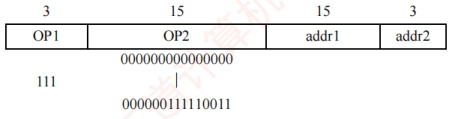

### 4.1.6 本节习题精选

#### 一、 单项选择题

##### 01

下列关于指令集体系结构和指令系统的说法中，错误的是（）。

A. 指令集体系结构位于计算机软/硬件的交界面上

B. 指令集体系结构是指低级语言程序员所看到的概念结构和功能特性

C. 任何程序运行前都要先转换为机器语言程序

D. 指令系统和机器语言是无关的

##### 02

下列有关指令集体系结构（ISA）的叙述中，错误的是（）。

A. ISA 规定了执行每条指令时所包含的控制信号

B. ISA 规定了指令获取操作数的方式，即寻址方式

C. ISA 规定了所有指令的集合，包括指令格式和操作类型

D. ISA 规定了程序可访问的寄存器个数、存储空间大小、编

##### 03

运算型指令的寻址与转移型指令的寻址的不同点在于（）。

A. 前者取操作数，后者决定程序转移地址

B. 后者取操作数，前者决定程序转移地址
C. 前者是短指令，后者是长指令

D. 前者是长指令，后者是短指令

##### 04

程序控制类指令的功能是（）。

A. 进行算术运算和逻辑运算

B. 进行主存与 CPU 之间的数据传送

C. 进行 CPU 和 I/O 设备之间的数据传送

D. 改变程序执行的顺序

##### 05

下列指令中不属于程序控制类指令的是（）。

A. 无条件转移指令

B. 条件转移指令

C. 中断隐指令

D. 循环指令

##### 06

以下叙述错误的是（）。

A. 为了便于取指令，指令的长度通常为存储字长的整数倍

B. 单地址指令是固定长度的指令

C. 单字长指令可加快取指令的速度

D. 单地址指令可能有一个操作数，也可能有两个操作数

##### 07

某指令系统有200条指令，对操作码采用固定长度二进制编码，最少需要用（）位。

A. 4 B. 8 C. 16 D. 32

##### 08

在指令格式中，采用扩展操作码设计方案的目的是（）。

A. 减少指令字长度

B. 增加指令字长度

C. 保持指令字长度不变而增加指令的数量

D. 保持指令字长度不变而增加寻址空间

##### 09

一个计算机系统采用 32 位单字长指令，地址码为 12 位，若定义了 250 条二地址指令，则还可以有（ ）条单地址指令。

A.  $2^{12}$ B.  $2^{13}$ C.  $2^{14}$ D.  $3 \times 2^{13}$

##### 10

假设系统采用16位定长指令字格式，操作码使用扩展编码方式，地址码为4位，三地址、二地址、一地址指令各有15、8、127条，则零地址指令最多有（）条。

A. 15 B. 16 C. 31 D. 32

##### 11

某指令系统的指令字长为 16 位，地址码长度为 6 位。若已定义二地址指令 15 条、一地址指令 48 条，则零地址指令最多可定义（）条。

A. 255 B. 256 C. 1023 D. 1024

##### 12

某机器的指令字长为 12 位，采用扩展操作码技术，支持零地址、一地址和二地址 3 种指令格式，地址码长度均为 4 位。若一地址和二地址指令均取最大可能条数，则该机器最多可定义的指令总数为（）。

A. 16 B. 46 C. 48 D. 4366

##### 13

【2017 统考真题】某计算机按字节编址，指令字长固定且只有两种指令格式，其中三地址指令 29 条、二地址指令 107 条，每个地址字段为 6 位，则指令字长至少应该是（）。

A. 24 位

B. 26 位

C. 28 位

D. 32 位

##### 14

【2022 统考真题】下列选项中，属于指令集体系结构（ISA）规定的内容是（）。

I. 指令字格式和指令类型

II. CPU 的时钟周期
III. 通用寄存器个数和位数

IV. 加法器的进位方式

A. 仅 I、II

B. 仅 I、III

C. 仅 II、IV

D. 仅 I、III、IV

##### 15

【2022 统考真题】设计某指令系统时，假设采用 16 位定长指令字格式，操作码使用扩展编码方式，地址码为 6 位，包含零地址、一地址和二地址 3 种格式的指令。若二地址指令有 12 条，一地址指令有 254 条，则零地址指令的条数最多为（）。

A. 0 B. 2 C. 64 D. 128

##### 16

【2025 统考真题】在下列选项中，由指令集体系结构（ISA）规定的是（）。

A. 是否采用阵列乘法器

B. 是否采用定长指令字格式

C. 是否采用微程序控制器

D. 是否采用单总线数据通路

#### 二、 综合应用题

##### 01

一个处理器中共有 32 个寄存器，使用 16 位立即数，其指令系统结构中共有 142 条指令。在某个给定的程序中，20% 的指令带有一个输入寄存器和一个输出寄存器；30% 的指令带有两个输入寄存器和一个输出寄存器；25% 的指令带有一个输入寄存器、一个输出寄存器、一个立即数寄存器；其余 25% 的指令带有一个立即数输入寄存器和一个输出寄存器。

1）对于以上 4 种指令类型中的任意一种指令类型来说，共需要多少位？假定指令系统结构要求所有指令长度必须是 8 的整数倍。

2）与使用定长指令集编码相比，当采用变长指令集编码时，该程序能够少占用多少存储器空间？

##### 02

假设指令字长为16位，操作数的地址码为6位，指令有零地址、一地址、二地址3种格式。

1）设操作码固定，若零地址指令有M种，一地址指令有N种，则二地址指令最多有几种？

2）采用扩展操作码技术，二地址指令最多有几种？

3）采用扩展操作码技术，若二地址指令有P条，零地址指令有Q条，则一地址指令最多有几种？

##### 03

在一个 36 位长的指令系统中，设计一个扩展操作码，使之能表示下列指令：

1）7条具有两个15位地址和一个3位地址的指令。

2）500条具有一个15位地址和一个3位地址的指令。

3）50条无地址指令。

### 4.1.7 答案与解析

#### 一、 单项选择题

##### 01

D

指令集体系结构（ISA）完整定义了软件和硬件之间的接口，是机器语言或汇编语言程序员所应熟悉的。指令系统是计算机硬件的语言系统，这显然和机器语言有关。

##### 02

A

指令集体系结构（ISA）是软件和硬件之间接口的一个完整定义，包含了基本数据类型、指令集、寄存器、寻址模式、存储体系、中断和异常处理及外部I/O。ISA规定了执行每条指令时所需要的操作码、操作数、寻址方式等信息，以及指令的功能和效果。控制信号是由控制单元根据ISA生成的，它属于微架构层面的实现细节，而不是ISA层面的抽象定义。

##### 03

A

运算型指令寻址的是操作数，而转移型指令寻址的是下次欲执行的指令的地址。
##### 04

D

程序控制类指令用于改变程序执行的顺序，并使程序具有测试、分析、判断和循环执行的能力。

##### 05

C

程序控制类指令主要包括无条件转移、条件转移、子程序调用和返回指令、循环指令等。中断隐指令是由硬件实现的，并不是指令系统中存在的指令，更不可能属于程序控制类指令。

##### 06

B

指令的地址个数与指令的长度是否固定没有必然联系，即使是单地址指令，也可能由于单地址的寻址方式不同而导致指令长度不同。

##### 07

B

因  $128=2^{7}<200<2^{8}=256$，因此采用定长操作码时，至少需要8位。

##### 08

C

扩展操作码并未改变指令的长度，而是使操作码长度随地址码的减少而增加。

##### 09

D

地址码为12位，二地址指令的操作码长度为32-12-12=8位，已定义了250条二地址指令， $2^{8}-250=6$，即可以设计出单地址指令 $6\times2^{12}=3\times2^{13}$条。

##### 10

B

指令长16位，地址码各4位。三地址指令：操作码4位，最多16种，用15种，剩1种（1111）用于扩展，所有非三地址指令的操作码的高4位均为1111，共 $2^{12}=4096$个编码。二地址指令：8条，每条占 $2^{8}=256$个编码（因有8位地址），共占 $8\times256=2048$个，剩余编码为4096-2048=2048个。一地址指令：127条，每条占 $2^{4}=16$个编码，共占 $127\times16=2032$个，剩余编码为2048-2032=16个。这些编码无地址字段，每条对应一条零地址指令，故最多16条。

##### 11

D

操作码按从短到长进行扩展编码。指令字长 16 位，地址码占 6 位。二地址指令含两个地址码（共 12 位），操作码为高 4 位，可编码  $2^{4} = 16$ 种；15 条指令可使用编码 0000～1110，剩余 1111 用作扩展。一地址指令的高 4 位固定为 1111，中间 6 位用作扩展操作码，共  $2^{6} = 64$ 种组合；实际使用 48 条，剩余 64 - 48 = 16 个编码可用作零地址扩展。零地址指令无地址字段，其高 10 位由 1111 拼接上述 16 个空闲扩展码构成，低 6 位自由取值，故最多可定义  $16 \times 2^{6} = 16 \times 64 = 1024$ 条。

##### 12

B

二地址指令的操作码占4位，共 $2^{4}=16$种编码，保留1个用于扩展，最多定义15条。一地址指令利用该保留编码，将第二个4位地址字段作为扩展操作码，得到 $2^{4}=16$种组合，再保留其中1个用于零地址扩展，最多可定义15条。零地址指令则使用这一保留编码，将剩余的4位全部作为操作码，可定义24=16条。因此，指令总数最多为 $15+15+16=46$条。

##### 13

A

三地址指令有29条，所以其操作码至少为5位。以5位进行计算，它剩余32-29=3种操作码给二地址。而二地址额外多了6位给操作码，因此其数量最大达 $3\times64=192$。所以指令字长最少为23位，因为计算机按字节编址，需要是8的倍数，所以指令字长至少应该是24位。

##### 14

B

指令集体系结构处于软/硬件的交界面上。指令字和指令格式、通用寄存器个数和位数都与机器指令有关，由 ISA 规定。两个 CPU 可以有不同的时钟周期，但指令集可以相同；加法器的进位方式涉及电路设计，这两项都属于计算机的硬件部分，不由 ISA 规定。

##### 15

D

地址码为6位，一条二地址指令会占用 $2^{6}$条一地址指令的空间，一条一地址指令会占用 $2^{6}$
条零地址指令的空间。若全都是零地址指令，则最多有  $2^{16}$ 条，减去一地址指令和二地址指令所占用的零地址指令空间，即  $2^{16}-254\times2^{6}-12\times2^{6}\times2^{6}=(2^{10}-254-12\times2^{6})\times2^{6}=2\times2^{6}=128$。

【另解】二地址指令有12条，则剩余16-12=4种操作码给一地址指令，一地址指令有254条，剩余 $4\times64-254=2$种操作码给0地址指令，所以0地址一共有 $2\times2^6=128$条。

##### 16

B

指令集体系结构（ISA）是软件和硬件之间的抽象接口，定义了机器语言程序员可见的处理器行为，包括指令集、数据类型、寄存器、寻址方式及指令编码格式等。指令字是否定长属于编码格式的一部分，直接影响机器代码解析与程序设计，由ISA明确规定。而阵列乘法器、微程序控制器和单总线数据通路均属于微架构实现细节，对程序员不可见，不在ISA范畴内。

#### 二、 综合应用题

##### 01

【解答】

1）因为有142条指令，所以至少需要8位才能确定各条指令的操作码（2⁸ = 256）。因为该处理器有32个寄存器，也就是说要用5位对寄存器ID编码，而每个立即数需要16位，所以有：20%的一个输入寄存器和一个输出寄存器指令需要8 + 5 + 5 = 18位，长度对齐到8的倍数，便是24位。

30%的两个输入寄存器和一个输出寄存器指令需要  $8 + 5 + 5 + 5 = 23$ 位，对齐到24位。25%的一个输入寄存器、一个输出寄存器、一个立即数寄存器指令需要  $8 + 5 + 5 + 16 = 34$ 位，对齐到40位。

25%的一个立即数输入寄存器和一个输出寄存器指令需要 $8+16+5=29$位，对齐到32位。

2）因为变长指令最长的长度为40位，所以定长指令编码每条指令的长度均为40位。而采用变长编码，将各个指令长度和其概率相乘，得出平均长度为30位。所以该程序中，变长编码比定长编码少占用25%的存储空间。

##### 02

【解答】

1）根据操作数地址码为6位，得到二地址指令中操作码的位数为16-6-6=4，这4位操作码可有16种操作。操作码固定，因此除了零地址指令有M种，一地址指令有N种，剩下的二地址指令最多有16-M-N种。

2）采用扩展操作码技术，操作码位数可随地址数的减少而增加。对于二地址指令，指令字长16位，减去两个地址码共12位，剩下4位操作码，共16种编码，去掉一种编码（如1111）用于一地址指令扩展，二地址指令最多可有15种操作。

3）采用扩展操作码技术，操作码位数可变，二地址、一地址和零地址的操作码长度分别为 4 位、10 位和 16 位。这样，二地址指令操作码每减少一个，就可以多构成  $2^6$ 条一地址指令操作码；一地址指令操作码每减少一个，就可以多构成  $2^6$ 条零地址指令操作码。设一地址指令有  $R$ 条，则一地址指令最多有  $(2^4 - P) \times 2^6$ 条，零地址指令最多有  $[(2^4 - P) \times 2^6 - R] \times 2^6$ 条。题中给出零地址指令为  $Q$ 条，即  $Q = [(2^4 - P) \times 2^6 - R] \times 2^6$，得  $R = (2^4 - P) \times 2^6 - \left\lfloor Q \times 2^{-6} \right\rfloor$。

##### 03

【解答】

1)

| 3 | 15 | 15 | 3 |
| --- | --- | --- | --- |
| OP | addr1 | addr2 | addr3 |
| 000 |   |   |   |
| \| |   |   |   |
| 110 |   |   |   |

2)

3)

| 3 | 15 | 18 |
| --- | --- | --- |
| OP1 | OP2 |   |
| 111 | 000000111110100 | 0000...00000 （18个0） |
| 000001000100101 | 0000...00000 （18个0） |   |

