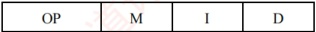
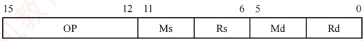
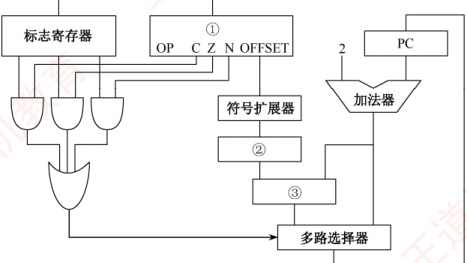
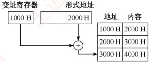

### 4.2.3 本节习题精选

#### 一、 单项选择题

##### 01

指令系统中采用不同寻址方式的目的是（）。

A. 提供扩展操作码的可能并降低指令译码难度

B. 可缩短指令字长，扩大寻址空间，提高编程的灵活性

C. 实现程序控制

D. 三者都正确

##### 02

采用直接转移的无条件转移指令的功能是将指令中的地址码送入（）。

A. 程序计数器（PC） B. 指令译码器（ID）

C. 指令寄存器（IR） D. 地址寄存器（MAR）
##### 03

为了缩短指令中某个地址段的位数，有效的方法是采取（）。

A. 立即寻址 B. 变址寻址 C. 间接寻址 D. 寄存器寻址

##### 04

简化地址结构的基本方法是尽量采用（）。

A. 寄存器寻址 B. 隐含寻址 C. 直接寻址 D. 间接寻址

##### 05

在指令寻址的各种方式中，获取操作数最快的方式是（）。

A. 直接寻址 B. 立即寻址 C. 寄存器寻址 D. 间接寻址

##### 06

假定指令中地址码所给出的是操作数的有效地址，则该指令采用（）。

A. 直接寻址 B. 立即寻址 C. 寄存器寻址 D. 间接寻址

##### 07

设指令中的地址码为 A，变址寄存器为 X，程序计数器为 PC，则变址间址寻址方式的操作数的有效地址 EA 是（）。

A.  $((PC) + A)$ B.  $((X) + A)$ C.  $(X) + (A)$ D.  $(X) + A$

##### 08

（）便于处理数组问题。

A. 间接寻址 B. 变址寻址 C. 相对寻址 D. 基址寻址

##### 09

相对寻址方式中，指令所提供的相对地址实质上是一种（）。

A. 立即数

B. 内存地址

C. 以本条指令在内存中首地址为基准位置的偏移量

D. 以下条指令在内存中首地址为基准位置的偏移量

##### 10

指令寻址方式有顺序和跳跃两种，采用跳跃寻址方式可以实现（）。

A. 程序浮动

B. 程序的无条件浮动和条件浮动

C. 程序的无条件转移和条件转移

D. 程序的调用

##### 11

寄存器 R1、R2 均为 16 位，指令 MOV R1, [R2] 的功能是把内存数据传送至寄存器 R1，寻址方式为寄存器间接寻址。R2 的值为 1234H，内存单元 1234H 存放数据 56H，内存单元 1235H 存放数据 78H，采用小端方式存储。则执行指令后 R1 的值为（）。

A. 5678H

B. 7856H

C. 8765H

D. 6587H

##### 12

某计算机的字长为 16 位，主存按字编址。转移指令由两个字节组成，采用相对寻址，第一个字节为操作码字段，第二个字节为相对偏移量字段。若某转移指令所在的主存地址为  $4000H$，相对偏移量字段的内容为  $06H$，则该转移指令执行后的 PC 值为（）。

A. 4002H B. 4004H C. 4007H D. 4008H

##### 13

某计算机的指令字长为 16 位，由低到高第 0～7 位是形式地址 D，第 8～9 位为寻址特征位 X，第 10～15 位为操作码。当 X = 00 时为直接寻址；当 X = 01 时使用 X1 进行变址寻址；当 X = 10 时使用 X2 进行变址寻址；当 X = 11 时为相对寻址。设(PC) = 1234H，(X1) = 0005H，(X2) = 1188H，则指令 2222H 的有效地址是（）。

A. 1256H

B. 0027H

C. 2222H

D. 11AAH

##### 14

某机器指令字长为 16 位，主存按字节编址，取指令时，每取一字节，PC 自动加 1。当前指令地址为 2000H，指令内容为相对寻址的无条件转移指令，指令中的形式地址为 40H。则取指令后及指令执行后 PC 的内容为（）。

A. 2000H, 2042H

B. 2002H, 2040H

C. 2002H, 2042H

D. 2000H, 2040H

##### 15

某计算机的主存容量为  $4M \times 16$ 位，且存储字长等于指令字长，若该机能完成 97 种操作，操作码位数固定，且有直接、间接、基址、变址、相对、立即六种寻址方式，则相对寻
址的偏移量范围为（）。

A.  $(-32,+31)$ B.  $(-64,+63)$ C.  $(-128,+127)$ D.  $(-256,+255)$

##### 16

假设寄存器 R 中的数值为 200，主存地址为 200 和 300 的地址单元中存放的内容分别是 300 和 400，则（）方式下访问到的操作数为 200。

A. 直接寻址 200

B. 寄存器间接寻址（R）

C. 存储器间接寻址（200）

D. 寄存器寻址 R

##### 17

假设某条指令的第一个操作数采用寄存器间接寻址方式，指令中给出的寄存器编号为8，8号寄存器的内容为1200H，地址为1200H的单元中的内容为12FCH，地址为12FCH的单元中的内容为38D8H，而地址为38D8H的单元中的内容为88F9H，则该操作数的有效地址为（）。

A. 1200H B. 12FCH C. 38D8H D. 88F9H

##### 18

设相对寻址的转移指令占 3B，第 1 字节为操作码，第 2、3 字节为相对位移量（补码表示），数据在存储器中采用以低字节为字地址的存放方式。每当 CPU 从存储器取出一字节时，即自动完成(PC) + 1 → PC。若 PC 的当前值为 240（十进制），要求转移到 290（十进制），则转移指令的第 2、3 字节的机器代码是（ ）；若 PC 的当前值为 240（十进制），要求转移到 200（十进制），则转移指令的第 2、3 字节的机器代码是（ ）。

A. 2FH、FFH B. D5H、00H C. D5H、FFH D. 2FH、00H

##### 19

某计算机按字节编址，采用大端方式，某指令的一个操作数的机器数为 ABCD 00FFH，该操作数采用基址寻址方式，指令中形式地址（用补码表示）为 FF00H，当前基址寄存器的内容为 C000 0000H，则该操作数的 LSB（FFH）存放的地址是（）。

A. C000 FF00H B. C000 FF03H C. BFFF FF00H D. BFFF FF03H

##### 20

下列关于指令的功能及分类的叙述中，正确的是（）。

A. 算术与逻辑运算指令，通常完成算术运算或逻辑运算，都需要两个数据

B. 移位操作指令，通常用于把指定的两个操作数左移或右移一位

C. 转移指令、子程序调用与返回指令，用于解决数据调用次序的需求

D. 特权指令，通常仅用于实现系统软件，这类指令一般不提供给用户

##### 21

某计算机字长为 16 位，标志寄存器中存在 ZF、SF、OF 和 CF 标志位，采用双字节字长指令字。假定 bgt（大于零转移）指令的第一个字节指明操作码和寻址方式，第二个字节为立即数 Imm8，用补码表示。指令功能是：若转移条件成立，则 PC = PC + 2 + Imm8 × 2；否则，PC = PC + 2。则下列叙述中错误的是（）。

A. 该计算机按字节编址

B. 若 bgt 指令是无符号整数的比较，则转移条件可以是 ZF + CF = 0

C. 若 bgt 指令是有符号整数的比较，则转移条件可以是 SF ⊕ OF = 0

D. 转移目标地址的范围是相对于 bgt 指令的前 127 条指令到后 128 条指令之间

##### 22

下列关于指令寻址与数据寻址的描述中，错误的是（）。

A. 中断响应时，中断隐指令的执行不属于指令寻址的范畴

B. 指令格式中，每个操作数字段均需通过显式编码或隐含约定确定其寻址方式

C. 在含 Cache 的系统中，指令访存遵循 “Cache 优先” 原则，未命中时再访问主存

D. 数据寻址方式不属于指令集体系结构（ISA）规定的内容

##### 23

【2009 统考真题】某机器字长为 16 位，主存按字节编址，转移指令采用相对寻址，由 2 字节组成，第一字节为操作码字段，第二字节为相对位移量字段。假定取指令时，每
取一字节，PC 自动加 1。若某转移指令所在主存地址为 2000H，相对位移量字段的内容为 06H，则该转移指令成功转移后的目标地址是（）。

A. 2006H B. 2007H C. 2008H D. 2009H

##### 24

【2011 统考真题】偏移寻址通过将某个寄存器的内容与一个形式地址相加来生成有效地址。下列寻址方式中，不属于偏移寻址方式的是（）。

A. 间接寻址 B. 基址寻址 C. 相对寻址 D. 变址寻址

##### 25

【2011 统考真题】某机器有一个标志寄存器，其中有进位/借位标志 CF、零标志 ZF、符号标志 SF 和溢出标志 OF，条件转移指令 bgt（无符号整数比较大于时转移）的转移条件是（）。

A. CF + OF = 1    B.  $\overline{SF} + ZF = 1$    C.  $\overline{CF + ZF} = 1$    D.  $\overline{CF + SF} = 1$

##### 26

【2013 统考真题】假设变址寄存器 R 的内容为  $1000H$，指令中的形式地址为  $2000H$；地址  $1000H$ 中的内容为  $2000H$，地址  $2000H$ 中的内容为  $3000H$，地址  $3000H$ 中的内容为  $4000H$，则变址寻址方式下访问到的操作数是（）。

A. 1000H B. 2000H C. 3000H D. 4000H

##### 27

【2014 统考真题】某计算机有 16 个通用寄存器，采用 32 位定长指令字，操作码字段（含寻址方式位）为 8 位，STORE 指令的源操作数和目的操作数分别采用寄存器直接寻址和基址寻址方式。若基址寄存器可使用任意一个通用寄存器，且偏移量用补码表示，则 STORE 指令中偏移量的取值范围是（）。

A. -32768～+32767

B. -32767～+32768

C. -65536～+65535

D. -65535～+65536

##### 28

【2016 统考真题】某指令格式如下所示。

其中 M 为寻址方式，I 为变址寄存器编号，D 为形式地址。若采用先变址后间址的寻址方式，则操作数的有效地址是（）。

A.  $(1+D)$ B.  $(1)+D$ C.  $((1)+D)$ D.  $((1))+D$

##### 29

【2017 统考真题】下列寻址方式中，最适合按下标顺序访问一维数组元素的是（）。

A. 相对寻址 B. 寄存器寻址 C. 直接寻址 D. 变址寻址

##### 30

【2018 统考真题】按字节编址的计算机中，某 double 型数组 A 的首地址为 2000H，使用变址寻址和循环结构访问数组 A，保存数组下标的变址寄存器的初值为 0，每次循环取一个数组元素，其偏移地址为变址值乘以 sizeof(double)，取完后变址寄存器的内容自动加 1。若某次循环所取元素的地址为 2100H，则进入该次循环时变址寄存器的内容是（）。

A. 25 B. 32 C. 64 D. 100

##### 31

【2019 统考真题】某计算机采用大端方式，按字节编址。某指令中操作数的机器数为 1234 FF00H，该操作数采用基址寻址方式，形式地址（用补码表示）为 FF12H，基址寄存器的内容为 F000 0000H，则该操作数的 LSB（最低有效字节）所在的地址是（）。

A. F000 FF12H B. F000 FF15H C. EFFFF12H D. EFFFF15H

##### 32

【2020 统考真题】某计算机采用 16 位定长指令字格式，操作码位数和寻址方式位数固定，指令系统有 48 条指令，支持直接、间接、立即、相对 4 种寻址方式。在单地址指令中，直接寻址方式的可寻址范围是（）。

A. 0~255 B. 0~1023 C. -128~127 D. -512~511
##### 33

【2023 统考真题】某运算类指令中有一个地址码为通用寄存器编号，对应通用寄存器中存放的是操作数或操作数的地址，CPU 区分两者的依据是（）。

A. 操作数的寻址方式

B. 操作数的编码方式

C. 通用寄存器的编号

D. 通用寄存器的内容

#### 二、 综合应用题

##### 01

某机的机器字长为16位，主存按字编址，指令格式如下：

| 15 | 10 9 8 7 0 |
| --- | --- |
| 操作码 | X |

其中，D为位移量；X为寻址特征位。

X=00: 直接寻址。

X=01: 用变址寄存器 X1 进行变址。

X=10: 用变址寄存器 X2 进行变址。

X=11: 相对寻址。

设 $(PC)=1234H$， $(X1)=0037H$， $(X2)=1122H$（H代表十六位进制数），请确定下列指令的有效地址：

① 4420H ② 2244H ③ 1322H ④ 3521H ⑤ 6723H

##### 02

某计算机字长 16 位，标志寄存器 FLAGS 中的 ZF、SF 和 OF 分别是零标志、符号标志和溢出标志，采用双字节字长指令字。假定 bgt（大于零转移）指令的第一个字节指明操作码和寻址方式，第二个字节为偏移地址 Imm8，用补码表示。指令功能是：若  $(ZF + (SF \oplus OF) = 0)$，则  $PC = PC + 2 + Imm8 \times 2$；否则，PC = PC + 2。请回答下列问题：

1）该计算机的编址单位是多少？

2）bgt 指令执行的是有符号整数比较，还是无符号整数比较？

3）偏移地址 Imm8 的含义是什么？转移目标地址的范围是什么？

##### 03

【2010 统考真题】某计算机字长为 16 位，主存地址空间大小为 128KB，按字编址，采用单字长指令格式，指令各字段定义如下：

转移指令采用相对寻址方式，相对偏移量用补码表示，寻址方式定义见下表。

| Ms/Md | 寻址方式 | 助记符 | 含义 |
|---|---|---|---|
| 000B | 寄存器直接 | Rn | 操作数 = $(Rn)$ |
| 001B | 寄存器间接 | $(Rn)$ | 操作数 = $((Rn))$ |
| 010B | 寄存器间接、自增 | $(Rn) + D(Rn)$ | 操作数 = $((Rn) + 1 \rightarrow Rn)$ |
| 011B | 相对 | $D(Rn)$ | 转移目标地址 = $(PC) + (Rn)$ |

注：(X)表示存储器地址 X 或寄存器 X 的内容。

回答下列问题：

1）该指令系统最多可有多少条指令？该计算机最多有多少个通用寄存器？存储器地址寄存器（MAR）和存储器数据寄存器（MDR）至少各需要多少位？

2）转移指令的目标地址范围是多少？
3) 若操作码 0010B 表示加法操作（助记符为 add），寄存器 R4 和 R5 的编号分别为 100B 和 101B，R4 的内容为 1234H，R5 的内容为 5678H，地址 1234H 中的内容为 5678H，5678H 中的内容为 1234H，则汇编语句 “add (R4), (R5)+” （逗号前为源操作数，逗号后为目的操作数）对应的机器码是什么（用十六进制表示）？该指令执行后，哪些寄存器和存储单元的内容会改变？改变后的内容是什么？

##### 04

【2013 统考真题】某计算机采用 16 位定长指令字格式，其 CPU 中有一个标志寄存器，其中包含进位/借位标志 CF、零标志 ZF 和符号标志 NF。假定为该机设计了条件转移指令，其格式如下：

其中，00000 为操作码 OP；C、Z 和 N 分别为 CF、ZF 和 NF 的对应检测位，某检测位为 1 时表示需检测对应标志，需检测的标志位中只要有一个为 1 就转移，否则不转移。例如，若 C = 1，Z = 0，N = 1，则需检测 CF 和 NF 的值，当 CF = 1 或 NF = 1 时发生转移；OFFSET 是相对偏移量，用补码表示。转移执行时，转移目标地址为 (PC) + 2 + 2×OFFSET；顺序执行时，下一条指令地址为 (PC) + 2。请回答下列问题：

| 15 | 11 10 9 8 7 |   |   |   |   | 0 |
| --- | --- | --- | --- | --- | --- | --- |
| 0 0 0 0 0 | C | Z | N | OFFSET |   |   |

1）该计算机存储器是按字节编址还是按字编址？该条件转移指令向后（反向）最多可转移多少条指令？

2）某条件转移指令的地址为 200CH，指令内容如下图所示，若该指令执行时 CF = 0，ZF = 0，NF = 1，则该指令执行后 PC 的值是多少？若该指令执行时 CF = 1，ZF = 0，NF = 0，则该指令执行后 PC 的值又是多少？请给出计算过程。

| 15 | 11 10 | 9 | 8 | 7 | 0 |
| --- | --- | --- | --- | --- | --- |
| 0 0 0 0 0 | 0 | 1 | 1 | 1 1 1 0 0 0 1 1 |   |

3）实现“无符号数比较小于或等于时转移”功能的指令中，C、Z和N应各是什么？

4）以下是该指令对应的数据通路示意图，要求给出图中部件①～③的名称或功能说明。

##### 05

【2021 统考真题】假定计算机 M 字长为 16 位，按字节编址，连接 CPU 和主存的系统总线中地址线为 20 位、数据线为 8 位，采用 16 位定长指令字，指令格式及说明如下：

格式 6位 2位 2位 2位 4位 指令功能或指令类型说明

| R型 I型 J型 | 000000 | rs | rt | rd | op1 |
| --- | --- | --- | --- | --- | --- |
| op2 | rs | rt | imm |   |   |
| op3 | target |   |   |   |   |

其中，op1～op3 为操作码，rs，rt 和 rd 为通用寄存器编号，R[r] 表示寄存器 r 的内容，imm 为立即数，target 为转移目标的形式地址。请回答下列问题。

1）ALU 的宽度是多少位？可寻址主存空间大小为多少字节？指令寄存器、主存地址寄存器（MAR）和主存数据寄存器（MDR）分别应有多少位？

2）R型格式最多可定义多少种操作？I型和J型格式总共最多可定义多少种操作？通用寄存器最多有多少个？

3）假定 op1 为 0010 和 0011 时，分别表示有符号整数减法和有符号整数乘法指令，则指令 01B2H 的功能是什么（参考上述指令功能说明的格式进行描述）？若 1, 2, 3 号通用寄存器当前内容分别为 B052H, 0008H, 0020H，则分别执行指令 01B2H 和 01B3H 后，3 号通用寄存器内容各是什么？各自结果是否溢出？

4）若采用Ⅰ型格式的访存指令中 imm（偏移量）为有符号整数，则地址计算时应对 imm 进行零扩展还是符号扩展？

5）无条件转移指令可以采用上述哪种指令格式？

### 4.2.4 答案与解析

#### 一、 单项选择题

##### 01

B

采用不同寻址方式的目的是为了缩短指令字长，扩大寻址空间，提高编程的灵活性，但这也提高了指令译码的复杂度。程序控制是靠转移指令而非寻址方式实现的。

##### 02

A

转移指令有条件/无条件、直接/间接、相对/绝对三种属性。条件转移是指需要先判断条件是否成立，才决定是否转移；无条件转移是指不用判断条件就可以转移，典型的是函数调用和返回。直接转移是指转移目标地址直接放在指令中，执行时直接将地址码送入 PC；间接转移是指转移目标地址存放在寄存器或内存单元中。相对转移是指转移目标地址为当前 PC 值加上偏移量，偏移量一般在指令中；绝对转移是指转移目标地址直接由指令或寄存器给出。

##### 03

D

CPU 中寄存器的数量都不会太多，用很短的编码就可以指定寄存器，寄存器寻址需要的地址段位数为 \lceil \log_2(通用寄存器个数) \rceil，因此能有效地缩短地址段的位数。立即寻址，操作数直接保存在指令中，若地址段位数太小，则操作数表示的范围会很小；变址寻址，EA = 变址寄存器 IX 的内容 + 形式地址 A，A 与主存寻址空间有关；间接寻址中存放的仍然是主存地址。

##### 04

B

隐含寻址不明显给出操作数地址，而在指令中隐含操作数的地址，因此可以简化地址结构。

##### 05

B

立即寻址最快，指令直接给出操作数；寄存器寻址次之，只需访问一次寄存器；直接寻址再次之，访问一次内存；间接寻址最慢，要访问内存两次或以上。

##### 06

A

指令字中的形式地址为操作数的有效地址，这种方式为直接寻址。

##### 07

B

变址寻址的有效地址是(X) + A，再进行变址间址寻址，即把(X) + A 中取出的内容作为真实地址 EA，即 EA = ((X) + A)。
寄存器中的内容和指令地址码相加得到的是操作数的地址码。

##### 08

B

变址寻址便于处理数组问题。基址寻址与变址寻址的区别见下表。

|  | 基址寻址 | 变址寻址 |
|---|---|---|
| 有效地址 | $EA = (BR) + A$ | $EA = (IX) + A$ |
| 访存次数 | 1 | 1 |
| 寄存器内容 | 由操作系统或管理程序确定 | 由用户设定 |
| 程序执行过程中值可变否 | 不可变 | 可变 |
| 特点 | 有利于多道程序设计和编制浮动程序 | 有利于处理数组问题和编制循环程序 |

##### 09

D

相对寻址中，有效地址 EA = (PC) + A（A 为形式地址），执行本条指令时，PC 已完成加 1 操作，PC 中保存的是下一条指令的地址，因此以下一条指令的地址为基准位置的偏移量。

##### 10

C

跳跃寻址通过转移类指令（如相对寻址）来实现，可用来实现程序的条件或无条件转移。

##### 11

B

寄存器 R2 中的值是 1234H，内存单元 1234H 中的值是 56H，1235H 中的值是 78H，因为采用小端方式，所以实际存储的数据为 7856H，取出后存放到 R1，因此 R1 的值为 7856H。

##### 12

C

王存按字编址，指令字长为1个字（2字节），因此取出该指令后，PC自动加1，相对偏移量为06H，所以该转移指令执行后的PC值为 $4000H + 06H + 1H = 4007H$。

##### 13

D

将指令 2222H 展开成二进制为 0010 00 $\underline{10}$ 0010 0010B，因此寻址特征位 X = 10，即使用 X2 进行变址寻址，其有效地址为 1188H + 22H = 11AAH。

##### 14

C

指令字长为16位，2字节，因此取指令后PC的内容为(PC) + 2 = 2002H；无条件转移指令将下一条指令的地址送至PC，形式地址为40H，指令执行后PC = 2002H + 0040H = 2042H。

##### 15

A

操作码位数固定，且能完成 97 种操作，则操作码位数是 $\log_297$=7 位；具有六种寻址方式，则寻址特征位数是 $\log_67$=3 位；指令字长为 16 位，因此地址码位数是 16-3-7=6 位，6 位补码的表示范围为-32～+31，即为相对寻址的偏移量范围。

##### 16

D

直接寻址 200 访问的操作数是 300，选项 A 错误。寄存器间接寻址（R）的访问结果与 I 一样，选项 B 错误。存储器间接寻址（200）表示主存地址 200 中的内容为有效地址，有效地址为 300，访问的操作数是 400，选项 C 错误。寄存器寻址 R 表示寄存器 R 的内容为操作数，只有选项 D 正确。

##### 17

A

寄存器间接寻址中操作数的有效地址  $\mathrm{EA}=(R_{i})$，8 号寄存器内容为 1200H，因此 EA = 1200H。

##### 18

D、C

首先需要讲解一下补码扩充的问题。补码的扩充只需使用符号位补足即可，也就是说正数补码的扩充只要补0，负数补码的扩充只需补1（这是由补码的性质决定的）。理解了该性质，这道题就变成了十进制数转换为十六进制数的简单问题。
1）PC 的当前值为 240，该指令取出后 PC 的值为 243，要求转移到 290，即相对位移量为  $290 - 243 = 47$，转换成补码为 2FH。因为数据在存储器中采用以低字节地址为字地址的存放方式，所以该转移指令的第二字节为 2FH，而由于 47 是正数，只需在高位补 0，所以第三字节为 00H。

2）PC 的当前值为 240，该指令取出后 PC 的值为 243，要求转移到 200，即相对位移量为  $200-243=-43$，转换成补码为 D5H。数据在存储器中采用以低字节地址为字地址的存放方式，因此该转移指令的第二字节为 D5H，因为 -43 是负数，所以只需在高位补 1，所以第三字节为 FFH。

##### 19

D

基址寻址的操作数的有效地址为基址寄存器内容加上形式地址，即 C000 0000H + FF00H = C000 0000H + FFFF FF00H = BFFF FF00H。因为是大端方式，所以 LSB 的存放地址为 BFFF FF03H。

##### 20

D

算术与逻辑运算指令用于完成对一个（如自增、取反等）或两个数据的算术运算或逻辑运算，选项A错误。移位操作用于把一个操作数左移或右移一位或多位，选项B错误。转移指令、子程序调用与返回指令用于解决变动程序中指令执行次序的需求，而不是数据调用次序的需求，选项C错误。

##### 21

C

PC 的增量是 2，每条指令占 2 字节，可知编址单位为字节。若 bgt 指令是无符号整数的比较，则大于零时，ZF 一定为 0，且 CF 也一定为 0。若 bgt 指令是有符号整数的比较，则转移条件成立时，要么未发生溢出，SF = OF = 0，要么发生溢出，SF = OF = 1，但前提是 ZF 一定为 0，故正确的转移条件是（ZF + (SF ⊕ OF) = 0）。Imm8 的范围为 ~128～127，因此转移目标地址的范围是 PC + 2 + (-128×2)～PC + 2 + 127×2，即相对于 bgt 指令的前 127 条指令到后 128 条指令之间。

##### 22

D

中断隐指令由硬件自动完成（如保存 PC、转移至中断向量），不涉及程序控制流中的指令地址生成，故不属于指令寻址。操作数要通过显式字段或隐含规则（如堆栈使用 SP）确定来源，是寻址机制的基本要求。在现代存储体系中，指令与数据访存优先经 Cache，缺失时才访问主存以提升性能。数据寻址方式是 ISA 的核心内容，必须明确定义，选项 D 错误。

##### 23

C

相对寻址 EA = (PC) + A，首先计算取指令后的 PC 值。转移指令由 2 字节组成，每取一字节 PC 加 1，取指令后的 PC 值为 2002H，因此 EA = (PC) + A = 2002H + 06H = 2008H。本题易误选选项 A 或 B，选项 A 未考虑 PC 值的自动更新，选项 B 虽然考虑了 PC 值的自动更新，但未注意到该转移指令是一条 2 字节指令，PC 值应是 “+2” 而不是 “+1”。

##### 24

A

间接寻址不需要寄存器，EA = (A)。基址寻址 EA = A + 基址寄存器 BR 的内容；相对寻址 EA = A + 程序计数器（PC）的内容；变址寻址 EA = A + 变址寄存器 IX 的内容。后三者都是将某个寄存器的内容与一个形式地址相加而形成有效地址，所以统称偏移寻址。

##### 25

C

假设两个无符号整数 A 和 B，bgt 指令会将 A 和 B 进行比较，也就是将 A 和 B 相减。若 A > B，则 A - B 肯定无进位/借位，也不为 0（为 0 时表示两数相等），因此 CF 和 ZF 均为 0，选 C。其余选项中用到了符号标志 SF 和溢出标志 OF，SF 表示结果的符号，OF 是有符号整数的溢出标志
位，对于无符号数运算，SF 和 OF 没有意义，显然应当排除。

##### 26

D

根据变址寻址的方法，变址寄存器的内容（1000H）与形式地址的内容（2000H）相加，得到操作数的实际地址（3000H），根据实际地址访问内存，获取操作数4000H，如下图所示。

##### 27

A

采用 32 位定长指令字，其中操作码为 8 位，两个地址码共占用 32 - 8 = 24 位，而 STORE 指令的源操作数和目的操作数分别采用寄存器直接寻址和基址寻址，机器中共有 16 个通用寄存器，因此寻址一个寄存器需要  $\log_2 16 = 4$ 位，源操作数中的寄存器直接寻址用掉 4 位，而目的操作数采用基址寻址也要指定一个寄存器，同样用掉 4 位，则留给偏移量的位数为 24 - 4 - 4 = 16 位，而偏移量用补码表示，因此 16 位补码的表示范围为  $-32768 \sim +32767$。

##### 28

C

在变址寻址中，有效地址（EA）等于指令字中的形式地址 D 与变址寄存器 I 的内容之和，即 EA = (I) + D。间接寻址是相对于直接寻址而言的，指令的地址字段给出的形式地址不是操作数的真正地址，而是操作数地址的地址，即 EA = (D)。从而该操作数的有效地址是 ((I) + D)。

##### 29

D

变址操作时，将计算机指令中的地址与变址寄存器中的地址相加，得到有效地址，指令提供数组首地址，由变址寄存器来定位数据中的各元素。所以它最适合按下标顺序访问一维数组元素，选择选项D。相对寻址以PC为基地址，以指令中的地址为偏移量确定有效地址。寄存器寻址则在指令中指出需要使用的寄存器。直接寻址在指令的地址字段直接指出操作数的有效地址。

##### 30

B

根据变址寻址的公式 EA = (IX) + A，有(IX) = 2100H - 2000H = 100H = 256，sizeof(double) = 8（双精度浮点数用 8 位字节表示），因此数组的下标为 256/8 = 32。

##### 31

D

注意，内存地址是无符号数。

操作数采用基址寻址方式，EA = (BR) + A，基址寄存器 BR 的内容为 F000 0000H，形式地址用补码表示为 FF12H 即 1111 1111 0001 0010B，因此有效地址为 F000 0000H + (-00EEH) = EFFFF12H。计算机采用大端方式编址，所以低位字节存放在字的高地址处，机器数一共占 4 字节，该操作数的 LSB 所在的地址是 EFFFF12H + 3 = EFFFF15H。

##### 32

A

48 条指令需要 6 位操作码字段（ $2^5 < 48 < 2^6$），4 种寻址方式需要 2 位寻址特征位（ $4 = 2^2$），还剩 16-6-2=8 位作为地址码，所以直接寻址范围为 0～255。注意，主存地址不能为负。

##### 33

A

指令字由操作码、寻址特征和地址码三个字段组成，寻址特征字段用来指明指令属于哪种寻址方式。若寻址方式是寄存器直接寻址，则地址码所指的通用寄存器中存放的是操作数，若寻址方式是寄存器间接寻址，则对应通用寄存器中存放的是操作数的地址。
#### 二、 综合应用题

##### 01

【解答】

取指令后，PC = 1235H（注意，不是1236H，因主存按字编址）。

① X=00, D=20H, 有效地址 EA=20H。

② X = 10, D = 44H，有效地址 EA = 1122H + 44H = 1166H。

③ X = 11, D = 22H, 有效地址 EA = 1235H + 22H = 1257H。

④ X = 01, D = 21H, 有效地址 EA = 0037H + 21H = 0058H。

⑤ X = 11, D = 23H, 有效地址 EA = 1235H + 23H = 1258H。

##### 02

【解答】

1）因为PC的增量是2，且每条指令占2字节，所以编址单位是字节。

2）根据“大于”条件判断表达式，可以看出该 bgt 指令实现的是有符号整数比较。因为无符号数比较时，其判断表达式中没有溢出标志 OF。继续分析该逻辑表达式，bgt 指令的含义是当两数相减的结果大于 0 时，执行转移操作。因此，要满足 bgt 指令的条件，必须保证如下两个条件：一是结果不为 0，即零标志位 ZF 为 0；二是结果的符号位与溢出标志位 OF 相同，即 SF ⊕ OF 为 0（两数相减结果大于 0，有两种情况：第一种情况是结果没有溢出，此时 OF 位和 SF 位都为 0；第二种情况是结果发生了溢出，此时 OF 和 SF 位都为 1）。综上所述，逻辑表达式可表示为 ZF + (SF ⊕ OF) = 0。

3）偏移地址 Imm8 为补码表示，说明转移目标地址可能在 bgt 指令之后。计算转移目标地址时，偏移量为 Imm8×2，说明 Imm8 不是相对地址，而是相对指令数。Imm8 的范围为 -128～127，所以转移目标地址的范围是 PC + 2 + (-128×2)～PC + 2 + 127×2，也即转移目标地址的范围是相对于 bgt 指令的前 127 条指令到后 128 条指令之间。

##### 03

【解答】

1）操作码占4位，则该指令系统最多可有 $2^{4}=16$条指令。操作数占6位，其中寻址方式占3位、寄存器编号占3位，因此该机最多有 $2^{3}=8$个通用寄存器。主存地址空间大小为128KB，按字编址，字长为16位，共有128KB/2B= $2^{16}$个存储单元，因此MAR至少为16位；本题已说明了存储字长为16位，因此MDR至少为16位。

2）寄存器字长为16位，PC可以表示的地址范围为 $0\sim2^{16}-1$，Rn可表示的相对偏移量为 $-2^{15}\sim2^{15}-1$，而主存地址空间为 $2^{16}$，因此转移指令的目标地址范围为 $0000H\sim FFFFH$（ $0\sim2^{16}-1$）。

3）汇编语句 “add(R4),(R5)+” 对应的机器码为

| 字 段 | OP | Ms | Rs | Md | Rd |
| --- | --- | --- | --- | --- | --- |
| 内 容 | 0010 | 001 | 100 | 010 | 101 |
| 说 明 | add | 寄存器间接 | R4 | 寄存器间接、自增 | R5 |

将对应的机器码写成十六进制数形式为 0010 0011 0001 0101B = 2315H。

该指令的功能是将 R4 的内容所指的存储单元的数据与 R5 的内容所指的存储单元的数据相加，并将结果送入 R5 的内容所指的存储单元中。(R4) = 1234H，(1234H) = 5678H；(R5) = 5678H，(5678H) = 1234H；执行加法操作 5678H + 1234H = 68ACH。之后 R5 自增。

该指令执行后，R5 和存储单元 5678H 的内容会改变，R5 的内容从 5678H 变为 5679H，存储单元 5678H 中的内容变为该指令的计算结果 68ACH。

##### 04

【解答】

1）因为指令长度为16位，且下一条指令地址为(PC)+2，因此编址单位是字节。
相对偏移量 OFFSET 为 8 位补码，表示范围为 -128～127，根据转移目标地址为 (PC) + 2 + 2×OFFSET，若要向后转移，则要求 OFFSET 必须为负数，OFFSET 的最小值为 -128，但在执行转移指令之前，PC 进行了自增 +2 的操作，所以向后最多可转移 127 条指令。

2）指令中 C=0, Z=1, N=1，因此应根据 ZF 和 NF 的值来判断是否转移。CF=0, ZF=0, NF=1 时，需转移。已知指令中的偏移量为 1110 0011B=E3H，符号扩展后为 FFE3H，左移一位（乘以 2）后为 FFC6H，因此 PC 的值（转移目标地址）为 200CH+2+FFC6H=1FD4H。CF=1, ZF=0, NF=0 时不转移。PC 的值为 200CH+2=200EH。

3）指令中的 C、Z 和 N 应分别设置为 C = Z = 1，N = 0。两个数之间的大小比较通常是对两个数做减法运算，即两个数相减当结果为 0 或为负时转移，若为 0，则 ZF 标志应当是 1，若为负，则借位标志应该是 1，而无符号数并不涉及符号标志 NF。

4）部件①用于存放当前指令，不难得出为指令寄存器；多路选择器根据符号标志 C/Z/N 来决定下一条指令的地址是 PC + 2 还是 PC + 2 + 2×OFFSET，因此多路选择器左边线上的结果应是 PC + 2 + 2×OFFSET。根据运算的先后顺序及与 PC + 2 的连接，部件②用于左移一位实现乘以 2，为移位寄存器。部件③用于 PC + 2 和 2×OFFSET 相加，为加法器。

部件②：移位寄存器（用于左移一位）；部件③：加法器（地址相加）。

##### 05

【解答】

1）ALU的宽度为16位，ALU的宽度即ALU运算对象的宽度，通常与字长相同。地址线为20位，按字节编址，可寻址主存空间大小为 $2^{20}$字节（或1MB）。指令寄存器有16位，和单条指令长度相同。MAR有20位，和地址线位数相同。MDR有8位，和数据线宽度相同。

2）R型格式的操作码有4位，最多有 $2^{4}$（或16）种操作。I型和J型格式的操作码有6位，因为它们的操作码部分重叠，所以共享这6位的操作码空间，且前6位全为0的编码已被R型格式占用，因此I和J型格式最多有 $2^{6}-1=63$种操作。从R型和I型格式的寄存器编号部分可知，只用2位对寄存器编码，因此通用寄存器最多有4个。

3）指令 01B2H = 000000 01 10 11 0010B 为一条 R 型指令，操作码 0010 表示有符号整数减法指令，其功能为 R[3]←R[1]−R[2]。执行指令 01B2H 后，R[3] = B052H−0008H = B04AH，结果未溢出。指令 01B3H = 000000 01 10 11 0011B，操作码 0011 表示有符号整数乘法指令，执行指令 01B3H 后，R[3] = R[1]×R[2] = B052H×0008H = 8290H，B052H 乘以 8 相当于将 B052H 算术左移 3 位，B052H 是一个负数，符号位为 1，在算术左移的过程中移出了 101，不全为 1，由此可以判断结果溢出。

4）在进行指令的转移时，既可能向前转移，又可能向后转移，偏移量是一个有符号整数，因此在地址计算时，应对 imm 进行符号扩展。

5）无条件转移指令可以采用 J 型格式，将 target 部分写入 PC 的低 10 位，完成转移。
