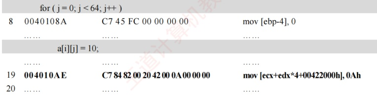
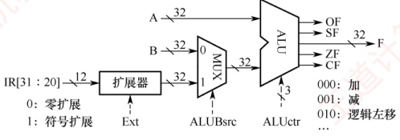
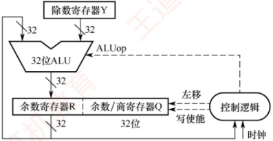

### 4.3.5 本节习题精选

#### 一、 单项选择题

##### 01

假设 R[ax] = FFE8H, R[bx] = 7FE6H, 执行指令 “add ax, bx” 后，寄存器的内容和各标志的变化为（）。

A. R[ax] = 7FCEH, OF = 1, SF = 0, CF = 0, ZF = 0

B. R[bx] = 7FCEH, OF = 1, SF = 0, CF = 0, ZF = 0

C. R[ax] = 7FCEH, OF = 0, SF = 0, CF = 1, ZF = 0

D. R[bx] = 7FCEH, OF = 0, SF = 0, CF = 1, ZF = 0

##### 02

假设 R[ax] = 7FE6H, R[bx] = FFE8H, 执行指令 “sub bx, ax” 后，寄存器的内存和各标志的变化为（）。

A. R[ax] = 8002H, OF = 0, SF = 1, CF = 1, ZF = 0

B. R[bx] = 8002H, OF = 0, SF = 1, CF = 0, ZF = 0

C. R[ax] = 8002H, OF = 1, SF = 1, CF = 0, ZF = 0

D. R[bx] = 8002H, OF = 1, SF = 1, CF = 0, ZF = 0

##### 03

某计算机的数据采用小端方式存储，减法指令“sub ax, imm”的功能为(ax)−imm→ax，imm 表示立即数，该指令对应的十六进制机器码为 2dxxx（从左到右以字节为单位由低地址到高地址），其中 xxxx 对应 imm 的机器码，若 imm = -3，(ax) = 7，则该指令对应的机器码和执行后 OF 标志位的值分别为（）。

A. 2DFFFDH, 0 B. 2DFFFDH, 1 C. 2DFDFFH, 0 D. 2DFDFFH, 1

##### 04

某C语言程序中对数组变量b的声明为“int b[10][5]；”，有一条for语句如下：
```c
for (i=0; i<10; i++)

    for (j=0; j<5; j++)

        sum+=b[i][j];
```

假设执行到“sum+=b[i][j],”时，sum的值在eax中，b[i][0]所在的地址在edx中，j在esi中，则“sum+=b[i][j],”所对应的指令（Intel格式）可以是（）。
```c

A. add dword ptreax,[edx+esi*4] B. add dword ptreax,[esi+edx*4]

C. add dword ptreax,[edx+esi*2] D. add dword ptreax,[esi+edx*2]
```

##### 05

假设 R[eax] = 080480B4H, R[ebx] = 00000011H, M[080480F8H] = 000000B0H, 执行指令 “imul eax, [eax+ebx*4], -16” 后，寄存器或存储单元的内容变为（）。

A. R[eax] = 00000B00H

B. M[080480F8H] = 00000B00H

C. R[eax] = FFFFF500H

D. M[080480F8H] = FFFFF500H

##### 06

程序 P 中有两个变量 i 和 j，被分别分配在寄存器 eax 和 edx 中，P 中语句 “if(i<j) {...}” 对应的指令序列如下（左边为指令地址，中间为机器代码，右边为汇编指令），其中 jle 指令的偏移量为 0d:

804846a 39 c2 cmp dword ptr edx,eax

804846c 7e 0d jle xxxxxxxx

若执行到 804846aH 处的 cmp 指令时，i = 105，j = 100，则 jle 指令执行后将转到（）处的指令执行。

A. 8048461H B. 804846eH C. 8048479H D. 804847bH

##### 07

假定全局数组 a 的声明为 double a[8]，a 的首地址为 80498c0H，变量 i 被分配在寄存器 ecx 中，现要将 a[i]取到 eax 相应宽度的寄存器中，则所用的汇编指令是（）。

A. mov eax, [ecx*4+80498c0H]

B. mov eax, ecx*4+80498c0H

C. mov eax, [ecx*8+80498c0H]

D. mov eax, ecx*8+80498c0H

##### 08

子程序调用指令执行时，必须完成的操作是（）。

A. 仅将子程序入口地址送入程序计数器（PC）

B. 将返回地址存入主存，并将子程序入口地址送入程序计数器（PC）

C. 将程序计数器（PC）当前值存入通用寄存器

D. 修改数据通路中的控制信号以实现转移

##### 09

下列关于选择结构语句 “if(comp_A) then statement_B; else statement_C” 对应的机器级代码表示的叙述中，错误的是（）。

A. 一定包含一条无条件转移指令

B. 一定包含一条条件转移指令（分支指令）

C. 计算 comp_A 的代码段一定在条件转移指令之前
```c

D. 对应 statement_B 的代码一定在对应 statement_C 的代码之前
```

##### 10

下列关于循环结构语句的机器级代码表示的叙述中，错误的是（）。

A. 一定至少包含一条条件转移指令

B. 不一定包含无条件转移指令

C. 循环结束条件可以用一条比较指令 CMP 来实现

D. 循环体内执行的指令不包含条件转移指令

##### 11

下列有关调用指令（转子指令）的叙述中，错误的是（）。

A. 与高级语言源程序中的过程调用相对应，一次过程调用对应一条调用指令

B. 指令执行时必须保留返回地址，调用指令随后一条指令的地址是返回地址

C. 嵌套调用时返回地址通常保存在栈中，非嵌套调用时可保存在特定寄存器中

D. 指令执行时将无条件转移到目标地址处，转移目标地址无须在指令中明显给出
##### 12

假设 P 为调用过程，Q 为被调用过程，程序在 32 位 x86 处理器上执行，以下是 C 语言程序中过程调用所涉及的操作：

① 过程 Q 保存 P 的现场，并为非静态局部变量分配空间

② 过程 P 将实参存放到 Q 能访问到的地方

③ 过程 P 将返回地址存放到特定处，并转移到 Q 执行

④ 过程 Q 取出返回地址，并转移回到过程 P 执行

⑤ 过程 Q 恢复 P 的现场，并释放局部变量所占空间

⑥ 执行过程 Q 的函数体

过程调用的正确执行步骤是（）。

A. ②→③→④→①→⑤→⑥

B. ②→③→①→④→⑥→⑤

C. ②→③→①→⑥→⑤→④

D. ②→③→①→⑤→⑥→④

#### 二、 综合应用题

##### 01

【2017 统考真题】在按字节编址的计算机 M 上，f1 的部分源程序（阴影部分）如下。将 f1 中的 int 都改成 float，可得到计算 f(n) 的另一个函数 f2。

```c
int f1(unsigned n){
    int sum=1, power=1;
    for(unsignedi=0;i<=n-1;i++) {
        power^{*}=2;
        sum += power;
    }
    return sum;
}
```

对应的机器级代码（包括指令的虚拟地址）如下：

int f1(unsigned n)
00401020 55 push ebp
... ... ... ...
for (unsigned i=0; i<= n-1; i++)
... ... ... ...
20 0040105E 39 4D F4 cmp dword ptr [ebp-0Ch],ecx
... ... ... ... ...
| power = 2;
... ... ... ...
23 00401066 D1 E2 shl edx,1
... ... ... ...
```c
return sum;
```
... ... ... ...
35 0040107F C3 ret

其中，机器级代码行包括行号、虚拟地址、机器指令和汇编指令。

1）计算机M是RISC还是CISC？为什么？

2）f1的机器指令代码共占多少字节？要求给出计算过程。

3）第20条指令 cmp 通过 i 减 n-1 实现对 i 和 n-1 的比较。执行 fl(0) 的过程中，当 i=0 时，cmp 指令执行后，进位/借位标志 CF 的内容是什么？要求给出计算过程。
```c

4）第23条指令 shl 通过左移操作实现了 power *2 运算，在 f2 中能否用 shl 指令实现 power *2？为什么？
```

##### 02

【2019 统考真题】已知  $f(n) = n! = n \times (n-1) \times (n-2) \times \cdots \times 2 \times 1$，计算  $f(n)$ 的 C 语言函数  $f(1)$ 的源程序（阴影部分）及其在 32 位计算机 M 上的部分机器级代码如下：
```c
int f1(int n) {
```
    1 00401000 55 push ebp
```c
    ... if(n>1)
        11 00401018 83 7D 08 01 cmp dword ptr [ebp+8],1
        12 0040101C 7E 17 jle f1+35h (00401035)
        return n*f1(n-1);
        13 0040101E 8B 45 08 mov eax, dword ptr [ebp+8]
```
        14 00401021 83 E8 01 sub eax, l
        15 00401024 50 push eax
        16 00401025 E8 D6 FF FF FF call f1 (00401000)
        ...
        19 00401030 OF AF C1 imul eax, ecx
```c
        20 00401033 EB 05 jmp f1+3Ah (0040103a)
        else return 1;
```
        21 00401035 B8 01 00 00 00 mov eax,l
    }
    ...
    26 00401040 3B EC cmp ebp, esp
    ...
    30 0040104A C3 ret

其中，机器级代码行包括行号、虚拟地址、机器指令和汇编指令，计算机 M 按字节编址，int 型数据占 32 位。请回答下列问题：

1）计算 $f(10)$需要调用函数f1多少次？执行哪条指令会递归调用f1？

2）上述代码中，哪条指令是条件转移指令？哪几条指令一定会使程序转移执行？

3）根据第16行的call指令，第17行指令的虚拟地址应是多少？已知第16行的call指令采用相对寻址方式，该指令中的偏移量应是多少（给出计算过程）？已知第16行的call指令的后4字节为偏移量，M是采用大端方式还是采用小端方式？

4） $f(13)=6227020800$，但 $f_{1}(13)$的返回值为1932053504，为什么两者不相等？要使 $f_{1}(13)$能返回正确的结果，应如何修改 $f_{1}$的源程序？

5）第19行的 imul 指令（有符号整数乘）的功能是  $R[eax] \leftarrow R[eax] \times R[ecx]$，当乘法器输出的高、低32位乘积之间满足什么条件时，溢出标志 OF = 1？要使 CPU 在发生溢出时转异常处理，编译器应在 imul 指令后加一条什么指令？

##### 03

【2019 统考真题】对于题 02，若计算机 M 的主存地址为 32 位，采用分页存储管理方式，页大小为 4KB，则第 1 行的 push 指令和第 30 行的 ret 指令是否在同一页中（说明理由）？若指令 Cache 有 64 行，采用 4 路组相联映射方式，主存块大小为 64B，则 32 位主存地址中，哪几位表示块内地址？哪几位表示 Cache 组号？哪几位表示标记（tag）信息？读取第 16 行的 call 指令时，只可能在指令 Cache 的哪一组中命中（说明理由）？

##### 04

【2023 统考真题】已知计算机 M 的字长为 32 位，按字节编址，采用请求调页策略的虚拟存储管理方式，虚拟地址为 32 位，页大小为 4KB。某 C 语言程序段在计算机 M 上的部分机器级代码如下，数组 a 的定义为 “int a[24][64]；”，每个机器级代码行中依次包含指令序号、虚拟地址、机器指令和汇编指令。

| for ( i = 0; i < 24; i++) |   |   |   |
| --- | --- | --- | --- |
| 1 | 00401072 | C7 45 F8 00 00 00 00 | mov [ebp-8], 0 |
| 2 | 00401079 | EB 09 | jmp 00401084h |
| 3 | 0040107B | 8B 55 F8 | mov eax, [ebp-8] |
| ...... |   | ...... | ...... |
| 7 | 00401088 | 7D 32 | jge 004010bch |



请回答下列问题。

1）第20条指令的虚拟地址是多少？

2）已知第2条 jmp 和第7条 jge 都是转移指令，其操作码分别是 EBH 和 7DH，转移目标地址分别为 0040 1084H、0040 10BCH，这两条指令都采用什么寻址方式？给出第2条指令 jmp 的转移目标地址计算过程。

3）已知第19条 mov 指令的功能为“a[i][j]←10”，其中 ecx 和 edx 为寄存器名，0042 2000H 是数组 a 的首地址，指令中源操作数采用什么寻址方式？已知 edx 中存放的是变量 j，ecx 中存放的是什么？根据该指令的机器码判断 M 采用的是大端还是小端方式。

4）第一次执行第19条指令时，取指令过程中是否会发生缺页异常？为什么？

##### 05

【2024 统考真题】假定计算机 M 字长为 32 位，按字节编址，采用 32 位定长指令字，指令 add、sli 和 lw 的格式、编码和功能说明如图(a)所示。

| 指令 | 31 | 25 | 24 | 20 | 19 | 15 | 14 | 12 | 11 | 7 | 6 | 0 | 指令功能说明 |
| --- | --- | --- | --- | --- | --- | --- | --- | --- | --- | --- | --- | --- | --- |
| add | 0000000 | rs2 | rs1 | 000 | rd | 0110011 | R[rd]←R[rs1]+R[rs2] |   |   |   |   |   |   |
| slli | 0000000 | shamt | rs1 | 010 | rd | 0010011 |   |   |   |   |   |   |   |
| lw | imm |   | rs1 | 010 | rd | 0000011 | R[rd]←M[R[rs1]+imm] |   |   |   |   |   |   |

图(a)

其中，R[x]表示通用寄存器x的内容，M[x]表示地址为x的存储单元内容，shamt为移位位数，imm为补码表示的偏移量。图(b)给出了计算机M的部分数据通路及其控制信号（用带箭头虚线表示），其中A和B分别表示从通用寄存器rs1和rs2中读出的内容；IR[31:20]表示指令寄存器中的高12位；控制信号Ext为0、1时扩展器分别实现零扩展、符号扩展，ALUctr为000、001、010时ALU分别实现加、减、逻辑左移运算。请回答下列问题。



图(b)

1）计算机 M 最多有多少个通用寄存器？为什么 shamt 字段占 5 位？

2）执行 add 指令时，控制信号 ALUBsrc 的取值应是什么？若 rsl 和 rs2 寄存器内容分别是 8765 4321H 和 9876 5432H，则 add 指令执行后，ALU 输出端 F、OF 和 CF 的结果分别是什么？若该 add 指令处理的是无符号整数，则应根据哪个标志判断是否溢出？

3）执行 sli 指令时，控制信号 Ext 的取值可以是 0 也可以是 1，为什么？

4）执行 lw 指令时，控制信号 Ext、ALUctr 的取值分别是什么？
5）若一条指令的机器码是 A040 A103H，则该指令一定是 lw 指令，为什么？若执行该指令时，R[01H]=FFFF A2D0H，则所读取数据的存储地址是什么？

##### 06

【2024 统考真题】对于题 05 中的计算机 M，C 语言程序 P 包含的语句 “sum += a[i]”; 在 M 中对应的指令序列 S 如下。

```asm
slli r4, r2, 2    //R[r4]←R[r2]<<2
add r4, r3, r4    //R[r4]←R[r3]+R[r4]
lw r5, 0(r4)    //R[r5]←M[R[r4]+0]
add r1, r1, r5    //R[r1]←R[r1]+R[r5]
```

已知变量 i、sum 和数组 a 都为 int 型，通用寄存器 rl～r5 的编号为 01H～05H。请回答下列问题。

1）根据指令序列 S 中每条指令的功能，写出存放数组 a 的首地址、变量 i 和 sum 的通用寄存器编号。

2）已知 M 为小端方式计算机，采用页式存储管理方式，页大小为 4KB。若执行到指令序列 S 中第 1 条指令时，i=5 且 r1 和 r3 的内容分别为 0000 1332H 和 0013 DFF0H，从地址 0013 DFF0H 开始的存储单元内容如下图所示，则执行“sum+=a[i],” 语句后，a[i]的地址、a[i]和 sum 的机器数分别是什么（用十六进制表示）？a[i]所在页的页号是多少？此次执行中，数组 a 至少存放在几页中？

| 地址 | 0 | 1 | 2 | 3 | 4 | 5 | 6 | 7 |
| --- | --- | --- | --- | --- | --- | --- | --- | --- |
| 0013 DFF0 | FF | FF | FF | 7C | 70 | FE | FF | FF |
| 0013 DFF8 | 00 | 00 | 00 | 0C | 3C | 02 | 01 | FF |
| 0013 E000 | F0 | F1 | 00 | 00 | DC | EC | FF | FF |
| 0013 E008 | FF | FF | 01 | 02 | 00 | 00 | 01 | 02 |

3）指令“slli r4, r2, 2”的机器码是什么（用十六进制表示）？若数组 a 改为 short 类型，则指令序列 S 中 slli 指令的汇编形式应是什么？

##### 07

【2025 统考真题】现有 C 语言程序 P 的部分代码如下所示。假定运行程序 P 的计算机 M 字长为 32 位，按字节编址。假定 P 的部分机器级代码如图(a)所示，其中，R0～R4 为通用寄存器，SEXT 表示按符号扩展；M 中补码除法器逻辑结构如图(b)所示。

```c
int x,d[2048],i;
...
for (i=0; i<2048; i++)
d[i]=d[i]/x;

...
//x 在 R2 中，i 在 R4 中
//数组 d 的首地址在 R3 中

mov R1, (R3+R4*4) // R1←d[i]
scov R1 // {R0, R1}←SEXT(R1)
idiv R1, R2 // R1←{R0, R1}/R2
```
...

(a)



(b)

请回答下列问题。
1）若执行图(a)中 idiv 指令的除运算时，d[i]=0x87654321、x=0xff，则补码除法器中寄存器 R、Q 和 Y 的初始内容分别是什么（用十六进制表示）？图(b)中哪个部件包含计数器？在补码除法器执行过程中，由 ALUop 所控制的 ALU 运算有哪几种？

2）假设 idiv 指令执行过程中会检测并触发除法异常，则执行 idiv 指令时，哪些情况下会发生除法异常（要求给出此时 d[i] 和 x 的十六进制表示机器数）？发生除法异常时，在异常响应过程中 CPU 需要完成哪些操作？

### 4.3.6 答案与解析

#### 一、 单项选择题

##### 01

C

该指令是 Intel 格式，add 指令的目的寄存器为 ax。add 指令的补码加法过程为 1111 1111 1110 1000 + 0111 1111 1110 0110 = (1)0111 1111 1100 1110 (7FCEH)，两个操作数的符号不同，必然不会溢出，OF = 0；结果的符号位为 0，SF = 0；有进位，CF = C ⊕ Sub = 1 ⊕ 0 = 1；非 0，ZF = 0。

**注意**

无论是无符号数还是有符号数，都以二进制代码形式无差别地存放在计算机内。即便两个有符号数相加，也会导致CF的变动，只是CF值对有符号数运算是没有意义的。同理，两个无符号数相加，也会导致OF和SF的变动，只是OF值和SF值仅对有符号数运算有意义。

##### 02

B

该指令是 Intel 格式，sub 指令的目的寄存器为 bx。sub 减法运算用补码加法实现，被减数 + 减数逐位取反 + 1 = 1111 1111 1110 1000 + 1000 0000 0001 1001 + 1 = (1)1000 0000 0000 0010 (8002H)，两个操作数的符号位都是 1，结果的符号位也是 1，无溢出，OF = 0；结果为负数，SF = 1；进位输出  $C_{out} = 1$，低位进位 Sub = 1， $CF = C_{out} \oplus Sub = 1 \oplus 1 = 0$；非 0，ZF = 0。

##### 03

C

imm 的值为 -3，转换成二进制为 11111111111111101B，即 FFFDH，因为该计算机采用小端存储，先存储低位字节，所以该指令对应的机器码为 2DFDFFH，OF 是有符号数运算的溢出标志位，7 - (-3) 显然没有溢出，因此 OF 标志位为 0。

##### 04

A

b[i][0]所在的地址在 edx 中，j 在 esi 中，一个数组元素占 4 字节，所以 b[i][j]的地址为 R[edx]+ R[esi]*4，指令格式为 Intel 格式，第一个为目的操作数，第二个为源操作数，于是选项 A 正确。

##### 05

C
```c

指令的一个源操作数在内存单元中，地址为 R[eax]+R[ebx]*4 = 080480B4H+00000011H*4 = 080480F8H。指令的功能是 R[eax]←M[080480F8H]*(-16) = (-000000B0H)<<4 = FFFFFF50H<<4 = FFFFFF500H。目的操作数保存在 eax 中，所以主存单元 080480F8H 中的内容不会改变。
```

##### 06

D

i = 105, j = 100, 即 edx 的内容为 100, eax 的内容为 105, cmp 指令就是对这两个数做减法, 显然 100 < 105, 满足 jle 指令小于或等于的条件, jle 指令长度为 2 字节, 所以 jle 指令执行后将转移到当前 PC 值 + 偏移量 = 804846cH + 2 + 0dH = 804847bH 处执行。

##### 07

C
```c

每个 double 型的数组元素占 8 字节，数组 a 的首地址为 80498c0H，i 存储在 ecx 中，所以 a[i] 在主存中的地址可表示为 [ecx*8+80498c0H]，因此汇编指令可以是 mov eax, [ecx*8+80498c0H]。
```
##### 08

B

子程序调用指令属于控制转移类指令，其执行时必须完成两个关键操作：一是保存返回地址（调用指令的下一条指令地址），通常压入主存中的栈；二是将子程序的入口地址送入PC，以实现转移。选项A仅完成转移，缺失返回地址保存，无法正确返回。选项C和D的描述不准确或不完整。因此，选项B正确且完整地描述了子程序调用的本质功能。

##### 09

D
```c

在 if 语句的机器级代码中，comp_A 后面紧接着有一个条件转移指令，条件成立则转移到 statement_B，statement_B 中有一个无条件转移指令，会转移到 if-else 的下一条语句，选项 A、B 和 C 正确。statement_B 不一定在 statement_C 之前，这取决于条件转移指令的类型和方向，选项 D 错误。
```

##### 10

D

循环结构循环体内最后会有一条条件转移指令，判断是否跳出循环，可以用比较指令（CMP）来实现，选项A和C正确，选项D错误。循环结构不一定包含无条件转移指令，选项B正确。

##### 11

D

为了能保证从被调用过程返回到调用过程继续执行，必须确定并保存返回地址，这个地址是调用指令随后的指令的地址，返回地址只能由调用指令来计算并保存，因为执行调用指令后就转移到了被调用过程，因此无法获取返回地址。为了保证嵌套调用时能够返回到调用过程，必须将返回地址压栈，若不压栈而保存在特定寄存器中，则后面执行的调用指令会将前面调用指令保存的返回地址覆盖掉。调用指令执行时将无条件转移到目标地址处，这个目标地址就是被调用过程第一条指令的地址，它一定在调用指令中明显给出，因此选项D错误。

##### 12

C

过程调用的具体过程已在4.3.4节中介绍。

#### 二、 综合应用题

##### 01

【解答】

1）M为CISC。M的指令长短不一，不符合RISC指令系统的特点。

2）f1 的机器代码占 96B。因为 f1 的第一条指令 “push ebp” 所在的虚拟地址为 0040 1020H，最后一条指令 “ret” 所在的虚拟地址为 0040 107FH，所以 f1 的机器指令代码长度为 0040 107FH - 0040 1020H + 1 = 60H = 96B。

3) CF = 1。cmp 指令实现 i 与 n-1 的比较功能，进行的是减法运算。在执行 f1(0) 的过程中，n = 0，当 i = 0 时，i = 0000 0000H，并且 n-1 = FFFF FFFFH。因此，执行第 20 条指令时，在补码加/减运算器中执行“0 减 FFFF FFFFH”操作，即 0000 0000H + 00000000H + 1 = 0000 0001H，此时进位输出  $C_{out} = 0$，低位进位 Sub = 1，CF =  $C_{out} \oplus Sub = 0 \oplus 1 = 1$。
```c

4）f2 中不能用 shl 指令实现 power*2。因为 shl 指令把一个整数的所有有效数位整体左移，而 f2 中的变量 power 是 float 型，其机器数中不包含最高有效数位，但包含了阶码部分，将其作为一个整体左移时并不能实现“乘以 2”的功能，因此 f2 中不能用 shl 指令实现 power*2。浮点数运算比整型运算要复杂，耗时也较长。
```

##### 02

【解答】

1）计算 $f(10)$需要调用函数f1共10次，执行第16行的call指令会递归调用f1。

2）第12行的jle指令是条件转移指令，其含义为小于或等于时转移，本行代码的意义为：当 $n \leq 1$时，转移至地址0040 1035H。第16行的call指令为函数调用指令，第20行的jmp指令为无条件转移指令，第30行的ret指令为子程序的返回指令，这三条指令一定会使
程序转移执行。

3）在计算机 M 上按字节编址，第 16 行的 call 指令的虚拟地址为 0040 1025H，长度为 5 字节，因此第 17 行的指令的虚拟地址为 0040 1025H + 5 = 0040 102AH。第 16 行的 call 指令采用相对寻址方式，即目标地址 = (PC) + 偏移量，call 指令的目标地址为 0040 1000H，所以偏移量 = 目标地址 - (PC) = 0040 1000H - 0040 102AH = FFFF FFD6H。根据第 16 行的 call 指令的偏移量字段为 D6 FF FF FF，可以确定 M 采用小端方式。

4）因为 $f(13)=6227020800$，其结果超出了32位int型数据可表示的最大范围，因此 $f(13)$的返回值是一个发生了溢出的错误结果。为使 $f(13)$能返回正确结果，可将函数 $f1$的返回值类型改为double（或long long，或long double，或float）类型。

5）若乘积的高33位不全为0或不全为1，则OF = 1。编译器应在imul指令后加一条“溢出自陷指令”，使得CPU自动查询溢出标志OF，当OF = 1时调出“溢出异常处理程序”。

##### 03

【解答】

因为页大小为 4KB，所以虚拟地址的高 20 位为虚拟页号。第 1 行的 push 指令和第 30 行的 ret 指令的虚拟地址的高 20 位都是 00401H，因此两条指令在同一页中。

指令 Cache 有 64 块，采用 4 路组相联映射方式，因此指令 Cache 共有 64/4 = 16 组，Cache 组号共 4 位。主存块大小为 64B，因此块内地址为低 6 位。综上所述，在 32 位主存地址中，低 6 位为块内地址，中间 4 位为组号，高 22 位为标记。

因为页大小为 4KB，所以虚拟地址和物理地址的最低 12 位完全相同，因此 call 指令虚拟地址 0040 1025H 中的 025H = 0000 0010 0101B 为物理地址的低 12 位，对应的 7～10 位为组号，因此对应的 Cache 组号为 0。

##### 04

【解答】

1）第19条指令的虚拟地址为004010AEH，且第19条指令占11字节，因此第20条指令的虚拟地址为004010AEH+11（十进制）=004010B9H。

2）第2条指令的虚拟地址为 00401079H，占2字节，取该指令后，PC +2，变为 0040107BH，转移指令的目标地址为 00401084H，因此偏移量为 00401084H - 0040107BH = 09H，根据第2条指令的机器码可知，09H 恰好是第2条指令给出的偏移量。第7条指令的分析同理。因此，第2条 jmp 和第7条 jge 指令都采用相对寻址方式。第2条指令 jmp 的转移目标地址 = 0040 1079H + 2（十进制）+ 09H = 0040 1084H。

3）第 19 条指令的源操作数为 0AH，直接在机器指令中（0A 00 00 00）给出，因此采用立即（数）寻址方式。数组 a 的一行有 64 个元素，每个元素占 4 字节，因此 a[i][j] 的地址应为 00422000h + i×64×4 + j×4 = 00422000h + i×256 + j×4，根据汇编指令中给出的计算公式 ecx + edx*4 + 00422000h 可知，ecx 中存放的是 i×256。M 采用小端方式。

4）第一次执行第19条指令时，取指令过程中不会发生缺页异常。因为第19条指令所在的该程序段都在页号为00401H的同一个页面中，执行第19条指令时，该页已在主存，因此取指令过程中不会发生缺页异常。

##### 05

【解答】

1）最多有  $2^5 = 32$ 个通用寄存器。M 字长为 32 位，因此通用寄存器宽度为 32 位，于是 shamt 字段占  $\log_2 32 = 5$ 位。

2）add 指令的两个源操作数均来自通用寄存器，因此控制信号 ALUBsrc = 0。rs1 = 87654321H，rs2 = 9876 5432H，则 rs1 + rs2 = 8765 4321H + 9876 5432H = 1FDB 9753H，在计算过程中，次高位向最高位的进位为 0，最高位产生的进位为 1，因此 OF = 0 ⊕ 1 = 1。add
做的是加法操作，sub = 0，因此 CF = 0 ⊕ 1 = 1。无符号数根据 CF 判断是否溢出。

3）因为 sli 指令的移位位数只使用 IR[31:20] 中的低 5 位，与高位 IR[31:25] 及扩展出来的位无关，所以 Ext 取值可以是 0，也可以是 1。

4）lw 指令的功能是将主存地址为 R[rs1] + imm 的数据加载到目标寄存器中，需要首先通过 ALU 计算访存有效地址，imm 是补码表示的 12 位有符号数，在和 R[rs1]中的 32 位数相加时，需要进行符号扩展，R[rs1]中的数和 imm 符号扩展后的数做的是加法。因此，Ext = 1；ALUctr = 000。

5）因为 A040 A103H = 101000000100 00001 010 00010 0000011B，根据指令格式中 IR[6:0] = 0000011B，IR[14:12] = 010B，可以判定该指令是 1w 指令。1w 指令的高 12 位 = A04H，经过符号扩展后，得到 32 位机器码为 FFFF FA04H，所读取数据的存储地址为 FFFF A2D0H + FFFF FA04H = FFFF 9CD4H。

##### 06

【解答】

1）变量 i 存放在 r2 中。R[r4]←R[r2]<<2 的功能是将 i 左移两位，即将 i×4 的值送到 r4。数组 a 的首地址（a[0]的地址）存放在 r3 中。R[r4]←R[r3]+R[r4]的功能是计算 addr(a[0]) + i×4，即将 a[i]的地址送到 r4。R[r5]←M[R[r4]+0]的功能是将 a[i]送到 r5。变量 sum 存放在 r1 中。R[r1]←R[r1]+R[r5]的功能是将 sum + a[i]的结果送回 r1。

2）数组 a 的首地址为 0013 DFF0H，从表中可以看出，a[5]的地址为 0013 E004H。M 为小端方式计算机，根据表格可知，a[5]的机器数为 FFFF ECDCH。页大小为 4KB，因此页内偏移量为低 12 位，页号为地址高 20 位，即 0013EH。sum 的初值为 0000 1332H，执行 sum+=a[i] 后，sum 的机器数更新为 0000 1332H + FFFF ECDCH = 0000 000EH。表格中的数据包含了页号为 0013DH 和 0013EH 两个不同页面的数据，所以数组 a 至少存放在 2 页中。

3）指令机器码 = 0000000 00010 00010 010 00100 0010011 = 0021 2213H。若数组 a 改为 short 型，则每个元素占 2 字节，a[i] 的地址为 addr(a[0]) + i×2，因此汇编形式是 slli r4, r2, 1。

##### 07

【解答】

1）scov R1 指令对 d[i]做符号扩展（符号位为 1），得到 64 位的被除数，高 32 位 FFFF FFFFH 存入 R0，低 32 位 87654321H 存入 R1。在除法器中，被除数加载到 {R, Q} 中，因此 R 的初始内容是 FFFF FFFFH，Q 的初始内容是 8765 4321H；除数 x 加载到 Y 中，因此 Y 的初始内容是 0000 00FFH。补码除法需要执行固定次数的迭代，因此控制逻辑部件中包含计数器。在补码除法过程中，每一步根据当前余数与除数的符号关系，决定是执行加法还是执行减法，因此由 ALUop 控制的 ALU 运算有加法运算和减法运算。

2）idiv 指令可能发生以下两种异常：当 x 为 00000000H 时，发生除数为零异常；当 d[i] 为 8000 0000H 且 x 为 FFFF FFFFH 时（用最小负数除以 -1），发生除运算溢出异常。CPU 检测到除法异常后，需将断点和程序状态保存到内核栈或特定寄存器中，关中断，最后转移到内核中的除法异常处理程序执行。
