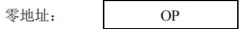
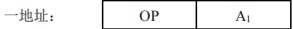
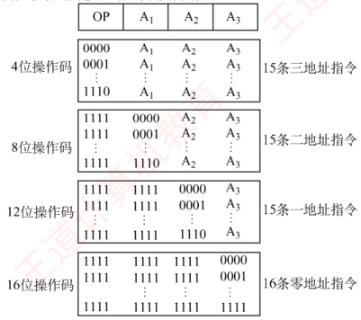

## 4.1 指令系统

### 4.1.1 指令集体系结构

### 考点追踪 指令集体系结构（ISA）的内容（2022、2025）

机器指令（简称指令）是指示计算机执行某种操作的命令。一台计算机的所有指令的集合构成该机的指令系统，也称指令集。指令系统是指令集体系结构（ISA）中最核心的部分。ISA 完整定义了软件与硬件之间的接口，是机器语言或汇编语言程序员必须掌握的基础。
ISA 规定的内容主要包括：

1）指令格式、寻址方式、操作类型，以及各操作所需操作数的个数、类型和寻址约束。

2）操作数的数据类型，以及是按大端还是小端方式存放。

3）程序可访问的寄存器编号、数量和位数，存储空间的大小及编址方式。

4）程序员可见的控制状态，如程序计数器、条件码的定义与行为等。

ISA 规定了机器级程序的格式，因此机器语言或汇编语言程序员必须熟悉所用机器的 ISA。然而，大多数程序员使用高级语言（如 C/C++/Java）编程，因其开发效率高且不易出错。但高级语言的抽象层较高，隐藏了许多机器级细节，导致程序员难以利用与硬件结构相关的优化手段提升性能。若能充分理解 ISA 及底层硬件特性，则能开发出性能更优的程序。

### 4.1.2 指令的基本格式

一条指令是机器语言的一个语句，由一组有意义的二进制代码组成。其基本格式如下：

| 操作码字段 | 地址码字段 |
| --- | --- |

其中，操作码指明指令应执行的操作及功能，是识别指令、理解其作用以及确定地址码含义的关键，例如指示算术加法或减法、程序转移或返回等。地址码给出被操作信息（指令或数据）的地址，包括源操作数地址、目的操作数地址、转移目标地址或子程序入口地址等。

指令字长是指一条指令所包含的二进制位数，取决于操作码长度、地址码长度及地址码个数。在一个指令系统中，若所有指令字长相等，则称为定长指令字结构。定长指令取指和译码简单，有利于流水线实现。若指令字长随功能而异，则称为变长指令字结构。由于主存通常按字节编址，指令字长通常为字节的整数倍。

根据指令中操作数地址码数目的不同，可将指令分为以下几种格式。

### 考点追踪 根据指令格式及相关编码条件组合成机器代码（2015）

#### 1. 零地址指令

零地址：

仅包含操作码，无显式地址。此类指令有两种情况：

1）无须操作数的指令，如空操作、停机、关中断等。

2）用于堆栈计算机的运算指令，其操作数隐含从栈顶和次栈顶弹出，运算结果压回栈顶。

#### 2. 一地址指令

一地址：

其具体形式由操作码决定，常见有两种：

1）单操作数指令：按  $A_{1}$ 地址读取操作数，进执行 OP 操作后结果存回  $A_{1}$

指令含义： $\text{OP}(A_1) \rightarrow A_1$

如加1、减1、求反、求补、移位等。

2）累加器型双操作数指令： $A_1$为源操作数地址，另一操作数隐含在ACC，结果存入ACC。

指令含义：(ACC)OP( $A_1$)→ACC

若地址码为主存地址，完成一条一地址指令需3次访存（取指1次，取数1次，存结果1次）。

#### 3. 二地址指令

| 二地址： | OP | $A_{1}$ | $A_{2}$ |
|---|---|---|---|
指令含义：(A₁)OP(A₂)→A₁

二地址指令中， $A_{1}$ 为目的操作数地址（兼结果地址）， $A_{2}$ 为源操作数地址。若地址码均为主存地址，完成一条二地址指令需 4 次访存（取指 1 次，取两个操作数 2 次，存结果 1 次）。

#### 4. 三地址指令

| 三地址： | OP | $A_{1}$ | $A_{2}$ | $A_{3}$（结果） |
|---|---|---|---|---|

指令含义：(A₁)OP(A₂)→A₃。

在三地址指令中， $A_{1}$ 和  $A_{2}$ 为两个源操作数地址， $A_{3}$ 为结果地址。若地址码均为主存地址，完成一条三地址指令需 4 次访存（取指 1 次，取两个操作数 2 次，存结果 1 次）。

### 4.1.3 定长操作码指令格式

### 考点追踪 定长操作码的指令条数（2015）

定长操作码指令在指令字的最高位部分分配固定位数表示操作码。一个n位操作码字段的指令系统最多可表示2n条指令。定长操作码有利于简化硬件设计并提高译码速度。在字长为32位或更长的系统中，这种格式是常规用法。

### 4.1.4 扩展操作码指令格式

### 考点追踪 扩展操作码的设计与分析（2017、2021、2022）

为在有限的指令字长内支持丰富的指令种类，常采用可变长度操作码，即指令的操作码字段位数不固定，且分散在指令的不同位置。这增加了指令译码和分析的难度，使控制器设计更加复杂。最常见的变长操作码方法是扩展操作码（见图4.1），它使操作码长度随地址码减少而增

操作码的位数随地址数的减少而增加

图4.1 一种扩展操作码的安排方式

指令字长为16位，其中4位为基本操作码字段OP，另有3个4位长的地址字段 $A_{1}$、 $A_{2}$和 $A_{3}$。若4位基本操作码全部用于三地址指令，则最多支持16条指令。实际使用了15条三地址指令，保留1111作为扩展操作码；对于二地址指令，保留11111作为扩展操作码，共15条；对于一地址指令，保留111111111作为扩展操作码，共15条；零地址指令共16条。

除这种安排外，还有其他多种扩展方法，例如形成15条三地址指令、12条二地址指令、63条一地址指令和16条零地址指令，共106条指令，请读者自行分析。

在设计扩展操作码指令格式时，必须注意以下两点：

1）不允许短操作码成为长操作码的前缀，即短操作码不能与长操作码的前面部分相同。

2）各指令的操作码一定不能重复。

通常情况下，对使用频率较高的指令分配较短的操作码，对使用频率较低的指令分配较长的操作码，从而尽可能减少指令译码和分析的时间。
### 4.1.5 指令的类型

设计指令系统时必须考虑应提供哪些操作类型，指令按功能可分为以下几种。

#### 1. 数据传送指令

传送指令主要有寄存器之间的传送（MOV）、从内存单元读取数据到CPU寄存器（LOAD）、从CPU寄存器写数据到内存单元（STORE）、进栈操作（PUSH）、出栈操作（POP）等。

#### 2. 算术和逻辑运算指令

算术和逻辑运算指令主要有加（ADD）、减（SUB）、乘（MUL）、除（DIV）、加1（INC）、减1（DEC）、与（AND）、或（OR）、取反（NOT）、异或（XOR）等。

#### 3. 移位操作指令

移位指令主要有算术移位、逻辑移位、循环移位等。

#### 4. 顺序控制指令

### 考点追踪 转移指令、调用和返回指令、条件转移指令的区分（2019）

顺序控制指令主要有无条件转移（JMP）、条件转移（BRANCH）、调用（CALL）、返回（RET）、陷阱（TRAP）等。无条件转移指令在任何情况下都执行转移操作，而条件转移指令仅在特定条件满足时执行转移操作，转移条件通常是某个标志位的值或多个标志位的组合。

调用指令与转移指令的区别在于：调用指令会保存下一条指令的地址（返回地址），以便子程序执行结束后能返回到主程序继续执行；而转移指令则不返回。

#### 5. 输入输出指令

输入输出指令用于完成 CPU 与外部设备交换数据或传送控制命令及状态信息。

#### 6. CPU 控制指令

CPU 控制指令主要有停机、开中断、关中断、系统模式切换以及进入特殊处理程序等。这类指令只能在操作系统内核代码中使用，以防止用户误用，对系统运行造成危害。
