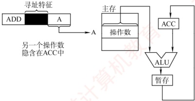
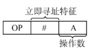
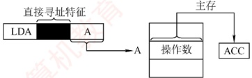
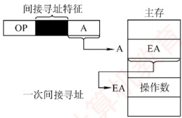
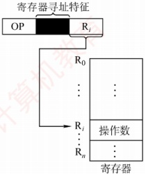
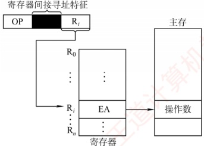
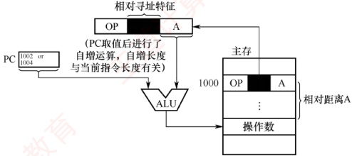
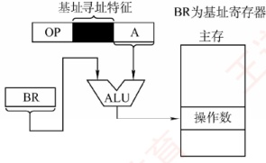
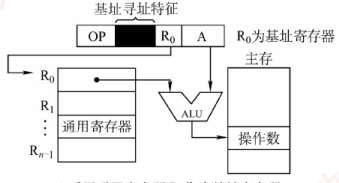
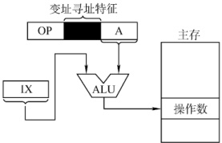

## 4.2 寻址方式

寻址方式是指确定指令或操作数有效地址的方法，包括确定下一条待执行指令的地址以及本条指令所需操作数的地址。寻址方式分为指令寻址和数据寻址两大类。

### 4.2.1 指令寻址和数据寻址

确定下一条将要执行的指令地址称为指令寻址；确定本条指令操作数地址称为数据寻址。

#### 1. 指令寻址

指令寻址有两种方式：顺序寻址和跳跃寻址。

##### （1）顺序寻址

通过程序计数器（PC）加上当前指令的字节长度，自动形成下一条指令地址。

考点追踪 PC 自增大小与编址方式、指令字长的关系（2013、2014、2019、2023）

**注意**

PC 自增的大小与编址方式和指令字长有关。现代计算机通常按字节编址，若指令字长为 16 位（2 字节），则 PC 自增为  $(PC)+2$；若指令字长为 32 位（4 字节），则 PC 自增为  $(PC)+4$。

##### （2） 跳跃寻址

通过转移类指令实现。是否发生转移通常由状态寄存器中的条件码决定，转移目标地址由指令给出。转移方式分为：① 绝对转移，地址码直接给出目标地址；② 相对转移，地址码给出相对于当前 PC 值的偏移量。无论何种方式，转移指令的执行结果都是修改 PC 的值，CPU 随后根据新的 PC 从主存取出下一条指令。

#### 2. 数据寻址

### 考点追踪 指令格式字段位数的分析（2020）

数据寻址指如何在指令中表示或计算操作数的地址。为区分不同寻址方式，指令字中通常设有寻址特征字段，其位数决定了可支持的寻址方式种类。典型指令格式如下：

考点追踪 指令格式中寻址特征字段的作用（2023）

| 操作码 | 寻址特征 | 形式地址 A |
| --- | --- | --- |

指令中的地址码字段所包含的地址称为形式地址（A），它不代表操作数的真实地址；真实地址需通过寻址方式由形式地址计算得出，称为有效地址（EA）。

若为立即寻址，则形式地址的位数决定了操作数的取值范围。

若为直接寻址，则形式地址的位数决定了可寻址的存储空间大小。

若为寄存器寻址，则形式地址的位数决定了通用寄存器的最大数量。

若为寄存器间接寻址，则寄存器的位数决定了可寻址空间大小。

**注意**

(A)表示地址 A 处所存放的内容，A 可以是寄存器编号或内存地址。

### 4.2.2 常见的数据寻址方式

#### 1. 隐含寻址

隐含寻址是指指令中不显式给出操作数地址，而将操作数地址隐含在特定寄存器中。例如，在累加器型结构中，单地址指令仅显式指定一个操作数地址，另一个操作数默认来自累加器（ACC），运算结果也通常存回 ACC，如图 4.2 所示。

图4.2 隐含寻址

优点是可有效缩短指令字长；缺点是依赖存储隐含操作数的硬件（如 ACC）。

#### 2. 立即（数）寻址

### 考点追踪 立即寻址的概念（2023）

在立即寻址中，指令的形式地址字段并不表示操作数的地址，而是直接存放操作数本身，称为立即数，通常以补码形式表示。如图4.3所示，#表示立即寻址特征，A即为立即数。

优点是操作数已包含在指令中，执行阶段无须访问存储器，指令执行速度最快；缺点是立即数的大小受限于形式地址字段的位数，寻址范围非常有限。

#### 3. 直接寻址

### 考点追踪 地址位数与直接寻址范围的关系（2010、2021）

直接寻址是指指令中的形式地址 A 就是操作数的真实地址 EA，即 EA = A，如图 4.4 所示。

图4.3 立即寻址示意图

图 4.4 直接寻址示意图

优点是实现简单，无须额外计算操作数地址，执行阶段只需访存一次；缺点是形式地址A的
位数限制了寻址范围，且地址固定，难以动态修改。

例如，若形式地址字段占24位，则直接寻址范围为 $2^{24}=16M$

#### 4. 间接寻址

### 考点追踪 ▶ 间接寻址 EA 的分析（2016）

接寻址是相对于直接寻址而言的，指令中的形式地址 A 并不直接给出操作数的有效地址，

图 4.5 间接寻址示意图

而是指向一个主存单元，该单元中存放操作数的有效地址，即 $E_A = (A)$，如图4.5所示。

优点是可扩大寻址范围（有效地址 EA 的位数通常大于形式地址 A 的位数，由存储字长决定），并支持地址动态生成（如实现指针和转移表）；缺点是指令执行阶段需多次访存（一次间址需 2 次访存）。由于访存开销较大，若需兼顾寻址范围与执行效率，通常采用寄存器间接寻址。

#### 5. 寄存器寻址

### 考点追踪 寄存器编号位数与寄存器数量的关系（2022、2024）

与直接寻址类似，寄存器寻址将操作数存放在寄存器中，指令的地址字段给出的是操作数所在寄存器的编号，即  $EA = R_i$，操作数位于由  $R_i$ 指定的寄存器内，如图 4.6 所示。例如，若 CPU 有 32 个通用寄存器，则寄存器编号需 5 位，形式地址字段仅需 5 位即可寻址全部寄存器。

优点是执行阶段无须访存，仅访问寄存器，执行速度快；且因寄存器数量远少于内存单元，地址码位数较少，有助于缩短指令字长；缺点是寄存器成本高，CPU中可用寄存器数量有限。

#### 6. 寄存器间接寻址

### 考点追踪 寄存器间接寻址的取数操作（2010）

寄存器间接寻址结合了间接寻址和寄存器寻址的特点，指令中的  $R_i$ 所指寄存器中存放的不是一个操作数，而是操作数所在主存单元的地址，即  $\mathrm{EA} = (R_i)$，如图 4.7 所示。

图 4.6 寄存器寻址示意图

图 4.7 寄存器间接寻址示意图

相比间接寻址，寄存器间接寻址在执行阶段只需一次访存，减少了访存开销；同时，由于该方式使用寄存器来存储有效地址，其寻址范围不受形式地址字段位数限制，从而扩大了寻址范围。相比寄存器寻址，这种方式在执行阶段需要从主存获取操作数，增加了访存需求。

#### 7. 相对寻址

### 考点追踪 相对寻址的相关分析与计算（2009、2010、2013、2014、2019、2023）

相对寻址是指将程序计数器（PC）的内容与指令中的形式地址 A 相加，形成转移目标地址，
即  $\mathrm{EA}=(\mathrm{PC})+\mathrm{A}$，如图 4.8 所示。其中，PC 为取指完成后自动更新的值，指向下一条指令的地址；A 是相对于该 PC 值的偏移量，可正可负，通常以补码表示。

图4.8 相对寻址示意图

相对寻址主要用于转移类指令，形式地址 A 的位数决定了转移范围。例如，假设某机器按字节编址，指令长度为 2B。一条相对转移指令（JMP A）位于地址 1000H，其形式地址 A = 0005H（补码表示），则取指完成后 PC = 1002H，实际转移目标地址为  $1002H + 0005H = 1007H$。

优点是目标地址不固定，而是相对于当前指令位置偏移，因此程序可在内存中任意浮动而不影响转移正确性，便于实现重定位和共享代码。

#### 8. 基址寻址

### 考点追踪 基址寻址的 EA 的计算（2019）

基址寻址是指将基址寄存器（BR）的内容与指令中的形式地址 A 相加，形成操作数的有效地址，即  $EA = (BR) + A$，如图 4.9 所示。BR 可以是专用基址寄存器或指定的通用寄存器。

(a) 采用专用寄存器BR作为基址寄存器

(b) 采用通用寄存器 $R_{0}$作为基址寄存器

图 4.9 基址寻址

在多道程序环境下，基址寄存器的内容由操作系统设定，在程序执行期间保持不变（作为基地址），而形式地址A作为偏移量，由用户程序指定并可根据需要变化。当使用通用寄存器作为基址寄存器时，尽管用户可选择哪个寄存器扮演此角色，但其内容仍由操作系统控制。

优点是：可扩大寻址范围（因基址寄存器位数通常大于形式）

间；简化编程，用户无须关注程序在主存的具体位置，有利于多道程序设计和浮动程序的实现。缺点是：形式地址A的位数较短，限制了偏移量的范围。

#### 9. 变址寻址

### 考点追踪 ▶ 变址寻址 EA 的相关计算（2013、2016、2024）

变址寻址是指将变址寄存器（IX）的内容与指令中的形式地址 A 相加，形成操作数的有效地址，即  $EA = (IX) + A$，如图 4.10 所示。IX 可以是专用变址寄存器或指定的通用寄存器。

图4.10 变址寻址

### 考点追踪 ▶️ 变址寻址的特点与应用（2017、2018、2024）

变址寄存器面向用户，其内容（作为偏移量）可以在程序执行中由用户动态修改，而形式地址 A（作为基地址）保持不变。该方式不仅扩大了寻址范围，还特别适用于数组等数据结构的处理——通过调整 IX 的值，可高效访问数组中任意元素，非常适合编写循环程序。例如，假设数组 B 首地址为 1000H，存储在形式地址 A 中；变址寄存器 IX 初始为 0。要访问 B[3] 元素（每个元素占 4B），可将 IX 置为 0CH（3×4=12），则该元素 EA = (IX) + A = 0CH + 1000H = 100CH。

尽管变址寻址与基址寻址均通过“寄存器内容 + 形式地址”生成有效地址，但二者本质不同：基址寻址面向系统，基址寄存器（BR）的内容由操作系统设定且运行时不可变，用于支持多道程序和存储分配；而变址寻址面向用户，IX 的值可由程序动态调整，用于灵活的数据访问。

### 考点追踪 偏移寻址的范畴（2011）

相对寻址、基址寻址和变址寻址均属于偏移寻址，其共同特点是通过某个寄存器的值与形式地址相加来确定操作数的有效地址，便于统一理解和应用。

#### 10. 堆栈寻址

堆栈是存储器（或寄存器组）中一块按后进先出原则管理的特定存储区，其读/写单元的地址由一个称为堆栈指针（SP）的特定寄存器给出。堆栈可分为两类：硬堆栈由高速寄存器构成，成本较高，容量较小；软堆栈则是从主存中划分一段区域实现，更为经济实用。

在采用堆栈结构的计算机中，多数指令表面上表现为无操作数形式，因为其操作数地址由 SP 隐含指定。在访问堆栈时，SP 会自动更新以指向新的栈顶位置。

上述各寻址方式的有效地址计算方法及访存次数（不含取本条指令）的总结见表4.1。

表4.1 寻址方式、有效地址及访存次数

| 寻址方式 | 有效地址 | 访存次数 |
|---|---|---|
| 立即寻址 | A 即是操作数 | 0 |
| 直接寻址 | EA = A | 1 |
| 一次间接寻址 | EA = (A) | 2 |
| 寄存器寻址 | EA = $R_i$ | 0 |
| 寄存器间接一次寻址 | EA = ( $R_i$) | 1 |
| 相对寻址 | EA = (PC) + A | 1 |
| 基址寻址 | EA = (BR) + A | 1 |
| 变址寻址 | EA = (IX) + A | 1 |
