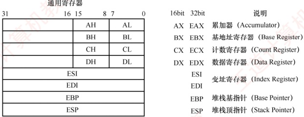
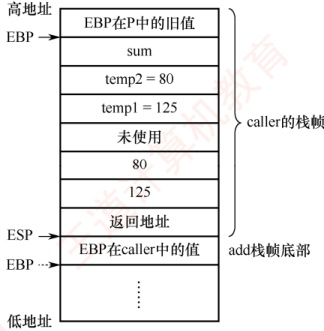

## 4.3 程序的机器级代码表示

### 考点追踪 涉及汇编代码的年份（2012、2014、2015、2017、2019、2023、2024）

本节是2022年新增考点，但相关知识早已多次以综合题形式出现在历年真题中，难度较大，不少跨考生感到无从下手。通过本节学习后，考生应能从容应对此类问题。统考大纲未指定具体指令集，但历年真题主要考查x86和MIPS汇编指令。其中，MIPS指令通常会在试题中附带功能
说明，而 x86 指令则更常作为默认考查对象。因此，本节重点介绍 x86 汇编指令。

### 4.3.1 常用汇编指令介绍

#### 1. 相关寄存器

x86 处理器中有 8 个 32 位通用寄存器，主要寄存器及说明如图 4.11 所示。为向后兼容早期的 16 位和 8 位架构，EAX、EBX、ECX 和 EDX 的低 16 位可作为独立寄存器使用（分别记为 AX、BX、CX、DX），而每个 16 位寄存器又可进一步拆分为两个 8 位寄存器（如 AX 分为 AH 和 AL）。其中，E 表示 Extended，用于标识 32 位寄存器。



图 4.11 x86 处理器中的主要寄存器及说明

除 EBP（基址指针）和 ESP（栈指针）外，其余通用寄存器的用途是比较灵活的。

#### 2. 常用指令

汇编指令通常可分为数据传送指令、算术与逻辑运算指令和控制流指令，下面以 Intel 格式为例，介绍一些常用指令。以下用于操作数的标记分别表示寄存器、内存和常数。

• <reg>：表示任意寄存器，若其后带有数字，则指定其位数，如<reg32>表示32位寄存器（eax, ebx, ecx, edx, esi, edi, esp 或 ebp）；<reg16>表示16位寄存器（ax, bx, cx 或 dx）；<reg8>表示8位寄存器（ah, al, bh, bl, ch, cl, dh, dl）。

- <mem>：表示内存地址（如[eax]、[var +4]或 dword ptr [eax +ebx]）。

<con>：表示8位、16位或32位常数。<con8>表示8位常数；<con16>表示16位常数；<con32>表示32位常数。

### 考点追踪 分析汇编指令对应的二进制代码（2010）

x86 指令采用变长编码，其操作码通常为 1 字节，但整条指令长度可变。同一指令（如 mov）因操作数类型或寄存器不同，可能对应多种机器码编码，例如，

```asm
mov ax, <con16>  #机器码为B8H
mov al, <con8>  #机器码为B0H
mov <reg16>, <reg16>/<mem16>  #机器码为89H
mov <reg8>/<mem8>, <reg8>  #机器码为8AH
mov <reg16>/<mem16>, <reg16>  #机器码为8BH
```

### 考点追踪 模仿写出简单语句的机器级指令（2012）

#### （1） 数据传送指令

1）mov 指令。将第二个操作数（寄存器内容、内存内容或常数值）复制到第一个操作数（寄存器或内存）。其语法如下：
```asm
mov <reg>,<mem>
mov <mem>,<reg>
mov <reg>,<con>
mov <mem>,<con>

举例：

mov eax, ebx
mov byte ptr [var], 5
```

#将 ebx 寄存器的值复制到 eax
#将常数 5 存入地址 var 处的 1 字节内存单元

双操作数指令的两个操作数不能同时为内存，即 mov 指令不能用于直接从内存复制到内存。若需在内存之间复制，可先将源内存内容加载到寄存器，再从该寄存器写入目标内存。

2）push 指令。将操作数压入栈中，常用于函数调用和现场保护。ESP 是栈顶，入栈前先将 ESP 减 4（栈向低地址方向增长），再将操作数压入 ESP 所指地址。其语法如下：

```asm
push <reg32>
push <mem>
push <con32>
```

举例（注意，栈中元素固定为32位）：

```asm
push eax
push [var]
```

#将 eax 的值压入栈
#将地址 var 处的 4 字节内容压入栈

3）pop指令。与push指令相反，从栈中弹出数据。出栈前先将ESP所指地址的内容读出，再将ESP加4。其语法如下：

```asm
pop eax #弹出栈顶元素并存入 eax
pop [ebx] #弹出栈顶元素并存入 ebx 所指的 4 字节内存地址
```

#### （2）算术和逻辑运算指令

1）add/sub 指令。add 指令将两个操作数相加，sub 指令将第一个操作数减去第二个操作数，结果均保存在第一个操作数中。其语法如下：

```asm
add <reg>,<reg> / sub <reg>,<reg>
add <reg>,<mem> / sub <reg>,<mem>
add <mem>,<reg> / sub <mem>,<reg>
add <reg>,<con> / sub <reg>,<con>
add <mem>,<con> / sub <mem>,<con>

举例：

sub eax, 10
add byte ptr [var], 10
```

#eax ← eax-10
#将地址 var 处的 1

2）inc/dec 指令。分别对操作数执行自增1或自减1操作。其语法如下：

```asm
inc <reg> / dec <reg>
inc <mem> / dec <mem>

举例：

dec eax
inc dword ptr [var]
```

#eax值自减1
#将地址var处的4字节内容自增1

3）imul 指令。有符号整数乘法指令，支持两种格式：① 双操作数，将第二、第三操作数相乘，结果存入第一个操作数（必须为寄存器）；② 三操作数，将第二、第三操作数相乘，结果存入第一个操作数（必须为寄存器）。其语法如下：

```asm
imul <reg32>,<reg32>
imul <reg32>,<mem>
imul <reg32>,<reg32>,<con>
imul <reg32>,<mem>,<con>

举例：

imul eax, [var] #eax ← eax * [var]
imul esi, edi, 25 #esi ← edi * 25
```

无符号整数乘法由 mul 指令实现，仅支持单操作数格式，被乘数隐含在 eax 中，乘积结果存放在 edx:eax 中。当 edx ≠ 0 时，表示结果无法用 32 位无符号数表示，CPU 置 CF = 1 和 OF = 1。mul
在结果溢出时，同样置CF=1和OF=1。无符号乘法以CF判断溢出，有符号乘法则以OF为准。

4）idiv 指令。有符号整数除法指令，仅指定除数。被除数为 edx:eax 组成的 64 位有符号数

（edx 为高 32 位，eax 为低 32 位）。执行后，商存入 eax，余数存入 edx。其语法如下：

```asm
idiv <reg32>
idiv <mem>

举例：

idiv ebx
idiv dword ptr [var]
```

无符号整数除法指令 div 的格式与 idiv 的完全一致，仅对操作数的解释不同。

5）and/or/xor 指令。分别执行按位与、或、异或操作，结果存入第一个操作数。其语法如下：

and <reg>,<reg> / or <reg>,<reg> / xor <reg>,<reg>
and <reg>,<mem> / or <reg>,<mem> / xor <reg>,<mem>
and <mem>,<reg> / or <mem>,<reg> / xor <mem>,<reg>
and <reg>,<con> / or <reg>,<con> / xor <reg>,<con>
and <mem>,<con> / or <mem>,<con> / xor <mem>,<con>

举例：

and eax, 0fH #将 eax 的高 28 位置 0，低 4 位保持不变 xor edx, edx #将 edx 清零

6）not 指令。按位取反指令，将操作数的每一位 0 变 1、1 变 0。其语法如下：

not <reg>
not <mem>

举例：

not byte ptr [var] #将地址 var 处的 1 字节内容按位取反

7）neg 指令。取负指令，计算操作数的二进制补码（-x）。其语法如下：

neg <reg>
neg <mem>

举例：
neg eax

#eax ← -eax

8）shl/shr 指令。逻辑移位指令：shl 为逻辑左移，shr 为逻辑右移，第一个操作数为被移位数，第二个操作数为移位位数。其语法如下：

```asm
shl <reg>,<con8> / shr <reg>,<con8>
shl <mem>,<con8> / shr <mem>,<con8>
shl <reg>,<cl> / shr <reg>,<cl>
shl <mem>,<cl> / shr <mem>,<cl>
举例：
shl eax, 1 #eax 逻辑左移 1 位
shr ebx, cl #ebx 逻辑右移 n 位（n 为 cl 中的值）
```

#### （3） 控制流指令

x86 处理器通过指令指针寄存器 EIP（相当于程序计数器即 PC）指示当前执行指令的地址。每条指令执行后，EIP 自动指向下一条指令。EIP 不能直接访问，但可通过控制流指令修改。程序中常用标签（label）标记指令地址，例如：

指令 $^{①}$
begin: 指令 $^{②}$
指令 $^{③}$

此处标签 begin 指向第二条指令，控制流指令通过标签实现转移。

### 考点追踪 ▶ ▶ 无条件转移指令的指令格式（2021）

1）jmp 指令。无条件转移到 label 标签所指示的地址继续执行。其语法如下：

```asm
jmp <label>
举例：

jmp begin #转移到begin标记处执行
```

### 考点追踪 条件转移指令与标志位的结合（2013）

2）jcondition 指令。条件转移指令，根据程序状态字寄存器中的状态标志（如零标志 ZF、符号标志 SF 等）决定是否转移。常见指令包括：

je <label> #相等时转移（jump when equal）
jz <label> #结果为零时转移（jump when last result was zero）
```asm
jne <label> #不相等时转移（jump when not equal）
jg <label> #大于时转移（jump when greater than）
jge <label> #大于等于时转移（jump when greater than or equal to）
jl <label> #小于时转移（jump when less than）
jle <label> #小于等于时转移（jump when less than or equal to）

举例：

cmp eax, ebx
jle done #若 eax≤ebx，则转移到 done；否则顺序执行下一条指令
```

3）cmp/test 指令。cmp 指令执行减法运算但不保存结果，仅根据结果设置标志位；test 指令执行按位与运算但不保存结果，仅更新标志位（特别是 ZF）。其语法如下：

```asm
cmp <reg>,<reg> / test <reg>,<reg>
cmp <reg>,<mem> / test <reg>,<mem>
cmp <mem>,<reg> / test <mem>,<reg>
cmp <reg>,<con> / test <reg>,<con>
cmp 和 test 指令通常与 jcondition 指令配合使用。cmp 指令举例：
cmp dword ptr [var], 10 #将 var 处的 4 字节内容，与 10 比较
jne loop #若相等则顺序执行；否则转移到 loop
```
test 指令举例：
test eax, eax #测试 eax 是否为零
jz xxxx #若 eax 为零（ZF=1），则转移到 xxxx

### 考点追踪 call 指令的功能（2019）

4）call/ret 指令。分别用于实现子程序调用与返回。其语法如下：
```asm
call <label>
ret

call 指令将下一条指令的地址（返回地址）压入栈，然后转移到 label 处执行；ret 指令从栈顶弹出返回地址，并转移到该地址继续执行。call 和 ret 是函数调用机制的核心指令。
```

掌握上述指令的语法与功能，有助于解答相关考题。建议读者在学习 C 语言程序时，结合调试工具（如 GDB）查看其对应的汇编代码，以加深对机器级指令的理解。

#### 3. 汇编指令格式

使用不同的编程工具开发程序时，所用的汇编器也不同，主要有 AT&T 格式和 Intel 格式两种（统考常涉及的是 Intel 格式）。它们的主要区别如下：

① AT&T 格式的指令名必须使用小写字母，Intel 格式对大小写不敏感。

② 操作数顺序不同：AT&T 格式为 “源，目的”， Intel 格式为 “目的，源”。

③ AT&T 格式中，寄存器前加 “%”，立即数前加 “\$”；Intel 格式中，两者均无前缀。

④ 内存寻址符号不同：AT&T 使用圆括号 “()”，Intel 使用方括号 “[]”。

⑤ 复杂寻址方式表示不同：AT&T 格式的内存操作数 “disp(base, index, scale)” 分别表示偏移量、基址寄存器、变址寄存器和比例因子，如 “8(%edx, %eax, 2)” 表示操作数地址为$R[edx] + R[eax] * 2 + 8$；对应的 Intel 格式为 “$[edx + eax * 2 + 8]$”。
⑥ 操作数长度指定方式不同：AT&T 格式在指令助记符后加后缀，表明操作数大小，“b”表示 byte（字节）、“w”表示 word（字）或“l”表示 long（双字）；Intel 格式则在内存操作数前使用 “byte ptr”、“word ptr” 或 “dword ptr” 显式指定长度。

注意
在 x86 体系结构中，32 或 64 位都是由 16 位扩展来的，因此 word（字）始终表示 16 位。

表 4.2 所示为 AT&T 格式与 Intel 格式的指令对比。其中，mov 指令用于在寄存器与内存之间或寄存器之间传送数据；lea 指令用于将有效地址（而非内存内容）加载到寄存器。

表4.2 AT&T 格式指令和 Intel 格式指令的对比

| AT&T 格式 | Intel 格式 | 含 义 |
|---|---|---|
| mov\$100, %eax | mov eax, 100 | 100→R[eax] |
| mov %eax, %ebx | mov ebx, eax | R[eax]→R[ebx] |
| mov %eax, (%ebx) | mov [ebx], eax | R[eax]→M[R[ebx]] |
| mov %eax, -8(%ebp) | mov [ebp-8], eax | R[eax]→M[R[ebp]-8] |
| lea 8(%edx, %eax, 2), %eax | lea eax, [edx+eax*2+8] | R[edx]+R[eax]*2+8→R[eax] |
| mov1 %eax, %ebx | mov dword ptr [ebx], eax | 32 位 R[eax]→M[R[ebx]] |

注：R[r]表示寄存器r的内容，M[addr]表示主存单元addr的内容，→或←表示信息传送方向。

两种汇编格式的相互转换并不复杂，历年统考真题通常采用 Intel 格式。

### 4.3.2 选择语句的机器级表示

常见的选择结构语句有 if-then、if-then-else 等。编译器通过条件码（标志位）设置指令和各类条件转移指令来实现程序中的选择结构。条件码描述了最近算术或逻辑运算操作的结果属性，程序通过检测这些标志位来决定是否执行条件分支。常用的条件码有 CF、ZF、SF 和 OF。

常见的算术逻辑运算指令（add, sub, imul, or, and, shl, inc, dec, not, sal 等）在执行时会自动设置条件码。此外，cmp 和 test 指令专门用于设置条件码，它们执行相应的运算（cmp 相当于 sub，test 相当于 and），但不保存结果，仅根据运算结果更新标志位。

之前介绍的 jcondition 条件转移指令，就是根据条件码 ZF、OF 或 SF 来实现转移的。

if-else 语句的通用形式如下:
```c

if (test_expr) //test_expr 为条件测试表达式
    then_statement //当 test_expr 为真时，执行 then_statement 语句
else
    else_statement //当 test_expr 为假时，执行 else_statement 语句
```

在 C 语言中， $\text{test\_expr}$ 是一个整数表达式，其值为 0 时表示“假”，非 0（包括负数）时表示“真”。两个分支语句（ $\text{then\_statement}$ 或  $\text{else\_statement}$）中只会执行其中一个。

这种通用形式可以被翻译成如下等价的 goto 语句形式：

```c
t=test_expr;
if(!t)
    goto false;
```
then_statement
```c
goto done;
```
false:
else_statement
done:
```c
//暂存测试表达式的结果
//若条件为假（t=0）
//转移至 false 标签，进入假分支
//真分支：仅当 t#0 时执行
//执行完真分支后，跳过假分支，转移至结束点
//假分支入口标签
//假分支：仅当 t=0 时执行
//整个 if-else 结构的结束点
```
下面以一个具体的 C 语言函数为例：
```c

int get_cont(int *p1, int *p2) {
    if (p1 > p2)
        return *p2;
    else
    return *p1;
}
```

已知 p1 和 p2 对应的实参已被压入调用函数的栈帧，它们对应的存储地址分别为 R[ebp]+8、R[ebp]+12（EBP 指向当前栈帧底部），函数返回值需存放在 eax 中。对应的汇编代码为

```asm
mov eax, dword ptr [ebp+8]    #R[eax] ←M[R[ebp]+8]，即加载参数 p1 到 eax
mov edx, dword ptr [ebp+12]    #R[edx] ←M[R[ebp]+12]，即加载参数 p2 到 edx
cmp eax, edx                 #比较 p1 和 p2，根据结果设置条件码
jbe .L1                    #若 p1<=p2，则转移到 L1
mov eax, dword ptr [edx]    #R[eax] ←M[R[edx]]，即取*p2 作为返回值
jmp .L2                    #无条件转移到 L2，跳过 else 分支
```
.L1:
mov eax, dword ptr [eax]    #R[eax] ←M[R[eax]]，即取*p1 作为返回值
.L2:

p1 和 p2 是指针型参数，在 32 位机器中占 4 字节（一个 dword），比较指令 cmp 的两个操作数都应来自寄存器，因此需先将 p1 和 p2 对应的实参从栈中加载到寄存器。指针比较在 C 语言中按无符号整数处理，故使用 jbe（无符号“小于等于”）进行条件转移。

### 4.3.3 循环语句的机器级表示

### 考点追踪 循环语句的机器级代码分析（2014、2017、2019、2023）

常见的循环结构语句有 while、for 和 do-while。x86 指令集中没有直接对应这些高级循环结构的指令，编译器通过条件测试（如 cmp、test）和条件转移（如 je、jne、jg、jle 等）指令的组合来实现循环逻辑。实际上，大多数编译器会将这三种循环统一转换为类似于 do-while 形式。

#### （1） do-while 循环

```c
do-while 语句是一种 “后测试” 型循环，其通用形式如下：

do
```
    body_statement
```c
    while(test_expr);
    //先执行循环体，再判断循环条件
    //body_statement 为循环体执行语句
    //test_expr 为循环继续的条件表达式
```

这种结构可以直接翻译成如下所示的条件和 goto 语句组合：

```c
loop: //循环入口标签
body_statement //执行循环体语句（首次进入时必然执行）
t=test_expr; //计算循环条件
if(t) //若条件为真（t≠0）
goto loop; //跳回 loop 标签，继续下一轮迭代
```
```c

由于循环体在条件判断之前执行，因此无论 test_expr 的初始值是什么，body_statement 至少会被执行一次。每次执行结束时，程序会重新计算 test_expr 的值；如果结果为真（非零），就跳回循环开头继续执行；否则，顺序执行后续代码，退出循环。
```

#### (2) while 循环

while 语句是一种 “前测试” 型循环，其通用形式如下:
```c

while(test_expr)    //test_expr 为循环判断的条件表达式
        body_statement    //当 test_expr 为真时重复执行 body_statement 语句

与 do-while 不同，while 循环在第一次执行 body_statement 之前就会测试 test_expr 的值。如果初始条件为假（test_expr = 0），那么循环体一次都不会执行。
```

为了用转移指令实现这一语义，编译器通常采用“先判断、再进入循环体”的策略。具体来
说，可以将 while 循环转换为一个带前置判断的 do-while 式结构，如下所示：

```c
t=test_expr; //计算初始循环条件
if(!t) //若初始条件为假（t=0）
    goto done; //跳过循环体，直接转至结束点
do
    body_statement //执行循环体
    while(test_expr); //重新测试条件
done: //循环结构的结束点
```

进一步展开为纯 goto 语句的形式：

```c
t=test_expr; //计算初始循环条件
if(!t) //若为假
    goto done; //跳过循环
loop:
body_statement //执行循环体
t=test_expr; //重新计算条件
if(t) //若仍为真
    goto loop; //继续下一轮
done: //循环结束
```

这种转换确保了 while 循环 “先判断、后执行” 的语义，同时复用了 do-while 的结构。

#### （3） for 循环

for 循环是一种语法更紧凑的循环形式，其通用形式如下：
```c

for(init_expr; test_expr; update_expr)
    body_statement        //body_statement 为循环体执行语句

init_expr 为初始化表达式，用于初始化循环计数器（如 i = 0）；test_expr 为条件判断表达式，每次执行循环体前测试（如 i < 10）；update_expr 为更新表达式，每次循环体执行完后执行（如 i++）。
```

从执行逻辑上看，for 循环完全等价于下面这段 while 循环代码：

```c
init_expr; //初始化（只执行一次）
while(test_expr){
```
    body_statement
```c
    update_expr;
}
```

因此，可以先将 for 循环转换为 while 形式，再按照前述方法转换为 goto 语句：

```c
init_expr; //执行初始化
t=test_expr; //测试初始条件
if(!t) //若初始条件为假
    goto done; //跳过循环
loop:
body_statement //执行循环体
update_expr; //执行更新操作
t=test_expr; //重新测试条件
if(t) //若条件仍为真
    goto loop; //跳回循环体
```
done:

下面以一个具体的 C 语言函数为例，展示 for 循环如何被转换为汇编代码：

```c
int nsum_for(int n){
    int i;
    int result = 0;
    for(i=1;i<=n;i++)
        result +=i;
    return result;
}
```
在这段代码中，for 循环的各个组成部分如下：

init_expr    i=1
test_expr    i<=n
update_expr    i++
body_statement    result +=i

通过替换前面给出的模板中的相应位置，很容易将 for 循环转换为 while 或 do-while 循环。将这个函数翻译为 goto 语句代码后，不难得出其过程体的汇编代码：

```asm
mov ecx, dword ptr [ebp+8] #R[ecx]←M[R[ebp]+8]，即加载参数n到ecx
mov eax, 0 #R[eax]←0，即初始化result=0
mov edx, 1 #R[edx]←1，即初始化i=1
cmp edx, ecx #比较i与n（R[edx]与R[ecx]）并设置标志位
jg .L2 #If greater，则转移到L2
.L1: #循环体入口
add eax, edx #R[eax]←R[eax]+R[edx]，即result +=i
add edx, 1 #R[edx]←R[edx]+1，即i++
cmp edx, ecx #再次比较i:n
jle .L1 #If less or equal，则转移到L1
```
.L2: #循环结束点

已知实参 n 已被压入调用函数的栈帧，其对应的存储地址为 R[ebp] + 8。编译器将频繁使用的局部变量优化到寄存器中：此处，result 被分配到 eax（同时也是返回值寄存器），i 被分配到 edx。由于 i 和 n 均为 int 型，判断条件 i ≤ n 属于有符号比较，因此使用 jle 和 jg 等有符号转移指令。

### 4.3.4 过程调用的机器级表示

在程序执行过程中，当一个过程（函数）调用另一个过程时，需要完成参数传递、控制转移、现场保护与返回等一系列操作。x86 架构通过 call 和 ret 指令支持这一机制，它们都属于无条件转移指令，但配合栈的使用，实现了完整的“调用-返回”语义。

假定过程 P（调用者）调用过程 Q（被调用者），整个调用过程的执行步骤如下：

1）P 将入口参数（实参）放到 Q 能访问的位置。

2）P执行 call 指令，将返回地址（call 的下一条指令地址）压入栈中，并转移到 Q。

3）Q建立自己的栈帧，为局部变量分配空间，并在必要时保存某些寄存器。

4）Q执行其主体代码。

5）Q 将返回结果放到约定位置，释放局部变量空间，并恢复之前保存的寄存器。

6）Q执行 ret 指令，从栈顶弹出返回地址，并转移回 P 继续执行。

上述过程中，入口参数、返回地址、局部变量、返回结果以及需保护的寄存器内容，都需要在内存中找到合适的存放位置。由于寄存器数量有限，且调用双方共享寄存器资源，若不加保护直接覆盖，将导致程序出错。因此，调用约定和栈的配合至关重要。规定：寄存器 EAX、ECX 和 EDX 是调用者保存寄存器：若 P 希望在调用后仍使用这些寄存器的值，则 P 必须在调用前自行保存（如压栈），并在返回后恢复。寄存器 EBX、ESI、EDI 是被调用者保存寄存器：若 Q 需要使用这些寄存器，则 Q 必须在使用前将其保存到栈中，并在返回前恢复。

每个过程在执行时，都会在运行时栈中分配一块专属区域，称为栈帧。整个运行时栈由多个连续的栈帧组成。EBP（基址指针）指向当前栈帧的基址（保存旧 EBP 的位置），ESP（栈指针）始终指向当前栈顶。栈从高地址向低地址增长；过程执行时，ESP 会随数据入栈/出栈动态变化，而 EBP 在当前过程执行期间保持不变，便于通过固定偏移访问参数和局部变量。

下面用一个简单的C语言程序来说明过程调用的机器级实现。

```c
int add(int x, int y) {
    return x + y;
}
int caller() {
    int temp1=125;
    int temp2=80;
    int sum=add(temp1,temp2);
    return sum;
}
```

经 GCC 编译后，caller 对应的汇编代码如下：

caller:
```asm
push ebp
mov ebp,esp
sub esp,24
mov [ebp-12],125
mov [ebp-8],80
mov eax,dword ptr [ebp-8]
mov [esp+4],eax
mov eax,dword ptr [ebp-12]
mov [esp],eax
call add
mov [ebp-4],eax
mov eax,dword ptr [ebp-4]
```
leave
ret
#保存调用者P的EBP
#建立新栈帧：EBP←当前栈顶
#为局部变量和参数区分配24字节空间
#M[R[ebp]-12]←125，即 temp1=125
#M[R[ebp]-8]←80，即 temp2=80
#R[eax]←M[R[ebp]-8]，加载 temp2
#M[R[esp]+4]←R[eax]，将 temp2 放入参数区高地址
#R[eax]←M[R[ebp]-12]，加载 temp1
#M[R[esp]]←R[eax]，将 temp1 放入参数区高地址
#调用 add，返回值保存于 eax
#M[R[ebp]-4]←R[eax]，将返回值存入 sum
#R[eax]←M[R[ebp]-4]，将 sum 作为返回值
#等价于 mov esp,ebp 和 pop ebp
#弹出返回地址并跳回

假设 caller 被过程 P 调用。在执行完 “sub esp, 24” 后，caller 的栈帧已建立（见图 4.12），ESP 指向新栈顶。GCC 为 caller 分配了 24 字节的空间。从代码可见：

• caller 仅使用了 EAX（属于调用者保存寄存器），没有使用任何被调用者保存寄存器。因此其栈帧中除了通过 “push ebp” 保存调用者 P 的旧 EBP 外，无须保存其他寄存器。

• caller 的三个局部变量 temp1、temp2 和 sum 皆被分配在栈帧中，占 12 字节。

在 call 指令调用 add 之前，caller 依次将入口参数 temp2 和 temp1 的值（80 和 125）保存到栈中（左参数位于较低地址，右参数位于较高地址），占 8 字节。

执行 call 指令时再把返回地址压入栈中，占 4 字节。

包括最初压入栈中的旧 EBP 值（4 字节）在内，caller 栈帧实际使用的空间是  $4 + 12 + 8 + 4 = 28$ 字节。然而，由于 GCC 为了保证数据的严格对齐，规定每个函数的栈帧大小必须是 16 字节的倍数，最终分配的栈帧大小为 32 字节，这意味着有 4 字节（未使用）作为对齐填充。

call 指令执行后，add 函数的返回值存放在 EAX 中。因此，call 指令后面的两条指令分别完成：指令“mov [ebp-4], eax”将 add 的结果存入变量 sum 的存储位置，该变量位于地址 R[ebp]-4；指令“mov eax, dword ptr [ebp-4]”再将 sum 的值加载到 EAX，作为 caller 的返回值。

在执行 ret 指令之前，必须释放当前栈帧并恢复调用者（P）的基址指针。上述第 14 行 leave 指令正是用于完成这一任务，其功能等价于以下两条指令：



图 4.12 caller 和 add 的栈帧

mov esp, ebp #将栈指针 ESP 设置为当前 EBP 的值，即指向保存旧 EBP 的位置 pop ebp #从栈中弹出旧 EBP 值，恢复过程 P 的基址指针

执行完这两条指令后，EBP 已恢复为过程 P 中的原始值，而 ESP 则指向栈顶的返回地址。此时，ret 指令便可从 ESP 所指位置取出该返回地址，并转移回过程 P 继续执行。当然，编译器
也可以不使用 leave 指令，而是通过显式的 pop 操作配合对 ESP 的调整来实现栈帧的回收。

add 过程经 GCC 编译并链接后，对应的机器代码如下：

8048469:55
804846a:89 e5
804846c:8b 45 0c
804846f:8b 55 08
8048472:8d 04 02
8048475:5d
8048476:c3
```asm
push ebp
mov ebp,esp
mov eax,DWORD ptr [ebp+12]
mov edx,DWORD ptr [ebp+8]
lea eax, [edx+eax]
pop ebp
ret
```

通常，一个过程的机器级代码可分为三个部分：准备阶段、过程体和结束阶段。

准备阶段（第1、2行）：“push ebp”将caller的EBP值保存到栈中，随后“mov ebp, esp”使EBP指向当前栈帧的基址。如图4.12所示，EBP指向add栈帧底部。这里add的入口参数x和y对应的值（125和80）分别在地址为R[ebp]+8、R[ebp]+12的存储单元中。

过程体（第3、4、5行）：第3行将y（[ebp+12]）加载到EAX，第4行将x（[ebp+8]）加载到EDX。第5行使用lea指令计算edx +eax，并将结果存回EAX，作为函数的返回值。这里好像没有加法指令，实际上lea指令执行的是加法运算R[edx]+R[eax] = x + y。

结束阶段（第6、7行）：“pop ebp”恢复caller的EBP值，使栈帧指针回到调用前的状态；随后ret指令从栈顶弹出返回地址，并转移回调用点。此时栈顶正是call指令执行时压入的返回地址，对应caller中紧接在“call add”之后的那条指令（mov [ebp-4], eax）。

由于 add 过程不包含局部变量、未使用任何被调用者保存的寄存器，且不再调用其他过程（没有入口参数和返回地址要保存）。因此，其栈帧结构极为简洁：仅需保存 EBP 以维持调用链的完整性，无须额外空间用于寄存器保存、局部变量或嵌套调用。
