### 5.3.5 本节习题精选

#### 一、 单项选择题

##### 01

下列不属于 CPU 数据通路结构的是（）。

A. 单总线结构 B. 多总线结构
C. 部件内总线结构 D. 专用数据通路结构

##### 02

下列有关数据通路的叙述中，错误的是（）。

A. 数据通路由若干组合逻辑元件和时序逻辑元件连接而成

B. 数据通路的功能由控制部件送出的控制信号决定

C. ALU 属于操作元件，包含在数据通路中

D. 通用寄存器属于状态元件，但不包含在数据通路中

##### 03

数据通路是由操作元件和状态元件通过总线或分散方式连接而成的进行数据存储、处理和传送的路径，下列部件中属于状态元件的是（）。

Ⅰ. 算术逻辑部件 Ⅱ. 译码器 Ⅲ. 移位寄存器 Ⅳ. 存储器数据寄存器

A. I、III B. II、III、V C. III、IV D. I、IV

##### 04

下列关于采用单总线方式的 CPU 的说法中，正确的是（）。

A. ALU 的两个输入端及输出端都可与总线相连

B. ALU 的两个输入端可以与总线相连，但输出端需通过暂存器与总线相连

C. ALU 的一个输入端可以与总线相连，其输出端也可与总线相连

D. ALU 只能有一个输入端可以与总线相连，另一输入端需通过暂存器与总

##### 05

CPU 内部若多个部件共享一条总线，则每个部件与总线之间需设置一个常用的器件，CPU 控制该器件的状态，实现某个部件与总线的连接或断开。该器件是（）。

A. 触发器

B. 多路选择器

C. 三态门

D. 与非门

##### 06

CPU 内部电路通常采用总线连接方式，总线上信号流动的原则是（）。

I. 每个时刻只有一个器件发出信息

II. 每个时刻有一个或多个器件发出信息

III. 每个时刻只有一个器件接收信息

IV. 每个时刻有一个或多个器件接收信息

A. I、III

B. I、IV

C. II、III

D. II、IV

##### 07

下列关于 CPU 时钟信号的叙述中，错误的是（）。

A. 处理器总是每来一个时钟信号就开始执行一条新的指令

B. 边沿触发指状态单元总在时钟上升沿或下降沿开始改变状态

C. 时钟周期以相邻状态单元之间最长组合逻辑延迟为基准确定

D. 每个时钟周期称为一个节拍，机器的主频就是时钟周期的倒数

##### 08

下列操作中，从开始到完成所持续的时间不一定等于一个时钟周期的是（）

Ⅰ. 单总线数据通路中完成一次主存读操作

Ⅱ. 单周期 CPU 中执行一条完整指令

Ⅲ. 单总线数据通路中，寄存器 R1 经内部总线传至寄存器 R2

IV. 流水线数据通路中，数据从一个流水段寄存器传入下一个流水段寄存器

V. 单周期 CPU 中完成一次 ALU 运算

A. I, V B. I, III, V C. II, III, IV D. IV, V

##### 09

下列关于单周期 CPU 和多周期 CPU 的描述中，错误的是（）。

A. 单周期 CPU 更容易支持复杂指令（如乘法、除法）

B. 单周期 CPU 部件冗余大、利用率低，多周期 CPU 则刚好相反

C. 单周期 CPU 在 1 个时钟周期内执行一条指令，CPI=1

D. 多周期 CPU 至少需要 2 个时钟周期才能执行一条指令，CPI>

##### 10

下列关于单周期数据通路和多周期数据通路的说法中，正确的是（）。

A. 单周期 CPU 的 CPI 总比多周期 CPU 的 CPI 大

B. 单周期 CPU 的时钟周期通常比多周期 CPU 的时钟周期短
C. 在一条指令执行过程中，单周期 CPU 中的每个控制信号取值一直不变，而多周期 CPU 中的控制信号可能发生改变

D. 在一条指令执行过程中，单周期数据通路和多周期数据通路中的每个部件都可使用多次

##### 11

下列关于单周期 CPU 与采用单总线结构的多周期 CPU 的说法中，正确的是（）。

A. 单周期 CPU 可基于单总线结构实现

B. 运行相同程序时，单周期 CPU 的总执行时间一定更短

C. 多周期 CPU 可将指令和数据存放在同一单端口存储器中，而单周期 CPU 不行

D. 单周期 CPU 的硬件实现成本通常低于多周期 CPU

##### 12

与专用通路结构的数据通路相比，单总线结构的数据通路（）。

A. 性能更高

B. 数据冲突更严重

C. 硬件规模更大、实现更复杂

D. 控制逻辑更复杂

##### 13

CPU 的读/写控制信号的作用是（）。

A. 决定数据总线上的数据流方向 B. 控制存储器操作的读/写类型

C. 控制流入、流出存储器信息的方向 D. 以上都是

##### 14

下列有关取指令操作部件的叙述中，错误的是（）。

A. 取指令操作的时延主要由存储器的访问时间决定

B. 取指令操作可与下条指令地址的计算并行进行

C. 在单周期数据通路中，需设置指令寄存器（IR）暂存取出的指令

D. 在单周期数据通路中，程序计数器（PC）无须“写使能”控制信号

##### 15

【2016 统考真题】单周期处理器中所有指令的指令周期为一个时钟周期。下列关于单周期处理器的叙述中，错误的是（）。

A. 可以采用单总线结构数据通路

B. 处理器时钟频率较低

C. 在指令执行过程中控制信号不变

D. 每条指令的 CPI 为 1

##### 16

【2019 统考真题】下列有关处理器时钟信号的叙述中，错误的是（）。

A. 时钟信号由机器脉冲源发出的脉冲信号经整形和分频后形成

B. 时钟信号的宽度称为时钟周期，时钟周期的倒数为机器主频

C. 时钟周期以相邻状态单元间组合逻辑电路的最大延迟为基准确定

D. 处理器总是在每来一个时钟信号时就开始执行一条新的指令

##### 17

【2021 统考真题】下列关于数据通路的叙述中，错误的是（）。

A. 数据通路包含 ALU 等组合逻辑（操作）元件

B. 数据通路包含寄存器等时序逻辑（状态）元件

C. 数据通路不包含用于异常事件检测及响应的电路

D. 数据通路中的数据流动路径由控制信号进行控制

##### 18

【2023 统考真题】数据通路由组合逻辑元件（操作元件）和时序逻辑元件（状态元件组成。下列给出的元件中，属于操作元件的是（）。

Ⅰ. 算术逻辑单元（ALU）

Ⅱ. 程序计数器（PC）

Ⅲ. 通用寄存器组（GPRs）

Ⅳ. 多路选择器（MUX）

A. 仅 I、II

B. 仅 I、IV

C. 仅 II、III

D. 仅 I、II、IV

#### 二、 综合应用题

##### 01

某计算机的数据通路结构如下图所示，写出实现 ADD R1, (R2) 的微操作序列（取指令及指令执行的过程，包括 PC 自增的过程）。

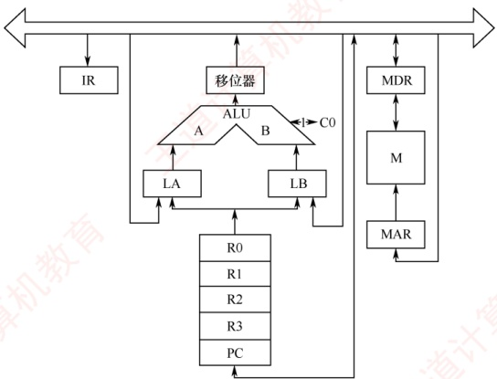

##### 02

设 CPU 内部结构如下图所示，此外还设有 B、C、D、E、H、L 六个寄存器（图中未画出），它们各自的输入端和输出端都与内部总线相通，并分别受控制信号控制（如 Bin 受寄存器 B 的输入控制；Bout 受寄存器 B 的输出控制），假设 ALU 的结果直接送入寄存器 Z。要求从取指令开始，写出完成下列指令的微操作序列及所需的控制信号。

ADD B, C (B) + (C)  $\rightarrow$ B

SUB ACC, H (ACC) - (H)  $\rightarrow$ ACC

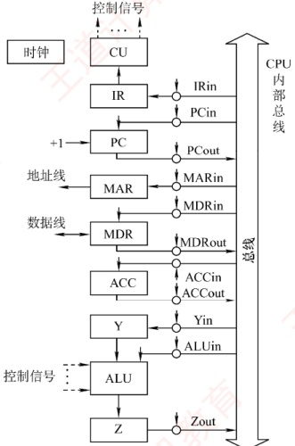

##### 03

设有如下图所示的单总线结构，分析指令 ADD (R0), R1 [即实现((R0))+(R1)→(R0)] 的指令流程和控制信号。

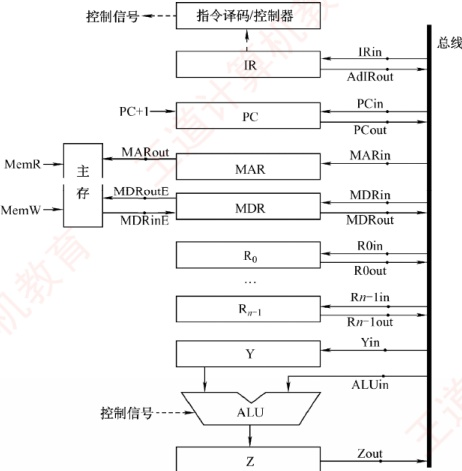

##### 04

右图是一个简化的 CPU 与主存连接结构示意图（图中省略了所有的多路选择器）。其中有一个累加寄存器（ACC）、一个状态寄存器和其他 4 个寄存器：存储器地址寄存器（MAR）、存储器数据寄存器（MDR）、程序计数器（PC）和指令寄存器（IR），各部件及其之间的连线表示数据通路，箭头表示信息传递方向。

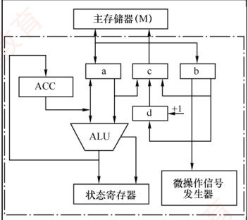

要求：

1）请写出图中 a、b、c、d 四个寄存器的名称。

2）简述图中取指令的数据通路。

3）简述数据在运算器和主存之间进行存/取访问的数据通路（假设地址已在 MAR 中）。

4）简述完成指令 LDA X 的数据通路（X 为主存地址，LDA 的功能为 (X) → ACC）。

5）简述完成指令 ADD Y 的数据通路（Y 为主存地址，ADD 的功能为(ACC) + (Y)→ACC）。

6）简述完成指令 STAZ 的数据通路（Z 为主存地址，STA 的功能为(ACC)→Z）。

##### 05

某机主要功能部件如下图所示，其中 M 为主存，MDR 为存储器数据寄存器，MAR 为存储器地址寄存器，IR 为指令寄存器，PC 为程序计数器（并假设当前指令地址在 PC 中），R0～R3 为通用寄存器，C、D 为暂存器。

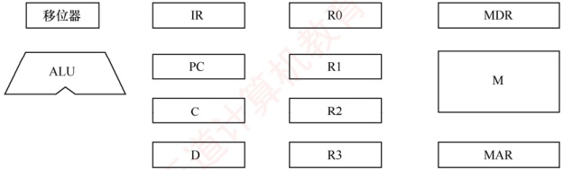

1）请补充各部件之间的主要连接线（总线自己画），并注明数据流动方向。

2）画出“ADD(R1),(R2)+”指令周期流程图，该指令的含义是进行求和运算，源操作数地址在R1中，目的操作数寻址方式为自增型寄存器间接寻址方式（先取地址后加1），并将相加结果写回R2寄存器。

##### 06

已知单总线计算机结构如下图所示，其中 M 为主存，XR 为变址寄存器，EAR 为有效地址寄存器，LATCH 为暂存器。假设指令地址已存在于 PC 中，请给出 ADD X, D 指令周期信息流程和相应的控制信号。说明：

1）ADD X, D 指令字中，X 为变址寄存器 XR，D 为形式地址，指令的功能是将变址寻址得到的操作数和 ACC 中的操作数相加，结果送回 ACC。

2）寄存器的输入/输出均采用控制信号控制，如 PC $_{i}$ 表示 PC 的输入控制信号，MDR $_{o}$ 表示 MDR 的输出控制信号。

3）凡需要经过总线的传送，都需要注明，如(PC)→MAR，相应的控制信号为PC $_{0}$和MAR $_{i}$。

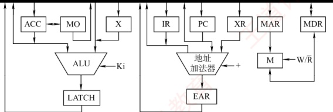

##### 07

【2009 统考真题】某计算机字长 16 位，采用 16 位定长指令字结构，部分数据通路结构如下图所示。图中所有控制信号为 1 时表示有效，为 0 时表示无效。例如，控制信号 MDRinE 为 1 表示允许数据从 DB 打入 MDR，MDRin 为 1 表示允许数据从总线打入 MDR。假设 MAR 的输出一直处于使能状态。加法指令 “ADD (R1), R0” 的功能为(R0) + ((R1)) → (R1)，即将 R0 中的数据与 R1 的内容所指主存单元的数据相加，并将结果送入 R1 的内容所指主存单元中保存。

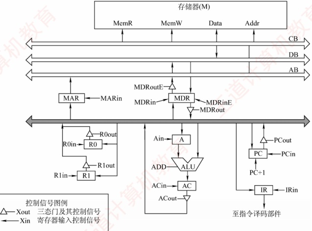

下表给出了上述指令取指和译码阶段每个节拍（时钟周期）的功能和有效控制信号，请按表中描述方式用表格列出指令执行阶段每个节拍的功能和有效控制信号。

| 时 钟 | 功 能 | 有效控制信号 |
| --- | --- | --- |
| C1 | MAR←(PC) | PCout, MARin |
| C2 | MDR←M(MAR) PC←(PC) + 1 | MemR, MDRinE PC + 1 |
| C3 | IR←(MDR) | MDRout, IRin |
| C4 | 指令译码 | 无 |

##### 08

【2015统考真题】某16位计算机的主存按字节编码，存取单位为16位；采用16位定长指令字格式；CPU采用单总线结构，主要部分如下图所示。图中R0～R3为通用寄存器；T为暂存器；SR为移位寄存器，可实现直送（mov）、左移一位（left）和右移一位（right）三种操作，控制信号为SRop，SR的输出由信号SRout控制；ALU可实现直送A（mov）A加B（add）、A减B（sub）、A与B（and）、A或B（or）、非A（not）、A加1（inc）七种操作，控制信号为ALUop。

回答下列问题：

1）图中哪些寄存器是程序员可见的？为何要设置暂存器T？

2）控制信号 ALUop 和 SRop 的位数至少各是多少？

3）控制信号 SRout 所控制部件的名称或作用是什么？

4）端点 ①～⑨中，哪些端点须连接到控制部件的输出端？

5）为完善单总线数据通路，需要在端点 $^{①}$～ $^{⑨}$中相应的端点之间添加必要的连线。写出连线的起点和终点，以正确表示数据的流动方向。

6）为什么二路选择器MUX的一个输入端是2？

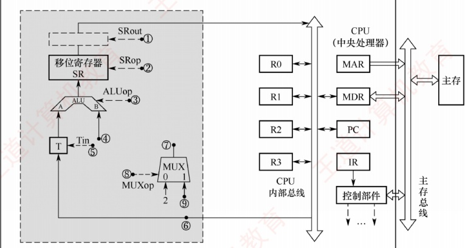

##### 09

【2015 统考真题】上题中描述的计算机，某部分指令执行过程的控制信号如下所示。

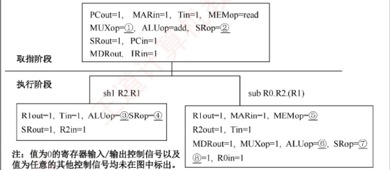

该机指令格式如下图所示，支持寄存器直接和寄存器间接两种寻址方式，寻址方式位分别为0和1，通用寄存器R0～R3的编号分别为0,1,2和3。

| 指令操作码 | 目的操作数 | 源操作数1 | 源操作数2 |   |   |
| --- | --- | --- | --- | --- | --- |
| OP | Md | Rd | Ms1 | Rs1 | Ms2 |
| 其中：Md、Ms1、Ms2为寻址方式位，Rd、Rs1、Rs2为寄存器编号。 三地址指令： 二地址指令（末3位均为0）： 单地址指令（末6位均为0）： |   |   |   |   |   |

回答下列问题：

1）该机的指令系统最多可定义多少条指令？

2）假定 inc、shl 和 sub 指令的操作码分别为 01H、02H 和 03H，则以下指令对应的机器代码各是什么？

① inc R1 ; (R1) + 1 → R1

② shl R2, R1 ; (R1) << 1 → R2

③ sub R3, (R1), R2 ; ((R1))-(R2) → R3

3）假设寄存器 X 的输入和输出控制信号分别为 Xin 和 Xout，其值为 1 表示有效，为 0 表示无效（如 PCout = 1 表示 PC 内容送总线）；存储器控制信号为 MEMop，用于控制存储器的读（read）和写（write）操作。写出本题第一幅图中标号①～⑧处的控制信号或控制信号的取值。

4）指令 “sub R1, R3, (R2)” 和 “inc R1” 的执行阶段至少各需要多少个时钟周期？

##### 10

【2022统考真题】某CPU中部分数据通路如下图所示，其中，GPRs为通用寄存器组；FR为标志寄存器，用于存放ALU产生的标志信息；带箭头虚线表示控制信号，如控制信号Read、Write分别表示主存读、主存写，MDRin表示内部总线上的数据写入MDR，MDRout表示MDR的内容送给内部总线。

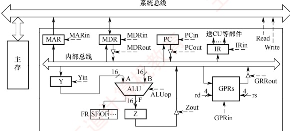

请回答下列问题。
```c

1）设 ALU 的输入端 A、B 及输出端 F 的最高位分别为 A_{15}、B_{15} 及 F_{15}，FR 中的符号标志和溢出标志分别为 SF 和 OF，则 SF 的逻辑表达式是什么？A 加 B、A 减 B 时 OF 的逻辑表达式分别是什么？要求逻辑表达式的输入变量为 A_{15}、B_{15} 及 F_{15}。
```

2）为什么要设置暂存器 Y 和 Z?

3）若 GPRs 的输入端 rs、rd 分别为所读、写的通用寄存器的编号，则 GPRs 中最多有多少个通用寄存器？rs 和 rd 来自图中的哪个寄存器？已知 GPRs 内部有一个地址译码器和一个多路选择器，rd 应连接地址译码器还是多路选择器？

4）取指令阶段（不考虑PC增量操作）的控制信号序列是什么？若从发出主存读指令到主存读出数据并传送到MDR共需5个时钟周期，则取指令阶段至少需要几个时钟周期？

5）图中控制信号由什么部件产生？图中哪些寄存器的输出信号会连到该部件的输入端？

### 5.3.6 答案与解析

#### 一、 单项选择题

##### 01

C

对 CPU 而言，数据通路的基本结构分为总线结构和专用数据通路结构，其中总线结构又分为单总线结构、双总线结构、多总线结构。

##### 02

D

数据通路中的部件包括组合逻辑元件和时序逻辑元件。数据通路的功能由控制部件送出的控制信号决定。数据通路中一个重要的组合逻辑元件为 ALU，用于执行各类算术和逻辑运算；另一个重要的元件为通用寄存器，属于时序逻辑元件。

##### 03

C

操作元件的输出仅取决于当前的输入，不受时钟信号的控制，也没有存储数据的功能。状态元件的最大特点是具有存储数据的功能。算术逻辑部件和译码器都不具有存储功能，属于操作元件；移位寄存器和存储器数据寄存器属于不同功能的寄存器，具有存储功能，属于状态元件。

##### 04

D

因为 ALU 是一个组合逻辑元件，所以其运算过程中必须保持两个输入端的内容不变。又因为 CPU 内部采用单总线结构，所以为了得到两个不同的操作数，ALU 的一个输入端与总线相连，另一个输入端需通过一个寄存器与总线相连。此外，ALU 的输出端也不能直接与内部总线相连，否则其输出又会通过总线反馈到输入端，影响运算结果，因此输出端需通过一个暂存器（用来暂存结果的寄存器）与总线相连。

##### 05

C

三态门可视为一种控制开关，由控制端决定信号线的通断，能输出到内部总线的部件均通过一个三态门与内部总线相连，用于控制该部件与内部总线之间数据通路的连接与断开。

##### 06

B

当 CPU 内部电路采用总线连接方式时，总线上信号流动的原则如下：每个时刻只有一个器件发出信息（否则会导致总线冲突），每个时刻可以有一个或多个器件接收信息。

##### 07

A

CPU 通过时钟信号定时执行指令，但并非每个时钟周期都会执行一条新指令。在多周期 CPU 中，指令的执行被划分为多个阶段，每个时钟周期开始执行一个阶段，选项 A 错误。每个阶段的操
作通常由时钟信号的上升沿或下降沿触发，称为边沿触发，并且决定了状态元件（如寄存器）的状态改变。为确保每个阶段都在一个时钟周期内完成，时钟周期必须足够长，以便数据能在最慢的组合逻辑电路中传输，因此时钟周期通常根据相邻状态单元之间最长的组合逻辑延迟来确定。

##### 08

A

说法Ⅰ不一定：主存访问受存储器速度限制，通常需要多个时钟周期。说法Ⅱ一定：单周期CPU的每条指令在一个时钟周期内完成。说法Ⅲ一定：在CPU内部数据通路中，数据从一个状态元件传送到另一个状态元件的操作由时钟同步，耗时等于一个时钟周期。说法Ⅳ一定：流水段寄存器之间的数据传递由时钟边沿触发，严格对应一个时钟周期。说法Ⅴ不一定：ALU运算由组合逻辑实现，其延迟由电路决定，在单周期CPU中必须小于一个时钟周期，以满足单周期设计约束。

##### 09

A

单周期 CPU 要求所有指令在一个时钟周期内完成，其时钟周期由最慢指令决定；加入复杂指令会显著延长时钟周期，拖累整体性能。而多周期 CPU 可将复杂指令分解为多个节拍，每节拍使用标准周期，不影响主频，更易支持复杂操作。单周期 CPU 需大量专用通路实现并行，硬件冗余高、利用率低；多周期 CPU 通过部件复用，资源利用更高效。

##### 10

C

多周期 CPU 中的指令通常需要多个时钟周期才能完成，CPI > 1；单周期 CPU 的每条指令在一个时钟周期内完成，CPI = 1。单周期 CPU 的时钟周期取决于最复杂指令的耗时，通常比多周期 CPU 的时钟周期长。在一条指令的执行过程中，单周期 CPU 的每个控制信号保持不变，每个部件只能使用一次；多周期 CPU 的控制信号可能发生改变，同一个部件可使用多次。

##### 11

C

单周期 CPU 需要在一个时钟周期内并行完成取指、运算和访存，而单总线结构无法同时传输多路数据；其时钟周期由最慢指令决定，通常远大于多周期 CPU，总执行时间未必更短。多周期 CPU 通过分时复用，在不同节拍访问同一存储器，实现指令与数据共存；而单周期 CPU 需要在同一时钟周期内取指和访存，必须采用分离的指令/数据存储器，选项 C 正确。由于需要专用通路和冗余硬件以支持并行操作，单周期 CPU 的芯片面积与成本通常高于采用部件复用的多周期 CPU。

##### 12

B

单总线结构通过一条共享总线分时串行传输数据，硬件简单、状态少、控制逻辑简洁；但因同一时刻仅能传输一次数据，性能较低，且容易引发总线冲突。相比之下，专用通路结构采用独立连线支持并行操作，性能更高、冲突更少，也相应带来了更大的硬件规模。

##### 13

D

读/写控制信号线决定了是从存储器读还是向存储器写，显然选项A、B、C都正确。

##### 14

C

单周期 CPU 在一个时钟周期内完成整条指令的执行：指令从存储器读出后，其各字段（如 opcode、rs、rt、imm）通过组合逻辑直接驱动控制单元、寄存器堆和 ALU 等部件，解析与执行同步进行，无须经由 IR 暂存；若设置 IR，则取指到 IR 至少需要一个时钟周期，违背单周期设计原则。此外，PC 每周期无条件更新为下一条指令地址，始终写入，无须“写使能”信号。

##### 15

A

单周期处理器中所有指令的指令周期为一个时钟周期，选项D正确。因为每条指令的CPI为1，要考虑比较慢的指令，所以处理器的时钟频率较低，选项B正确。单总线数据通路将所有寄存器的输入/输出端都连接在一条公共通路上，一个时钟内只允许一次操作，无法完成指令的所有操作，选项A错误。控制信号是CU根据指令操作码发出的信号，对于单周期处理器来说，每条指令的执行
只有一个时钟周期，而在一个时钟周期内控制信号并不会变化；若是多周期处理器，则指令的执行需要多个时钟周期，在每个时钟周期控制器会发出不同信号，选项C正确。

##### 16

D

时钟信号的宽度称为时钟周期，时钟周期的倒数为机器主频。时钟信号由机器脉冲源发出的脉冲信号经整形和分频后形成，时钟周期以相邻状态单元间组合逻辑电路的最大延迟为基准确定。对于单周期CPU，一个指令周期就是一个时钟周期，每个时钟周期执行一条新指令；对于多周期CPU，每个指令周期（包含若干时钟周期）执行一条新指令；对于流水线CPU，只有在理想情况下才能实现每个时钟周期执行一条新指令，选项D的描述有误。

##### 17

C

指令执行过程中数据所经过的路径，包括路径上的部件，称为数据通路。ALU、通用寄存器、状态寄存器、Cache、MMU、浮点运算逻辑、异常和中断处理逻辑等，都是指令执行过程中数据流经的部件，都属于数据通路的一部分。数据通路中的数据流动路径由控制部件控制，控制部件根据每条指令功能的不同，生成对数据通路的控制信号。选项C错误。

##### 18

B

组合逻辑元件（操作元件）不含存储信号的记忆单元，任何时刻产生的输出仅取决于当前的输入，加法器、算术逻辑单元（ALU）、译码器、多路选择器、三态门等都属于操作元件。时序逻辑元件（状态元件）包含存储信号的记忆单元，各类寄存器和存储器，如通用寄存器组、程序计数器、状态/移位/暂存/锁存寄存器等，都属于状态元件。

#### 二、 综合应用题

##### 01

【解答】

实现 ADD R1, (R2) 的微操作序列如下:

微操作

(PC) → MAR

M → MDR

(PC) + 1 → PC

(MDR) → IR

(R1) → LA

(R2) → MAR

M → MDR

(MDR) → LB

(LA) + (LB) → R1

##### 02

【解答】

两条指令的微操作序列和控制信号如下。

###### （1） ADD B, C 指令。

微操作

控制信号

(PC) →MAR

PCout, MARin

(PC) +1 →PC

+1

M(MAR) →MDR

MDRin

MDR→IR

(B) →Y

Bout, Yin

(Y) + (C) →Z

Cout, ALUin, “+”

(Z) →B

Zout, Bin

###### （2） SUB ACC, H 指令。

微操作

控制信号

(PC) →MAR

PCout, MARin

(PC) +1 →PC

+1

M (MAR) →MDR

MDRin

| MDR→IR (ACC) →Y | MDRout, IRin ACCout, Yin |
| --- | --- |
| (Y) - (H) →Z | Hout, ALUin, “-” |
| (Z) →ACC | Zout, ACCin |

注：Y 是与 ALU 的一个输入端相连接的暂存器。

##### 03

【解答】

指令 ADD (R0), R1 的功能是把 R0 的内容作为地址送到主存中取得一个操作数，再与 R1 中的内容相加，最后将结果送回主存，即实现((R0)) + (R1) → (R0)。其流程和控制信号如下。

1）取指周期：公共操作。

| 时 序 | 微 操 作 | 有效控制信号 | 具体功能 |
| --- | --- | --- | --- |
| 1 | (PC)→MAR | PCout, MARin | 将 PC 经内部总线送至 MAR |
| 2 | M(MAR)→MDR, Read | MemR, MARout, MDRinE | 主存通过数据总线将 MAR 所指单元的内容送至 MDR |
| 3 | (MDR)→IR | MDRout, IRin | 将 MDR 的内容送至 IR |
| 4 | 指令译码 | - | 操作字开始控制 CU |
| 5 | (PC) + 1→PC | - | 当 PC 加 1 有效时，使 PC 内容加 1 |

2）取数周期：完成取数操作，被加数在主存中，加数已经放在寄存器R1中。

| 时序 | 微操作 | 有效控制信号 | 具体功能 |
| --- | --- | --- | --- |
| 1 | (R0)→MAR | R0out, MARin | 将 R0 中的地址（形式地址）送至存储器地址寄存器 |
| 2 | M(MAR)→MDR | MemR, MARout, MDRinE | 主存通过数据总线将 MAR 所指单元的内容（有效地址）送至 MDR 中 |
| 3 | (MDR)→Y | MDRout, Yin | 将 MDR 中数据通过数据总线送至 Y |

3）执行周期：完成加法运算，并将结果返回主存。

| 时 序 | 微 操 作 | 有效控制信号 | 具体功能 |
| --- | --- | --- | --- |
| 1 | (R1)+(Y)→Z | R1out, ALUin, CU 向 ALU 发 ADD 控制信号 | R1 的内容和 Y 的内容相加，结果送至寄存器 Z |
| 2 | (Z)→MDR | Zout, MDRin | 将运算结果送至 MDR |
| 3 | (MDR)→M(MAR) | MemW, MDRoutE, MARout | 向主存写入数据 |

##### 04

【解答】

1）b 单向连接微控制器，由微控制器的作用可以推出 b 是 IR；a 和 c 直接连接主存，只可能是 MDR 和 MAR，c 到主存是单向连接，a 和主存双向连接，根据指令执行的特点，MAR 只单向给主存传送地址，而 MDR 既存放从主存中取出的数据，又存放将要写入主存的数据，因此 c 为 MAR，a 为 MDR。d 具有自动加 1 的功能，且单向连接 MAR，为 PC。因此，a 为 MDR，b 为 IR，c 为 MAR，d 为 PC。

2）将指令地址从 PC 送入 MAR，在相关的控制下从主存中取出指令送至 MDR，然后将 MDR 中的指令送至 IR，最后流向微控制器。取指令的数据通路为

 $$PC\rightarrow MAR\rightarrow 主存 \rightarrow MDR\rightarrow IR$$

3）根据 MAR 中的地址从主存取数据，将取出的数据送至 MDR，然后将 MDR 中的数据送至 ALU 进行运算，运算的结果送至 ACC。存储器读的数据通路为

 $$MAR（先置数据地址）， 主存 \xrightarrow{}MDR\xrightarrow{}ALU\xrightarrow{}ACC$$

将 ACC 中的结果送至 MDR，再将 MDR 中的数据写入主存。存储器写的数据通路为 MAR（先置数据地址），ACC→MDR→主存

4 ）指令 LDAX 的数据通路为
 $$X\rightarrow MAR\rightarrow 主存 \rightarrow MDR\rightarrow ALU\rightarrow ACC$$

5）指令 ADD Y 的数据通路为

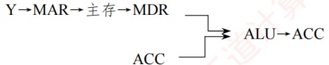

6）指令 STAZ 的数据通路为（ACC 中的数据需放在主存中）

 $$Z\rightarrow MAR,\ AC\Longrightarrow MDR\rightarrow 主存$$

##### 05

【解答】

1）各功能部件的连接关系及数据通路如下图所示。

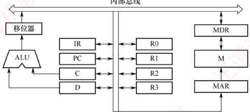

2）分析过程如下：

取指令地址送到 IR 并译码。

取源操作数和目的操作数。

将源操作数和目的操作数相加送到 MAR，随之送到以前目的操作数所在内存的地址。

将寄存器 R2 的内容加 1。

取指周期流程如下图所示。

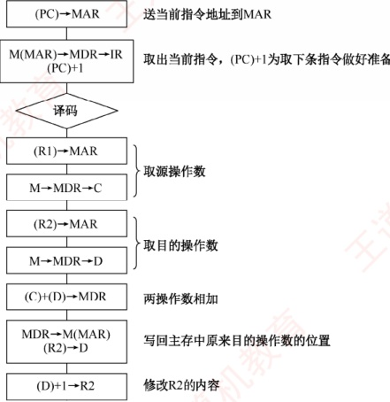

##### 06

【解答】

ADD X, D 指令周期信息流程和相应的控制信号见下表。

| 周期 | 微 操 作 | 有效控制信号 |
| --- | --- | --- |
| 取指周期 | (PC)→MAR | $PC_{{0,}}$, $MAR_{{i}}$ |
| M(MAR)→MDR (PC) + 1→PC | $MAR_{{0,}}$ R/W, $MDR_{{i}}$ +1 |   |
| (MDR)→IR | $MDR_{{0,}}$, $IR_{{i}}$ |   |
| 执行周期 | (XR) + Ad(IR)→EAR | $XR_{{0,}}$, $IR_{{0,}}$, +, $EAR_{{i}}$ |
| (EAR)→MAR | $EAR_{{0,}}$, $MAR_{{i}}$ |   |
| M(MAR)→MDR | $MAR_{{0,}}$, R/W, $MDR_{{i}}$ |   |
| (MDR)→X | $MDR_{{0,}}$, $X_{{i}}$ |   |
| (ACC) + (X)→LATCH | $ACC_{{0,}}$, $X_{{0,}}$, $K_{{i}}$ = +, $LATCH_{{i}}$ |   |
| (LATCH)→ACC | $LATCH_{{0,}}$, $ACC_{{i}}$ |   |

注：题目中的 D 即为 Ad(IR)。

##### 07

【解答】

题干已给出取值和译码阶段每个节拍的功能和有效控制信号，我们应以了解取指阶段中数据通路的信息流动为突破口，读懂每个节拍的功能和有效控制信号，然后应用到解题思路中，包括划分执行步骤、确定完成的功能、需要的控制信号。

先分析题干中提供的示例（本部分解题时不做要求）：

取指令的功能是根据 PC 的内容所指的主存地址，取出指令代码，经过 MDR，最终送至 IR。这部分和后面的指令执行阶段的取操作数、存运算结果的方法是相通的。

C1: (PC)→MAR

在读/写存储器前，必须先将地址（这里为(PC)）送至MAR。

C2: M(MAR)→MDR, (PC) + 1→PC

读/写的数据必须经过MDR，指令取出后PC自增1。

C3: (MDR)→IR

然后将读到的 MDR 中的指令代码送至 IR 进行后续操作。

指令 “ADD(R1), R0” 的操作数一个在主存中，一个在寄存器中，运算结果在主存中。根据指令功能，要读出 R1 的内容所指的主存单元，必须先将 R1 的内容送至 MAR，即  $(R1) \rightarrow MAR$。而读出的数据必须经过 MDR，即  $M(MAR) \rightarrow MDR$。

因此，将 R1 的内容所指的主存单元的数据读出到 MDR 的节拍安排如下：

C5: (R1)→MAR

C6: M(MAR)→MDR

ALU 一端是寄存器 A，MDR 或 R0 中必须有一个先写入 A 中，如 MDR。

 $$C7:(\mathrm{MDR})\rightarrow A$$

然后执行加法操作，并将结果送入寄存器 AC。

 $$C8:(A)+(R0)\rightarrow AC$$

之后将加法结果写回到 R1 的内容所指的主存单元，注意 MAR 中的内容没有改变。

 $$C9:\ (AC) \to MDR$$

 $$C10:\ (MDR)\rightarrow M(MAR)$$

有效控制信号的安排并不难，只需看数据是流入还是流出，如流入寄存器 X 就是 Xin，流出寄存器 X 就是 Xout。还需注意其他特殊控制信号，如 PC + 1、Add 等。

于是得到参考答案如下表所示。

| 时 钟 | 功 能 | 有效控制信号 |
| --- | --- | --- |
| C5 | MAR←(R1) | R1out, MARin |
| C6 | MDR←M(MAR) | MemR, MDRinE |
| C7 | A←(MDR) | MDRout, Ain |
| C8 | AC←(A) + (R0) | R0out, ADD, ACin |
| C9 | MDR←(AC) | ACout, MDRin |
| C10 | M(MAR)←(MDR) | MDRoutE, MemW |

本题答案不唯一，若在 C6 执行 M(MAR)→MDR 的同时，完成(R0)→A [选择将(R0)写入 A]，并不会发生总线冲突，这种方案可节省 1 个节拍，见下表。

| 时钟 | 功能 | 有效控制信号 |
| --- | --- | --- |
| C5 | MAR←(R1) | R1out, MARin |
| C6 | MDR←M(MAR), A←(R0) | MemR, MDRinE, R0out, Ain |
| C7 | AC←(MDR) + (A) | MDRout, ADD, ACin |
| C8 | MDR←(AC) | ACout, MDRin |
| C9 | M(MAR)←(MDR) | MDRoutE, MemW |

##### 08

【解答】

1）程序员可见寄存器为通用寄存器（R0～R3）和PC。因为采用了单总线结构，因此若无暂存器T，则ALU的A、B端口会同时获得两个相同的数据，使数据通路不能正常工作。

2）ALU 共有 7 种操作，其操作控制信号 ALUop 至少需要 3 位；移位寄存器有 3 种操作，其操作控制信号 SRop 至少需要 2 位。

3）信号 SRout 所控制的部件是一个三态门，用于控制移位器与总线之间数据通路的连接与断开。

4）端口 $^{①}$、 $^{②}$、 $^{③}$、 $^{④}$、 $^{⑤}$、 $^{⑥}$须连接到控制部件输出端。

5）连线1， $⑥\rightarrow⑨$；连线2， $⑦\rightarrow④$。

6）因为每条指令的长度为16位，按字节编址，所以每条指令占用2个内存单元，顺序执行时，下条指令地址为 $(PC)+2$。MUX的一个输入端为2，可便于执行 $(PC)+2$操作。

##### 09

【解答】

1）指令操作码有7位，因此最多可定义 $2^{7}=128$条指令。

2）各条指令的机器代码如下：

① “inc R1” 的机器码为 0000001 0 01 0 00 0 00，即 0240H。

② “shl R2, R1” 的机器码为 0000010 0 10 0 01 0 00，即 0488H。

③ “sub R3, (R1), R2” 的机器码为 0000011 0 11 1 01 0 10，即 06EAH。

3）各标号处的控制信号或控制信号取值如下：

①0；②mov；③movə；④left；⑤read；⑥sub；⑦mov；⑧SRout。

4）指令 “sub R1, R3, (R2)” 的执行阶段至少包含 4 个时钟周期；指令 “inc R1” 的执行阶段至少包含 2 个时钟周期。

##### 10

【解析】

1）符号标志 SF 表示运算结果的正负性，因此 SF = F_{15}。

对于加法运算 A + B → F，若 A、B 为负，且 F 为正，则说明发生溢出；或者，若 A、B 为正，且 F 为负，也说明发生溢出。因此，加运算时，溢出标志 OF =  $\overline{A_{15}} \cdot \overline{B_{15}} \cdot F_{15} + A_{15} \cdot B_{15} \cdot \overline{F_{15}}$。对于减法运算 A - B → F，若 A 为负、B 为正，且 F 为正，则说明发生溢出；或者，若 A 为正、B 为负，且 F 为负，也说明发生溢出。因此，减运算时，溢出标志 OF =  $\overline{A_{15}} \cdot B_{15} \cdot F_{15} + A_{15} \cdot B_{15} \cdot F_{15}$。
 $A_{15} \cdot \overline{B_{15}} \cdot \overline{F_{15}}$。

2）因为在单总线结构中，每一时刻总线上只有一个数据有效，而 ALU 有两个输入端和一个输出端。因此，当 ALU 运算时，需要先用暂存器 Y 缓存其中一个输入端的数据，再通过总线传送另一个输入端的数据。与此同时，ALU 的输出端产生运算结果，但总线正被占用，因此需要暂存器 Z，以缓存 ALU 的输出端数据。

3）由图可知，rs 和 rd 都是 4bit，因此 GPRs 中最多有  $2^{4} = 16$ 个通用寄存器；rs 和 rd 来自指令寄存器（IR）；rd 表示寄存器编号，应连接地址译码器。

4）取指阶段需要根据程序计数器（PC）取出主存中的指令，并将指令写入指令寄存器（IR）中。控制信号序列如下：

```c
① PCont, MARin //将指令的地址写入MAR

② Read //读主存，并将读出的数据写入MDR

③ MDRout, IRin //将MDR的内容写入指令寄存器（IR）
```

步骤 $^{①}$需要1个时钟周期，步骤 $^{②}$需要5个时钟周期，步骤 $^{③}$需要1个时钟周期，因此取指令阶段至少需要7个时钟周期。

5）图中控制信号由控制部件（CU）产生。指令寄存器（IR）和标志寄存器（FR）的输出信号会连到控制部件的输入端。
