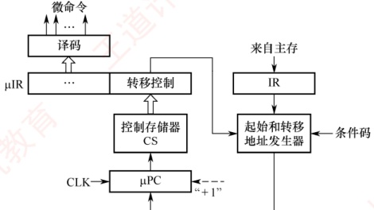
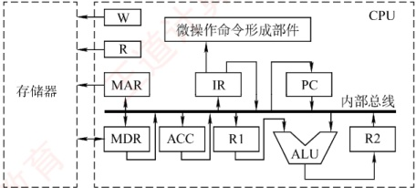

### 5.4.4 本节习题精选

#### 一、 单项选择题

##### 01

取指令操作（）。

A. 受到上一条指令的操作码控制

B. 受到当前指令的操作码控制

C. 受到下一条指令的操作码控制

D. 是控制器固有的功能，不需要在操作码控制下进行

##### 02

在组合逻辑控制器中，微操作控制信号的形成主要与（）信号有关。

A. 指令操作码和地址码

B. 指令译码信号和时钟

C. 操作码和条件码

D. 状态信息和条件

##### 03

在微程序控制器中，形成微程序入口地址的是（）。

A. 机器指令的地址码字段

B. 微指令的微地址码字段

C. 机器指令的操作码字段

D. 微指令的微操作码字段

##### 04

下列不属于微指令结构设计所追求目标的是（）。

A. 提高微程序的执行速度 B. 提高微程序设计的灵活性

C. 缩短微指令的长度 D. 增大控制存储器的容量

##### 05

微程序控制器的执行速度比硬布线控制器慢，主要是因为（）。

A. 增加了从磁盘存储器读取微指令的时间

B. 增加了从主存读取微指令的时间

C. 增加了从指令寄存器读取微指令的时间

D. 增加了从控制存储器读取微指令的时间

##### 06

下列关于微指令的说法中，错误的是（）。

I. 字段直接编码方式可用较少的二进制位数表示较多的微操作命令。若有两组互斥的微命令，每组微命令的个数分别为4和9，则分别只需要2位和4位即可
Ⅱ. 直接编码方式不用进行译码操作，微指令字段中的每一位都代表一个微命令

III. 垂直型微指令用较长的微程序结构换取较短的微指令结构，所以在执行效率和灵活性两方面都高于水平型微指令

IV. 在字段间接编码方式中，某个字段的译码输出需要依靠另外某个字段的输出

A. Ⅱ B. Ⅰ、Ⅱ C. Ⅰ、Ⅲ D. Ⅱ、Ⅲ、Ⅳ

##### 07

微程序控制存储器属于（）的一部分。

A. 主存 B. 外存 C. CPU D. 缓存

##### 08

下列说法中，正确的是（）。

A. 采用微程序控制器是为了提高速度

B. 控制存储器由高速 RAM 电路组成

C. 微指令计数器决定指令执行顺序

D. 一条微指令存放在控制器的一个控制存储器单元中

##### 09

假设计算机 A 要求应用在实时性要求较高的场合，计算机 B 要求有较好的灵活性和可修改性，则两台计算机的控制器应采用的设计方式分别是（）。

A. 计算机 A 和 B 都应采用硬布线控制器

B. 计算机 A 和 B 都应采用微程序控制器

C. 计算机 A 应采用硬布线控制器，计算机 B 应采用微程序控制器

D. 计算机 A 应采用微程序控制器，计算机 B 应采用硬布线控制器

##### 10

在微程序控制器中，控制部件向执行部件发出的某个控制信号称为（）。

A. 微程序 B. 微指令 C. 微操作 D. 微命令

##### 11

在微程序控制器中，机器指令与微指令的关系是（）。

A. 每条机器指令由一条微指令来执行

B. 每条机器指令由若干微指令组成的微程序来执行

C. 若干机器指令组成的程序可由一个微程序来执行

D. 每条机器指令由若干微程序来执行

##### 12

水平型微指令与垂直型微指令相比，()。

A. 前者一次只能完成一个基本操作

B. 后者一次只能完成一个基本操作

C. 两者都是一次只能完成一个基本操作

D. 两者都能一次完成多个基本操作

##### 13

垂直型微指令的特点是（）。

A. 控制信号经过编码产生

B. 强调并行控制功能

C. 采用微操作码

D. 微指令格式垂直表示

##### 14

下列关于微命令的描述中，正确的是（）。

A. 同一个时钟周期中，可以同时出现的微命令叫相容性微命令

B. 同一个时钟周期中，可以同时出现的微命令叫互斥性微命令

C. 在执行过程中可能引起总线冲突的微命令叫互斥性微命令

D. 同一个时钟周期中，不允许同时出现的微命令叫相容性微命令

##### 15

在微程序控制方式中，以下说法正确的是（）。

Ⅰ. 采用微程序控制器的处理器称为微处理器

Ⅱ. 每条机器指令由一段微程序来执行
III. 在微指令的编码中，效率最低的是直接编码方式

IV. 水平型微指令能充分利用数据通路的并行结构

A. I、II B. II、IV C. I、III D. III、IV

##### 16

下列说法中，正确的是（）。

Ⅰ. 微程序控制方式和硬布线控制方式相比较，前者可以使指令的执行速度更快

Ⅱ. 若采用微程序控制方式，则可用  $\mu$PC 取代 PC

Ⅲ. 控制存储器可以用 ROM 元件实现

Ⅳ. 指令周期也称 CPU 时钟周期

A. I、III

B. II、III

C. 只有 III

D. I、III、IV

##### 17

通常一条指令对应一个微程序，一个微程序的周期对应一个（）。

A. 指令周期 B. 主频周期 C. 时钟周期 D. 工作周期

##### 18

下列部件中属于控制部件的是（）。

Ⅰ. 指令寄存器 Ⅱ. 操作控制器 Ⅲ. 程序计数器 Ⅳ. 状态条件寄存器

A. I、III、IV B. I、II、III C. I、II、IV D. I、II、III、IV

##### 19

为了确定下一条微指令的地址，通常采用断定方式，其基本思想是（）。

A. 用程序计数器（PC）来产生后继微指令地址

B. 用微程序计数器（μPC）来产生后继微指令地址

C. 通过后继微指令地址字段由设计者指定或转移控制字段控制产生后继微指令地址

D. 通过指令中指定一个专门字段来控制产生后继微指令地址

##### 20

下图是某微程序控制器的基本结构，μPC 是一个 8 位寄存器，μIR 是一个 32 位寄存器，一条机器指令平均由 4 条不同的微指令组成（不含取指部分），则下列描述中错误的是（）。

A. 微指令的地址形成方式是增量法 B. 条件码来自标志寄存器

C. 最多有 64 条不同的机器指令 D. 控制存储器的容量为 1KB

##### 21

【2009 统考真题】相对于微程序控制器，硬布线控制器的特点是（）。

A. 指令执行速度慢，指令功能的修改和扩展容易

B. 指令执行速度慢，指令功能的修改和扩展难

C. 指令执行速度快，指令功能的修改和扩展容易

D. 指令执行速度快，指令功能的修改和扩展难

##### 22

【2012 统考真题】某计算机的控制器采用微程序控制方式，微指令中的操作控制字段采用字段直接编码法，共有 33 个微命令，构成 5 个互斥类，分别包含 7、3、12、5 和 6 个微命令，则操作控制字段至少有（）。

A. 5 位

B. 6 位

C. 15 位

D. 33 位
##### 23

【2014 统考真题】某计算机采用微程序控制器，共有 32 条指令，公共的取指令微程序包含 2 条微指令，各指令对应的微程序平均由 4 条微指令组成，采用断定法（后继地址字段法）确定下条微指令地址，则微指令中后继地址字段的位数至少是（）。

A. 5 B. 6 C. 8 D. 9

##### 24

【2017 统考真题】下列关于主存储器（MM）和控制存储器（CS）的叙述，错误的是（）。

A. MM 在 CPU 外，CS 在 CPU 内

B. MM 按地址访问，CS 按内容访问

C. MM 存储指令和数据，CS 存储微指令

D. MM 用 RAM 和 ROM 实现，CS 用 ROM 实现

##### 25

【2019 统考真题】某指令的功能为  $\mathrm{R[r2] \leftarrow R[r1]} + \mathrm{M[R[r0]]}$，其两个源操作数分别采用寄存器、寄存器间接寻址方式。对于下列给定部件，该指令在取数及执行过程中需要用到的是（）。

I. 通用寄存器组（GPRs）

II. 算术逻辑单元（ALU）

III. 存储器（Memory）

IV. 指令译码器（ID）

A. 仅 I、II

B. 仅 I、II、III

C. 仅 II、III、IV

D. 仅 I、III、IV

##### 26

【2021 统考真题】下列寄存器中，汇编语言程序员可见的是（）。

I. 指令寄存器

II. 微指令寄存器

III. 基址寄存器

IV. 标志/状态寄存器

A. 仅 I、II B. 仅 I、IV C. 仅 II、IV D. 仅 III、IV

##### 27

【2021 统考真题】通常情况下，将汇编语言程序中实现特定功能的指令序列定义成一条伪指令（pseudoinstruction）。在下列选项中，CPU 能理解并直接执行的是（）。

I. 伪指令 II. 微指令 III. 机器指令 IV. 汇编指令

A. 仅 I、IV B. 仅 II、III C. 仅 III、IV D. 仅 I、III、IV

#### 二、 综合应用题

##### 01

若某机主频为 200MHz，每个指令周期平均为 2.5 个 CPU 周期，每个 CPU 周期平均包括 2 个主频周期，问：

1）该机平均指令执行速度为多少 MIPS?

2）若主频不变，但每条指令平均包括 5 个 CPU 周期，每个 CPU 周期又包含 4 个主频周期，平均指令执行速度又为多少 MIPS?

3）由此可得出什么结论？

##### 02

某机有80条指令，平均每条指令由4条微指令组成（包含取指微指令），其中有一条取指微指令是所有指令公用的。已知微指令长度为32位，请估算控制存储器CM容量。

##### 03

某微程序控制器中，采用水平型直接控制（编码）方式的微指令格式，后续微指令地址由微指令的后继地址字段给出。已知机器共有28个微命令，6个互斥的可判定的外部条件，控制存储器的容量为  $512 \times 40$ 位。试设计其微指令的格式，并说明理由。

##### 04

某机共有52个微操作控制信号，构成5个相斥类的微命令组，各组分别包含5、8、2、15、22个微命令。已知可判定的外部条件有两个，微指令字长28位。

1）按水平型微指令格式设计微指令，要求微指令的后继地址字段直接给出后继微指令地址。

2）指出控制存储器的容量。
##### 05

设 CPU 中各部件及其相互连接关系如下图所示，其中 W 是写控制标志；R 是读控制标志；R1、R2 是暂存器。

1）写出指令 ADD #a（#为立即寻址特征，隐含的操作数在 ACC 寄存器中）在执行阶段所完成的微操作命令及节拍安排。

2）假设要求在取指周期实现(PC)+1→PC，且由ALU完成此操作（ALU能对它的一个源操作数完成加1运算）。以最少的节拍写出取指周期全部微操作命令及节拍安排。

### 5.4.5 答案与解析

#### 一、 单项选择题

##### 01

D

取指令阶段完成的任务是将现行指令从主存中取出并送至指令寄存器，这个操作是公共的操作，是每条指令都要进行的，与具体的指令无关，所以不需要操作码的控制。

##### 02

B

CU 的输入信号来源如下：① 经指令译码器译码产生的指令信息；② 时序系统产生的节拍信号；③ 来自执行单元的反馈信息即标志。前两者是主要因素。

##### 03

C

执行公用的取指微程序从主存中取出机器指令后，由机器指令的操作码字段指出各个微程序的入口地址（初始微地址）。

##### 04

D

微指令的设计目标和指令结构的设计目标类似，都是基于执行速度、灵活性和指令长度这三个主要方面考虑的。而控制存储器容量的大小与微指令的设计目标无关。

##### 05

D

在微程序控制中，控制存储器中存放有微指令，在执行时需要从中读出相应的微指令，从而增加了时间消耗。

##### 06

C

字段直接编码方式为了缩短微指令字长而牺牲了速度，当微命令个数为4时需要3位，2位会导致每个编码都输出一个微命令，而不能表示不输出，说法I错误。说法Ⅱ正确。垂直型微指令的缺点是微程序长、执行速度慢、工作效率低，说法Ⅲ错误。在字段间接编码方式中，一个字段的某些微命令要由另一个字段的某些微命令来解释，即依赖另一个字段的译码输出，说法Ⅳ正确。

##### 07

C

微程序控制存储器用来存放微程序，是微程序控制器的核心部件，属于 CPU 的一部分，而不属于主存。

##### 08

D

硬布线控制器采用硬件电路，速度较快，但设计难度大、成本高。微程序控制器的速度较慢，
但灵活性高。通常控制存储器采用 ROM 元件实现。微指令计数器决定了微指令执行的顺序。

##### 09

C

实时性要求较高的场合通常需要能快速地响应和执行，硬布线控制器由硬件直接实现控制逻辑，速度较快，非常适用于实时性要求较高的场合。灵活性和可修改性要求高时，适合采用微程序控制器，因为微程序控制器可很方便地通过修改微程序来灵活调整控制逻辑。

##### 10

D

在微程序控制器中，控制部件向执行部件发出的控制信号称为微命令，微命令执行的操作称为微操作。微指令则是若干微命令的集合，若干微指令的有序集合称为微程序。

##### 11

B

在一个 CPU 周期中，一组实现一定功能的微命令的组合构成一条微指令，有序的微指令序列构成一段微程序，微程序的作用是实现一条对应的机器指令。

##### 12

B

一条水平型微指令能定义并执行几种并行的基本操作；一条垂直型微指令只能定义并执行一种基本操作。

##### 13

C

垂直型微指令是一种微指令格式，相比于水平型微指令而言的，并不是指令格式垂直表示，在微指令中设置了微操作码字段，结构类似于机器指令格式。控制信号经过编码产生是一种控制字段的编码方式，属于水平型微指令，强调并行控制功能是一种控制字段的设计目标，适合水平型微指令而不适合垂直型微指令。

##### 14

A

##### 15

B

在同一个 CPU 周期中，可以同时出现的微命令叫相容性微命令，不允许同时出现的微命令叫互斥性微命令。不允许同时出现的原因有可能是会引起总线冲突，也有可能是其他原因。

微处理器是相对于一些大型处理器而言的，与微程序控制器没有必然联系。不管是采用微程序控制器，还是采用硬布线控制器，微机的 CPU 都是微处理器，说法 I 错误。微程序的设计思想就是将每条机器指令编写成一个微程序，每个微程序包含若干微指令，每条微指令对应一个或几个微操作命令，说法 II 正确。直接编码方式中每位代表一个微命令，不需要译码，因此执行效率最高，只是这种方式会使得微指令的位数大大增加，说法 III 错误。一条水平型微指令能定义并执行几种并行的基本操作，因此能够更充分利用数据通路的并行结构，说法 IV 正确。

##### 16

C

微程序控制方式采用编程方式来执行指令，而硬布线控制方式则采用硬件方式来执行指令，因此硬布线控制方式速度较快，说法Ⅰ错误。μPC 无法取代 PC，因为它只在微程序中指向下一条微指令地址的寄存器。因此它也必然不可能知道这段微程序执行完毕后下一条是什么指令，说法Ⅱ错误。每条微指令执行时所发出的控制信号是事先设计好的，不需要改变，因此存放所有控制信号的存储器应为 ROM，说法Ⅲ正确。指令周期是从一条指令启动到下一条指令启动的间隔时间，而时钟周期是计算机内部最基本、最小的时间单位，说法Ⅳ错误。

##### 17

A

一条指令对应一个微程序，所以一个微程序的周期对应一个指令周期。

##### 18

B

CPU 控制器主要由三个部件组成：指令寄存器、程序计数器和操作控制器。状态条件寄存器通常属于运算器的部件，保存由算术指令和逻辑指令运行或测试的结果建立的各种条件码内容，
如运算结果进位标志（CF）、运算结果溢出标志（OF）等。

##### 19

C

断定法是指在微指令（后继地址字段）中直接明确指出下一条微指令的地址，这样相当于每条都是转移微指令，此外，还有一些其他方法如条件测试和转移控制字段，也用于控制微指令的寻址。因此，后继微指令地址可由微程序设计者指定，或者根据微指令所规定的转移控制字段控制产生。

##### 20

C

图中 μPC 根据时钟信号进行自增“+1”操作，因此微指令的地址形成方式是增量（计数器）法。转移微指令根据标志寄存器中的标志位来决定下一条微指令的地址。μPC 的位数是 8 位，能够指向 256 条微指令，其中包括若干取指微指令，因此机器指令的条数小于 256/4 = 64，选项 C 错误。控制存储器的容量为微指令所占用的存储空间，即  $256 \times 32b = 1KB$。

##### 21

D

微程序控制器采用了“存储程序”的原理，每条机器指令对应一个微程序，因此修改和扩充容易，灵活性好，但每条指令的执行都要访问控制存储器，所以速度慢。硬布线控制器采用专门的逻辑电路实现，其速度主要取决于逻辑电路的延迟，因此速度快，但修改和扩展困难，灵活性差。

##### 22

C

字段直接编码法将微命令字段分成若干小字段，互斥性微命令组合在同一字段中，相容性微命令分在不同字段中，每个字段还要留出一个状态，表示本字段不发出任何微命令。5个互斥类，分别包含7、3、12、5和6个微命令，需要3、2、4、3和3位，共15位。

##### 23

C

计算机共有32条指令，各个指令对应的微程序平均为4条，则指令对应的微指令为32×4 = 128条，而公共微指令还有2条，整个系统中微指令的条数共为128 + 2 = 130条，所以需要[log₂130] = 8位才能寻址到130条微指令。

##### 24

B

主存储器（MM）在 CPU 外，用于存储指令和数据，由 RAM 和 ROM 实现（主要是 RAM）。控制存储器（CS）用来存放构成指令系统的所有微指令，是一种只读型存储器，机器运行时只读不写，在 CPU 的控制器内。控制存储器按照微指令的地址访问。

##### 25

B

该指令的两个源操作数分别采用寄存器、寄存器间接寻址方式，因此在取数阶段需要用到通用寄存器组（GPRs）和存储器（Memory）；在执行阶段，两个源操作数相加需要用到算术逻辑单元（ALU）。而指令译码器（ID）用于对操作码字段进行译码，向控制器提供特定的操作信号，在取数及执行阶段用不到。

##### 26

D

汇编语言程序员可见的寄存器有基址寄存器（用于实现多道程序设计或者编制浮动程序）和状态/标志寄存器、程序计数器（PC）及通用寄存器组；而 MAR、MDR、IR 是 CPU 的内部工作寄存器，对汇编语言程序员不可见。微指令寄存器属于微程序控制器的组成部分，它是硬件设计者的任务，对汇编语言程序员是透明的（不可见的）。

##### 27

B

高级语言程序、汇编语言程序都需要通过翻译程序来处理，生成机器语言程序后才能被CPU执行。机器指令能被CPU理解并直接执行。微指令是CPU控制单元用于实现机器指令的更低层次的指令。在微程序控制的CPU中，一条机器指令对应一个微程序，微程序是微指令的有序序列，
用来控制 CPU 实现机器指令的过程，因此微指令也能被 CPU 理解并直接执行。

#### 二、 综合应用题

##### 01

【解答】

1）主频为 200MHz，所以主频周期 = 1/200MHz = 0.005μs。

每个指令周期平均为 2.5 个 CPU 周期，每个 CPU 周期平均包括 2 个主频周期，所以一条指令的执行时间 = 2×2.5×0.005μs = 0.025μs。

该机平均指令执行速度 = 1/0.025 = 40MIPS。

2）每条指令平均包括 5 个 CPU 周期，每个 CPU 周期又包含 4 个主频周期，所以一条指令的执行时间 = 4×5×0.005μs = 0.1μs。

该机平均指令执行速度 = 1/0.1 = 10MIPS

3）由此可见，指令的复杂程度会影响平均指令执行速度。

##### 02

【解答】

总的微指令条数 = (4-1)×80 + 1 = 241 条，每条微指令占一个控制存储器单元，控制存储器 CM 的容量为 2 的 n 次幂，而 241 刚好小于 256，所以 CM 的容量 = 256×32 位 = 1KB。

##### 03

【解答】

水平型微指令由操作控制字段、判别测试字段和后继地址字段三部分构成。因为微指令采用直接控制（编码）方式，所以其操作控制字段的位数等于微命令数，为28位。又因为后继微指令地址由后继地址字段给出，所以其后继地址字段的位数可根据控制存储器的容量（512×40位）确定为9位（512=2°9）。当微程序出现分支时，后续微指令地址的形成取决于状态条件——6个互斥的可判定外部条件，因此状态位应编码成3位。非分支时的后续微指令地址由微指令的后继地址字段直接给出。微指令的格式如下图所示。

| 操作控制字段 | 判别测试字段 | 后继地址字段 |
| --- | --- | --- |
| 28 位 | 3 位 | 9 位 |

##### 04

【解答】

1）根据5个互斥类的微命令组，各组分别包含5、8、2、15、22个微命令，考虑到每组必须增加一种不发送命令的情况，条件测试字段应包含一种不转移的情况，则5个控制字段分别需给出6、9、3、16、23种状态，对应3、4、2、4、5位（共18位），条件测试字段取2位。根据微指令字长为28位，后继地址字段取28-18-2=8位，则其微指令格式如下图所示。

| 5个 微命令 | 8个 微命令 | 2个 微命令 | 15个 微命令 | 22个 微命令 | 2个 判断条件 | 后继地址 |
| --- | --- | --- | --- | --- | --- | --- |
|   |   |   |   |   | 条件测试 | 后继地址 |
| 3位 | 4位 | 2位 | 4位 | 5位 | 2位 | 8位 |

2）根据后继地址字段为8位，微指令字长为28位，得出控制存储器的容量为 $2^{8}\times28$位。

##### 05

【解答】

1）含有 ACC 的立即寻址，一个操作数隐藏在 ACC 中，立即寻址的加法指令执行周期的微操作命令及节拍安排如下：

 $$T_{0}\quad Ad\left(IR\right)\rightarrow R1$$

 $$T_{1}\quad(R1)\quad+\quad(ACC)\rightarrow R2$$

 $$\begin{aligned}& 立即数 \rightarrow R1\\&ACC 通过总线送 \text{ALU}\\& 结果 \rightarrow ACC\\ \end{aligned}$$

 $$T_{2}\quad(R2)\to ACC$$
2）因为(PC)+1→PC 需要由 ALU 完成，所以 PC 的值可作为 ALU 的一个源操作数，在 ALU 做加 1 运算得到 (PC)+1 后，结果送至与 ALU 输出端相连的 R2，然后送至 PC。此题的关键是要考虑总线冲突的问题，因此，取指周期的微操作命令及节拍安排如下：

 $$T_{0}\quad(PC)\rightarrow MAR,\ 1\rightarrow R$$

 $$T_{1}\quad M(MAR)\rightarrow MDR,\quad(PC)\quad+1\rightarrow R2$$

 $$T_{2}\quad(MDR)\rightarrow IR,\ O P\ (IR)\rightarrow 微操作命令形成部件$$

 $$T_{3}\quad(R2)\rightarrow PC\quad R2~ 通过总线送 ~PC$$
