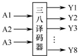
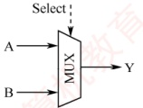
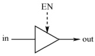
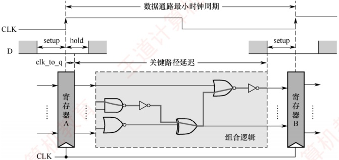
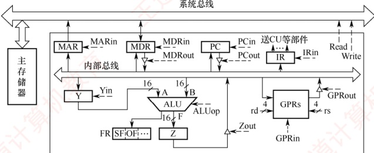
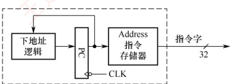
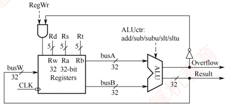
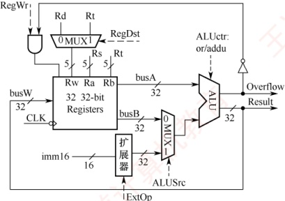
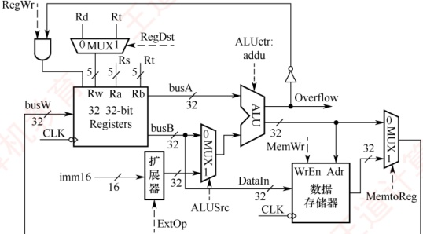
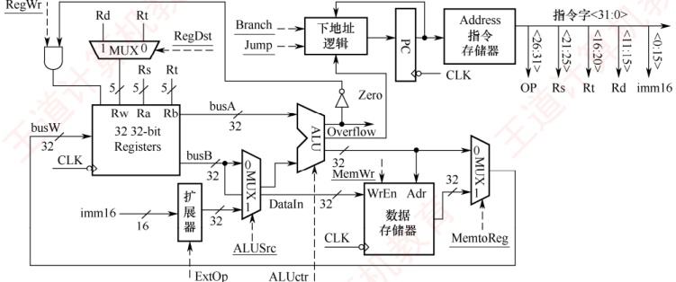

## 5.3 数据通路的功能和基本结构

### 5.3.1 数据通路的功能

随着技术的发展，越来越多的功能逻辑被集成到 CPU 芯片中，但不论 CPU 的内部结构多么复杂，它都可视为由数据通路（Data Path）和控制部件（Control Unit）两大部分组成。

数据在指令执行过程中所经过的路径，以及路径上涉及的硬件部件，称为数据通路。ALU、通用寄存器、状态寄存器等，都是指令执行时数据流经的部件，属于数据通路的一部分。数据通路描述了数据从何处开始，中间经过哪些部件，最终被传送到哪里。整个数据通路由控制部件控制，后者根据每条指令的功能，生成相应的控制信号，以驱动数据通路完成指定操作。

### 5.3.2 数据通路的组成

数据通路的基本构成元件可分为组合逻辑元件和时序逻辑元件两大类。

### 考点追踪 数据通路的组成部件（2017、2021、2025）

#### 1. 组合逻辑元件（操作元件）

组合逻辑元件主要用于执行数据运算与路径选择，也称操作元件。其特征是：任意时刻的输出仅由当前输入决定，不依赖历史状态；内部不含记忆单元，不受时钟控制，且无输出到输入的反馈通路，因而具有确定性和即时响应性。数据通路中常用的组合逻辑元件包括加法器、算术逻辑单元（ALU）、译码器、多路选择器（MUX）和三态门等，如图5.4所示。



(a) 译码器



(b) 多路选择器



(c) 三态门

图 5.4 数据通路中的几种常用组合逻辑元件

### 考点追踪 三态门、多路选择器的应用（2015、2023、2024）

图中虚线表示控制信号，译码器常用于操作码译码或地址码译码，对于 $n$ 位输入，可产生 $2^n$ 个互斥输出。多路选择器（MUX）根据控制信号 Select 从多路输入中选择一路输出，若输入路数为 $N$，则需 $\lceil \log_2 N \rceil$ 位控制信号。三态门可视为一种受控的总线开关，由控制信号 EN 决定信号线的通断，当 EN = 1 时，三态门被打开，输出（out）信号等于输入（in）信号；当 EN = 0 时，输出端呈高阻态（隔断态），所连寄存器与总线断开。

#### 2. 时序逻辑元件（状态元件）

时序逻辑元件的输出不仅取决于当前输入，还依赖于电路的历史状态，因此其内部必然包含用于存储信息的记忆单元。此外，这类元件必须在时钟的同步控制下工作。常见的时序逻辑元件包括各类寄存器和存储器，例如通用寄存器组、程序计数器（PC）、状态/暂存寄存器等。

数据通路的基本结构可抽象为时序逻辑元件与组合逻辑元件交替连接的形式，即“……状态元件-操作元件-状态元件-……”，如图5.5所示。为简化分析，假设寄存器A和B的写使能信号一直有效，当时钟上升沿到来时，两个寄存器同时锁存各自的新值。从时钟上升沿开始到寄存器A输出稳定的时间称为寄存器延迟 $T_{clk\_to\_q}$；随后，其输出数据经组合逻辑电路处理，经历一个关键路径延迟 $T_{max}$（所有输出信号达到稳定所需的最长时间）。为确保寄存器B能在下一个时钟上升沿正确采样该数据，其输入必须在时钟沿到来前至少提前 $T_{setup}$（寄存器建立时间）保持稳定。因此，数据通路的最小时钟周期必须不小于 $T_{clk\_to\_q} + T_{max} + T_{setup}$，其中组合逻辑延迟 $T_{max}$是关键因素。可见，在CPU设计中，缩短组合逻辑的关键路径延迟是提升系统频率的关键手段。



图 5.5 数据通路与时钟周期

### 5.3.3 数据通路的组织与分类

数据通路可根据其内部部件的连接方式和指令执行的时序组织方式进行分类。

#### 1. 按部件连接方式划分

##### （1） 总线式数据通路

总线式数据通路将通用寄存器、ALU 和内部寄存器等主要部件连接至一条或多条 CPU 内部总线（注意，此总线为片内总线，不同于系统总线）。根据总线数量的不同，可分为如下两类：

单总线结构：所有数据传输共享一条内部总线，ALU的输入与输出均通过该总线分时传送。

多总线结构（如双总线、三总线）：提供多条独立总线，例如分别用于两个源操作数和结果写回，以支持更高的并行度。
优点是硬件简洁、易于扩展；缺点是同一时刻仅能传输一组数据，存在总线竞争问题。

##### （2） 专用数据通路

专用数据通路采用点对点专用连线连接寄存器、ALU等部件，而非共享总线。各数据通路可并行传输，避免了总线冲突。

优点是数据传输效率高、延迟低；缺点是布线复杂、扩展性差、成本较高。

总线式与专用数据通路的特点对比如表5.1所示。

表5.1 总线式与专用数据通路的特点对比

| 对比维度 | 总线式数据通路 | 专用数据通路 |
| --- | --- | --- |
| 结构复杂度 | 简单，部件共享总线，连线少 | 复杂，需要大量点对点专用连线 |
| 扩展灵活性 | 强，新增部件只需要挂接总线 | 弱，新增部件需要重新布线 |
| 数据传输效率 | 低，同一时刻仅支持一组数据传输 | 高，多组数据可并行传输 |
| 硬件成本 | 低 | 高 |
| 性能瓶颈 | 总线带宽受限，部件增多时延迟增加 | 无总线瓶颈，性能随并行度提升 |
| 典型应用场景 | 教学模型、嵌入式微控制器 | 高性能通用处理器（如 RISC） |

#### 2. 按时序组织方式划分

##### （1） 单周期数据通路

在单周期数据通路中，每条指令的所有操作（取指、译码、执行、访存、写回等）都在一个时钟周期内完成。时钟周期长度由最慢的指令（通常是访存指令）决定。

特点是控制简单，资源利用率低，可基于总线式或专用通路实现。

**注意**

单周期处理器（CPI = 1）不能采用单总线结构的数据通路，因为单总线将所有寄存器都连接到一条公共总线上，一个时钟周期内只允许一次操作，无法完成一条指令的所有操作。

##### （2） 多周期数据通路

多周期数据通路将一条指令的执行划分为多个阶段，每个阶段在一个时钟周期内完成。典型阶段包括取指、译码与读寄存器、执行/地址计算、访存、写回等。

特点是各阶段的结果在时钟边沿被锁存到寄存器中；时钟周期长度通常以一次存储器访问时间为基准；相比单周期设计，提高了硬件复用率，缩短了时钟周期。

##### （3） 流水线数据通路

流水线数据通路将指令执行过程分解为若干独立、可重叠的阶段，不同指令在不同阶段并发推进。每个阶段由专用功能部件完成，并通过流水段寄存器隔离和传递中间结果。

特点是时钟周期长度由最长阶段决定；理想情况下，每个周期可以完成一条指令。

### 5.3.4 单总线结构的数据通路

单总线数据通路结构简洁，所有数据传输共享同一条内部总线，同一时刻仅允许一个部件向总线输出数据，导致操作需要分步进行。图5.6所示为一种典型的单总线数据通路结构。

### 考点追踪 数据通路中的部件及连接方式（2013、2015、2022）

在图 5.6 中，GPRs 为通用寄存器组，rs 和 rd 分别是源寄存器和目的寄存器的编号，各占 4 位，可寻址  $2^{4}=16$ 个通用寄存器；Y 和 Z 为暂存寄存器（简称暂存器），用于暂存从总线读取的操作数；FR 为标志寄存器，用于保存 ALU 运算产生的状态标志。所有可向内部总线输出数据的
部件（如寄存器、MDR、PC等）均通过各自的三态门与总线相连，以控制其与总线之间的通断，避免多个输出同时驱动总线造成冲突。图中带箭头的虚线表示控制信号，控制信号的命名采用“部件名+in/out”的方式：in表示允许向该部件写入（如PCin表示将内部总线上的数据写入PC），out表示允许该部件输出到总线（如PCout表示将PC的内容送至内部总线）。



图 5.6 一种典型的单总线数据通路结构

ALU 的操作类型由控制信号 ALUop 决定。若 ALUop 为 n 位，则最多支持  $2^{n}$ 种操作。在以下分析中，假设 ALUop 为 3 位，且约定执行加法操作时 ALUop = 000。

总线是一组共享的传输信号线，不能存储信息，任一时刻只能有一个部件将信息发送到总线上。下面以图5.6所示的单总线数据通路为例，介绍两条常见指令的指令周期数据流。数据流是指令执行过程中，根据操作要求依次访问的数据序列。该序列因指令执行的不同阶段而异，也随指令类型的不同而变化。为简化分析，此处将指令周期分为取指和执行两个阶段。

（1）加法指令

### 考点追踪 指令执行阶段的操作控制分析（2009、2015、2019）

指令功能：将 rs 和 rd 寄存器中的值相加，并将结果写入 rd 寄存器。

1）取指阶段：根据PC中的内容从主存储器中取出指令代码并存放在IR中。假设从发出主存读命令到主存读出数据并传输到MDR共需5个时钟周期，则取指阶段的数据流如下（不考虑PC增量操作）：

| 时钟 | 功能 | 有效控制信号 |
| --- | --- | --- |
| C1 | (PC) → MAR | PCout, MARin |
| C2～C6 | MEM(MAR) → MDR | MDRin, read |
| C7 | (MDR) → IR | MDRout, IRin |

解释：① 将 PC 的内容写入 MAR（1 个时钟周期）；② 读主存并将读出的数据写入 MDR（5 个时钟周期）；③ 将 MDR 的内容写入 IR（1 个时钟周期）。

2）执行阶段：根据 rs 和 rd 寄存器的编号（假设分别为 0001 和 0010），将两个操作数取出，送入 ALU 进行加法运算，并将运算结果送回 rd 寄存器。执行阶段的数据流如下：

| 时钟 | 功能 | 有效控制信号 |
|---|---|---|
| C8 | (rs) $\rightarrow$ Y | rs = 0001, GPRout, Yin |
| C9 | (rs)+(rd) $\rightarrow$ Z | rd = 0010, GPRout, ALUop = 000 |
| C10 | (Z) $\rightarrow$ rd | Zout, rd = 0010, GPRin |
解释：① 将 rs 寄存器的内容写入暂存寄存器 Y（1 个时钟周期）；② 将 rd 寄存器中的值取出并与 Y 暂存寄存器中的值相加，结果送入 Z 暂存寄存器（1 个时钟周期）；③ 将暂存寄存器 Z 中的加法结果送回 rd 寄存器（1 个时钟周期）。

**注意**

在单总线数据通路中，任一时刻总线上仅允许一个数据传输。由于 ALU 是无存储能力的组合逻辑电路，运算时需要两个输入同时有效，因此需要先将一个操作数经总线送入暂存寄存器 Y；下一周期再将另一个操作数送至 ALU 的另一个输入端，Y 的输出即作为其第一个操作数。此外，ALU 输出不能直接连到总线，否则可能通过总线反馈至输入端，干扰运算结果，故需要暂存于暂存寄存器 Z 中。

（2）取数指令

指令功能：将主存地址为 rs 寄存器中的值的主存单元内容取出送回 rd 寄存器。

1）取指阶段：所有指令取指阶段的数据流都是相同的，此处不再赘述。

2）执行阶段：假设 rs 和 rd 寄存器的编号分别为 0001 和 0010，从发出主存读命令到主存读出数据并传输到 MDR 共需 5 个时钟周期，则执行阶段的数据流如下：

| 时钟 | 功能 | 有效控制信号 |
| --- | --- | --- |
| C8 | (rs) → MAR | rs = 0001, GPRout, MARin |
| C9～C13 | MEM(MAR) → MDR | MDRin, read |
| C14 | (MDR) → rd | MDRout, rd = 0010, GPRin |

解释：① 将 rs 的内容写入 MAR（1 个时钟周期）；② 读主存并将读出的数据写入 MDR（5 个时钟周期）；③ 将 MDR 的内容写入 rd 寄存器（1 个时钟周期）。

### 5.3.4 专用结构的数据通路

本节以单周期数据通路为例，介绍专用数据通路的设计原理。在单周期数据通路中，每条指令的取指与执行均在一个时钟周期内完成，CPU的时钟周期必须以最耗时的指令为准。此外，由于资源无法复用，系统需要为频繁使用的功能单元（如加法器）配置多组独立的实例。同时，为避免指令获取与数据访问冲突，指令和数据被分别存储在独立的存储器中，确保两者可在同一时钟周期内并行处理。鉴于完整单周期数据通路结构较为复杂，以下将结合具体指令执行过程，逐步拆解其关键设计要点。尽管基于单周期模型，但其中的控制逻辑与数据通路设计思想同样适用于多周期、流水线等更复杂的结构。考生应在夯实基础的前提下，灵活运用所学知识。

#### 1. 取指令部件的设计

每条指令的第一步都是完成取指令并计算下一条指令地址的过程。图5.7展示了取指令部件



图 5.7 取指令部件的结构示意图

的结构示意图。指令存储在指令存储器中，仅支持读操作。读取指令时，只需提供指令地址，经过固定的延迟后即可输出对应的32位指令字。指令地址由程序计数器（PC）提供。

取指令部件包含专用的下地址逻辑电路，用于计算并更新 PC 值，以确定下一条指令的地址。下地址逻辑根据当前指令类型区分不同的执行路径：

顺序执行：当指令为普通顺序指令时，直接计算 PC + 4 得到下一条指令的地址。

• 转移执行：对于分支或转移指令，需要根据指令类型计算转移目标地址。例如，beq 指令（相等转移）通过比较两个寄存器的内容决定是否转移，并根据偏移量计算新的 PC 值。
#### 2. R型运算类指令数据通路

R 型指令指的是操作数全部来自通用寄存器、运算结果也写回通用寄存器的算术/逻辑运算指令。以加法指令为例：


 $$\mathbf{\#R}\left[\mathbf{r}\mathbf{s}\right]+\mathbf{R}\left[\mathbf{r}\mathbf{t}\right]\rightarrow\mathbf{R}\left[\mathbf{r}\mathbf{d}\right]$$

图 5.8 展示了 R 型指令相关的数据通路示意图。该数据通路能够对两个寄存器 Rs 和 Rt 的内容进行运算，并将结果写回 Rd 寄存器。例如，add 和 sub 等指令还需判断运算结果是否溢出，仅当不溢出时才将结果写回 Rd 寄存器；发生溢出时，会触发异常处理。



指令中的 Rs 和 Rt 是两个源操作数寄存器的编号，Rd 是目的寄存器的编号。因此，

图 5.8 R 型指令相关的数据通路示意图

- 寄存器堆的两个读地址端 Ra 和 Rb 应分别与 Rs 和 Rt 相连。

写地址端 Rw 应与 Rd 相连。

ALU 的运算结果通过总线 busW 连至寄存器堆的写数据端。

控制信号 RegWr 作为寄存器堆的写使能信号，在 RegWr 为 1 且无溢出的情况下，运算结果才被写入寄存器堆。具体来说，RegWr 信号和溢出标志位 Overflow 通过 “与” 门组合后，决定是否允许写入寄存器堆。显然，在 R 型指令执行期间，RegWr 信号应始终为 1。

此外，ALU 的操作类型由控制信号 ALUctr 决定。假设 ALU 支持 N 种不同的运算，则 ALUctr 至少需要  $\lceil \log_2 N \rceil$ 位来选择具体的运算类型。

由于单周期处理器必须在一个时钟周期内完成指令，其数据通路中不设置指令寄存器（IR），而直接从指令存储器中取指令并解析执行，否则仅取指令到IR就需一个时钟周期。

#### 3. I型运算指令的数据通路

I 型运算指令（立即数运算类指令）的核心执行逻辑是，先将指令中的 16 位立即数扩展为 32 位，再将寄存器 Rs 的内容送入 ALU 运算，结果写回目的寄存器 Rt。以有符号加法指令为例：

addi rt, rs, imm16    #R[rs]+SignExt[imm16]→R[rt]

其中，SignExt[imm16]表示对 16 位立即数进行符号扩展。

图5.9是在R型指令数据通路（见图5.8）基础上，增加支持I型指令的功能模块（如立即数扩展器和多路选择器）后形成的通用数据通路。该通路可同时执行R型和I型运算指令。



图 5.9 I 型指令相关的数据通路示意图

与图5.8相比，数据通路主要有以下三处改动，以同时兼容R型和I型运算指令的执行。

1）目的寄存器选择：R型指令使用目的寄存器Rd，而I型指令使用目的寄存器Rt。因此，在寄存器堆的写地址端Rw处增设多路选择器，由控制信号RegDst控制：

• RegDst = 1（执行 R 型指令）时，选择 Rd 为目的寄存器。

RegDst = 0（执行I型指令）时，选择Rt为目的寄存器。

2）立即数扩展：I型指令的16位立即数需扩展为32位才能送入ALU。数据通路中新增一个立即数扩展器，其输入为指令的imm16字段。由控制信号ExtOp决定扩展方式：

• 对于算术类指令，采用符号扩展。

对于按位逻辑操作指令，采用零扩展。

3）ALU 第二操作数选择：R 型指令的第二操作数来自寄存器 Rt，I 型指令则使用扩展后的立即数。因此，在 ALU 的第二输入端增设多路选择器，由控制信号 ALUSrc 控制：

ALUSrc = 0（执行 R 型指令）时，选择寄存器 Rt 的数据。

ALUSrc = 1（执行Ⅰ型指令）时，选择扩展后的立即数。

#### 4. 访存指令的数据通路

MIPS 访存指令属于 I 型指令（需要进行立即数运算），包括以下两类：

```asm
lw rt, imm16(rs) #M[R[rs]+SignExt(imm16)]→R[rt]
sw rt, imm16(rs) #R[rt]→M[R[rs]+SignExt(imm16)]
```

LOAD 和 STORE 指令的访存地址计算逻辑完全一致：首先对指令中的 16 位立即数 imm16 进行符号扩展，然后将其与寄存器 Rs 的内容相加，得到访存地址。二者区别在于数据传输方向：

• LOAD 指令从该地址读取 32 位数据，并将数据写入寄存器 Rt。

• STORE 指令则将寄存器 Rt 中的 32 位数据写入该地址对应的存储单元。

图 5.10 是在图 5.9 的基础上增加支持 LOAD/STORE 指令功能模块后的数据通路示意图。该数据通路不仅能够执行 LOAD/STORE 指令，还能兼容 R 型和 I 型运算指令。



图 5.10 支持 LOAD/STORE 指令功能的数据通路

与图5.9相比，数据通路主要有以下两处改动，以支持LOAD/STORE指令的执行：

1）写回寄存器的数据选择：为了处理运算类指令与 LOAD 指令写回寄存器的不同数据来源，在寄存器堆的写端口 busW 处增设一个多路选择器，由控制信号 MemtoReg 控制：

• MemtoReg = 0（运算类指令）时，选择 ALU 的运算结果。

• MemtoReg = 1（LOAD 指令）时，选择数据存储器读出的数据。

2）新增数据存储器模块：以满足 LOAD/STORE 指令对数据存储器的读/写需求。

数据存储器的地址端 Adr 直接连接到 ALU 的输出端（访存地址由 ALU 计算得出）。
• STORE 指令需要将寄存器 Rt 的内容写入存储器，因此将寄存器堆的第二读端口 busB（对应寄存器 Rt）连接到数据存储器的输入端 DataIn。

数据存储器的输出端接入 busW 处的多路选择器，用于 LOAD 指令的结果写回。

• 控制信号 MemWr 作为数据存储器的写使能信号（控制数据存储器的读/写操作）。

• LOAD/STORE 指令计算访存地址时，需要对 16 位立即数 imm16 进行符号扩展，并通过 ALU 执行不判溢出的加法（addu），此时控制信号 ALUctr 被配置为对应的操作码。

#### 5. 完整的单周期数据通路结构图

综合前述各功能模块，可构建如图 5.11 所示的完整单周期数据通路。图中所有加下划线的信号均为控制信号，以虚线表示。



图 5.11 完整的单周期数据通路

其中，取指令部件在图5.7的基础上，还需接收三类关键外部控制信号：

控制信号 Branch 在执行分支指令时置 1。

- 控制信号 Jump 在执行无条件转移指令时置 1。

标志位 Zero 用于判断分支条件是否成立，该信号由 ALU 输出。例如，执行 beq 指令（相等转移）时，ALU 执行减法操作，若结果为 0，则 Zero 置 1，表示满足转移条件。基于以上分析，单周期处理器具有以下重要特点：

1）存储器分离设计：指令存储器与数据存储器相互独立，使得取指令与数据访存操作可并行进行，避免冲突，确保在一个时钟周期内同时完成指令读取与数据读/写。

2）无指令寄存器（IR）：指令从存储器取出后，其各字段（如 rs、rt、rd、imm）直接用于生成控制信号或地址输入，指令解析与执行在同一个时钟周期内同步完成。

3）时钟周期由最慢指令决定：时钟周期必须满足执行时间最长的指令（如访存指令），导致简单指令（如R型加法）的执行效率受限。

4）数据通路资源专用：由于所有操作需要在一个周期内并发完成，关键功能单元（如用于PC更新和地址计算的加法器）需要配置多个独立的实例，硬件无法复用，开销较大。

5）控制信号单周期有效：所有控制信号（如 RegWr、MemWr 等）在一个时钟周期内保持有效，指令“取指、执行、写回”的完整流程在单个时钟脉冲内完成，无流水线分段。
