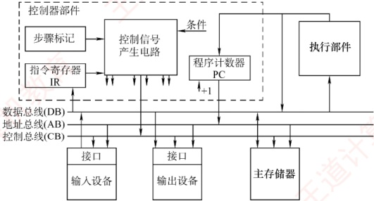
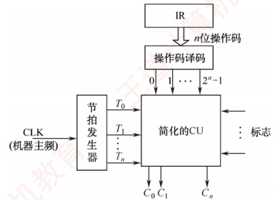
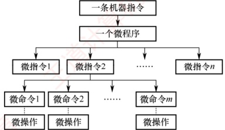
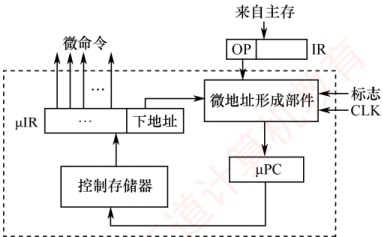
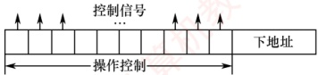
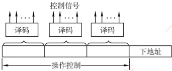
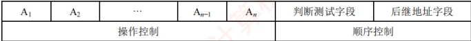
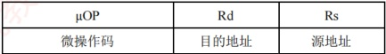

## 5.4 控制器的功能和工作原理

### 5.4.1 控制器的结构和功能

在计算机硬件系统中（见图 5.12），主要由执行部件、主存储器、输入/输出设备及控制器组成。各组件通过数据总线、地址总线和控制总线相互连接，其中虚线框内为控制器。

图 5.12 计算机硬件系统和控制器部件的组成

各部件的主要连接关系如下：

1）执行部件经由数据总线与主存及 I/O 设备交换数据。

2）输入/输出设备通过接口电路接入系统总线。

3）主存及 I/O 设备根据地址总线上的地址信号判断是否被选中，并依据控制总线上的读/写等控制信号，通过数据总线完成数据传输。

4）控制器通过地址总线发送指令地址（PC 的值）访问主存，并将获取的指令通过数据总线送入指令寄存器（IR），由控制器解析并控制执行。
控制器是计算机的指挥中心，其主要职责包括：

1）取出待执行的指令并计算下一条指令的位置（更新PC）。

2）对指令的操作码进行解码，产生对应的时序信号和控制信号，以协调各部件工作。

3）管理 CPU、主存和 I/O 设备间的数据流向及时序，确保指令正确执行。

依据微操作控制信号的生成方式不同，控制器可分为硬布线控制器和微程序控制器。尽管两者都包含PC和IR，但在指令执行步骤的表现形式以及控制信号的生成机制上有着本质区别。

### 5.4.2 硬布线控制器

硬布线控制器由复杂的组合逻辑电路和触发器构成，也称组合逻辑控制器。它根据指令需求、

当前时序和内部状态，按时间顺序生成一系列微操作控制信号，以完成指令的执行。指令的操作码是决定控制单元（CU）行为的关键：CU 作为处理器的“指挥中心”，依据操作码生成相应的控制信号，协调寄存器、ALU、存储器等硬件组件的工作。

为简化 CU 的设计，通常将指令寄存器（IR）中的 n 位操作码通过译码电路转换为  $2^{n}$ 个输出信号。每种操作码经译码后，会唯一地激活一条输出信号线，用于触发对应的控制逻辑。若将操作译码器和节拍发生器从 CU 中分离，则可得到如图 5.13 所示的简化控制单元结构。

图 5.13 带指令译码器和节拍输入的简化的控制单元框图

CU 的输入主要包括三类信号：

1）操作译码器输出的指令信息，与节拍信号共同用于生成相应的微操作控制信号。

2）时钟脉冲，其频率即机器主频，用于划分节拍，确保控制信号按时发出。

3）执行单元反馈的状态标志，使CU能根据CPU当前状态动态调整控制逻辑。

在图 5.13 中，节拍发生器在每个时钟周期内产生节拍信号，使不同的微操作控制信号  $C_{i}$ 能够按序发出。由于某些指令（如条件转移）的执行不仅取决于操作码，还受状态标志影响，CU 必须综合操作码译码结果、节拍信号和状态标志，生成相应的控制信号，并发送至 CPU 内部数据通路或外部控制总线。

硬布线控制器通过组合逻辑电路实现，其性能主要受限于电路延迟。设计时，先用逻辑表达式描述各控制信号，经化简后实现为硬件电路。该方法虽响应速度快，但灵活性差：修改或新增指令需重新设计电路，复杂且耗时。同时，随着指令系统功能增强，微操作控制信号的数量急剧增加，导致电路规模庞大、调试困难。为克服这些缺点，微程序设计方法应运而生。

### 5.4.3 微程序控制器

微程序控制器采用存储逻辑实现，其核心思想是：将控制器所需的微操作控制信号组织为微指令，并将执行每条机器指令所需的微指令序列（微程序）预先存入一个专用的高速存储器中。运行时，控制器通过依次读取微指令，生成相应的微操作控制信号，从而完成指令的执行。

#### 1. 微程序控制的基本概念

微程序的设计思想是将每条机器指令编写为一段微程序。该微程序由若干条微指令组成，每条
微指令可产生一个或多个微命令。因此，执行一条机器指令的过程，实质上就是顺序执行其对应微程序的过程。这些微程序预先存放在专用的控制存储器（Control Memory，CM）中。

微程序设计涉及以下基本术语：

##### （1） 微命令与微操作

在微程序控制的计算机中，控制部件向执行部件发出的最基本控制信号称为微命令，它是构成控制序列的最小单位。例如，使能某个寄存器的写入信号、打开数据通路中的控制门等。执行部件接收到微命令后所执行的具体动作称为微操作，二者一一对应。

微命令可分为两类：相容性微命令是指可同时有效、协同完成某一功能的微命令；互斥性微命令是指在同一时刻不允许同时有效的微命令。

**注意**

硬布线控制器中同样存在微命令与微操作的概念，只是其实现方式不同。

##### （2） 微指令与微周期

微指令是若干微命令的集合，通常包含两个字段：

① 操作控制字段（又称微操作码字段）：用于生成当前步骤所需的微操作控制信号。

② 顺序控制字段（又称下址字段）：用于确定下一条微指令的地址。

微周期是执行一条微指令所需的基本时间单位，通常为一个时钟周期。

综上，机器指令、微程序、微指令、微命令与微操作之间的层次关系如图5.14所示。

图 5.14 机器指令、微程序、微指令、微命令与微操作之间的层次关系

##### （3） 主存储器与控制存储器

### 考点追踪 ▶ ▶ 主存储器和控制存储器的区别（2017）

主存储器用于存放程序和数据，位于CPU外部，通常用RAM实现。控制存储器用于存放微程序，位于CPU内部，通常用ROM实现。控制存储器中每个存储单元的地址称为微地址。

#### （4） 程序与微程序

微程序和程序是两个不同的概念。程序是指令的有序集合，由软件开发者编写，用于完成特定功能，最终存放在主存或辅存中；微程序是微指令的有序集合，由计算机体系结构设计者编写，用于解释和执行机器指令，固化于控制存储器中。微程序本质上是机器指令的硬件级解释逻辑。对程序员而言，微程序的存在完全透明，无须了解其内部结构。

为准确理解微程序控制器的工作机制，需要区分以下关键寄存器：

① 地址寄存器（MAR），存放主存读/写地址。

② 微地址寄存器（μPC 或 CMAR），存放待执行微指令在控制存储器中的微地址。
③ 指令寄存器（IR），存放从主存读出的当前机器指令。

④ 微指令寄存器（μIR 或 CMDR），存放从控制存储器读出的当前微指令。

#### 2. 微程序控制器的组成和工作过程

##### （1）微程序控制器的基本组成

图 5.15 展示了微程序控制器的基本结构，其主要由以下部件构成：① 微地址形成部件，根据机器指令的操作码生成对应微程序的入口地址，并依据当前微指令的顺序控制字段及状态条件，产生后续微地址，确保微指令有序执行。

② 微指令地址寄存器，接收微地址形成部件提供的微地址，作为CM的读地址。

③ 控制存储器，微程序控制器的核心部件，用于存放所有机器指令对应的微程序。

④ 微指令寄存器，暂存从 CM 中读出的微指令，并将其操作控制字段和顺序控制字段分别送至执行单元和微地址形成部件。

图 5.15 微程序控制器的基本结构

##### （2）微程序控制器的工作过程

微程序控制器的工作过程是指计算机在微程序控制下执行机器指令的流程，具体如下：

① 执行取指令公共操作。系统启动或每条指令执行完毕后，将取指微程序的入口地址（通常为 CM 的 0 号单元）送入 μPC。随后，从 CM 中读取首条取指微指令并送入 μIR。完成取指微程序后，从主存中取出的机器指令即被存入指令寄存器（IR）中。

② 生成当前指令的微程序入口地址：根据 IR 中机器指令的操作码，通过微地址形成部件产生对应微程序的起始微地址，并送入 μPC。

③ 顺序执行微程序：从 CM 逐条读取微指令，送入  $\mu IR$ 并执行，直至该微程序执行完毕。

④ 返回循环：当前机器指令对应的微程序执行结束后，控制器自动转移回取指微程序的入口（步骤①），重新开始处理下一条机器指令。

整个流程不断循环，直至整个程序执行完毕。

##### （3） 微程序和机器指令

一般而言，一条机器指令对应一个微程序。由于所有指令的取指操作相同，可将取指操作的微命令统一编写为一个公共的取指微程序，专门负责从主存读取指令并送入IR。此外，还可以为间址、中断处理等公共操作分别编写独立的微程序。因此，控制存储器中存储的微程序总数 = 机器指令条数 + 公共微程序数（如取指、间址、中断等）。

#### 3. 微指令的编码方式

微指令的编码方式也称微指令的控制方式，是指对微指令操作控制字段进行组织和表示的方法，其目标是在保证执行速度的前提下，尽可能缩短微指令字长，从而节省控制存储器空间。

#### （1） 直接编码（直接控制）方式

如图 5.16 所示，直接编码方式无须译码。微指令的操作控制字段中，每一位直接对应一个微命令。设计微指令时，若需发出某个微命令，只需将对应位设为 1，否则设为 0。每个微命令独立控制数据通路中的一个微操作。

图 5.16 直接编码方式

该方式的优点是结构简单、直观，微命令可并行发出，执行速度快；缺点是微指令字长过长，若有n个微命令，则操作控制字段需要n位，导致控制存储器容量急剧膨胀。

#### （2） 字段直接编码方式

### 考点追踪 字段直接控制的编码方式（2012）

如图 5.17 所示，字段直接编码将操作控制字段划分为若干互斥段。互斥性微命令被归入同一字段，相容性微命令则分配到不同字段。每个字段独立编码，经译码后在其所属的互斥微命令集中激活一个微命令。各字段之间相互独立，编码含义互不影响。

图 5.17 字段直接编码方式

微命令字段分段需遵循以下原则：

① 互斥性微命令应分配在同一字段，而相容性微命令应分布在不同字段。

② 每个字段的位数不宜过多，以避免译码电路过于复杂或引入较大延迟。

③ 每个字段通常还需预留一个编码表示“本字段无操作”。例如，当字段长度为3位时，最多只能表示7个互斥的微命令，通常用000表示无操作。

该方式显著缩短了微指令字长，但因需要译码，执行速度略低于直接编码。

#### （3） 字段间接编码方式

字段间接编码进一步压缩微指令长度。其基本思想是：某个微命令字段的实际含义，由另一个字段的编码共同决定。例如，字段 A 的编码 001 本身无固定意义，只有结合字段 B 的值（如 B = 0 表示 ALU 操作，B = 1 表示存储器操作），才能确定 001 究竟代表加法还是写内存。

这种方法可以进一步缩短微指令字长，减少控制存储器的容量需求。然而，由于译码线路更为复杂，时间开销较大，因此仅适用于特定场合。

现举例说明。假设有两类互斥操作：ALU 操作（加、减、与、或，共 4 种）和存储器操作（读、写、取指、间址，共 4 种）。在这 8 个微命令中，ALU 操作彼此互斥，存储器操作彼此互斥，但 ALU 与存储器操作相容（可同时发生，如“加法 + 写内存”）。直接编码需 8 位，每位对应一个微命令；字段直接编码将其分为两个字段，每个字段 3 位（含无操作状态），共需 6 位；而字段间接编码仅用一个 3 位的操作字段，再加一个 1 位的类型字段指示其类别（例如，操作字段 = 001、类型字段 = 0 表示 ALU 加法，操作字段 = 001、类型字段 = 1 表示主存读），总共仅需 4 位。

#### 4. 微指令的地址形成方式

为保证微指令流的连续执行，每条微指令必须指明其下一条微指令的地址。该地址通常在当前微指令从控制存储器中取出后立即生成，可通过以下两种基本方式形成：
① 增量方式（计数器方式），下条微地址由微程序计数器（μPC）自动加1生成，适用于微程序中的顺序执行段。

② 断定方式（下址字段方式），在当前微指令中显式指定下条微地址。图5.15所示的微程序控制器即采用断定方式，其微指令包含下址字段，可直接给出下条微地址。

在实际运行中，下条微地址的确定取决于以下三种典型情形：

① 微程序入口地址的形成，一条机器指令从主存取出并送入指令寄存器（IR）后，其操作码经微地址形成部件生成对应微程序的首条微指令地址，并送入  $\mu PC$。

② 顺序执行，在无转移的微程序段中，通常采用增量方式，由  $\mu PC + 1$ 自动生成下条微地址；若采用断定方式，则需在每条微指令的下址字段中显式填入顺序地址。

③ 条件分支，当需要根据状态标志或外部条件选择不同执行路径时，微地址形成部件结合当前微指令的下址字段指定的转移目标地址与条件信号来确定下条微地址。

#### 5. 微指令的格式

微指令格式与其编码方式密切相关，通常分为水平型微指令和垂直型微指令两类。

### 考点追踪 微指令后继地址字段位数与微指令条数的关系（2014）

#### （1） 水平型微指令

从编码方式看，直接编码、字段直接编码和字段间接编码都属于水平型微指令。水平型微指令的基本格式如图5.18所示，其操作控制字段中，每一位（或每一字段）直接对应一个微命令，置1表示有效，置0表示无效。一条水平型微指令可同时定义并执行多个并行的微操作。

图 5.18 水平型微指令的基本格式

其优点是并行能力强、执行效率高、微程序短；缺点是微指令字长长，编写微程序困难。

#### （2） 垂直型微指令

采用类似机器指令的结构，在微指令中设置微操作码字段，通过译码产生控制信号。垂直型微指令的基本格式如图5.19所示。一条垂直型微指令通常显式定义一个基本微操作。

图 5.19 垂直型微指令的基本格式

其优点是微指令短、格式规整，编写微程序简单；缺点是微程序长，执行速度慢，效率低。水平型微指令与垂直型微指令的比较：

① 水平型微指令并行能力强、灵活性强、效率高；垂直型在这些方面则表现较差。

② 单条水平型微指令完成更多工作；垂直型需要多条微指令完成同等任务，耗时更长。

③ 水平型微指令字长长但编写的微程序短；垂直型则微指令字长短而微程序长。

④ 水平型微指令编写微程序的难度大；而垂直型类似于机器指令，更易于理解和编写。

#### 6. 硬布线控制器和微程序控制器的特点

### 考点追踪 硬布线控制器和微程序控制器的特点（2009）

#### （1）硬布线控制器的特点

硬布线控制器的优点在于其运行速度主要取决于电路延迟，因此执行速度快。然而，由于控
制部件被实现为专门生成固定时序控制信号的组合逻辑电路，设计时以使用最少硬件资源并实现最高速度为目标。一旦设计完成，通常难以通过软件手段扩展或修改功能。

#### （2） 微程序控制器的特点

与硬布线控制器相比，微程序控制器具有结构规整、灵活性强和易于维护的优势。其设计基于存储程序原理，便于对微程序进行修改与扩展。不过，由于每条微指令均需从控制存储器中读取，导致指令执行所需的微周期数增加，从而影响整体运行速度。

为便于比较，下面以表格的形式对比二者的不同，见表5.2。

表5.2 微程序控制器与硬布线控制器的对比

| 对比项 | 类 别 |   |
| --- | --- | --- |
| 微程序控制器 | 硬布线控制器 |   |
| 工作原理 | 微操作控制信号以微程序的形式存放在控制存储器中，执行指令时读出即可 | 微操作控制信号由组合逻辑电路根据当前的指令码、状态和时序即时产生 |
| 执行速度 | 慢 | 快 |
| 规整性 | 较规整 | 烦琐、不规整 |
| 应用场合 | CISC CPU | RISC CPU |
| 易扩充性 | 易扩充修改 | 扩充修改困难 |

