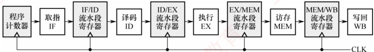
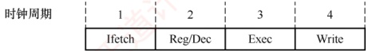
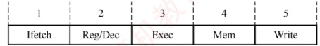
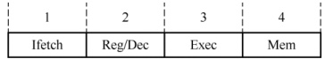

## 5.6 指令流水线

前面介绍的单周期处理器采用串行方式执行指令，同一时刻仅有一条指令处于执行状态，导致各功能部件的利用率较低。现代计算机普遍采用指令流水线技术，使多条指令在 CPU 的不同功能部件中并发执行，从而显著提升硬件资源的并行利用率和程序的整体执行效率。

### 5.6.1 指令流水线的基本概念

提升处理器并行性的主要途径有两类：① 时间上的并行，将一个任务分解为多个子阶段，各阶段由专用功能部件依次处理，并允许多个任务在不同阶段同时推进，即流水线技术。② 空间上的并行，在一个处理器内配置多个相同的功能部件，使其并行工作，称为超标量处理器。

一条指令的执行过程可划分为若干有序阶段，每个阶段由特定的功能部件完成。若将这些阶段视为流水线的各级（或称流水段），则整个指令执行流程便构成一条指令流水线。

典型的五段流水线将指令执行划分为以下阶段 $^{①}$:

取指（IF）：从指令存储器或缓存中读取指令。

译码/读寄存器（ID）：对指令进行译码，并从寄存器堆中读取操作数。

执行/计算地址（EX）：执行算术逻辑运算或计算有效地址。

• 访存（MEM）：访问主存储器，完成数据的读或写操作。

• 写回（WB）：将执行结果写回寄存器堆。

通过重登执行，可在第 k 条指令处于译码阶段时，启动第  $k+1$ 条指令的取指阶段，从而实现多条指令在不同流水段中的并行推进。图 5.20 展示了五段流水线的理想执行时序。

| 指令 | 0 | 1 | 2 | 3 | 4 | 5 | 6 | 7 | 8 | 9 | 10 | 时间T |
| --- | --- | --- | --- | --- | --- | --- | --- | --- | --- | --- | --- | --- |
| I₅ |   |   |   |   | IF | ID | EX | MEM | WB |   |   | 1 |
| I₄ |   |   |   | IF | ID | EX | MEM | WB |   |   |   | 1 |
| I₃ |   |   | IF | ID | EX | MEM | WB |   |   |   |   | 1 |
| I₂ | IF | IF | ID | EX | MEM | WB |   |   |   |   |   | 1 |
| I₁ | IF | ID | EX | MEM | WB |   |   |   |   |   |   | 1 |

图 5.20 一个 5 段指令流水线

在理想情况下（无冒险、无停顿），每个时钟周期均有一条新指令进入流水线，同时有一条指令完成执行，此时每条指令的平均时钟周期数（CPI）趋近于1。

### 考点追踪 ▶️ 流水线对指令集的要求（2011）

为便于高效实现指令流水线，指令集应具备以下特征：

1）指令长度统一：简化取指与译码逻辑，避免因变长指令导致取指周期不确定。

2）指令格式规整：确保源操作数寄存器字段位置固定，支持在译码前预取操作数。

3）采用 LOAD/STORE 架构：仅允许加载（LOAD）和存储（STORE）指令访问主存，其他指令仅操作寄存器，有利于流水段功能划分与调度。

4）数据与指令按边界对齐存放：确保单次访存即可获取完整操作数，避免跨周期访问，保障流水段的原子性与时序规整性。

### 5.6.2 流水线的基本实现

#### 1. 流水线设计的原则

在单周期实现中，尽管并非所有指令都需要完整经历全部5个阶段，但时钟周期必须以执行时间最长的指令路径为基准。因此，单周期CPU的时钟频率受限于数据通路中的最长路径。

### 考点追踪 ▶ 流水线时钟周期的设计（2009、2025）

流水线设计遵循以下原则：

1）流水段的数量以最复杂指令所需的功能段数为准；

2）每个流水段的时长以最耗时的操作为准。

例如，某条指令的各阶段延迟如下：①取指 200ps；②译码 100ps；③执行 150ps；④访存 200ps；⑤写回 100ps，该指令在单周期处理器中的总执行时间为 750ps。按流水线设计原则，时钟周期需要取各段的最大延迟，即 200ps。因此，每条指令从进入流水线到流出需经历 5 个周期，总延迟为 1000ps，大于单周期实现的 750ps。这表明：流水线并不能缩短单条指令的执行延迟。然而，对于包含 N 条指令的程序，单周期处理器总耗时为  $N \times 750ps$，而流水线处理器总耗时为  $(N + 4) \times 200ps$。当 N 较大时，流水线的吞吐率显著更高，整体执行效率大幅提升。

#### 2. 流水线的逻辑结构

每个流水段之后都需设置一个流水段寄存器，用于锁存该段的输出结果，确保其能在下一个时钟周期供下一流水段使用，如图5.21所示。所有寄存器和数据存储器均采用统一时钟CLK同步：每来一个时钟脉冲，各段处理完成的数据便锁存至段尾寄存器，作为后续段的输入；同时，当前段接收前一段经寄存器传递过来的数据，从而实现指令在流水线中的逐级推进。



图 5.21 流水线的逻辑结构图

一条指令依次流经IF、ID、EX、MEM、WB五个流水段。当第一条指令进入WB段时，各流水段分别包含一条不同的指令，此时流水线达到满载状态，最多可同时有5条指令处于不同的执行阶段。
### 考点追踪 ▶ 存在流水段寄存器时延的时钟周期的设计（2018）

**注意**

流水段寄存器本身也引入一定时延。但在考试中，若无明确说明，则可忽略寄存器时延。

#### 3. 流水线的时空图表示

流水线的执行过程常用时空图直观表示，如图5.22所示。

| 时间/T | WB | MEM | EX | ID | IF |
| --- | --- | --- | --- | --- | --- |
| 0 |   |   | EX | ID | IF |
| T |   |   | EX | IP | I₁ |
| 2T |   |   | IP₁ | IP₂ | I₂ |
| 3T |   |   | IP₂ | IP₃ | I₃ |
| 4T |   |   | IP₃ | IP₄ | I₄ |
| 5T |   |   | IP₄ | IP₅ | I₅ |
| 6T |   |   | IP₅ | IP₆ | I₆ |
| 7T |   |   | IP₆ | IP₇ | I₇ |
| 8T |   |   | IP₇ | IP₈ | I₈ |
| 9T |   |   | IP₈ | IP₉ | I₉ |
| 10T |   |   | IP₉ | IP₁₀ | I₁₀ |

图 5.22 一个 5 段指令流水线的时空图

### 考点追踪 流水线执行4条指令所需的时钟周期数（2012）

图中，横轴表示时间（单位为时钟周期 T），纵轴表示流水段（空间）。指令  $I_1$ 在时刻 0 进入流水线，于时刻 5T 完成；指令  $I_2$ 在时刻 T 进入流水线，于时刻 6T 完成；以此类推，从时刻 5T 起，每个周期结束时均有一条指令完成。例如，到时刻 10T 时，已有  $I_1$ 至  $I_6$ 共 6 条指令完成执行。相比之下，若采用单周期实现（每条指令需约 3.75 个时钟周期，因  $750ps \div 200ps = 3.75$），在 10T 内仅能完成约 2～3 条指令。可见，流水线通过重叠执行，显著提升了指令吞吐率。

值得注意的是，流水线的高效性依赖于连续、无中断的指令流。而程序执行天然具有顺序性和连续性，因此非常适合采用流水线技术。

#### 4. 流水线的吞吐率分析

### 考点追踪 流水线吞吐率的计算（2013）

流水线的吞吐率（Throughput, TP）是指单位时间内流水线完成的任务数（或输出结果的数量），是衡量流水线性能的重要指标。其基本定义为

 $$TP=n/T_{k}$$

其中，n 为任务总数， $T_{k}$ 为完成这 n 个任务所需的总时间。

设流水线共有 k 段，时钟周期为  $\Delta t$。在理想条件下（任务连续输入、无阻塞），完成 n 个任务所需的时间为  $(k+n-1)\Delta t$，因此吞吐率可表示为  $\mathrm{TP}=n/[(k+n-1)\Delta t]$。当任务数量 n 趋于无穷大时，启动阶段（前 k-1 个周期）的影响可忽略不计，此时吞吐率达到理论最大值  $1/\Delta t$。

### 5.6.3 MIPS 指令集的流水段分析

每条 MIPS 指令的前两个功能段相同：

取指（IFetch）：从指令存储器中取出指令并计算PC+4。

- 寄存器/译码（Reg/Dec）：从寄存器堆中读取操作数并对指令进行译码。后续功能段则根据具体指令类型有所不同。

#### 1. R型指令的功能段划分

R 型指令属于寄存器-寄存器型（RR 型）指令，其操作数和结果均位于通用寄存器中。典型的 R 型指令从寄存器 Rs 和 Rt 读取源操作数，在 ALU 中完成指定运算，并将结果写入目的寄存
器 Rd。如图 5.23 所示，R 型指令在流水线中经过 IFetch 和 Reg/Dec 阶段后，进入：

执行（Exec）：在 ALU 中完成运算。

写回（Write）：将 ALU 的结果写入寄存器堆中的 Rd。



图 5.23 R 型指令的功能段划分

#### 2. I型指令的功能段划分

I 型指令包含 16 位立即数，用于立即数运算、内存访问或条件分支，是 RISC 处理器实现常量操作和地址计算的重要手段。I 型运算类指令先对 16 位立即数进行符号扩展（或零扩展），再与 Rs 的内容在 ALU 中运算，结果写入寄存器 Rt。其功能段划分与 R 型指令的完全相同。

#### 3. lw 指令的功能段划分

lw 指令的功能为 R[Rt] ← M[R[Rs] + SEXT(imm16)]，即从内存中读取一个字并写入寄存器 Rt。它将 Rs 的值与符号扩展（Sign Extension）后的 16 位立即数相加，形成有效地址，再从该地址读取数据。如图 5.24 所示，lw 指令在流水线中经过 IFetch 和 Reg/Dec 阶段后，进入：

• 执行（Exec）：计算内存地址（R[Rs] + SEXT(imm16)）。

• 访存（Mem）：从数据存储器中读取一个字。

• 写回（Write）：将读取的数据写入寄存器堆中的 Rt。



图 5.24 1w 指令的功能段划分

#### 4. sw 指令的功能段划分

sw 指令的功能为 M[R[Rs] + SEXT(imm16)] ← R[Rt]，即将寄存器 Rt 中的数据写入内存。如图 5.25 所示，sw 指令在流水线中经过 IFetch 和 Reg/Dec 阶段后，进入：

执行（Exec）：计算内存地址（R[Rs] + SEXT(imm16)）。

• 访存（Mem）：将 Rt 中的数据写入数据存储器中指定地址。



图 5.25 sw 指令的功能段划分

#### 5. beq 指令的功能段划分

beq 指令的功能为：若 R[Rs] = R[Rt]，则 PC ← PC + 4 + SEXT(imm16)×4。它比较两个寄存器的值，若相等，则转移至目标地址，否则顺序执行。目标地址由当前 PC 加 4 后，再加上符号扩展并左移 2 位的 16 位立即数得到。beq 指令在流水线中经过 IFetch 和 Reg/Dec 阶段后，进入：

• 执行（Exec）：比较 Rs 与 Rt，并计算分支目标地址（PC + 4 + SEXT(imm16)×4）。

• 访存（Mem）：若比较结果为相等，则将目标地址写入PC。

需要注意的是，beq 指令的 Mem 段并非真正的内存访问，而是将写 PC 操作安排在该段，以便与 lw、sw 等指令对齐。由于写 PC 的延迟小于存储器访问，因此可在 Mem 段完成。

#### 6. j 指令的功能段划分

j 指令是无条件转移指令，其功能是直接将目标地址送入 PC。除两个公共功能段外，j 指令
仅需一个功能段用于更新 PC，该操作可合并到 Exec 段完成。具体如下：

执行（Exec）：计算目标地址并更新PC。

从上述分析可见，lw 指令最复杂，需 5 个功能段。为统一流水线结构，其他指令通过插入“空”段（不执行实际操作的阶段）对齐至 5 段。插入空段需遵循两个原则：

每条指令对任一功能部件至多使用一次（如同一条指令不能多次使用寄存器的写口）。

相同功能部件必须在固定阶段使用（如寄存器写回总在第5阶段）。

因此，R 型和 I 型运算指令在 Write 前插入空 Mem 段，使其 Write 段与 lw 指令对齐；sw 和 beq 指令在 Exec 后插入空 Write 段；j 指令插入空 Mem 和 Write 段。通过上述对齐，所有指令均适配于 5 个功能段，因此该处理器可采用 5 段流水线设计。

### 5.6.4 流水线的冒险与处理

### 考点追踪 导致流水线阻塞的各种原因（2010、2025）

在指令流水线中，某些情况可能导致后续指令无法正确执行，从而引起流水线阻塞，这种现象称为流水线冒险。根据成因不同，可分为结构冒险、数据冒险和控制冒险三种类型。

不同类型指令在各流水段的操作如表5.3所示。

表5.3 不同类型指令在各流水段中的操作

| 指令 | 流水段 |   |   |   |   |
| --- | --- | --- | --- | --- | --- |
| IF | ID | EX | MEM | WB |   |
| ALU | 取指 | 译码 读寄存器堆 | 执行 | — | 结果写回寄存器堆 |
| 取/存 | 取指 | 译码 读寄存器堆 | 计算访存有效地址 | 访存（读/写） | 将读出的数据写入寄存器堆/— |
| 转移 | 取指 | 译码 读寄存器堆 | 计算转移目的地址，设置条件码 | 若条件成立，将转移目的的地址送 PC | — |

这几类指令将在下面介绍流水线冲突时涉及。

#### 1. 结构冒险

### 考点追踪 解决结构冒险的办法（2016）

结构冒险（又称资源冲突）是指不同指令在同一时刻争用同一功能部件所引发的冲突，其本质是硬件资源的物理限制。例如，在指令与数据共享同一存储器的系统中，第i条LOAD指令在第4个时钟周期处于MEM段（访问数据存储器），而第i+3条指令在同一周期处于IF段（取指令），两者同时访存，引发冲突。此时可暂停后续指令的取指操作一个周期，如表5.4所示。当然，若第i条指令不是访存指令，则其在MEM段不访问存储器，也就不会发生访存冲突。

表5.4 用暂停后续指令的方法解决访存冲突

| 指 令 | 时钟周期 |   |   |   |   |   |   |   |   |
| --- | --- | --- | --- | --- | --- | --- | --- | --- | --- |
| 1 | 2 | 3 | 4 | 5 | 6 | 7 | 8 | 9 |   |
| LOAD 指令 | IF | ID | EX | MEM | WB |   |   |   |   |
| 指令 i+1 |   | IF | ID | EX | MEM | WB |   |   |   |
| 指令 i+2 |   |   | IF | ID | EX | MEM | WB |   |   |
| 指令 i+3 |   |   |   | 停顿 | IF | ID | EX | MEM | WB |
| 指令 i+4 |   |   |   |   |   | IF | ID | EX | MEM |

解决结构冒险的主要方法有：

1）遵循功能部件使用原则：确保每个功能部件在每条指令中至多使用一次，且总在固定阶段使用（如寄存器写回操作统一安排在 WB 段），可避免部分结构冲突。
2）增加硬件资源：例如，将寄存器堆的读口与写口分离，支持在一个周期的前半拍写、后半拍读；或将指令存储器与数据存储器分离。现代处理器的 L1 Cache 通常采用指令 Cache 与数据 Cache 分离的设计，从根本上消除了取指与数据访存之间的资源竞争。

#### 2. 数据冒险

### 考点追踪 指令流水的数据冒险（2012、2014、2016、2019、2023）

数据冒险又称数据相关，其根本原因是：后面指令用到前面指令的结果时，前面指令的结果还未产生或写回。在按序发射、按序完成的流水线中，所有数据冒险都是因为前一条指令写结果之前，后面指令就需要读取而造成的，称为写后读（Read After Write，RAW）冲突。

**注意**

在非乱序执行 $^{①}$的流水线中（统考常涉及这种方式），只可能出现RAW冲突。

例如，考虑下列两条指令：

在 RAW 冲突中，I2 的源操作数 R1 正是 I1 的目的操作数。在非流水线中，I1 先写入 R1，I2 再读取 R1，顺序自然成立。但在流水线中，I2 在 ID 流水段就要读取 R1，而 I1 要到 WB 段才将结果写回寄存器堆，导致 I2 读取的是 R1 的旧值，如表 5.5 所示。

表5.5 add 和 sub 指令发生写后读（RAW）冲突

| 指 令 | 时钟周期 |   |   |   |   |   |
| --- | --- | --- | --- | --- | --- | --- |
| 1 | 2 | 3 | 4 | 5 | 6 |   |
| add | IF | ID | EX | MEM | WB |   |
| sub |   | IF | ID | EX | MEM | WB |

写R1

可采用以下方法解决 RAW 冲突。

### 考点追踪 解决数据冲突的办法（2024）

#### （1） 延迟执行相关指令

将数据相关的指令及其后续指令都暂停若干时钟周期，直至前一条指令的结果可被安全读取。可分为软件插入空操作（nop）指令和硬件自动插入气泡（阻塞）两种方法。

由表5.5可见，add指令在第5个时钟周期才将结果写回R1，而sub指令在第3个时钟周期就需读取R1，发生RAW冲突。若不采取措施，sub指令将使用错误的旧值。为此，可让sub指令延迟3个时钟周期，使其ID段发生在add指令的WB段之后，如表5.6所示。

表5.6 用延迟相关指令的办法来解决 RAW 冲突

| 指 令 | 时钟周期 |   |   |   |   |   |   |   |   |
| --- | --- | --- | --- | --- | --- | --- | --- | --- | --- |
| 1 | 2 | 3 | 4 | 5 | 6 | 7 | 8 | 9 |   |
| add | IF | ID | EX | MEM | WB |   |   |   |   |
| sub |   | 阻塞 | 阻塞 | 阻塞 | IF | ID | EX | MEM | WB |

此外，若寄存器堆支持在一个时钟周期的前半个时钟周期写入、后半个时钟周期读出，则 add
指令在 WB 段写入的值可在同一个时钟周期被 sub 指令在 ID 段读取。此时，add 指令的 WB 段与 sub 指令的 ID 段可重叠执行，从而仅需延迟 2 个时钟周期。

#### （2） 采用转发（旁路）技术

设置相关转发通路，使后续指令无须等待前一条指令将计算结果写回寄存器堆，而是将其在执行阶段生成的中间结果直接转发至 ALU 的输入端。如表 5.7 所示，add 指令在 EX 段结束时已计算出 R1 的新值，并暂存于 EX/MEM 流水段寄存器中。当 sub 指令进入 EX 段时，其所需的 R1 值可直接从该流水段寄存器转发至 ALU，从而确保使用的是最新结果。

表5.7 用转发技术来解决RAW冲突

| 指 令 | 时钟周期 |   |   |   |   |   |
| --- | --- | --- | --- | --- | --- | --- |
| 1 | 2 | 3 | 4 | 5 | 6 |   |
| add | IF | ID | $\overline{EX}$ | MEM | WB |   |
| sub |   | IF | ID | $\rightarrow$ EX | MEM | WB |

增加转发通路后，相邻的两条运算类指令之间，以及相隔一条无关指令的两个运算类指令之间的数据相关所引发的 RAW 冲突，均可通过转发有效消除。

#### （3） load-use 数据冒险的处理

若 load 指令与其后紧邻的运算类指令存在数据相关，则无法通过转发技术解决，这种情况称为 load-use 数据冒险。考虑以下两条指令：

 $$\begin{array}{r l r l}&{\mathrm{I}1\quad}&{\mathrm{l o a d}\mathrm{~r}2,12(\mathrm{r}1)}&{\#\mathrm{M}[(\mathrm{r}1)+12]\rightarrow(\mathrm{r}2)}\\ &{\mathrm{I}2\quad}&{\mathrm{a d d}\mathrm{~r}4,\mathrm{r}3,\mathrm{r}2}&{\#\mathrm{(r}3)+\mathrm{(r}2)\rightarrow(\mathrm{r}4)}\end{array}$$

load 指令在 MEM 段结束时才从存储器读出数据，并暂存于 MEM/WB 流水段寄存器；而紧随其后的 add 指令在其 EX 段（与 load 指令的 MEM 段处于同一周期）就需要 R2 的值。由于此时 load 指令尚未完成访存，结果不可用，因此 add 指令只能读取 R2 的旧值。

对于 load-use 数据冒险，最简单的做法是由编译器在 add 指令前插入一条 nop 指令。这样，add 指令的 EX 段就能通过转发机制，从 MEM/WB 流水段寄存器中获取 load 指令的最新结果，如表 5.8 所示。当然，最好的办法是在程序编译时进行优化，通过调整指令顺序以避免 load-use 相关的发生。

表5.8 用延迟加转发技术来解决 load-use 冲突

| 指 令 | 时钟周期 |   |   |   |   |   |   |
| --- | --- | --- | --- | --- | --- | --- | --- |
| 1 | 2 | 3 | 4 | 5 | 6 | 7 |   |
| load | IF | ID | EX | $**MEM**$ | WB |   |   |
| add |   | 阻塞 | IF | ID | $**EX**$ | MEM | WB |

#### 3. 控制冒险

### 考点追踪 分析指令之间的控制冒险（2014、2023）

指令通常按顺序执行，但在遇到转移、返回、中断或异常等事件时，程序计数器（PC）的值会被修改，导致流水线断流，这种现象称为控制冒险（又称控制冲突）。

对于由分支指令引起的冲突，最简单的处理方法是推迟后续指令的执行。通常将因流水线阻塞产生的延迟时钟周期数称为延迟损失时间片C。在下列指令中，假设R2存放常数N，R1的初值为1。bne指令在EX段完成条件计算，但直到MEM段结束（第5个时钟周期末）才确定是否更新PC，因此从分支指令进入流水线到转移决策完成，共产生3个时钟周期延迟（记位C=3）。
为避免错误执行后续指令，可在分支指令后插入C条nop指令，如表5.9所示。

I1 loop:add R1,R1,1

(R1) +1 → R1

I2 bne R1, R2, loop

```c
#if (R1) != (R2) goto loop
```

表5.9 用插入空操作的办法解决控制冲突

| 指 令 | 时钟周期 |   |   |   |   |   |   |   |   |   |
| --- | --- | --- | --- | --- | --- | --- | --- | --- | --- | --- |
| 1 | 2 | 3 | 4 | 5 | 6 | 7 | 8 | 9 | 10 |   |
| add | IF | ID | EX | MEM | WB |   |   |   |   |   |
| bne |   | IF | ID | EX | MEM | WB |   |   |   |   |
| add |   |   |   |   |   | IF | ID | EX | MEM | WB |

解决控制冒险的主要方法包括：

1）延迟分支处理：对于由分支指令引起的冲突，可由软件在分支指令后插入若干nop指令，或由硬件自动阻塞（插入气泡）。插入nop指令的数量等于分支延迟周期数。

2）分支预测技术：尽早生成转移目标地址并预测转移方向，以减少流水线清空。静态预测采用简单规则，总是预测转移发生或不发生；动态预测根据程序运行时的转移历史动态调整预测策略，准确率更高。若预测错误，则需清空已进入流水线的错误路径指令，并从正确目标地址重新取指；若分支延迟周期数为3，此时将损失3个时钟周期。

**注意**

Cache 缺失、中断或异常的发生也会引起流水线阻塞。

### 5.6.5 高级流水线技术

有两种主要策略可用于提升指令级并行度：一是多发射技术，通过配置多个内部功能部件，使流水线在每个时钟周期能同时处理多条指令，处理器一次可发射多条指令进入流水线执行；二是超流水线技术，通过增加流水线级数，使更多指令在流水线中重叠执行。

#### 1. 超标量流水线技术（动态多发射）

### 考点追踪 超标量流水线的特性（2017）

每个时钟周期可并发发射多条独立指令，为此需配置多个功能部件，如图5.26所示。在简单的超标量处理器中，指令按顺序发射。但为了提升并行性能，多数现代超标量处理器结合动态调度技术（如动态分支预测等），支持乱序执行，即指令的执行顺序可不同于程序顺序。

| ID | WB X |
| --- | --- |
| 1 | 2.0 |
| 2 | 3.0 |
| 3 | 4.0 |
| 4 | 5.0 |
| 5 | 6.0 |

图 5.26 超标量流水线技术

#### 2. 超长指令字技术（静态多发射）

由编译器挖掘指令间的并行性，并将多条可并行执行的指令打包成一条超长指令字，其中包含多个操作码字段，分别控制不同的处理部件。由于并行性由软件静态确定，控制相对简单。
#### 3. 超流水线技术

超流水线通过进一步细分流水段来缩短时钟周期，从而提高主频和指令吞吐率。然而，流水级数增加会带来更大的流水段寄存器开销和更高的控制复杂度，因此流水线深度并非越多越好。

### 考点追踪 基本流水线与超标量流水线CPU的CPI（2020）

在理想情况下：超流水线 CPU 在流水线充满后，每个时钟周期完成一条指令，CPI=1，但主频更高；多发射 CPU 每个时钟周期可完成多条指令，CPI<1，但硬件成本更高、控制更复杂。
