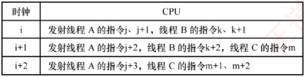
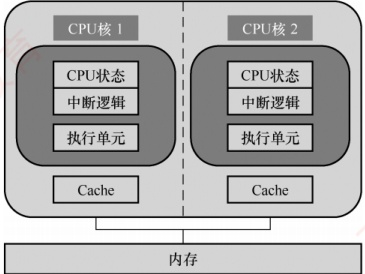

## 5.7 多处理器的基本概念

### 考点追踪 多处理器的基本概念（2022）

### 5.7.1 SISD、SIMD、MIMD 的基本概念

根据指令流和数据流的数量，计算机体系结构可分为四类：SISD、SIMD、MISD 和 MIMD。常规的单处理器属于 SISD，而常规的多处理器属于 MIMD。

#### 1. 单指令流单数据流（SISD）结构

SISD 是传统的串行计算机结构，通常包含一个处理器和一个存储器。处理器在任一时刻仅执行一条指令，并按指令流规定的顺序依次执行。为提升性能，部分 SISD 计算机采用指令流水线技术，设置多个功能部件，并以多模块交叉方式组织存储器。

#### 2. 单指令流多数据流（SIMD）结构

SIMD 采用数据级并行技术，由一个指令控制单元和多个处理单元组成。所有处理单元同时执行同一条指令，但各自拥有独立的地址寄存器，因而可以操作不同的数据。例如，在处理数组的 for 循环时，一条 SIMD 指令可以在 16 个 ALU 中并行运算 16 对数据，仅需一次运算时间即可完成。然而，在处理包含条件分支（如 switch 或 case 语句）的代码时，SIMD 效率显著降低，因为各处理单元需要根据不同的数据执行不同的操作，难以保持同步。

向量处理器是SIMD的典型实现之一。它通过专用指令直接操作一维数组（向量）：将数据从存储器加载到向量寄存器，以流水化方式批量处理，再将结果写回。该结构在数值模拟等规则计算场景中具有显著的性能优势。

#### 3. 多指令流单数据流（MISD）结构

MISD 指多个指令流同时处理同一数据流。尽管在理论上存在，但在通用计算机中极为罕见，几乎没有实际应用。

#### 4. 多指令流多数据流（MIMD）结构

MIMD 同时执行多条指令，分别处理多个不同的数据流，是目前主流的并行计算模型。MIMD 可分为两类：① 多计算机系统，每个节点拥有私有存储器和独立的地址空间，无法通过普通的访存指令直接访问其他节点的内存，需依赖消息传递进行通信，也称消息传递型 MIMD；② 多处理器系统，通常指共享存储多处理器系统（见 5.7.4 节），具有统一的全局地址空间，所有处理器可通过普通的访存指令访问系统中的任意存储单元，也称共享存储型 MIMD。
总体而言，SIMD属于数据级并行，适用于规则、同构的数据处理；而MIMD支持线程级或任务级并行，并行程度更高，适用范围更广。

### 5.7.2 硬件多线程的基本概念

在传统 CPU 中，线程切换涉及保存和恢复寄存器上下文等操作，频繁切换将引入显著性能开销。为减少这一开销，硬件多线程技术应运而生。支持该技术的处理器为每个线程配备独立的通用寄存器组、程序计数器（PC）等关键状态部件。线程切换时，只需激活对应线程的寄存器组，无须将上下文写入或从内存读出，从而大幅降低切换延迟。

硬件多线程主要有三种实现方式：细粒度多线程、粗粒度多线程和同时多线程（SMT）。

#### 1. 细粒度多线程

处理器在每个时钟周期切换线程，交替执行不同线程的指令。由于各线程彼此独立，其指令可在连续周期中交错执行，有效提升功能部件的利用率。例如，在时钟周期 i 执行线程 A 的指令，在周期  $i+1$ 执行线程 B 的指令。

#### 2. 粗粒度多线程

处理器连续执行同一线程的指令序列，仅当该线程因高延迟事件（如 Cache 缺失）导致流水线阻塞时，才切换至另一线程。此时需清空被阻塞的流水线，并为新线程重新填充流水线，因此切换开销通常大于细粒度多线程。

上述两种方式均在同一时刻仅执行一个线程的指令，不支持真正的指令级并行，其核心目标是通过线程切换隐藏长延迟操作，提升资源利用率。

#### 3. 同时多线程

SMT 在单个时钟周期内可同时发射并执行来自多个不同线程的多条指令，既利用了指令级并行，又实现了线程级并行。它通常构建于支持超标量和乱序执行的现代微架构之上，通过共享执行单元、缓存等硬件资源，在维持高单线程性能的同时，显著提升整体吞吐率。

图 5.27 给出了三种硬件多线程实现方式的调度示例。

| 时钟 | CPU |
| --- | --- |
| i | 发射线程A的指令j、j+1 |
| i+1 | 发射线程B的指令k、k+1 |
| i+2 | 发射线程A的指令j+2、j+3 |
| i+3 | 发射线程B的指令k+2、k+3 |

| 时钟 | CPU |
| --- | --- |
| i | 发射线程 A 的指令j、j+1 |
| i+1 | 发射线程 A 的指令j+2、j+3，发现Cache缺失 |
| i+2 | 线程调度，从 A 切换到B |
| i+3 | 发射线程 B 的指令k、k+1 |
| i+4 | 发射线程 B 的指令k+2、k+3 |

(a) 细粒度多线程示例

(b) 粗粒度多线程示例

(c) 同时多线程示例

图 5.27 三种硬件多线程方式的调度示例

Intel 处理器中的超线程（Hyper-Threading）技术是 SMT 的典型代表。它在一个物理核心中维护两套完整的线程状态部件（包括寄存器组、程序计数器等），而高速缓存、ALU 等执行资源则由两个逻辑核心共享，从而在单核上实现接近双核的并发处理能力（实际提升10%～30%）。
### 5.7.3 多核处理器的基本概念

多核处理器（Multi-core Processor）是指将多个独立的处理单元集成到单个 CPU 芯片中，每个处理单元称为一个核（core），也称片上多处理器。每个核通常配备私有的 L1 Cache（有时还包括 L2），而多个核则共享更高层级的 Cache（如 L3）；所有核通过互连网络共享主存储器。图 5.28 展示了一种简化的双核结构，其中各核仅拥有私有缓存，不共享任何缓存层级。

图 5.28 不共享缓存（Cache）的双核 CPU 结构

在多核系统中，要充分发挥硬件的并行计算能力，必须采用多线程（或多进程）模型，确保每个核在运行时均有可执行的线程。与单核系统中的多线程不同，多核架构支持多线程在物理上同时执行：每个核独立运行一个线程，实现真正的并行处理。而单核系统若采用细粒度或粗粒度多线程，其多个线程以时间交错方式执行，任一时刻仅有一个线程处于运行状态；但若支持同时多线程（SMT），则可在单个核上并发执行来自不同线程的多条指令。

下面通过一个直观的例子说明相关概念。假设需将四块石头滚到马路对面，滚动每块石头需1分钟。串行处理器（单核）逐一滚动，共需4分钟；双核处理器相当于两名工人，每人负责两块石头，耗时2分钟；向量处理器则如同使用一根长木板同时推动四块石头，由于对所有石头施加完全相同的操作，理论上只需1分钟即可完成。由此可见，多核处理器通过增加处理单元数量实现任务级并行，而向量处理器则通过单指令作用于多数据实现数据级并行。

### 5.7.4 共享内存多处理器的基本概念

具有共享单一物理地址空间的多处理器系统称为共享内存多处理器（Shared Memory multi-Processor，SMP）。在 SMP 系统中，所有 CPU 均可通过常规的访存指令访问内存中的任意位置，并通过读/写共享变量进行通信。需要注意的是，尽管物理地址空间是统一的，各 CPU 仍可在各自独立的虚拟地址空间中运行程序，操作系统负责将虚拟地址映射到统一的物理地址空间。

SMP 系统根据内存访问延迟的特性可分为两类：

统一存储访问（UMA）多处理器。所有 CPU 访问任意内存单元的延迟基本相同，与发起请求的 CPU 及目标地址无关。

非统一存储访问（NUMA）多处理器。内存访问延迟取决于请求 CPU 与目标内存的物理位置关系。通常，主存被划分为多个区域，分别连接到不同的 CPU。

早期的计算机系统普遍采用北桥架构：内存控制器集成于北桥芯片，CPU通过前端总线（FSB）连接北桥以访问内存。随着多核与多处理器技术的发展，多个CPU对前端总线的争用使其成为系统性能瓶颈。为突破这一限制，NUMA架构应运而生：内存控制器被集成到各CPU内
部，每个 CPU 直接连接一部分物理内存（称为本地内存）；各 CPU 之间通过高速互连总线（如 Intel 的 QPI）相互连接，可访问其他 CPU 的远程内存。在 NUMA 架构下，访问本地内存的延迟显著低于访问远程内存，因此程序性能对数据布局较为敏感。

由于多个 CPU 可能同时访问同一共享变量，必须引入同步机制以确保操作的原子性与数据一致性。否则，可能读取到另一 CPU 更新过程中的中间值，导致错误结果。常用方法是对共享变量使用互斥锁：任一时刻仅允许一个 CPU 持有该锁，其余 CPU 须等待其释放后方可访问。

第3章讨论的 Cache 一致性主要针对单处理器系统中 Cache 与主存的数据同步。而在 SMP 系统中，多个 CPU 的 Cache 可能同时缓存同一物理内存地址的副本，因此其 Cache 一致性要求更为严格：任意时刻，所有 CPU 对该地址的 Cache 副本必须保持一致。这一目标通常由硬件一致性协议保障，通过及时传播写操作或无效化其他 CPU 中的副本，维护全局数据一致性。
