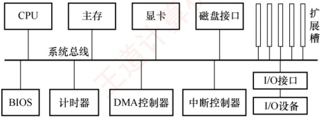
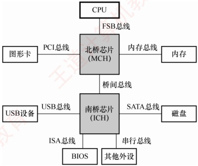

## 6.1 总线概述

早期计算机中，各部件通过专用连线直接互连，称为分散连接。随着I/O设备种类和数量不断增加，这种连接方式在扩展性和灵活性方面面临挑战。为提升系统的可扩展性与连接灵活性，计算机体系结构逐步演进为采用总线连接方式，并进一步催生了各类标准化总线规范。

总线是一组可供多个部件分时共享的公共信息传输线路。其核心特征是：

分时性：任一时刻仅允许一个部件向总线发送信息，多个发送方需要分时使用总线。

· 共享性：多个部件可同时挂接在总线上，并能同时接收总线上传输的信息。

### 6.1.1 总线的分类

### 考点追踪 ▶ 总线相关的概念与特点（2016、2017）

1）内部总线。内部总线指芯片内部的总线，也称片内总线，用于 CPU 芯片内部各寄存器之间以及寄存器与 ALU 之间的连接。

2）系统总线。指计算机系统内各功能部件（如CPU、主存、I/O接口）之间相互连接的总线。根据所传输信息的内容不同，系统总线可分为以下三类：

### 考点追踪 数据总线上传输的内容（2011）

① 数据总线用于在各部件之间双向传输数据信息，包括指令、操作数、状态字、中断类型号等。其位数反映了 CPU 一次能并行传送的数据位数。

②地址总线用于指定要访问的主存单元或I/O端口的地址。它是单向总线，其位数决定了系
统最大可寻址空间。为减少芯片引脚数量并降低成本，部分硬件架构采用地址线与数据线复用设计，此时地址与数据信息分时在同一组物理线路上传输。

③ 控制总线用于传输各种协调与控制信号，以确保各部件同步、有序地工作。典型信号包括：时钟、复位、总线请求/允许、中断请求/响应、存储器读/写、I/O 读/写、传输确认等。控制总线由若干单向或双向信号线组成，其具体构成取决于系统设计需求。

3）I/O 总线。用于连接主机与其内部的各类 I/O 控制器（如显卡、网卡等），通常采用标准化内部总线协议，如 PCI、AGP、PCI Express 等。

4）通信总线。用于主机与外部 I/O 设备之间或不同计算机系统之间的通信。这类总线需要适应不同的传输距离、速率和电气规范，典型代表包括 RS-232、USB 等。

### 6.1.2 常见的总线标准

总线标准是国际上制定的、用于互连计算机各功能模块的规范，是构建计算机系统时必须遵循的接口协议。典型的总线标准包括 ISA、EISA、VESA、PCI、AGP、PCI-Express、USB 等。它们的主要区别是总线宽度、带宽、时钟频率、寻址能力、是否支持突发传送等。

### 考点追踪 ▶️ 总线标准的英文缩写（2010）

1）ISA，Industry Standard Architecture，工业标准体系结构。最早的系统总线标准，传输速率低、CPU占用率高、占用较多中断资源。属于系统总线、并行总线。

2）EISA，Extended Industry Standard Architecture，扩展的 ISA。在 ISA 基础上扩展，支持多主控器和突发传送，且完全兼容 ISA。属于系统总线、并行总线。

### 考点追踪 ▶️ 区分设备总线和局部总线（2013）

3）VESA，Video Electronics Standards Association，视频电子标准协会。一种32位局部总线标准，为满足多媒体PC对高速图像数据传输的需求而设计。属于局部总线、并行总线。局部总线是一种位于CPU与ISA总线之间的高速扩展总线，旨在将高速外部设备（如显卡、磁盘控制器）从低速ISA总线迁移至更接近CPU的数据通路，以提升I/O性能。

4）PCI，Peripheral Component Interconnect，外部设备互连。高性能的32位或64位总线，广泛用于显卡、声卡、网卡等扩展卡。PCI总线是一个与处理器时钟频率无关的高速外围总线，支持即插即用。属于局部总线、并行总线。

5）AGP，Accelerated Graphics Port，加速图形接口。专为图形卡设计的高速接口，允许显卡直接高效访问系统主存，用于加速3D图形和视频处理。属于局部总线、并行总线。

### 考点追踪 PCI-E 总线的特点（2017）

6）PCI-E，PCI-Express。采用高速串行点对点连接，由多条通道组成（如×1、×16），支持全双工通信，传输速率远超PCI和AGP。属于局部总线、串行总线。

7）RS-232C。一种用于数据终端设备（DTE）与数据通信设备（DCE）之间进行串行二进制通信的标准接口。属于设备总线、串行总线。

### 考点追踪 USB 总线的特点（2012）

8）USB，Universal Serial Bus，通用串行总线。用于连接外部I/O设备，支持即插即用、热插拔和多设备级联，广泛应用于键盘、鼠标、移动存储等。属于设备总线、串行总线。

9）PCMCIA，Personal Computer Memory Card International Association。主要用于笔记本电脑
的扩展卡标准，支持即插即用。属于设备总线、并行总线。

10）IDE，Integrated Drive Electronics，集成设备电路。更准确称为 ATA，是连接主板与硬盘/光驱的传统并行接口。属于设备总线、并行总线。

11）SCSI，Small Computer System Interface，小型计算机系统接口。一种高性能的系统级设备接口，常用于服务器硬盘等。属于设备总线、并行总线。

12）SATA，Serial Advanced Technology Attachment，串行高级技术附件。IDE/ATA的串行替代标准，采用高速串行传输。属于设备总线、串行总线。

### 6.1.3 总线的性能指标

1）总线传输周期。指完成一次完整总线事务（如一次读或写操作）的总时间，通常由若干总线时钟周期组成，简称总线周期。

2）总线时钟频率。即总线基础时钟信号的频率，是总线时钟周期的倒数。早期总线的时钟与CPU时钟同频，随着CPU的快速发展，现代总线的时钟通常独立于CPU时钟。

3）总线工作频率。总线工作频率指总线每秒能进行的有效数据传输次数。早期总线每个时钟周期仅传输一次数据，此时总线工作频率等于时钟频率。现代总线一个时钟周期内可以传送2次、4次甚至更多次数据。因此，总线工作频率可达时钟频率的2倍、4倍等。

4）总线宽度。即总线中数据线的条数，决定了每次能并行传输的数据位数。

### 考点追踪 ▶️ 总线带宽的分析与计算（2009、2013、2014、2018—2020、2024、2025）

5）总线带宽。总线带宽指总线在单位时间内所能传输的最大数据量。计算公式为

 $$总线带宽 = 总线宽度 \times 总线工作频率$$

例如，若某总线的时钟频率为 11MHz，每个时钟周期可传送 2 次数据（工作频率为  $11 \times 2 = 22\text{MHz}$），总线宽度为 16 位（2 字节），则总线带宽  $= 2 \times 22 \times 10^6 = 44\text{MB/s}$。

**注意**

计算带宽（最大数据传输率）时，应依据总线的物理参数（宽度、时钟频率、每周期传输的次数），反映其理论峰值传输能力，无须考虑具体总线事务中的地址/命令开销或突发传输细节。仅在求平均数据传输率时，才需要分析事务时序。切勿将“两个设备间一次通信的有效速率”误当作“总线带宽”。

总线最主要的性能指标为总线宽度、总线工作频率和总线带宽。

6）总线复用。指同一组信号线在不同时间段传输不同类型的信息。例如，地址/数据线复用中，数据线在初期传输地址，后期传输数据。因此可减少引脚数量，节省硬件成本。

7）总线寻址能力。由地址线的位数决定，表示 CPU 能访问的最大地址空间。例如，16 位地址线可寻址  $2^{16}=65536$ 个存储单元；若每个单元为 1B，则最大寻址空间为 64KB。

### 6.1.4 总线的结构

总线是计算机系统中各功能部件之间传递信息的公共通道，其结构设计直接影响系统的整体性能和扩展能力。随着处理器速度的不断提升，总线结构经历了从简单共享到分层并行，再到高度集成的演进过程，核心目标始终是提升带宽、降低延迟、打破通信瓶颈。

#### 1. 早期共享总线结构

在计算机发展的早期阶段，普遍采用单总线结构：CPU、主存储器和各类I/O设备均挂接在同一条系统总线上，如图6.1所示。这种结构实现简单、成本低廉，但所有设备必须分时竞争总
线使用权，导致频繁的传输冲突，效率低下，难以满足高速外设的数据吞吐需求。

图 6.1 单总线结构示意图

为缓解 CPU 与主存之间的通信压力，后续引入了双总线结构，增设一条专用的存储总线，使 CPU 与主存的数据交换独立于 I/O 通路。尽管主存访问效率有所提升，但 I/O 设备若需要与主存交换数据，仍要通过 CPU 中转，形成了新的性能瓶颈。

进一步改进的三总线结构增加了DMA（直接内存访问）总线，允许高速I/O设备通过DMA控制器直接与主存通信，无须CPU干预。这一设计显著提升了I/O的吞吐能力。然而，传统总线固有的共享式、广播式特性，仍然限制了系统的并发性和可扩展性。

#### 2. 传统分层总线：南北桥结构

为突破早期共享总线的性能瓶颈，主流 PC 系统逐步转向分层次的多总线结构，典型代表是 Intel 在 Pentium 4 及早期 Core 系列处理器平台上广泛采用的南北桥结构，如图 6.2 所示。

图 6.2 南北桥结构示意图

该结构将系统划分为两个功能区域：

1）北桥芯片（Memory Controller Hub，MCH）作为高速枢纽，连接 CPU、主存和显卡，负责高带宽数据传输。

2）南桥芯片（I/O Controller Hub，ICH）是一个 I/O 控制器集线器，负责管理 USB、SATA、以太网等低速 I/O 接口，并提供扩展槽支持。

在这一结构中，CPU 与北桥之间的互连通道称为前端总线（Front Side Bus，FSB），也称系统总线。CPU 通过 FSB 连接至北桥，再经由北桥分别与主存（通过存储器总线）和显卡通信。而各类 I/O 设备（如 USB 设备、网卡、磁盘等）则通过各自的设备控制器接入南桥，北桥与南桥之间通过专用的桥间总线互连，最终形成从 I/O 到 CPU 和主存的完整数据通路。

尽管该结构实现了存储通路与I/O通路的物理分离，但所有数据（包括内存访问、显卡通信
以及 I/O 传输）最终仍需要通过前端总线汇聚至 CPU。因此，FSB 成为整个系统的唯一高性能通道，其共享式特性反而演变为新的性能瓶颈，严重制约了系统整体吞吐能力的进一步提升。

#### 3. 现代集成化总线结构

自 Intel Core i7 处理器起，总线结构迎来新的转变：北桥芯片的核心功能（如内存控制器）被集成到 CPU 内部，传统北桥随之消失，系统互连方式转向片上集成与点对点互连。

这一转变带来三大重要优势：

1）内存访问路径缩短。CPU 可通过片上存储器控制器直接访问主存，无须经过北桥中转。同时，普遍支持多通道 DDR 内存（如双通道、三通道），各通道并行工作，理论带宽近似为单通道的整数倍。例如，三通道 DDR3-1333 的峰值带宽可达单通道的 3 倍。

2）处理器间高速互连。多核 CPU 内核之间、多 CPU 芯片之间通过 QPI（QuickPath Interconnect）等点对点高速串行链路实现数据交换。QPI 不仅用于 CPU 间通信，还用于连接 CPU 与 IOH（输入/输出集线器，类似于早期的南桥），大幅提升了互连效率。

3）I/O通路直连。高速外设（如显卡、SSD）通过PCIe通道直接接入CPU，绕过南桥；低速设备则由集成度更高的PCH（Platform Controller Hub，新一代南桥）统一管理。
