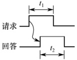
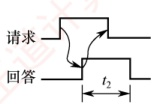
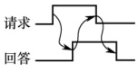

## 6.2 总线事务和定时

### 6.2.1 总线事务

在总线上，主设备（如 CPU、DMA 控制器）与从设备（如主存、I/O 设备）之间完成一次完整的信息交换过程，称为一个总线事务。总线事务的类型由操作性质决定，典型的包括存储器读（从主存取数据至处理器）、存储器写（向主存写入数据）、I/O 读/写、中断响应等。

每个总线事务通常包含三个基本阶段（依据历年真题）：

1）地址传送阶段：主设备将目标地址和操作类型（读/写）通过总线传送给从设备。

2）从设备响应阶段（也称数据准备阶段）：从设备根据地址准备数据（该阶段的耗时由设备特性决定，若题中未明确提及，则通常可忽略）。

3）数据传送阶段：完成实际数据在总线上的传输。

#### （1） 非突发传输与突发传输

总线上连续数据的传输可采用非突发或突发两种方式。
### 考点追踪 ▶ 非突发传输的时间分析（2023）

非突发传输方式：每次仅传输一个数据单元（通常为一个总线宽度的数据）。每次传输都必须独立经历完整的三阶段流程——先发送地址，等待从设备准备数据，再传输数据。因此，即使连续读取多个相邻数据，也需要重复发送地址，导致地址开销大、效率较低。

### 考点追踪 突发传输的特点与时间分析（2012—2014）

突发传输方式：用于高效传输连续成块的数据。事务开始时，主设备仅发送数据块的首地址；随后，在不释放总线的前提下，连续传送多个数据单元。后续地址由硬件自动递增生成（如首地址+1、首地址+2……），无须重复使用地址线。

因此，在相同总线宽度和时钟频率下，突发传输省去了多次地址传送开销，显著提升了有效带宽，广泛应用于高速存储器访问（如 SDRAM 行读取、Cache 块填充）等场景。简言之，非突发方式是“一次地址，一次数据”，突发方式是“一次地址，多次数据”。

#### （2） 串行传输与并行传输

数据在总线上的物理传输可采用串行或并行两种方式。

串行传输方式：数据按比特位依次顺序传输，通常仅使用一条双向线路或两条单向线路（发送/接收各一）。优点是引脚少、布线简单、抗干扰能力强，适合长距离通信（如USB、PCIe、SATA）。在串行传输中，根据收发双方的时序协调方式，又可分为同步串行通信和异步串行通信。

1）同步串行通信：由发送方时钟直接控制接收方时钟，实现位同步。收发双方的时钟严格一致，仅在数据块首尾添加开始和结束标记，传输效率高，但硬件实现复杂，成本较高。

### 考点追踪 异步串行通信方式的特点（2016）

2）异步串行通信：收发双方使用独立时钟，无须严格同步。每个字符独立传输，并通过起始位（逻辑0）标识开始，停止位（逻辑1）标识结束。当通信线路空闲时，保持逻辑1状态；发送方要传送字符时，先发送一个逻辑0作为起始位。接收方检测到该逻辑低电平后，便开始接收数据。数据位从最低位开始逐位发送；发送完数据位后，可选择性地发送一位奇偶校验位，用于简单的差错检测；随后发送停止位，表示该字符的结束。

并行传输方式：利用多条数据线同时传输多个比特位（如32位、64位总线），理论上单周期即可完成一个字的传输，短距离内延迟低、吞吐高。但随着频率的提高，信号串扰和时序偏移问题加剧，限制了工作频率的提升。因此，并行传输更适合板级或芯片级的短距离通信（如早期PCI、内存总线）。

**注意**

并行传输并不总是比串行传输更快。受限于电气特性，并行总线的工作频率难以持续提高；而串行传输可通过提升频率等方式实现更高的总带宽。因此，现代高速接口多采用串行化设计。

### 6.2.2 总线定时

总线定时是指总线上主设备与从设备在交换数据时，用于协调双方操作时序的控制协议。其实质是一种时序规则，主要有同步、异步、半同步和分离式四种方式。

### 考点追踪 各种总线定时方式的特点（2015、2021）

#### 1. 同步定时方式

同步定时方式采用系统统一的时钟信号来协调发送方和接收方的传送定时关系。时钟产生相
等的时间间隔，每个间隔构成一个总线周期，每次数据传送在一个总线周期内完成。由于采用统一时钟，所有操作必须严格在固定周期内进行，总线周期连续进行。

优点：传送速度快，具有较高的传输速率；总线控制逻辑简单。

缺点：主从设备之间属于强制性同步，所有操作严格受时钟节拍约束；缺乏应答或握手机制，无法根据从设备的实际状态动态调整时序，可靠性较差。

适用场景：适用于总线长度较短，且所连接各部件的存取时间比较接近的系统。

#### 2. 异步定时方式

异步定时方式不依赖统一的时钟信号，而是通过主从设备之间的握手信号实现定时控制：主设备发出“请求”信号；从设备准备就绪后，发出“回答”信号。

优点：总线周期长度可变，能可靠连接工作速度差异较大的设备，自适应性强。

缺点：控制逻辑复杂，因多次信号交互，整体传输速率较低。

根据 “请求” 与 “回答” 信号的撤销是否互锁，异步定时可分为三类：

1）不互锁方式。主设备发出“请求”后，在预设时延 $t_{1}$后自行撤销；从设备收到请求后立即发出“回答”，并在时延 $t_{2}$后自动撤销。双方无互锁关系，如图6.3(a)所示。

2）半互锁方式。主设备必须收到“回答”后才撤销“请求”（存在互锁）；但从设备发出“回答”后，无须确认“请求”是否撤销，在时延 $t_{2}$后自动撤销（无互锁），如图6.3(b)所示。

3）全互锁方式。主设备需收到“回答”才撤销“请求”；从设备需确认“请求”已撤销后才撤销“回答”。双方完全互锁，可靠性最高，如图6.3(c)所示。

(a) 不互锁

(b) 半互锁

(c) 全互锁

图 6.3 请求和回答信号的互锁

适用场景：适用于连接速度差异大、对可靠性要求较高而对速率要求不苛刻的系统。

#### 3. 半同步定时方式

半同步定时方式结合了同步与异步的优点：地址、命令、数据的发送严格参照系统时钟前沿（如上升沿）；接收方通常在时钟后沿（如下降沿）进行识别；同时增设一条 Wait 信号线，允许慢速从设备反馈准备状态。主设备在时钟上升沿检测 Wait 信号状态。若 Wait 无效（高电平），表示数据未就绪，主设备将插入等待周期；直到 Wait 有效（低电平），才从数据线读取数据。

优点：在统一时钟下工作，控制比异步方式简单，可靠性较高。

缺点：系统时钟频率受限于最慢设备，整体速度不高。

适用场景：适用于包含多种速度差异较大设备、但性能要求不高的简单系统。

上述三种定时方式均采用“独占式事务模型”：从主设备发起请求到传送结束，总线全程被该事务占用。然而，在从设备准备数据阶段，总线虽被占用却处于空闲状态，造成资源浪费。

#### 4. 分离式定时方式

分离式定时方式将一个总线事务拆分为两个独立子阶段：请求阶段与应答阶段，两阶段之间
释放总线。请求阶段：主设备A获得总线使用权，发送地址和命令后立即释放总线，供其他设备使用。应答阶段：从设备B准备好数据后，主动申请总线，并以主设备身份将数据发回给A。两个子阶段均为单向信息流，且总线在准备期间可被其他事务使用。

优点：显著减少总线空闲等待时间，提高总线利用率。

缺点：控制逻辑复杂，协议开销大，对总线仲裁和事务管理机制要求高。

适用场景：适用于多主设备竞争激烈且从设备响应延迟较大的高性能系统。
