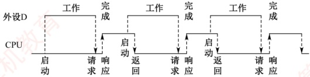

### 7.3.4 本节习题精选

#### 一、 单项选择题

##### 01

设置中断排队判优逻辑的目的是（）。

A. 产生中断源编码

B. 使同时提出的请求中的优先级别最高者得到及时响应

C. 使 CPU 能方便地转入中断服务子程序

D. 提高中断响应速度

##### 02

下列关于中断的说法中，错误的是（）。

A. 中断服务程序一般是操作系统模块

B. 中断向量方法可提高中断源的识别速度

C. 中断向量地址是中断服务程序的入口地址

D. 重叠处理中断的现象称为中断嵌套

##### 03

下列关于程序中断方式和 DMA 方式的叙述中，错误的是（）。

I. DMA 的优先级比程序中断的优先级要高

II. 程序中断方式需要保存现场，DMA 方式在传输过程中不需要保存现场

III. 程序中断方式的中断请求是为了报告 CPU 数据的传输结束，而 DMA 方式的中断请求完全是为了传送数据

A. 仅 II B. II、III C. 仅 III D. I、III

##### 04

下列关于程序中断方式和 DMA 方式的说法中，错误的是（）。

Ⅰ. 程序中断过程是由硬件和中断服务程序共同完成的

Ⅱ. 在每条指令的执行过程中，每个总线周期要检查一次有无中断请求

Ⅲ. 检测有无 DMA 请求，一般安排在一条指令执行过程的末尾

Ⅳ. 中断服务程序的最后指令是无条件转移指令

V. 中断响应判优是根据中断屏蔽字来确定中断的优先级

A. I、III、IV B. II、III、IV、V C. II、IV、V D. II、III、

##### 05

能产生 DMA 请求的总线部件是（）。

I. 高速外设  II. 需要与主机批量交换数据的外设
III. 具有 DMA 接口的设备

A. 仅 I          B. 仅 III       C. I、III      D. II、III

##### 06

在具有中断向量表的计算机中，中断向量地址是（）。

A. 子程序入口地址

B. 中断服务程序的入口地址

C. 中断服务程序入口地址的地址

D. 中断程序断点

##### 07

中断响应是在（）。

A. 一条指令执行开始

B. 一条指令执行中间

C. 一条指令执行之末

D. 一条指令执行的任何时刻

##### 08

在下列情况下，可能不发生中断请求的是（）。

A. DMA 操作结束

B. 一条指令执行完毕

C. 机器出现故障

D. 执行 “软中断” 指令

##### 09

某计算机有4级中断，优先级从高到低为1→2→3→4。若将优先级顺序修改，改后1级中断的屏蔽字为1101，2级中断的屏蔽字为0100，3级中断的屏蔽字为1111，4级中断的屏蔽字为0101，则修改后的优先顺序从高到低为（）。

A. 1→2→3→4 B. 3→1→4→2 C. 1→3→4→2 D. 2→1→3→4

##### 10

下列不属于程序控制指令的是（）。

A. 无条件转移指令

B. 有条件转移指令

C. 中断隐指令

D. 循环指令

##### 11

在中断响应周期中，CPU 主要完成的工作是（）。

A. 关中断，保存断点，发中断响应信号并形成向量地址

B. 开中断，保存断点，发中断响应信号并形成向量地址

C. 关中断，执行中断服务程序

D. 开中断，执行中断服务程序

##### 12

下列关于中断 I/O 方式的叙述中，错误的是（）。

A. CPU 对外部中断的响应不可能发生在一条指令的执行过程中

B. 在中断 I/O 方式下，外设接口中的寄存器和 CPU 中的寄存器直接交换数据

C. 中断请求的是 CPU 时间，要求 CPU 执行程序来处理发生的相关事件

D. 只要有中断请求发生，一条指令执行结束后 CPU 就进入中断响应周期

##### 13

当 CPU 响应中断时，进入 “中断响应周期”，采用硬件方法保存并更新程序计数器（PC）内容，而不是由软件完成的，主要是为了（）。

A. 能进入中断处理程序，并能正确返回源程序

B. 节省主存空间

C. 提高处理机速度

D. 易于编制中断处理程序

##### 14

在 I/O 接口中设置中断触发器保存外设发出的中断请求，是因为（）。

A. 中断不需要立即处理

B. 中断设备的处理速度比 CPU 快

C. CPU 无法对发生的中断请求立即进行处理

D. 可能有多个中断同时发生

##### 15

在中断响应周期中，由（）将允许中断触发器置0。

A. 关中断指令 B. 中断隐指令 C. 开中断指令 D. 中断服务程序
##### 16

CPU 响应中断时最先完成的步骤是（）。

A. 开中断 B. 保存断点 C. 关中断 D. 转入中断服务程序

##### 17

设置中断屏蔽标志可以改变（）。

A. 多个中断源的中断请求优先级

B. CPU 对多个中断请求响应的优先次序

C. 多个中断服务程序开始执行的顺序

D. 多个中断服务程序执行完的次序

##### 18

在 CPU 响应中断时，保存两个关键的硬件状态是（）。

A. PC 和 IR B. PC 和 PSW C. AR 和 IR D. AR 和 PSW

##### 19

在各种 I/O 方式中，中断方式的特点是（），DMA 方式的特点是（）。

A. CPU 与外设串行工作，传送与主程序串行工作

B. CPU 与外设并行工作，传送与主程序串行工作

C. CPU 与外设串行工作，传送与主程序并行工作

D. CPU 与外设并行工作，传送与主程序并行工作

##### 20

下列关于程序查询方式及其工作过程的叙述中，正确的是（）。

A. 按启动查询方式的不同，可分为软件查询方式和硬件查询方式

B. CPU 主要负责启动外设和查询其状态，不参与数据传送

C. 每完成一次数据传送后，会修改主存地址和计数值

D. CPU 需要一直查询外设的状态，直到外设准备就绪时才可去执

##### 21

在 DMA 传送方式中，由（）发出 DMA 请求，在传送期间总线控制权由（）掌握。

A. 外部设备、CPU

B. DMA 控制器、DMA 控制器

C. 外部设备、DMA 控制器

D. DMA 控制器、内存

##### 22

下列叙述中，（）是正确的。

A. 程序中断方式和 DMA 方式中实现数据传送都需要中断请求

B. 程序中断方式中有中断请求，DMA 方式中没有中断请求

C. 程序中断方式和 DMA 方式中都有中断请求，但目的不同

D. DMA 要等指令周期结束时才可以进行周期窃取

##### 23

以下关于 DMA 方式进行 I/O 的描述中，正确的是（）。

A. 一个完整的 DMA 过程，部分由 DMA 控制器控制，部分由 CPU 控制

B. 一个完整的 DMA 过程，完全由 CPU 控制

C. 一个完整的 DMA 过程，完全由 DMA 控制器控制，CPU 不介入任何控制

D. 一个完整的 DMA 过程，完全由 CPU 采用周期挪用法控制

##### 24

当某五级流水线 CPU 正在执行某条指令的第二级流水段时，外部设备产生了一个 DMA 请求，则 CPU 对该 DMA 请求响应的时机是（）。

A. 立即响应

B. 在该指令的第二级流水段执行完毕后响应

C. 在该指令的第三级流水段执行完毕后响应

D. 在该指令执行结束后响应

##### 25

关于外中断（故障除外）和 DMA，下列说法中正确的是（）。

A. DMA 请求和中断请求同时发生时，响应 DMA 请求

B. DMA 请求、非屏蔽中断、可屏蔽中断都要在当前指令结束之后才能被响应

C. 非屏蔽中断请求优先级最高，可屏蔽中断请求优先级最低

D. 若不开中断，所有中断请求就不能响应
##### 26

磁盘和主存进行数据交换时，大致可分为四个过程：① 寻道；② 旋转；③ 连续读/写磁盘块；④ 结束、校验。则下列关于磁盘读/写过程的叙述中，错误的是（）。

A. 在①②④三个阶段都用到了中断处理

B. 在第③阶段，DMA 控制器向 CPU 请求的是总线使用权

C. 在第③阶段，DMA 控制器使用总线的优先级比 CPU 低

D. 在第③阶段，磁盘的读/写和 CPU 执行其他任务是可以并行执行的

##### 27

中断发生时，程序计数器内容的保存和更新是由（）完成的。

A. 硬件自动

B. 进栈指令和转移指令

C. 访存指令

D. 中断服务程序

##### 28

在 DMA 方式传送数据的过程中，因为没有破坏（）的内容，所以 CPU 可以正常工作（访存除外）。

A. 程序计数器

B. 程序计数器和寄存器

C. 指令寄存器

D. 堆栈寄存器

##### 29

在 DMA 方式下，数据从内存传送到外设经过的路径是（）。

A. 内存→数据总线→数据通路→外设 B. 内存→数据总线→DMAC→外设

C. 内存→数据通路→数据总线→外设 D. 内存→CPU→外设

##### 30

采用周期挪用进行 DMA 数据传送时，每传送一个数据要占用一个（）的时间。

A. 指令周期 B. 中断周期 C. 时钟周期 D. 存储周期

##### 31

启动一次 DMA 传送，外设和主机之间将完成一个（）的数据传送。

A. 字节 B. 字 C. 总线宽度 D. 数据块

##### 32

在磁盘存储器进行读/写操作之前，CPU需要对磁盘控制器或 DMA 控制器进行初始化。在下列选项中，不包含在初始化信息中的是（）。

A. 传送信息所在的主存起始地址

B. 传送方向（是读磁盘还是写磁盘）

C. 传送信息所在的通用寄存器编号

D. 传送数据的字数或字节数

##### 33

【2009 统考真题】下列选项中，能引起外部中断的事件是（）。

A. 键盘输入 B. 除数为0 C. 浮点运算下溢 D. 访存缺页

##### 34

【2010 统考真题】单重中断系统中，中断服务程序内的执行顺序是（）。

I. 保存现场  II. 开中断  III. 关中断  IV. 保存断点  V. 中断事件处理  VI. 恢复现场  VII. 中断返回

A. I→V→VI→II→VII

B. III→I→V→VII

C. III→IV→V→VI→VII

D. IV→I→V→VI→VII

##### 35

【2011 统考真题】某计算机有五级中断  $L_4 \sim L_0$，中断屏蔽字为  $M_4M_3M_2M_1M_0$， $M_i = 1$（ $0 \leq i \leq 4$）表示对  $L_i$ 级中断进行屏蔽。若中断响应优先级从高到低的顺序是  $L_0 \rightarrow L_1 \rightarrow L_2 \rightarrow L_3 \rightarrow L_4$，且要求中断处理优先级从高到低的顺序为  $L_4 \rightarrow L_0 \rightarrow L_2 \rightarrow L_1 \rightarrow L_3$，则  $L_1$ 的中断处理程序中设置的中断屏蔽字是（ ）。

A. 11110

B. 01101

C. 00011

D. 01010

##### 36

【2011 统考真题】某计算机处理器主频为 50MHz，采用定时查询方式控制设备 A 的 I/O，查询程序运行一次所用的时钟周期数至少为 500。在设备 A 工作期间，为保证数据不丢失，每秒需对其查询至少 200 次，则 CPU 用于设备 A 的 I/O 的时间占整个 CPU 时间的百分比至少是（）。

A. 0.02% B. 0.05% C. 0.20% D. 0.50%
##### 37

【2012 统考真题】响应外部中断的过程中，中断隐指令完成的操作，除保存断点外，还包括（）。

Ⅰ. 关中断

Ⅱ. 保存通用寄存器的内容

Ⅲ. 形成中断服务程序入口地址并送 PC

A. 仅 I、II

B. 仅 I、III

C. 仅 II、III

D. I、II、III

##### 38

【2013 统考真题】下列关于中断 I/O 方式和 DMA 方式比较的叙述中，错误的是（）。

A. 中断 I/O 方式请求的是 CPU 处理时间，DMA 方式请求的是总线使用权

B. 中断响应发生在一条指令执行结束后，DMA 响应发生在一个总线事务完成后

C. 中断 I/O 方式下数据传送通过软件完成，DMA 方式下数据传送由硬件完成

D. 中断 I/O 方式适用于所有外部设备，DMA 方式仅适用于快速外部设备

##### 39

【2014 统考真题】若某设备中断请求的响应和处理时间为 100ns，每 400ns 发出一次中断请求，中断响应所允许的最长延迟时间为 50ns，则在该设备持续工作过程中，CPU 用于该设备的 I/O 时间占整个 CPU 时间的百分比至少是（）。

A. 12.5% B. 25% C. 37.5% D. 50%

##### 40

【2015 统考真题】在采用中断 I/O 方式控制打印输出的情况下，CPU 和打印控制接口中的 I/O 端口之间交换的信息不可能是（）。

A. 打印字符 B. 主存地址 C. 设备状态 D. 控制命令

##### 41

【2017 统考真题】下列关于多重中断系统的叙述中，错误的是（）。

A. 在一条指令执行结束时响应中断

B. 中断处理期间 CPU 处于关中断状态

C. 中断请求的产生与当前指令的执行无关

D. CPU 通过采样中断请求信号检测中断请求

##### 42

【2018 统考真题】下列关于外部 I/O 中断的叙述中，正确的是（）。

A. 中断控制器按所接收中断请求的先后次序进行中断优先级排队

B. CPU 响应中断时，通过执行中断隐指令完成通用寄存器的保存

C. CPU 只有在处于中断允许状态时，才能响应外部设备的中断请求

D. 有中断请求时，CPU 立即暂停当前指令执行，转去执行中断服务程序

##### 43

【2019 统考真题】某设备以中断方式与 CPU 进行数据交换，CPU 主频为 1GHz，设备接口中的数据缓冲寄存器为 32 位，设备的数据传输速率为 50kB/s。若每次中断开销（包括中断响应和中断处理）为 1000 个时钟周期，则 CPU 用于该设备输入/输出的时间占整个 CPU 时间的百分比最多是（）。

A. 1.25% B. 2.5% C. 5% D. 12.5%

##### 44

【2019 统考真题】下列关于 DMA 方式的叙述中，正确的是（）。

I. DMA 传送前由设备驱动程序设置传送参数

II. 数据传送前由 DMA 控制器请求总线使用权

III. 数据传送由 DMA 控制器直接控制总线完成

IV. DMA 传送结束后的处理由中断服务程序完成

A. 仅 I、II B. 仅 I、III、IV C. 仅 II、III、IV D. I、

##### 45

【2020 统考真题】下列事件中，属于外部中断事件的是（）。

Ⅰ. 访存时缺页 Ⅱ. 定时器到时 Ⅲ. 网络数据包到达

A. 仅 I、II B. 仅 I、III C. 仅 II、III D. I、II 和 III
##### 46

【2020 统考真题】外部中断包括不可屏蔽中断（NMI）和可屏蔽中断，下列关于外部中断的叙述中，错误的是（）。

A. CPU 处于关中断状态时，也能响应 NMI 请求

B. 一旦可屏蔽中断请求信号有效，CPU 就立即响应

C. 不可屏蔽中断的优先级比可屏蔽中断的优先级高

D. 可通过中断屏蔽字改变可屏蔽中断的处理优先级

##### 47

【2020 统考真题】若设备采用周期挪用 DMA 方式进行输入和输出，每次 DMA 传送的数据块大小为 512 字节，相应的 I/O 接口中有一个 32 位数据缓冲寄存器。对于数据输入过程，下列叙述中，错误的是（）。

A. 每准备好32位数据，DMA控制器就发出一次总线请求

B. 相对于CPU，DMA控制器的总线使用权的优先级更高

C. 在整个数据块的传送过程中，CPU不可以访问主存储器

D. 数据块传送结束时，会产生“DMA传送结束”中断请求

##### 48

【2021 统考真题】下列是关于多重中断系统中 CPU 响应中断的叙述，错误的是（）。

A. 仅在用户态（执行用户程序）下，CPU 才能检测和响应中断

B. CPU 只有在检测到中断请求信号后，才会进入中断响应周期

C. 进入中断响应周期时，CPU 一定处于中断允许（开中断）状态

D. 若 CPU 检测到中断请求信号，则一定存在未被屏蔽的中断源请求信号

##### 49

【2022 统考真题】下列关于中断 I/O 方式的叙述中，不正确的是（）。

A. 适用于键盘、针式打印机等字符型设备

B. 外设和主机之间的数据传送通过软件完成

C. 外设准备数据的时间应小于中断处理时间

D. 外设为某进程准备数据时 CPU 可运行其他进程

##### 50

【2023 统考真题】下列关于硬件和异常/中断关系的叙述中，错误的是（）。

A. CPU 在执行一条指令的过程中检测异常事件

B. CPU 在执行完一条指令时检测中断请求信号

C. 开中断时 CPU 检测到中断请求后就进行中断响应

D. 外部设备通过中断控制器向 CPU 发中断结束信号

##### 51

【2023 统考真题】下列关于 I/O 控制方式的叙述中，错误的是（）

A. 查询方式下，通过 CPU 执行查询程序进行 I/O 操作

B. 中断方式下，通过 CPU 执行中断服务程序进行 I/O 操作

C. DMA 方式下，通过 CPU 执行 DMA 传送程序进行 I/O 操作

D. 对于 SSD、网络适配器等高速设备，采用 DMA 方式输入/输出

##### 52

【2024 统考真题】下列关于中断 I/O 方式的叙述中，错误的是（）。

A. 中断屏蔽字用于确定中断响应的优先级

B. 保存断点和程序状态字在中断响应阶段完成

C. 保存通用寄存器和设置新中断屏蔽字由软件实现

D. 单重中断方式下中断处理时 CPU 处于关中断状态

##### 53

【2024 统考真题】DMA 控制 I/O 方式下，设备的输入/输出由 DMA 控制器控制完成，此时，DMA 控制器控制的数据传输通路位于（）。

A. CPU 和主存之间 B. CPU 和 DMA 控制器之间
C. 设备接口和主存之间 D. 设备接口和DMA控制器之间

##### 54

【2025 统考真题】下列设备中，适合采用 DMA 输入/输出方式的是（）。

I. 键盘

II. 网卡

III. 固态硬盘

IV. 针式打印机

A. 仅 I、II

B. 仅 II、III

C. 仅 II、IV

D. 仅 III、IV

##### 55

【2025 统考真题】下列选项中，会触发外部中断请求的事件是（）。

A. DMA 传送结束 B. 总线事务结束 C. 页故障处理结束 D. 执行断点指令

#### 二、 综合应用题

##### 01

在 DMA 方式下，主存和 I/O 设备之间有一条物理通路相连吗？

##### 02

假定某 I/O 设备向 CPU 传送信息的最高频率为 4 万次/秒，而相应中断处理程序的执行时间为 40μs，则该 I/O 设备是否可采用中断方式工作？为什么？

##### 03

在程序查询方式的输入/输出系统中，假设不考虑处理时间，每个查询操作需要 100 个时钟周期，CPU 的时钟频率为 50MHz。现有鼠标和硬盘两个设备，而且 CPU 必须每秒对鼠标进行 30 次查询，硬盘以 32 位字长为单位传输数据，即每 32 位被 CPU 查询一次，传输速率为  $2 \times 2^{20}$ B/s。求 CPU 对这两个设备查询所花费的时间比率，由此可得出什么结论？

##### 04

设某计算机有4个中断源1、2、3、4，其硬件排队优先次序按 $1\rightarrow2\rightarrow3\rightarrow4$降序排列，各中断源的服务程序中所对应的屏蔽字如下表所示。

| 中断源 | 屏蔽字 |   |   |   |
| --- | --- | --- | --- | --- |
| 1 | 2 | 3 | 4 |   |
| 1 | 1 | 1 | 0 | 1 |
| 2 | 0 | 1 | 0 | 0 |
| 3 | 1 | 1 | 1 | 1 |
| 4 | 0 | 1 | 0 | 1 |

1）给出上述4个中断源的中断处理次序。

2）若4个中断源同时有中断请求，画出CPU执行程序的轨迹。

##### 05

一个 DMA 接口可采用周期窃取方式把字符（字节）传送到存储器，它支持的最大批量为 400B。若存储周期为 0.2μs，每处理一次中断需 5μs，现有的字符设备的传输速率为 9600b/s。假设字符之间的传输是无间隙的，试问 DMA 方式每秒因数据传输占用处理器多少时间？若完全采用中断方式，又需占处理器多少时间（忽略预处理所需时间）？

##### 06

假设磁盘传输数据以 32 位的字为单位，传输速率为 1MB/s，CPU 的时钟频率为 50MHz。回答以下问题：

1）采取程序查询方式，假设查询操作需要100个时钟周期，求CPU为I/O查询所花费的时间比率（假设进行足够的查询以避免数据丢失）。

2）采用中断方式进行控制，每次传输的开销（包括中断处理）为80个时钟周期。求CPU为传输硬盘所花费的时间比率。

3）采用 DMA 的方式，假定 DMA 的启动需要 1000 个时钟周期，DMA 完成时后处理需要 500 个时钟周期。若平均传输的数据长度为 4KB（此处 K = 1000），试问硬盘工作时 CPU 将用多少时间比率进行输入/输出操作？忽略 DMA 申请总线的影响。

##### 07

【2009 统考真题】某计算机的 CPU 主频为 500MHz，CPI 为 5（执行每条指令平均需 5 个时钟周期）。假定某外设的数据传输速率为 0.5MB/s，采用中断方式与主机进行数据传送，以 32 位为传输单位，对应的中断服务程序包含 18 条指令，中断服务的其他开销相当于
2 条指令的执行时间。回答下列问题，要求给出计算过程。

1）在中断方式下，CPU用于该外设I/O的时间占整个CPU时间的百分比是多少？

2）当该外设的数据传输速率达到5MB/s时，改用DMA方式传送数据。假定每次DMA传送块大小为5000B，且DMA预处理和后处理的总开销为500个时钟周期，则CPU用于该外设I/O的时间占整个CPU时间的百分比是多少（假设DMA与CPU之间没有访存冲突）？

##### 08

【2012 统考真题】假定某计算机的 CPU 主频为 80MHz，CPI 为 4，平均每条指令访存 1.5 次，主存与 Cache 之间交换的块大小为 16B，Cache 的命中率为 99%，存储器总线宽带为 32 位。回答下列问题。

1）该计算机的 MIPS 数是多少？平均每秒 Cache 缺失的次数是多少？在不考虑 DMA 传送的情况下，主存带宽至少达到多少才能满足 CPU 的访存要求？

2）假定在 Cache 缺失的情况下访问主存时，存在 0.0005% 的缺页率，则 CPU 平均每秒产生多少次缺页异常？若页面大小为 4KB，每次缺页都需要访问磁盘，访问磁盘时 DMA 传送采用周期挪用方式，磁盘 I/O 接口的数据缓冲寄存器为 32 位，则磁盘 I/O 接口平均每秒发出的 DMA 请求次数至少是多少？

3）CPU 和 DMA 控制器同时要求使用存储器总线时，哪个优先级更高？为什么？

4）为了提高性能，主存采用4体低位交叉存储模式，工作时每1/4个存储周期启动一个体。若每个体的存储周期为50ns，则该主存能提供的最大带宽是多少？

##### 09

【2016 统考真题】假定 CPU 主频为 50MHz，CPI 为 4。设备 D 采用异步串行通信方式向主机传送 7 位 ASCII 码字符，通信规程中有 1 位奇校验位和 1 位停止位，从 D 接收启动命令到字符送入 I/O 端口需要 0.5ms。回答下列问题，要求说明理由。

1）每传送一个字符，在异步串行通信线上共需传输多少位？在设备D持续工作过程中，每秒最多可向I/O端口送入多少个字符？

2）设备D采用中断方式进行输入/输出，示意图如下所示：

I/O 端口每收到一个字符串请一次中断，中断响应需 10 个时钟周期，中断服务程序共有 20 条指令，其中第 15 条指令启动 D 工作。若 CPU 需从 D 读取 1000 个字符，则完成这一任务所需时间大约是多少个时钟周期？CPU 用于完成这一任务的时间大约是多少个时钟周期？在中断响应阶段 CPU 进行了哪些操作？

##### 10

【2018 统考真题】假定计算机的主频为 500MHz，CPI 为 4。现有设备 A 和 B，其数据传输速率分别为 2MB/s 和 40MB/s，对应 I/O 接口中各有一个 32 位数据缓冲寄存器。回答下列问题，要求给出计算过程。

1）若设备 A 采用定时查询 I/O 方式，每次输入/输出都至少执行 10 条指令。设备 A 最多间隔多长时间查询一次才能不丢失数据？CPU 用于设备 A 输入/输出的时间占 CPU 总时间的百分比至少是多少？

2）在中断 I/O 方式下，若每次中断响应和中断处理的总时钟周期数至少为 400，则设备 B 能否采用中断 I/O 方式？为什么？
3）若设备 B 采用 DMA 方式，每次 DMA 传送的数据块大小为 1000B，CPU 用于 DMA 预处理和后处理的总时钟周期数为 500，则 CPU 用于设备 B 输入/输出的时间占 CPU 总时间的百分比最多是多少？

##### 11

【2022 统考真题】假设某磁盘驱动器中有 4 个双面盘片，每个盘面有 20000 个磁道，每个磁道有 500 个扇区，每个扇区可记录 512 字节的数据，盘片转速为 7200rpm（转/分），平均寻道时间为 5ms。请回答下列问题。

1）每个扇区包含数据及其地址信息，地址信息分为3个字段。这3个字段的名称各是什么？对于该磁盘，各字段至少占多少位？

2）一个扇区的平均访问时间约为多少？

3）若采用周期挪用 DMA 方式进行磁盘与主机之间的数据传送，磁盘控制器中的数据缓冲区大小为 64 位，则在一个扇区的读/写过程中，DMA 控制器向 CPU 发送了多少次总线请求？若 CPU 检测到 DMA 控制器的总线请求信号时也需要访问主存，则 DMA 控制器是否可以获得总线使用权？为什么？

### 7.3.5 答案与解析

#### 一、 单项选择题

##### 01

B

当有多个中断请求同时出现时，中断服务程序必须能从中选出当前最需要给予响应的且最重要的中断请求，这就需要预先对所有的中断进行优先级排队，这个工作可由中断判优逻辑来完成，排队的规则可由软件通过对中断屏蔽寄存器进行设置来确定。

##### 02

C

中断服务程序是处理器处理的紧急事件，可理解为一种服务，是事先编好的某些特定的程序，一般属于操作系统的模块，以供调用执行，选项A正确。中断向量由向量地址形成部件，即由硬件产生，且不同的中断源对应不同的中断服务程序，因此通过该方法可以较快速地识别中断源，选项B正确。中断向量是中断服务程序的入口地址，中断向量地址是内存中存放中断向量的地址，即中断服务程序入口地址的地址，选项C错误。重叠处理中断的现象称为中断嵌套，选项D正确。

##### 03

C

当 CPU 与 DMA 控制器同时访问主存时，DMA 请求通常具有更高的优先级，以确保高速外设数据及时传输，避免丢失；因此，在总线仲裁层面，DMA 的优先级高于普通中断请求，说法 I 正确。程序中断方式需要切换 CPU 执行流程，必须保存和恢复现场；而 DMA 由专用硬件直接完成数据传送，不经过 CPU，不使用其寄存器，因此无须保存现场——正如唐朝飞所编教材《计算机组成原理》中所述：“DMA 方式无须保存现场”，说法 II 正确。说法 III 的情形正好相反。

**注意**

DMA 方式对应的中断服务程序确实无须保存现场，因其不涉及 CPU 寄存器的使用。

##### 04

B

程序中断过程是由硬件（称为中断隐指令）和中断服务程序共同完成的，说法Ⅰ正确。在每条指令执行结束时（而不是执行过程中），CPU统一扫描各个中断源，检查有无中断请求，说法Ⅱ错误。CPU会在每个存储周期（总线周期）结束后检查是否有DMA请求，而不是在一条指令执行过程的末尾，说法Ⅲ错误。中断服务程序的最后指令通常是中断返回指令，与无条件转移指令不同的是，它不仅要修改PC值，而且要将CPU中的所有寄存器都恢复到中断前的状态，说法Ⅳ错误。
误。在中断响应阶段之前，CPU 根据中断屏蔽字将所有未被屏蔽的中断请求送到硬件电路（或中断查询程序）进行中断响应判优，中断响应的优先级不是由中断屏蔽字决定的，说法 V 错误。

##### 05

B

只有具有 DMA 接口的设备才能产生 DMA 请求，即使当前设备是高速设备或需要与主机批量交换数据，若没有 DMA 接口的话，也不能产生 DMA 请求。

##### 06

C

中断向量地址是中断向量表的地址，因为中断向量表保存着中断服务程序的入口地址，所以中断向量地址是中断服务程序入口地址的地址。

##### 07

C

CPU 响应中断必须满足下列 3 个条件：① CPU 接收到中断请求信号。首先中断源要发出中断请求，同时 CPU 还要收到这个中断请求信号。② CPU 允许中断，即开中断。③ 一条指令执行完毕。因此中断响应是在指令执行末尾，选项 C 正确。

##### 08

B

##### 09

B

DMA 操作结束、机器出现故障、执行 “软中断” 指令时都会产生中断请求。一条指令执行完毕可能响应中断请求，但它本身不会引起中断请求。

屏蔽字 “1” 表示不可被中断，“0” 表示可被中断。由 3 级中断的屏蔽字可知，它屏蔽所有中断，优先级最高；再由 1 级中断的屏蔽字可知，它屏蔽除 3 外的所有中断，优先级次之；以此类推，可知选择选项 B。

【另解】“1”越多表示优先级越高，因此屏蔽其他中断源就越多。

##### 10

C

中断隐指令并不是一条由程序员安排的真正的指令，因此不可能把它预先编入程序中，只能在响应中断时由硬件直接执行。中断隐指令不在指令系统中，因此不属于程序控制指令。

##### 11

A

在中断响应周期，CPU 主要完成关中断、保存断点、发中断响应信号并形成中断向量地址的工作，即执行中断隐指令。

##### 12

D

CPU 总是在一条指令结束时检查外中断请求，因此对外中断的响应只可能发生在一条指令结束时。中断 I/O 方式下，CPU 执行中断服务程序时会执行相应的 I/O 指令，实现 CPU 的通用寄存器和外设接口中的寄存器之间的直接数据交换。中断请求就是要求 CPU 执行程序来处理发生的相关事件。选项 D 在下列两种情况下错误：① 关中断时，CPU 检测不到中断请求，因此不会进入中断响应周期；② 当有中断请求的请求源被中断屏蔽字屏蔽时，也不会进入中断响应周期。

##### 13

A

在中断响应周期中，采用硬件方法保存并更新 PC 内容，而不由软件完成，这样可以避免因为软件保存和恢复 PC 内容而造成的时间开销和错误风险，提高中断处理的效率和正确性。

##### 14

C

因为 CPU 无法对发生的中断请求立即进行处理，因此需要在 I/O 接口中设置中断触发器，以保存是哪些外设发出了中断请求，等 CPU 当前的指令周期结束后，响应中断并进行处理。

##### 15

B

允许中断触发器置0表示关中断，在中断响应周期由硬件自动完成，即中断隐指令完成。虽然关中断指令也能实现关中断的功能，但在中断响应周期，关中断是由中断隐指令完成的。在恢复现场和屏蔽字的时候，也需要关中断的操作，此时是由关中断指令来完成的。
##### 16

C

只有先关中断，才可以保存断点。若先不保存断点，则可能丢失当前程序的断点。同理，在恢复现场前也要关中断。这个过程和操作系统中的信号量 PV 操作类似，都是将内部过程变为不可打断的原子操作。

##### 17

D

中断优先级包括响应优先级和处理优先级，中断屏蔽标志改变的是处理优先级。中断响应优先级是由中断查询程序或中断判优电路决定的，它反映的是多个中断同时请求时哪个先被响应，即中断服务程序开始执行的顺序。在多重中断系统中，中断处理优先级决定了本中断是否能打断正在执行的中断服务程序，决定了多个中断服务程序执行完的次序。

##### 18

B

PC 的内容是被中断程序尚未执行的第一条指令地址，PSW 寄存器保存各种状态信息。CPU 响应中断后，需要保存中断的 CPU 现场，将 PC 和 PSW 压入堆栈，这样等到中断结束后，就可以将压入堆栈的原 PC 和 PSW 的内容恢复到相应的寄存器，原程序从断点开始继续执行。

##### 19

B、D

在程序查询方式中，CPU 与外设串行工作，传送与主程序串行工作。在中断方式中，CPU 与外设并行工作，当数据准备好时仍需中断主程序以执行数据传送，因此传送与主程序仍是串行的。在 DMA 方式中，CPU 与外设、传送与主程序都是并行的。

##### 20

C

按启动查询方式的不同，程序查询方式可分为定时查询方式和独占查询方式。在程序查询方式中，由CPU负责数据的传送。每完成一次数据传送后，将主存地址加1，计数值减1。

##### 21

C

在 DMA 方式中，由外部设备向 DMA 控制器发出 DMA 请求信号，然后由 DMA 控制器向 CPU 发出总线请求信号。DMA 控制器在传送期间有总线控制权，此时 CPU 不能响应 I/O 中断。

##### 22

C

程序中断方式在数据传输时，首先要发出中断请求，此时 CPU 中断正在进行的操作，转而进行数据传输，直到数据传送结束，CPU 才返回中断前执行的操作。DMA 方式只是在后处理阶段需要用中断方式请求 CPU 做结束处理，但在整个数据传送过程，并不需要中断请求，选项 A 错误。DMA 方式和程序中断方式都有中断请求，但目的不同，程序中断方式的中断请求是为了进行数据传送，而 DMA 方式的中断请求是在 DMA 传送结束后请求 CPU 做 DMA 结束处理，选项 B 错误、选项 C 正确。CPU 对 DMA 的响应可在指令执行过程中的任何两个存储周期之间，选项 D 错误。

##### 23

A

一个完整的 DMA 过程主要由 DMA 控制器控制，但也需要 CPU 参与控制，只是 CPU 干预比较少，只需在数据传输开始和结束时干预，从而提高了 CPU 的效率。

##### 24

B

DMA 请求的是总线的使用权，因此 CPU 对 DMA 请求的响应时机是一个总线周期结束时。在流水线 CPU 中，流水段的长度以最复杂的操作所花的时间为准，总线周期（访存时间）通常是耗时最长的，因此通常可认为总线周期、存储周期和流水段长度是等价的。

##### 25

A

DMA 连接的是高速设备，其优先级高于中断请求，以防止高速设备数据丢失，选项 A 正确。DMA 请求的响应时间可以发生在每个总线周期结束时，只要 CPU 不占用总线；中断请求的响应时间只能发生在每条指令执行完毕，选项 B 错误。DMA 的优先级要比外中断（非屏蔽中断、可屏蔽中断）高，选项 C 错误。若不开中断，则内中断和非屏蔽中断仍可响应，选项 D 错误。
##### 26

C

寻道结束后会通过中断方式通知 CPU 寻道已结束，可进行下一步操作。通过旋转定位到某个扇区后，也会通过中断方式来通知 CPU 磁盘已准备好，可进行数据读取或写入操作。DMA 传输结束后的校验是由中断服务程序完成的。综上所述， $^{①}$ $^{②}$ $^{④}$都用到了中断处理，选项 A 正确。DMA 控制器中数据缓冲寄存器的个数是有限的，为避免后续到来的数据覆盖掉原有的数据，必须保证已到的数据能被及时送到主存，因此 DMA 控制器使用总线的优先级比 CPU 高，选项 B 正确，选项 C 错误。DMA 的数据传输过程是完全由 DMA 控制器控制的，可以和 CPU 完全并行，选项 D 正确。

##### 27

A

中断发生时，程序计数器内容的保存和更新是由硬件自动完成的，即由中断隐指令完成。

##### 28

B

DMA 传送数据时，挪用周期不会改变 CPU 现场，因此无须占用 CPU 的 PC 和寄存器。

##### 29

B

DMA 方式的数据传送不经过 CPU，但需要经过 DMA 控制器中的数据缓冲寄存器。输入时，数据由外设（如磁盘）先送往 DMA 的数据缓冲寄存器，再通过数据总线送到主存。反之，输出时，数据由主存通过数据总线送到 DMA 的数据缓冲寄存器，然后送到外设。

##### 30

D

当采用周期挪用进行 DMA 数据传送时，每当 CPU 收到 DMA 控制器的总线申请，就将下一个总线周期的总线控制权交给 DMA 控制器。DMA 控制器利用这个总线周期完成一个数据字的传送后，立即将总线控制权交回给 CPU，因此这里的总线周期也等于存储周期的长度。

##### 31

D

DMA 方式主要用于磁盘等高速设备的成批数据传送，这类高速设备的记录方式多采用数据块组织方式，因此每启动一次 DMA 传送，外设和主机之间就完成一个数据块的数据传送。

##### 32

C

传送信息所在的通用寄存器编号不包含在初始化信息中，因为数据不是通过 CPU 中的通用寄存器来传输的，而是直接通过 DMA 控制器进行数据传输的。

##### 33

A

外部中断是指 CPU 执行指令以外的事件产生的中断，通常指来自 CPU 与内存以外的中断。选项 A 中键盘输入属于外部事件，每次键盘输入 CPU 都需要执行中断以读入输入数据，所以能引起外部中断。选项 B 中除数为 0 属于异常，也就是内中断，发生在 CPU 内部。选项 C 中浮点运算下溢将按机器零处理，不会产生中断。而选项 D 中访存缺页属于 CPU 执行指令时产生的中断，也不属于外部中断。所以能产生外部中断的只能是输入设备键盘。

##### 34

A

在单级（或单重）中断系统中不允许中断嵌套。中断处理过程为：①关中断；②保存断点；③识别中断源；④保存现场；⑤中断事件处理；⑥恢复现场；⑦开中断；⑧中断返回。其中 $^{①}$～ $^{③}$由硬件完成， $^{④}$～ $^{⑧}$由中断服务程序完成。

##### 35

D

中断响应优先级是由硬件线路（或查询程序）决定的，不便改动，而中断处理优先级可以利用屏蔽字技术来动态调整。1 表示屏蔽该中断源的请求，0 表示可以被该中断源中断。从中断处理优先级来看， $L_{1}$ 只能屏蔽  $L_{3}$ 和其自身，因此中断屏蔽字  $M_{4}M_{3}M_{2}M_{1}M_{0} = 01010$。

##### 36

C

每秒至少查询 200 次，每次查询至少 500 个时钟周期，则每秒最少占用  $200 \times 500 = 100000$ 个时钟周期，因此占 CPU 时间的百分比为  $100000 / 50M = 0.20\%$。
##### 37

B

在响应外部中断的过程中，中断隐指令完成的操作包括：①关中断；②保存断点；③引出中断服务程序（形成中断服务程序入口地址并送PC），所以只有说法I、III正确。说法Ⅱ中保存通用寄存器的内容是在进入中断服务程序后首先进行的操作。

##### 38

D

中断 I/O 方式：在 I/O 设备输入每个数据的过程中，由于无须 CPU 干预，因此可使 CPU 与 I/O 设备并行工作。仅当输完一个数据时，才需要 CPU 花费极短的时间去做一些中断处理。因此中断申请使用的是 CPU 处理时间，发生的时间是在一条指令执行结束之后，数据在软件的控制下完成传送。而 DMA 方式与之不同。DMA 方式：数据传输的基本单位是数据块，即在 CPU 与 I/O 设备之间，每次传送至少一个数据块；DMA 方式每次申请的是总线的使用权，所传送的数据是从设备直接送入内存的，或者相反；仅在传送一个或多个数据块的开始和结束时，才需要 CPU 干预，整块数据的传送是在控制器的控制下完成的。中断 I/O 方式不适合高速外设；多路型 DMA 控制器也适合同时为多个慢速外设服务，选项 D 错误。

##### 39

B

每 400ns 发出一次中断请求，而响应和处理时间为 100ns，其中允许的延迟为干扰信息，因为在 50ns 内，无论怎么延迟，每 400ns 仍要花费 100ns 处理中断，所以该设备的 I/O 时间占整个 CPU 时间的百分比为 100ns/400ns = 25%。

##### 40

B

在程序中断 I/O 方式中，CPU 和打印机直接交换，打印字符直接传输到打印机的 I/O 端口，不会涉及主存地址。而 CPU 和打印机通过 I/O 端口中的状态口和控制口来实现交互。

##### 41

B

多重中断在保存被中断进程现场时关中断，执行中断处理程序时开中断，选项B错误。CPU一般在一条指令执行结束的阶段采样中断请求信号，查看是否存在中断请求，然后决定是否响应中断，选项A、D正确。中断是指来自CPU执行指令以外的事件，选项C正确。

##### 42

C

中断优先级分为响应优先级和处理优先级，响应优先级由硬件排队器（或中断查询程序）决定，处理优先级由屏蔽字决定，而非请求的先后次序决定。中断隐指令完成的工作有：①关中断；②保存断点；③引出中断服务程序，通用寄存器的保存由中断服务程序完成。中断允许状态（开中断后），才能响应外部设备的中断请求，外部设备通常不能发出不可屏蔽中断，外部设备的中断请求通常是为了输入/输出，这些事件并不是系统级的紧急事件，可以被屏蔽或延迟处理，若允许外部设备发出不可屏蔽中断，则可能影响系统的稳定性和安全性。有中断请求时，若是关中断的状态，或新中断请求的优先级较低，则不能响应新的中断请求。

##### 43

A

设备接口中的数据缓冲寄存器为 32 位，即一次中断可以传输 4B 数据，设备数据传输速率为 50kB/s，共需要 12.5k 次中断，每次中断开销为 1000 个时钟周期，CPU 主频为 1GHz，则 CPU 用于该设备输入/输出的时间占整个 CPU 时间的百分比最多是  $(12.5k \times 1000) \div 1G = 1.25\%$。

##### 44

D

每类设备都配置一个设备驱动程序，设备驱动程序向上层用户程序提供一组标准接口，负责实现对设备发出各种具体操作指令，用户程序不能直接和DMA打交道。DMA的数据传送过程分为预处理、数据传送和后处理3个阶段。预处理阶段由CPU完成必要的准备工作，数据传送前由DMA控制器请求总线使用权；数据传送由DMA控制器直接控制总线完成；传送结束后，DMA控制器向CPU发送中断请求，CPU执行中断服务程序做DMA结束处理。
##### 45

C

访存时缺页属于内部异常，说法 I 错误；定时器到时描述的是时钟中断，属于外部中断，说法 II 正确；网络数据包到达描述的是 CPU 执行指令以外的事件，属于外部中断，说法 III 正确。

##### 46

B

由 CPU 内部产生的异常称为内中断，内中断是不可屏蔽中断。通过中断请求线 INTR 和 NMI，从 CPU 外部发出的中断请求称为外中断，通过 INTR 信号线发出的外中断是可屏蔽中断，而通过 NMI 信号线发出的是不可屏蔽中断。不可屏蔽中断即使在关中断（IF = 0）情况下也被响应，选项 A 正确。不可屏蔽中断的优先级最高，任何时候只要发生不可屏蔽中断，都要中止现行程序的执行，转到不可屏蔽中断处理程序执行，选项 C 正确。CPU 响应中断需要满足 3 个条件：① 中断源有中断请求；② CPU 允许中断及开中断；③ 一条指令执行完毕，且没有更紧迫的任务。选项 B 错误。

##### 47

C

周期挪用法由 DMA 控制器挪用一个或几个主存周期来访问主存，传送完一个数据字后立即释放总线，是一种单字传送方式，每个字传送完后 CPU 可以访问主存，选项 C 错误。停止 CPU 访存法则是指在整个数据块的传送过程中，使 CPU 脱离总线，停止访问主存。

##### 48

A

中断服务程序在内核态下执行，若只能在用户态下检测和响应中断，则显然无法实现多重中断（中断嵌套），选项A错误。在多重中断中，CPU只有在检测到中断请求信号后（中断处理优先级更低的中断请求信号是检测不到的），才会进入中断响应周期。进入中断响应周期时，说明此时CPU一定处于中断允许状态，否则无法响应该中断。若所有中断源都被屏蔽（说明该中断的处理优先级最高），则CPU不会检测到任何中断请求信号。

##### 49

C

中断 I/O 方式适用于字符型设备，此类设备的特点是数据传输速率慢，以字符或字为单位进行传输，选项 A 正确。若采用中断 I/O 方式，当外设准备好数据后，向 CPU 发出中断请求，CPU 暂时中止现行程序，转去运行中断服务程序，由中断服务程序完成数据传送，选项 B 正确。若外设准备数据的时间小于中断处理时间，则可能导致数据丢失，以输入设备为例，设备为进程准备的数据会先写入设备控制器的缓冲区（缓冲区大小有限），缓冲区每写满一次，就向 CPU 发出一次中断请求，CPU 响应并处理中断的过程，就是将缓冲区中的数据“取走”的过程，因此若外设准备数据的时间小于中断处理时间，则可能导致外设往缓冲区写入数据的速度快于 CPU 从缓冲区取走数据的速度，从而导致缓冲区的数据被覆盖，进而导致数据丢失，选项 C 错误。若采用中断 I/O 方式，则外设为某进程准备数据时，可令该进程阻塞，CPU 运行其他进程，选项 D 正确。

##### 50

D

选项 A 和 B 显然正确。开中断时，CPU 在执行完一条指令时检测中断请求信号，若检测到中断请求信号，就立即响应；即便是多重中断，CPU 正在处理某个中断的过程中，因为中断屏蔽字的存在，所以 CPU 检测不到处理优先级更低的中断请求信号，若检测到中断请求信号，则说明其处理优先级更高，同样也立即响应，选项 C 正确。外设通过中断控制器向 CPU 发中断请求信号，CPU 响应中断请求后开始执行中断服务程序，中断服务程序执行结束后 CPU 自行返回（中断服务程序的最后一条指令是返回指令），无须外设发中断结束信号，选项 D 错误。

##### 51

C

DMA 在预处理和后处理阶段需要 CPU 来处理，而数据传输阶段由 DMA 控制器完成。

##### 52

A

中断优先级包括响应优先级和处理优先级。响应优先级由硬件线路或查询程序的查询顺序确
定，不可动态改变；处理优先级由中断屏蔽字确定，可灵活改变。

##### 53

C

DMA 的传送过程：① 预处理：CPU 完成一些必要的准备工作，由 DMA 控制器向 CPU 发总线请求。② 数据传送：DMA 控制器接管总线后，在设备接口和主存之间进行数据传送，此阶段由 DMA 控制器控制。③ 后处理：传送结束后，DMA 控制器向 CPU 发送中断信号，做结束处理。

##### 54

B

DMA（直接内存访问）适用于高速、大块数据传输的设备，因其可在不占用 CPU 的情况下直接与内存交换数据。网卡和固态硬盘均属于高带宽的块设备，适合采用 DMA 方式。而键盘和针式打印机是典型的低速字符设备，采用中断或程序查询方式通常更高效。

##### 55

A

外部中断由 CPU 外部事件触发。DMA 控制器完成数据传输后，会向 CPU 发出中断请求，这是由外部设备发起的硬件中断，属于典型的外部中断。而页故障（缺页异常）和执行断点指令均在指令执行过程中由 CPU 内部检测并触发，属于内部中断（异常）。总线事务（如一次读/写操作）的完成通常是 CPU 或主控设备主动发起并等待的结果，一般不会产生中断。

#### 二、 综合应用题

##### 01

【解答】

没有。通常所说的 DMA 方式在主存和 I/O 设备之间建立一条 “直接的数据通路”，使得数据在主存和 I/O 设备之间直接进行传送，其含义并不是在主存和 I/O 之间建立一条物理直接通路，而是主存和 I/O 设备通过 I/O 设备接口、系统总线及总线桥接部件等相连，建立一个信息可以相互通达的通路，这在逻辑上可视为直接相连的。其 “直接” 是相对于要通过 CPU 才能和主存相连这种方式而言的。

##### 02

【解答】

I/O 设备传送一个数据的时间为  $1 \div (4 \times 10^4)$s = 25μs，所以请求中断的周期为 25μs，而相应中断处理程序的执行时间为 40μs，大于请求中断的周期，会丢失数据（单位时间内 I/O 请求数量比中断处理的多，自然会丢失数据），所以不能采用中断方式。

##### 03

【解答】

1）CPU 每秒对鼠标进行 30 次查询，所需的时钟周期数为  $100 \times 30 = 3000$。CPU 的时钟频率为  $50 MHz$，即每秒  $50 \times 10^6$ 个时钟周期，因此对鼠标的查询占用 CPU 的时间比率为

 $$[3000{\div}(50{\times}10^{6}){\times}100\%=0.006\%$$

可见，对鼠标的查询基本不影响 CPU 的性能。

2）对于硬盘，每 32 位（4B）被 CPU 查询一次，因此每秒查询次数为  $2 \times 2^{20} \mathrm{~B} \div 4\mathrm{B} = 512\mathrm{K}$；则每秒查询的时钟周期数为

 $$100\times512\times1024=52.4\times10^{6}$$

因此对硬盘的查询占用 CPU 的时间比率为

 $$[52.4{\times}10^{6}{\div}(50{\times}10^{6}){\times}100\%=105\%$$

可见，即使 CPU 将全部时间都用于对硬盘的查询，也不能满足磁盘传输的要求，因此 CPU 一般不采用程序查询方式与磁盘交换信息。

##### 04

【解答】

1）中断屏蔽字“1”表示不可被中断，“0”表示可被中断。根据表中“1”的个数的降序排列可知，4个中断源的处理次序是3→1→4→2。

2）当4个中断源同时有中断请求时，硬件排队的优先次序是 $1\rightarrow2\rightarrow3\rightarrow4$，因此CPU先响应
1 的请求，执行 1 的服务程序。该程序中设置了屏蔽字 1101，因此开中断指令后转去执行 3 服务程序，且 3 服务程序执行结束后又回到了 1 服务程序。1 服务程序结束后，CPU 还有 2、4 两个中断源请求未响应。2 的响应优先级高于 4，因此 CPU 先响应 2 的请求，执行 2 服务程序。在 2 服务程序中因为设置了屏蔽字 0100，意味着 1、3、4 可中断 2 服务程序。而 1、3 的请求已经结束，因此在开中断指令后转去执行 4 服务程序，4 服务程序执行结束后又回到 2 服务程序的断点处，继续执行 2 服务程序，直至该程序执行结束。CPU 执行程序的轨迹如下图所示。

| 序号 | 程序序号 |
| --- | --- |
| 1 | 1 |
| 2 | 2 |
| 3 | 3 |
| 4 | 4 |

##### 05

【解答】

根据字符设备的传输速率为9600b/s，得每秒能传输

 $$9600/8=1200B，即 1200 个字符（ 本题中字符、字节不加以区分 ）$$

1）若采用 DMA 方式，传输 1200 个字符共需 1200 个存储周期，考虑到每传 400 个字符需中断处理一次，因此 DMA 方式每秒因数据传输占用处理器的时间是

 $$5\mu\mathrm{s}\times(1200/400)=15\mu\mathrm{s}$$

2）若采用中断方式，每秒因数据传输占用处理器的时间是

 $$5\mu\mathrm{s}\times1200=6000\mu\mathrm{s}$$

##### 06

【解答】

1）采用程序查询方式，硬盘传输速率为 1MB/s，一个字为 32bit = 4B，每秒查询的次数为 1MB/4B =  $2.5 \times 10^5$，每秒查询所需的总时钟周期数为  $2.5 \times 10^5 \times 100 = 2.5 \times 10^7$。

CPU 的时钟频率为 50MHz。

因此，I/O 查询所花费的时间比率为  $2.5 \times 10^7 \div 50M = 2.5 \times 10^7 \div (5 \times 10^7) = 50\%$。

2）采用中断方式时，每传输一个字便进行一次中断处理。每秒产生的中断次数为  $1\text{MB}/4\text{B} = 2.5 \times 10^5$ 次。每秒用于传输的开销为  $2.5 \times 10^5 \times 80 = 2 \times 10^7$ 个时钟周期。因此花费的时间比率为  $(2 \times 10^7) \div (5 \times 10^7) = 40\%$。

3）采用 DMA 方式时，CPU 所花时间仅为启动时间和后处理时间。

每传输一次数据 CPU 所花的时间为  $1000 + 500 = 1500$ 个时钟周期。

DMA 平均传送长度为 4000B，每秒产生的 DMA 次数为  $1MB/s \div (4 \times 10^3B) = 250$。

因此，CPU 为 DMA 所花费时间的比率为  $(1500 \times 250) \div 50M = 0.75\%$。

##### 07

【解答】

1）按题意，外设每秒传送 0.5MB，中断时每次传送 32bit = 4B。由于 CPI 为 5，在中断方式下，CPU 每次用于数据传送的时钟周期为  $5 \times 18 + 5 \times 2 = 100$（中断服务程序 + 其他开销）。为达到外设 0.5MB/s 的数据传输速率，外设每秒申请的中断次数为 0.5MB/4B = 125000。1 秒内用于中断的开销为  $100 \times 125000 = 12500000 = 12.5$M 个时钟周期。CPU 用于外设 I/O 的时间占整个 CPU 时间的百分比为  $12.5$M/500M = 2.5%。

2）当外设数据传输速率提高到5MB/s时改用DMA方式传送，每次DMA传送一个数据块，
大小为 5000B，则1秒内需产生的DMA次数为5MB/5000B=1000。

CPU 用于 DMA 处理的总开销为  $1000 \times 500 = 500000 = 0.5M$ 个时钟周期。

CPU 用于外设 I/O 的时间占整个 CPU 时间的百分比为  $0.5M/500M = 0.1\%$。

##### 08

【解答】

本题涉及多个考点：计算机的性能指标、存储器的性能指标、DMA的性能分析、DMA方式的特点及多体交叉存储器的性能分析。

1）平均每秒 CPU 执行的指令数为 80M/4 = 20M，因此 MIPS 数为 20。平均每条指令访存 1.5 次，因此平均每秒 Cache 缺失的次数 = 20M × 1.5 × (1 - 99%) = 300K。当 Cache 缺失时，CPU 访问主存，主存与 Cache 之间以块为传送单位，此时主存带宽为 16B × 300k/s = 4.8MB/s。在不考虑 DMA 传送的情况下，主存带宽至少达到 4.8MB/s 才能满足 CPU 的访存要求。

2）题中假定在 Cache 缺失的情况下访问主存，平均每秒产生缺页中断  $300000 \times 0.0005\% = 1.5$ 次。因为存储器总线宽度为 32 位，所以每传送 32 位数据，磁盘控制器发出一次 DMA 请求，因此平均每秒磁盘 DMA 请求的次数至少为  $1.5 \times 4 \, \text{KB/4B} = 1.5 \, \text{K} = 1536$。

3）CPU 和 DMA 控制器同时要求使用存储器总线时，DMA 请求的优先级更高。因为，若 DMA 请求得不到及时响应，I/O 传输数据可能丢失。

4）4体交叉存储模式能提供的最大带宽为 $4\times4B/50ns=320MB/s$。

##### 09

【解答】

1）每传送一个 ASCII 码字符，需要传输的位数有1位起始位、7位数据位（ASCII 码字符占7位）、1位奇校验位和1位停止位，因此总位数为 $1+7+1+1=10$。

I/O 端口每秒最多可接收 1000/0.5 = 2000 个字符。

2）一个字符传送时间包括：设备 D 将字符送 I/O 端口的时间、中断响应时间和中断服务程序前 15 条指令的执行时间。时钟周期为  $1 \div 50\text{MHz} = 20\text{ns}$，设备 D 将字符送 I/O 端口的时间为  $0.5\text{ms}/20\text{ns} = 2.5 \times 10^4$ 个时钟周期。一个字符的传送时间约为  $2.5 \times 10^4 + 10 + 15 \times 4 = 25070$ 个时钟周期。完成 1000 个字符传送所需的时间约为  $1000 \times 25070 = 25070000$ 个时钟周期。CPU 用于该任务的时间约为  $1000 \times (10 + 20 \times 4) = 9 \times 10^4$ 个时钟周期。

在中断响应阶段，CPU 主要进行以下操作：关中断，保存断点和程序状态，识别中断源。

在中断响应阶段，CPU 主要进行以下操作：关中断、保存断点和程序状态、识别中断源。

##### 10

【解答】

1）程序定时向缓存端口查询数据，由于缓存端口大小有限，必须在传输完端口大小的数据时访问端口，以防止部分数据未被及时读取而丢失。设备 A 准备 32 位数据所用的时间为 4B/2MB = 2μs，所以最多每隔 2μs 必须查询一次，每秒的查询次数至少是 1s/2μs = 5×10⁵，每秒 CPU 用于设备 A 输入/输出的时间至少为 5×10⁵×10×4 = 2×10⁷ 个时钟周期，占整个 CPU 时间的百分比至少是 2×10⁷÷500M = 4%。

2）中断响应和中断处理的时间为  $400 \times (1/500\text{M}) = 0.8\mu\text{s}$，这时只需判断设备 B 准备 32 位数据要多久，若准备数据的时间小于中断响应和中断处理的时间，则数据被刷新，造成丢失。经过计算，设备 B 准备 32 位数据所用的时间为  $4\text{B}/40\text{MB} = 0.1\mu\text{s}$，因此设备 B 不适合采用中断 I/O 方式。

3）在 DMA 方式中，只有预处理和后处理需要 CPU 处理。设备 B 每秒的 DMA 次数最多为  $40MB/s \div 1000B = 40000$，CPU 用于设备 B 输入/输出的时间最多为  $40000 \times 500 = 2 \times 10^7$ 个时钟周期，占 CPU 总时间的百分比最多为  $(2 \times 10^7) / 500M = 4\%$。

##### 11

【解析】

1）3个字段的名称为柱面号（或磁道号）、磁头号（或盘面号）、扇区号。每个盘面有20000个磁道，因此该磁盘共有20000个柱面，柱面号字段至少占 $\left[\log_{2}20000\right]=15$位；该磁盘
共有4个盘片，每个盘片有2个盘面，因此磁头号字段至少占 $\log_2(4\times2)=3$位；每个磁道有500个扇区，因此扇区号字段至少占 $\lceil \log_2 500 \rceil=9$位。

2）一个扇区的访问时间由寻道时间、延迟时间、传输时间三部分组成。平均寻道时间为 5ms，平均延迟时间等于磁盘转半圈所需要的时间，平均传输时间等于一个扇区划过磁头下方所需要的时间。而该磁盘转一圈的时间为 $(60\times10^3)/7200\approx8.33\text{ms}$，因此一个扇区的平均访问时间约为  $5+8.33/2+8.33/500\approx9.18\text{ms}$。

3）磁盘控制器中的数据缓冲区每充满一次，DMA控制器就需要发出一次总线请求，将这64bit数据通过总线传送到主存，因此，在一个扇区的读/写过程中，DMA控制器向CPU发送了512B/64bit = 64次总线请求。采用周期挪用DMA方式，因此当CPU和DMA控制器都需要访问主存时，DMA控制器可以优先获得总线使用权。因为一旦磁盘开始读/写，就必须按时完成数据传送，否则数据缓冲区中的数据会发生丢失。
