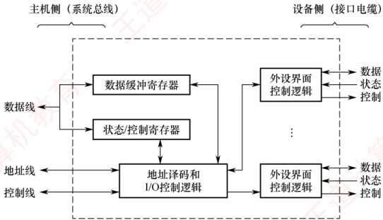

## 7.2 I/O 接口

I/O 接口（也称 I/O 控制器）是主机与外部设备之间的交接界面，用于实现二者之间的信息交换。由于外设种类繁多，在工作方式、数据格式和工作速度等方面存在显著差异，接口正是为弥合这些异构性而设置的。
### 7.2.1 I/O 接口的功能

### 考点追踪 I/O 接口的定义与特性（2021）

I/O 接口的主要功能如下：

1）地址译码与设备选择。当 CPU 发出 I/O 操作请求时，会同时提供目标外设的地址码。接口对地址进行译码，产生设备选择信号，确保主机仅与指定外设通信。

2）通信联络与时序协调。主机与外设的工作速度通常不匹配。接口通过握手信号或状态轮询机制，动态协调双方操作节奏，确保数据传输可靠有序。

3）数据缓冲。接口设有数据缓冲寄存器，用于暂存传输数据，避免因速度不匹配导致的数据丢失。

4）信号格式转换。主机与外设在电平标准、数据格式或信号类型上可能存在差异。接口需完成电平转换、并/串或串/并转换、模/数或数/模转换等，以实现物理兼容。

5）控制命令与状态信息传递。CPU 通过向接口的控制寄存器写入命令字（如“启动”）控制外设；外设通过状态寄存器反馈状态（如“就绪”）。当外设需要主动通知 CPU（如数据到达）时，接口可向 CPU 发出中断请求，由 CPU 适时响应处理。

### 7.2.2 I/O 接口的基本结构

### 考点追踪 ▶️ I/O 端口与 CPU 交换的内容（2015）

图 7.1 所示为 I/O 接口的通用结构。I/O 接口在主机侧通过 I/O 总线与 CPU 和内存相连，其内部主要包括三类寄存器：数据缓冲寄存器用于暂存 CPU 与外设之间传送的数据；状态寄存器用于记录接口及外设的当前状态；控制寄存器用于保存 CPU 发给外设的控制命令。由于状态寄存器仅被 CPU 读取，控制寄存器仅被 CPU 写入，二者的访问方向相反且访问时间错开，因此在某些设计中可复用同一端口地址：读操作访问状态，写操作访问控制。

图 7.1 一个 I/O 接口的通用结构

### 考点追踪 I/O 接口的数据线上传输的内容（2012）

I/O 接口中的数据线传送的是读/写数据、状态信息、控制信息以及中断类型号（在向量中断中）；地址线指定要访问的 I/O 接口内部寄存器的端口地址；控制线传送的是读/写控制信号（用于区分寄存器访问方向），以及中断请求与响应信号、总线仲裁信号和设备握手信号。

I/O 接口中的 I/O 控制逻辑的功能：① 对控制寄存器中的命令字进行译码，并将生成的控制信号经外设界面控制逻辑送至外设。② 输出时，将数据缓冲寄存器的内容发送给外设；输入时，将外设数据写入数据缓冲寄存器。③ 实时采集外设状态，并更新至状态寄存器。
对上述寄存器的访问通过专用指令完成，这类指令称为 I/O 指令。在采用独立 I/O 地址空间的体系结构（如 x86），I/O 指令通常为特权指令，仅限操作系统内核使用。

### 7.2.3 I/O 接口的类型

从不同角度，I/O 接口可分为以下类型。

1）按数据传送方式（外设与接口一侧），可分为并行接口（一字节或一个字的所有位同时传送）和串行接口（一位一位有序传送），接口需完成相应的并/串或串/并格式转换。

2）按主机访问 I/O 设备的控制方式，可分为程序查询接口、中断接口和 DMA 接口等。

3）按功能灵活性，可分为可编程接口（通过编程改变接口功能）和不可编程接口。

### 7.2.4 I/O 端口及其编址

### 考点追踪 ▶️ I/O 端口的定义及相关特性（2014）

I/O 端口是指 I/O 接口电路中可被 CPU 直接访问的寄存器，主要包括：数据端口（支持 CPU 进行读/写操作）、状态端口（仅支持读操作）和控制端口（仅支持写操作）。

**注意**

端口与接口是两个不同概念：端口是接口内部可寻址的寄存器。

为使 CPU 能够访问各个 I/O 端口，必须对端口进行编址，每个端口对应一个唯一的端口地址。常见的编址方式有两种：独立编址与统一编址。

#### （1） 独立编址（I/O 映射方式）

### 考点追踪 ▶️ I/O 指令的作用（2017）

独立编址为 I/O 端口建立一个独立于主存的地址空间。I/O 端口地址与内存地址在逻辑上完全分离，地址值可以相同，但由于属于不同地址空间，不会发生冲突。CPU 通过专用的 I/O 指令（如 x86 中的 IN 和 OUT）访问 I/O 端口，指令中的地址字段指定端口号。

优点：I/O 端口数量远少于内存单元，所需地址线较少，译码电路简单，寻址速度快；使用专用 I/O 指令，使程序中 I/O 操作清晰可辨，便于阅读与调试。

缺点：I/O 指令功能有限，通常仅支持简单的数据传输，程序设计灵活性较差；CPU 需同时提供存储器读/写和 I/O 读/写两组控制信号，增加了控制逻辑的复杂性。

#### （2） 统一编址（存储器映射方式）

统一编址将部分主存地址空间分配给 I/O 端口，使 I/O 端口与内存单元共享同一地址空间。通过地址范围即可区分访问目标（如高地址段映射到 I/O 设备），因此无须专用 I/O 指令，CPU 使用普通的访存指令（如加载和存储指令）即可访问 I/O 端口。

优点：无须专用 I/O 指令，使得编程更加灵活；I/O 端口可获得较大的编址空间；I/O 访问的保护机制可由虚拟存储管理系统统一实现，无须额外硬件支持。

缺点：I/O 端口占用主存地址空间，减少了系统可用内存容量；由于需根据完整地址判断是否为 I/O 区域，译码电路相对复杂，可能降低译码速度。
