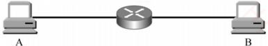
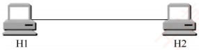
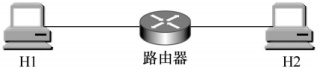
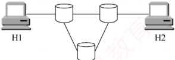
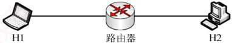
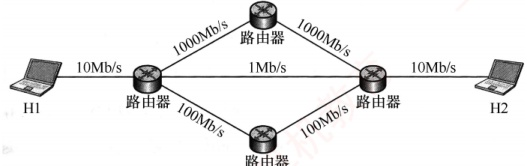
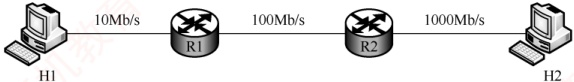
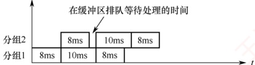

### 1.1.7 本节习题精选

#### 一、 单项选择题

##### 01

计算机网络可被理解为（）。

A. 执行计算机数据处理的软件模块

B. 由自治的计算机互连起来的集合体

C. 多个处理器通过共享内存实现的紧耦合系统

D. 用于共同完成一项任务的分布式系统

##### 02

下列不属于计算机网络功能的是（）。

A. 提高系统可靠性

B. 提高工作效率

C. 分散数据的综合处理

D. 使各计算机相对独立

##### 03

下列关于网络中的计算机的描述，正确的是（）。

A. 各自独立，没有联系

B. 拥有独立的操作系统

C. 互相干扰

D. 拥有共同的操作系统

##### 04

分组交换相比报文交换的主要改进是（）。

A. 差错控制更加完善

B. 路由算法更加简单

C. 传输单位更小且有固定的最大长度

D. 传输单位更大且有固定的最大长度

##### 05

下列（）是分组交换网络的缺点。

A. 信道利用率低 B. 附加信息开销大

C. 传播时延大 D. 不同规格的终端很难相互通信

##### 06

不同的数据交换方式有不同的性能。为了使数据在传输期间的时延最小，首选的交换方式是（①）；为保证数据无差错地传送，不应选用的交换方式是（②）；分组交换对报文交换的主要改进是（③），这种改进产生的直接结果是（④）。

①A. 电路交换 B. 报文交换 C. 分组交换

②A. 电路交换 B. 报文交换 C. 分组交换

③A. 传输单位更小且有固定的最大长度

B. 传输单位更大且有固定的最大长度

C. 差错控制更完善

D. 路由算法更简单

④A. 降低了误码率

B. 提高了数据传输速率

C. 减少传输时延

D. 增加传输时延

##### 07

下列说法中，（）是数据报方式的特点。

A. 同一报文的不同分组可以经过不同的传输路径通过通信子网

B. 同一报文的不同分组到达目的节点时顺序是确定的

C. 适合于短报文的通信

D. 同一报文的不同分组在路由选择时只需要进行一次
##### 08

计算机网络分为广域网、城域网和局域网，其划分的主要依据是（）。

A. 网络的作用范围

B. 网络的拓扑结构

C. 网络的通信方式

D. 网络的传输介质

##### 09

假设主机 A 和 B 之间的链路带宽为  $100 \, Mb/s$，主机 A 的网卡速率为  $1 \, Gb/s$，主机 B 的网卡速率为  $10 \, Mb/s$，主机 A 给主机 B 发送数据的最高理论速率为（）。

A. 1Mb/s B. 10Mb/s C. 100Mb/s D. 1Gb/s

##### 10

某点对点链路的长度为 100km，若数据在该链路上的传输速率为  $10^{8}m/s$，链路带宽为 20Mb/s，已知一个已发送的分组的发送时延和传播时延相等，则该分组的大小为（）。

A. 20Kb B. 30Kb C. 40Kb D. 50Kb

##### 11

在下图所示的采用存储转发方式的分组交换网中，主机 A 向 B 发送两个长度为 1000B 的分组，路由器处理单个分组的时延为 10ms（假设路由器同时最多只能处理一个分组，若在处理某个分组时有新的分组到达，则存入缓存区），忽略链路的传播时延，所有链路的数据传输速率为 1Mb/s，则分组从 A 发送开始到 B 接收完为止，需要的时间至少是（）。

A. 34ms B. 36ms C. 38ms D. 52ms

##### 12

如下图所示，主机 H1 和 H2 之间有三种可选的交换方式——电路交换、报文交换和分组交换，其中电路交换建立电路连接的时间为 2s，报文交换和分组交换都要经过由一个路由器连接的链路，分组大小为 5kb。三种交换方式的数据传输速率均为 2.5kb/s，忽略所有的传播时延、分组开销和不可预料的线路延迟，下列说法中正确的是（）。

电路交换

报文交换和分组交换

A. 若 H1 向 H2 发送 5kb 的数据，则电路交换最节省时间

B. 若 H1 向 H2 发送 500kb 的数据，则电路交换和分组交换的时间相同

C. 若 H1 向 H2 发送 10kb 的数据，则报文交换比分组交换更节省时间

D. 若 H1 向 H2 发送 15kb 的数据，则报文交换比电路交换更节省时间

##### 13

【2010 统考真题】在下图所示的采用“存储-转发”方式的分组交换网络中，所有链路的数据传输速率为 100Mb/s，分组大小为 1000B，其中分组头大小为 20B。若主机 H1 向主机 H2 发送一个大小为 980000B 的文件，则在不考虑分组拆装时间和传播延迟的情况下，从 H1 发送开始到 H2 接收完为止，需要的时间至少是（）。

A. 80ms B. 80.08ms C. 80.16ms D. 80.24ms

##### 14

【2013 统考真题】主机甲通过一个路由器（存储转发方式）与主机乙互连，两段链路的数据传输速率均为 10Mb/s，主机甲分别采用报文交换和分组大小为 10kb 的分组交换向主机乙发送一个大小为 8Mb（1M=10⁶）的报文。若忽略链路传播延迟、分组头开销和
分组拆装时间，则两种交换方式完成该报文传输所需的总时间分别为（）。

A. 800ms、1600ms

B. 801ms、1600ms

C. 1600ms、800ms

D. 1600ms、801ms

##### 15

【2023 统考真题】在下图所示的分组交换网络中，主机 H1 和 H2 通过路由器互连，2 段链路的带宽均为 100Mb/s，时延带宽积（单向传播时延×带宽）均为 1000b。若 H1 向 H2 发送一个大小为 1MB 的文件，分组长度为 1000B，则从 H1 开始发送的时刻起到 H2 收到文件全部数据时刻止，所需的时间至少是（）。（注： $1M = 10^{6}$。）

H2

A. 80.02ms B. 80.08ms C. 80.09ms D. 80.10ms

##### 16

【2024 统考真题】某分组交换网络及每段链路的带宽如下图所示，H1 到 H2 的最大吞吐量约为（）。

A. 1Mb/s B. 10Mb/s C. 100Mb/s D. 1000Mb/s

##### 17

【2025 统考真题】某网络拓扑及各链路带宽如下图所示。网络按电路交换方式运行时，主机 H1 与 H2 建立一条带宽为 10Mb/s 的电路，建立电路时间为 32μs；按分组交换方式运行时，分组长度为 400B，忽略分组首部开销。现 H1 向 H2 发送一个 2MB（1M = 10⁶）的文件，分别采用电路交换、报文交换、分组交换方式时，H2 至少需要  $T_{CS}$、 $T_{MS}$、 $T_{PS}$ 时间才能接收到全部文件内容，则  $T_{CS}$、 $T_{MS}$、 $T_{PS}$ 满足的关系是（）。

A.  $T_{\mathrm{CS}}>T_{\mathrm{MS}}>T_{\mathrm{PS}}$ B.  $T_{\mathrm{MS}}>T_{\mathrm{PS}}>T_{\mathrm{CS}}$ C.  $T_{\mathrm{MS}}>T_{\mathrm{CS}}>T_{\mathrm{PS}}$ D.  $T_{\mathrm{PS}}>T_{\mathrm{MS}}>T_{\mathrm{CS}}$

#### 二、 综合应用题

##### 01

假定有一个通信协议，每个分组都引入 100B 的开销，用于首部和组帧。现在使用这个协议发送  $10^{6}$B 的数据，但在传送过程中有 1B 被破坏，因而包含该字节的那个分组被丢弃。对 1000B 和 20000B 的分组的有效数据大小，分别计算 “开销 + 丢失” 字节的总数量。为使 “开销 + 丢失” 字节的总数量最小，分组数据大小的最佳值是多少？

##### 02

考虑一个最大距离为 2km 的局域网，当带宽多大时，传播时延（传播速率为  $2 \times 10^{8} \, m/s$）等于 100B 分组的发送时延？对于 512B 分组，结果又如何？

##### 03

在两台计算机之间传输一个文件有两种可行的确认策略。第一种策略将文件截成分组，接收方逐个确认分组，但就整体而言，文件没有得到确认。第二种策略不确认单个分组，但当文件全部收到后，对整个文件予以确认。讨论这两种方式的优缺点。
### 1.1.8 答案与解析

#### 一、 单项选择题

##### 01

B

计算机网络是由自治计算机互连起来的集合体，其中包含三个关键点：自治计算机、互连、集合体。自治计算机由软件和硬件两部分组成，能完整地实现计算机的各种功能；互连是指计算机之间能实现相互通信；集合体是指所有使用通信线路及互联设备连接起来的自治计算机的集合。选项C和D分别指多机系统和分布式系统。

##### 02

D

计算机网络的三大主要功能是数据通信、资源共享和分布式处理。计算机网络使各计算机之间的联系更加紧密而非相对独立。

##### 03

B

计算机网络是一些互连的、自治的计算机系统的集合。各计算机拥有独立的操作系统和硬件资源，它们之间是有联系的，通过网络协议和通信介质进行数据交换和资源共享。

##### 04

C

##### 05

B

相对于报文交换而言，分组交换将报文划分为一个个具有固定最大长度的分组，以分组为单位进行传输。

分组交换要求将数据分成等长的小数据段，每段都要加上控制信息（如目的地址），因此传送数据的总开销较大。相比其他交换方式，分组交换信道利用率高。传播时延取决于传播介质及收发双方的距离。对各种交换方式，不同规格的终端都很难相互通信，因此不是分组交换的缺点。

##### 06

A、A、A、C

本题综合考查几种数据交换方式的特点。电路交换虽然建立连接的时延较大，但在数据传输期间一直占据链路，优点是传输时延小、通信实时性强，适用于交互式会话类通信。缺点是建立连接时间长，系统效率低，不具备存储数据的能力，不具备差错控制的能力。

报文交换和分组交换都采用存储转发，传送的数据都要经过中间节点的若干存储、转发才能到达目的地，因此传输时延较大。报文交换传送数据的长度不固定且较长，分组交换要将传送的长报文分割为多个固定且长度有限的分组，因此传输时延较报文交换的小。

##### 07

A

数据报方式是一种无连接的分组交换技术，它先将报文拆分成若干较小的数据段，加上地址等控制信息后构成分组，这样做虽然会增加一些控制开销，但并不意味着数据报方式只适合于短报文的通信。数据报方式尽最大努力交付，不保证可靠性，分组可能出错或丢失，网络为每个分组独立地选择路由，转发的路径可能不同，因此分组不一定按序到达目的节点。

##### 08

A

按分布范围分类：广域网、城域网、局域网、个人区域网。

按拓扑结构分类：星形网络、总线形网络、环形网络、网状网络。

按传输技术分类：广播式网络、点对点网络。

按使用者分类：公用网、专用网。

按数据交换技术分类：电路交换网、报文交换网、分组交换网。

因此，根据网络的覆盖范围可将网络主要分为广域网、城域网和局域网。
##### 09

B

主机 A 给主机 B 发送数据的最高理论速率取决于链路带宽及主机 A、主机 B 的网卡速率中最小者，因为它是数据传输的瓶颈。因此，最高理论速率为 10Mb/s。

##### 10

A

链路的传播时延 = 100km÷10^8m/s = 1ms，发送时延等于传播时延，因此发送时延也为 1ms，所以分组的大小应为 20Mb/s×1ms = 20Kb。

##### 11

B

分组长度为 1000B，所有链路的数据传输速率为 1Mb/s，因此，每段链路的发送时延为  $1000B \div 1Mb/s = 8ms$，第一个分组从 A 到达 B 的时间为  $8 + 10 + 8 = 26ms$，此后又经过 10ms，第二个分组才到达 B，所以总时间为  $26 + 10 = 36ms$，下图是传送过程的时空图。

注意，此题还可扩展为发送更多分组的情况，请读者自行分析。

##### 12

B

若 H1 向 H2 发送 5kb 的数据，电路交换的时间为  $2 + 5\mathrm{kb} \div 2.5\mathrm{kb}/s = 4\mathrm{s}$，分组交换和报文交换的时间均为  $5\mathrm{kb} \div 2.5\mathrm{kb}/s + 5\mathrm{kb} \div 2.5\mathrm{kb}/s = 4\mathrm{s}$，选项 A 错误。若 H1 向 H2 发送 500kb 的数据，电路交换的时间为  $2 + 500\mathrm{kb} \div 2.5\mathrm{kb}/s = 202\mathrm{s}$，分组交换时间为  $500\mathrm{kb} \div 2.5\mathrm{kb}/s + 5\mathrm{kb} \div 2.5\mathrm{kb}/s = 202\mathrm{s}$，选项 B 正确。若 H1 向 H2 发送 10kb 的数据，报文交换时间为  $10\mathrm{kb} \div 2.5\mathrm{kb}/s + 10\mathrm{kb} \div 2.5\mathrm{kb}/s = 8\mathrm{s}$，分组交换时间为  $10\mathrm{kb} \div 2.5\mathrm{kb}/s + 5\mathrm{kb} \div 2.5\mathrm{kb}/s = 6\mathrm{s}$，选项 C 错误。若 H1 向 H2 发送 15kb 的数据，电路交换时间为  $2 + 15\mathrm{kb} \div 2.5\mathrm{kb}/s = 8\mathrm{s}$，报文交换时间为  $15\mathrm{kb} \div 2.5\mathrm{kb}/s + 15\mathrm{kb} \div 2.5\mathrm{kb}/s = 12\mathrm{s}$，选项 D 错误。

##### 13

C

分组大小为 1000B，其中首部占 20B，故每个分组携带的有效数据为 980B。文件总长为 98000B，需划分为 1000 个分组；每个分组含首部共 1000B，因此共需传输的数据量为  $10^6$B。由于所有链路的传输速率相同，沿最短路径传输时延最小，而最短路径经过 2 个交换机（共 3 段链路）。H1 发送完所有分组的时间为  $10^6 \times 8b \div 100Mb/s = 80ms$，此时最后一个分组刚离开 H1，该分组还需依次经过 2 个交换机（再通过 2 段链路）才能到达 H2，每段链路的传输时延为  $r = 1000 \times 8b \div 100Mb/s = 0.08ms$。因此，H2 接收完全数据的时间为  $80ms + 2r = 80.16ms$。

【另解】分组交换的传输过程类似于流水线。在连续传输过程中，各存储转发设备可同时处理不同的分组，就如同流水线中的各段并行工作。由于所有链路的速率相同，每段链路的传输时延  $r = 1000 \times 8b \div 100Mb/s = 0.08ms$，最短路径有 3 段链路。H2 接收完全部数据的时间为  $3r + (m-1)r = 3 \times 0.08ms + (1000-1) \times 0.08ms = 80.16ms$。也就是说，第一个分组从流水线中流出所需的时间为 3r，此后每隔 r 时间就有一个分组流出。

##### 14

D

传输路径为：甲一路由器一乙。

在题中未明确说明的情况下，不考虑排队时延和处理时延，只考虑发送时延和传播时延；本题已忽略传播时延，因此只需计算报文交换和分组交换的发送时延。

报文交换：采用整报文传输，报文大小为8Mb（1M=10^{6}）。每个节点（包括主机甲和路由器）
在转发该报文前需要完整接收，因此需经历两次发送过程：甲向路由器发送报文，发送时延  $T = 8Mb \div 10Mb/s = 0.8s$；路由器向乙转发该报文，同样需 0.8s。总时延为 1.6s，即 1600ms。

分组交换：分组大小为 10kb（1k=10^3），忽略分组头开销，每个分组携带 10kb 数据。报文总长为 8Mb，分组数 m=8Mb÷10kb=800。参考 2010 年真题的流水线思路：甲与乙通过一个路由器相连，构成 2 段链路（2 个流水段），每段链路的发送时延 r=10kb÷10Mb/s=1ms。第一个分组从甲发出后，需经过 2 段链路才能到达乙，耗时 2r；此后，流水线满载，每隔 r 时间就有一个分组到达乙。因此，传输 m=800 个分组所需的总时间为 t=2r+(m-1)r=2+(800-1)×1=801ms。

##### 15

D

文件大小为 1MB，分组长度为 1000B，分组数量为 1MB÷1000B = 1000。一个分组从 H1 到 H2 所需的时间 = H1 的发送时延  $t_1 + H1$ 到路由器的传播时延  $t_2 +$ 路由器的发送时延  $t_3 +$ 路由器到 H2 的传播时延  $t_4$，其中  $t_1 = t_3 = 1000B \div 100Mb/s = 0.08ms$， $t_2 = t_4 = 1000B \div 100Mb/s = 0.01ms$。因此，一个分组从 H1 到 H2 的端到端时延为  $(0.08 + 0.01) \times 2 = 0.18ms$。H1 发送前 999 个分组所需的时间为  $999t_1 = 79.92ms$，此时，第 1000 个分组刚刚开始发送，它还需 0.18ms 才能到达 H2。因此，从 H1 开始发送到 H2 收到全部数据所需的最短时间为  $79.92 + 0.18 = 80.10ms$。

读者可以思考：若  $H_{1}$ 和  $H_{2}$ 之间有 2 个路由器，则所需的时间至少是多少？

##### 16

B

H1 到 H2 有三条路径。H1 和 H2 各自连接路由器的链路带宽均为 10Mb/s，这是所有路径共有的端侧链路。现在假设每个数据段为 10Mb，分别分析各路径的吞吐量。

路径一：中间两段链路带宽均为 1000Mb/s，受限于 H1、H2 直连路由器的链路带宽 10Mb/s，无论中间链路有多快，数据从 H1 发出需 1s（10Mb÷10Mb/s，受限于自身的 10Mb/s 出口），到达 H2 前最后一跳也需 1s。吞吐量约为 10Mb/s。

路径二：中间一段链路带宽为 1Mb/s，H1 发送一个数据段需 1s，但经过中间 1Mb/s 链路时，转发时延为  $10Mb \div 1Mb/s = 10s$（成为瓶颈），因此 H2 每隔 10s 收到一个数据段，吞吐量约为 1Mb/s。

路径三：中间两段链路带宽均为 100Mb/s，与路径一的分析类似，吞吐量约为 10Mb/s。由此可见，端到端的吞吐量由路径中带宽最小的链路（瓶颈）决定。

##### 17

B

采用电路交换时， $T_{\text{CS}} =$ 电路建立时间  $32\mu\text{s} +$ 文件传输时间  $2\text{MB} \div 10\text{Mb/s} = 32\mu\text{s} + 1.6\text{s}$。采用报文交换时，整个报文需要逐跳存储转发， $T_{\text{MS}} = 2\text{MB} \div 10\text{Mb/s} + 2\text{MB} \div 100\text{Mb/s} + 2\text{MB} \div 1000\text{Mb/s} = 1.776\text{s}$。采用分组交换时，分组数为  $2\text{MB}/400\text{B} = 5000$，第一个分组从 H1 到 H2 的传输时延  $= 400\text{B} \div 10\text{Mb/s} + 400\text{B} \div 100\text{Mb/s} + 400\text{B} \div 1000\text{Mb/s} = 355.2\mu\text{s}$；之后，每  $320\mu\text{s}$ 到达一个分组，故  $T_{\text{PS}} = 355.2\mu\text{s} + 320 \times 4999\mu\text{s} = 1.6\text{s} + 35.2\mu\text{s}$。因此  $T_{\text{MS}} > T_{\text{PS}} > T_{\text{CS}}$。

#### 二、 综合应用题

##### 01

【解答】

设 D 是分组数据的大小，需要的分组数量 =  $10^{6} \div D$，开销 = 100N（被丢弃分组的首部也已计入开销），因此“开销 + 丢失” =  $100 \times 10^{6} \div D + D$。

当 $D=1000$时，“开销+丢失” $=100\times10^{6}\div1000+1000=101000B$。

当D=20000时，“开销+丢失”= $100 \times 10^{6} \div 20000 + 20000 = 25000$B。

设“开销+丢失”字节总数量为y， $y=10^{8}\div D+D$，求微分有 $\mathrm{d}y\div\mathrm{d}D=1-10^{8}\div D^{2}$。

当  $D = 10^4$ 时， $\mathrm{dy} \div \mathrm{d}D = 0$，所以分组数据大小的最佳值是 10000B。

##### 02

【解答】
传播时延= $2\times10^{3}$m÷( $2\times10^{8}$m/s)=10 $^{-5}$s=10μs。

1 ）分组大小为100B：

假设带宽大小为 x，要使传播时延等于发送时延，带宽如下：

 $$x=100\mathrm{B}\div10\mu\mathrm{s}=10\mathrm{MB/s}=80\mathrm{Mb/s}$$

2 ）分组大小为512B：

假设带宽大小为 y，要使传播时延等于发送时延，带宽如下：

 $$y=512\mathrm{B}{\div}10\mu\mathrm{s}=51.2\mathrm{M B/s}=409.6\mathrm{M b/s}$$

因此，带宽应分别等于 80Mb/s 和 409.6Mb/s。

##### 03

【解答】

若网络容易丢失分组，则对每个分组逐一进行确认较好，此时仅重传丢失的分组。另一方面，若网络高度可靠，则在不发生差错的情况下，仅在整个文件传送的结尾发送一次确认，以减少确认次数，进而节省带宽。不过，即使只有单个分组丢失，也要重传整个文件。
