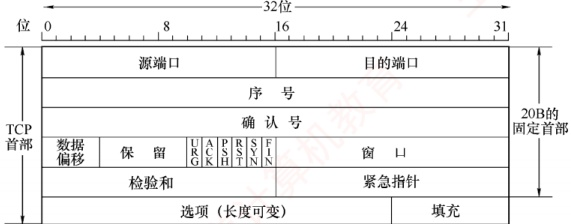
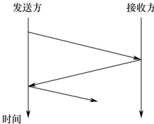

### 1.2.4 本节习题精选

#### 一、 单项选择题

##### 01

下列选项中，不属于对网络模型进行分层的目标的是（）。

A. 提供标准语言

B. 定义功能执行的方法

C. 定义标准界面

D. 增加功能之间的独立性

##### 02

将用户数据分成一个个数据块传输的优点不包括（）。

A. 减少延迟时间

B. 提高错误控制效率

C. 使得多个应用更公平地使用共享通信介质

D. 有效数据在协议数据单元（PDU）中所占比例更大

##### 03

协议是指在（）之间进行通信的规则或约定。

A. 同一节点的上下层

B. 不同节点

C. 相邻实体

D. 不同节点对等实体

##### 04

OSI 参考模型中的实体指的是（）。

A. 实现各层功能的规则

B. 上下层之间进行交互时所要的信息

C. 各层中实现该层功能的软件或硬件

D. 同一节点中相邻两层相互作用的地方

##### 05

在 OSI 参考模型中，第 n 层与它之上的第  $n+1$ 层的关系是（）。

A. 第 n 层为第  $n+1$ 层提供服务

B. 第 $n+1$层为从第n层接收的报文添加一个报头

C. 第 n 层使用第  $n+1$ 层提供的服务

D. 第 n 层和第  $n+1$ 层相互没有影响
##### 06

下列关于计算机网络及其结构模型的说法中，错误的是（）。

A. 世界上第一个计算机网络是 ARPAnet

B. Internet 最早起源于 ARPAnet

C. 国际标准化组织（ISO）设计出了 OSI/RM 参考模型，即实际执行的标准

D. TCP/IP 模型分为 4 个层次

##### 07

（）是计算机网络中 OSI 参考模型的 3 个主要概念。

A. 服务、接口、协议 B. 结构、模型、交换

C. 子网、层次、端口 D. 广域网、城域网、局域网

##### 08

下列关于网络协议三要素的描述中，正确的是（）。

A. 数据格式、编码、信号电平

B. 数据格式、控制信息、速度匹配

C. 语法、语义、同步

D. 编码、控制信息、同步

##### 09

释放 TCP 连接的四次挥手报文的先后关系，属于网络协议三要素中的（）。

A. 语法 B. 时序 C. 语义 D. 服务

##### 10

下图是 TCP 报文段的首部格式，它描述的是网络协议三要素中的（）。

I. 语法

II. 语义

III. 时序（同步）

A. 仅 I

B. 仅 II

C. 仅 III

D. I、II 和 III

##### 11

下列关于 OSI 参考模型的描述中，错误的是（）。

A. OSI 参考模型定义了开放系统的层次结构

B. OSI 参考模型定义了各层所包括的可能的服务

C. OSI 参考模型作为一个框架协调组织各层协议的制定

D. OSI 参考模型定义了各层接口的实现方法

##### 12

负责将比特转换成电信号进行传输的层是（）。

A. 应用层          B. 网络层          C. 数据链路层      D. 物理层

##### 13

下列关于 OSI 参考模型的物理层功能的描述中，错误的是（）。

A. 比特 0 和 1 使用何种电信号表示

B. 传输能否在两个方向上同时进行

C. 1 个比特持续多长时间

D. 避免快速发送方“淹没”慢速接收方

##### 14

OSI 参考模型中的数据链路层不具有（）功能。

A. 物理寻址 B. 流量控制 C. 差错检验 D. 拥塞控制

##### 15

下列能够最好地描述 OSI 参考模型的数据链路层功能的是（）。

A. 提供用户和网络的接口

B. 处理信号通过介质的传输

C. 控制报文通过网络的路由选择

D. 保证数据正确的顺序和完整性
##### 16

当数据由端系统 A 传送至端系统 B 时，不参与数据封装工作的是（）。

A. 物理层          B. 数据链路层       C. 网络层          D. 表示层

##### 17

在 OSI 参考模型中，实现端到端的应答、分组排序和流量控制功能的协议层是（）。

A. 会话层 B. 网络层 C. 传输层 D. 数据链路层

##### 18

在 ISO/OSI 参考模型中，可同时提供无连接服务和面向连接服务的是（）。

A. 物理层 B. 数据链路层 C. 网络层 D. 传输层

##### 19

在 OSI 参考模型中，当两台计算机进行文件传输时，为防止中间出现网络故障而重传整个文件的情况，可通过在文件中插入同步点来解决，这个动作发生在（）。

A. 表示层

B. 会话层

C. 网络层

D. 应用层

##### 20

数据的格式转换及压缩属于OSI参考模型中（）的功能。

A. 应用层 B. 表示层 C. 会话层 D. 传输层

##### 21

OSI 参考模型中（）通过设置检验点，使通信双方在通信失效时可从检验点恢复通信。

A. 传输层          B. 网络层          C. 表示层          D. 会话层

##### 22

下列说法中正确描述了 OSI 参考模型中数据的封装过程的是（）。

A. 数据链路层在分组上仅增加了源物理地址和目的物理地址

B. 网络层将高层协议产生的数据封装成分组，并增加第三层的地址和控制信息

C. 传输层将数据流封装成数据帧，并增加可靠性和流控制信息

D. 表示层将高层协议产生的数据分割成数据段，并增加相应的源和目的端口信息

##### 23

在 OSI 参考模型中，提供流量控制功能的层是第（①）层；提供建立、维护和拆除端到端的连接的层是（②）；为数据分组提供在网络中路由功能的是（③）；传输层提供（④）的数据传送；为网络层实体提供数据发送和接收功能及过程的是（⑤）。

①A. 1、2、3 B. 2、3、4 C. 3、4、5 D. 4、5、6

②A. 物理层 B. 数据链路层 C. 会话层 D. 传输层

③A. 物理层 B. 数据链路层 C. 网络层 D. 传输层

④A. 主机进程之间 B. 网络之间

C. 数据链路之间 D. 物理线路之间

⑤A. 物理层 B. 数据链路层 C. 会话层 D. 传输层

##### 24

在 OSI 参考模型中，___利用通信子网提供的服务实现两个进程之间的端到端通信。

A. 网络层 B. 传输层 C. 会话层 D. 表示层

##### 25

互联网采用的核心技术是（）。

A. TCP/IP B. 局域网技术 C. 远程通信技术 D. 光纤技术

##### 26

在 TCP/IP 模型中，（）处理关于可靠性、流量控制和错误校正等问题。

A. 网络接口层 B. 网际层 C. 传输层 D. 应用层

##### 27

上下相邻层实体之间的接口称为服务访问点，应用层的服务访问点也称（）。

A. 用户接口 B. 网卡接口 C. IP 地址 D. MAC 地址

##### 28

在 OSI 参考模型中，各层都有差错控制过程，指出以下每种差错发生在哪些层中：噪声使传输链路上的一个 0 变成 1 或一个 1 变成 0 $^{①}$。收到一个序号错误的目的帧 $^{②}$。一台打印机正在打印，突然收到一个错误指令要打印头回到本行的开始位置 $^{③}$。

①A. 物理层 B. 网络层 C. 数据链路层 D. 会话层

②A. 物理层 B. 网络层 C. 数据链路层 D. 会话层

③A. 物理层 B. 网络层 C. 应用层 D. 会话层
##### 29

【2009 统考真题】在 OSI 参考模型中，自下而上第一个提供端到端服务的层是（）。

A. 数据链路层 B. 传输层 C. 会话层 D. 应用层

##### 30

【2010 统考真题】下列选项中不属于网络体系结构所描述的内容是（）。

A. 网络的层次

B. 每层使用的协议

C. 协议的内部实现细节

D. 每层必须完成的功能

##### 31

【2013 统考真题】在 OSI 参考模型中，功能需由应用层的相邻层实现的是（）。

A. 对话管理 B. 数据格式转换 C. 路由选择 D. 可靠数据传输

##### 32

【2014 统考真题】在 OSI 参考模型中，直接为会话层提供服务的是（）。

A. 应用层 B. 表示层 C. 传输层 D. 网络层

##### 33

【2016 统考真题】在 OSI 参考模型中，路由器、交换机（Switch）、集线器（Hub）实现的最高功能层分别是（）。

A. 2、2、1 B. 2、2、2 C. 3、2、1 D. 3、2、2

##### 34

【2017 统考真题】假设 OSI 参考模型的应用层欲发送 400B 的数据（无拆分），除物理层和应用层外，其他各层在封装 PDU 时均引入 20B 的额外开销，则应用层的数据传输效率约为（）。

A. 80% B. 83% C. 87% D. 91%

##### 35

【2019 统考真题】OSI 参考模型的第 5 层（自下而上）完成的主要功能是（）。

A. 差错控制 B. 路由选择 C. 会话管理 D. 数据表示转换

##### 36

【2020 统考真题】右图描述的协议要素是（）。

I. 语法

II. 语义

III. 时序

A. 仅 I

B. 仅 II

C. 仅 III

D. I、II 和 III

##### 37

【2021 统考真题】在 TCP/IP 模型中，由传输层相邻的下一层实现的主要功能是（）。

A. 对话管理 B. 路由选择 时间

C. 端到端报文段传输 D. 节点到节点流量控制

##### 38

【2022 统考真题】在 ISO/OSI 参考模型中，实现两个相邻节点间流量控制功能的是（）。

A. 物理层 B. 数据链路层 C. 网络层 D. 传输层

### 1.2.5 答案与解析

#### 一、 单项选择题

##### 01

B

分层属于计算机网络体系结构的范畴，选项 A、C 和 D 均是网络模型分层的目的，而分层的目的不包括定义功能执行的具体方法。

##### 02

D

将用户数据分成一个个数据块传输，因为每块均需加入控制信息，所以实际上会使有效数据在PDU中所占的比例更小。其他各项均为其优点。

##### 03

D

协议是为对等层实体之间进行逻辑通信而定义的规则的集合。

##### 04

C

实体是指每层中实现该层功能的软件或硬件，可以是程序、模块、子程序或设备。
##### 05

A

服务是指下层为紧邻的上层提供的功能调用，每层只能调用紧邻下层提供的服务（通过服务访问点），而不能跨层调用。

##### 06

C

ISO 设计了开放系统互连参考模型（OSI/RM），但实际执行的通用标准是 TCP/IP 标准。

##### 07

A

计算机网络要做到有条不紊地交换数据，就必须遵守一些事先约定的原则，这些原则就是协议。在协议的控制下，两个对等实体之间的通信使得本层能够向上一层提供服务。要实现本层协议，还要使用下一层提供的服务，而提供服务就是交换信息，交换信息就需要通过接口，所以说服务、接口、协议是OSI参考模型的3个主要概念。

##### 08

C

描述网络协议的三要素是语法、语义和同步。

##### 09

B

网络协议三要素中的时序（或称同步）定义了通信双方的时序关系，TCP通信双方通过“四次挥手”释放连接，它规定发送FIN、ACK、FIN和ACK报文的先后顺序。

##### 10

A

网络协议三要素中的语法定义所交换信息的格式，因此 TCP 首部格式体现了语法的要素。

##### 11

D

OSI 参考模型不仅划分了层次结构，还定义了各层可能提供的服务，但并未规定协议的具体实现，而是描述了一些概念和原则，用来协调和组织各层所用的协议。OSI 参考模型并未定义各层接口的实现方法，而把具体的实现细节留给了各个协议和标准，选项 D 错误。

##### 12

D

物理层为数据链路层提供二进制流的传输服务，涉及信号的编码、解码和同步等，选项D正确。

##### 13

D

避免快速发送方“淹没”慢速接收方，描述的是流量控制的作用，属于数据链路层或传输层的功能。物理层只负责透明地传送比特流，不涉及流量控制的功能，选项D错误。

##### 14

D

数据链路层在不可靠的物理介质上提供可靠的传输，作用包括物理寻址、组帧、流量控制、差错检验、数据重发等。网络层和传输层才具有拥塞控制的功能。

##### 15

D

OSI 参考模型的数据链路层向上提供可靠的传输服务，在差错检测的基础上，增加了帧编号、确认和重传机制，因此保证了数据正确的顺序和完整性。选项 A 是应用层的功能，选项 B 是物理层的功能，选项 C 是网络层的功能。学习 3.1 节后，对本题的理解将更深刻。

##### 16

A

物理层以 0、1 比特流的形式透明地传输数据链路层提交的帧。网络层和表示层都为上层提交的数据加上首部，数据链路层为上层提交的数据加上首部和尾部，然后提交给下一层。物理层不存在下一层，自然也就不用封装。

##### 17

C

只有传输层及以上各层的通信才能称为端到端，选项 B、D 错。会话层管理不同主机间进程的对话，而传输层实现应答、分组排序和流量控制功能。

##### 18

C

本题容易误选项 D。ISO/OSI 参考模型在网络层支持无连接和面向连接的通信，但在传输
层仅支持面向连接的通信；TCP/IP模型在网络层仅有无连接的通信，而在传输层支持无连接和面向连接的通信。两类协议栈的区别是联考的考点，而这个区别是常考点。

##### 19

B

在 OSI 参考模型中，会话层的两个主要服务是会话管理和同步。会话层使用检验点使通信会话在通信失效时从检验点继续恢复通信，实现数据同步。

##### 20

B

OSI 参考模型表示层的功能有数据解密与加密、压缩、格式转换等。

##### 21

D

会话层的主要功能是建立、管理和终止进程间的会话，以及使用检查点（或称检验点）使会话在通信失效时从检验点继续恢复通信，实现数据同步。

##### 22

B

数据链路层在分组上除增加源和目的物理地址外，也增加控制信息；传输层的PDU不称为帧；表示层不负责将高层协议产生的数据分割成数据段，负责增加相应源和目的端口信息的应是传输层。选项B正确描述了OSI参考模型中数据的封装过程，数据经过网络层后，只是增加了第三层PCI。

##### 23

① B、② D、③ C、④ A、⑤ B

在计算机网络中，流量控制指的是通过限制发送方发出的数据流量，使得其发送速率不超过接收方接收速率的一种技术。流量控制功能可存在于数据链路层及其之上的各层中。目前提供流量控制功能的主要是数据链路层、网络层和传输层。不过，各层的流量控制对象不一样，各层的流量控制功能是在各层实体之间进行的。

在 OSI 参考模型中，物理层实现比特流在传输介质上的透明传输；数据链路层将有差错的物理线路变成无差错的数据链路，实现相邻节点之间即点到点的数据传输。网络层的主要功能是路由选择、拥塞控制和网际互联等，实现主机到主机的通信；传输层实现主机的进程之间即端到端的数据传输。

下一层为上一层提供服务，而网络层的下一层是数据链路层，所以为网络层实体提供数据发送和接收功能及过程的是数据链路层。

##### 24

B

在 OSI 参考模型中，数据链路层提供链路上相邻节点之间的逻辑通信，网络层提供主机之间的逻辑通信，传输层在运行于不同主机上的进程之间（端到端）提供逻辑通信。

##### 25

A

协议是网络上计算机之间进行信息交换和资源共享时共同遵守的约定，没有协议的存在，网络的作用也就无从谈起。在互联网中应用的网络协议是采用分组交换技术的 TCP/IP，它是互联网的核心技术。

##### 26

C

TCP/IP 模型的传输层提供端到端的通信，并且负责差错控制和流量控制，可以提供可靠的面向连接服务或不可靠的无连接服务。

##### 27

A

在同一系统中，相邻两层的实体交换信息的逻辑接口称为服务访问点（SAP），N层的 SAP 是 N+1层可以访问 N层服务的地方。SAP 用于区分不同的服务类型。在5层体系结构中，数据链路层的服务访问点为帧的“类型”字段，网络层的服务访问点为IP数据报的“协议”字段，传输层的服务访问点为“端口号”字段，应用层的服务访问点为“用户接口”。

##### 28

A, C, C
1）物理层。物理层负责正确、透明地传输比特流（0,1）。

2）数据链路层。数据链路层的 PDU 称为帧，帧的差错检测是数据链路层的功能。

3）应用层。打印机是向用户提供服务的，运行的是应用层的程序。

##### 29

B

在 OSI 参考模型中，传输层是自下而上第一个提供端到端服务的层，通过端口号实现应用进程间的逻辑通信。数据链路层仅负责相邻节点（如交换机、路由器等中间设备）之间的通信，而网络层提供主机到主机的通信，不提供面向应用进程的服务。

##### 30

C

网络体系结构是指各层及其协议的集合，涵盖网络的层次划分、每层的功能及所用的协议，因此选项 A、B、D 均属于描述内容。而协议的内部实现细节属于实现问题，不由体系结构规定。

##### 31

B

在 OSI 参考模型中，应用层的相邻下层是表示层（第6层），负责处理与数据表示相关的问题。其主要功能包括数据字符集转换、数据格式转换、文本压缩以及加密与解密等。

##### 32

C

在 OSI 参考模型中，各层直接为其上一层提供服务，而会话层的下一层是传输层。

##### 33

C

集线器（Hub）是多端口中继器，工作在物理层（第1层）；以太网交换机（Switch）是多端口网桥，工作在数据链路层（第2层）；路由器是网络层设备，最高工作在第3层。因此，三者实现的最高功能层分别为网络层、数据链路层和物理层。

##### 34

A

OSI 参考模型共 7 层，除了物理层和应用层，中间 5 层每层引入 20B 开销，共增加 100B 开销。原始数据为 400B，总传输量为 500B，故传输效率为  $400B \div 500B = 80\%$。

##### 35

C

OSI 参考模型自下而上的第 5 层为会话层，主要功能是管理和协调不同主机上各种进程之间的通信（对话），即负责建立、管理和终止应用程序间的会话。

##### 36

C

协议由语法、语义和时序三要素组成：语法规定数据格式，语义定义控制信息含义，时序规定交互顺序。题图中发送方与接收方按特定顺序交互，体现了协议的时序要素。

##### 37

B

在 TCP/IP 模型中，传输层的下一层是网际层，其主要功能是为分组选择路由并转发，即实现路由选择；它提供无连接、不可靠的尽力而为的服务，不保证有序交付。端到端报文段传输属于传输层功能，对话管理由应用层处理。TCP/IP 网际层不提供节点到节点的流量控制功能。

##### 38

B

在 OSI 参考模型中，流量控制功能在多个层次存在：数据链路层实现相邻节点之间的流量控制，网络层关注整个网络中的拥塞与流量调节，传输层则提供端到端的流量控制。本题明确要求“两个相邻节点间”的流量控制，因此由数据链路层实现。
