## 1.1 计算机网络概述

### 1.1.1 计算机网络的概念

一般认为，计算机网络是将众多分散的、自治的计算机系统，通过通信设备与线路连接起来，并由功能完善的软件实现资源共享和信息传递的系统。

计算机网络（简称网络）由若干节点（Node，或译为结点）和连接这些节点的链路（Link）组成。网络中的节点可以是计算机、集线器、交换机或路由器等。多个网络还可通过路由器互连，构成覆盖范围更广的计算机网络，这种网络称为互连网（internet）。由此可理解为：网络将多台计算机连接在一起，而互连网则将多个网络通过路由器连接在一起。

请读者注意两个含义相差很大的名词：internet 与 Internet。

internet（互连网）是一个通用名词，泛指由多个计算机网络互连而成的网络。这些网络之间可以使用任意通信协议进行通信，并不要求必须采用 TCP/IP。

Internet（互联网或因特网）则是一个专用名词，特指当前全球最大的、开放的、由众多网络和路由器互连而成的特定计算机网络，它必须采用 TCP/IP 协议族作为通信规则。

网络的最终用户通过互联网服务提供商（Internet Service Provider，ISP）接入互联网，例如中国电信、中国移动等。所谓上网，是指通过某ISP分配的IP地址接入互联网。ISP可从互联网管理机构申请大量IP地址（互联网上的主机都必须拥有IP地址才能接入互联网，这一点将在第4章中讨论），并拥有通信线路及路由器等连网设备。因此，任何机构或个人只要向ISP缴纳费用，就可获得所需IP地址的使用权，并通过该ISP接入互联网。
### 1.1.2 计算机网络的组成

从不同角度看，计算机网络的组成可分为以下几类。

1）从组成部分看，计算机网络主要由硬件、软件、协议三大部分组成。硬件包括主机（如台式机、笔记本电脑、平板电脑、智能手机等）、通信链路（如双绞线、光纤）以及交换设备（如路由器、交换机等）。软件主要包括实现资源共享的系统软件和便于用户使用的应用工具（如 E-mail 程序、FTP 程序、聊天程序等）。协议是计算机网络的核心，如同交通规则规范车辆行驶一样，它规定了数据在网络中传输时必须遵循的规则。

2）从工作方式看，计算机网络（此处主要指 Internet，即互联网）可分为边缘部分和核心部分。边缘部分由所有连接到互联网、供用户直接使用的主机组成，用于通信（如数据传输）和资源共享；核心部分由大量网络及互连这些网络的路由器组成，为边缘部分提供连通性与交换服务。图1.1展示了互联网核心部分与边缘部分的示意图。

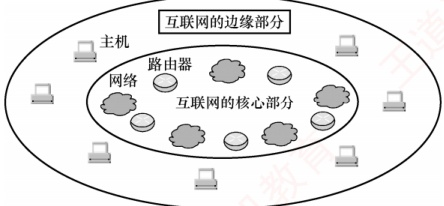

图 1.1 互联网核心部分与边缘部分的示意图

3）从功能组成看，计算机网络由通信子网和资源子网组成。通信子网由传输介质、通信设备及相关网络协议组成，负责数据的传输、交换、控制与存储，实现联网计算机之间的通信。资源子网则是实现资源共享功能的设备及其软件的集合，向用户提供共享其他计算机上的硬件资源、软件资源和数据资源的服务。

### 1.1.3 计算机网络的功能

计算机网络具有多种功能，现今许多应用都依赖于网络的支持。主要有以下五大功能。

#### 1. 数据通信

数据通信是计算机网络最基本且最重要的功能，用来实现联网计算机之间各种信息的传输。例如，文件传输、电子邮件等应用，离开了计算机网络将无法实现。

#### 2. 资源共享

资源共享可以是软件、数据或硬件的共享。它使得网络中的资源能够互通有无、分工协作，从而显著提高硬件资源、软件资源和数据资源的利用率。

#### 3. 分布式处理

当网络中的某个计算机系统负荷过重时，可将其处理的某个复杂任务分配给网络中的其他计算机系统，利用空闲资源来提高整个系统的利用率。

#### 4. 提高可靠性

计算机网络中的各台计算机可以通过网络互为备份。
#### 5. 负载均衡

将工作任务均衡地分配给网络中的各台计算机，避免某些计算机过载而其他计算机闲置。

除了上述主要功能外，计算机网络还支持电子化办公与服务、远程教育、娱乐等功能，满足了社会的多样化需求，方便了人们的学习、工作和生活，并带来了巨大的经济效益。

### 1.1.4 电路交换、报文交换与分组交换

在网络核心部分起关键作用的是路由器（Router），其通过对接收到的分组进行存储转发来实现分组交换。要理解分组交换的原理，需先了解电路交换和报文交换的基本概念。

#### 1. 电路交换

### 考点追踪 电路交换的时延分析（2025）

最典型的电路交换网络是传统电话网。从通信资源分配的角度看，交换是指按照某种方式动态分配传输线路资源。电路交换分为三个阶段：建立连接（占用通信资源）、传输数据（持续占用通信资源）和释放连接（归还通信资源）。在数据传输前，通信双方必须先建立一条专用的端到端物理通路，该通路由沿途的交换设备和链路逐段连接而成。在通信过程中，这条通路始终被双方独占，直至通信结束才释放。图1.2是电路交换的示意图。

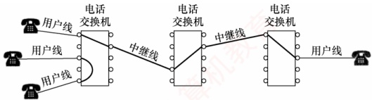

图 1.2 电路交换示意图

电路建立后，除源节点和目的节点外，中间节点仅提供端到端物理通路，比特流连续地从源端直达目的端，如同通过管道传输。因此，电路交换适用于低频次、连续且大量的数据传输。

电路交换技术的优点：

1）通信时延小。通信线路为双方专用，数据直达，传输效率高。

2）有序传输。数据按发送顺序传送，不存在失序问题。

3）没有冲突。不同通信对使用独立信道，不会争用物理信道。

4）实时性强。物理通路一旦建立，双方即可随时通信。

电路交换技术的缺点：

1）建立连接时间长。平均建立连接的时间对计算机通信而言过长。

2）线路利用率低。物理通路被通信双方独占，即使空闲也无法供其他用户使用。

3）灵活性差。通路中任一节点或链路发生故障，都需重新建立新连接。

由于计算机之间的通信通常是突发式（高频、少量）的，若采用电路交换，已被占用的通信线路在大部分时间内处于空闲状态，其利用率往往不足10%，甚至低于1%。

4）难以实现差错控制。中间节点不具备存储和检错能力，无法发现或纠正传输错误。

#### 2. 报文交换

### 考点追踪 报文交换的时延分析（2013、2025）

用户数据附加源地址、目的地址等控制信息后，被封装成报文（Message）。报文交换采用存储转发技术：整个报文先传送到相邻节点，被完整接收并存储后，节点根据转发表将其转发至下
一跳，如此逐跳转发，直至到达目的端。每个报文可独立选择通往目的端的路径。

报文交换技术的优点：

1）无建立和释放连接的时延。通信前无须建立连接，用户可随时发送报文。

2）线路分配灵活。交换节点在存储完整报文后，可选择当前最优空闲链路进行转发；若某条路径发生故障，该节点可动态切换至其他路径。

3）线路利用率高。报文仅在一段链路上传输时才占用这段链路的资源。

4）支持差错控制。交换节点可对缓存中的报文进行差错检验。

报文交换技术的缺点：

1）存储转发时延高。节点必须完整接收整个报文后，才能开始转发。

2）缓存开销大。由于报文大小没有限制，这就要求交换节点配备大容量缓存。

3）错误处理低效。报文越长，出错概率相对更大，重传整个报文的代价较大。

#### 3. 分组交换

### 考点追踪 分组交换的时延分析（2010、2013、2023、2025）

分组交换同样采用存储转发技术，但有效解决了报文交换中因报文过长带来的问题。报文过长时，不仅对交换节点的缓存容量要求较高，差错处理的效率也会降低。源主机在发送前，先将较长的报文划分为若干较小的等长数据段，并在每个数据段前面添加由必要控制信息（如源地址、目的地址、分组编号等）组成的首部，构成分组（Packet），如图1.3所示。

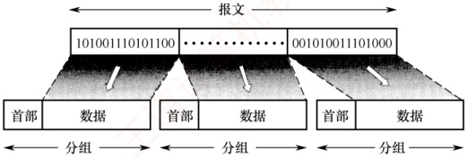

图 1.3 构成分组的过程

源主机将分组发送到分组交换网，网络中的分组交换机（如路由器）收到一个分组后，先将其缓存，然后从首部提取目的地址，据此查找转发表，并将分组转发给下一个分组交换机。经过多个分组交换机的存储转发，分组最终到达目的主机。

分组交换不仅继承了报文交换的诸多优点，还具有以下优势：

1）便于存储管理，转发开销小。由于分组长度固定，缓冲区大小可预设，管理更高效。

2）传输效率高。分组可逐个发送，实现流水线操作，即后一个分组的接收可与前一个分组的转发并行，从而减少整体传输时间。

3）降低出错概率与重传代价。由于分组较短，出错概率也必然减小，重传数据量大幅减少，既提高了可靠性，又降低了传输时延。

分组交换技术的缺点：

1）存在存储转发时延。尽管比报文交换的传输时延小，但相比于电路交换仍存在存储转发时延，且要求节点交换机具备更强的处理能力。

2）需要传输额外的信息量。每个数据段都需附加控制信息以构成分组，使得传送的信息量增大约5%～10%，从而增加了控制复杂度，降低了通信效率。
3）分组可能失序、丢失或重复。当采用数据报服务 $^{①}$时，分组可能经不同路径到达，需在目的主机按编号重排序，处理较为复杂。若采用虚电路服务，虽可避免失序，但需经历建立连接、数据传输和释放连接三个阶段。

图1.4给出了三种交换方式的比较。当需连续传输大量数据，并且传输时间远大于连接建立时间时，采用电路交换更为合适。但从提升网络整体信道利用率角度看，报文交换和分组交换优于电路交换。其中，分组交换时延更小、更灵活，尤其适合突发式数据通信。

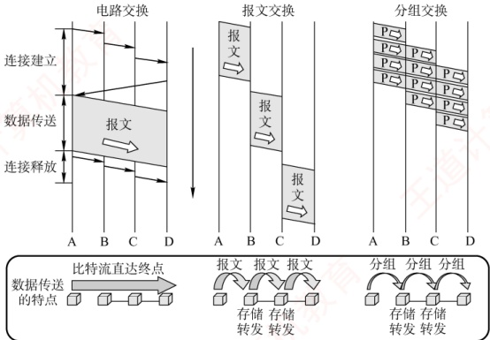

图 1.4 三种交换方式的比较

本书配套视频对三种交换方式的性能进行了详尽分析，其中分组交换网的性能分析是统考高频考点，强烈建议结合视频学习。表1.1总结了三种交换方式的特性对比。

表1.1 三种交换方式的特性对比

| 特性 | 电路交换 | 报文交换 | 分组交换 |
| --- | --- | --- | --- |
| 完成传输所需的时间 | 最少 | 最多 | 较少 |
| 存储转发时延 | 无 | 高 | 较低 |
| 通信前是否需要建立连接？ | 是 | 否 | 否 |
| 节点的缓存开销 | 无 | 高 | 低 |
| 是否支持差错控制？ | 不支持 | 支持 | 支持 |
| 数据是否有序到达？ | 是 | 是 | 否 |
| 是否需要额外的控制信息？ | 否 | 是 | 是（且占比较大） |
| 线路分配的灵活性 | 不灵活 | 灵活 | 非常灵活 |
| 线路利用率 | 低 | 高 | 非常高 |

### 1.1.5 计算机网络的分类

#### 1. 按分布范围分类

1）广域网（WAN）。广域网用于长距离通信，覆盖范围通常为几十至数千千米，常用于构建互联网的骨干部分，其节点交换机间通过高速链路互联，通信容量大。
2）城域网（MAN）。城域网的覆盖范围可跨越几个街区乃至整个城市，直径约为5～50km。目前城域网大多采用以太网技术，因此有时也被归入局域网的讨论范畴。

3）局域网（LAN）。局域网通常将主机通过高速线路互连，覆盖范围较小，一般为几十米到几千米。传统上，局域网采用广播技术，而广域网则采用交换技术。

4）个人区域网（PAN）。个人区域网是指在个人工作或活动区域内，利用无线技术将消费电子设备（如平板电脑、智能手机等）互联而成的网络，也称无线个人区域网（WPAN）。

#### 2. 按传输技术分类

1）广播式网络。所有联网计算机共享一个公共通信信道。当一台计算机通过该信道发送报文分组时，所有其他计算机都能“收听”到该分组，并通过检查目的地址决定是否接收。局域网普遍采用广播式通信；此外，广域网中的无线和卫星通信网络也属于广播式网络。

2）点对点网络。每条物理线路连接一对计算机。若两台主机之间无直接连接，则分组需通过中间节点进行存储转发，直至到达目的主机。

#### 3. 按拓扑结构分类

网络拓扑结构是指网络中节点（如路由器、主机等）与通信线路之间的几何排列关系，主要描述通信子网的结构。常见的拓扑结构包括总线形、星形、环形和网状网络，如图1.5所示。其中，总线形、星形和环形多用于局域网，网状结构则多用于广域网。

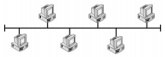

(a) 总线形

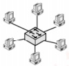

(b) 星形

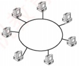

(c) 环形

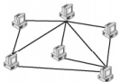

(d) 网状

图 1.5 几种不同的网络拓扑结构

1）总线形网络。使用单根传输线连接所有计算机。优点是建网容易、增减节点方便、节省线路；缺点是重负载下通信效率低，并且总线任意一处故障都会影响全网。

2）星形网络。各终端或计算机通过独立线路连接到中央设备（通常为交换机或路由器）。优点是便于集中控制与管理；缺点是成本较高，且中央设备对故障敏感。

3）环形网络。所有计算机接口设备连接成一个闭合环路，信号沿路环单向传输。典型的例子是令牌环局域网。环可以是单环或双环，以提高可靠性。

4）网状网络。一般情况下，每个节点至少有两条路径与其他节点相连，广泛应用于广域网。

优点是可靠性高、容错能力强；缺点是控制复杂、线路成本高。

上述四种基本拓扑结构可相互组合，构成更复杂的混合网络。

#### 4. 按使用者分类

1）公用网（Public Network）。由电信运营商出资建设，面向公众开放。任何愿意遵守规定并缴纳费用的用户均可接入使用。

2）专用网（Private Network）。由特定单位为满足自身业务需求而建设，仅限内部使用，不对外提供服务。例如铁路、电力、军队等部门的专用网络。

#### 5. 按传输介质分类

传输介质分为有线和无线两大类，相应地，网络可分为有线网络和无线网络。有线网络包括双绞线网络、同轴电缆网络、光纤网络等；无线网络包括蓝牙、Wi-Fi、微波、无线电等类型。
### 1.1.6 计算机网络的性能指标

性能指标从不同方面度量计算机网络的性能。常用的性能指标如下。

1）速率（Speed）。连接到网络上的节点在数字信道上传送数据的速率，也称数据传输速率、数据率或比特率，单位为 bit/s（比特/秒）或 b/s（有时也写作 bps）。当数据率较高时，常用 kb/s（k = 10³）、Mb/s（M = 10⁶）或 Gb/s（G = 10⁹）表示。

**注意**

在描述数据量时，K、M、G常用2的幂次表示，如 $1\mathrm{Kb}=2^{10}\mathrm{b}$；在描述速率时，k、M、G常用10的幂次表示，如 $1\mathrm{kb/s}=10^{3}\mathrm{b/s}$。通常，前者使用大写K，后者使用小写k，但其他前缀均为大写。

2）带宽（Bandwidth）。在通信领域，带宽是指通信线路允许通过的信号频率范围，单位是赫兹（Hz）。但在计算机网络中，带宽表示网络通信线路所能传送数据的能力，指数字信道所能支持的最高数据传输速率，单位为 b/s（比特/秒）。注意，节点间的实际可用带宽由双方网卡的性能、各段链路的带宽以及交换设备速率中的最小值决定。

### 考点追踪 分组交换的吞吐量分析（2024）

3）吞吐量（Throughput）。指单位时间内通过某个网络（或信道、接口）的实际数据量。吞吐量常用于对实际网络进行测量，以评估真实可达到的数据传输能力。

4）时延（Delay）。指数据（一个报文或分组）从网络（或链路）的一端传送到另一端所需的总时间，它由四部分构成：发送时延、传播时延、处理时延和排队时延。

### 考点追踪 网络时延的分析（2010、2013、2023、2025）

发送时延（也称传输时延）。节点将分组的所有比特推入链路所需的时间，即从发送分组的第一个比特开始，到最后一个比特发送完毕为止的时间。

 $$发送时延 = 分组长度 / 发送速率$$

传播时延。电磁波在信道（传输介质）中传播一定距离所需的时间，即一个比特从链路一端传播到另一端所需的时间。

 $$传播时延 = 信道长度 /电磁波在信道上的传播速率$$

**注意**

区分传输时延和传播时延：前者取决于分组长度和发送速率，后者取决于链路距离和传输介质。

处理时延。分组在交换节点为存储转发而进行必要处理所花费的时间。例如，解析分组的首部、进行差错检验或查找路由等。

排队时延。分组在路由器的输入队列或输出队列中等待处理或转发所花费的时间。

因此，数据在网络中经历的总时延为上述四部分之和：

 $$总时延 = 发送时延 + 传播时延 + 处理时延 + 排队时延$$

以图 1.6 所示的分组交换网为例，该网络包含两段链路，其最大传输速率已在图中标注。假设主机 A 向主机 B 发送一个长度为 1000B 的分组，总时延在三种典型场景的分析如下。

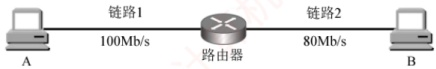

图 1.6 一个简单的分组交换网

① 若忽略传播时延、处理时延和排队时延，则

“A→链路1”的分组发送时延 =1000B÷100Mb/s =0.08ms;

“路由器→链路2”的分组发送时延 =1000B÷80Mb/s =0.1ms;

 $$总时延 =0.08ms+0.1ms=0.18ms,\  如图 1.7(a) 所示。$$

② 若需考虑传播时延，假设链路1和链路2的传播时延分别为0.01ms和0.05ms，则总时延 = 0.01ms + 0.08ms + 0.05ms + 0.1ms = 0.24ms，如图1.7(b)所示。

③ 若还需考虑路由器的处理时延和排队时延，假设这两项时延合计为 0.04ms，则总时延 = 0.01ms + 0.08ms + 0.04ms + 0.05ms + 0.1ms = 0.28ms，如图 1.7(c) 所示。

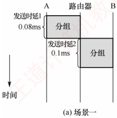

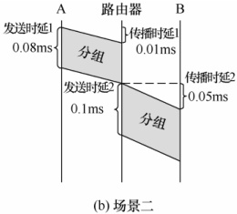

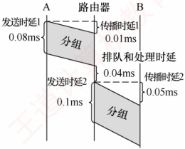

(c) 场景三

图 1.7 三种典型场景下总时延的分析

在考试中，通常无须考虑处理时延和排队时延（除非题目另有说明）。

5）时延带宽积。指发送端发送的第一个比特即将到达接收端时，发送端已发出的比特总数，即已发出但尚未到达接收端的最大比特数，也称以比特为单位的链路长度。

 $$时延带宽积 = 传播时延 \times 信道带宽$$

如图1.8所示，可将链路想象为一条圆柱形管道：其长度表示传播时延，横截面积表示链路带宽，则时延带宽积表示该管道可容纳的比特数量。

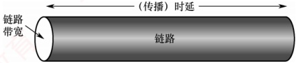

图 1.8 链路就像一条空心管道

6）往返时延（Round-Trip Time，RTT）。指从发送端发出一个短分组，到收到接收端返回的确认信号所经历的总时间。往返时延包括：发送端与接收端之间的往返传播时延；接收端的处理时延；在互联网环境中，还包括各中间节点的处理时延和排队时延。注意，往返时延不包括数据分组本身的发送时延，如图1.9所示。

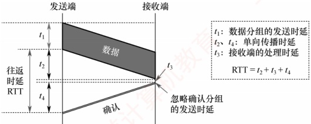

图 1.9 往返时延 RTT 的分析

7）信道利用率。指信道有数据通过的时间占总时间的百分比。

信道利用率 = 有数据通过的时间 / (有数据通过的时间 + 无数据通过的时间)

信道利用率并非越高越好：过低会浪费网络资源；过高则会导致排队时延显著增加，引发网络拥塞。这就好比当公路上的车流量很大时，容易出现拥堵。
