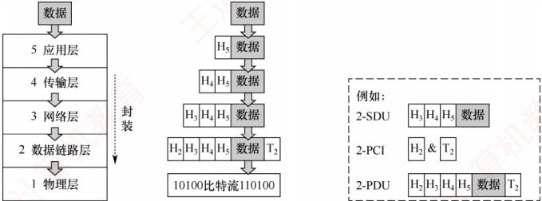
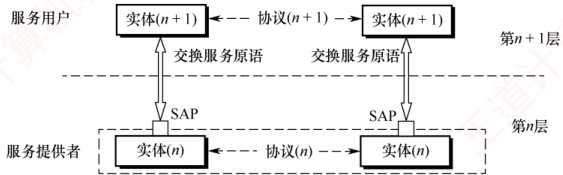
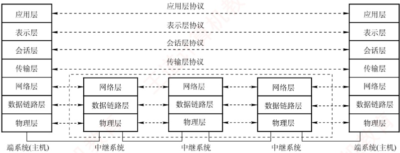
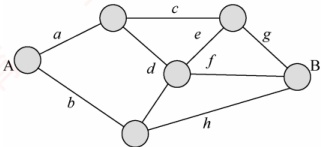
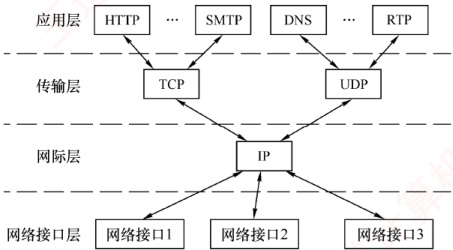
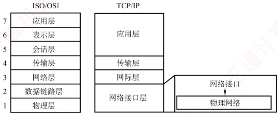
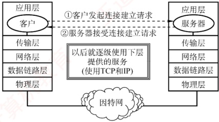
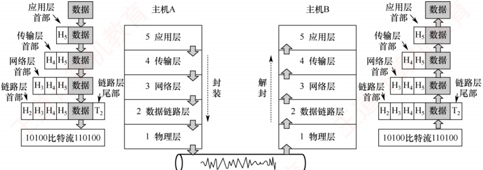

## 1.2 计算机网络体系结构与参考模型

### 1.2.1 计算机网络分层结构

计算机网络是一个非常复杂的系统，因此在早期就采用了分层的设计思想。分层可将庞大而复杂的问题转换为若干较小的局部问题，而这些局部问题更易于研究和处理。

### 考点追踪 ➤ 网络体系结构的概念（2010）

计算机网络的各层及其协议的集合称为网络的体系结构（Architecture）。换言之，计算机网络的体系结构是对该网络及其所应完成功能的精确定义。需要强调的是，这些功能究竟由何种硬件或软件实现，属于实现（Implementation）问题。体系结构是抽象的，而实现是具体的，体现在实际运行的计算机硬件和软件中。计算机网络体系结构通常具有可分层的特性，能将复杂的大系统分解为若干较易实现的层次。

分层的基本原则如下：

1）每层实现一种相对独立的功能，以降低整个系统的复杂度。

2）各层之间的接口清晰、简洁，相互依赖尽可能少，便于理解与维护。

3）各层功能的定义独立于具体实现方法，可采用最合适的技术来实现。

4）保持下层对上层的独立性，上层单向使用下层提供的服务。

5）整个分层结构应有利于标准化工作。

在网络分层结构中，第n层的活动元素通常称为第n层实体。具体而言，实体指任何可发送或接收信息的硬件或软件进程，通常是某个特定的软件模块。不同机器上的同一层称为对等层，同一层的实体互为对等实体。第n层向第n+1层提供的服务，实际上是其自身及以下所有层所提供服务的总和。第n层的实体称为服务提供者，第n+1层的实体称为服务用户。

协议数据单元（PDU）：对等层之间传送的数据单位。第n层的PDU记为n-PDU。各层的PDU均由服务数据单元和协议控制信息两部分组成。

服务数据单元（SDU）：相邻层之间交换的数据单位。第n层的SDU记为n-SDU。

协议控制信息（PCI）：用于控制协议操作的信息。第n层的PCI记为n-PCI。

每层的 PDU 都有其通俗的名称：物理层的 PDU 称为比特流，数据链路层的 PDU 称为帧，
网络层的 PDU 称为 IP 分组，传输层的 PDU 称为 TCP 报文段或 UDP 数据报。

当数据在各层之间传递时，将从第 $n+1$层接收到的PDU作为第n层的SDU，加上第n层的PCI后封装成第n层的PDU，再交由第n-1层作为其SDU发送。接收方收到后做相反的处理。

因此，三者的关系可表示为  $n\text{-SDU} + n\text{-PCI} = n\text{-PDU} = (n-1)\text{-SDU}$，如图 1.10 所示。

图 1.10 网络各层数据单元之间的关系

具体而言，分层结构的含义包括以下几个方面：

1）第 n 层的实体不仅要利用第 n-1 层的服务来实现自身功能，还向第  $n+1$ 层提供本层的服务，该服务是第 n 层及其下面各层所提供服务的总和。

2）最低层只提供服务，是整个层次结构的基础；最高层面向用户提供服务。

3）上层只能通过相邻层的接口使用下层的服务，不能跨层调用。

4）通信时，对等层在逻辑上如同存在一条直接信道，表现为能够直接交换信息。

### 1.2.2 计算机网络协议、服务、接口的概念

#### 1. 协议

要有条不紊地在网络中实现数据交换，就必须遵循一些事先约定好的规则，这些规则规定了所交换数据的格式以及相关的同步问题。为在网络中进行数据交换而建立的这些规则、标准或约定称为网络协议（Network Protocol）。协议是控制对等实体之间通信的规则集合，是水平的。不对等实体之间不存在协议，例如，在使用 TCP/IP 协议栈通信的两个节点 A 和 B，节点 A 的传输层与节点 B 的传输层之间存在协议，但节点 A 的传输层与节点 B 的网络层之间则没有协议。

协议由语法、语义和同步三部分组成。

### 考点追踪 同步的概念（2020）

1）语法。规定数据与控制信息的格式。例如，TCP 报文段的结构由其语法定义。

2）语义。规定需要发出何种控制信息、完成何种动作以及做出何种应答。例如，TCP 连接建立过程中每次握手所执行的操作由其语义定义。

3）同步（或时序）。规定执行各种操作的条件及事件发生的先后顺序。例如，TCP 连接建立过程中三次握手的时序关系由其同步机制定义。

#### 2. 接口

同一节点内相邻两层实体交换信息的逻辑接口称为服务访问点（Service Access Point，SAP）。每层只能与紧邻的上下层定义接口，不允许跨层定义接口。服务是通过 SAP 提供给上层的，第 n 层的 SAP 即为第  $n+1$ 层访问第 n 层服务的入口。
#### 3. 服务

服务是指下层为紧邻的上层提供的功能调用，是垂直的。对等实体在协议的控制下协同工作，使得本层能够向上层提供服务；但要实现本层协议，又必须依赖下层所提供的服务。

需注意，协议与服务在概念上有本质区别。首先，只有本层协议的正确实现，才能保证向上一层提供服务。上层的服务用户只能感知到服务本身，而无法看到底层协议的细节，即下层协议对上层是透明的。其次，协议是水平的，用于规范对等实体之间的通信；服务是垂直的，由下层通过层间接口向上层提供。此外，并非某一层完成的全部功能都能称为服务，只有那些能被上层实体感知并调用的功能，才构成服务。

协议、接口、服务三者之间的关系如图1.11所示。

图 1.11 协议、接口、服务三者之间的关系

计算机网络提供的服务可按以下三种方式分类。

##### （1） 面向连接服务与无连接服务

面向连接服务要求通信双方在传输前先建立连接并分配资源（如缓冲区），传输结束后，释放连接与资源，全过程包括连接建立、数据传输和连接释放三个阶段，以保障通信可靠性。

无连接服务无须预先建立连接，发送方可直接发送包含目的地址的分组，由网络动态选择路径，各分组独立传输。该服务通常称为“尽最大努力交付”，属于不可靠服务。

##### （2） 可靠服务和不可靠服务

可靠服务是指网络具备检错、纠错和应答机制，能确保数据正确、完整、有序地送达目的地。不可靠服务是指网络仅提供“尽最大努力交付”，不保证可靠性。

对于提供不可靠服务的网络，数据的可靠性需由高层保障。例如，接收方校验数据完整性，出错时通知发送方重传，从而通过高层机制将不可靠服务转化为可靠服务。

##### （3） 有应答服务和无应答服务

有应答服务是指接收方在收到数据后，由传输系统自动向发送方返回应答（肯定或否定）。例如，文件传输通常采用有应答服务，以确保数据完整。

无应答服务是指接收方不自动返回应答；若需确认，须由高层协议或应用实现。例如，在WWW服务中，客户端收到网页后通常不向服务器发送应答。

### 1.2.3 OSI 参考模型和 TCP/IP 模型

#### 1. OSI 参考模型

### 考点追踪 OSI 低三层的网络设备及其功能（2016）

国际标准化组织（ISO）提出的网络体系结构模型称为开放系统互连参考模型（OSI/RM），简称OSI参考模型。该模型包含7层，自下而上（第1～7层）依次为：物理层、数据链路层、网络层、传输层、会话层、表示层、应用层。其层次结构如图1.12所示。

图 1.12 OSI 参考模型的层次结构

下面详述各层功能。

### 考点追踪 OSI 参考模型的层次结构（2013、2014、2017、2019）

#### （1） 物理层（Physical Layer）

物理层的传输单位是比特。其功能是在物理介质上为数据端设备透明地传输原始比特流。图1.13展示的是两个通信节点及它们之间的一段通信链路。物理层主要研究以下内容：

图 1.13 两个通信节点及它们之间的一段通信链路

① 通信链路与节点的连接需通过电路接口，物理层规定了接口的机械特性（如形状、尺寸等）和电气特性（如引脚数量与排列等），例如笔记本电脑上的网线接口。

② 物理层还规定了通信链路上的编码意义与电气特征。例如，若约定信号 X 表示比特 0，则发送方发出 X 代表 0，接收方收到 X 即解读为 0。

注意，传输所用的物理介质（如双绞线、光缆、无线信道等）不属于物理层协议范畴，而是位于其下方。因此，有人将物理介质视为“第0层”。

#### （2） 数据链路层（Data Link Layer）

### 考点追踪 OSI 参考模型中数据链路层的功能（2022）

数据链路层的传输单位是帧。主机间的数据传输总是在一段段链路上进行的，数据链路层的主要作用是：将物理层提供的可能出错的物理连接，改造为逻辑上无差错的数据链路，将网络层交来的分组封装成帧，并可靠地传送到相邻节点的网络层，实现节点间的差错控制与流量控制。

• 差错控制：因噪声干扰，传输比特流时可能出错（例如，图1.13中，节点A向B发送的信号由X变为Y，导致比特0被误判为1）。差错控制机制可检测差错并丢弃错误帧。

流量控制：若发送方的发送速率高于接收方的接收速率，如果不加以控制，将导致接收方丢弃来不及接收的帧。流量控制可协调双方的速率，从而提升链路效率。

在广播式网络的数据链路层中，还需解决对共享信道的访问控制问题。

#### （3） 网络层（Network Layer）

网络层的传输单位是数据报（或分组）。其主要任务是将分组从源主机传送到目的主机，为不同主机提供通信服务。核心功能包括：路由选择、拥塞控制、差错控制、流量控制、网际互联等。网络层既提供有连接的虚电路服务，又提供无连接的数据报服务。
**注意**

无论哪一层的协议数据单元，均可笼统称为“分组”。

如图 1.14 所示的网络中，当节点 A 向 B 发送分组时，可能存在多条路径（如 a-c-g、b-h 等）。网络层利用路由算法选择合适路径，确保分组顺利到达目的节点。

图 1.14 某网络结构图

• 流量控制：协调源主机与目的主机的收发速率（与数据链路层的流量控制类似）。

拥塞控制：当网络节点因过载而大量丢弃分组时，网络处于拥塞状态，需采取措施缓解。

差错控制：通过检错机制确保向上层提交的都是无差错的分组，无法纠正则丢弃。

#### （4） 传输层（Transport Layer）

### 考点追踪 OSI 参考模型中传输层的功能（2009）

传输层（又称运输层）负责不同主机中进程之间的端到端通信，提供连接管理、可靠传输、流量控制、差错控制等服务。OSI 参考模型的传输层仅提供面向连接的可靠服务。

需要注意的是，数据链路层实现节点到节点通信（基于 MAC 地址），网络层实现主机到主机通信（基于 IP 地址），而传输层实现端到端通信（基于端口号）。

由于一台主机可同时运行多个进程，传输层需具备复用与分用的功能：复用是指多个应用进程可同时使用传输层的服务，分用是指传输层能将接收到的数据准确交付给对应的上层进程。

#### （5） 会话层（Session Layer）

### 考点追踪 OSI 参考模型中会话层的功能（2019）

会话层管理不同主机上进程之间的会话（Session），包括建立、维护和终止会话连接。它为表示层或用户进程提供同步机制（SYN），支持在连接上有序地传输数据，并引入检查点功能，即当通信中断时，可从最近的检查点恢复会话，实现类似“断点续传”的可靠性。

#### （6） 表示层（Presentation Layer）

### 考点追踪 OSI 参考模型中表示层的功能（2013）

表示层解决异构系统间信息表示不一致的问题。它采用标准抽象语法定义数据结构，并通过标准编码（如 ASN.1）实现跨平台数据交换。此外，数据压缩、加密与解密也由该层处理。

#### （7） 应用层（Application Layer）

应用层是 OSI 参考模型的最高层，作为用户与网络的接口，为各类网络应用（如文件传输、邮件、浏览）提供访问网络环境的手段。由于应用类型多样，应用层协议最为丰富且复杂。

OSI 参考模型各层次的功能是统考高频考点，表 1.2 给出了其各层的任务和功能对比。
表1.2 OSI参考模型各层的任务和功能对比

| 层 | 功能 |
| --- | --- |
| 应用层 | 提供应用与网络的接口 |
| 表示层 | 数据格式转换 |
| 会话层 | 会话管理 |
| 传输层 | 复用和分用、差错控制、流量控制、连接管理、可靠传输管理 |
| 网络层 | 路由选择、拥塞控制、网际互联、差错控制、流量控制、连接管理、可靠传输管理 |
| 数据链路层 | 差错控制、流量控制 |
| 物理层 | 定义电路接口参数、信号的含义/电气特性等 |

#### 2. TCP/IP 模型

### 考点追踪 TCP/IP 模型的层次结构（2021）

TCP/IP 模型从低到高依次为：网络接口层（对应 OSI 参考模型的物理层和数据链路层）、

图 1.15 TCP/IP 模型的层次结构及各层的主要协议

网际层、传输层和应用层（对应OSI参考模型的会话层、表示层和应用层）。因其广泛应用，TCP/IP模型已成为事实上的国际标准。其层次结构及各层的主要协议如图1.15所示。

网络接口层的功能类似于 OSI 参考模型的物理层和数据链路层，其作用是从主机或节点接收 IP 分组，并将其发送到指定的物理网络上。TCP/IP 模型并未规定该层的具体功能或协议细节，仅要求主机能通过某种底层协议接入网络以传送 IP 分组。实际使用的物理网络可以是各类局域网（如以太

网、无线局域网等），也可以是电话网、广域网等。

### 考点追踪 ▶️ TCP/IP 模型中网际层的功能（2011、2021）

网际层是 TCP/IP 体系结构的核心部分，功能上与 OSI 参考模型的网络层非常相似。它负责将分组发往任意网络，并为每个分组独立选择路由，但不保证分组有序到达，分组的有序性和可靠性由高层（如传输层）负责。网际层的核心协议是网际协议（IP），提供无连接、不可靠的服务，其传输单位为 IP 数据报。当前广泛使用的版本是 IPv4，其下一个版本是 IPv6。网际层还包括地址解析协议（ARP）、网际控制报文协议（ICMP）和网际组管理协议（IGMP）等辅助协议。

传输层的功能同样与 OSI 参考模型的传输层类似，旨在实现发送端与接收端主机上对等进程之间的逻辑通信。传输层主要采用两种协议：

1）传输控制协议（Transmission Control Protocol，TCP）。它是面向连接的，传输之前需先建立连接，提供可靠交付，数据传输的单位为报文段。

2）用户数据报协议（User Datagram Protocol，UDP）。它是无连接的，不保证可靠性，仅提供“尽最大努力交付”，数据传输的单位为用户数据报。

应用层（用户-用户）集成了 OSI 参考模型中会话层、表示层和应用层的功能，包含所有高层协议，例如，文件传输协议（FTP）、域名解析服务（DNS）和超文本传输协议（HTTP）等。

由图 1.15 可见，IP 是互联网的核心协议。TCP/IP 体系体现了两大设计哲学：Everything over
IP，即各种应用均可构建于 IP 之上；IP over Everything，即 IP 可运行于任意底层网络之上。正是这种高度的通用性与灵活性，推动了互联网发展至今日的规模。

#### 3. TCP/IP 模型与 OSI 参考模型的比较

TCP/IP 模型与 OSI 参考模型有许多相似之处。

首先，二者均采用分层体系结构，且各层功能大体相似。

其次，二者均基于独立协议栈的概念。

最后，二者均可解决异构网络互联问题，实现不同厂商生产的计算机之间的通信。

TCP/IP 模型与 OSI 参考模型的层次对应关系如图 1.16 所示。

图 1.16 TCP/IP 模型与 OSI 参考模型的层次对应关系

尽管有这些相似之处，两个模型在设计理念与结构上仍有显著差异。

第一，OSI 参考模型的最大贡献在于精确定义了“服务”“协议”“接口”这三个核心概念，其分层思想与现代面向对象程序设计高度契合；而 TCP/IP 模型对这三者未做明确区分。

第二，OSI 参考模型是一个 7 层模型，而 TCP/IP 模型采用 4 层结构：它将 OSI 参考模型中的表示层和会话层功能合并为应用层，同时将物理层与数据链路层合并为网络接口层。

第三，OSI 参考模型先有模型，后制定具体协议，通用性良好，适合描述各类网络。TCP/IP 模型正好相反，即先有协议栈，后归纳出模型，因此不适用于任何其他的非 TCP/IP 模型。

第四，OSI 参考模型在网络层同时支持无连接和面向连接的通信模式，但在传输层仅提供面向连接的服务；而 TCP/IP 模型认为可靠性应由端到端机制保障，因此其网际层仅提供无连接服务，而传输层则同时支持无连接（UDP）和面向连接（TCP）两种模式。

OSI 参考模型与 TCP/IP 模型均非完美，二者都曾受到诸多批评。OSI 参考模型的设计者从一开始就致力于构建一个全球统一的计算机网络标准。从技术角度看，这种对理想化架构

的追求，导致其软件实现结构复杂、运行效率低下。加之缺乏市场与商业驱动力，最终使其未能实现预期目标。相比之下，TCP/IP 模型凭借简洁高效的设计，在实际应用中占据了主导地位。

为了兼顾理论与实践，学习计算机网络时，通常采用一种5层协议体系结构，如图1.17所示，该结构融合了OSI参考模型和TCP/IP模型的优点。本书也将采用此结构进行讨论。

图 1.17 网络 5 层协议的体系结构模型

### 考点追踪 应用层数据的逐层封装过程（2021）

最后，简单介绍使用协议栈进行通信的过程，如图1.18所示。每个协议栈的顶端是一个面向用户的接口。用户首先将数据交给本主机的应用层，应用层加上必要的控制信息，组成应用层的PDU；然后下放到传输层，作为传输层的SDU，加上传输层的PCI，组成传输层的PDU；接着下放到网络层，组成网络层的SDU，加上网络层的PCI，再次组成网络层的PDU；继续下放到数据链路层……如此层层下放，层层封装，最终形成的数据帧（或数据包）经过物理链路传输。到达接收方节点后，协议栈逆向逐层拆开“包裹”，并将收到的数据递交给用户。

图 1.18 协议栈的通信过程示例
