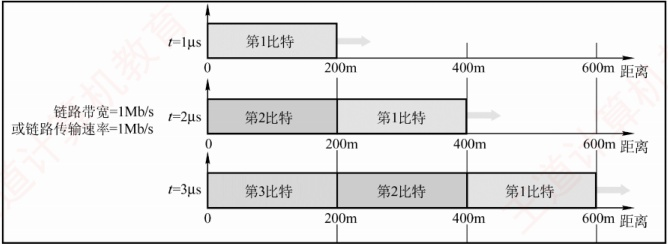

## 1.3 本章小结及疑难点

1. 互联网使用的 IP 是无连接的，因此其传输是不可靠的。这容易让人觉得互联网很不可靠。
为什么当初不把互联网的传输设计为可靠的呢？

传统电信网主要用于电话通信，而普通电话机是“哑终端”（不具备智能处理能力），因此电信公司必须将网络本身设计得高度可靠，以保障通信质量。

数据传输显然需要可靠性。但在设计 ARPAnet（互联网的前身）时，一个关键争论是“谁应该负责保证传输的可靠性？”一种观点认为，应像电信网那样，由通信网络本身确保可靠传输——毕竟当时的技术已能构建高可靠的网络。另一种观点则主张，由用户主机（端系统）来负责可靠性，理由是这样可以让网络结构更简单、成本更低、扩展性更强。

计算机网络的先驱们注意到，计算机与电话机有本质区别：计算机是智能终端，具备强大的处理能力。因此，他们最终采纳了端到端可靠传输的设计哲学：在网络层使用简单、无连接、不可靠的IP协议，而在传输层通过面向连接的TCP协议实现端到端的可靠性。

这样既降低了网络基础设施的复杂性和成本，又确保了应用所需的可靠通信。

2. 端到端通信和点到点通信有什么区别？

本质上，由物理层、数据链路层和网络层构成的通信子网负责提供主机到主机的通信服务，而传输层则负责为主机上的应用进程提供端到端的通信服务。

点到点通信指的是主机到主机之间的数据传递，不涉及具体的应用进程。它只负责将数据从一台主机传送到另一台主机，但无法识别是哪两个进程在通信——这一任务由更高层完成。

端到端通信建立在点到点通信的基础之上，通过多段点到点链路串联，最终实现不同主机上应用进程之间的通信。这里的“端”指的是应用进程的端口，而端口号用于标识应用层中的不同进程。因此，端到端通信真正面向的是用户程序之间的交互，而非仅仅是机器之间的连接。

3. 如何理解传输速率和传播速率？

传输速率是指主机或路由器在数字信道上发送数据的速率，单位是比特/秒（b/s）。

传播速率是指电磁波在物理介质中向前传播的速度，单位是米/秒（m/s）。

例如，在图 1.19 中，假定链路的传播速率为  $2 \times 10^8 \, \text{m/s}$，即电磁波  $1\,\mu\text{s}$ 可向前传播 200m。若链路带宽为  $1\,\text{Mb/s}$，则主机  $1\,\mu\text{s}$ 可向链路发送 1 比特数据。

图 1.19 传输速率与传播速率的区别

在 t=0 时，开始发送数据；

到  $t=1\mu s$ 时，第一个比特已沿链路传播约 200m；

到  $t=2\mu s$ 时，第二个比特发出，第一个比特到达 400m 处；

到  $t=3\mu s$ 时，第三个比特发出，第一个比特到达 600m 处。

由此可见：链路上同时存在多少比特，取决于传输速率（带宽）；而每个比特在某一时刻位于何处，取决于传播速率。
