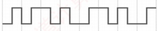
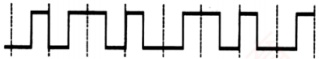
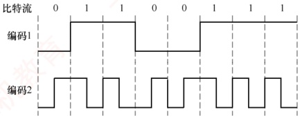
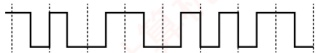
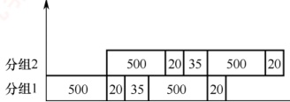

### 2.1.4 本节习题精选

#### 一、 单项选择题

##### 01

下列关于通信基础的基本概念的说法中，正确的是（）。

A. 信道与通信电路类似，一条可通信的电路往往包含一个信道

B. 调制是指把模拟数据转换为数字信号的过程

C. 信息传输速率是指通信信道上每秒传输的码元数

D. 在数值上，波特率等于比特率与每符号所含的比特数的比值
##### 02

影响信道最大传输速率的因素主要有（）。

A. 信道带宽和信噪比

B. 码元传输速率和噪声功率

C. 频率特性和带宽

D. 发送功率和噪声功率

##### 03

（）被用于计算机内部的数据传输。

A. 串行传输 B. 并行传输 C. 同步传输 D. 异步传输

##### 04

下列有关曼彻斯特编码的叙述中，正确的是（）。

A. 每个信号起始边界作为时钟信号有利于同步

B. 将时钟与数据取值都包含在信号中

C. 这种编码机制特别适合传输模拟数据

D. 每位的中间不跳变表示信号的取值为0

##### 05

在数据通信中使用曼彻斯特编码的主要原因是（）。

A. 实现对通信过程中传输错误的恢复 B. 实现对通信过程中收发双方的数据同步 C. 提高对数据的有效传输速率 D. 提高传输信号的抗干扰能力

##### 06

不含同步信息的编码是（）。

Ⅰ. 非归零编码 Ⅱ. 曼彻斯特编码 Ⅲ. 差分曼彻斯特编码

A. 仅 I B. 仅 II C. 仅 II、III D. I、II、III

##### 07

某信道的波特率为 1000Baud，若令其数据传输速率达到 4kb/s，则一个信号码元所取的有效离散值个数为（）。

A. 2 B. 4 C. 8 D. 16

##### 08

下图是某比特串的曼彻斯特编码信号波形，则该比特串为（）。

A. 0011 0110 B. 1010 1101 C. 0101 0010 D. 1100 0101

##### 09

已知某信道的信息传输速率为 64kb/s，一个载波信号码元有 4 个有效离散值，则该信道的波特率为（）。

A. 16kBaud B. 32kBaud C. 64kBaud D. 128kBaud

##### 10

有一个九噪声的 8kHz 信道，每个信号包含 8 级，每秒采样 24k 次，那么可以获得的最大传输速率是（）。

A. 24kb/s

B. 32kb/s

C. 48kb/s

D. 72kb/s

##### 11

对于某带宽为  $4000 \, Hz$ 的低通信道，采用 16 种不同的物理状态来表示数据。按照奈奎斯特定理，信道的最大传输速率是（）。

A. 4kb/s B. 8kb/s C. 16kb/s D. 32kb/s

##### 12

二进制信号在信噪比为 127:1 的 4kHz 信道上传输，最大数据传输速率可以达到（）。

A. 28000b/s B. 8000b/s C. 4000b/s D. 无限大

##### 13

电话系统的典型参数是信道带宽为 3000Hz，信噪比为 30dB，该系统的最大数据传输速率为（）。

A. 3kb/s B. 6kb/s C. 30kb/s D. 64kb/s

##### 14

一个信道的信号功率是 0.14W，噪声功率是 0.02W，频率范围为 3.5～3.9MHz，则该信道的最高数据传输速率是（）。

A. 1.2Mb/s

B. 2.4Mb/s

C. 11.7Mb/s

D. 23.4Mb/s
##### 15

采用 8 种相位，每种相位各有两种幅度的 QAM 调制方法，在 1200Baud 的信息传输速率下能达到的数据传输速率为（）。

A. 2400b/s B. 3600b/s C. 9600b/s D. 4800b/s

##### 16

一个信道每1/8s采样一次，传输信号共有16种变化状态，最大数据传输速率是（）。

A. 16b/s B. 32b/s C. 48b/s D. 64b/s

##### 17

某信道的带宽为 10MHz，信噪比为 30dB，采用 QAM-32 调制方案。若将带宽提高到 20MHz，信噪比提高到 40dB，则信道的极限数据传输速率大约提高到原来的（）倍。

A. 2 B. 2.2 C. 2.4 D. 2.6

##### 18

【2009 统考真题】在无噪声的情况下，若某个通信链路的带宽为 3kHz，采用 4 个相位，每个相位具有 4 种幅度的 QAM 调制技术，则该通信链路的最大数据传输速率是（）。

A. 12kb/s

B. 24kb/s

C. 48kb/s

D. 96kb/s

##### 19

【2011 统考真题】若某个通信链路的数据传输速率为 2400b/s，采用 4 个相位调制，则该链路的波特率是（）。

A. 600Baud

B. 1200Baud

C. 4800Baud

D. 9600Baud

##### 20

【2013 统考真题】下图为 10Base-T 网卡接收到的信号波形，则该网卡收到的比特串是（）。

A. 0011 0110

C. 0101 0010

B. 1010 1101

D. 1100 0101

##### 21

【2014 统考真题】在下列因素中，不影响信道数据传输速率的是（）。

A. 信噪比 B. 频率带宽 C. 调制速率 D. 信号传播速度

##### 22

【2015 统考真题】使用两种编码方案对比特流 01100111 进行编码的结果如下图所示，编码1和编码2分别是（）。

A. NRZ 编码和曼彻斯特编码

B. NRZ 编码和差分曼彻斯特编码

C. NRZI 编码和曼彻斯特编码

D. NRZI 编码和差分曼彻斯特编码

##### 23

【2016统考真题】如下图所示，若连接R2和R3链路的频带宽度为8kHz，信噪比为30dB，该链路实际数据传输速率约为理论最大数据传输速率的50%，则该链路的实际数据传输速率约为（）。

A. 8kb/s B. 20kb/s C. 40kb/s D. 80kb/s

##### 24

【2017 统考真题】若信道在无噪声情况下的极限数据传输速率不小于信噪比为 30dB 条件下的极限数据传输速率，则信号状态数至少是（）。

A. 4 B. 8 C. 16 D. 32
##### 25

【2021 统考真题】下图为一段差分曼彻斯特编码信号波形，该编码的二进制串是（）。

A. 1011 1001 B. 1101 0001 C. 0010 1110 D. 1011 0110

##### 26

【2022 统考真题】在一条带宽为  $200 \, kHz$ 的无噪声信道上，若采用 4 个幅值的 ASK 调制，则该信道的最大数据传输速率是（）。

A. 200kb/s B. 400kb/s C. 800kb/s D. 1600kb/s

##### 27

【2023 统考真题】某个无噪声理想信道带宽为 4MHz，采用 QAM 调制，若该信道的最大数据传输速率是 48Mb/s，则该信道采用的 QAM 调制方案是（）。

A. QAM-16 B. QAM-32 C. QAM-64 D. QAM-128

##### 28

【2024 统考真题】在下列二进制数字调制方法中，需要 2 个不同频率载波的是（）。

A. ASK B. PSK C. FSK D. DPSK

#### 二、 综合应用题

##### 01

如下图所示，主机 A 和 B 都通过 10Mb/s 的链路连接到交换机 S。

每条链路上的传播时延都是  $20\mu s$。S 是一个存储转发设备，它在接收完一个分组  $35\mu s$ 后开始转发收到的分组。试计算将 10000 比特从 A 发送到 B 所需的总时间。

1）作为单个分组。

2）作为两个5000比特的分组一个紧接着另一个发送。

##### 02

一个分组交换网采用虚电路方式转发分组，分组的首部和数据部分分别为 h 位和 p 位。现有  $L (L \gg p$ 且 L 为 p 的倍数) 位的报文通过该网络传送，源点和终点之间的线路数为 k，每条线路上的传播时延为 d 秒，数据传输速率为 b b/s，虚电路建立连接的时间为 s 秒，每个中间节点有 m 秒的平均处理时延。求源点开始发送数据直至终点收到全部数据所需的时间。

### 2.1.5 答案与解析

#### 一、 单项选择题

##### 01

D

信道不等于通信电路，一条可双向通信的电路往往包含两个信道：一个是发送信道，一个是接收信道。另外，多个通信用户共用通信电路时，每个用户在该通信电路都有一个信道，因此选项A错误。调制是将数据转换为模拟信号的过程，选项B错误。选项C明显错误。“比特率”在数值上和“波特率”的关系如下：波特率=比特率/每符号所含的比特数，选项D正确。

##### 02

A

根据香农定理，影响信道最大传输速率的因素主要有信道带宽和信噪比，而信噪比与信道内所传输的平均信号功率和噪声功率有关，数值上等于二者之比。

##### 03

B

并行传输的特点：距离短、速度快。串行传输的特点：距离长、速度慢。因此，在计算机内部（距离短）传输时应选择并行传输。同步、异步传输是通信方式，而不是传输方式。

##### 04

B

曼彻斯特编码将时钟和数据包含在信号中，在传输数据的同时，也将时钟一起传输给对方，码
元中间的跳变作为时钟信号，不同的跳变方式作为数据信号，选项 A 错误、选项 B 正确。每个码元的中间都发生电平跳变，选项 D 错误。曼彻斯特编码最适合传输二进制数字信号，选项 C 错误。

##### 05

B

曼彻斯特编码用码元中间的电平跳变来表示每个比特，可方便收发双方根据跳变来同步时钟，而不需要额外的时钟信号，选项B正确。

##### 06

A

非归零编码是最简单的一种编码方式，它用低电平表示 0，用高电平表示 1，或者采用相反的表示方式。因为各个码元之间并没有间隔标志，所以不包含同步信息。曼彻斯特编码和差分曼彻斯特编码都将每个码元分成两个相等的时间间隔，码元的中间跳变也作为收发双方的同步信息，因此不需要额外的同步信息，实际应用较多，但它们所占的频带宽度是原始基带宽度的 2 倍。

##### 07

D

比特率=波特率×log₂n，若一个码元含有 k 比特的信息量，则表示该码元所需的不同离散值为  $n=2^k$ 个。波特率数值上等于比特率/每符号所含的比特数，因此每码元所含比特数 = 4000/1000 = 4，有效离散值的个数为  $2^4 = 16$。

##### 08

A

在曼彻斯特编码中，可用向下跳变表示 1，向上跳变表示 0，或者采用相反的表示。因此，该比特串可能是 0011 0110 或 1100 1001，因此选择选项 A。

##### 09

B

一个码元若取  $2^n$ 个不同的离散值，则含有  $n$ 比特的信息量。本题中，一个码元所含的信息量为 2 比特，因为数值上波特率 = 比特率 / 每符号所含的比特数，所以波特率为  $(64/2)k = 32k\text{Baud}$。

##### 10

C

无噪声的信号应该满足奈奎斯特定理，即最大数据传输速率 = 2W log₂V 比特/秒。将题中的数据代入，得到答案是 48kb/s。注意题中给出的每秒采样 24kHz 是无意义的，因为超过了波特率的上限 2W = 16kBaud，所以选项 D 是错误答案。

##### 11

D

根据奈奎斯特定理，题中  $W = 4000\text{Hz}$，最大码元传输速率  $=2W = 8000\text{Baud}$，16 种不同的物理状态可以表示  $\log_2 16 = 4$ 比特的数据，因此信道的最大传输速率  $=8000 \times 4 = 32\text{kb/s}$。

##### 12

B

根据香农定理，最大数据率=Wlog₂(1 + S/N) = 4000×log₂(1 + 127) = 28000b/s，容易误选 A。注意题中“二进制信号”的限制后，依据奈奎斯特定理，最大数据传输速率 = 2Hlog₂V = 2×4000×log₂2 = 8000b/s，两个上限中取小者，因此答案为 B。

**注意**

若给出了码元与比特数之间的关系，则需受两个公式的共同限制。关于香农定理和奈奎斯特定理的比较，请参考本章中的疑难点。

##### 13

C

信噪比 S/N 常用分贝（dB）表示，数值上等于  $10\log_{10}(S/N)$ dB。依题意有  $30 = 10\log_{10}(S/N)$，解出 S/N = 1000。根据香农定理，最大数据传输速率  $= 3000\log_2(1 + S/N) \approx 30$ kb/s。

##### 14

A

带宽受限且有噪声的信道应使用香农定理。最高数据传输速率= $W\log_{2}(1+S/N)$，其中，信道带
宽  $W = 3.9 - 3.5 = 0.4 \, \text{MHz}$，信号功率  $S = 0.14 \, \text{W}$，噪声功率  $N = 0.02 \, \text{W}$，代入得  $1.2 \, \text{Mb/s}$。

##### 15

D

每个信号有  $8 \times 2 = 16$ 种变化，每个码元携带  $\log_{2}16 = 4$ 比特信息，则信息传输速率为  $1200 \times 4 = 4800 \, \text{b/s}$。

##### 16

B

由题意知采样率为 8Hz。有 16 种变化状态的信号可携带 4 比特的数据，因此最大数据传输速率为  $8 \times 4 = 32b/s$。

##### 17

A

本题给出了信道带宽、信噪比和编码方式，需要综合奈氏准则与香农定理的限制。在原始条件下：香农定理的极限速率为  $10 \times \log_2 1001 \approx 100 \text{Mb/s}$（注意，这里的信噪比应使用无单位记法），奈式准则的极限速率为  $2 \times 10 \times \log_2 32 = 100 \text{Mb/s}$。带宽和信噪比提升后：香农定理的极限速率为  $20 \times \log_2 10001 \approx 260 \text{Mb/s}$，奈式准则的极限速率为  $2 \times 20 \times \log_2 32 = 200 \text{Mb/s}$。由于实际速率受限于二者中的较小值，故提升后的极限速率为  $200 \text{Mb/s}$，约为原来的 2 倍。

##### 18

B

采用 4 个相位，每个相位有 4 种幅度的 QAM 调制，共有 16 种信号状态，每个码元可携带  $\log_{2}16 = 4$ 比特信息。根据奈奎斯特定理，最大传输速率为  $2W \times \log_2 V = 2 \times 3k \times 4 = 24\text{kb/s}$。

##### 19

B

波特率（B）与数据传输速率（C）的关系为  $C = B \times \log_2 V$，其中  $V$ 为码元可取的离散值个数。采用 4 种相位调制，即  $V = 4$，每个码元携带  $\log_2 V = \log_2 4 = 2$ 比特信息。因此，波特率 = 数据传输速率/每个码元所含的比特数 = 2400/2 = 1200 波特。

##### 20

A

10Base-T 以太网采用曼彻斯特编码：每个码元中间有一次跳变，从低到高表示 0，从高到低表示 1（或采用相反的约定，但需保持一致）。图示波形对应的比特串可为 0011 0110 或 1100 1001。

##### 21

D

由香农定理可知，信道极限数据传输速率受信噪比和频率带宽限制；调制速率（波特率）也直接影响数据速率。而信号传播速率仅决定传播时延，与传输速率无关，不影响信道数据传输速率。

##### 22

A

编码1为典型的NRZ编码：高电平表示1，低电平表示0，无跳变。编码2在每个比特周期中间均有跳变，高-低表示1，低-高表示0，符合曼彻斯特编码特征。差分曼彻斯特编码在比特周期起始处有跳变表示0，无跳变表示1，与图不符。因此，编码1和编码2分别为NRZ编码和曼彻斯特编码。

##### 23

C

采用分贝（dB）记法时，信噪比 = 10log₁₀(S/N) = 30，解得 S/N = 1000。由香农定理可知，理论极限速率 = W×log₂(1 + S/N) = 8k×log₂(1 + 1000)。由于 2¹⁰ = 1024 ≈ 1001，故 log₂(1001) ≈ 10，理论速率 ≈ 8×10 = 80kb/s。实际速率为理论值的 50%，即 80×50% = 40kb/s。

##### 24

D

设信号状态数为  $V$。无噪声信道的极限速率（奈奎斯特定理）为  $2W\log_2 V$；有噪声信道的极限速率（香农定理）为  $W\log_2(1 + S/N)$。已知信噪比为 30dB，可得  $S/N = 1000$，要求： $2W\log_2 V \geq W\log_2(1001) \approx W \times 10$，化简得  $\log_2 V \geq 5$，求得  $V \geq 32$。因此，信号状态数至少为 32。

##### 25

A

差分曼彻斯特编码规则：每个比特周期起始处有电平跳变表示0，无电平跳变表示1。第1
位无跳变（1），第2位有跳变（0），第3位无跳变（1），第4位无跳变（1），第5位有跳变（0），第6位有跳变（0），第7位有跳变（0），第8位无跳变（1），得到比特串为10111001。

##### 26

C

在 ASK 调制中，4 个幅值表示 4 种信号状态（ $V=4$），每个码元携带  $\log_2 4 = 2$ 比特。根据奈奎斯特定理，最大数据传输速率  $=2W\log_2 V$，已知带宽  $W = 200\text{kHz}$，代入得 800kb/s。

##### 27

C

由奈奎斯特定理：最大数据传输速率 =2Wlog₂V，V表示码元的信号状态数。已知带宽 W = 4MHz，最大速率为 48Mb/s，代入得 log₂V = 6，求得 V = 2⁶ = 64，即采用 QAM-64 调制。

##### 28

C

FSK（Frequency Shift Keying，频移键控）使用两个不同频率的载波分别表示0和1，是唯一需要两个载波频率的二进制调制方式。ASK（Amplitude Shift Keying，幅移键控）改变幅度，PSK（Phase Shift Keying，相移键控）和DPSK（差分相移键控）改变相位，均使用单一频率载波。

#### 二、 综合应用题

##### 01

【解答】

1）每条链路的发送时延是 $10000 / (10\text{Mb/s}) = 1000\mu\text{s}$。

总传送时间等于  $2 \times 1000 + 2 \times 20 + 35 = 2075\mu s$。

2）解法一：作为两个分组发送时，下面列出了各种事件发生的时间表。

T=0 开始

T=500 A 完成分组1的发送，开始发送分组2

T=520 分组1完全到达S

T=555 分组1从S起程前往B

T=1000 A 结束分组2的发送

T=1055 分组2从S起程前往B

T=1075 分组2的第1位开始到达B

T=1575 分组2的最后1位到达B

解法二：此题属于分组交换各个过程中时间不等长的情况，类似于流水段不等长的情况，为避免出错，建议画出对应的时空图。

根据题意可分为 5 个流水段，各流水段的时间分别为  $500\mu s$、 $20\mu s$、 $35\mu s$、 $500\mu s$、 $20\mu s$，共有 2 个分组，注意 **不同分组的相同流水段不能重叠**，画出的时空图如下图所示。本题只有 2 个分组，不用流水线的方法也可求得结果，但当分组数量更多时，采用流水线的方法并画出时空图得出计算规律，才不容易出错。

##### 02

【解答】

整个传输过程的总时延 = 连接建立时延 + 源点发送时延 + 中间节点的发送时延 + 中间节点的处理时延 + 传播时延。

虚电路的建立时延已给出，为s秒。

源点要将 L 位报文分割成分组，分组数 = L/p，每个分组的长度为  $(h + p)$，源点要发送的数据
量 $=(h+p)L/p$，因此源点的发送时延 $(h+p)L/(pb)$秒。

每个中间节点的发送时延 $=(h+p)/b$秒，源点和终点之间的线路数为k，有k-1个中间节点，因此中间节点的发送时延 $=(h+p)(k-1)/b$秒。

中间节点的处理时延= $m(k-1)$秒，传播时延= $kd$秒。因此，源节点开始发送数据直至终点收到全部数据所需的时间= $s+(h+p)L/(pb)+(h+p)(k-1)/b+m(k-1)+kd$秒。
