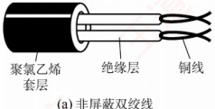
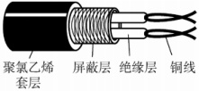
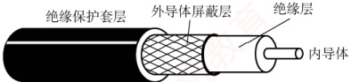
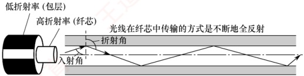
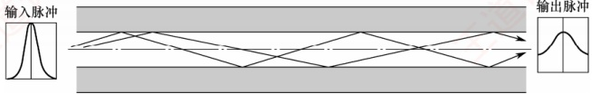
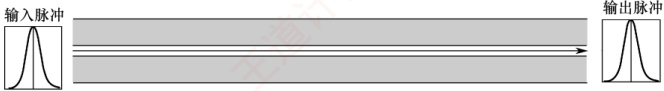

## 2.2 传输介质

### 2.2.1 双绞线、同轴电缆、光纤与无线传输介质

传输介质也称传输媒体，是数据传输系统中发送器和接收器之间的物理通路。传输介质可分为两类：①导向传输介质，如铜线或光纤等，电磁波被约束沿固体介质传播；②非导向传输介质，如自由空间（空气、真空或海水），电磁波在其中的传播称为无线传输。

#### 1. 双绞线

双绞线是最常用的传输介质，在局域网和传统电话网中广泛使用。它由两根相互绝缘、按一定规则绞合在一起的铜导线组成。绞合结构可有效减少相邻导线间的电磁干扰。为进一步提升抗干扰能力，可在双绞线外加一层金属丝编织的屏蔽层，称为屏蔽双绞线（STP）；无屏蔽层的则称为非屏蔽双绞线（UTP）。双绞线的结构如图2.5所示。

双绞线价格低廉，既可用于模拟传输，也可用于数字传输，通信距离通常为几千米至数十千米。其带宽取决于铜线的粗细和传输的距离。距离太远时，对于模拟传输，要用放大器放大衰减的信号；对于数字传输，要用中继器来对失真的信号进行整形。

(a)非屏蔽双绞线

(b) 屏蔽双绞线

图2.5 双绞线的结构

#### 2. 同轴电缆

同轴电缆由内导体、绝缘层、外导体屏蔽层和绝缘保护套层构成，如图2.6所示。通常分为两类：①50Ω同轴电缆，主要用于基带数字信号传输，曾广泛应用于早期局域网；②75Ω同轴电缆，主要用于宽带信号传输，广泛应用于有线电视系统。得益于外导体的屏蔽作用，同轴电缆具有良好的抗干扰性能，适合较高速率的数据传输。

随着交换技术和集线器的普及，局域网领域已基本采用双绞线作为主流传输介质。

图2.6 同轴电缆的结构

#### 3. 光纤

光纤通信利用光导纤维（简称光纤）传输光脉冲来传递通信：有光脉冲表示1，无光脉冲表
示0。可见光的频率约为 $10^{14} MHz$，因此光纤系统具有极大的带宽潜力。

光纤主要由纤芯和包层构成（见图2.7）。纤芯直径极细，通常为8～100μm；包层的折射率略低于纤芯，光波通过纤芯进行传导。当光从高折射率介质射向低折射率介质时，若入射角大于临界角，将会发生全反射，使光线在纤芯与包层界面反复反射而向前传播。

图2.7 光波在纤芯中的传播

利用全反射原理，允许多条不同角度入射的光线在同一根光纤中传输的类型称为多模光纤（见图2.8）。光脉冲在多模光纤中的损耗较大，因此更适合短距离通信。

图2.8 多模光纤

当光纤直径减小至接近光波波长时，仅允许单一模式的光传播，几乎无反射，此类光纤称为单模光纤（见图2.9）。其纤芯极细，需使用定向性优良的半导体激光器作为光源。单模光纤衰减小，可实现数千米乃至数十千米的无中继传输，适用于远距离通信。

图2.9 单模光纤

光纤不仅通信容量极大，还具备以下优势：

1）传输损耗小，中继距离长，对远距离传输特别经济。

2）抗雷电和电磁干扰性能强，在有大电流脉冲干扰的环境下，这尤为重要。

3）无串音干扰，保密性好，不易被窃听或截取数据。

4）体积小，重量轻，在现有电缆管道已拥塞不堪的情况下，这特别有利。

#### 4. 无线传输介质

无线通信已广泛应用于蜂窝移动通信。随着便携式计算机的普及，以及军事、野外等特殊场景对移动互联网的需求不断增长，无线局域网（WLAN）得到了迅速发展。

##### （1） 无线电波

无线电波具有较强的穿透能力，传播距离远，被广泛用于移动通信和 WLAN。其信号以全向方式扩散，接收端无须对准发射源即可建立连接，这是无线电波通信的重要优势。

##### （2） 微波、红外线和激光

高带宽无线通信主要采用微波、红外线和激光三种技术，它们均需视距，具有强指向性。

微波通信工作在较高频段，带宽大、通信容量高。例如，一个2MHz带宽的信道可容纳约500路语音信号。但由于微波沿直线传播，在地面传输时距离受限，通常需要中继站进行接力。
卫星通信利用地球同步卫星作为中继节点，有效突破了地面微波传输的距离限制。其优点是通信容量大、覆盖范围广、传输距离远；缺点是保密性较差，并且端到端传播时延较大。

红外线与激光通信将电信号转换为相应的光信号，在自由空间中直接传播，常用于短距离点对点链路（如遥控器）或室内通信。但这类通信极易受障碍物阻挡，且无法穿透墙壁。

### 2.2.2 物理层接口的特性

物理层关注的是如何在各种传输介质上传输比特流，而非介质本身。由于网络中的硬件设备和传输介质种类繁多，通信方式也各不相同，物理层应尽可能屏蔽底层差异，使数据链路层感知不到这些差异，从而专注于本层协议与服务的实现。

### 考点追踪 物理层接口的特性（2012、2018）

物理层的主要任务是定义与传输介质接口相关的一些特性：

1）机械特性。规定接口所用接线器的形状和尺寸、引脚数目和排列、固定和锁定装置等。

2）电气特性。规定接口电缆中各线路应遵循的电压范围、传输速率和距离限制等。

3）功能特性。定义每条线路上特定电平所代表的意义，并定义各线路的具体功能。

4）过程特性，也称规程特性。描述各种功能事件发生的顺序和时序关系。
