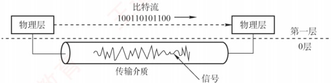

## 2.4 本章小结及疑难点

1. 传输介质属于物理层吗？它与物理层有何区别？

传输介质不属于物理层。尽管与物理层紧密相关，但从网络体系结构看，它位于物理层之下，
常被非正式称为“第0层”。区别在于：传输介质只承载电信号或光信号，无法区分信号所代表的比特值——即无法判断某一电平对应的是1还是0；物理层通过定义电气、机械、功能和过程特性（如电压、时序、接口规范等），将原始信号解释为有意义的比特流，供上层使用。图2.10直观展示了这一关系：传输介质是信号的“通道”，物理层是赋予其语义的“规则制定者”。

图2.10 传输介质与物理层

2. 什么是基带传输、频带传输和宽带传输？它们有什么区别？

基带传输：直接发送原始的数字信号（如高、低电平），不经过调制。它占用整个信道带宽，通常用于短距离通信，比如局域网或计算机内部连接。常用的编码方法包括不归零编码和曼彻斯特编码。不归零编码的做法是用高电平表示1、低电平表示0。例如，要传输“1010”，若高电平代表1、低电平代表0，则线路上依次传送（高、低、高、低）这一电平序列。

频带传输：当需要远距离或无线传输时，必须把数字信号“搭载”到一个高频载波上，这个过程叫调制，转换后的信号更适合在模拟信道（如电话线）上传输，称为频带传输。它不仅让数字信号能在传统电话系统中传输，还支持多路复用，提高信道利用率。例如，仍然传输“1010”，经过调制后，一个码元可能代表4位二进制数据；若码元A对应“1010”，则在模拟信道上只需发送码元A，就相当于完成了该数据的传输。电话线上网、Wi-Fi等都属于频带传输。

宽带传输：在传统通信语境中，宽带传输指利用频分复用等技术，将一条物理线路划分为多个频带信道，每个信道可独立进行频带传输，互不干扰。这样，多个信号可以并行传送，显著提升链路容量。例如，有线电视网络能一边上网、一边看电视，正是利用了宽带传输技术。

3. 奈氏准则和香农定理的主要区别是什么？它们对数据通信的意义是什么？

奈氏准则与香农定理从不同角度揭示了信道传输能力的极限。

奈氏准则仅考虑信道带宽限制，指出在给定带宽下，码元传输速率存在上限（与噪声无关），超过该上限将因码间串扰而无法正确识别信号；但它不限制每个码元所携带的比特数，因此可通过高阶调制（如一个码元表示多位）提升信息传输速率。香农定理则适用于有噪声的实际信道，指出对于确定的带宽和信噪比，信息传输速率存在一个不可逾越的理论上限，无论采用何种技术都无法突破。这意味着，要提高通信速率，只能通过增加带宽或改善信噪比，但二者在现实中均有物理限制。它们共同构成了数据通信系统设计的理论基础。

4. 信噪比明明是 S/N，为什么还要用  $10\log_{10}(S/N)$ 表示？

信噪比可以用两种方式表示：

1）线性比值（无单位）：如信号功率为100，噪声功率为1，则信噪比S/N=100。

2）分贝形式（单位 dB）：此时信噪比为  $10\log_{10}(S/N)=10\log_{10}100=20\text{dB}$。

两者在数学上等价，但分贝形式更实用。因为在通信中，信号与噪声的功率差异往往极大，例如信号可能是噪声的10亿倍。若用线性值表示，则1后面有9个0，不仅冗长，还容易数错；而用分贝表示仅为90dB，简洁且不易出错。因此，分贝能高效、清晰地表达极大或极小的比值。
