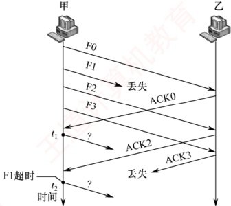
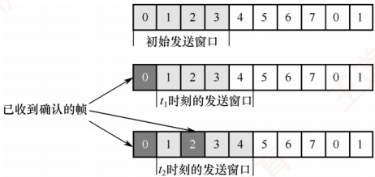

### 3.4.3 本节习题精选

#### 一、 单项选择题

##### 01

下列关于停止-等待协议的描述中，正确的是（）。

A. 发送窗口和接收窗口的尺寸都为1

B. 最大的信道利用率有可能达到100%

C. 适合于往返时间比较长的信道

D. 接收方可以不按序接收

##### 02

下列情况中，会使停止-等待协议的效率变得很低的是（）。

A. 当源主机和目的主机之间的距离很近而且数据传输速率很高时

B. 当源主机和目的主机之间的距离很远而且数据传输速率很高时

C. 当源主机和目的主机之间的距离很近而且数据传输速率很低时

D. 当源主机和目的主机之间的距离很远而且数据传输速率很低时

##### 03

在简单的停止-等待协议中，当帧出现丢失时，发送方会永远等待下去，解决这种死锁现象的办法是（）。

A. 差错检验 B. 帧序号 C. NAK 机制 D. 超时机制

##### 04

在停止-等待协议中，为了让接收方能判断所收到的数据帧是否重复，采用（）的方法。

A. 帧编号 B. 检错码 C. 重传计时器 D. NAK 帧

##### 05

一个信道的数据传输速率为 4kb/s，单向传播时延为 30ms，若使停止-等待协议的信道最大利用率达到 80%，则要求的数据帧长至少为（）。

A. 160比特 B. 320比特 C. 560比特 D. 960比特

##### 06

主机甲采用停止-等待协议向主机乙发送数据，数据传输速率是6kb/s，单向传播时延是
100ms，忽略确认帧的发送时延。信道的利用率为40%时，数据帧的长度为（）。

A. 240 比特 B. 320 比特 C. 600 比特 D. 800 比特

##### 07

在停止-等待协议中，若发送方发送的数据帧中途丢失，则可能发生的情况是（）。

A. 接收方发送 NAK 帧，请求重发此帧

B. 发送方在经过超时时间后未收到 ACK 帧，自动重发此帧

C. 接收方在经过超时时间后，向发送方发送 ACK 帧，请求重发此帧

D. 发送方继续发送后续帧，直到经过超时时间后未收到 ACK 帧，重发此帧

##### 08

下列关于连续 ARQ 的说法中，错误的是（）。

A. 发送方可以连续发送若干数据帧，而不是发完一个数据帧就停下来等待确认帧

B. 发送方收到了接收方发来的确认帧，还可以接着发送数据帧

C. 相比停止-等待协议，连续 ARQ 因为减少了等待时间，所以提高了信道利用率

D. 接收方可以不按序接收数据帧

##### 09

数据链路层采用后退N帧协议进行流量控制，发送方已发送编号为0~6的帧，之后收到5号数据帧的确认，发送方的滑动窗口向后移动后，发送方可发送的数据帧数量为6个，假设整个过程未发生超时，则应采用（）位给数据帧编号。

A. 3 B. 4 C. 5 D. 6

##### 10

数据链路层采用后退N帧协议，发送方已经发送了编号从0到6的帧。当计时器超时的时候，只收到对1、2、4号帧的确认，发送方需要重传的帧的数量是（）。

A. 1

B. 2

C. 5

D. 6

##### 11

数据链路层采用了后退N帧协议（GBN），若发送窗口的大小是32，则至少需要（）位的序列号才能保证协议不出错。

A. 4 B. 5 C. 6 D. 7

##### 12

若采用后退N帧的ARQ协议进行流量控制，帧编号字段为7位，则发送窗口的最大长度为（）。

A. 7 B. 8 C. 127 D. 128

##### 13

一个使用选择重传协议的数据链路层，若采用5位的帧序列号，则可以选用的最大接收窗口是（）。

A. 15 B. 16 C. 31 D. 32

##### 14

对于窗口总大小为 n 的滑动窗口，最多可以有（ ）帧已发送但没有确认。

A. 0 B. n-1 C. n D. n/2

##### 15

数据链路层采用选择重传协议（SR）传输数据，若帧序号采用4比特编号，接收窗口大小为7，则发送窗口最大是（）。

A. 17 B. 8 C. 9 D. 10

##### 16

对无序接收的滑动窗口协议，若序号位数为 n，则接收窗口最大尺寸为（）。

A.  $2^n - 1$ B. 2n C. 2n - 1 D.  $2^{n-1}$

##### 17

采用滑动窗口机制对两个相邻节点 A 和 B 的通信过程进行流量控制。A 和 B 之间的数据传输速率为 20kb/s，数据帧和确认帧的长度都为 2000B，往返传播时延为 1400ms，采用 3 比特给数据帧编号，测得在 A 和 B 的通信过程中信道利用率大于 80%，则（）。

（注：在 SR 协议中，默认发送窗口大小等于接收窗口大小。）

A. 节点 A、B 之间只能采用停止等待协议

B. 节点 A、B 之间只能采用 GBN 协议
C. 节点 A、B 之间只能采用 SR 协议

D. 节点 A、B 之间可以采用 GBN 协议或 SR 协议

##### 18

流量控制是实现发送方和接收方速度一致的机制，实现这种机制所采取的措施是（）。

A. 增大接收方接收速度

B. 减小发送方发送速度

C. 接收方向发送方反馈信息

D. 增加双方的缓冲区

##### 19

假设两台主机之间采用后退N帧协议传输数据，数据传输速率为16kb/s，单向传播时延为250ms，数据帧的长度是128B，确认帧的长度也是128B，为使信道利用率达到最高，则帧序号的比特数至少为（）。

A. 2 B. 3 C. 4 D. 5

##### 20

在下列滑动窗口机制中，理论上可以达到 100% 信道利用率的是（）。

I. 停止-等待协议 II. 后退N帧协议 III. 选择重传协议

A. I B. II C. III D. II 和 III

##### 21

数据链路层采用选择重传协议进行流量控制，发送方在收到 0~3 号帧的确认后，又收到了 5 号帧的确认，发送窗口内还有其他帧未发送，且未发生超时，则发送方将（）。

A. 重传4号帧

B. 重传5号帧

C. 接收该确认帧并继续发送剩下的帧 D. 停止发送并等待超时

##### 22

【2009 统考真题】数据链路层采用了后退 N 帧（GBN）协议，发送方已经发送了编号为 0~7 的帧。当计时器超时的时候，若发送方只收到 0、2、3 号帧的确认，则发送方需要重发的帧数是（）。

A. 2 B. 3 C. 4 D. 5

##### 23

【2011 统考真题】数据链路层采用选择重传协议（SR）传输数据，发送方已发送 0~3 号数据帧，现已收到 1 号帧的确认，而 0、2 号帧依次超时，则此时需要重传的帧数是（）。

A. 1 B. 2 C. 3 D. 4

##### 24

【2012 统考真题】两台主机之间的数据链路层采用后退 N 帧协议（GBN）传输数据，数据传输速率为 16 kb/s，单向传播时延为 270 ms，数据帧长范围是 128~512 B，接收方总是以与数据帧等长的帧进行确认。为使信道利用率达到最高，帧序号的比特数至少为（）。

A. 5 B. 4 C. 3 D. 2

##### 25

【2014 统考真题】主机甲与主机乙之间使用后退 N 帧协议（GBN）传输数据，主机甲的发送窗口尺寸为 1000，数据帧长为 1000B，信道带宽为 100Mb/s，主机乙每收到一个数据帧，就立即利用一个短帧（忽略其传输延迟）进行确认，若主机甲和主机乙之间的单向传播时延是 50ms，则主机甲可以达到的最大平均数据传输速率约为（）。

A. 10Mb/s

B. 20Mb/s

C. 80Mb/s

D. 100Mb/s

##### 26

【2015 统考真题】主机甲通过 128kb/s 卫星链路，采用滑动窗口协议向主机乙发送数据，链路单向传播时延为 250ms，帧长为 1000B。不考虑确认帧的开销，为使链路利用率不小于 80%，帧序号的比特数至少是（）。

A 3

B 4

C 7

D 8

##### 27

【2018 统考真题】主机甲采用停止-等待协议向主机乙发送数据，数据传输速率是 3kb/s，单向传播时延是 200ms，忽略确认帧的传输时延。当信道利用率等于 40% 时，数据帧的长度为（）。

A. 240 比特 B. 400 比特 C. 480 比特 D. 800 比特
##### 28

【2019 统考真题】对于滑动窗口协议，若分组序号采用 3 比特编号，发送窗口大小为 5，则接收窗口最大是（）。

A. 2 B. 3 C. 4 D. 5

##### 29

【2020 统考真题】假设主机甲采用停止-等待协议向主机乙发送数据帧，数据帧长与确认帧长均为 1000B，数据传输速率是 10kb/s，单向传播时延是 200ms。则主机甲的最大信道利用率为（）。

A. 80% B. 66.7% C. 44.4% D. 40%

##### 30

【2023 统考真题】假设通过同一条信道，数据链路层分别采用停止-等待协议、GBN 协议和 SR 协议（发送窗口和接收窗口相等）传输数据，三个协议的数据帧长相同，忽略确认帧长，帧序号位数为 3 比特。若对应三个协议的发送方最大信道利用率分别是  $U_1$、 $U_2$ 和  $U_3$，则  $U_1$、 $U_2$ 和  $U_3$ 满足的关系是（）。

A.  $U_1 \leq U_2 \leq U_3$

B.  $U_1 \leq U_3 \leq U_2$

C.  $U_2 \leq U_3 \leq U_1$

D.  $U_3 \leq U_2 \leq U_1$

##### 31

【2024 统考真题】主机甲通过选择重传（SR）滑动窗口协议向主机乙发送帧的部分过程如下图所示，Fx 为数据帧，ACKx 为确认帧，x 是位数为 3 比特的序号。主机乙只对正确接收的数据帧进行独立确认，发送窗口与接收窗口大小相同且均为最大值。主机甲在  $t_1$ 时刻和  $t_2$ 时刻发送的数据帧分别是（）。

A. F1, F3 B. F1, F4 C. F3, F1 D. F4, F1

#### 二、 综合应用题

##### 01

在选择重传协议中，设序号用3比特编号，发送窗口 $W_{T}=6$，接收窗口 $W_{R}=3$。试找出一种情况，使得在此情况下协议不能正确工作。

##### 02

假设一个信道的数据传输速率为 5kb/s，单向传播时延为 30ms，帧长在什么范围内时，才能使用于差错控制的停止-等待协议的效率至少为 50%？（忽略确认帧的发送时延。）

##### 03

假定信道的数据传输速率为 100kb/s，单程传播时延为 250ms，每个数据帧的长度均为2000位，且不考虑确认帧长、首部和处理时间等开销，为了达到最大的传输效率，试问帧的序号应为多少位？此时的信道利用率是多少？

##### 04

在数据传输速率为 50kb/s 的信道上传送长度为 1kbit 的帧，总是采用捎带确认，帧序号长度为 3bit，单向传播延迟为 270ms。对于下面三种协议，信道的最大利用率是多少？

1）停止-等待协议。

2）后退N帧协议。

3）选择重传协议（假设发送窗口和接收窗口相等）。
##### 05

对于下列给定条件，不考虑差错重传，停止-等待协议的实际数据传输速率是多少？

R=传输速率（16Mb/s）

S=信号传播速率（200m/μs）

D=接收主机和发送主机之间传播距离（200m）

T=创建帧的时间（2μs）

F=每帧的长度（500bit）

N=每帧中的数据长度（450bit）

A=确认帧 ACK 的帧长（80bit）

##### 06

在数据传输速率为64kb/s的卫星信道上，甲方发送长度为512B的数据帧，乙方返回一个很短的确认帧（忽略确认帧的发送时延）。信道的单向传播时延为270ms，对于发送窗口大小分别为1、7、17和117的情况，甲方的实际数据传输速率分别为多少？

##### 07

【2017 统考真题】甲乙双方均采用后退 N 帧协议（GBN）进行持续的双向数据传输，且双方始终采用捎带确认，帧长均为 1000B。 $S_{xy}$ 和  $R_{xy}$ 分别表示甲方和乙方发送的数据帧，其中 x 是发送序号，y 是确认序号（表示希望接收对方的下一帧序号），数据帧的发送序号和确认序号字段均为 3 比特。信道传输速率为 100Mb/s，RTT=0.96ms。下图给出了甲方发送数据帧和接收数据帧的两种场景，其中  $t_{0}$ 为初始时刻，此时甲方的发送和确认序号均为 0， $t_{1}$ 时刻甲方有足够多的数据待发送。

1）对于图(a)， $t_{0}$时刻到 $t_{1}$时刻期间，甲方可以断定乙方已正确接收的数据帧数是多少？正确接收的是哪几个帧（请用 $S_{x,y}$形式给出）？

2）对于图(a)，从  $t_{1}$ 时刻起，甲方在不出现超时且未收到乙方新的数据帧之前，最多还可以发送多少数据帧？其中第一个帧和最后一个帧分别是哪个（请用  $S_{x,y}$ 形式给出）？

3）对于图(b)，从  $t_{1}$ 时刻起，甲方在不出现新的超时且未收到乙方新的数据帧之前，需要重发多少数据帧？重发的第一个帧是哪个帧（请用  $S_{x,y}$ 形式给出）？

4）甲方可以达到的最大信道利用率是多少？

| 时间 | S_0,0 | S_1,0 | S_2,0 | S_3,0 | R_0,1 | S_4,1 | R_1,3 | R_3,3 | ? |
| --- | --- | --- | --- | --- | --- | --- | --- | --- | --- |
| t₀ | 1 | 0 | 0 | 0 | 1 | 0 | 0 | 0 | 0 |
| t₁ | 0 | 0 | 0 | 0 | 0 | 1 | 0 | 0 | 0 |
| 时间 | S_0,0 | S_1,0 | S_2,0 | S_3,0 |   |   |   |   |   |

(a)

| 时间 | S_0,0 | S_1,0 | S_2,0 | R_0,1 | R_1,2 | S_3,2 | S_4,2 | R_2,2 | S_2,0 超时 |
| --- | --- | --- | --- | --- | --- | --- | --- | --- | --- |
| t₀ | 1 | 1 | 1 | 1 | 1 | 1 | 1 | 1 |   |
| t₁ | 1 | 1 | 1 | 1 | 1 | 1 | 1 | 1 | 1 |

(b)

### 3.4.4 答案与解析

#### 一、 单项选择题

##### 01

A

停止-等待协议采用1比特给数据帧编号，发送窗口和接收窗口的尺寸都为1，选项A正确。仅在收到当前窗口内的数据帧后，接收窗口才能向后移动，因此一定是按序接收的。停止-等待协议的信道利用率 = 一个数据帧的发送时延÷（一个数据帧的发送时延 + RTT + 一个确认帧的发送时延），其中分子一定是小于分母的，所以信道利用率不可能达到100%，当RTT较大时，会降低信道利用率，因此停止-等待协议适合RTT较小的信道。

##### 02

B

根据信道利用率的计算公式，当数据传输速率很高时，数据帧的发送时间很短；当源主机和目的主机的距离很远时，往返时延很大，此时的信道利用率很低。

##### 03

D

在停止-等待协议中，发送方设置了计时器，在发送一个帧后，发送方等待确认，若在计时器计满时仍未收到确认，则再次发送相同的帧，以免陷入永久的等待。

##### 04

A

在停止-等待协议中，使用 1 位来编号即可。若连续出现相同序号的数据帧，则表明发送方进行了超时重传；若连续出现相同序号的确认帧，则表明接收方收到了重复帧。

##### 05

D

设C为数据传输速率，L为帧长，R为单程传播时延。停止-等待协议的信道最大利用率为 $(L/C)/(L/C+2R)=L/(L+2RC)=L/(L+2\times30ms\times4kb/s)=80\%$，得出L=960bit。

##### 06

D

本题忽略确认帧的发送时延，所以信道利用率 = 数据帧的发送时延/（数据帧的发送时延 + 往返时延）=0.4，解得数据帧的发送时延为4/30s，所以数据帧的长度为6kb/s×4/30s=800bit。

##### 07

B

停止-等待协议使用确认和重传机制，发送方每发送一个帧，就要停下来等待接收方发回的确认帧，收到确认帧后才能发送下一帧，经过超时时间后未收到 ACK 帧则自动重传。

##### 08

D

连续 ARQ 协议分为 GBN 协议和 SR 协议。SR 的接收窗口大于 1，接收方可以先收下失序但序号仍落在接收窗口内的那些数据帧。GBN 的接收窗口等于 1，接收方必须按序接收数据帧。

##### 09

A

发送方收到5号帧的确认后，表示5号帧及之前的所有帧都被接收方正确接收，因此滑动窗口右移后，新窗口内的第一个帧就是6号帧，又因为此时可发送的数据帧数为6，因此发送窗口的总大小为7。在GBN协议中，若采用n位给帧编号，则发送窗口大小为 $2^n - 1$，因此 $n = 3$。

##### 10

B

后退N帧协议采用累积确认，确认的最后一个帧是4号帧，表示4号帧及4号帧之前的数据帧都已被正确接收，所以只需重传5号帧和6号帧这两个数据帧。

##### 11

C

对于滑动窗口协议，序列号个数要大于或等于窗口数（发送窗口大小 + 接收窗口大小），所以在后退 N 帧的协议中，序列号个数不小于 “发送窗口大小 + 1”，题中发送窗口大小是 32，
那么序列号个数最少应该是33个。所以最少需要6位的序列号才能达到要求。

##### 12

C

接收窗口整体向前移动时，新窗口中的序列号和旧窗口的序列号产生重叠，致使接收方无法区别发送方发送的帧是重发帧还是新帧，因此在后退 N 帧的 ARQ 协议中，发送窗口  $W_{T} \leq 2^{n} - 1$。本题中 n = 7，因此发送窗口的最大长度是 127。

##### 13

B

在选择重传协议中，若用 n 比特对帧编号，则发送窗口和接收窗口的大小关系为  $1 < W_{R} \leq W_{T}$，还需满足  $W_{R} + W_{T} \leq 2^{n}$，所以接收窗口的最大尺寸不超过序号范围的一半，即  $W_{R} \leq 2^{n-1}$。

##### 14

B

在连续 ARQ 协议中，发送窗口大小 ≤ 窗口总数 - 1。例如，窗口总数为 8，编号为 0~7，假设这 8 个帧都已发出，下一轮又发出编号 0~7 的 8 个帧，接收方将无法判断第二轮发的 8 个帧到底是重传帧还是新帧，因为它们的序号完全相同。另一方面，对于后退 N 帧协议，发送窗口大小可以等于窗口总数 - 1，因为它的接收窗口大小为 1，所有的帧保证按序接收。因此对于窗口大小为 n 的滑动窗口，其发送窗口大小最大为 n - 1，即最多可以有 n - 1 帧已发送但没有确认。

##### 15

C

在选择重传协议中，若用 $n$ 比特对帧编号，则发送窗口和接收窗口的大小关系为 $1 < W_R \leq W_T$，此外，还要满足 $W_R + W_T \leq 2^n$，因此发送窗口的最大尺寸为 $2^4 - 7 = 16 - 7 = 9$。

##### 16

D

本题未直接告知使用的是选择重传协议，而是通过间接方式给出的。题目标无序接收的滑动窗口协议，表示接收窗口大于1，所以使用的是选择重传协议，接收窗口最大尺寸为 $2^{n-1}$。

##### 17

D

无论采用哪种滑动窗口协议，信道利用率的计算方法都是：发送窗口内所有数据帧的发送时延/（一个数据帧的发送时延 + RTT + 一个确认帧的发送时延）。分母记为 T = 一个数据帧的发送时延 + RTT + 一个确认帧的发送时延，其中数据帧或确认帧的发送时延 = 2000B/(20kb/s) = 800ms，RTT = 1400ms，即 T = 800 + 800 + 1400 = 3000ms。假设发送窗口大小为 x，则 800x/3000 > 0.8，即发送窗口大小 x 要大于 3，GBN 协议的发送窗口为  $2^3 - 1 = 7$，满足要求；SR 协议的发送窗口为  $2^2 = 4$，也满足要求。因此，A 和 B 之间可以采用 GBN 协议或 SR 协议。

##### 18

C

实现流量控制的常用方法是滑动窗口协议，它让接收方把自己的接收窗口大小反馈给发送方，以调节发送方的发送窗口大小，避免发送方因发送速度过快而导致接收方来不及接收。

##### 19

C

为使信道利用率最高（100%），要让发送方在一个发送周期内持续发送帧，不能出现发送窗口内的帧发完但还未收到第一个帧的确认帧的情况。发送周期 = 发送一个数据帧的时间 + 往返时延 + 发送一个确认帧的时间，发送一个数据帧或确认帧的时间均为 128B÷16kb/s = 64ms，发送周期 = 64ms + 250ms×2 + 64ms = 628ms。为保证发送方持续发送帧，在一个发送周期内至少要发送的帧数为 628ms/64ms ≈ 10，即发送窗口大小至少为 10，所以帧序号至少采用 4 比特。

##### 20

D

信道利用率 = 发送周期内用于发送数据帧的时间/发送周期，其中发送周期 = 发送一个数据帧的时间 + 往返时延 + 发送一个确认帧的时间。停止-等待协议的发送窗口为 1，不可能达到 100% 的信道利用率；只要发送窗口够大，后退 N 帧协议和选择重传协议都有可能达到 100% 的信道利用率。

##### 21

C
在选择重传协议中，接收方对正确收到的每个数据帧单独进行确认，不要求收到的数据帧是有序的。依题意，接收方已正确收到0～3号和5号数据帧，但不确定4号数据帧是否收到。因为没有发生超时，发送方不进行重传，所以接收该确认帧并继续发送剩下的数据帧。

##### 22

C

在 GBN 协议中，当接收方检测到某帧出错时，会简单地丢弃该帧及所有的后续帧，发送方超时后需重传该数据帧及所有的后续帧。注意，在 GBN 协议中，接收方一般采用累积确认的方式，即接收方对按序到达的最后一个分组发送确认，因此本题中收到 3 号帧的确认就表示编号为 0、1、2、3 的帧已接收，而此时发送方未收到 1 号帧的确认只能代表确认帧在返回的过程中丢失，而不代表 1 号帧未到达接收方。因此需要重传的帧为编号是 4、5、6、7 的帧。

##### 23

B

在选择重传协议中，接收方逐个确认正确接收的分组，不管接收到的分组是否有序，只要正确接收就发送选择 ACK 分组进行确认，因此 ACK 分组不再具有累积确认的作用。对于这一点，要特别注意与 GBN 协议的区别。此题中只收到 1 号帧的确认，0、2 号帧超时，因为对 1 号帧的确认不具有累积确认的作用，所以发送方认为接收方未收到 0、2 号帧，于是重传这两帧。

##### 24

B

连续 ARQ 的信道利用率：

 $$\frac{ 发送窗口大小 \times 数据帧长 / 数据传输速率 }{}=\frac{ 发送窗口大小 / 数据传输速率 }{( 数据帧长 / 数据传输速率 )\times2+RTT}=\frac{}{2/ 数据传输速率 +RTT/ 数据帧长 }$$

从上述公式可知，数据帧长越大，信道利用率就越高。数据帧长是不确定的，范围为 128～512B，在计算最小窗口数时，为了保证无论数据帧长如何变化，信道利用率都能达到 100%，应以 128B 的帧长计算。因此，当最短的帧长都能达到 100% 的信道利用率时，发送更长的数据帧也都能达到 100% 的信道利用率。若以 512B 的帧长计算，则求得的最小窗口数在 128B 的帧长下，达不到 100% 的信道利用率。首先计算出发送一个帧的时间： $128 \times 8 / (16 \times 10^3) = 64 \text{ms}$；发送一个帧收到确认帧为止的总时间： $64 + 270 \times 2 + 64 = 668 \text{ms}$；这段时间总共可发送 668/64 = 10.4 帧，即发送窗口  $\geq 11$，而接收窗口 = 1，所以至少需要用 4 位比特进行编号。

##### 25

C

考虑制约甲方的数据传输速率的因素。首先，信道带宽能直接制约数据的传输速率，传输速率一定是小于或等于信道带宽的。其次，因为甲方和乙方之间采用后退 N 帧协议传输数据，要考虑发送一个数据到接收到它的确认之前，最多能发送多少数据，甲方的最大传输速率受这两个条件的约束，所以甲方的最大传输速率是这两个值中的小者。甲方的发送窗口尺寸为 1000，即收到第一个数据的确认前，最多能发送 1000 个数据帧，即  $1000 \times 1000\text{B} = 1\text{MB}$ 的内容，而从发送第一个帧到接收到它的确认的时间是一个帧的发送时间加上往返时间，即  $1000\text{B} \div 100\text{Mb/s} + 50\text{ms} + 50\text{ms} = 0.10008\text{s}$，此时的最大传输速率为  $1\text{MB}/0.10008\text{s} \approx 10\text{MB/s} = 80\text{Mb/s}$。信道带宽为 100Mb/s，因此答案为  $\min(80\text{Mb/s}, 100\text{Mb/s}) = 80\text{Mb/s}$。

##### 26

B

按发送周期思考，从开始发送帧到收到第一个确认帧为止，用时为  $T =$ 第一个帧的发送时延 + 第一个帧的传播时延 + 确认帧的发送时延 + 确认帧的传播时延，这里忽略确认帧的发送时延。因此  $T = 1000B \div 128kb/s + RTT = 0.5625s$，接着计算在  $T$ 内需要发送多少数据才能满足利用率不小于 80%。设数据大小为  $L$ 字节，则  $(L \div 128kb/s) / T \geq 0.8$，得到  $L \geq 7200B$，即在一个发送周期内至少要发 7.2 个帧才能满足要求，设需要编号的比特数为  $n$，则  $2^n - 1 \geq 7.2$， $n$ 至少为 4。
##### 27

D

信道利用率 = 传输帧的有效时间/传输帧的周期。假设帧的长度为 x 比特。对于有效时间，应该用帧的大小除以数据传输速率，即  $x \div 3\text{kb/s}$。对于帧的传输周期，应包含 4 部分：帧在发送方的发送时延、帧从发送方到接收方的单程传播时延、确认帧在接收方的发送时延、确认帧从接收方到发送方的单程传播时延。这 4 个时延中，因为题目中说“忽略确认帧的传输时延”，所以不计算确认帧的传输时延（传输时延也称发送时延，注意与传播时延区分）。所以帧的传输周期由三部分组成：首先是帧在发送方的发送时延  $x \div 3\text{kb/s}$，其次是帧从发送方到接收方的单程传播时延 200ms，最后是确认帧从接收方到发送方的单程传播时延 200ms，三者相加得周期为  $x \div 3\text{kb/s} + 400\text{ms}$。代入信道利用率的公式得  $x = 800\text{bit}$。

##### 28

B

从滑动窗口的概念来看，停止-等待协议：发送窗口大小=1，接收窗口大小=1；后退N帧协议：发送窗口大小>1，接收窗口大小=1；选择重传协议：发送窗口大小>1，接收窗口大小>1。在选择重传协议中，还需满足：接收窗口大小≤发送窗口大小；发送窗口大小+接收窗口大小≤2。根据以上规则，采用3比特编号，发送窗口大小为5，接收窗口大小≤3。

##### 29

D

发送数据帧和确认帧的时间均为  $t=1000\times8b\div10kb/s=800ms$。

发送周期为  $T = 800 \, \text{ms} + 200 \, \text{ms} + 800 \, \text{ms} + 200 \, \text{ms} = 2000 \, \text{ms}$。

信道利用率为  $t/T \times 100\% = 800/2000 = 40\%$.

##### 30

B

信道利用率  $U = nT_D/T$，其中  $n$ 是发送窗口的大小， $T_D$ 是发送一个数据帧的时间， $T$ 是一个数据帧的发送周期。在  $T_D$ 和  $T$ 确定的情况下， $n$ 越大，信道利用率就越大。设帧序号的比特数为  $k$，则停止-等待协议的发送窗口  $W_{T1} = 1$；GBN 协议的发送窗口  $W_{T2} = 2^k - 1$；SR 协议的发送窗口  $W_{T3} \leq 2^k - 1$，通常取  $2^{k-1}$， $W_{T1} \leq W_{T3} \leq W_{T2}$，因此  $U_1 \leq U_3 \leq U_2$。

##### 31

D

数据帧编号的范围是 0～7，发送窗口与接收窗口大小相等且均为最大值，因此发送窗口大小 = 接收窗口大小 =  $2^{3-1} = 4$。甲发送 F0、F1、F2 和 F3 四个数据帧后，收到 F0 的确认，因此在  $t_1$ 时刻，发送窗口向右滑动，可以继续发送 F4，之后收到 F2 的确认，但由于 F1 丢失，甲无法收到 F1 的确认，发送窗口无法继续向右滑动，直到  $t_2$ 时刻，F1 超时，重传 F1，选项 D 正确。

#### 二、 综合应用题

##### 01

【解答】

对于选择重传协议，接收窗口和发送窗口的尺寸需满足：接收窗口尺寸  $W_R +$ 发送窗口尺寸  $W_T \leq 2^n$，而题中给出的数据是  $W_R + W_T = 9 \geq 2^3$，所以是无法正常工作的。举例如下：
发送方：01234567012345670

接收方：01234567012345670

发送方发送0～5号共6个数据帧时，因发送窗口已满，发送暂停。接收方收到所有数据帧，对每个帧都发送确认帧，并期待后面的6、7、0号帧。若所有的确认帧都未到达发送方，经过发送方计时器控制的超时时间后，发送方再次发送之前的6个数据帧，而接收方收到0号帧后，无法判断是新的数据帧还是重传的旧的数据帧。

##### 02

【解答】

设数据帧长为 L。在停止-等待协议中，发送数据帧的时间为 L/B，发送完数据帧后等待确认的时间为 2R。要使协议的效率至少为 50%，要求信道利用率 U 至少为 50%，则

 $$信道利用率 U=\frac{ 数据发送时延 }{ 数据发送时延 + 往返时延 }=\frac{L/B}{L/B+2R}\geqslant50\%$$

解得  $L \geqslant 2RB = 2 \times 5000 \times 0.03\text{bit} = 300\text{bit}$。

因此，当帧长大于或等于 300bit 时，停止-等待协议的效率至少为 50%。

##### 03

【解答】

 $$RTT=250 \times 2=500ms=0.5s。$$

一个帧的发送时间等于 $2000\text{bit} \div 100\text{kb/s} = 20 \times 10^{-3}\text{s} = 0.02\text{s}$。

一个帧发送完后经过一个单程时延到达接收方，再经过一个单程时延发送方收到确认帧，从而可以继续发送，因此要使传输效率最大，就要让发送方继续地发送帧。设发送窗口等于x，则

 $$0.02s\times x=0.02s+RTT=0.52s$$

解得 x=26，即发送窗口取 26 即可。因为 16<26<32，所以帧序号应为 5 位。在使用连续 ARQ 的情况下，发送窗口的最大值是 31，大于 26，可以不间断地发送帧，此时信道利用率是 100%。

##### 04

【解答】

最大信道利用率即每个传输周期内每个协议可发送的最大帧数。由题意，数据帧的长度为1kbit，信道的数据传输速率为50kb/s，因此信道的发送时延为1/50s=0.02s，另外信道端到端的传播时延=0.27s。本题中的确认帧是捎带的（通过数据帧来传送），因此每个数据帧的传输周期为(0.02+0.27+0.02+0.27)s=0.58s，

1）在停止-等待协议中，发送方每发送一帧，都要等待接收方的应答信号，之后才能发送下一帧；接收方每接收一帧，都要反馈一个应答信号，表示可接收下一帧。其中用于发送数据帧的时间为0.02s。因此，信道的最大利用率为0.02/0.58=3.4%。

2）在后退 N 帧协议中，接收窗口尺寸为 1，若采用 n 比特对帧编号，则其发送窗口的尺寸 W 满足  $1 < W \leq 2^n - 1$。发送方可以连续再发送若干数据帧，直到发送窗口内的数据帧都发送完毕。若收到接收方的确认帧，则可以继续发送。若某个帧出错，则接收方只是简单地丢弃该帧及所有的后续帧，发送方超时后，需要重传该数据帧及所有的后续数据帧。根据题目条件，在达到最大传输速率的情况下，发送窗口的大小应为  $2^n - 1 = 7$，此时在第一帧的数据传输周期 0.58s 内，实际连续发送了 7 帧（考虑极限情况，0.58s 后接收方只收到 0 号帧的确认，此时又可以发出一个新帧，这样依次下去，取极限即是每个传输周期 0.58s 内发送了 7 帧），因此此时的最大信道利用率为  $7 \times 0.02 / 0.58 = 24.1\%$。

3）选择重传协议的接收窗口尺寸和发送窗口尺寸都大于 1，可以一次发送或接收多个帧。若采用  $n$ 比特对帧编号，则窗口尺寸应满足：接收窗口尺寸 + 发送窗口尺寸 ≤ 2ⁿ，当发送窗口与接收窗口尺寸相等时，应有接收窗口尺寸 ≤ 2^{n-1} 且发送窗口尺寸 ≤ 2^{n-1}。发送方可以连续发送若干数据帧，直到发送窗口内的数据帧都发送完毕。若收到接收方的确认帧，则可以继续
发送。若某帧出错，则接收方只是简单地丢弃该帧，发送方超时后需重传该数据帧。

和 2）问中的情况类似，唯一不同的是为达到最大信道利用率，发送窗口大小应为  $2^{n-1}=4$，因此，此时的最大信道利用率为  $4\times0.02/0.58=13.8\%$。

##### 05

【解答】

对于停止-等待协议，有

 $$\begin{aligned} 实际数据传输速率 &=\frac{N}{2\times(T+D/S)+\frac{F+A}{R}}=\frac{450bit}{2\times\left(2\mu s+\frac{200m}{200m/\mu s}\right)+\frac{500bit+80bit}{16bit/\mu s}}\\&\approx10.65bit/\mu s=10.65Mb/s\end{aligned}$$

##### 06

【解答】

要注意题中的单位。数据帧的长度为 512B，即  $512 \times 8\text{bit} = 4.096\text{kbit}$，一个数据帧的发送时延为  $4.096/64 = 0.064\text{s}$。因此一个发送周期为  $0.064 + 2 \times 0.27 = 0.604\text{s}$。

当发送窗口为1时，甲方的实际数据传输速率为 $1\times4.096/0.604=6.8kb/s$。

当发送窗口为7时，甲方的实际数据传输速率为 $7\times4.096/0.604=47.5$kb/s。

当发送窗口大于 0.604/0.064，即大于或等于 10 时，就能保证甲方在信道上持续发送数据。因此发送窗口为 17 和 117 时，信道的利用率达到 100%，甲方的实际数据传输速率为 64kb/s。

##### 07

【解答】

1） $t_{0}$ 时刻到  $t_{1}$ 时刻期间，甲方可以断定乙方已正确接收 3 个数据帧，分别是  $S_{0,0}$、 $S_{1,0}$、 $S_{2,0}$。 $R_{3,3}$ 说明乙方发送的数据帧序号是 3，即希望甲方发送序号 3 的数据帧，说明乙方已经接收序号为 0～2 的数据帧（注意，这个确认序号是期望接收对方的下一帧的序号）。

2）从  $t_1$ 时刻起，甲方最多还可以发送 5 个数据帧，其中第一帧是  $S_{5,2}$，最后一帧是  $S_{1,2}$。发送序号 3 位，有 8 个序号，在 GBN 协议中，发送窗口 +1 ≤ 序号总数，所以这里发送窗口取最大值 7。此时已发送  $S_{3,0}$ 和  $S_{4,1}$，所以最多还可以发送 5 帧（数据帧以序号 01234567，01234567，… 的规律发送，但初始时只有 0123456 落在发送窗口内，之后随着发送方不断收到确认，发送窗口也不断向前滑动）。

3）甲方需要重发3个数据帧，重发的第一个帧是 $S_{2,3}$。在GBN协议中，发送方发送N帧后，检测出错，则需要发送出错帧及其之后的帧。 $S_{2,0}$超时，所以重发的第一帧是 $S_{2}$。已收到乙方的 $R_{2}$帧，所以帧号应为3。

4）甲方可以达到的最大信道利用率U是

 $$\frac{ 发送窗口大小 \times\frac{ 帧长 }{ 数据传输速率 }}{RTT+\frac{ 帧长 }{ 数据传输速率 }\times2}=\frac{7\times\frac{8\times1000}{100\times10^{6}}}{0.96\times10^{-3}+\frac{8\times1000}{100\times10^{6}}\times2}\times100\%=50\%$$

信道利用率  $U =$ 发送数据帧的时间/从开始发送第一个数据帧到收到第一个确认帧的时间  $= NT_d / (T_d + RTT + T_a)$。其中， $N$ 取发送窗口的最大值， $T_d$ 是发送一个数据帧的时间，RTT 是往返时间， $T_a$ 是发送一个确认帧的时间。这里采用捎带确认， $T_d = T_a$。
