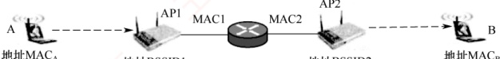
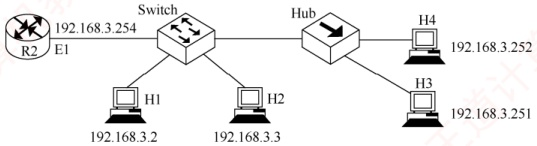
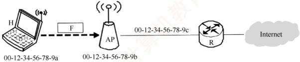
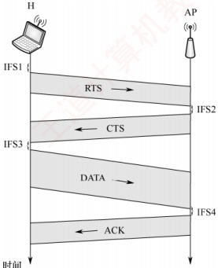
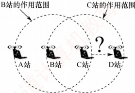
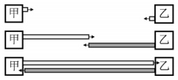
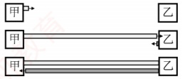

### 3.6.5 本节习题精选

#### 一、 单项选择题

##### 01

下列以太网中，采用双绞线作为传输介质的是（）。

A. 10Base-2 B. 10Base-5 C. 10Base-T D. 10Base-F

##### 02

10Base-T以太网采用的传输介质是()。

A. 双绞线 B. 同轴电缆 C. 光纤 D. 微波

##### 03

就交换技术而言，以太网采用的是（）。

A. 分组交换技术 B. 电路交换技术 C. 报文交换技术 D. 混合交换技术

##### 04

网卡实现的主要功能在（）。

A. 物理层和数据链路层

B. 数据链路层和网络层

C. 物理层和网络层

D. 数据链路层和应用层

##### 05

每个以太网卡都有自己的时钟，每个网卡在互相通信时为了知道什么时候一位结束、下一位开始，即具有同样的频率，它们采用了（）。

A. 量化机制 B. 曼彻斯特机制 C. 奇偶检验机制 D. 定时令牌机制

##### 06

以下关于以太网地址的描述，错误的是（）。

A. 以太网地址就是通常所说的 MAC 地址

B. MAC 地址也称局域网硬件地址

C. MAC 地址是通过域名解析查得的

D. 以太网地址通常存储在网卡中

##### 07

下列关于用光纤连接的以太网和用双绞线连接的以太网的说法中，错误的是（）。

A. 用集线器连接的双绞线以太网一定工作在半双工状态

B. 用交换机连接的双绞线以太网可以工作在全双工状态

C. 光纤以太网主要用于支持点对点通信，目的是扩大以太网的覆盖范围

D. 光纤以太网也可以选用 CSMA/CD 协议
##### 08

一个长度为 40B 的 IP 数据报需要封装成 802.1Q 帧进行传输，则此 802.1Q 帧的数据载荷部分需要填充的字节数是（）。

A. 2 B. 4 C. 6 D. 8

##### 09

在以太网中，若网卡发现某个帧的目的 MAC 地址不是自己的，则（）。

A. 它将该帧递交给网络层，由网络层决定如何处理

B. 它将丢弃该帧，并向网络层报告错误消息

C. 它将丢弃该帧，不向网络层报告错误消息

D. 它将向发送主机发回一个 NAK 帧

##### 10

在 CSMA/CD 以太网中，站点（）进行全双工通信，（）进行半双工通信。

A. 可以，不可以 B. 可以，可以 C. 不可以，可以 D. 不可以，不可以

##### 11

在 CSMA/CD 协议的定义中，“争用期”指的是（）。

A. 信号在最远两个端点之间往返传输的时间

B. 信号从线路一端传输到另一端的时间

C. 从发送开始到收到应答的时间

D. 从发送完毕到收到应答的时间

##### 12

在 CSMA/CD 协议中，若不对帧的长度加以限制，当一个站在发送完毕之前没有检测到冲突，则该站所发送的帧（）和其他站发送的帧发生冲突。

A. 肯定不会 B. 可能会 C. 肯定会 D. 无法判断

##### 13

在以太网中，当数据传输速率提高时，帧的发送时间相应地缩短，这样可能会影响到冲突的检测。为了能有效地检测冲突，可以使用的解决方案有（）。

A. 减少电缆介质的长度或减少最短帧长 B. 减少电缆介质的长度或增加最短帧长

C. 增加电缆介质的长度或减少最短帧长 D. 增加电缆介质的长度或增加最短帧长

##### 14

长度为  $10 \, km$、数据传输速率为  $10 \, Mb/s$ 的 CSMA/CD 以太网，信号传播速率为  $200 \, m/us$。那么该网络的最小帧长为（）。

A. 20bit B. 200bit C. 100bit D. 1000bit

##### 15

以太网中若发生信道访问冲突，则按照二进制指数退避算法决定下一次重发的时间。使用二进制指数退避算法的理由是（）。

A. 这种算法简单

B. 这种算法执行速度快

C. 这种算法考虑了网络负载对冲突的影响 D. 这种算法与网络的规模大小无关

##### 16

以太网中采用二进制指数退避算法处理冲突问题。下列数据帧重传时再次发生冲突的概率最低的是（）。

A. 首次重传的帧

B. 发生两次冲突的帧

C. 发生三次重传的帧

D. 发生四次重传的帧

##### 17

某 100Mb/s 以太网使用 CSMA/CD 协议，该以太网中的某个站在发送帧时检测到冲突，并准备进行第二次重传，则所需等待的最大退避时间是（）。

A. 5.12μs B. 15.36μs C. 25.6μs D. 51.2μs

##### 18

在以太网的二进制指数退避算法中，在11次冲突之后，站点会在0～（）之间选择一个随机数。

A. 255 B. 511 C. 1023 D. 2047

##### 19

根据 CSMA/CD 协议的工作原理，需要提高最短帧长的是（）。

A. 网络传输速率不变，冲突域的最大距离变短
B. 冲突域的最大距离不变，网络传输速率提高

C. 上层协议使用 TCP 的概率增加

D. 在冲突域不变的情况下减少线路中的中继器数量

##### 20

在某 CSMA/CD 局域网中，使用一个 Hub 连接所有站点，且限定站点到 Hub 的最长距离为 100m，信号的传播速率为 200000km/s，则站点的最长冲突检测时间是（）。

A.  $2\mu s$ B.  $2ms$ C.  $1\mu s$ D.  $1ms$

##### 21

IEEE 802.3 标准规定，若采用同轴电缆作为传输介质，在无中继的情况下，传输介质的最大长度不能超过（）。

A. 500m B. 200m C. 100m D. 50m

##### 22

下列几种以太网中，只能工作在全双工模式下的是（）。

A. 10Base-T 以太网

B. 100Base-T 以太网

C. 吉比特以太网

D. 10 吉比特以太网

##### 23

IEEE 802 局域网标准对应 OSI 参考模型的（）。

A. 数据链路层和网络层

B. 物理层和数据链路层

C. 物理层

D. 数据链路层

##### 24

高速以太网使用的 MAC 帧格式与标准以太网的帧格式（）。

A. 完全相同 B. 完全不同 C. 部分相同 D. 不确定

##### 25

下列关于吉比特以太网的说法中，错误的是（）。

A. 支持流量控制机制

B. 采用曼彻斯特编码，利用光纤进行数据传输

C. 数据的传输时间主要受线路传输延迟的制约

D. 同时支持全双工模式和半双工模式

##### 26

无线局域网不使用 CSMA/CD 协议而使用 CSMA/CA 协议的原因是，无线局域网（）。

A. 不能同时收发，无法在发送时接收信号

B. 难以实现冲突检测，存在隐蔽站和暴露站问题

C. 由于广播特性，不会出现冲突

D. 覆盖范围很小，不进行冲突检测，不影响正确性

##### 27

下列关于 CSMA/CA 协议的叙述中，正确的是（）。

A. 接收方收到数据帧后，需要向发送方返回确认帧

B. CA 表示 Collision Avoidance，即冲突避免，因而此类网络中不会出现冲突

C. 按照载波监听的工作原理，发送站点在检测到信道空闲后立即启动发送

D. CSMA/CA 协议和 CSMA/CD 协议的区别之一是前者不需要使用退避算法

##### 28

CSMA/CA 协议的主要特点是（）。

A. 发送前先检测信道，信道空闲就立即发送，信道忙就随机推迟发送

B. 边发送边检测信道，一旦发现冲突就立即停止发送

C. 发送前先预约信道，获得信道授权后再发送

D. 发送后等待确认帧，在规定时间内未收到确认帧就重传

##### 29

在 CSMA/CA 协议中，有三种不同的时间参数：短帧间间隔 SIFS、分布式协调帧间间隔 DIFS 和点协调帧间间隔 PIFS。它们之间的长度关系是（）。

A. SIFS < PIFS < DIFS

B. SIFS < DIFS < PIFS

C. PIFS < SIFS < DIFS

D. PIFS < DIFS < SIFS
##### 30

在 802.11 协议中，MAC 帧首部中的地址字段的含义和作用取决于（）。

A. 帧的类型和子类型

B. 帧的源和目的站点

C. 帧的去往 AP 和来自 AP 位

D. 帧的 BSSID 和 SSID 位

##### 31

在下图所示的网络中，假定主机 A 给主机 B 发送数据，在 MAC 帧从接入点 AP2 转发到目的主机 B 的这段链路上，MAC 帧的地址 1、地址 2 和地址 3 分别是（）。



A. BSSID2, BSSID1, MAC $_{B}$ B. MAC $_{B}$, BSSID2, BSSID1

C. BSSID2, MAC $_{B}$, MAC $_{A}$ D. MAC $_{B}$, BSSID2, MAC $_{2}$

##### 32

下列关于 802.1Q 帧的描述中，错误的是（）。

A. 在原始的以太网帧中加入一个 4B 的标签字段，就构成 802.1Q 帧

B. 插入 VLAN 标签后，以太网的最大帧长也需要保持不变

C. VLAN 标签中有标识符字段，称为 VID，标志该帧属于哪个 VLAN

D. 设置 VLAN 后，两台主机之间通信也不一定使用 802.10 帧

##### 33

下列关于虚拟局域网的叙述中，错误的是（）。

A. VLAN 使用的 802.1Q 帧的最大长度为 1522B

B. 属于不同 VLAN 的主机，若连在同一台交换机上，则可进行数据链路层的通信

C. VLAN 是为局域网用户提供的一种服务，而不是一种新型的局域网

D. 同一个 VLAN 的主机可以处于不同的局域网中

##### 34

下列关于虚拟局域网（VLAN）的说法中，错误的是（）。

A. 虚拟局域网建立在交换技术的基础上

B．虚拟局域网通过硬件方式实现逻辑分组与管理

C. 虚拟网的划分与计算机的实际物理位置无关

D. 不同虚拟局域网的主机之间无法直接进行数据链路层的通

##### 35

划分虚拟局域网（VLAN）有多种方式，（）不是正确的划分方式。

A. 基于交换机接口划分

B. 基于网卡地址划分

C. 基于用户名划分

D. 基于网络层地址划分

##### 36

下列选项中，（）不是虚拟局域网（VLAN）的优点。

A. 有效共享网络资源

B. 简化网络管理

C. 链路聚合

D. 提高网络安全性

##### 37

【2009 统考真题】在一个采用 CSMA/CD 协议的网络中，传输介质是一根完整的电缆，传输速率为 1Gb/s，电缆中的信号传播速率是 200000km/s。若最小数据帧长减少 800 比特，则最远的两个站点之间的距离至少需要（）。

A. 增加 160m B. 增加 80m C. 减少 160m D. 减少 80m

##### 38

【2011 统考真题】下列选项中，对正确接收到的数据帧进行确认的 MAC 协议是（）。

A. CSMA B. CDMA C. CSMA/CD D. CSMA/CA

##### 39

【2012 统考真题】以太网的 MAC 协议提供的是（）。

A. 无连接的不可靠服务

B. 无连接的可靠服务

C. 有连接的可靠服务

D. 有连接的不可靠服务
##### 40

【2015 统考真题】下列关于 CSMA/CD 协议的叙述中，错误的是（）。

A. 边发送数据帧，边检测是否发生冲突

B. 适用于无线网络，以实现无线链路共享

C. 需要根据网络跨距和数据传输速率限定最小帧长

D. 当信号传播延迟趋近 0 时，信道利用率趋近 100%

##### 41

【2016 统考真题】如下图所示，在 Hub 再生比特流的过程中会产生  $1.535\mu s$ 的时延（Switch 和 Hub 均为 100Base-T 设备），信号传播速率为  $200m/\mu s$，不考虑以太网帧的前导码，则 H3 和 H4 之间理论上可以相距的最远距离是（）。

A. 200m B. 205m C. 359m D. 512m



##### 42

【2017 统考真题】在下图所示的网络中，若主机 H 发送一个封装访问 Internet 的 IP 分组的 IEEE 802.11 帧 F，则帧 F 的地址 1、地址 2 和地址 3 分别是（）。



A. 00-12-34-56-78-9a, 00-12-34-56-78-9b, 00-12-34-56-78-9c

B. 00-12-34-56-78-9b, 00-12-34-56-78-9a, 00-12-34-56-78-9c

C. 00-12-34-56-78-9b, 00-12-34-56-78-9c, 00-12-34-56-78-9a

D. 00-12-34-56-78-9a, 00-12-34-56-78-9c, 00-12-34-56-78-9b

##### 43

【2018 统考真题】IEEE 802.11 无线局域网的 MAC 协议 CSMA/CA 进行信道预约的方法是（）。

A. 发送确认帧

B. 采用二进制指数退避

C. 使用多个 MAC 地址

D. 交换 RTS 与 CTS 帧

##### 44

【2019 统考真题】假设一个采用 CSMA/CD 协议的 100Mb/s 局域网，最小帧长是 128B，则在一个冲突域内，两个站点之间的单向传播时延最多是（）。

A.  $2.56\mu s$ B.  $5.12\mu s$ C.  $10.24\mu s$ D.  $20.48\mu s$

##### 45

【2019 统考真题】100Base-T 快速以太网使用的导向传输介质是（）。

A. 双绞线 B. 单模光纤 C. 多模光纤 D. 同轴电缆

##### 46

【2020 统考真题】在某个 IEEE 802.11 无线局域网中，主机 H 与 AP 之间发送或接收 CSMA/CA 帧的过程如下图所示。在 H 或 AP 发送帧前等待的帧间间隔时间（IFS）中，最长的是（）。



A. IFS1 B. IFS2 C. IFS3 D. IFS4

##### 47

【2023 统考真题】已知 10Base-T 以太网的争用时间片为 51.2μs。若网卡在发送某帧时发生了连续 4 次冲突，则基于二进制指数退避算法确定的再次尝试重发该帧前等待的最长时间是（）。

A. 51.2μs B. 204.8μs C. 768μs D. 819.2μs

##### 48

【2024 统考真题】在采用 CSMA/CA 协议的 802.11 无线局域网中，DIFS = 128μs，SIFS = 28μs，RTS 帧、CTS 帧和 ACK 帧的传输时延分别是 3μs、2μs 和 2μs，忽略信号传播时延。若主机 A 要向 AP 发送一个总长度为 1998B 的数据帧，无线链路带宽为 54Mb/s，则隐藏站 B 收到 AP 发送的 CTS 帧时，设置的网络分配向量 NAV 的值是（ ）。

A. 326μs

B. 354μs

C. 385μs

D. 513μs

##### 49

【2025 统考真题】在某个 10Base-T 以太网的冲突域内，若主机甲向主机乙发送数据帧时发生了连续 11 次冲突，则甲再次尝试发送该数据帧的最大间隔时间是（）。

A. 0.512ms B. 0.5632ms C. 52.3776ms D. 104.8064ms

#### 二、 综合应用题

##### 01

以太网使用的 CSMA/CD 协议是以争用方式接入共享信道的，与传统的时分复用（TDM）相比，其优缺点如何？

##### 02

长度为 1km、数据传输速率为 10Mb/s 的 CSMA/CD 协议以太网，信号在电缆中的传播速率为 200000km/s。试求能够使该网络正常运行的最小帧长。

##### 03

考虑建立一个 CSMA/CD 协议网络，电缆长 1km，运行速率为 1Gb/s，电缆中的信号速率是 200000km/s，最小帧长是多少？

##### 04

构造一个 CSMA/CD 协议总线网，速率为 100Mb/s，信号在电缆中的传播速率为  $2 \times 10^{5}$km/s，数据帧的最小长度为 125B。试求总线电缆的最大长度（假设总线电缆中无中继器）。

##### 05

【2010 统考真题】某局域网采用 CSMA/CD 协议实现介质访问控制，数据传输速率为 10Mb/s，主机甲和主机乙之间的距离是 2km，信号传播速率是 200000km/s。请回答下列问题，要求说明理由或写出计算过程。

1）若主机甲和主机乙发送数据时发生冲突，则从开始发送数据的时刻起，到两台主机均检测到冲突为止，最短需要经过多长时间？最长需要经过多长时间（假设在主机甲和主机乙发送数据的过程中，其他主机不发送数据）？

2）若网络不存在任何冲突与差错，主机甲总以标准的最长以太网数据帧（1518B）向主
机乙发送数据，主机乙成功收到一个数据帧后，就立即向主机甲发送一个64B的确认帧，主机甲收到确认帧后方可发送下一个数据帧。此时主机甲的有效数据传输速率是多少（不考虑以太网的前导码）？

### 3.6.6 答案与解析

#### 一、 单项选择题

##### 01

C

这里 Base 前面的数字代表数据率，单位为 Mb/s；Base 指介质上的信号为基带信号（基带传输，采用曼彻斯特编码）；后面的 5 或 2 表示每段电缆的最长长度为 500m 或 200m（实际上为 185m），T 表示双绞线，F 表示光纤。

##### 02

A

局域网通常采用类似 10Base-T 的方式来表示，其中第 1 部分的数字表示数据传输速率，如 10表示 10Mb/s、100 表示 100Mb/s；第 2 部分的 Base 表示基带传输。第 3 部分若是字母，则表示传输介质，如 T 表示双绞线、F 表示光纤；若是数字，则表示所支持的最大传输距离。

##### 03

A

##### 04

A

在以太网中，数据以帧的形式传输。源端用户的较长报文需要分为若干数据块，这些数据块在各层中还要加上相应的控制信息，在网络层中是分组，在数据链路层中是以太网的帧。

通常情况下，网卡是用来实现以太网协议的。网卡不仅能实现与局域网传输介质之间的物理连接和电信号匹配，还涉及帧的发送与接收、帧的封装与拆封、介质访问控制、数据的编码与解码及数据缓存等功能，因此实现的功能主要在物理层和数据链路层。

##### 05

B

10Base-T 以太网使用曼彻斯特编码。曼彻斯特编码提取每个比特中间的电平跳变作为收发双方的同步信号，不需要额外的同步信号，是一种 “自含时钟编码” 的编码方式。

##### 06

C

域名解析用于将主机名解析成对应的 IP 地址，它不涉及 MAC 地址。实际上，MAC 地址通常是通过 ARP 查得的。

##### 07

D

用集线器连接的以太网一定工作在半双工状态，用交换机连接的以太网既可以工作在半双工状态，又可以工作在全双工状态，选项 A、B 正确。光纤主要是为了扩大以太网的覆盖范围，用于支持点对点通信（中继设备之间的传输），通常不会直接连接终端设备，选项 C 正确。一根光纤线内部至少包含两条光纤，用以实现全双工通信，因此用光纤连接的以太网不采用 CSMA/CD 协议，选项 D 错误。

##### 08

A

以太网 MAC 帧的最小帧长为 64B，数据字段的长度至少为 46B，但 802.1Q 帧会额外插入 4B 的 VLAN 标签，所以 802.1Q 帧的数据字段的长度至少为 42B，因此需要额外填充 2 字节。

##### 09

C

当网卡收到一个帧时，首先检查该帧的目的 MAC 地址是否与当前网卡的物理地址相同，若相同，则做下一步处理；若不同，则直接丢弃，并不需要向网络层报告错误消息。

##### 10

C
CSMA/CD 协议是一种用于解决共享介质上的冲突问题的方法，它在半双工通信中使用，而在全双工通信中无须用到 CSMA/CD 协议。因此站点可以进行半双工通信，不可以进行全双工通信。

##### 11

A

CSMA/CD 协议中定义的争用期是指信号在最远两个端点之间往返传输的时间。

##### 12

B

即使一个站在发送完帧之前没有检测到冲突，也不能肯定该站所发送的帧不会和其他站发送的帧发生冲突。因为存在这样的可能：当一个站发送完后，另一个站刚好开始发送，而两个站之间的往返传播时延大于帧的发送时间，使得第一个站无法及时检测到冲突。

##### 13

B

CSMA/CD 协议要求：发送帧的时间 $\geq$争用期的时间（信号在最远两个端点之间往返传输的时间）。因此，当数据传输速率提高时，发送帧的时间就缩短，此时可通过增加最短帧长来增加发送帧的时间，或缩短电缆的长度来减少争用期的时间，以便仍然满足“发送帧的时间 $\geq$争用期的时间”这个要求。掌握 CSMA/CD 协议最短帧长的原理是解决这类问题的关键。

##### 14

D

来回路程=10000×2m，RTT=10000×2÷(200×10⁶)=10⁻⁴s，最小帧长=WRTT= 1000bit。

##### 15

C

以太网采用 CSMA/CD 协议技术，网络上的流量越大、负载越多时，发生冲突的概率也越大。当工作站发送的数据帧因冲突而传输失败时，将采用二进制指数退避算法后退一段时间再重新发送数据帧。二进制指数退避算法可以动态地适应发送站点的数量，后退时延的取值范围与重发次数 n 形成二进制指数关系。当网络负载小时，后退时延的取值范围也小；当网络负载大时，后退时延的取值范围也随着增大。二进制指数退避算法的优点是，它将后退时延的平均取值与负载的大小联系起来了。因此，二进制指数退避算法考虑了负载对冲突的影响。

##### 16

D

根据 IEEE 802.3 标准的规定，以太网采用二进制指数退避算法处理冲突问题。当检测到冲突而停止发送后，一个站必须等待一个随机时间段才能重新尝试发送。这一随机等待时间的目的是减少再次发生冲突的可能性。等待的时间长度按下列步骤计算：

1）取均匀分布在0至 $2^{\min(k,10)}-1$之间的一个随机整数r，k是冲突发生的次数。

2）发送站等待  $r \times 2t$ 长度的时间后才能尝试重新发送，其中 t 为以太网的端到端延迟。

从这个计算步骤可以看出，k越大，帧重传时再次发生冲突的概率越低。

##### 17

B

与 10Mb/s 以太网相同，100Mb/s 以太网的争用期仍是 512bit 的发送时间，即 512b÷100Mb/s = 5.12μs。根据 CSMA/CD 协议的退避算法，第 k 次重传需要退避的时间为：从整数集合 {0, 1, …, 2^k - 1} 中随机取出一个数 r，退避时间就是 r 倍的争用期。当重传次数大于 10 时，k 不再增大，而是一直等于 10。本题中 k = 2，问的是最大退避时间，所以取 r = 3，最大退避时间为 15.36μs。

##### 18

C

一般来说，在第  $i$（i<10）次冲突后，站点会在 0 到  $2^i - 1$ 之间随机选择一个数  $M$，然后等待  $M$ 倍的争用期再发送数据。达到 10 次冲突后，随机数的区间固定在最大值 1023 上，以后不再增加。若连续超过 16 次冲突，则丢弃相应的数据帧。

##### 19

B

CSMA/CD 协议要求：发送帧的时间 $\geq$争用期的时间，当等号成立时，即最短帧长 = 数据传输速率 $\times$争用期。对于选项 A，最大距离变短会使争用期（最大距离的往返时间）变短，最短帧长
变短。对于选项B，数据传输速率提高，最短帧长变长。选项C对最短帧长没有影响。对于选项D，在冲突域不变的情况下减少线路中的中继器数量会降低传播时延，争用期变短，最短帧长变短。

##### 20

A

限定站点到集线器（Hub）的最长距离为 100m，则两个站点之间的最长距离为 200m，最长冲突检测时间等于信号在两个最远站点之间的往返传输时间，即  $2 \times 200m \div 200000km/s = 2\mu s$。

##### 21

A

以太网常用的传输介质有4种：粗缆、细缆、双绞线和光纤。同轴电缆分为50Ω基带电缆和75Ω宽带电缆两类。基带电缆又分细同轴电缆和粗同轴电缆。

10Base-5：粗缆以太网，数据率为10Mb/s，每段电缆最大长度为500m；使用特殊的收发器连接到电缆上，收发器完成载波监听和冲突检测的功能。

10Base-2：细缆以太网，数据率为10Mb/s，每段电缆最大长度为185m；使用BNC连接器形成T形连接，无源部件。

##### 22

D

10Base-T 以太网、100Base-T 以太网、吉比特以太网都使用 CSMA/CD 协议，因此可以工作在半双工模式。10 吉比特以太网只工作在全双工方式，没有争用问题，也不使用 CSMA/CD 协议，使用光纤或双绞线作为传输介质。

##### 23

B

IEEE 802 为局域网制定的标准相当于 OSI 参考模型的数据链路层和物理层，其中的数据链路层又被进一步分为逻辑链路控制（LLC）和介质访问控制（MAC）两个子层。

##### 24

A

高速以太网的 MAC 帧格式与标准以太网的帧格式完全相同，以便升级和向后兼容。

##### 25

B

吉比特以太网的物理层有两个标准：IEEE 802.3z 和 IEEE 802.3ab，前者采用光纤通道，后者采用 4 对 UTP5 类线。

##### 26

B

无线局域网不能简单地使用 CSMA/CD 协议，特别是冲突检测部分，原因如下：第一，在无线局域网的适配器上，接收信号的强度往往远小于发送信号的强度，因此要实现冲突检测，硬件费用就会过大；第二，在无线局域网中，并非所有站点都能听见对方，即存在隐蔽站和暴露站问题（暴露站问题举例：在下图中，假设 B 站向 A 站发送数据，而 C 站又想和 D 站通信，但 C 站检测到信道忙，于是就不向 D 站发送数据，其实 B 站向 A 站发送数据并不影响 C 站向 D 站发送数据。在无线局域网中，在不发生干扰的情况下，允许同时有多个移动站进行通信，这一点与有线局域网有很大的差别）。而“所有站点都能听见对方”正是实现 CSMA/CD 协议的前提。选项 A 是 CSMA/CD 协议和 CSMA/CA 协议的特点，但不是无线局域网使用 CSMA/CA 协议的原因。



##### 27

A

CSMA/CA 协议只能尽量降低冲突发生的概率，在无线信道中冲突是无法完全避免的。检测到信道空闲后，CSMA/CA 协议规定还必须等待 DIFS 的时间才能开始发送。无线信道中可能发生冲突，所以 CSMA/CA 协议也需要退避算法，但是和 CSMA/CD 协议的退避算法有一定的区别。

##### 28

D

若检测到信道空闲，则 CSMA/CA 协议规定还必须等待 DIFS 的时间才能开始发送。CSMA/CA 协议不会进行冲突检测。预约信道并不是 CSMA/CA 协议的强制规定，在普通模式下不进行预约信道。

##### 29

A

SIFS 最短，网络中的控制帧和确认帧都采用 SIFS 作为发送之前的等待时延。DIFS 最长，所有的数据帧都采用 DIFS 作为等待时延。PIFS 中等，用于 AP 发送管理帧或探测帧的等待时延。当源站要发送数据时，先检测信道，在持续检测到信道空闲达到 DIFS 时间后就开始发送。目的站正确收到数据帧后，等待 SIFS 时间后发出对应的确认帧。若源站在规定时间内未收到确认帧，就必须重传此帧，直到收到确认帧为止，或经过若干重传失败后，放弃发送。

##### 30

C

802.11 帧首部中的地址字段的含义和作用取决于帧的去往 DS 位和来自 DS 位。

##### 31

D
```c

MAC 帧是从 AP 发送到主机 B 的，即 “去往 AP=0” 而 “来自 AP=1”。因此，地址 1 是 B 的 MAC 地址，即 MAC_B；地址 2 是 AP2 的 BSSID，即 BSSID_2；地址 3 是源地址，是路由器的接口 2 的 MAC 地址，即 MAC_2。
```

##### 32

B

A 和 C 是 VLAN 的规定。插入 VLAN 标签后，以太网的最大帧长变为 1522 字节。802.1Q 帧用于干线链路，若同一个交换机下的同一个 VLAN 的两台主机通信，则不使用 802.1Q 帧。

##### 33

B

802.1Q 帧在以太网帧的基础上增加了 4B 的 VLAN 标签，因此最大长度也增加了 4B。属于同一 VLAN 的主机无论是否连接到同一台交换机上，都能互相通信。而属于不同 VLAN 的主机即使连接到同一台交换机上，也不能直接在数据链路层进行通信。交换机会使用 VLAN 标签来区分不同的 VLAN。同一个 VLAN 的主机不一定连接到相同的局域网，它们可以连接到相同的交换机，也可以连接到不同的交换机，只要这些交换机互连即可。

##### 34

B

VLAN 建立在交换技术的基础上，以软件方式实现逻辑分组与管理，VLAN 中的计算机不受物理位置的限制。当计算机从一个 VLAN 转移到另一个 VLAN 时，只需简单地通过软件设定，而无须改变它在网络中的物理位置。要进行跨 VLAN 的通信，必须通过上层的路由器解决，不同 VLAN 的主机处于不同的广播域，因此不能直接在数据链路层进行通信。

##### 35

C

一般有三种划分 VLAN 的方法：①基于接口；②基于 MAC 地址；③基于 IP 地址。

##### 36

C

带 “虚拟” 两个字的基本上都有一个优点，即有效共享资源。通过虚拟局域网，可将一个较大的局域网分割成一些较小的与地理位置无关的逻辑上的虚拟局域网，而每个虚拟局域网都是一个较小的局域网，因此简化了网络管理，提高了信息的保密性和网络的安全性。链路聚合是解决交换机之间的宽带瓶颈问题的技术，而不是虚拟局域网的技术。

##### 37

D
有关最短帧长的题要抓住两个公式来分析：① 发送帧的时间≥争用期的时间；② 最短帧长=数据传输速率×争用期的时间。题中，最短帧长减少 800 比特，则发送帧的时间减少 0.8μs，要使①和②依然成立，就需要至少将争用期（信号的往返时间）的时间减少 0.8μs，所以往返传播的总距离至少需要减少 200000km/s×0.8μs = 160m，即单程距离至少需要减少 80m。

##### 38

D

CSMA/CA 协议是无线局域网标准 802.11 中的协议，它在 CSMA 协议的基础上增加了冲突避免的功能。ACK 帧是 CSMA/CA 协议避免冲突的机制之一，也就是说，只有当发送方收到接收方发回的 ACK 帧时，才确认发出的数据帧已正确到达目的地。

##### 39

A

考虑到局域网信道质量好，以太网采取了两项重要的措施来使通信更简单：①采用无连接的工作方式；②不对发送的数据帧进行编号，也不要求对方发回确认。因此，以太网提供的服务是不可靠的服务，即尽最大努力的交付。差错的纠正由高层完成。

##### 40

B

CSMA/CD 协议适用于有线网络，CSMA/CA 协议广泛应用于无线局域网。选项 A、C 关于 CSMA/CD 协议专业词库的描述都是正确的。对于选项 D，因为在 CSMA/CD 协议中，信号传播时延会影响冲突检测的效率，若信号传播时延趋于零，则冲突检测就会非常及时，从而减少重传的时间和次数，提高信道利用率。当信号传播时延趋于零时，信道利用率也趋于 100%。

##### 41

B

有关最短帧长的题，要抓住两个公式来分析：① 发送帧的时间≥争用期的时间；② 最短帧长 = 数据传输速率×争用期时间。要使公式①恒成立，就要考虑在最短帧长的情况下公式①仍成立。对于本题，发送最短帧的时间为  $64\mathrm{B} \div 100\mathrm{Mb}/\mathrm{s} = 5.12\mu\mathrm{s}$，根据公式①可知，该时间即为争用期时间（往返时延）的最大值。本题的特点在于往返时延由两部分组成，即传播时延和 Hub 产生的转发时延。单程总时延为  $2.56\mu\mathrm{s}$，Hub 产生的转发时延为  $1.535\mu\mathrm{s}$，所以传播时延为  $2.56 - 1.535 = 1.025\mu\mathrm{s}$，从而 H3 与 H4 之间理论上可以相距的最大距离为  $200\mathrm{m}/\mu\mathrm{s} \times 1.025\mu\mathrm{s} = 205\mathrm{m}$。

##### 42

B

802.11 帧首部的地址字段最常用的两种情况如下表所示。

| 去往 AP | 来自 AP | 地 址 1 | 地 址 2 | 地 址 3 | 地 址 4 |
| --- | --- | --- | --- | --- | --- |
| 0 | 1 | 接收地址 = 目的地址 | 发送地址 = AP 地址 | 源地址 | — |
| 1 | 0 | 接收地址 = AP 地址 | 发送地址 = 源地址 | 目的地址 | — |

帧 F 是由 H 站发送到 AP 的，即 “去往 AP=1” 而 “来自 AP=0”。因此，地址 1 是 AP 的 MAC 地址，地址 2 是 H 站的 MAC 地址，地址 3 是 R 站的 MAC 地址。

##### 43

D

当 CSMA/CA 协议进行信道预约时，主要使用的是请求发送 RTS 帧和清除发送 CTS 帧。当一台主机想要发送信息时，先向无线站点发送一个 RTS 帧，说明要传输的数据及相应的时间。无线站点收到 RTS 帧后，将广播一个 CTS 帧作为对此的响应，既给发送方发送许可，又指示其他主机不要在这个时间内发送数据，从而预约信道，避免冲突。发送确认帧的目的主要是保证信息的可靠传输。二进制指数退避算法是 CSMA/CD 协议中的一种冲突处理方法。选项 C 与预约信道无关。

##### 44

B

有关最短帧长的题，要抓住两个公式来分析：① 发送帧的时间≥争用期的时间；② 最短帧
长 = 数据传输速率×争用期时间。对于本题，数据传输速率为 100Mb/s，最短帧长为 128B，根据公式②可得争用期时间（往返时延）为  $128B \div 100Mb/s = 10.24 \times 10^{-6}s$，所以单向传播时延为  $5.12\mu s$。

##### 45

A

100Base-T 是一种以速率 100Mb/s 工作的快速以太网标准，且使用 UTP（非屏蔽双绞线）铜质电缆。100Base-T：100 标识传输速率为 100Mb/s；Base 标识采用基带传输；T 表示传输介质为双绞线（包括 5 类 UTP 或 1 类 STP），为 F 时表示光纤。

##### 46

A

为了尽量避免冲突，IEEE 802.11 规定，所有站完成发送后，必须再等待一段很短的时间（继续监听）才能发送下一帧，该时间称为帧间间隔（IFS），有三种 IFS：DIFS、PIFS 和 SIFS。帧间间隔的长短取决于该站要发送的帧的类型。网络中的控制帧以及对所接收数据的确认帧都采用 SIFS 作为发送之前的等待时延。当站点要发送数据时，若载波监听到信道空闲，则需等待 DIFS 后发送 RTS 预约信道，图中 IFS1 对应 DIFS，时间最长，图中 IFS2、IFS3、IFS4 对应 SIFS。

##### 47

C

10Base-T 以太网采用 CSMA/CD 协议，CSMA/CD 协议采用截断二进制指数退避算法来确定冲突后重传的时机。从整数集合[0,1,..., $2^k-1$]中随机取出一个数  $r$，参数  $k=\min[$重传次数,10]，站点重传所需等待的时间  $=r \times$ 争用期，因此等待的最长时间为 $(2^4-1)\times51.2\mu s \approx 768\mu s$。

##### 48

B

数据帧的长度为 1998B，链路带宽为 54Mb/s，因此数据帧的发送时延为 1998B÷54Mb/s = 296μs。网络分配向量（NAV）指出了信道忙的持续时间，含义是“正在通信的两个站点以外的站点都不能在这段时间内发送数据”。CSMA/CA 协议中的 RTS 帧、CTS 帧和数据帧都携带占用信道的持续时间，当 A 站广播一个 RTS 帧时，将占用信道的持续时间（SIFS + CTS + SIFS + DATA + SIFS + ACK）写入 RTS 帧的首部；当 AP 收到 RTS 帧后，广播一个 CTS 帧，将占用信道的持续时间（SIFS + DATA + SIFS + ACK）写入 CTS 帧的首部；之后传送的数据帧的首部也携带本次通信所需的持续时间。其他站收到这些帧后，根据帧中的持续时间设置自己的 NAV 值，因此隐蔽站 B 收到 AP 发送的 CTS 帧时，设置自己的 NAV 值为 SIFS + DATA + SIFS + ACK = 28μs + 296μs + 28μs + 2μs = 354μs。

##### 49

C

以太网采用二进制指数退避算法：在前 10 次冲突（第 1～10 次重传）中，第 i 次冲突后在 [0, 2^i-1]个争用期（51.2μs）内随机退避；在第 11 次冲突后，退避窗口上限固定为 1023。因此，第 11 次冲突后可能的最大退避时间为 1023×51.2μs = 52.3776ms。

#### 二、 综合应用题

##### 01

【解答】

CSMA/CD 协议是一种动态的介质随机接入共享信道方式，而 TDM 是一种静态的信道划分方式，从对信道的利用率来说，CSMA/CD 协议用户共享信道，更灵活，信道利用率更高。

TDM 不同，它为用户按时隙固定分配信道，当用户没有数据传送时，信道在用户时隙就浪费了；因为 CSMA/CD 协议让用户共享信道，所以当同时有多个用户需要使用信道时，就会发生冲突，从而降低信道的利用率；而在 TDM 中，用户在分配的时隙中不与其他用户发生冲突。对局域网来说，连入信道的是相距较近的用户，通常信道带宽较大。当使用 TDM 方式时，用户在自己的时隙中没有发送的情况更多，不利于信道的充分利用。

对于计算机通信来讲，突发式的数据更不利于使用 TDM 方式。
##### 02

【解答】

对于 1km 长的电缆，单程传播时间为 1/200000 = 5μs，来回路程传播时间为 10μs = 10⁻⁵s。

为了使该网络能按照 CSMA/CD 协议工作，最小的发送时间不能小于 10μs。当以 10Mb/s 速率工作时，10⁻⁵s 内可发送的比特数为(10×10⁶b/s)×10⁻⁵s = 100bit，因此最小帧长为 100bit。

##### 03

【解答】

对于 1km 的电缆，单程传播时延是  $1/200000 = 5 \times 10^{-6}$s，即  $5\mu$s，往返传播时延是  $10\mu$s。要能按照 CSMA/CD 协议工作，最小帧的发送时间不能小于  $10\mu$s。当以 1Gb/s 速率工作时， $10\mu$s 内可以发送的比特数为  $(10 \times 10^{-6})/(1 \times 10^{-9}) = 10000$，因此最小帧长为 10000bit。

**注意**

假设现在传了一个帧，还未到往返时延就发送完毕，而且在中途出现冲突，这样就检测不出错误；若中途发生冲突，且这个帧还未发送完，则可检测出错误。因此，要保证 CSMA/CD 协议正常工作，就必须使发送时间大于或等于来回往返时延（争用期）。

##### 04

【解答】

设总线电缆的长度为L，则

 $$\frac{125\times8}{100\times10^{6}}=2\times\frac{L}{2\times10^{8}},\ L=\frac{125\times8\times10^{8}}{100\times10^{6}}m=1000m$$

##### 05

【解答】

1）题目问的是当两台主机均检测到冲突时的最短时间和最长时间。首先要理解一个概念，即什么叫“主机检测到冲突”。假设主机甲和主机乙通信，双方发送的数据帧在中途相遇，此时发生了冲突，但甲方要检测到此次冲突，就必须收到乙方发送来的数据帧；同理，乙方要检测到此次冲突，就必须收到甲方发送来的数据帧。若仅考虑一方，则最短时间显然趋于0（一方在发送数据时，对方的数据即将到达），最长时间显然是往返时延（争用期）。若同时考虑两台主机，则不难发现，从开始发送数据的时刻起，假设甲方检测到冲突发生的时间为 $T_{1}$，乙方检测到冲突发生的时间为 $T_{2}$，则 $T_{1}+T_{2}=$往返时延。显然，当甲方和乙方同时向对方发送数据时，信号在信道中间发生冲突后，冲突信号继续向两个方向传播。这种情况下两台主机均检测到冲突的时间最短：

 $$T_{(A)}=1km/200000km/s\times2=0.01ms= 单程传播时延 t_{0}$$

设甲方（或乙方）先发送数据，当数据即将到达乙方（或甲方）时，乙方（或甲方）才开始发送数据。此时，乙方（或甲方）将立即检测到冲突，而甲方（或乙方）要检测到冲突，还需等待冲突信号从乙方（或甲方）传播到甲方（或乙方）。两台主机均检测到冲突的时间最长：

 $$T_{(B)}=2km/200000km/s\times2=0.02ms= 双程传播时延 2t_{0}$$



(a) 时间最短的情况



(b) 时间最长的情况

2）甲方发送一个数据帧的时间即发送时延  $t_1 = 1518 \times 8\text{bit} \div 10\text{Mb/s} = 1.2144\text{ms}$；乙方每成功收到一个数据帧，就向甲方发送一个确认帧，确认帧的发送时延  $t_2 = 64 \times 8\text{bit} \div 10\text{Mb/s} =$
0.0512ms；甲方收到确认帧后，即发送下一数据帧，因此甲方的发送周期 T=数据帧发送时延+确认帧发送时延+双程传播时延= $t_{1}+t_{2}+2t_{0}=1.2856ms$。

有效数据传输速率 = 信道利用率 × 信道带宽（最大数据传输速率），或有效数据传输速率 = 发送周期内发送的数据量 / 发送周期。因此，甲方的有效数据传输速率为  $1500 \times 8 / T = 12000\text{bit}/1.2856\text{ms} \approx 9.33\text{Mb/s}$（以太网帧的数据部分为 1500B）。
